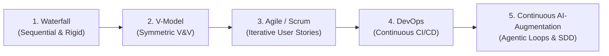
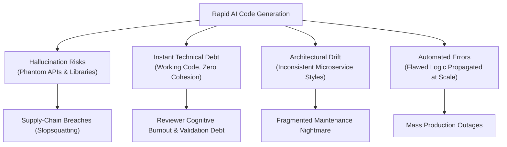
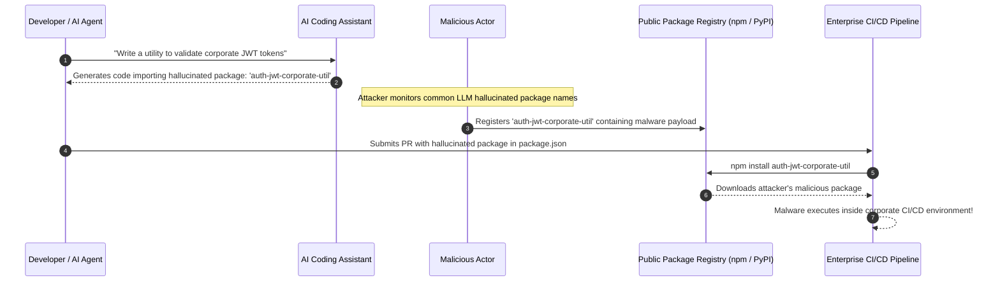
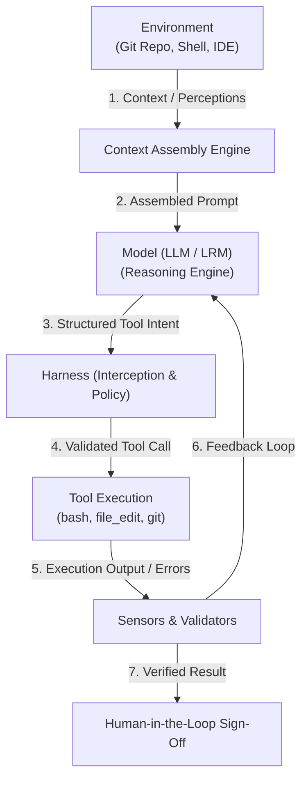
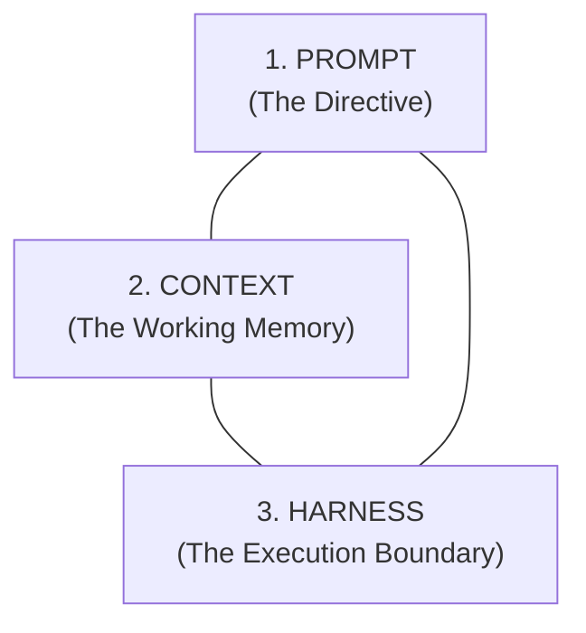

# BITS Pilani WILP — AI-Augmented Software Development Life Cycle (SE* ZG534)
# EC-2 Comprehensive Master Exam Textbook & Cracker

> 🎯 **Your Sole Examination Resource:** This master cracker is designed as the single, self-contained reference you need to score top marks (**28–30 / 30**) in the **EC-2 (Mid-Semester) Examination**. It synthesizes all 8 contact sessions, presentation decks, spoken transcripts of Prof. Akshaya Ganesan, the official BITS course handout, the official sample questions, and industry-standard frameworks from CMU SEI, Daniel Meppiel's Agentic SDLC Handbook, Chip Huyen's AI Engineering, and O'Reilly GenAI software engineering literature.

---

## 📑 Master Table of Contents

* [📖 Quick Decoder for Engineers: Acronyms & Hard Words at a Glance](#-quick-decoder-for-engineers-acronyms--hard-words-at-a-glance)
* [Module 0: The Professor's Exam Blueprint & Answer Engineering Engine](#module-0-the-professors-exam-blueprint--answer-engineering-engine)
  * [1. Official Exam Format, Structure & "3 Minutes per Mark" Time Budget](#1-official-exam-format-structure--3-minutes-per-mark-time-budget)
  * [2. The Professor's Scoring Mindset: Scenario-Based Applied Reasoning](#2-the-professors-scoring-mindset-scenario-based-applied-reasoning)
  * [3. The 3-Part Applied Engineering Answer Anatomy (Full-Mark Scoring Rubric)](#3-the-3-part-applied-engineering-answer-anatomy-full-mark-scoring-rubric)
  * [4. Goldratt's Theory of Constraints & The SDLC Flow Engine](#4-goldratts-theory-of-constraints--the-sdlc-flow-engine)
* [Module 1: Foundations & Paradigm Shift — Evolution, Velocity, and Risk (Lectures 1 & 2)](#module-1-foundations--paradigm-shift--evolution-velocity-and-risk-lectures-1--2)
  * [1. The 5 Eras of SDLC Evolution](#1-the-5-eras-of-sdlc-evolution)
  * [2. The V-Model and Verification & Validation (V&V) Symmetry](#2-the-v-model-and-verification--validation-vv-symmetry)
  * [3. Continuous Delivery vs. Continuous Deployment vs. Release](#3-continuous-delivery-vs-continuous-deployment-vs-release)
  * [4. The DevOps → MLOps → AIOps → Agentic SDLC Axis](#4-the-devops--mlops--aiops--agentic-sdlc-axis)
  * [5. The "40/60 Split" of Developer Time & The Capability-Productivity Gap](#5-the-4060-split-of-developer-time--the-capability-productivity-gap)
  * [6. The Core Software Engineering Tension (Deterministic vs. Probabilistic)](#6-the-core-software-engineering-tension-deterministic-vs-probabilistic)
  * [7. Amplification of Engineering Risk: Hallucinations, Instant Debt & Drift](#7-amplification-of-engineering-risk-hallucinations-instant-debt--drift)
* [Module 2: The 5 Paradigm Shifts in Software Engineering & Economics (Lecture 3)](#module-2-the-5-paradigm-shifts-in-software-engineering--economics-lecture-3)
  * [1. The 5 Major Paradigm Shifts Deep Dive](#1-the-5-major-paradigm-shifts-deep-dive)
  * [2. The Inversion of Engineering Value](#2-the-inversion-of-engineering-value)
  * [3. The 3 Shifts in Software Economics](#3-the-3-shifts-in-software-economics)
  * [4. "Slopsquatting" & Supply-Chain Hallucination Attacks](#4-slopsquatting--supply-chain-hallucination-attacks)
* [Module 3: Fundamentals of AI — Models, Transformers, and Reasoning Engines (Lecture 4)](#module-3-fundamentals-of-ai--models-transformers-and-reasoning-engines-lecture-4)
  * [1. The AI Evolutionary Spectrum (Symbolic → ML → Foundation → Reasoning)](#1-the-ai-evolutionary-spectrum-symbolic--ml--foundation--reasoning)
  * [2. Self-Supervised Learning & Next-Token Prediction](#2-self-supervised-learning--next-token-prediction)
  * [3. The Transformer Architecture & Self-Attention Mechanics](#3-the-transformer-architecture--self-attention-mechanics)
  * [4. System 1 (Pattern Matching) vs. System 2 (Reasoning Models & Test-Time Compute)](#4-system-1-pattern-matching-vs-system-2-reasoning-models--test-time-compute)
  * [5. System 2 Attention (S2A) & Distraction Pruning](#5-system-2-attention-s2a--distraction-pruning)
* [Module 4: Fundamentals of AI — Tokenization, Context Windows & System Guardrails (Lecture 5)](#module-4-fundamentals-of-ai--tokenization-context-windows--system-guardrails-lecture-5)
  * [1. Tokenization Taxonomy: Character vs. Word vs. Subword (BPE)](#1-tokenization-taxonomy-character-vs-word-vs-subword-bpe)
  * [2. How the Model "Sees" Code & Code-Aware Tokenizers](#2-how-the-model-sees-code--code-aware-tokenizers)
  * [3. Context Window Dynamics & The 4 Failure Modes](#3-context-window-dynamics--the-4-failure-modes)
  * [4. Beyond Prompting: System-Level Guardrails & Constrained Decoding](#4-beyond-prompting-system-level-guardrails--constrained-decoding)
* [Module 5: Agentic Architectures, SWE-agent, and Harness Engineering (Lecture 6)](#module-5-agentic-architectures-swe-agent-and-harness-engineering-lecture-6)
  * [1. Anatomy of an AI Agent & The Perception-Action Loop](#1-anatomy-of-an-ai-agent--the-perception-action-loop)
  * [2. The Master Architecture Equation: `Agent = Model + Harness`](#2-the-master-architecture-equation-agent--model--harness)
  * [3. The Cybernetic Governor: Guides (Feedforward) vs. Sensors (Feedback)](#3-the-cybernetic-governor-guides-feedforward-vs-sensors-feedback)
  * [4. Computational Controls vs. Inferential Controls](#4-computational-controls-vs-inferential-controls)
  * [5. The 5 Layers of AI Engineering Maturity](#5-the-5-layers-of-ai-engineering-maturity)
  * [6. The Three-Layer Operating Model: `Spec → Harness → Loop`](#6-the-three-layer-operating-model-spec--harness--loop)
* [Module 6: Advanced AI Engineering, MCP, and AI-Enabled Systems (Lecture 7)](#module-6-advanced-ai-engineering-mcp-and-ai-enabled-systems-lecture-7)
  * [1. Prompt Engineering vs. Fine-Tuning](#1-prompt-engineering-vs-fine-tuning)
  * [2. The Unified Triangle: Prompt vs. Context vs. Harness](#2-the-unified-triangle-prompt-vs-context-vs-harness)
  * [3. AI Engineering vs. Traditional ML Engineering](#3-ai-engineering-vs-traditional-ml-engineering)
  * [4. Model Context Protocol (MCP) Deep Dive (Anthropic Open Standard)](#4-model-context-protocol-mcp-deep-dive-anthropic-open-standard)
  * [5. The Three Layers of the AI Stack](#5-the-three-layers-of-the-ai-stack)
  * [6. CMU SEI AI Complexity Matrix & Engineering AI-Enabled Systems](#6-cmu-sei-ai-complexity-matrix--engineering-ai-enabled-systems)
* [Module 7: Transitioning to AI-Native SDLC & Specification-Driven Development (Lecture 8)](#module-7-transitioning-to-ai-native-sdlc--specification-driven-development-lecture-8)
  * [1. The Friction of Traditional Handoffs & The "Telephone Game"](#1-the-friction-of-traditional-handoffs--the-telephone-game)
  * [2. Specification-Driven Development (SDD): Moving Beyond "Vibe Coding"](#2-specification-driven-development-sdd-moving-beyond-vibe-coding)
  * [3. The 3 Canonical Spec Files (`requirements.md`, `design.md`, `tasks.md`) & Steering](#3-the-3-canonical-spec-files-requirementsmd-designmd-tasksmd--steering)
  * [4. The "Disposable Microservices" Fallacy: Downstream Maintainability Breakdown](#4-the-disposable-microservices-fallacy-downstream-maintainability-breakdown)
  * [5. Local Optimization vs. Systemic Enablers in the Delivery Pipeline](#5-local-optimization-vs-systemic-enablers-in-the-delivery-pipeline)
  * [6. Technical Foundations to Unlock Real AI Value](#6-technical-foundations-to-unlock-real-ai-value)
* [Module 8: The Master Architectural Trade-Off Playbook](#module-8-the-master-architectural-trade-off-playbook)
  * [1. Code Generation Speed vs. Reviewer Cognitive Fatigue (WIP Bloat)](#1-code-generation-speed-vs-reviewer-cognitive-fatigue-wip-bloat)
  * [2. Disposable Regeneration vs. Long-Lived Invariant Maintenance](#2-disposable-regeneration-vs-long-lived-invariant-maintenance)
  * [3. Computational Guardrails vs. Inferential LLM Evaluators](#3-computational-guardrails-vs-inferential-llm-evaluators)
  * [4. Prompt Engineering vs. RAG vs. Fine-Tuning Decision Matrix](#4-prompt-engineering-vs-rag-vs-fine-tuning-decision-matrix)
  * [5. Agentic Autonomy vs. Human-in-the-Loop (HITL) Gate Placement](#5-agentic-autonomy-vs-human-in-the-loop-hitl-gate-placement)
* [Module 9: Master Solved EC-2 Exam Paper (Official Sample & Predicted Scenarios)](#module-9-master-solved-ec-2-exam-paper-official-sample--predicted-scenarios)
  * [Question 1: Specification-Driven, Disposable Microservices (6 Marks — Official Sample)](#question-1-specification-driven-disposable-microservices-6-marks--official-sample)
  * [Question 2: PR Throughput vs. Lead Time for Changes (9 Marks — Official Sample)](#question-2-pr-throughput-vs-lead-time-for-changes-9-marks--official-sample)
  * [Question 3: Supply-Chain Vulnerabilities & Slopsquatting in Autonomous Dependency Resolution (6 Marks — High-Yield Prediction)](#question-3-supply-chain-vulnerabilities--slopsquatting-in-autonomous-dependency-resolution-6-marks--high-yield-prediction)
  * [Question 4: Model Context Protocol (MCP) in Enterprise System Architecture (6 Marks — High-Yield Prediction)](#question-4-model-context-protocol-mcp-in-enterprise-system-architecture-6-marks--high-yield-prediction)
  * [Question 5: Context Saturation, Token Blind Spots & Constrained Decoding (6 Marks — High-Yield Prediction)](#question-5-context-saturation-token-blind-spots--constrained-decoding-6-marks--high-yield-prediction)
* [Module 10: High-Yield Flashcard Cheat Sheet & Rapid Revision Summary](#module-10-high-yield-flashcard-cheat-sheet--rapid-revision-summary)

---

## 📖 Quick Decoder for Engineers: Acronyms & Hard Words at a Glance
*(Written specifically for a 2–3 YOE Software Engineer without an academic machine learning degree)*

| Term / Acronym | Full Name | Plain English Meaning (SDE Context) |
| :--- | :--- | :--- |
| **SDLC** | **Software Development Life Cycle** | The complete journey of software: from requirements $\to$ design $\to$ code $\to$ test $\to$ deploy $\to$ ops. |
| **SDD** | **Specification-Driven Development** | A methodology where human engineers write detailed, version-controlled markdown specs (`requirements.md`, `design.md`, `tasks.md`), and AI generates code strictly against those contracts. |
| **ASR** | **Architecturally Significant Requirement** | A requirement (often non-functional like scalability, security, or data latency) that heavily dictates structural design. |
| **ADR** | **Architecture Decision Record** | A lightweight text document recording *why* a particular technical choice was made, its context, and its trade-offs. |
| **HITL** | **Human-in-the-Loop** | Mandatory human review checkpoints where an engineer or architect approves critical artifacts before they move forward. |
| **BPE** | **Byte-Pair Encoding** | A subword tokenization algorithm that merges frequently co-occurring byte/character pairs so models can represent words and code syntax efficiently. |
| **OOV** | **Out-Of-Vocabulary** | When a word or code symbol is completely missing from a model's tokenizer vocabulary, causing errors or fragmentation. |
| **LLM** | **Large Language Model** | Autoregressive models (like GPT-4o, Claude 3.5 Sonnet) that predict the next token based on learned probability distributions. |
| **LRM** | **Large Reasoning Model** | Models (like OpenAI o1/o3, DeepSeek-R1) that spend "test-time compute" generating internal chain-of-thought tokens to reason before answering. |
| **CoT** | **Chain of Thought** | Step-by-step intermediate reasoning paths generated by an AI model to break down complex logic. |
| **S2A** | **System 2 Attention** | An algorithmic technique where an LLM rewrites and prunes its input prompt to remove irrelevant or distracting context before reasoning. |
| **MCP** | **Model Context Protocol** | An open-source standard (by Anthropic) acting as a "USB-C port for AI"—connecting LLMs to external tools, databases, and APIs via JSON-RPC 2.0. |
| **JSON-RPC** | **JSON Remote Procedure Call** | A lightweight remote procedure protocol encoded in JSON, used by MCP for host-client-server communication. |
| **SSE** | **Server-Sent Events** | An HTTP standard allowing servers to push real-time event streams to clients over a persistent connection (used for remote MCP servers). |
| **`stdio`** | **Standard Input / Output** | The standard OS communication channel (pipes) between processes on the same machine (used for ultra-fast, secure local MCP tools). |
| **RAG** | **Retrieval-Augmented Generation** | Fetching external documents or database records via vector search and injecting them into the LLM's prompt window before generation. |
| **AST** | **Abstract Syntax Tree** | A tree representation of source code structure used by compilers and linters (e.g., Tree-sitter) to validate code syntax deterministically. |
| **WIP** | **Work-In-Progress** | In Lean / Kanban / Theory of Constraints, the amount of unfinished code (open PRs, unreviewed branches) sitting in the delivery pipeline. |
| **Lead Time** | **Lead Time for Changes (DORA)** | The total clock time elapsed from a developer committing code to that code successfully running in production. |
| **Throughput** | **Deployment / PR Frequency** | How many PRs or releases are processed per unit of time. High throughput without flow causes pipeline traffic jams. |
| **Slopsquatting** | *(Hard Word)* | A cyber supply-chain attack where hackers register fake packages on npm/PyPI matching hallucinated library names frequently emitted by LLMs. |
| **Constrained Decoding** | *(Hard Word)* | Forcing an LLM's tokenizer logits during generation so it can *only* emit characters matching a strict grammar or JSON schema. |
| **Inversion of Value** | *(Hard Word)* | When a previously scarce and valuable skill (writing syntax) becomes cheap/free, making upstream design and downstream verification the true valuable skills. |
| **Lost in the Middle** | *(Hard Word)* | The proven tendency of LLMs to recall facts placed at the extreme start (primacy) or end (recency) of a long prompt while ignoring the middle. |
| **Cybernetic Governor** | *(Hard Word)* | A self-regulating feedback control loop that uses "guides" to set expectations and "sensors" to detect errors and steer behavior. |

---

# Module 0: The Professor's Exam Blueprint & Answer Engineering Engine

### 1. Official Exam Format, Structure & "3 Minutes per Mark" Time Budget
* **Nature of Exam:** **CLOSED BOOK**, Written / Online Examination.
* **Duration:** **90 to 120 Minutes** (Typically 90 minutes / 1.5 hours in standard BITS WILP EC-2).
* **Total Marks:** **30 Marks** (Weight: 30% of your total course grade).
* **Syllabus Scope:** **Contact Sessions 1 to 7** (Modules 1 & 2, with transitional SDLC insights from Session 8).
* **Question Paper Architecture (Direct from Prof. Akshaya Ganesan, Lecture 8):**
  * **Number of Questions:** Exactly **5 to 6 major scenario-based questions**.
  * **Subdivisions:** Each question has **2 or 3 equal-weighted sub-parts** (e.g., 3 + 3 marks = 6 marks, or 3 + 3 + 3 marks = 9 marks).
  * **Zero Recall / Zero MCQs:** No one-mark questions, no fill-in-the-blanks, no multiple-choice questions, and no generic textbook regurgitation ("What is Waterfall?").
  * **No Choice:** Every question is compulsory.
* **The Golden Time Formula:**
  $$\text{Time per Mark} = \frac{90\text{ minutes}}{30\text{ marks}} = \mathbf{3\text{ minutes per mark}}$$
  * **3-Mark Sub-Question:** Allocate **9 minutes** (2.5 mins analyzing scenario, 5 mins writing structured points, 1.5 mins verifying keywords).
  * **6-Mark Question (2 sub-parts):** Allocate **18 minutes**.

---

### 2. The Professor's Scoring Mindset: Scenario-Based Applied Reasoning
Prof. Akshaya Ganesan explicitly highlighted in Lecture 8:
> *"There will not be any remembering kind of questions or recall kind of questions. It will all be applied, scenario-based questions where you are put into a situation and you have to justify what works well, what breaks, and why... We are not going to evaluate based on the number of lines or word count. You must be very short, concise, and crisp."*

#### Evaluator Psychology:
1. **No Credit for Generic Fluff:** Writing two paragraphs of generic introductory remarks ("In today's fast-paced world, AI is revolutionizing software...") scores **0 marks**.
2. **High Credit for Specific Terminology:** Using core course concepts correctly (e.g., *Inversion of Engineering Value*, *Theory of Constraints*, *Cybernetic Governor*, *Loss of Tacit Knowledge*, *Computational vs. Inferential Controls*, *Local Optimization vs. Systemic Flow*) instantly earns top-tier marks.
3. **Equally Divided Sub-Parts:** If a 6-mark question has two parts, marks are split exactly $3 + 3$. Focus strictly on what each sub-question asks without bleeding irrelevant points across sections.

---

### 3. The 3-Part Applied Engineering Answer Anatomy (Full-Mark Scoring Rubric)
Whenever answering a 3-mark or 4-mark scenario question, structure your response into this exact 3-part anatomy:

```text
┌────────────────────────────────────────────────────────────────────────┐
│             THE 3-PART APPLIED ENGINEERING ANSWER ANATOMY              │
├────────────────────────────────────────────────────────────────────────┤
│ 1. Direct Diagnostic Hook & Principle Anchor (1 Mark)                  │
│    Name the exact academic/engineering principle at play.              │
│    State the immediate diagnosis (e.g., "Violates Inversion of Value", │
│    or "Local Optimization Trap under Goldratt's Theory of Constraints")│
├────────────────────────────────────────────────────────────────────────┤
│ 2. Deep Structural Mechanism & Downstream Failure (1 Mark)             │
│    Explain WHY it fails in an SDE context. Detail the mechanical cause:│
│    tacit knowledge wipeout, WIP pipeline congestion, validation debt,  │
│    or non-deterministic behavioral drift.                              │
├────────────────────────────────────────────────────────────────────────┤
│ 3. Concrete Architectural Remediation / Alternative Strategy (1 Mark)  │
│    State the exact engineering countermeasure: Spec-driven contract    │
│    testing, cybernetic harness with computational sensors, ephemeral   │
│    environments, or human-in-the-loop sign-offs.                       │
└────────────────────────────────────────────────────────────────────────┘
```

---

### 4. Goldratt's Theory of Constraints & The SDLC Flow Engine
Many exam scenarios (such as Sample Question 2) revolve around the failure of local velocity optimizations. Keep this mental flowchart etched in your mind:

```
[Requirements Elicitation]  --> [Design & Architecture]  --> [Code Implementation]  --> [Code Review & QA]  --> [CI/CD & Deployment]
       (Manual / Slow)              (Manual / Slow)            (AI: 10x Velocity)          (BOTTLENECK)             (BOTTLENECK)
                                                                       │                         ▲                       ▲
                                                                       ▼                         │                       │
                                                             Massive PR Volume (WIP) ────────────┴───────────────────────┘
                                                             (Traffic Jam, Reviewer Fatigue, 4-Week Lead Time Stalled)
```

* **Core Law:** *The throughput of any value stream is dictated strictly by its slowest bottleneck.* 
* **The Trap:** Accelerating code generation when testing and deployment are manual only bloats inventory (WIP), increases context switching, and delays actual customer value.

---

# Module 1: Foundations & Paradigm Shift — Evolution, Velocity, and Risk (Lectures 1 & 2)

### 1. The 5 Eras of SDLC Evolution



1. **Waterfall (Sequential & Rigid):**
   * *Mechanism:* Phased execution (Requirements $\to$ Design $\to$ Implementation $\to$ Verification $\to$ Maintenance). Strict stage gates; no moving forward until previous phase is 100% frozen.
   * *Failure Mode:* Cost of change is exponential ($100\times$ more expensive to fix a requirement defect in production). Total inability to accommodate changing requirements.
2. **V-Model (Verification & Validation Symmetry):**
   * *Mechanism:* Explicit pairing of each development stage with its corresponding testing level. Left wing decomposes the system; right wing validates and integrates it.
3. **Agile / Scrum (Iterative & Empirical):**
   * *Mechanism:* Time-boxed 2-week sprints, working software over comprehensive documentation, rapid customer feedback loops.
   * *Limitation:* While developers iterate quickly, integration and deployment to production remain manual and siloed.
4. **DevOps (Automated Delivery Pipeline):**
   * *Mechanism:* Merges Development and Operations. Automated CI/CD pipelines, Infrastructure-as-Code (IaC), and automated monitoring to achieve rapid, reliable releases.
5. **Continuous AI-Augmented SDLC (Agentic & Spec-Driven):**
   * *Mechanism:* AI is infused across *all* stages, not just coding. Human intent is codified into formal specifications; AI agents assist in design prototyping, code synthesis, test creation, and incident triage, bounded by deterministic validation harnesses.

---

### 2. The V-Model and Verification & Validation (V&V) Symmetry

The V-Model establishes that software engineering requires two distinct cognitive checks:
* **Verification ("Are we building the product right?"):** Ensuring code matches technical design specifications, unit tests pass, and schemas align.
* **Validation ("Are we building the right product?"):** Ensuring the running system meets actual user needs and business objectives.

```text
    DECOMPOSITION & DESIGN                          TESTING & INTEGRATION
   ┌───────────────────────┐                       ┌───────────────────────┐
   │ Business Requirements │◄─────────────────────►│  Acceptance Testing   │ (Validation)
   └───────────┬───────────┘                       └───────────▲───────────┘
               │                                               │
   ┌───────────▼───────────┐                       ┌───────────┴───────────┐
   │ System Specification  │◄─────────────────────►│    System Testing     │
   └───────────┬───────────┘                       └───────────▲───────────┘
               │                                               │
   ┌───────────▼───────────┐                       ┌───────────┴───────────┐
   │  Architecture Design  │◄─────────────────────►│  Integration Testing  │ (Verification)
   └───────────┬───────────┘                       └───────────▲───────────┘
               │                                               │
   ┌───────────▼───────────┐                       ┌───────────┴───────────┐
   │    Module Design      │◄─────────────────────►│     Unit Testing      │
   └───────────┬───────────┘                       └───────────▲───────────┘
               │                                               │
               └───────────────►[ IMPLEMENTATION ]─────────────┘
                                  (AI-Assisted)
```

> ⚠️ **Exam Insight (Prof. Ganesan):** AI heavily accelerates the bottom point (Implementation) and bottom-right (Unit Testing). However, if the top-left (Requirements & System Spec) is ambiguous, AI generates the *wrong system faster*. The symmetry breaks if verification is automated but human validation is neglected.

---

### 3. Continuous Delivery vs. Continuous Deployment vs. Release
BITS evaluators frequently test this distinction in SDLC pipeline questions:

| Dimension | Continuous Delivery (CD) | Continuous Deployment (CD) | Release |
| :--- | :--- | :--- | :--- |
| **Core Definition** | Code is *always in a deployable state* via automated testing, but deployment to production requires a **manual business trigger**. | Every commit that passes the automated pipeline is **automatically deployed to production** with zero human intervention. | The **business act** of making deployed features visible and active for end users (e.g., flipping a feature flag). |
| **Human Gate** | ✅ Yes (Manual sign-off / button click). | ❌ No (100% automated). | ✅ Yes (Product / Marketing sign-off). |
| **Safety Barrier** | Staging approval gates. | Automated canary analysis & instant rollbacks. | Feature toggles, dark launches, ring deployments. |

---

### 4. The DevOps → MLOps → AIOps → Agentic SDLC Axis
Do not confuse these four operational paradigms:

* **DevOps:** Automation of *deterministic software*. Manages the lifecycle of source code via automated builds, test suites, and container deployments.
* **MLOps:** Operationalization of *machine learning models*. Manages the tripartite lifecycle: **Data + Code = Model**. Focuses on feature stores, data drift, model retraining pipelines, and hyperparameter tracking.
* **AIOps:** Applying AI/ML *to operational telemetry*. Using machine learning algorithms to ingest gigabytes of production logs, metrics, and traces to detect anomalies, deduplicate alerts, and automate root-cause analysis for human SREs.
* **Agentic SDLC:** Applying autonomous AI agents and generative intelligence to *the process of software engineering itself* (eliciting requirements, authoring specs, synthesizing code, running test-fix loops).

---

### 5. The "40/60 Split" of Developer Time & The Capability-Productivity Gap
A cornerstone concept emphasized in Lecture 1:

```text
┌────────────────────────────────────────────────────────────────────────┐
│                   THE "40/60 SPLIT" OF DEVELOPER TIME                  │
├────────────────────────────────────────────────────────────────────────┤
│  40% of Time: Writing Code & Syntax                                    │
│  ├─ Typing boilerplate                                                 │
│  ├─ Writing basic unit tests                                           │
│  └─ Implementing API CRUD endpoints                                    │
│     ===> AI Coding Tools accelerate THIS portion by 50–80%!            │
├────────────────────────────────────────────────────────────────────────┤
│  60% of Time: Non-Coding Systemic Activities (THE REAL BOTTLENECK)     │
│  ├─ Understanding ambiguous business requirements                      │
│  ├─ Cross-team architectural alignment & API contract debates         │
│  ├─ Deciphering undocumented legacy systems                            │
│  ├─ Code reviews & debugging complex distributed race conditions       │
│  └─ Waiting for CI/CD runners, QA environments & security approvals    │
│     ===> AI Coding Tools do NOT automatically solve this 60%!          │
└────────────────────────────────────────────────────────────────────────┘
```

#### The AI Capability vs. Deployed Productivity Gap:
* **The Phenomenon:** Raw AI generation capability is exploding (models write syntactically correct code in seconds). However, *deployed enterprise productivity* (features generating actual customer revenue) remains flat or sluggish.
* **Why the Gap Exists:** Software delivery is an end-to-end pipeline. Speeding up typing (the 40%) does not shorten the 60% spent on organizational coordination, environment provisioning, and validation.

---

### 6. The Core Software Engineering Tension (Deterministic vs. Probabilistic)
The foundational theoretical tension governing this entire course:

$$\mathbf{\text{Deterministic System Constraints}} \quad \Longleftrightarrow \quad \mathbf{\text{Probabilistic Model Outputs}}$$

* **Production Software Demands 100% Determinism:** Banking transactions, access-control authorization, compiler builds, and database ACID properties cannot tolerate probabilistic randomness. Given input $X$, the output must reliably be $Y$ every single execution.
* **Generative AI is Fundamentally Probabilistic:** LLMs are next-token probability distribution samplers: $P(w_t \mid w_{<t})$. Prompting the same model with the exact same prompt twice can yield syntactically valid code that subtly alters business logic or edge-case handling.
* **The AI Engineering Mandate:** Software engineering in the AI era is *not* about trusting the model; it is the discipline of building **deterministic software harnesses** (compilers, linters, schemas, test suites) around probabilistic engines to enforce hard operational guarantees.

---

### 7. Amplification of Engineering Risk: Hallucinations, Instant Debt & Drift



1. **Hallucination Risks:** The LLM invents non-existent methods, parameters, or third-party packages (e.g., `import { verifyJwtSecure } from 'auth-super-utils'`).
2. **Instant Technical Debt vs. Unfinished Backlog:**
   * *Unfinished Backlog:* Known features waiting to be built.
   * *Technical Debt:* Hidden structural deficiencies. AI introduces *instant technical debt* because it generates code that passes immediate unit tests but violates enterprise design patterns, creates duplicate abstractions, or introduces unmaintainable spaghetti logic.
3. **Architectural Drift & Erosion:** Different developers using AI prompts generate disparate patterns for error handling, database access, and logging. Over 6 months, the microservice architecture drifts into an unmaintainable zoo of heterogeneous styles.
4. **Automated Errors at Scale:** In manual development, an engineer makes mistakes at human speed (100 lines/day). An AI agent can propagate a subtle security misconfiguration across 50 microservices in 3 minutes.

---

# Module 2: The 5 Paradigm Shifts in Software Engineering & Economics (Lecture 3)

### 1. The 5 Major Paradigm Shifts Deep Dive
Lecture 3 outlines the five tectonic shifts reshaping modern software development:

| Shift | The Paradigm Shift | Traditional Reality | AI-Augmented SDLC Reality | SDE Impact / Exam Takeaway |
| :--- | :--- | :--- | :--- | :--- |
| **Shift 1** | **Effort is no longer the bottleneck** | Writing syntax and implementing features took 80% of sprint time. | Code generation takes seconds. **Code review, verification, and QA** are the new bottlenecks. | Teams drown in PR review queues; reviewer cognitive fatigue becomes the primary constraint. |
| **Shift 2** | **Roles are less siloed** | Strict walls: Product Managers write PRDs, Developers write code, QA writes test scripts. | Roles blur. PMs generate functional prototypes; developers design systems; AI drafts initial test suites. | Software engineers must master end-to-end systems architecture and product intent rather than pure coding. |
| **Shift 3** | **Decisions are less "hard to change"** | Refactoring a monolith to microservices was a 6-month dreaded project. | AI drastically lowers the labor cost of refactoring, syntax translation, and boilerplate migration. | Architectural boundaries still matter, but internal component implementation can be refactored fluidly. |
| **Shift 4** | **Accountability is foggier** | Author of code committed git blame; clear personal liability for bugs. | AI authors the artifact, but the **human engineer signing the PR remains 100% accountable**. | "The AI generated it" is never an acceptable engineering or legal defense. Verification vigilance is mandatory. |
| **Shift 5** | **Outcomes are probabilistic** | Compiler output is strictly deterministic; tests pass or fail reliably. | Model responses vary by temperature, model version, and prompt phrasing. | Deterministic test harnesses and contract tests must wrap every AI interaction to guarantee invariant behavior. |

---

### 2. The Inversion of Engineering Value
One of the most critical theoretical constructs in the course:

```text
    TRADITIONAL SOFTWARE ENGINEERING VALUE            AI-AUGMENTED INVERTED VALUE
   ┌────────────────────────────────────────┐       ┌────────────────────────────────────────┐
   │ ▲ 1. Writing Syntax & Language Idioms  │       │ ▲ 1. System Architecture & Invariants  │ (Highest Value)
   │ │ 2. Memorizing Algorithms & Data Struct│      │ │ 2. Precision Specification Authoring │
   │ │ 3. Manual Unit Test Authoring        │       │ │ 3. Rigorous Code Review & Audit      │
   │ │ 4. System Architecture & Design      │       │ │ 4. Verification Harness Construction │
   │ ▼ 5. Problem Formulation & Specs       │       │ ▼ 5. Raw Code Implementation & Syntax  │ (Commodity / ~Free)
   └────────────────────────────────────────┘       └────────────────────────────────────────┘
```

* **The Core Premise:** Value migrates away from whatever becomes abundant and free.
* **Syntax is a Commodity:** Writing a Python FastAPI endpoint, crafting an SQL query, or implementing a quicksort algorithm is now virtually free ($0 marginal cost).
* **The High-Value Skills of the Modern Engineer:**
  1. **Problem Formulation & Specification Precision:** Codifying ambiguous business intent into mathematically precise, unambiguous acceptance criteria.
  2. **Architectural Invariant Design:** Defining system boundaries, security perimeters, consistency guarantees, and failure modes that *must never be breached*.
  3. **Critical Code Review & Verification:** Spotting subtle race conditions, supply-chain vulnerabilities, and hallucinated security flaws in machine-generated code.

---

### 3. The 3 Shifts in Software Economics

#### Shift A: Marginal Cost of Code Creation vs. Marginal Cost of Verification
$$\text{Cost}(\text{Code Generation}) \to 0 \qquad \text{Cost}(\text{Verification & Maintenance}) \uparrow\uparrow$$
* In traditional engineering, code was expensive to write, so teams naturally wrote less code and scrutinized it during creation.
* In AI engineering, creating 10,000 lines of code takes 30 seconds. However, *reading, verifying, debugging, and maintaining* that code still takes human cognitive time. If teams generate code faster than they can verify it, they incur massive **Validation Debt**.

#### Shift B: CapEx to Continuous Operational OpEx
* Traditional software development incurred mostly Capital Expenditure (developer salaries, upfront software licenses). Once written, the code cost nothing extra to sit in the repo.
* AI-augmented systems incur ongoing **Inference Operational Expenditure (OpEx)**: Every prompt, context assembly, test run, and autonomous loop consumes tokens. Token consumption, API rate limits, and GPU inference hosting become recurring line-item operational costs.

#### Shift C: Disposable Code vs. Long-Lived Assets
* The temptation to treat code as "disposable" (discarding and regenerating whole services instead of refactoring). *Note: See Module 7 for why this creates severe downstream risks.*

---

### 4. "Slopsquatting" & Supply-Chain Hallucination Attacks
A critical cybersecurity vulnerability introduced by AI coding tools:



* **How Slopsquatting Works:**
  1. LLMs frequently hallucinate plausible-sounding package names (e.g., `react-dates-helper`, `aws-s3-stream-uploader`).
  2. Attackers generate millions of prompts, catalog the packages hallucinated by popular models, and preemptively register those names on npm or PyPI with embedded trojans/backdoors.
  3. When an engineer or autonomous agent blindly accepts the code and runs `npm install`, the attacker's payload executes within the corporate network.
* **Engineering Countermeasures:**
  1. **Internal Private Registries (Artifact Proxies):** Configure package managers to fetch exclusively from internal, vetted Artifactory/Nexus proxies with package name whitelisting.
  2. **Automated Package Age & Provenance Scanners:** Reject any package published less than 30 days ago or with zero reputation.
  3. **Strict Lockfiles & Hash Verification:** Enforce signed dependency hashes in `package-lock.json` or `poetry.lock`.

---

# Module 3: Fundamentals of AI — Models, Transformers, and Reasoning Engines (Lecture 4)

### 1. The AI Evolutionary Spectrum (Symbolic → ML → Foundation → Reasoning)

```text
┌────────────────────────────────────────────────────────────────────────┐
│                      THE AI EVOLUTIONARY SPECTRUM                      │
├────────────────────────────────────────────────────────────────────────┤
│ 1. Symbolic AI (1950s–1990s):                                          │
│    Rule-based expert systems, if-else decision trees, formal logic.    │
│    Deterministic, brittle, cannot handle real-world ambiguity.         │
├────────────────────────────────────────────────────────────────────────┤
│ 2. Classical Machine Learning (1990s–2010s):                           │
│    Feature engineering, regression, SVMs, Random Forests.             │
│    Statistical pattern recognition on structured data. Requires manual │
│    feature extraction by data scientists.                              │
├────────────────────────────────────────────────────────────────────────┤
│ 3. Foundation Models / Deep Learning (2017–Present):                   │
│    Transformers pre-trained on massive internet-scale text corpora via │
│    self-supervised next-token prediction (e.g., GPT-4, Claude).        │
│    Generalized zero-shot and few-shot capabilities across tasks.       │
├────────────────────────────────────────────────────────────────────────┤
│ 4. Large Reasoning Models (LRMs) (2024–Present):                       │
│    Models trained with Reinforcement Learning (RL) to utilize          │
│    "Test-Time Compute" (e.g., OpenAI o1/o3, DeepSeek-R1).              │
│    Generates internal chain-of-thought, self-corrects, and backtracks. │
└────────────────────────────────────────────────────────────────────────┘
```

---

### 2. Self-Supervised Learning & Next-Token Prediction
* **Self-Supervised Training:** Foundation models do not require human-labeled datasets during pre-training. Instead, the raw text itself provides the supervision: the model hides the next word and attempts to predict it.
* **The Next-Token Mathematical Objective:**
  $$\mathcal{L}_{LLM} = -\sum_{t=1}^{T} \log P(w_t \mid w_1, w_2, \dots, w_{t-1}; \Theta)$$
* **The SDE Consequence:** An LLM does not possess an internal "fact database" or deterministic code verification engine. It is an extraordinary pattern completion engine. If your prompt presents the beginning of an buggy pattern, it will happily complete that pattern.

---

### 3. The Transformer Architecture & Self-Attention Mechanics
Introduced in the landmark 2017 paper *"Attention Is All You Need"*:
* **Why Transformers Crushed RNNs/LSTMs:** Older Recurrent Neural Networks processed text sequentially (word-by-word), suffering from vanishing gradients and an inability to parallelize across GPUs. Transformers process all tokens in a prompt simultaneously.
* **The Scaled Dot-Product Attention Equation:**
  $$\text{Attention}(Q, K, V) = \text{softmax}\left(\frac{QK^T}{\sqrt{d_k}}\right)V$$
  * **Query ($Q$):** "What am I looking for?" (the current token).
  * **Key ($K$):** "What do I offer?" (all other tokens in the context).
  * **Value ($V$):** "What information do I actually hold?"
  * **Dot-Product ($QK^T$):** Computes pairwise attention scores between every token and every other token.
  * **Division by $\sqrt{d_k}$:** Prevents dot products from exploding into regions with tiny gradients.
  * **Softmax:** Normalizes scores into a probability distribution summing to 1.
* **SDE Intuition:** Self-attention allows a variable declared on line 12 of a function to maintain direct, high-weight semantic coupling with a return statement on line 450, completely overcoming distance barriers in code.

---

### 4. System 1 (Pattern Matching) vs. System 2 (Reasoning Models & Test-Time Compute)
Drawing directly from Daniel Kahneman's cognitive science framework (*"Thinking, Fast and Slow"*):

```text
                     KAHNEMAN'S COGNITIVE DUAL-SYSTEM
   ┌─────────────────────────────────┐     ┌─────────────────────────────────┐
   │     SYSTEM 1 (Fast & Intuitive) │     │    SYSTEM 2 (Slow & Deliberate) │
   ├─────────────────────────────────┤     ├─────────────────────────────────┤
   │ • Autoregressive LLMs (GPT-4o)  │     │ • Reasoning Engines (o1, R1)    │
   │ • Fixed compute per output token│     │ • Dynamic "Test-Time Compute"   │
   │ • Single forward pass           │     │ • Hidden Chain-of-Thought (CoT) │
   │ • Prone to multi-step logic slip│     │ • Self-correction & backtracking│
   │ • Best for: Boilerplate, CRUD,  │     │ • Best for: Complex algorithms, │
   │   syntax translation            │     │   distributed concurrency, ADRs │
   └─────────────────────────────────┘     └─────────────────────────────────┘
```

#### What is "Test-Time Compute"?
* Traditional LLMs use a fixed amount of computation per token (one forward pass through network weights).
* Large Reasoning Models (LRMs) spend extra compute *at inference time* before outputting the first answer token. They generate hundreds of internal hidden reasoning tokens, exploring branches, verifying intermediate assumptions, and discarding bad solutions.
* **Engineering Selection Rule:** Use System 1 models for low-complexity, high-throughput tasks (docstrings, basic test cases, simple refactors). Reserve System 2 models for high-complexity architectural reasoning, concurrency bug diagnosis, and security threat modeling.

---

### 5. System 2 Attention (S2A) & Distraction Pruning
* **The Problem:** When you pass an LLM a prompt filled with conversational banter, old stack traces, or irrelevant code snippets, the model's self-attention weights get diluted ("context pollution").
* **System 2 Attention (S2A) Technique:**
  1. The prompt is first ingested by an attention-refining step.
  2. The model regenerates the prompt, ruthlessly stripping out subjective opinions, conversational noise, and irrelevant context.
  3. The purified, mathematically dense prompt is then passed to the main reasoning model.
* **Result:** Eliminates sycophancy (model agreeing with the developer's flawed premise) and prevents hallucinated solutions caused by context distractors.

---

# Module 4: Fundamentals of AI — Tokenization, Context Windows & System Guardrails (Lecture 5)

### 1. Tokenization Taxonomy: Character vs. Word vs. Subword (BPE)

| Strategy | Granularity | Vocabulary Size | Sequence Length | Code Handling Ability | Why Industry Chose It |
| :--- | :--- | :--- | :--- | :--- | :--- |
| **Character-Level** | Every single letter/symbol (`p`, `r`, `i`, `n`, `t`) | Tiny (~256 symbols) | Massive ($5\times$ to $10\times$ longer) | Excellent (zero OOV) | ❌ **Rejected:** Quadratic attention cost ($O(N^2)$) makes long code contexts computationally intractable. |
| **Word-Level** | Whole words separated by spaces (`getUserProfile`) | Gigantic (>1M words) | Very Short | Disastrous (can't handle camelCase or syntax) | ❌ **Rejected:** Out-Of-Vocabulary (OOV) explosion. Cannot represent arbitrary variable names. |
| **Subword-Level (BPE / Unigram)** | Common words whole; rare words split into chunks (`get`, `User`, `Profile`) | Optimal (50k–128k tokens) | Moderate | **Superior** | ✅ **Standard:** Best trade-off. Balances vocabulary size, sequence length, and code syntax representation. |

---

### 2. How the Model "Sees" Code & Code-Aware Tokenizers
* **The Token Illusion:** Developers think in characters and syntax trees; LLMs think strictly in integer token IDs.
* **Indentation Penalties (Tabs vs. Spaces):**
  * In non-code tokenizers, 4 spaces (`    `) might be encoded as four distinct tokens: `[32, 32, 32, 32]`. In a deeply nested Python or JavaScript file, indentation alone can consume 30% of your context window!
  * **Code-Aware Tokenizers:** Modern tokenizers (e.g., OpenAI `cl100k_base` / `o200k_base`) group common indentation levels (2, 4, 8 spaces) into single tokens, drastically slashing token consumption.
* **Token Blind Spots:**
  * LLMs struggle with character-counting tasks (e.g., *"How many 'r's are in strawberry?"* or character-level string manipulations) because words are mapped directly to integer IDs. The model never "sees" the underlying letters unless explicitly forced to spell them out.

---

### 3. Context Window Dynamics & The 4 Failure Modes
Even with 1-million-token context windows, long contexts suffer from four critical engineering failure modes:

```text
┌────────────────────────────────────────────────────────────────────────┐
│                   THE 4 CONTEXT WINDOW FAILURE MODES                   │
├────────────────────────────────────────────────────────────────────────┤
│ 1. "Lost in the Middle" Phenomenon:                                    │
│    Research proves LLM retrieval accuracy is U-shaped: high at the     │
│    prompt beginning (primacy) and end (recency), but drops by up to    │
│    50% for information buried in the middle of long contexts.          │
├────────────────────────────────────────────────────────────────────────┤
│ 2. Context Pollution & Semantic Dilution:                              │
│    Stuffing irrelevant files, outdated PRDs, or bloated logs dilutes   │
│    self-attention. The model's reasoning degrades, leading to generic  │
│    or contradictory code recommendations.                              │
├────────────────────────────────────────────────────────────────────────┤
│ 3. Quadratic Cost & Latency Degradation:                               │
│    Standard attention computation scales quadratically ($O(N^2)$) with │
│    context length. Massive contexts explode Time-To-First-Token (TTFT)  │
│    and inference costs.                                                │
├────────────────────────────────────────────────────────────────────────┤
│ 4. Hallucination under Saturation:                                     │
│    As the context window approaches 90%+ capacity, the probability of  │
│    confabulation, attribute mixing, and missing constraints rises      │
│    exponentially.                                                      │
└────────────────────────────────────────────────────────────────────────┘
```

---

### 4. Beyond Prompting: System-Level Guardrails & Constrained Decoding
A primary theme taught across Lectures 5 & 6:
> *"Prompting is not engineering. System-level guardrails are."*

* **The Prompting Myth:** Asking an LLM in natural language *"Please return only valid JSON matching this schema"* will fail in 2–5% of requests due to non-deterministic edge cases. In an automated production pipeline, a 2% failure rate is catastrophic.
* **Constrained Decoding (Grammar-Guided Generation):**
  * Instead of hoping the model follows instructions, constrained decoding operates at the **tokenizer logit level**.
  * At each token generation step, the engine parses the current output against a deterministic grammar (e.g., JSON Schema, EBNF).
  * Any token ID that would violate valid JSON syntax or schema rules has its probability logit mathematically forced to $-\infty$.
  * **Result:** 100% mathematically guaranteed valid JSON output on every run.
* **Deterministic Compilers & AST Interceptors:**
  * Wrap the LLM in an execution sandbox. Output code is passed to an Abstract Syntax Tree (AST) parser (like Tree-sitter) and a compiler (TypeScript `tsc`, Python `mypy`). If syntax or type errors occur, the compiler diagnostics are fed back into the model for automated self-correction before human review.

---

# Module 5: Agentic Architectures, SWE-agent, and Harness Engineering (Lecture 6)

### 1. Anatomy of an AI Agent & The Perception-Action Loop



* **Definition of an Agent:** An LLM wrapped in an iterative execution loop equipped with external tools (terminal, file editors, search, APIs) and the autonomy to observe tool outputs, formulate plans, and iterate until a defined goal is satisfied.

---

### 2. The Master Architecture Equation: `Agent = Model + Harness`
The core formula emphasized in Lecture 6:

$$\mathbf{Agent = Model + Harness}$$

* **The Model (Probabilistic Engine):** The raw cognitive capability (e.g., Claude 3.5 Sonnet, GPT-4o, DeepSeek-R1). It possesses no native ability to read files, run bash commands, or enforce security.
* **The Harness (Deterministic Operating System):** The software engineering infrastructure surrounding the model. The harness is responsible for:
  1. Managing state and conversation history.
  2. Assembling and pruning the context window.
  3. Exposing and executing tools via secure sandboxes.
  4. Intercepting model actions to enforce security policies and rate limits.
  5. Parsing compiler/test outputs into feedback signals.

---

### 3. The Cybernetic Governor: Guides (Feedforward) vs. Sensors (Feedback)
Lecture 6 adapts Norbert Wiener's Cybernetics to agentic software engineering:

```text
┌────────────────────────────────────────────────────────────────────────┐
│                   THE CYBERNETIC GOVERNOR ARCHITECTURE                 │
├────────────────────────────────────────────────────────────────────────┤
│ 1. GUIDES (Feedforward Control — Setting Expectations Upfront):        │
│    • System prompts and persona definitions                            │
│    • Project steering guidelines and coding standards                  │
│    • API schemas and tool definition parameters                        │
│    • Few-shot examples demonstrating expected output format            │
│    ===> Guides direct the model toward desired behavior BEFORE run.    │
├────────────────────────────────────────────────────────────────────────┤
│ 2. SENSORS (Feedback Control — Detecting Deviations During Runtime):   │
│    • Linter diagnostics (ESLint, Flake8)                               │
│    • Compiler and type checkers (tsc, mypy)                            │
│    • Automated unit, integration, and regression test suites           │
│    • Security scanning tools (Semgrep, SonarQube)                      │
│    ===> Sensors catch errors AFTER generation and feed them back.      │
└────────────────────────────────────────────────────────────────────────┘
```

---

### 4. Computational Controls vs. Inferential Controls
A crucial distinction tested in system safety and guardrail questions:

| Dimension | Computational Controls | Inferential Controls |
| :--- | :--- | :--- |
| **Core Mechanism** | Hard, deterministic algorithmic code (regex, AST validation, schema enforcers, permission checks). | Soft, probabilistic AI evaluation (e.g., asking another LLM: *"Evaluate if this code is safe"*). |
| **Reliability** | **100% Deterministic**; cannot be hallucinated or bypassed by prompt injection. | **Probabilistic**; prone to false negatives, prompt drift, and sycophancy. |
| **Latency & Cost** | Microseconds ($\mu s$); virtually free compute. | Hundreds of milliseconds; consumes API tokens. |
| **Golden SDE Rule** | **Always prefer Computational Controls.** Use Inferential Controls only for subjective tasks (e.g., tone analysis). |

---

### 5. The 5 Layers of AI Engineering Maturity
Organizations evolve across five distinct maturity levels:

```text
Level 1: Ad-Hoc Prompts (Individual devs copy-pasting code into web ChatGPT)
   │
Level 2: In-IDE Copilots (Inline code autocomplete, basic docstring generation)
   │
Level 3: Grounded Context / RAG (IDE indexing local repository files and docs)
   │
Level 4: Agentic Workflows with Harnesses (SWE-agent loops with tools & compilers)
   │
Level 5: Systemic Autonomous Platforms (Spec-to-deployment pipelines with automated rollback)
```

---

### 6. The Three-Layer Operating Model: `Spec → Harness → Loop`
The standardized operational framework for autonomous development:
1. **Spec (The Intent):** Formal requirements, architectural decision records, and acceptance criteria (`requirements.md`, `design.md`).
2. **Harness (The Boundary):** Sandboxed environment, tool APIs, security guardrails, and deterministic sensors.
3. **Loop (The Engine):** Iterative perception-action execution cycle where the agent reads the spec, writes code, runs sensors, catches errors, and self-corrects until all tests pass.

---

# Module 6: Advanced AI Engineering, MCP, and AI-Enabled Systems (Lecture 7)

### 1. Prompt Engineering vs. Fine-Tuning

```text
┌────────────────────────────────────────────────────────────────────────┐
│                   PROMPT ENGINEERING vs. FINE-TUNING                   │
├────────────────────────────────────────────────────────────────────────┤
│ Prompt-Based Techniques (Prompt Eng / In-Context Learning):            │
│ • Adapts model behavior WITHOUT updating underlying model weights.     │
│ • Zero upfront training cost; instant iteration and zero downtime.     │
│ • Model-agnostic: switch from OpenAI to Anthropic by moving prompts.   │
│ • Limited by context window size; recurring token costs on every call. │
├────────────────────────────────────────────────────────────────────────┤
│ Fine-Tuning (PEFT, LoRA, Full Weight Updates):                         │
│ • Modifies internal network weights via backpropagation on custom data.│
│ • High upfront compute and dataset curation costs.                     │
│ • Permanently instills domain vocabulary, tone, and rigid syntax.      │
│ • Eliminates few-shot prompt token bloat, lowering per-call latency.   │
│ • High maintenance: locked to a specific base model; risks catastrophic│
│   forgetting of general reasoning capabilities.                        │
└────────────────────────────────────────────────────────────────────────┘
```

---

### 2. The Unified Triangle: Prompt vs. Context vs. Harness



* **Prompt (The Directive):** The immediate natural language instruction given to the model (e.g., *"Refactor this authentication handler to use OAuth2"*).
* **Context (The Working Memory):** The rich, dynamic payload assembled into the prompt window (relevant file snippets, AST symbol trees, open API schemas, conversation history, tool definitions).
* **Harness (The Execution Boundary):** The outer deterministic application framework that executes tools, captures exceptions, sandboxes filesystem access, and enforces safety invariants.

---

### 3. AI Engineering vs. Traditional ML Engineering
Lecture 7 highlights a fundamental paradigm inversion:

```text
TRADITIONAL ML ENGINEERING (Model-First / Disjointed):
[Gather & Clean Data] ──► [Train Model] ──► [Evaluate Offline] ──► [Build Product (LAST)]
* Focus: Loss functions, hyperparameter tuning, offline F1-scores.
* Product development is decoupled from model training.

MODERN AI ENGINEERING (Product-First / Systems-Centric):
[Build Product Wrapper] ──► [Use Foundation Model API] ──► [Optimize Harness & Context] ──► [Fine-tune ONLY if needed]
* Focus: User experience, deterministic guardrails, latency, cost, and system reliability.
* Leverages commoditized off-the-shelf foundation models from Day 1.
```

---

### 4. Model Context Protocol (MCP) Deep Dive (Anthropic Open Standard)

#### What is MCP?
* **The "USB-C Standard for AI":** Before MCP, connecting an AI agent to PostgreSQL, GitHub, Slack, and Jira required building $N \times M$ bespoke, proprietary integrations. MCP provides a universal, open-source, standardized protocol for connecting AI hosts to tools and data sources.

#### The Client-Server Architecture:
```text
┌────────────────────────────────────────────────────────────────────────┐
│                        MCP ARCHITECTURAL TOPOLOGY                      │
├────────────────────────────────────────────────────────────────────────┤
│ 1. MCP Host:                                                           │
│    The coordinating AI application (e.g., Claude Desktop, Cursor IDE,   │
│    custom agent runner). Orchestrates user input, LLM reasoning, and   │
│    manages multiple MCP clients.                                       │
│                                                                        │
│ 2. MCP Client:                                                         │
│    An internal adapter inside the Host that maintains a 1:1 connection  │
│    with a specific MCP server, discovers tools, and shuttles context.  │
│                                                                        │
│ 3. MCP Server:                                                         │
│    A lightweight, dedicated program exposing:                          │
│    • Tools: Callable functions (e.g., query_sql(), send_email()).      │
│    • Resources: Readable data streams (e.g., file contents, logs).     │
│    • Prompts: Pre-packaged prompt templates.                           │
└────────────────────────────────────────────────────────────────────────┘
```

#### Communication Protocol & Transports:
* **Protocol:** All messages are formatted as **JSON-RPC 2.0**.
* **Transport 1: `stdio` (Standard Input/Output):**
  * *Use Case:* Local tools and CLI programs running on the developer's machine.
  * *Characteristics:* Ultra-fast, synchronous, process-level isolation, zero network exposure.
* **Transport 2: `SSE` (Server-Sent Events over HTTP):**
  * *Use Case:* Remote enterprise services, cloud-hosted databases, third-party APIs.
  * *Characteristics:* Streaming real-time data, network-routable, secured via OAuth2/TLS.

---

### 5. The Three Layers of the AI Stack
1. **Application Layer (Top):** Agent harnesses, context assembly engines, prompt workflows, user interfaces, MCP host coordination.
2. **Model Layer (Middle):** Foundation models (LLMs/LRMs), reasoning engines, fine-tuned weights, model serving engines (vLLM, Ollama).
3. **Infrastructure Layer (Bottom):** GPU/TPU compute hardware, vector databases, high-speed networking, distributed storage.

---

### 6. CMU SEI AI Complexity Matrix & Engineering AI-Enabled Systems
Drawing from the Carnegie Mellon University Software Engineering Institute (CMU SEI) research:
> *"Invest in systems, not just models. Shift focus away from raw model hype toward building software engineering infrastructures that wrap, constrain, and safeguard probabilistic components."*

#### The 4 Crucial Quality Attributes for AI-Augmented Systems:
1. **Verifiability:** The ability to deterministically prove that an AI-generated artifact meets safety, functional, and performance requirements before release.
2. **Explainability & Traceability:** Maintaining an immutable audit log detailing *why* an agent selected a tool, what context it ingested, and what intermediate reasoning steps occurred.
3. **Data Centricity & Provenance:** Tracking the lineage, freshness, and security classification of all data retrieved into the context window.
4. **Change Propagation & Regression Safety:** Ensuring that modifying a system prompt or upgrading an underlying LLM version does not silently break 20 downstream microservices.

---

# Module 7: Transitioning to AI-Native SDLC & Specification-Driven Development (Lecture 8)

### 1. The Friction of Traditional Handoffs & The "Telephone Game"
* **The Core Flaw of Traditional SDLC:** Manual, clunky handoffs between organizational silos:
  $$\text{Product Manager (PRD)} \;\xrightarrow{\text{drift}}\; \text{Architect (Design)} \;\xrightarrow{\text{drift}}\; \text{Developer (Code)} \;\xrightarrow{\text{drift}}\; \text{QA (Tests)}$$
* **The "Telephone Game" Effect:** Every verbal meeting and informal handoff introduces interpretation error. Intent is degraded at every boundary, leading to massive downstream rework when QA discovers the built system doesn't match product intent.

---

### 2. Specification-Driven Development (SDD): Moving Beyond "Vibe Coding"
* **What is "Vibe Coding"?** An informal, undisciplined practice where developers type loose natural language prompts into an AI assistant, blindly accept generated code, and tweak it until it appears to work. Vibe coding creates catastrophic technical debt, missing edge cases, and zero architectural cohesion.
* **What is Spec-Driven Development (SDD)?** A formal methodology where **the specification is the single source of truth**. Human engineers invest their cognitive effort upfront into writing structured, version-controlled markdown specifications. AI agents then generate code strictly against these contracts under deterministic test verification.

---

### 3. The 3 Canonical Spec Files (`requirements.md`, `design.md`, `tasks.md`) & Steering
Emphasized in Lecture 8 (used by frameworks like Kiro and SpecKit):

```text
┌────────────────────────────────────────────────────────────────────────┐
│                 THE 3 CANONICAL SPECIFICATION ARTIFACTS                │
├────────────────────────────────────────────────────────────────────────┤
│ 1. requirements.md (WHAT to build):                                    │
│    • User stories and business motivation                              │
│    • Functional requirements and non-functional constraints (SLAs)     │
│    • EARS-compliant acceptance criteria (Given-When-Then)              │
├────────────────────────────────────────────────────────────────────────┤
│ 2. design.md (HOW to build it):                                        │
│    • Component topology and data flow diagrams                         │
│    • Strict API schemas (OpenAPI / Protobuf contracts)                 │
│    • Database schemas, indexing strategies, and state machine models   │
│    • Architectural Decision Records (ADRs) explaining trade-offs       │
├────────────────────────────────────────────────────────────────────────┤
│ 3. tasks.md (IN WHAT ORDER to implement):                              │
│    • Ordered, bite-sized, independently testable implementation units  │
│    • Explicit dependency graphs (Task 3 requires Task 1 & 2)           │
│    • Concrete verification steps per task                              │
└────────────────────────────────────────────────────────────────────────┘
```

#### Steering Files (Project-Specific Intelligence):
* Repository-level instruction files (e.g., `steering.md`, `.cursorrules`, `agent-rules.md`) that codify enterprise conventions, security standards (e.g., *"All API endpoints must enforce JWT auth and emit audit logs"*), and coding idioms into the agent's permanent context.

---

### 4. The "Disposable Microservices" Fallacy: Downstream Maintainability Breakdown
*(Directly answers Official Sample Question 1)*

The fantasy championed by naive architects: *"Code generation is free, so never refactor or write unit tests. When requirements change, update the spec and regenerate the entire microservice from scratch."*

#### Why This Strategy Catastrophically Fails (Downstream Maintainability Risks):
1. **Loss of Tacit Knowledge & Undocumented Edge-Case Fixes:**
   * Production systems accumulate hundreds of subtle bug fixes: workarounds for upstream API quirks, OS-level socket timeout tweaks, race-condition mitigations, and compliance edge cases.
   * Developers rarely document 100% of these granular fixes back into high-level specs. When an agent regenerates the service from scratch, all accumulated tacit knowledge is wiped clean, instantly re-introducing dozens of previously resolved production bugs.
2. **Non-Deterministic Behavioral Drift & Contract Brittleness:**
   * LLMs are non-deterministic. Regenerating a service from scratch produces completely different internal algorithms, altered database connection pooling behavior, modified thread concurrency models, and subtle schema variations. Downstream microservices expecting identical timing or error responses fail unpredictably.
3. **The Validation & Testing Paradox:**
   * Declaring that *"we will no longer manually write unit tests"* breaks the fundamental validation harness. Without independent, deterministic boundary test suites, you have zero automated proof that the freshly generated service obeys system invariants.
4. **Supply-Chain Vulnerability Ingestion:**
   * With every scratch generation, the AI agent selects fresh third-party dependencies, opening the door to slopsquatting attacks, deprecated libraries, and security vulnerabilities.

---

### 5. Local Optimization vs. Systemic Enablers in the Delivery Pipeline
*(Directly answers Official Sample Question 2)*

```text
                      THE LOCAL OPTIMIZATION ILLUSION
┌────────────────────┐     ┌────────────────────┐     ┌────────────────────┐
│ Coding Throughput  │     │ Review & QA Queue  │     │ Deployment Pipeline│
│   ▲ 40% Increase   │───► │  MASSIVE BOTTLENECK│───► │  STALLED LEAD TIME │
│ (Local Developer)  │     │  (WIP Accumulation)│     │  (Still 4 Weeks!)  │
└────────────────────┘     └────────────────────┘     └────────────────────┘
```

* **The Fallacy of Local Optimization:** Purchasing AI coding tools for 200 developers makes them type code faster (PR throughput jumps 40%). However, product lead time remains stuck at 4 weeks.
* **The Systems-Thinking Diagnosis (Goldratt's Theory of Constraints):**
  * Coding was never the primary constraint in the enterprise value stream.
  * By flooding downstream stages with 40% more PRs, the organization created a massive **Work-In-Progress (WIP) traffic jam**.
  * Senior engineers spend their afternoons reading unvetted AI PRs (reviewer cognitive fatigue); QA teams are paralyzed waiting for shared staging environments; deployment configurations require manual firefighting.
* **The Remedy:** Shift investment from *local developer tools* to *systemic flow enablers*.

---

### 6. Technical Foundations to Unlock Real AI Value
To turn raw AI coding velocity into real production delivery speed, an organization must prioritize two technical foundations:

1. **Automated Ephemeral Environments & Declarative CI/CD:**
   * *Mechanism:* Developers and AI agents must be able to spin up isolated, on-demand preview environments (via Kubernetes, Docker, and IaC) for every single PR.
   * *Impact:* Eliminates staging environment contention; enables automated end-to-end regression testing without human waiting lines.
2. **Deterministic Verification Harnesses & Automated Contract Testing:**
   * *Mechanism:* Implement automated consumer-driven contract tests (Pact), hermetic integration tests (Testcontainers), and AST-based linters.
   * *Impact:* Catches hallucinations, behavioral drift, and contract violations automatically, relieving human reviewers of basic verification chores so they can focus on high-level architecture.

---

# Module 8: The Master Architectural Trade-Off Playbook

### 1. Code Generation Speed vs. Reviewer Cognitive Fatigue (WIP Bloat)
* **The Tension:** Generating 500 lines of code takes an AI agent 10 seconds. Thoroughly reviewing, mentally parsing, and verifying 500 lines takes an experienced engineer 45 minutes.
* **The Trade-Off:** Maximizing local generation speed without automated verification gates causes **Reviewer Cognitive Fatigue**. Reviewers either rubber-stamp PRs without reading (leading to production outages) or become massive human bottlenecks, stalling delivery.
* **Architectural Remedy:** Restrict agentic PR size to small, atomic commits ($<150$ lines); require passing automated contract and regression tests before any PR reaches a human inbox.

---

### 2. Disposable Regeneration vs. Long-Lived Invariant Maintenance
* **The Tension:** Throwing away code sounds appealing because generation is cheap. However, software systems rely on long-lived contracts and invariants.
* **The Trade-Off Matrix:**
  * *Use Disposable Regeneration for:* Throwaway prototypes, single-file serverless lambdas with zero internal state, benchmark scripts, and UI mockups.
  * *Use Long-Lived Invariant Maintenance for:* Core transactional databases, authentication & authorization microservices, payment gateways, and shared enterprise libraries.

---

### 3. Computational Guardrails vs. Inferential LLM Evaluators
* **The Tension:** Should you validate AI output using another AI model ("LLM-as-a-Judge") or traditional deterministic code?
* **The Trade-Off Matrix:**
  * *Use Computational Guardrails (ASTs, JSON Schemas, Compilers, Regex) for:* Syntax validation, schema conformance, API parameter types, and security permission checks (100% deterministic, zero hallucination).
  * *Use Inferential Guardrails (LLM evaluators) for:* Subjective user experience review, brand voice consistency, semantic clarity of docstrings, and summarizing user intent.

---

### 4. Prompt Engineering vs. RAG vs. Fine-Tuning Decision Matrix

```text
                                  DO YOU NEED TO UPDATE MODEL WEIGHTS?
                                              │
                      ┌───────────────────────┴───────────────────────┐
                      ▼                                               ▼
                     NO                                              YES
     (Prompting / In-Context Learning)                           (Fine-Tuning)
                      │                                               │
        IS EXTERNAL / DYNAMIC DATA NEEDED?               DO YOU REQUIRE SPECIALIZED TONE,
                      │                                 RIGID SYNTAX, OR LOW INFERENCE LATENCY?
         ┌────────────┴────────────┐                                  │
         ▼                         ▼                                  ▼
        NO                        YES                          FINE-TUNING
 (Prompt Engineering)            (RAG)                      (PEFT / LoRA / Full)
 • Fast iteration          • Vector search / MCP       • Permanent style transfer
 • Static system prompts   • Dynamic enterprise docs   • High upfront training cost
```

---

### 5. Agentic Autonomy vs. Human-in-the-Loop (HITL) Gate Placement
* **The Tension:** High autonomy increases execution speed; low autonomy ensures safety and human accountability.
* **The Optimal Enterprise HITL Boundary:**
  * *Autonomous Execution (Zero Human Gate):* Reading files, planning intermediate steps, running local test suites, refactoring internal variable names, generating documentation.
  * *Mandatory Human Gate (HITL Sign-Off):* Modifying public API contracts, executing database schema migrations, adding third-party dependencies (`package.json`), and promoting code to production environments.

---

# Module 9: Master Solved EC-2 Exam Paper (Official Sample & Predicted Scenarios)

---

### Question 1: Specification-Driven, Disposable Microservices (6 Marks — Official Sample)

#### Scenario:
An IT department decides to implement a *"Specification-Driven, Disposable Microservices"* lifecycle. The chief architect declares: *"Since code generation is now virtually free, we will no longer spend time refactoring old code or manually writing comprehensive unit tests. Instead, if a microservice requires modification, we will update our technical design specifications and have an AI agent completely regenerate the service from scratch."*

#### Sub-Questions:
1. **Evaluate this strategy in light of the "Inversion of Engineering Value" (3 Marks)**
2. **Analyze the downstream maintainability risks of this approach (3 Marks)**

---

#### Model Solution — Question 1:

#### Part A: Evaluation in Light of the "Inversion of Engineering Value" (3 Marks)

```text
┌────────────────────────────────────────────────────────────────────────┐
│ EVALUATION RUBRIC BREAKDOWN (Part A):                                  │
│ [1 Mark] Identification of the Inversion Principle & Misconception    │
│ [1 Mark] Analysis of Boundary Verification & Invariant Engineering     │
│ [1 Mark] SDE Synthesis: Specification Precision vs. Free Code Illusion │
└────────────────────────────────────────────────────────────────────────┘
```

1. **Principle Anchor — The Inversion of Value Misunderstanding:**
   * The architect's strategy correctly recognizes the first half of the **Inversion of Engineering Value**: raw code syntax and typing have indeed become a cheap commodity ($MC_{code} \approx 0$).
   * However, the architect fundamentally misunderstands where engineering value has migrated. In an AI-augmented lifecycle, value moves upstream to **specification precision** and downstream to **verification harnesses, boundary constraints, and architectural invariants**.
2. **The Flaw of Eliminating Unit & Boundary Tests:**
   * The architect's declaration to *"no longer manually write comprehensive unit tests"* completely contradicts the inversion principle.
   * Because generative AI is inherently probabilistic, code generation cannot be trusted without a deterministic verification harness. High-level specifications only state *intent*; they cannot catch low-level edge-case regressions without comprehensive, independent boundary tests.
3. **Architectural Synthesis:**
   * Value in modern software engineering is not created by throwing away code; it is created by designing **immutable system invariants and automated verification gates**. Treating code as disposable while abandoning test harnesses results in unconstrained, unverified systems.

---

#### Part B: Downstream Maintainability Risks (3 Marks)

```text
┌────────────────────────────────────────────────────────────────────────┐
│ EVALUATION RUBRIC BREAKDOWN (Part B):                                  │
│ [1 Mark] Loss of Tacit Knowledge & Undocumented Edge-Case Bug Fixes    │
│ [1 Mark] Non-Deterministic Behavioral Drift & Contract Brittleness     │
│ [1 Mark] Supply-Chain Security Ingestion & Validation Debt             │
└────────────────────────────────────────────────────────────────────────┘
```

1. **Loss of Tacit Knowledge & Historical Bug Fixes:**
   * Production microservices accumulate critical tacit knowledge over years of operation (e.g., specific workarounds for third-party API rate limits, database deadlocks, socket timeout configs, and obscure compliance requirements).
   * These nuanced fixes are rarely back-ported into high-level specification documents. Regenerating the service from scratch completely wipes this tacit knowledge, instantly reintroducing dozens of previously resolved production defects.
2. **Non-Deterministic Behavioral Drift & Hidden Side Effects:**
   * Because LLMs are probabilistic, regenerating a microservice from scratch yields completely different internal implementations: altered variable naming, different internal algorithms, modified thread concurrency models, and subtle schema variations.
   * Neighboring microservices in a distributed architecture depend on stable temporal, caching, and error-handling behaviors. Complete regeneration causes unpredictable distributed regressions across service boundaries.
3. **Supply-Chain Ingestion & Exploding Validation Debt:**
   * Scratch generation encourages the AI agent to pick new or hallucinated third-party libraries on each run, creating severe exposure to **slopsquatting** and dependency vulnerabilities.
   * Without unit tests, the burden of discovering runtime bugs shifts entirely to manual end-to-end testing or production monitoring, creating insurmountable **Validation Debt**.

---

### Question 2: PR Throughput vs. Lead Time for Changes (9 Marks — Official Sample)

#### Scenario:
The engineering director of a large financial platform purchases AI-assisted coding tool licenses for all 200 developers. Within a month, the team's pull request (PR) throughput increases by 40%. However, the product's actual time-to-market (lead time for changes) remains unchanged at 4 weeks, and customer feature delivery is still stalled in the pipeline. Developers complain that they are writing code faster but spending their afternoons in meetings, waiting for QA environments, and fighting deployment configurations.

#### Sub-Questions:
1. **Analyze why the 40% increase in PR throughput failed to translate into shorter time-to-market (3 Marks)**
2. **Explain how the organization can shift from a "local optimization" mindset to "systemic enablers" (3 Marks)**
3. **Identify two technical engineering foundations they must prioritize to unlock real AI value (3 Marks)**

---

#### Model Solution — Question 2:

#### Part A: Why 40% PR Throughput Failed to Reduce Time-to-Market (3 Marks)

```text
┌────────────────────────────────────────────────────────────────────────┐
│ EVALUATION RUBRIC BREAKDOWN (Part A):                                  │
│ [1 Mark] Principle: Goldratt's Theory of Constraints / Local Optima    │
│ [1 Mark] Mechanism: WIP Bloat, Reviewer Fatigue & Downstream Queues   │
│ [1 Mark] Metric Contrast: PR Throughput vs. DORA Lead Time for Changes │
└────────────────────────────────────────────────────────────────────────┘
```

1. **The Core Principle — Goldratt's Theory of Constraints:**
   * In any software delivery value stream, the overall throughput (lead time to production) is determined strictly by the **system's slowest bottleneck**, not its fastest stage.
   * Coding was not the organization's constraint. Accelerating code generation was a **local optimization** of developer typing, which does not improve end-to-end flow.
2. **Work-In-Progress (WIP) Bloat & Reviewer Cognitive Fatigue:**
   * Generating 40% more PRs without increasing testing or deployment capacity flooded the pipeline with massive unmerged inventory (WIP).
   * Senior engineers suffered from **reviewer cognitive fatigue**, spending hours parsing high-volume AI PRs. The pipeline choked as unreviewed PRs queued up, creating merge conflicts and extensive context switching.
3. **Downstream Environmental Bottlenecks:**
   * The actual bottlenecks—shared staging environment contention, manual coordination meetings, and brittle deployment configurations—were starved of attention. Flooding a constrained downstream pipeline simply created a massive traffic jam, leaving DORA Lead Time stalled at 4 weeks.

---

#### Part B: Shifting from "Local Optimization" to "Systemic Enablers" (3 Marks)

```text
┌────────────────────────────────────────────────────────────────────────┐
│ EVALUATION RUBRIC BREAKDOWN (Part B):                                  │
│ [1 Mark] Value-Stream Mapping: Shifting from Developer to System Flow │
│ [1 Mark] De-constraining the Bottleneck (Review, Staging, Deployment)  │
│ [1 Mark] Balanced Lifecycle Health Metrics (Moving Beyond Speed)       │
└────────────────────────────────────────────────────────────────────────┘
```

1. **Value-Stream Flow Optimization:**
   * The organization must stop measuring developer productivity by raw activity metrics (lines of code written, PRs opened) and start measuring **systemic flow efficiency**: the frictionless transit of value from idea to customer production.
2. **Subordinating the Pipeline to the Bottleneck:**
   * In accordance with Lean principles, the pace of code creation must be throttled or coupled to the capacity of validation and release gates.
   * Shift organizational investment from front-end code generation to downstream enablement: automating code reviews, eliminating staging environment dependencies, and automating deployment configurations.
3. **Balanced Lifecycle Health Metrics:**
   * Adopt balanced DORA metrics: track **Lead Time for Changes**, **Change Failure Rate (CFR)**, and **Mean Time to Recovery (MTTR)** rather than local PR throughput. If lead time does not shrink and failure rates spike, AI is destroying value.

---

#### Part C: Two Technical Engineering Foundations to Prioritize (3 Marks)

```text
┌────────────────────────────────────────────────────────────────────────┐
│ EVALUATION RUBRIC BREAKDOWN (Part C):                                  │
│ [1.5 Marks] Foundation 1: Automated Ephemeral Environments & CI/CD    │
│ [1.5 Marks] Foundation 2: Deterministic Verification & Contract Tests  │
└────────────────────────────────────────────────────────────────────────┘
```

1. **Foundation 1: On-Demand Ephemeral Preview Environments & Automated CI/CD:**
   * *What to Build:* Containerized, on-demand test environments (using Kubernetes, Docker, and IaC tools like Terraform) spun up dynamically for every open PR.
   * *Engineering Impact:* Eliminates the developer complaint of *"waiting for QA environments."* Every AI-generated PR is validated in its own hermetic, isolated environment and automatically torn down, destroying staging contention.
2. **Foundation 2: Deterministic Verification Harnesses & Automated Contract Testing:**
   * *What to Build:* Implement automated Consumer-Driven Contract Testing (e.g., Pact) and comprehensive integration test suites (e.g., Testcontainers) running inside the automated CI pipeline.
   * *Engineering Impact:* Relieves senior developers of reviewing basic syntactical and contract wiring. AI-generated code is validated automatically against rigid API contracts before a human ever opens the PR, slashing reviewer cognitive fatigue and unclogging the review queue.

---

### Question 3: Supply-Chain Vulnerabilities & Slopsquatting in Autonomous Dependency Resolution (6 Marks — High-Yield Prediction)

#### Scenario:
A fintech startup implements an autonomous AI coding agent within their CI/CD pipeline to automate bug fixing and dependency upgrades. During an automated refactoring run, the agent identifies a missing cryptographic helper and inserts `import { signPayload } from 'fast-crypto-auth-jwt'` into `package.json`. A malicious actor had registered this exact package name on the public npm registry 48 hours earlier after predicting it would be hallucinated by leading LLMs.

#### Sub-Questions:
1. **Explain the mechanism of "Slopsquatting" and how this attack successfully breaches enterprise systems (3 Marks)**
2. **Design an architectural guardrail incorporating "Computational Controls" to prevent this vulnerability (3 Marks)**

---

#### Model Solution — Question 3:

#### Part A: Mechanism of Slopsquatting (3 Marks)
1. **The Hallucination Vector:**
   * LLMs are probabilistic token predictors that generate plausible-sounding identifiers based on linguistic patterns. When a model needs a library that does not exist in standard distributions, it hallucinates a highly semantic name (e.g., `fast-crypto-auth-jwt`).
2. **The Attacker's Reconnaissance & Squatting:**
   * Threat actors prompt public models with thousands of common enterprise coding tasks, catalog hallucinated package names, and programmatically register these names across public repositories (npm, PyPI) with embedded trojans or backdoors ("slopsquatting").
3. **The Enterprise Breach Vector:**
   * When an autonomous agent or developer commits this hallucinated dependency, the automated build runner executes `npm install`. The malicious code executes with the full privileges of the CI/CD runner, allowing attackers to exfiltrate AWS credentials, steal database secrets, or inject backdoors into customer production builds.

---

#### Part B: Architectural Guardrail Design with Computational Controls (3 Marks)
1. **Private Proxy Registry with Strict Allow-Listing (Computational Control):**
   * Configure the CI/CD environment to route all package manager requests strictly through an internal artifact proxy (e.g., JFrog Artifactory or Nexus). Completely disable direct outbound internet access to public npm/PyPI registries.
2. **Automated Package Provenance & Metadata Validation Engine:**
   * Implement a deterministic gate in the CI pipeline that checks package metadata before resolution:
     * **Age Rule:** Automatically reject any package published less than 30 days ago.
     * **Popularity / Reputation Gate:** Enforce a minimum threshold of downloads and verified maintainer signatures.
3. **Mandatory Lockfile Integrity & Human Dependency Gate:**
   * Autonomous agents must be computationally barred from altering `package.json` or `package-lock.json` directly. Adding new third-party dependencies must require a **Human-in-the-Loop (HITL)** cryptographic sign-off from a security architect.

---

### Question 4: Model Context Protocol (MCP) in Enterprise System Architecture (6 Marks — High-Yield Prediction)

#### Scenario:
An enterprise health-tech company is building an AI medical assistant. The system must allow an LLM to look up patient lab records from an on-premise Oracle database, search clinical guidelines from an internal document repository, and send notification SMS alerts to attending doctors.

#### Sub-Questions:
1. **Describe how the Model Context Protocol (MCP) coordinates this workflow across Host, Client, and Server components (3 Marks)**
2. **Contrast the use of `stdio` vs. `SSE` transports for this scenario, recommending the optimal choice for database access vs. external SMS alerts (3 Marks)**

---

#### Model Solution — Question 4:

#### Part A: MCP Architectural Roles (3 Marks)
1. **MCP Host (The Orchestrator):**
   * The AI application interface (e.g., custom doctor portal or IDE). It captures the doctor's query, maintains session context, coordinates with the LLM, and manages the lifecycle of multiple MCP clients.
2. **MCP Client (The Protocol Adapter):**
   * Resides inside the Host. It establishes 1:1 connections with individual MCP servers, queries their tool catalogs using JSON-RPC 2.0 schemas, and presents available capabilities (`query_patient_records`, `send_sms`) to the LLM.
3. **MCP Server (The Secure Tool Provider):**
   * Lightweight microservices exposing specific tools, resources, or prompts:
     * *Database MCP Server:* Translates LLM requests into parameterized SQL queries against Oracle.
     * *SMS MCP Server:* Wraps the telecom provider's REST API.

---

#### Part B: Transport Trade-Offs: `stdio` vs. `SSE` (3 Marks)
1. **Transport Characteristics:**
   * **`stdio` (Standard I/O):** Operates over OS-level process pipes (`stdin`/`stdout`). Ultra-low latency, synchronous, running on the local host with strict process boundary isolation. Zero exposed network ports.
   * **`SSE` (Server-Sent Events over HTTP):** Operates over network protocols. Streams data asynchronously over HTTP, routable across distributed networks, secured via TLS and OAuth2.
2. **Optimal Architectural Recommendation:**
   * **On-Premise Oracle Database $\to$ Use `stdio` (or local private container pipe):** Keeps database credentials and data access strictly within the local secure runtime environment. No open HTTP endpoints, eliminating network eavesdropping risks for HIPAA compliance.
   * **External SMS Notification Service $\to$ Use `SSE` (over HTTPS):** Telecom APIs are remote cloud endpoints. SSE allows asynchronous streaming, handles remote network latency, and integrates seamlessly with cloud API gateways.

---

### Question 5: Context Saturation, Token Blind Spots & Constrained Decoding (6 Marks — High-Yield Prediction)

#### Scenario:
An AI coding assistant is tasked with analyzing a 100,000-line monolithic legacy Java application to extract REST endpoint contracts into a strict OpenAPI JSON schema. The team injects the entire codebase into an LLM with a 1-million-token context window. The resulting output contains invalid JSON syntax, hallucinates several HTTP status codes, and completely omits critical endpoints defined in the middle source files.

#### Sub-Questions:
1. **Analyze the mechanical causes of this failure using Context Window Dynamics ("Lost in the Middle" and Context Pollution) (3 Marks)**
2. **Propose a robust engineering remedy replacing brute-force context stuffing with System-Level Guardrails and Constrained Decoding (3 Marks)**

---

#### Model Solution — Question 5:

#### Part A: Context Window Dynamics Failure Analysis (3 Marks)
1. **"Lost in the Middle" Phenomenon:**
   * Empirical research proves that LLM retrieval accuracy follows a U-shaped curve: high attention at the prompt's start (primacy) and end (recency), but dramatic performance drops (up to 50%) for information located in the center. The omitted endpoints were buried in the middle of the massive token payload.
2. **Context Pollution & Semantic Dilution:**
   * Stuffing 100,000 lines of raw Java code (including boilerplate getters/setters, build scripts, and imports) dilutes self-attention weights. The model's scaled dot-product attention cannot isolate critical endpoint annotations from irrelevant boilerplate.
3. **Token Blind Spots & Output Syntax Errors:**
   * LLMs sample next-token probabilities. In long contexts, high cognitive load leads to syntax drift. A single misplaced bracket or trailing comma breaks JSON parsing.

---

#### Part B: System-Level Engineering Remedy (3 Marks)
1. **Deterministic AST Parsing (Tree-sitter) instead of Raw Context Stuffing:**
   * Do not pass 100,000 lines of raw text to the model. Use an Abstract Syntax Tree (AST) parser to programmatically extract *only* the Spring/JAX-RS controller route annotations (`@GetMapping`, `@PostMapping`, path strings, parameter types).
   * Assemble a clean, concentrated 2,000-token context payload containing only architectural endpoint signatures.
2. **Constrained Decoding (Grammar-Guided Generation):**
   * Enforce the OpenAPI specification using **Constrained Decoding** at the tokenizer logit level.
   * The inference engine masks out any token that does not conform to valid OpenAPI JSON schema rules. This guarantees 100% syntactically valid JSON output with zero missing quotes or malformed structures.
3. **Automated Schema Validation Pipeline:**
   * Pass the generated schema through an automated validator (`swagger-parser`). If errors occur, the compiler diagnostics are fed back into the agentic loop for automated correction.

---

# Module 10: High-Yield Flashcard Cheat Sheet & Rapid Revision Summary

| Mental Anchor | Core Rule / Formula | SDE Exam Trigger |
| :--- | :--- | :--- |
| **The Inversion of Value** | Code syntax is cheap/free ($MC_{code} \to 0$); upstream specification and downstream verification are the true high-value assets. | Trigger when asked about disposable code, free code generation, or shifting developer roles. |
| **Goldratt's Law in SDLC** | Optimizing a non-bottleneck (coding) does not shorten lead time; it only bloats inventory (WIP) and causes reviewer burnout. | Trigger when asked why PR throughput increased but time-to-market remained stalled. |
| **The Core Tension** | Software systems must be **100% deterministic**; GenAI models are **probabilistic token samplers**. | Trigger when justifying why prompt engineering alone cannot guarantee production safety. |
| **Master Agent Equation** | $$\mathbf{Agent = Model + Harness}$$ | Trigger when asked what constitutes an AI agent or how to safeguard autonomous loops. |
| **Cybernetic Governor** | **Guides** (Feedforward: prompts, schemas) set expectations; **Sensors** (Feedback: linters, tests) catch deviations. | Trigger when designing guardrails, feedback loops, or SWE-agent architectures. |
| **Control Hierarchy** | **Always prefer Computational Controls** (deterministic ASTs/regex) over **Inferential Controls** (probabilistic LLM judges). | Trigger when designing security, guardrails, or validation gates. |
| **Slopsquatting Defense** | Hallucinated package names registered by attackers on npm/PyPI. Defend using private proxy registries and package age filters. | Trigger when discussing security vulnerabilities in AI code generation or dependency resolution. |
| **MCP Architecture** | Host coordinates $\to$ Client connects $\to$ Server provides Tools & Resources via JSON-RPC 2.0 over `stdio` (local) or `SSE` (remote). | Trigger when integrating external databases, tools, or APIs with LLMs. |
| **The "40/60 Split"** | Developers spend 40% typing code and 60% on coordination, review, and environments. AI only accelerates the 40%. | Trigger when explaining why buying Copilot licenses doesn't double engineering velocity. |
| **The 3 Canonical Specs** | `requirements.md` (What) $\to$ `design.md` (How / ADRs) $\to$ `tasks.md` (Order of implementation). | Trigger when explaining Specification-Driven Development (SDD) or Kiro/SpecKit. |
| **Lost in the Middle** | LLMs recall start and end of prompt reliably, but forget the middle. Avoid massive context stuffing; use AST pruning and RAG. | Trigger when analyzing failure modes of large context windows. |
| **Constrained Decoding** | Masking tokenizer logits to mathematically guarantee generated output matches a strict JSON schema or grammar. | Trigger when asked how to guarantee valid structured outputs without syntax errors. |

---
*End of Master Exam Cracker. Read thoroughly, structure your answers using the 3-Part Anatomy, and score 30/30!*
