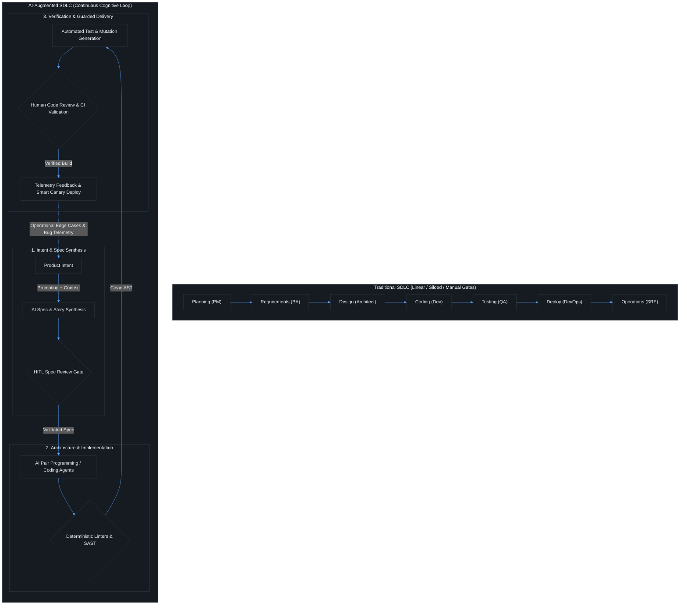

# Contact Session 1: Course Introduction & The AI-Augmented SDLC Landscape

**Course:** SEZG534: AI-Augmented Software Development Life Cycle (BITS Pilani WILP)  
**Instructor:** Prof. Akshaya Ganesan  
**Module:** Module 1: Foundations and Paradigm Shift – Evolution, Velocity, and Risk  
**SDLC Stage Focus:** Cross-cutting / Full Lifecycle Overview  
**Core Theme:** AI accelerates raw code synthesis like an unthrottled producer, but deployed engineering productivity is governed strictly by downstream verification bottlenecks, cognitive review fatigue, and deterministic system invariants.

---

## 1. Executive Overview & Problem Context (The 2-Minute Story)

### The 2-Minute Story: The 10x Pull Request Incident
> It is 4:45 PM on a Friday. A junior backend engineer enables GitHub Copilot and prompts it to refactor a monolithic payment reconciliation service into three clean microservices. Fifteen minutes later, a Pull Request lands in the repository: **+1,850 lines of code across 24 files**.
> 
> On the surface, the diff is pristine. The syntax compiles cleanly, method docstrings are immaculate, and unit tests pass with green checkmarks. But when the tech lead begins reviewing the diff, a nightmare unfolds:
> 1. The AI quietly stripped out **PostgreSQL Row-Level Security (RLS)** tenant isolation filters on two SQL queries, exposing multi-tenant account balances across enterprise customers.
> 2. It imported an unvetted third-party npm package (`fast-string-utils-v2`) hallucinated by the model that does not exist on the internal corporate registry.
> 3. The generated unit tests are **circularly validated**—the model wrote both the logic and the assertions, asserting that its own mocked bugs were "expected behavior."
> 
> The tech lead spends six agonizing hours reverse-engineering the AI's logic, while the CI/CD test runners stall under memory thrashing. The team misses the sprint release window.
> 
> **The Engineering Lesson:** Raw typing speed was never the bottleneck in software engineering. Generating 2,000 lines of code in seconds only shifts the burden downstream, creating catastrophic cognitive review fatigue and technical debt. In an enterprise system, code that cannot be deterministically verified is not an asset—it is an outage waiting to happen.

### What is this lecture about?
Contact Session 1 introduces **SEZG534: AI-Augmented Software Development Life Cycle**, establishing the engineering reality of modern software development under generative AI acceleration. Rather than treating AI as an autonomous developer that replaces engineers, the course frames AI as an **augmentative cognitive accelerator** that radically alters developer workflows, team interactions, and lifecycle control points. 

Prof. Akshaya Ganesan emphasizes that writing code represents only a minor fraction of what software engineers do. While Large Language Models (LLMs) and coding assistants (e.g., GitHub Copilot, Claude Code, Cursor) make code generation nearly instantaneous, they do not automatically yield deployed business value. Without rigorous engineering guardrails, verification gates, and architectural oversight, AI acceleration simply floods downstream pipelines with low-quality code, security vulnerabilities, and unmaintainable technical debt.

### The Paradigm Shift (Waterfall → Agile → DevOps → Continuous AI Augmentation)
The software development lifecycle has evolved across four distinct eras, each addressing the bottleneck of its predecessor:
1. **Waterfall (1970s):** Highly structured, linear, phase-gated handoffs (Plan → Specify → Design → Code → Test → Deploy). The bottleneck was requirement flexibility and multi-month feedback loops.
2. **Agile (2000s):** Iterative sprints, cross-functional teams, and working software over documentation. The bottleneck shifted to continuous integration and manual regression testing.
3. **DevOps / CI/CD (2010s):** Automated build, test, and continuous deployment pipelines breaking the wall between Dev and Ops. The bottleneck shifted to test automation runtime, pipeline stability, and cloud infrastructure management.
4. **Continuous AI Augmentation (2020s+):** Developers collaborate continuously with probabilistic AI models and autonomous agents at every SDLC phase.

```text
[Waterfall: Phased Handoffs] ──> [Agile: Iterative Sprints] ──> [DevOps: Automated CI/CD] ──> [Continuous AI Augmentation: Probabilistic Generation + Deterministic Gates]
```

#### The Bottleneck Inversion
* **The Eliminated Bottleneck:** The mechanical act of typing and synthesizing baseline syntax, boilerplates, standard algorithms, and simple CRUD endpoints (raw code generation).
* **The New Engineering Bottleneck:** **Cognitive verification fatigue, deep architectural review, prompt debugging, and validation debt.** When code is generated in seconds, engineers spend the majority of their mental energy reading, verifying, security-scanning, and troubleshooting non-deterministic code.

### Velocity vs. Risk Trade-Off
AI velocity introduces fundamental engineering friction:
* **The Velocity Promise:** Near-zero marginal cost of drafting code, rapid scaffolding of prototypes, instantaneous log analysis, and automated test stub generation.
* **The Amplified Risks:**
  * *Hallucinated Dependencies & Logic:* Plausible-looking code that invokes non-existent libraries or packages (hallucinated package attacks).
  * *Architectural Drift:* AI generates isolated functions without holistic awareness of system-wide architectural invariants, eroding microservice boundaries.
  * *Governance & Trust Gap:* Inability to audit probabilistic outputs leads to high hesitation in deploying AI to critical production stages.
  * *Reviewer Overwhelm:* Junior developers flooding Git repositories with massive, unverified Pull Requests (PRs) that overwhelm senior maintainers.

### Course Roadmap Placement
* **Current Position:** Session 1 of 16. Acts as the executive orientation to course themes, evaluation schemes, and lifecycle mapping.
* **Direct Connectors:**
  * *Preceding:* Classical SDLC foundations (Prerequisite Software Engineering knowledge).
  * *Succeeding (Sessions 2 & 3):* Detailed exploration of SDLC phase compression, risk amplification (technical debt, hallucination, circular validation), and economic trade-offs.
  * *Midterm Boundary (Sessions 1–8):* Closed-book theoretical grounding up to Coding & Refactoring.
  * *Comprehensive Scope (Sessions 1–16):* Full lifecycle including Testing, CI/CD, Governance, and Telemetry.

---

## 2. Core Concepts Explained Simply (with Tech Quick-Primers)

### Concept 1: The AI Capability vs. Deployed Productivity Gap
* **What is it? (Simple Definition):** An exponential rise in AI raw output capability does **not** equal a proportionate increase in actual, shipping software productivity.
* **How It Works (Step-by-Step):**
  1. An LLM generates code at 10x developer typing speed.
  2. The generated code enters the organizational delivery pipeline.
  3. The code encounters real-world friction points: flaky integration tests, unverified database schemas, security vulnerability reviews, and legacy architectural constraints.
  4. The code stalls at human review gates because senior engineers cannot verify AI logic as fast as it was produced.
  5. *Net Result:* A 500% surge in raw code output results in only a 5–10% improvement in shipped production features.

> 💡 **Tech Quick-Primer (`Apache Kafka`):** A distributed event streaming platform sitting between asynchronous producers and consumers. Decouples ingestion pipelines to absorb backpressure when message production outpaces downstream consumer processing capacity.

> 💡 **Tech Quick-Primer (`PostgreSQL Row-Level Security (RLS)`):** A fine-grained security engine built directly into PostgreSQL. Restricts query result sets based on the executing user's tenant context, preventing cross-tenant data leaks regardless of application-layer queries.

* **The Deterministic vs. Probabilistic Friction Point:** Generative models output probabilistic approximations of correct software. However, production operating systems, relational databases, and microservices demand 100% deterministic correctness. Reconciling this mismatch requires human or automated verification at every step.
* **Real-World Engineering Example:** Think of this in terms of **Kafka backpressure**: If an unthrottled producer floods a Kafka topic with 100,000 events/sec, but your downstream consumer group writing to PostgreSQL can only process 500 writes/sec, the system doesn't run faster—consumer lag skyrockets, disk storage exhausts, and brokers fail. LLM code generation is an unthrottled producer; code review and production verification are the downstream consumer bottleneck.
* **Key Boundaries & Distinctions:** High AI code volume $\neq$ High organizational velocity. Output is raw volume; productivity is verified, resilient business value running safely in production.

---

### Concept 2: The "40/60 Split" of Developer Time
* **What is it? (Simple Definition):** The empirical distribution of a professional software engineer's workday, proving why automating coding syntax alone cannot solve software delivery bottlenecks.
* **How It Works (Step-by-Step):**
  * **40% — Core Feature Implementation:** Direct coding, syntax generation, and active debugging of the immediate ticket.
  * **60% — Cognitive & Operational Overhead:**
    1. *Context Switching & Coordination:* Transitioning between Jira backlogs, Slack incidents, standups, and production alerts.
    2. *System Mental Modeling:* Reading and reverse-engineering complex distributed microservices, legacy monoliths, and outdated API specs before touching code.
    3. *Pipeline & Review Delays:* Awaiting CI/CD builds, code reviews from peer developers, security clearance, and product clarifications.
    4. *Infrastructure & Config:* Troubleshooting local environments, Dockerfiles, Helm charts, Kubernetes YAML manifests, and database migrations.

> 💡 **Tech Quick-Primer (`SonarQube`):** A static code analysis and SAST (Static Application Security Testing) platform running inside CI pipelines. Parses Abstract Syntax Trees (ASTs) to flag security vulnerabilities, code smells, and bugs before human review.

* **The Deterministic vs. Probabilistic Friction Point:** AI assistants target the 40% (syntax generation). But they historically worsen the 60% by introducing bloated PRs, confusing context drift, and non-deterministic build breakages.
* **Real-World Engineering Example:** If an engineer spends 3 hours a day coding and 5 hours navigating legacy systems and CI checks, doubling coding speed saves 1.5 hours at most. But if unreviewed AI code doubles PR review time and breaks staging environments, the engineer loses 3 hours in triage, resulting in a net negative productivity day.
* **Key Boundaries & Distinctions:** Writing code (syntactic activity) vs. Software Engineering (holistic lifecycle management, architectural alignment, reliability, and security).

---

### Concept 3: Augmentation vs. Replacement Paradigm
* **What is it? (Simple Definition):** AI acts as an assistive "copilot" or cognitive amplifier for human developers, not an autonomous agent operating without human oversight.
* **How It Works (Step-by-Step):**
  1. *Intent Formulation:* The human engineer defines the problem boundary, architectural constraints, and interface specifications.
  2. *AI Generation:* The LLM generates candidate code, test stubs, or documentation based on provided context.
  3. *Human Triage & Verification:* The human engineer reviews the output line-by-line, checks edge cases, and verifies compatibility.
  4. *Deterministic Execution:* Automated linters, static analysis tools (SAST), compilers, and unit tests validate the output.
  5. *Commit & Ownership:* The human developer commits the code under their own name, accepting full professional and legal accountability.

> 💡 **Tech Quick-Primer (`Docker`):** An OS-level virtualization platform using Linux cgroups and namespaces. Packages application code and dependencies into immutable, isolated container images to guarantee identical runtime behavior across local machines and production clusters.

* **The Deterministic vs. Probabilistic Friction Point:** An LLM does not carry legal, financial, or operational liability. When a production outage occurs, the root cause cannot be blamed on "the prompt." The human who approved the commit owns the incident post-mortem.
* **Real-World Engineering Example (The 10% Physical Analogy):** Consider a modern commercial airliner cockpit. The automated flight control system (autopilot) handles routine trajectory maintenance and throttle adjustments, but the human pilots remain legally and operationally responsible for takeoff, landing, turbulence recovery, and emergency protocols. AI is the flight director; the software engineer is the pilot in command.
* **Key Boundaries & Distinctions:**
  * *Autocomplete/Augmentation:* AI suggests lines or routines; human reviews and accepts (e.g., Copilot).
  * *Autonomous Replacement:* AI writes, approves, and deploys without human intervention (an anti-pattern in mission-critical enterprise systems).

---

### Concept 4: The Empirical Industry Adoption Landscape (PwC, Stack Overflow & Anthropic Data)
* **What is it? (Simple Definition):** Real-world industry metrics highlighting where AI is succeeding and where teams strictly avoid it due to the "Governance Gap."
* **Key Empirical Benchmarks (2025/2026 Data):**
  * **Anthropic Economic Index:**
    * **36%** of software engineering roles use AI for at least 25% of their daily tasks.
    * **4%** use AI extensively across the bulk of their work without human intervention.
    * **57%** of AI usage is strictly augmentative rather than autonomous replacement.
  * **Stack Overflow Developer Survey:**
    * **84%** of developers use or plan to use generative AI tools.
    * **51%** use them on a daily basis.
    * **76% Avoidance in Deployment & Monitoring:** High resistance to letting AI manage production cutovers, canary rollouts, and operational telemetry.
    * **69% Avoidance in Project Planning & Architecture:** Reluctance to let AI dictate long-term system roadmaps and resource allocation.
  * **The METR Maintainer Study (2025/2026):**
    * In controlled experiments, 16 experienced open-source maintainers using early AI tools were measured to be **19% slower** on complex real-world maintenance tasks.
    * *Root Cause:* The time spent prompting, reading unfamiliar AI code, debugging subtle logic errors, and correcting syntax exceeded the time it would have taken an expert to write the solution manually.
* **The "Stack Drift" Phenomenon:**
  * On GitHub, **Python officially overtook JavaScript** as the #1 language by project volume (98% YoY surge in generative AI repositories).
  * Traditional web development centered on deterministic CRUD applications written in JavaScript/TypeScript. The modern paradigm centers on Python-based ML pipelines, RAG systems, and agentic orchestration.

---

## 3. Visual Architectural / System Models (Dark-mode Mermaid diagrams)

### Traditional SDLC vs. Continuous AI-Augmented SDLC



### Diagram Walkthrough:
1. **From Siloed Handoffs to Continuous Collaboration:** In the traditional SDLC, each stage produces static artifacts (PRDs, architecture diagrams, test plans) passed over institutional silos with high friction. In the AI-augmented lifecycle, AI assists at every single transition.
2. **Deterministic Checkpoints Between Stages (Gate 1, 2, 3):** AI-generated artifacts are never permitted to flow directly into the next phase without passing through a validation gate. 
   - *Gate 1:* Human-in-the-loop (HITL) checks AI-generated specifications for hallucinated requirements or compliance omissions.
   - *Gate 2:* Static analysis tools (SonarQube), compilers, and linters verify syntactic validity and AST integrity before code review.
   - *Gate 3:* Rigorous peer review and automated CI pipelines prevent circular validation (where AI tests blindly pass AI bugs).
3. **The Operational Feedback Loop:** Edge cases, unhandled exceptions, and telemetry logs from production deployments feed backward into the initial prompt context, closing the loop between operations and requirements.

---

## 4. Key Trade-Offs & Comparisons (Structured markdown tables)

### Comprehensive SDLC Comparison Table

| SDLC Phase | Traditional Approach (Pre-AI) | AI-Augmented Approach (2025/2026) | Engineering Risk & Governance Trade-Off |
| :--- | :--- | :--- | :--- |
| **1. Planning & Feasibility** | Manual estimation, expert judgment, historical Jira metrics. | AI-assisted historical backlog analysis, synthetic story point estimation. | **Risk of Overconfidence:** AI estimations lack business context and political reality; requires human sanity check. |
| **2. Requirements Analysis** | BAs write lengthy SRS/PRD documents through manual stakeholder interviews. | LLMs summarize interview transcripts, generate acceptance criteria & Gherkin scenarios. | **Omission & Drift Risk:** LLMs omit subtle negative requirements (what the system must *not* do). Mandatory HITL sign-off. |
| **3. Architecture & Design** | Architects hand-craft UML diagrams, ER schemas, and ADRs over weeks. | AI scaffolds Architecture Decision Records (ADRs) and structural design patterns. | **Architectural Erosion:** AI generates local point-solutions that violate global system topologies (e.g., breaking microservice boundaries). |
| **4. Implementation (Coding)** | Developers manually write syntax, boilerplates, and business logic line-by-line. | AI pair-programming (Copilot, Claude Code) generates methods, refactors legacy code. | **Code Smells & CVE Injection:** AI copies vulnerable public patterns (SQL injection, outdated crypto). Linters & SAST mandatory. |
| **5. Testing & QA** | QA engineers write test scripts, boundary checks, and end-to-end suites. | AI generates comprehensive unit tests, mocks, and property-based test cases. | **Circular Validation:** If the same LLM writes both code and test, it mirrors its own flawed assumptions, guaranteeing a 100% false pass rate. |
| **6. Deployment & CI/CD** | DevOps manually writes Terraform/K8s manifests and monitors canary cutovers. | AI optimizes build caching, diagnoses pipeline breakages, and drafts YAML scripts. | **Blast Radius Panic:** 76% of teams reject automated AI deployments. Production cutover must remain strictly human-supervised. |
| **7. Monitoring & Ops** | SREs create manual alerts, read Prometheus dashboards, and execute runbooks. | AI ingests noisy distributed logs, clusters stack traces, and correlates root causes. | **Hallucinated Remediation:** AI incident bots may execute destructive restart/truncate commands. Read-only AI diagnostics permitted. |

### Decision Matrix: When to Automate vs. Enforce Mandatory HITL

```text
                  HIGH RISK (Production, Data, Auth, Infra)
                                ▲
                                │
        [PARANOID HITL GATES]   │   [DUAL-SIGN OFF & STRICT SAST]
        - Production Deployment │   - Auth / Payment Code
        - Security Permissions  │   - Database Schema Migrations
        - Cloud IAM Policies    │   - Core Architecture ADRs
                                │
  ──────────────────────────────┼──────────────────────────────► HIGH COMPLEXITY
                                │
        [AUTOMATED WITH SAST]   │   [AI-ASSISTED WITH REVIEW]
        - Docstring Generation  │   - Complex Algorithmic Logic
        - Unit Test Scaffolding │   - Refactoring Monolithic Code
        - Boilerplate DTO/POJOs │   - Legacy Code Migration
                                │
                                ▼
                    LOW RISK (Internal, Ephemeral, Docs)
```

* **Automate with Automated Guardrails (No Human Bottleneck):** Generating docstrings, generating boilerplate data transfer objects (DTOs), formatting code, clustering raw error logs.
* **Mandatory Human-in-the-Loop (Non-Negotiable Sign-Off):** 
  - Deploying artifacts to production.
  - Modifying database schemas or dropping tables.
  - Authentication, encryption, and cryptographic key management.
  - Architecture Decision Records (ADRs) that commit teams to multi-year technical strategies.

---

## 5. Professor's Practical Tips & Oral Insights (Exam traps, caveats)

*(Extracted directly from Prof. Akshaya Ganesan's spoken lecture)*

### 1. Real-World Engineering Insights
* **The "Throughput Mismatch" Reality:** Don't boast about generating 1,000 lines of code in two minutes. If your QA and security approval process takes four days, your net engineering velocity is zero. The system boundary dictates throughput, not the typing speed of an assistant.
* **The 40/60 Reality Check:** If you want to make engineering teams faster, stop focusing exclusively on code editors. The biggest productivity drains are meeting sprawl, outdated internal documentation, unclear PRD requirements, and waiting on sluggish CI pipelines.
* **Stack Drift to Python:** The explosion of Python over JavaScript on GitHub proves that modern applications are no longer simple CRUD interfaces. Applications are increasingly infused with local models, vector databases, and agentic orchestration.

### 2. Common Traps & Anti-Patterns
* **The "Blind Tab" Habit:** Blindly pressing `Tab` to accept GitHub Copilot or IDE suggestions without reading the logic. This injects subtle semantic bugs that pass compilers but fail silently in edge-case production scenarios.
* **The "Blank Page Paralysis" vs. "Review Exhaustion":** AI solves the blank-page problem (getting started is easy), but creates reviewer exhaustion. PRs are becoming 3x larger, leading to senior engineers skimming code and approving catastrophic bugs.
* **The METR Maintainer Trap:** Believing that AI makes experienced developers instantly faster. As shown in empirical studies, maintainers were 19% slower because prompt iteration and debugging unfamiliar AI code took longer than writing it from scratch.

### 3. Student Questions & Classroom Debates
* **Student Question (Abhinav Mukherjee):** *"Will AI replace software engineers entirely, or are we just changing our job description?"*
  * **Prof. Akshaya's Resolution:** Software development is leading AI adoption, but 57% of usage is strictly augmentative. Only 4% use AI across the bulk of their work without human intervention. We are not moving toward an "AI SDLC" where humans vanish; we are building an "AI-Augmented SDLC" where human judgment, verification, and governance are more critical than ever.
* **Student Question (Gurdeep Singh):** *"How will traditional enterprise project management tools (like MS Project, Jira) stitch together with AI agents?"*
  * **Prof. Akshaya's Resolution:** Tools will shift from passive record-keeping to active orchestration. Instead of a developer manually moving a Jira ticket, AI agents connected via standard protocols (like Model Context Protocol - MCP) will summarize commit diffs, verify acceptance criteria, and update project boards automatically—but release control remains with the engineering lead.

### 4. Exam Strategy & Warning
* **Closed-Book Midterm Warning (EC-2, 30%):** You will be tested on precise definitions, foundational models, empirical figures (the 40/60 split, Anthropic index benchmarks), and phase-by-phase risk trade-offs. You must understand the structural differences between traditional and AI-augmented phases.
* **Open-Book Comprehensive Exam Warning (EC-3, 40%):** Prof. Akshaya explicitly warned:
  > *"Do not simply copy-paste definitions from the slides or reference books. Copying slides gets you exactly zero marks. The comprehensive exam will give you an enterprise failure scenario (e.g., an AI-injected security leak or a pipeline deadlock) and ask you to design the quality gates and guardrail architecture to fix it."*

### 5. Lab & Practical Tooling Alignment
* **Lab 1 (Requirements Synthesis & ADRs):** Teaches how to take messy user interview audio, extract structured user stories, and enforce HITL checklists to catch missing non-functional requirements.
* **Lab 2 (Pair Programming & Legacy Refactoring):** Enforces `.cursorrules` and prompt guardrails to refactor legacy code while preventing hallucinated CVE injections.
* **Lab 3 (Automated Test Generation):** Implements automated test generation harnesses while enforcing test separation to prevent circular validation.

---

## 6. Exam-Ready Question Bank (Part A: 2–3 mark; Part B: 5–10 mark with rubrics)

### Part A: Short-Answer Conceptual Questions (Mid-Semester Test Focus)

#### Q1: Define the "40/60 Split" in software engineering time allocation. Why does AI code generation fail to provide a 10x overall productivity boost? (3 Marks)
* **Model Answer:**
  * **Definition:** The 40/60 split states that software developers spend only **40% of their working time on core feature work** (writing code, debugging, and unit testing), while **60% is consumed by non-coding operational and cognitive overhead** (meetings, understanding legacy architecture, context switching, PR reviews, CI/CD pipeline waiting, and Jira administration).
  * **Why 10x Fails:** Generative AI primarily accelerates the syntax generation within the 40% bucket. Even if AI made typing 10x faster, the remaining 60% operational overhead remains unaffected (and often worsens due to larger PRs and review fatigue). Therefore, overall lifecycle throughput increases by only a modest margin.

#### Q2: Contrast "Augmentative AI" with "Autonomous Replacement" in the context of the SDLC. (2 Marks)
* **Model Answer:**
  * **Augmentative AI:** The AI functions as an assistive "copilot" generating proposals, stubs, and suggestions. A human developer remains in the loop (HITL), critically reviews the code, executes deterministic checks, and retains 100% legal and operational accountability.
  * **Autonomous Replacement:** The AI agent acts without human intervention, directly committing code, running builds, and deploying to production. In modern enterprise SDLCs, autonomous replacement is avoided for high-risk stages due to non-deterministic failure modes and the lack of an accountable entity.

#### Q3: What is the "Governance Gap" identified in the Stack Overflow and PwC 2025/2026 industry reports? (2 Marks)
* **Model Answer:**
  * The Governance Gap refers to the sharp divergence between daily AI adoption and enterprise trust. While over 84% of developers use AI tools for low-risk tasks (coding boilerplate, reading docs), **76% of teams strictly avoid AI for high-risk stages (production deployment, cloud infrastructure, and monitoring)** because current AI tools lack deterministic reliability, auditability, and formal verification guardrails.

#### Q4: State the fundamental tension between Generative AI outputs and Enterprise Software Systems. (3 Marks)
* **Model Answer:**
  * **Enterprise Software Systems:** Must be **100% deterministic, predictable, secure, and reproducible**. A given input must always produce the exact expected output under all conditions.
  * **Generative AI Models:** Are inherently **probabilistic, stochastic, and non-deterministic**. The same prompt can yield different outputs, hallucinated package dependencies, or subtle logical variations.
  * **The Friction:** Engineering teams must design rigid deterministic guardrails (compilers, AST analyzers, linters, and verification test suites) to safely harness probabilistic AI outputs within deterministic systems.

---

### Part B: Analytical & Scenario Questions (Comprehensive Exam Focus)

#### Scenario Q1: Designing an Enterprise Quality Gate to Mitigate AI Review Fatigue (10 Marks)
**Context:** GlobalFin Corp mandates GitHub Copilot across its 200-developer backend engineering organization. Over three months, the engineering VP observes that PR volume has increased by 75%, but the deployment cycle time has slowed by 22%. Senior developers report severe cognitive fatigue from reviewing AI-generated pull requests that look superficially elegant but contain subtle security flaws (e.g., missing tenant isolation checks in SQL queries) and hallucinated dependencies.

**Tasks:**
1. Diagnose the root cause of the productivity collapse using concepts from Contact Session 1. *(2 Marks)*
2. Design a 3-tier verification pipeline (combining automated tools and human checkpoints) to restore velocity without compromising security. *(5 Marks)*
3. Identify the specific governance rule GlobalFin must enforce regarding PR accountability. *(3 Marks)*

---

#### Detailed Model Answer & Scoring Breakdown:

##### 1. Problem Diagnosis & Context (2 Marks)
* **Root Cause Diagnosis:** GlobalFin has fallen into the **"Capability vs. Productivity Gap"** and the **"Bottleneck Inversion."** While junior developers used Copilot to eliminate the typing bottleneck, they shifted the burden downstream into the code review phase, creating **Reviewer Fatigue**.
* The developers treated Copilot output as production-ready rather than an unverified probabilistic draft. Because LLMs generate syntactically convincing but semantically flawed code, senior engineers are forced to spend disproportionate cognitive energy reverse-engineering AI logic, acting as "human linters."

##### 2. Proposed 3-Tier Verification Pipeline (5 Marks)


* **Tier 1: Local Deterministic Guardrail (Pre-Commit Hook):**
  * Automated execution of static analysis (SAST) and linters (ESLint, SonarQube, Semgrep).
  * Automated secret-scanning to ensure no API keys, private tokens, or hardcoded credentials were generated by the LLM.
* **Tier 2: CI Pipeline Package & AST Verification Gate:**
  * **Package Whitelist Enforcement:** To prevent "hallucinated package attacks," the build pipeline automatically checks all imported libraries against an internal corporate artifact registry (Nexus/Artifactory). Any unapproved package halts the build immediately.
  * **Diff-Bounded PR Rules:** PRs exceeding 300 lines of code generated with AI assistance are automatically rejected by the CI bot, forcing developers to break changes into small, reviewable chunks.
* **Tier 3: Structured Human-in-the-Loop (HITL) Checkpoint:**
  * Senior engineers review only *semantically verified* PRs that have passed Tiers 1 and 2.
  * The PR template mandates an **AI Contribution Disclosure** detailing which functions were AI-generated and documenting the human developer's verification test cases.

##### 3. Governance Rule & Accountability Mandate (3 Marks)
* **The "Zero-AI Liability" Principle:** GlobalFin must institute an explicit policy: **"The human committer owns 100% of the liability for the committed code."** An engineer cannot cite Copilot as an excuse for an outage or security breach.
* **Mandatory Dual-Sign Off for High-Risk Modules:** Any change touching authentication, financial calculations, or database schemas requires explicit approval from two senior architects, ensuring that probabilistic code never touches core financial ledgers without rigorous manual scrutiny.

##### Scoring Keywords Checklist (Mandatory for Full Marks):
- [x] Bottleneck Inversion / Reviewer Fatigue *(1 Mark)*
- [x] Capability vs. Productivity Gap *(1 Mark)*
- [x] Deterministic Pre-Commit Linters / SAST *(1 Mark)*
- [x] Hallucinated Dependency / Package Whitelisting *(1 Mark)*
- [x] Diff-Bounded Pull Requests *(1 Mark)*
- [x] Human-in-the-Loop (HITL) Tiered Architecture *(1 Mark)*
- [x] Developer Ownership & Liability Policy *(2 Marks)*
- [x] Clear Pipeline Architecture / Flow Diagram *(2 Marks)*

---

## 7. Quick Revision & 60-Second Exam Recap (Glossary, 5 Golden Rules, Rapid Q&A)

### Key Terms & Acronym Glossary
* **SDLC:** Software Development Life Cycle — the end-to-end framework defining tasks performed at each step in software development.
* **HITL (Human-in-the-Loop):** A governance pattern where critical decisions or artifacts require explicit human validation before proceeding to subsequent stages.
* **Bottleneck Inversion:** The structural shift where AI eliminates the code typing bottleneck, making code review and verification the primary lifecycle bottleneck.
* **Context Drift:** The degradation of an LLM's reasoning quality as extraneous or conflicting tokens fill its context window.
* **Circular Validation:** The testing flaw where an AI model generates both the code and its tests, using the same flawed assumptions to achieve false 100% test passes.
* **AST (Abstract Syntax Tree):** A tree representation of the syntactic structure of source code, used by compilers and linters to deterministically verify code validity.
* **DORA:** DevOps Research and Assessment — industry standard metrics (Deployment Frequency, Lead Time for Changes, Change Failure Rate, Time to Restore Service).
* **Code Churn:** The rate at which an engineering codebase is modified, deleted, or rewritten shortly after being committed (often elevated by low-quality AI code).
* **RLS (Row-Level Security):** Database mechanism restricting which data rows can be queried based on tenant or user identity.

### The 5 Golden Rules of AI-Augmented SDLC
1. **AI Output $\neq$ Deployed Productivity:** Accelerating code generation does not yield business value unless downstream review, testing, and deployment gates are equally optimized.
2. **Deterministic Systems Require Deterministic Gates:** Never validate probabilistic LLM output with another probabilistic LLM prompt alone; always verify using static analysis, compilers, and test suites.
3. **The Committer Owns the Code:** AI has zero accountability. The human developer who accepts the suggestion owns every bug, CVE, and performance regression.
4. **Beware Reviewer Exhaustion:** It is 10x faster to generate 500 lines of AI code than to rigorously review it. Enforce small, diff-bounded PRs.
5. **Protect High-Risk Gates:** Never permit autonomous AI execution on production deployments, database migrations, or security IAM permissions.

### 60-Second Rapid-Fire Q&A
* **Q: What is the 40/60 split?**  
  *A: Developers spend 40% of time on core feature work/coding and 60% on cognitive/operational overhead.*
* **Q: What percentage of developers avoid AI for deployment and monitoring?**  
  *A: 76% (due to the governance and trust gap).*
* **Q: What programming language recently overtook JavaScript as #1 on GitHub?**  
  *A: Python, driven by a 98% YoY surge in GenAI and agentic repositories.*
* **Q: What happened to experienced maintainers in the METR study when first using AI?**  
  *A: They became 19% slower due to prompt iteration and unfamiliar code debugging.*
* **Q: What are the examination formats for this course?**  
  *A: Mid-Term (EC-2, 30%) is Closed-Book (definitions/mechanisms); Comprehensive (EC-3, 40%) is Open-Book (scenario design and failure analysis).*
