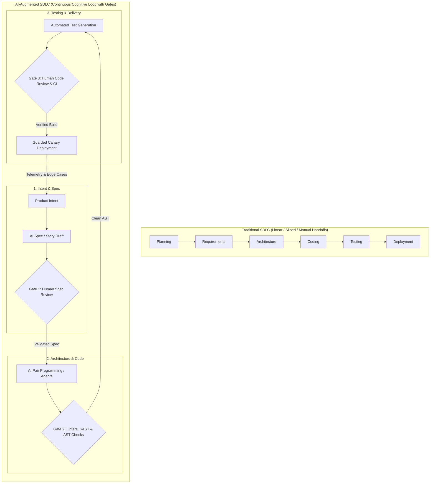

# Lecture 1: Course Introduction & The AI-Augmented SDLC Landscape

**Course:** SEZG534: AI-Augmented Software Development Life Cycle (BITS Pilani WILP)  
**Instructor:** Prof. Akshaya Ganesan  
**Module:** Module 1: Foundations & Paradigm Shift  
**Core Theme:** AI accelerates raw code synthesis like an unthrottled producer, but real engineering productivity is strictly governed by downstream verification bottlenecks, cognitive review fatigue, and deterministic system invariants.

---

## 1. The Big Picture (Why Should I Care?)

- **What is this lecture about?**  
  Writing code is only a fraction of what a software engineer does. While generative AI tools (Copilot, Claude Code, Cursor) can generate hundreds of lines of code in seconds, they do not automatically produce shipping business value. This lecture introduces the fundamental shift from traditional SDLC to an AI-augmented lifecycle.
- **The Real-World Problem:**  
  A junior developer uses an AI coding assistant to refactor a monolithic service into microservices in 15 minutes, generating a 2,000-line Pull Request. On the surface it compiles cleanly, but it quietly drops database tenant isolation, imports a non-existent hallucinated npm library, and includes unit tests that assert its own bugs are correct. Reviewing and fixing that PR takes senior engineers hours. Raw typing was never the bottleneck—downstream verification is.
- **Where this fits in the SDLC & Course:**  
  This is the foundational kickoff lecture setting up the 16-session roadmap. It establishes the core tension between probabilistic LLMs and deterministic enterprise systems before future sessions dive into requirements, architecture, coding, testing, CI/CD, and governance.

---

## 2. Core Concepts Explained Simply

### Concept 1: The AI Capability vs. Deployed Productivity Gap

- **What is it?**  
  An exponential rise in AI raw code-generation output does **not** equal a proportionate increase in actual, shipping software productivity.
- **Why do we need it?**  
  Engineering leaders must understand that unthrottled AI code generation creates a downstream logjam: flaky tests, security reviews, and human PR approval delays. A 500% surge in code volume often yields only a 5–10% increase in deployed features.
- **Simple Real-World Example:**  
  Think of it as **Kafka backpressure**: If an unthrottled producer floods a Kafka topic with 100,000 events/sec, but your downstream database consumer can only write 500 records/sec, the system doesn't speed up—lag explodes, queues fill up, and the broker stalls. AI code generation is the unthrottled producer; code review is the consumer bottleneck.
- **Tech Quick-Primer:**
  > 💡 **Tech Quick-Primer (`Apache Kafka`):** A distributed event streaming platform that sits between producers and consumers to absorb backpressure when message production outpaces consumer capacity.
- **Key Distinction / Rule of Thumb:**  
  *High code volume $\neq$ high engineering velocity.* Output is raw code volume; productivity is working, verified software running safely in production.

---

### Concept 2: The "40/60 Split" of Developer Time

- **What is it?**  
  The empirical reality that professional developers spend only **40% of their workday actively coding**, while **60% is spent on non-coding operational overhead**.
- **Why do we need it?**  
  It explains why automating syntax alone can never provide a 10x overall productivity boost.
  * **40% (Core Feature Work):** Writing syntax, local debugging, and direct ticket implementation.
  * **60% (Cognitive & Operational Overhead):** Context switching, reading legacy architecture, deciphering outdated specs, waiting on CI builds, and participating in code reviews.
- **Simple Real-World Example:**  
  If an engineer spends 3 hours coding and 5 hours navigating legacy services, Docker setups, and meetings, cutting coding time in half saves only 1.5 hours. But if unreviewed AI code doubles PR review delays, net productivity actually goes down.
- **Tech Quick-Primer:**
  > 💡 **Tech Quick-Primer (`SonarQube`):** A static code analysis (SAST) platform that automatically checks code for bugs, security vulnerabilities, and code smells during CI builds.
- **Key Distinction / Rule of Thumb:**  
  Typing speed is rarely the critical path in software engineering. System comprehension and validation dominate developer time.

---

### Concept 3: Augmentation vs. Autonomous Replacement

- **What is it?**  
  AI acts as an assistive "copilot" or cognitive amplifier for humans (**Augmentation**), rather than an unsupervised agent that independently writes, commits, and deploys code (**Autonomous Replacement**).
- **Why do we need it?**  
  An LLM carries zero legal, operational, or financial accountability. When a production outage occurs, you cannot blame the prompt. The human committer must understand and own every line deployed.
- **Simple Real-World Example:**  
  Commercial aircraft cockpits: The autopilot manages altitude, heading, and routine thrust adjustments, but human pilots remain 100% accountable for takeoff, landing, turbulence recovery, and emergency protocols. AI is the copilot; the engineer is the pilot in command.
- **Key Distinction / Rule of Thumb:**  
  *Autocomplete/Copilot:* AI suggests; human reviews and accepts.  
  *Autonomous Agent:* AI decides and acts without human checkpoints (unacceptable in mission-critical enterprise systems).

---

### Concept 4: The Empirical Industry Adoption Landscape

- **What is it?**  
  Hard industry data (Stack Overflow, PwC, Anthropic) showing where AI succeeds and where engineering teams actively avoid it due to trust and governance gaps.
- **Key Industry Benchmarks:**
  * **Anthropic Economic Index:** 57% of AI usage in software is augmentative; only 4% is autonomous replacement without human intervention.
  * **Stack Overflow Survey:** 84% of developers use or plan to use AI tools, but **76% actively avoid using AI for production deployment and monitoring**, and **69% avoid it for system architecture**.
  * **The METR Maintainer Study:** In controlled tests, experienced open-source maintainers using early AI tools were **19% slower** on complex tasks because prompt iteration and debugging unfamiliar AI code took longer than writing it from scratch.
  * **Stack Drift:** Python officially overtook JavaScript as the #1 language by project volume on GitHub, driven by an explosion of generative AI repositories.
- **Key Distinction / Rule of Thumb:**  
  Developers love AI for low-risk tasks (boilerplate, syntax, unit test stubs), but distrust it for high-blast-radius operations (deployment, cloud infrastructure, IAM permissions).

---

### Concept 5: The Bottleneck Inversion

- **What is it?**  
  The structural flip caused by AI in the development lifecycle: writing initial code is no longer the bottleneck; **code review, architectural verification, cognitive fatigue, and validation debt** are the new bottlenecks.
- **Why do we need it?**  
  Because generating code is nearly free, junior engineers can flood repos with massive PRs. Senior engineers get exhausted trying to spot subtle bugs in AI-generated code that looks syntactically flawless.
- **Simple Real-World Example:**  
  Submitting a 1,500-line PR generated by prompting an IDE assistant. The code compiles, but a senior developer must spend 4 hours verifying that no SQL queries bypass security filters or cause database deadlocks.
- **Key Distinction / Rule of Thumb:**  
  Generating code has become cheap; verifying and maintaining code has become more expensive.

---

### Concept 6: The Core Software Engineering Tension (Deterministic vs. Probabilistic)

- **What is it?**  
  The fundamental clash at the heart of AI-augmented software engineering:
  * **Enterprise Software Systems:** Must be **100% deterministic, predictable, secure, and reproducible**.
  * **Generative AI Models:** Are inherently **probabilistic, stochastic, and non-deterministic**.
- **Why do we need it?**  
  You cannot deploy probabilistic outputs straight into deterministic systems without guardrails (compilers, linters, AST checks, integration test suites, and human review).
- **Simple Real-World Example:**  
  An LLM might generate code that imports a package `fast-string-utils-v2` that doesn't actually exist (a hallucinated package attack). A deterministic CI check against an approved corporate package whitelist instantly catches and blocks this.
- **Key Distinction / Rule of Thumb:**  
  Never validate probabilistic AI output using another probabilistic AI prompt alone; always verify using deterministic compilers, linters, and test harnesses.

---

## 3. Visual Workflow & Architecture Models

### Traditional SDLC vs. Continuous AI-Augmented SDLC

### Diagram Walkthrough:
* **From Silos to Continuous Collaboration:** Traditional SDLC relies on rigid, slow document handoffs between roles. AI-augmented SDLC integrates AI assistance across all phases.
* **Deterministic Gates (Gates 1, 2, 3):** AI outputs never flow unchecked into the next phase. Human reviews check specifications (Gate 1), automated linters and SAST verify code structure (Gate 2), and CI test suites plus senior reviews catch logic flaws (Gate 3).
* **Operational Feedback Loop:** Telemetry and production bug reports feed directly back into prompt context, closing the loop between operations and requirements.

---

## 4. Key Comparisons & Trade-Offs

### SDLC Phase Comparison: Traditional vs. AI-Augmented

| SDLC Phase | Traditional Approach | AI-Augmented Approach | Key Engineering Trade-Off |
| :--- | :--- | :--- | :--- |
| **1. Requirements** | Business analysts write long PRDs manually over weeks. | AI drafts user stories, acceptance criteria, and Gherkin tests from notes. | **Omission Risk:** AI misses negative requirements ("what NOT to do"). Human review mandatory. |
| **2. Architecture** | Architects draw UML and write Architecture Decision Records (ADRs). | AI scaffolds ADR templates and suggests candidate structural patterns. | **Architectural Drift:** AI creates localized fixes that violate global boundaries. |
| **3. Coding** | Developers manually write boilerplate, business logic, and APIs. | AI pair-programmers generate methods and boilerplate syntax. | **Review Fatigue:** Cheap code creation floods reviewers with large PRs. |
| **4. Testing** | QA engineers write test scripts, boundary checks, and mocks. | AI auto-generates unit tests, mock data, and edge-case inputs. | **Circular Validation:** AI tests its own code using the same flawed assumptions. |
| **5. Deployment** | DevOps engineers write deployment manifests and monitor canaries. | AI drafts Helm/YAML scripts and diagnoses pipeline failures. | **Blast Radius Risk:** 76% of teams reject automated AI deployments. Cutover must be human-controlled. |
| **6. Monitoring** | SREs create alerts, monitor dashboards, and read runbooks. | AI clusters error logs, aggregates stack traces, and pinpoints root causes. | **Hallucinated Fixes:** AI diagnostic bots must never run destructive restart/drop commands. |

### Decision Rule: When to Automate vs. Enforce Mandatory Human Review (HITL)

| Risk Level | Tasks | Governance Policy |
| :--- | :--- | :--- |
| **Low Risk** | Docstring generation, boilerplate DTOs, code formatting, log clustering | **Automate with Linters** (No human bottleneck) |
| **Medium Risk** | Refactoring isolated functions, writing unit test stubs, drafting ADRs | **AI-Assisted + Human Review** |
| **High Risk** | Production deployments, database migrations, Auth/payment code, IAM policies | **Strict Human-in-the-Loop (HITL) Gate** |

---

## 5. Professor's Practical Takeaways & Golden Rules

*(Key insights emphasized by Prof. Akshaya Ganesan in lecture)*

1. **Beware the "Throughput Mismatch":**  
   Generating 1,000 lines of code in 2 minutes is meaningless if your QA and security approval process takes 4 days. Net engineering throughput is dictated by your system's bottleneck, not your typing speed.
2. **The "Blind Tab" Habit is Dangerous:**  
   Blindly pressing `Tab` to accept AI suggestions without carefully reading the logic injects subtle semantic bugs that pass compilers but fail silently under production load.
3. **The Committer Owns the Code:**  
   AI has zero accountability. The engineer who approves and commits the code owns 100% of the liability for outages, security breaches, and performance regressions.
4. **Enforce Small, Diff-Bounded PRs:**  
   Because AI makes generating code effortless, teams must cap PR sizes (e.g., <= 300 lines) to prevent senior engineers from burning out during reviews.
5. **Classroom Discussion Insights:**
   * *Will AI replace engineers?* No. 57% of usage is augmentative, and only 4% is autonomous. Engineering is shifting toward judgment, system design, and verification.
   * *How will tools like Jira connect with AI?* Through open protocols like Model Context Protocol (MCP), where agents read context, update task states, and link commits automatically under human supervision.

---

## 6. Quick Recap & Terminology Cheatsheet

### Key Terms in 1 Line
* **SDLC:** The structured framework of stages (plan, design, code, test, deploy, monitor) used to build software.
* **HITL (Human-in-the-Loop):** A governance pattern requiring explicit human approval before high-risk actions proceed.
* **Bottleneck Inversion:** The shift where code generation becomes fast, turning code review and verification into the primary bottleneck.
* **Circular Validation:** The testing flaw where an AI model generates both code and tests, mirroring its own flawed assumptions to achieve false 100% pass rates.
* **AST (Abstract Syntax Tree):** A tree representation of code syntax used by compilers and linters to verify validity deterministically.
* **DORA Metrics:** Industry metrics (Deployment Frequency, Lead Time, Change Failure Rate, MTTR) used to measure engineering delivery health.
* **Code Churn:** The rate at which committed code is modified or deleted shortly after being written (often elevated by unchecked AI code).

### 4 Core Mental Rules to Remember
1. **AI Output $\neq$ Shipped Value:** Accelerating code generation only helps if review, testing, and deployment gates can keep pace.
2. **Deterministic Systems Demand Deterministic Gates:** Never verify probabilistic LLM output with another prompt alone; always use compilers, linters, and unit tests.
3. **The Human Committer Owns Everything:** You cannot blame the AI prompt for a production outage.
4. **Keep AI Far from High Blast Radii:** Never allow autonomous AI execution on production deployments, database migrations, or IAM permissions.
