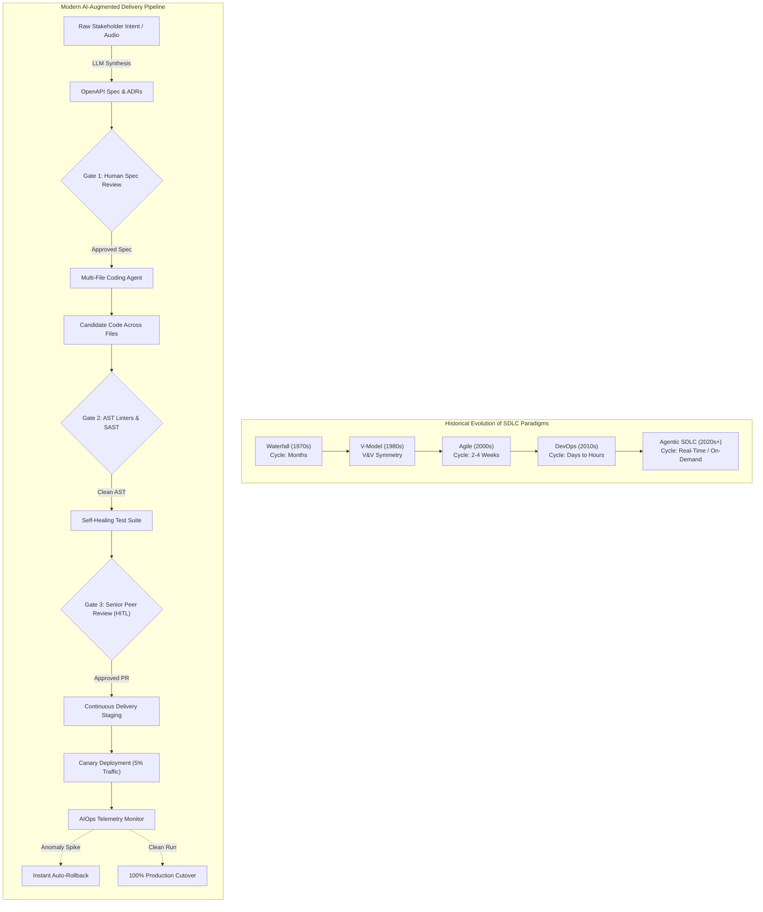

# Lecture 2: Foundations & Paradigm Shift – Evolution of SDLC Models

**Course:** SEZG534: AI-Augmented Software Development Life Cycle (BITS Pilani WILP)  
**Instructor:** Prof. Akshaya Ganesan  
**Module:** Module 1: Foundations & Paradigm Shift  
**SDLC Stage Focus:** Full Lifecycle Evolution (Waterfall → V-Model → Agile → DevOps → Continuous AI Augmentation)  
**Core Theme:** The evolution of SDLC from Waterfall to DevOps solved execution bottlenecks through iterative feedback and pipeline automation; the AI-augmented paradigm shifts the human role from code author to system orchestrator, prompt specifier, and verification reviewer.

---

## 1. The Big Picture (Why Should I Care?)

- **What is this lecture about?**  
  This lecture charts five decades of software development models—from Waterfall and the V-Model to Agile, DevOps, and today's AI-Native/Agentic SDLC. It explains why each model replaced its predecessor, what manual bottlenecks were eliminated, and what new risks appeared.
- **The Real-World Problem:**  
  At 2:00 AM, a payment microservice begins throwing 504 gateway timeouts due to an unindexed SQL query generated by an AI coding tool. In 1995 (Waterfall), this took 6 months to patch; in DevOps, a Kubernetes rollback takes 15 minutes. In 2026, an AIOps agent can diagnose the telemetry, generate an index migration, and test it in a container sandbox in 90 seconds. But **do you let the AI deploy that migration to production at 2:00 AM without human review?** Over 76% of engineering teams say *no*. Faster generation makes deterministic verification more critical than ever.
- **Where this fits in the SDLC & Course:**  
  Following Session 1's introduction to the 40/60 developer split, this session grounds the lifecycle history and sets up the deep dive into phase-by-phase AI tooling (Intent-to-Spec, multi-file agents, self-healing tests, and AIOps).

---

## 2. Core Concepts Explained Simply

### Concept 1: The 5 Eras of SDLC Evolution

- **What is it?**  
  The progression of software engineering methodologies, each designed to solve the primary bottleneck of the previous era:
  1. **Waterfall (1970s):** Sequential, documentation-heavy, phase-gated handoffs (Plan $\to$ Design $\to$ Code $\to$ Test). *Bottleneck:* Late-stage integration surprises and zero early customer feedback.
  2. **V-Model (1980s):** Introduced **Verification & Validation (V&V) Symmetry**, pairing each design stage with an equivalent testing stage planned upfront. *Bottleneck:* Still rigidly sequential; requirements changes remained painful and expensive.
  3. **Agile & Scrum (2000s):** Short 2–4 week iterative sprints delivering working software increments. *Bottleneck:* Communication overhead, sprint ceremonies, backlog grooming, and manual story writing.
  4. **DevOps & CI/CD (2010s):** Continuous integration, automated testing pipelines, and Infrastructure-as-Code (IaC) unifying development and operations. *Bottleneck:* Pipeline maintenance, flaky test suites, and manual release coordination.
  5. **AI-Native / Agentic SDLC (2020s+):** Continuous synthesis of software artifacts using generative AI models and autonomous agents driven by human intent. *New Bottleneck:* **Verification debt, cognitive review fatigue, and architectural governance.**
- **Key Distinction / Rule of Thumb:**  
  In Waterfall you wrote specs; in Agile you wrote user stories; in DevOps you wrote pipelines; in the Agentic SDLC you write **intent and verification guardrails**.

---

### Concept 2: The V-Model and Verification & Validation (V&V) Symmetry

- **What is it?**  
  The foundational software engineering principle that **testing is not a post-coding afterthought**. Every phase of specification has a symmetrically planned testing phase:
  * *Requirements Analysis* $\longleftrightarrow$ *User Acceptance Testing (UAT)*
  * *System Design & Architecture* $\longleftrightarrow$ *System Integration Testing*
  * *Detailed Module Design* $\longleftrightarrow$ *Integration Testing*
  * *Low-Level Implementation* $\longleftrightarrow$ *Unit Testing*
- **Why do we need it?**  
  It establishes the difference between:
  * **Verification:** *"Are we building the product right?"* (Conforming to technical specifications and syntax).
  * **Validation:** *"Are we building the right product?"* (Fulfilling real customer business needs).
- **Simple Real-World Example:**  
  In microservices, pairing an OpenAPI contract with automated contract tests (e.g., Pact) represents V&V symmetry. If an AI writes both the service endpoint and the test mock without an independent schema check, both will pass in isolation while failing under production traffic.
- **Tech Quick-Primer:**
  > 💡 **Tech Quick-Primer (`Testcontainers`):** An open-source library that spins up disposable real Docker containers (PostgreSQL, Redis, Kafka) during tests, avoiding misleading in-memory mocks.

---

### Concept 3: Continuous Delivery vs. Continuous Deployment vs. Release

- **What is it?**  
  Three distinct stages often confused by engineers:
  * **Continuous Integration (CI):** Merging code daily; automated builds and unit tests run on every commit.
  * **Continuous Delivery (CD):** Automated pipelines package, test, and stage the application in a release-ready state. Moving to live production requires an explicit **manual human approval click (HITL)**.
  * **Continuous Deployment (CD):** Every commit that passes automated CI tests deploys **automatically to live production servers with zero human intervention**.
  * **Release:** The formal business activation of the feature for end users (e.g., toggling a feature flag).
- **Why do we need it?**  
  Because AI-generated code is probabilistic, enterprise teams mandate **Continuous Delivery** (with human sign-off) rather than blind Continuous Deployment for high-risk systems.
- **Simple Real-World Example:**  
  A payment feature is *deployed* to production containers behind an inactive feature flag weeks before it is officially *released* to customers during a marketing launch.
- **Tech Quick-Primer:**
  > 💡 **Tech Quick-Primer (`LaunchDarkly`):** A cloud platform for feature flags that lets you toggle features on/off at runtime without redeploying code.
- **Key Distinction / Rule of Thumb:**  
  *Deployment* is technical (running code on servers). *Release* is business-driven (exposing code to users).

---

### Concept 4: The DevOps $\to$ MLOps $\to$ AIOps Evolutionary Axis

- **What is it?**  
  The expansion of automated operations across three domains:
  1. **DevOps:** Automates deterministic software delivery (code, unit tests, Docker images, CI/CD).
  2. **MLOps:** Automates machine learning pipelines (data ingestion, model training, hyperparameter tuning, model drift monitoring).
  3. **AIOps:** Uses AI agents to monitor massive production telemetry streams (logs, metrics, traces), correlate anomalies with recent commits, and execute automated incident remediation.
- **Tech Quick-Primers:**
  > 💡 **Tech Quick-Primer (`OpenTelemetry (OTel)`):** An observability framework that standardizes distributed traces, metrics, and logs across microservices for root-cause diagnosis.  
  > 💡 **Tech Quick-Primer (`Envoy Proxy`):** A high-performance network proxy that handles traffic routing, load balancing, and TLS termination across microservices.
- **Key Distinction / Rule of Thumb:**  
  DevOps manages code; MLOps manages models; AIOps uses models to manage operations.

---

### Concept 5: AI Phase-by-Phase Lifecycle Transformation

- **What is it?**  
  How AI reshapes each stage of the development lifecycle:
  1. **Requirements (Intent-to-Spec):** Unstructured meeting audio or user interview notes are ingested by an LLM to generate structured OpenAPI specs, JSON schemas, and Architecture Decision Records (ADRs).
  2. **Coding (Multi-File Agents):** Transition from single-line autocomplete (Copilot) to multi-file coding agents (Cursor, Claude Code) that refactor across interconnected files in parallel.
  3. **Testing (Self-Healing Tests):** AI agents dynamically update element locators when UI structures or button IDs change, preventing brittle Cypress/Selenium failures.
  4. **Code Review (Semantic Reviewers):** Automated PR bots flag OWASP vulnerabilities, schema mismatches, and unauthorized dependencies before notifying human reviewers.
  5. **Operations (Autonomous Remediation):** AIOps agents correlate runtime error spikes with recent commits, draft a rollback or fix, and present a root-cause summary to the on-call engineer.

---

### Concept 6: Technical Debt vs. Unfinished Backlog Work

- **What is it?**  
  A critical distinction frequently misunderstood by developers:
  * **Unfinished Backlog Work:** User stories or story points scheduled for a sprint that could not be completed within the timebox. They simply roll over to the next sprint.
  * **Technical Debt:** Suboptimal architectural shortcuts, hacked implementations, hardcoded passwords, or skipped tests introduced to meet a deadline. It incurs "interest" in the form of future maintenance pain.
- **Key Distinction / Rule of Thumb:**  
  Unfinished points are deferred work; technical debt is compromised quality that must be repaid later.

---

## 3. Visual Workflow & Architecture Models

### SDLC Evolution & The Modern Agentic Delivery Pipeline

### Diagram Walkthrough:
* **Cycle Time Compression:** Iteration compressed from months in Waterfall down to real-time intent synthesis in Agentic SDLC.
* **Intent-to-Spec Gate (Gate 1):** Stakeholder prompts are synthesized into formal specifications and checked by humans before any code is generated.
* **Deterministic Filtering (Gate 2 & 3):** Linters and AST checkers filter code before senior engineers review it, preserving human cognitive bandwidth.
* **Canary & Closed-Loop AIOps:** Code deploys to a small canary slice. If anomalies appear, auto-rollback triggers immediately.

---

## 4. Key Comparisons & Trade-Offs

### SDLC Model Comparison Matrix

| Dimension | Waterfall | Agile / Scrum | DevOps / CI/CD | AI-Native / Agentic SDLC |
| :--- | :--- | :--- | :--- | :--- |
| **Core Paradigm** | Sequential, phase-gated, document-heavy | Iterative sprints, working increments | Automated pipelines, continuous delivery, IaC | Intent-driven synthesis, autonomous multi-file agents |
| **Cycle Time** | Months to Years | 2–4 Weeks | Days to Hours | Real-Time / On-Demand |
| **Primary Bottleneck** | Rigid handoffs, late integration bugs | Communication overhead, sprint ceremonies | Pipeline maintenance, flaky tests | **Human verification, review fatigue, AI hallucination auditing** |
| **Role of Human** | Spec author, manual tester | User story implementer, coder | Pipeline builder, automation engineer | **System orchestrator, prompt specifier, verifier & governor** |
| **Cost of Early Bug** | Catastrophic (delayed to final testing) | Moderate (caught in sprint) | Low (caught by automated tests) | **Very Low for syntax; Catastrophic for architectural drift** |

### Continuous Delivery vs. Continuous Deployment

| Feature | Continuous Delivery | Continuous Deployment |
| :--- | :--- | :--- |
| **Production Cutover** | **Manual Human Approval (HITL)** | **100% Automated** |
| **Best For** | Enterprise, banking, healthcare, AI-augmented code | Low-risk SaaS, internal tools, simple web apps |
| **Failure Protection** | High (Human acts as safety backstop) | Relies 100% on automated test suite perfection |

---

## 5. Professor's Practical Takeaways & Golden Rules

*(Key insights emphasized by Prof. Akshaya Ganesan in lecture)*

1. **The "Power with Tied Hands" Reality:**  
   Engineers see the power of AI, but enterprise compliance and security rightfully limit public tool access. Leading organizations deploy private, local models (via Ollama or internal enterprise endpoints) with strict data boundaries.
2. **SDLC is More Critical in the AI Era, Not Less:**  
   When students ask *"If AI writes code so fast, why do we need an SDLC?"*, the answer is: Without an SDLC, you have no shared contracts, no architecture boundaries, and no accountability. SDLC provides the guardrails that prevent AI velocity from destroying system integrity.
3. **AI Answers vs. Reading Documentation:**  
   AI gives fast, confident answers, but it eliminates the serendipitous learning that happens when reading official docs or Stack Overflow threads where edge cases and architectural trade-offs are discussed. Always verify AI answers against official documentation.
4. **Beware Premature Continuous Deployment:**  
   Treating zero-human Continuous Deployment as a badge of honor for AI-generated code is risky. Maintain an explicit Human-in-the-Loop gate for high-blast-radius services.

---

## 6. Quick Recap & Terminology Cheatsheet

### Key Terms in 1 Line
* **V-Model:** A lifecycle model mapping each specification phase symmetrically to a planned verification phase.
* **Verification vs. Validation:** Verification checks specification conformance ("building right"); validation checks customer fitness ("building right thing").
* **Continuous Delivery:** Automated build and staging with a mandatory human approval click before production.
* **Continuous Deployment:** 100% automated deployment straight to production without human intervention.
* **Intent-to-Spec:** Converting unstructured stakeholder prompts or meeting audio directly into structured OpenAPI schemas and ADRs.
* **Self-Healing Tests:** Test automation suites that dynamically adapt element selectors when UI layouts change.
* **AIOps:** Using AI to analyze operational telemetry streams and automate incident diagnosis and remediation.
* **Technical Debt:** Intentional quality shortcuts taken in code or architecture that require future refactoring effort.

### 4 Core Mental Rules to Remember
1. **Developer Role Shift:** You are no longer just a code author; you are an orchestrator, specifier, and verification authority.
2. **Deterministic Checks Protect Cognitive Bandwidth:** Never send AI code directly to peer review; let automated linters and SAST filter it first.
3. **Delivery $\neq$ Deployment $\neq$ Release:** Deployment puts code on servers; release exposes code to business users; delivery ensures it is ready for human sign-off.
4. **Velocity Demands Guardrails:** Fast code generation without strict architectural guardrails simply accelerates the delivery of outages.
