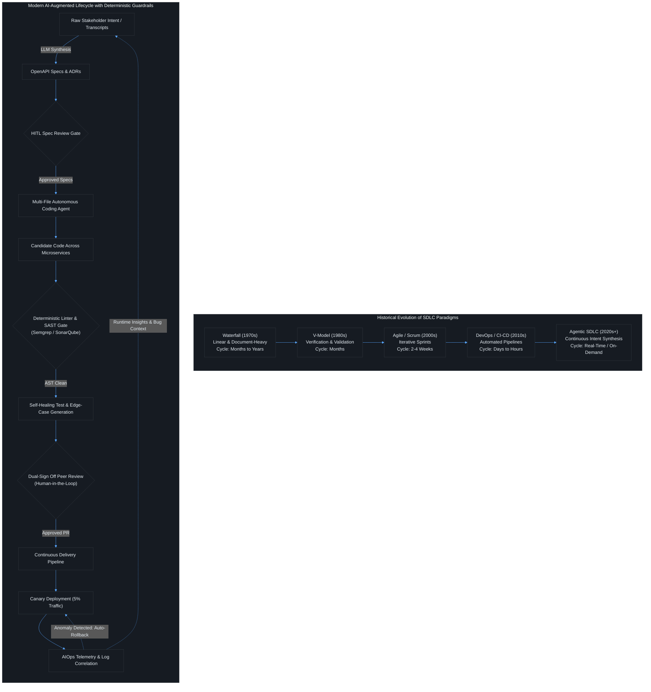
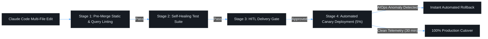

# Contact Session 2: Foundations & Paradigm Shift – Evolution of SDLC Models

**Course:** SEZG534: AI-Augmented Software Development Life Cycle (BITS Pilani WILP)  
**Instructor:** Prof. Akshaya Ganesan  
**Module:** Module 1: Foundations and Paradigm Shift – Evolution, Velocity, and Risk  
**SDLC Stage Focus:** Full Lifecycle Evolution (Waterfall → V-Model → Agile → DevOps → Continuous AI-Augmentation)  
**Core Theme:** The evolution of SDLC from Waterfall to DevOps solved execution bottlenecks through iterative feedback and pipeline automation; the AI-augmented paradigm shifts the human role from author and builder to orchestrator, prompt specifier, and verification reviewer.

---

## 1. Executive Overview & Problem Context (The 2-Minute Story)

### The 2-Minute Story: The 2:00 AM Microservices Cascade
> It is 2:14 AM on a Tuesday. The primary payment microservice inside a production Kubernetes cluster begins throwing HTTP 504 Gateway Timeouts. Within 90 seconds, backpressure cascades across the Envoy service mesh, saturating connection pools and taking down checkout for 80,000 concurrent users.
> 
> How would engineering handle this incident across the five eras of software development?
> - **In 1995 (Waterfall):** SREs didn't exist. Engineers would wait for customer bug reports to be filed on paper, spend six weeks reproducing a memory leak from a core dump, and ship a physical CD patch six months later.
> - **In 1985 (V-Model):** Verification was planned upfront, but because integration testing only happened after full module completion, architectural mismatches weren't caught until massive staging test passes months down the line.
> - **In 2005 (Agile/Scrum):** The bug would be logged as an urgent spike in Jira, argued over in morning standup, and hotfixed in a 2-week sprint cycle.
> - **In 2018 (DevOps / CI/CD):** Prometheus alerts fire, Kubernetes automatically restarts the crashing pods, and an engineer uses git bisect to find the breaking commit, rolling back the Helm chart in 15 minutes.
> - **In 2026 (Agentic AI SDLC):** An autonomous AIOps agent correlates 10 million **OpenTelemetry spans**, pinpoints an unindexed SQL query generated by an AI coding assistant in a merged PR 20 minutes earlier, synthesizes a database index migration, tests it in a throwaway Docker sandbox, and prepares a canary patch.
> 
> But the ultimate engineering dilemma remains: **Do you let the AI automatically execute the schema migration and cut over production traffic at 2:00 AM without human sign-off?**
> 
> **The Engineering Lesson:** 76% of engineering teams say *no*. While AI can compress diagnosis and code generation from hours into seconds, production systems demand 100% deterministic reliability. The evolution of SDLC is not about eliminating human control—it is about elevating the engineer from a manual code author to an architectural governor and verification authority.

### What is this lecture about?
Contact Session 2 traces the historical trajectory of Software Development Life Cycle (SDLC) models over five decades—from Waterfall (1970s) and the V-Model (1980s), to Agile/Scrum (2000s), DevOps/CI-CD (2010s), and the emergence of the **AI-Native / Agentic SDLC (2020s+)**. Prof. Akshaya Ganesan analyzes the fundamental drivers behind this evolution: reducing time-to-market, incorporating continuous feedback, managing technical debt, and eliminating manual handoff friction.

The lecture breaks down how AI transforms every individual phase of the SDLC: turning unstructured meeting audio into formal OpenAPI specifications, replacing manual syntax coding with multi-file autonomous agents, converting brittle Selenium UI test scripts into self-healing test suites, and elevating incident firefighting into autonomous AIOps remediation.

### The Paradigm Shift (Waterfall → Agile → DevOps → Continuous AI Augmentation)
Each SDLC era was engineered to resolve the primary bottleneck of the previous era:
1. **Waterfall (1970s):** Highly sequential, documentation-heavy, linear stages. Assumed perfect upfront knowledge.
   * *Fatal Flaw:* Late discovery of architectural flaws during late-stage integration. Rigid handoffs with zero early feedback.
2. **V-Model (1980s):** Introduced verification and validation symmetry, associating each development phase directly with a corresponding testing phase (Unit, Integration, System, Acceptance).
   * *Fatal Flaw:* Still fundamentally sequential; changes in user requirements mid-project remained catastrophic and cost-prohibitive.
3. **Agile & Scrum (2000s):** Replaced monolithic timelines with 2–4 week iterative sprints, prioritizing working software over comprehensive documentation.
   * *New Bottleneck:* Sprint context-switching, human communication overhead, backlog grooming friction, and the manual creation of user stories.
4. **DevOps & CI/CD (2010s):** Unified development and operations through automated pipelines, Infrastructure-as-Code (IaC), and continuous integration.
   * *New Bottleneck:* Pipeline maintenance overhead, flaky automated test suites, manual release approvals, and operational handoff friction.
5. **AI-Native / Agentic SDLC (2020s+):** Continuous synthesis of software artifacts using probabilistic LLMs and autonomous agents guided by high-level human intent.
   * *The Ultimate Shift:* The developer transitions from **code author/builder** to **system orchestrator, prompt engineer, and verification reviewer**.

```text
[1970s: Waterfall] ──> [1980s: V-Model] ──> [2000s: Agile/Scrum] ──> [2010s: DevOps CI/CD] ──> [2020s+: Agentic AI SDLC]
  (Sequential Docs)     (V&V Symmetry)      (Iterative Sprints)     (Automated Pipelines)    (Intent-Driven Synthesis)
```

#### The Bottleneck Inversion
* **The Eliminated Bottleneck:** The mechanical translation of requirements into code, manual boilerplate creation, handcrafted unit test drafting, and basic runtime log parsing.
* **The New Engineering Bottleneck:** **Human verification bandwidth, architectural governance, AI hallucination auditing, and validation debt.** The limiting factor is no longer how quickly software can be written, but how safely and accurately it can be validated.

### Velocity vs. Risk Trade-Off
* **The Velocity Gain:** Software requirements convert to working prototypes in minutes (Intent-to-Spec). Test suites automatically heal when front-end locators break.
* **The Amplified Risk:** When autonomous agents modify dozens of files across multiple microservices in parallel, errors propagate instantaneously across architectural boundaries. If human reviewers suffer cognitive fatigue, security flaws (OWASP Top 10) and license compliance issues slip silently into release builds.

### Course Roadmap Placement
* **Current Position:** Session 2 of 16. Completes the historical and conceptual baseline of Module 1.
* **Direct Connectors:**
  * *Preceding (Session 1):* Introduction to AI capabilities vs. productivity gaps and the 40/60 split.
  * *Succeeding (Session 3):* The 5 Major Paradigm Shifts in detail (bottleneck inversion, role blur, spend-driven development, cognitive debt).
  * *Exam Anchor:* High-yield comparison matrices for the Closed-Book Midterm; pipeline design questions for the Comprehensive Exam.

---

## 2. Core Concepts Explained Simply (with Tech Quick-Primers)

### Concept 1: The Verification & Validation (V&V) Symmetry in the V-Model
* **What is it? (Simple Definition):** The principle that every phase of specification and design must have an equal, planned-in-advance testing phase.
* **How It Works (Step-by-Step):**
  1. *Requirements Analysis* pairs symmetrically with *User Acceptance Testing (UAT)*.
  2. *System Design & Architecture* pairs with *System Integration Testing*.
  3. *Detailed High-Level Design* pairs with *Integration Testing*.
  4. *Low-Level Module Design* pairs with *Unit Testing*.
  5. The bottom vertex represents *Implementation (Coding)*.

> 💡 **Tech Quick-Primer (`Testcontainers`):** An open-source testing library that provisions real, disposable Docker containers (PostgreSQL, Kafka, Redis) during test execution. Solves the problem of brittle in-memory mocks failing to catch production integration bugs.

* **The Deterministic vs. Probabilistic Friction Point:** The classical V-Model assumes static, deterministic mappings between design and tests. In an AI-augmented lifecycle, AI generates both code and tests simultaneously. If the prompt is ambiguous, both the implementation and the test suite inherit the identical probabilistic error.
* **Real-World Engineering Example:** In a microservices architecture, pairing API contracts with consumer-driven contract tests (e.g., Pact) represents modern V&V symmetry. If an AI writes both the microservice endpoint and the mock contract without independent schema verification, both sides pass in isolation while failing catastrophically in production.
* **Key Boundaries & Distinctions:**
  * *Verification:* "Are we building the product right?" (Conforming to technical specifications and syntax).
  * *Validation:* "Are we building the right product?" (Fulfilling actual customer business requirements).

---

### Concept 2: Continuous Delivery vs. Continuous Deployment vs. Release
* **What is it? (Simple Definition):** The critical distinction between automated pipeline execution and the business decision to expose features to end users.
* **How It Works (Step-by-Step):**
  * **Continuous Integration (CI):** Developers merge code to trunk daily; automated builds and unit/integration tests run on every commit.
  * **Continuous Delivery (CD):** The pipeline automatically packages, tests, and stages the application in a production-like environment. It is *always deployable*, but requires a **manual human approval click (HITL)** before touching production.
  * **Continuous Deployment (CD):** Zero human intervention. Every commit that passes the automated CI/CD test suite is automatically deployed directly to live production servers.
  * **Release:** The formal business and operational enablement of the feature for end-user consumption (e.g., flipping a feature flag, completing User Acceptance Testing, marketing cutover).

> 💡 **Tech Quick-Primer (`LaunchDarkly (Feature Flags)`):** A cloud-native feature management platform sitting at the application runtime layer. Decouples technical deployment from business release by toggling code execution paths without redeploying code.

* **The Deterministic vs. Probabilistic Friction Point:** While simple web applications frequently employ full Continuous Deployment, enterprise and AI-augmented systems enforce Continuous Delivery with a mandatory Human-in-the-Loop gate to prevent hallucinated code from reaching production.
* **Real-World Engineering Example:** A new payment gateway can be *deployed* to 100 Kubernetes pods behind a disabled feature flag in LaunchDarkly weeks before it is officially *released* to customers during a scheduled marketing event.
* **Key Boundaries & Distinctions:** Deployment is purely technical (binaries running on cloud infra); release is transactional and business-driven (users actively executing the code path).

---

### Concept 3: The DevOps → MLOps → AIOps Evolutionary Axis
* **What is it? (Simple Definition):** The operational expansion of DevOps to handle machine learning artifacts (MLOps) and autonomous remediation agents (AIOps).
* **How It Works (Step-by-Step):**
  1. **DevOps (Deterministic Software):** Manages code, binaries, automated unit tests, and infrastructure provisioning (Terraform, Docker, Kubernetes). Focuses on uptime and deterministic code deployment.
  2. **MLOps (Machine Learning Lifecycle):** Extends DevOps to manage probabilistic models, continuous data ingestion, feature stores, model training, hyperparameter tuning, model drift monitoring, and model registries.
  3. **AIOps (AI-Augmented Operations):** Employs autonomous AI agents to ingest massive telemetry streams (Prometheus metrics, distributed traces, Splunk logs), correlate runtime anomalies with recent Git pull requests, predict outages, and execute automated self-healing remediation.

> 💡 **Tech Quick-Primer (`OpenTelemetry (OTel)`):** A vendor-neutral observability framework instrumenting application runtimes. Standardizes the collection and export of distributed traces, metrics, and logs across microservices to enable distributed root-cause analysis.

> 💡 **Tech Quick-Primer (`Envoy Proxy`):** A high-performance L7 edge and service proxy sitting in the network data plane. Handles service discovery, load balancing, TLS termination, and traffic routing across microservices.

* **The Deterministic vs. Probabilistic Friction Point:** DevOps deals with static code (if input is $X$, output is $Y$). MLOps and AIOps deal with probabilistic models that degrade over time due to real-world data drift, requiring continuous runtime evaluation loops.
* **Real-World Engineering Example:** In classical DevOps, if a container crashes, Kubernetes restarts it. In AIOps, when Envoy proxies report an elevated 5xx error rate on a specific gRPC route, an agent analyzes OpenTelemetry traces across 30 upstream microservices, correlates the spike to a PR merged 15 minutes ago, and pages the exact engineer who approved the commit.
* **Key Boundaries & Distinctions:**
  * *DevOps:* Automates the software delivery pipeline.
  * *MLOps:* Automates the machine learning lifecycle pipeline.
  * *AIOps:* Uses AI within operations to monitor, diagnose, and heal systems.

---

### Concept 4: AI Phase-by-Phase Lifecycle Transformation
* **What is it? (Simple Definition):** The concrete technical mechanisms through which AI reshapes each of the five core SDLC stages.

> 💡 **Tech Quick-Primer (`Kubernetes`):** A container orchestration platform managing deployment, scaling, and operational health of containerized services across cloud clusters.

#### 1. Requirements & Architecture (Intent-to-Spec)
* *Traditional:* BAs spend months conducting stakeholder interviews, drafting PRDs; architects manually draft OpenAPI endpoints and DB schemas.
* *AI-Augmented:* **Intent-to-Spec.** Unstructured client meeting audio/transcripts are ingested by an LLM to generate structured OpenAPI specs, JSON schemas, and Architecture Decision Records (ADRs). AI agents perform **architectural simulation** to evaluate concurrency bottlenecks before code is written.

#### 2. Development & Implementation (Autonomous Multi-File Agents)
* *Traditional:* Developers manually write boilerplates, look up API docs on Stack Overflow, and write methods line-by-line.
* *AI-Augmented:* Evolution from simple single-line autocomplete (Copilot) to **multi-file agentic workflows** (Cursor, Claude Code) capable of refactoring dozens of interdependent files in parallel based on a single intent prompt.

#### 3. Testing & QA (Self-Healing Suites & Edge-Case Synthesis)
* *Traditional:* QA writes brittle Selenium/Cypress UI scripts that break whenever a CSS selector, button ID, or DOM hierarchy changes.
* *AI-Augmented:* **Self-Healing Test Suites.** AI agents dynamically update element locators during CI execution when DOM structures change. LLMs analyze Abstract Syntax Tree (AST) branches to synthesize tests covering obscure, undetected edge cases.

#### 4. Code Review & Governance (Real-Time Semantic Reviewers)
* *Traditional:* Peer PR reviews take 24–72 hours; human reviewers suffer cognitive fatigue and miss subtle race conditions and security vulnerabilities.
* *AI-Augmented:* **Semantic AI Reviewers.** Real-time static and semantic bots inspect PR diffs, flagging OWASP Top 10 vulnerabilities, unauthorized dependency injections, and architectural pattern violations before notifying a human reviewer.

#### 5. Operations & Incident Response (Autonomous Remediation)
* *Traditional:* SREs wake up at 2:00 AM, manually search through Splunk logs, trace stack dumps, and manually execute rollback scripts.
* *AI-Augmented:* **Autonomous Remediation.** AI agents correlate runtime exceptions with recent PR commits, synthesize a rollback or targeted patch, verify it in an isolated staging sandbox, and present an actionable root-cause summary to the on-call engineer.

---

## 3. Visual Architectural / System Models (Dark-mode Mermaid diagrams)

### Historical SDLC Evolution & The Modern Agentic Pipeline



### Diagram Walkthrough:
1. **The Evolution of Cycle Times:** The top subgraph illustrates how iteration frequency compressed from months/years in Waterfall to real-time, on-demand execution in the Agentic SDLC.
2. **Intent-to-Spec with Gate 1:** Raw customer audio or product prompts do not go directly to coding agents. They are synthesized into formal specifications and vetted by a human Product Owner / Architect at **Gate 1**.
3. **Deterministic Filtering Before Review:** Candidate code from multi-file agents must pass automated static analysis (AST linters, secret scanners) and self-healing test execution before any human reviewer is notified, protecting senior engineers from review fatigue.
4. **Guarded Delivery & AIOps Closed Loop:** Releases are rolled out via Canary deployments. If the AIOps monitor detects anomalous telemetry or error spikes, it triggers an automated rollback and feeds diagnostic context back to the top of the lifecycle.

---

## 4. Key Trade-Offs & Comparisons (Structured markdown tables)

### Comprehensive SDLC Era Comparison Matrix

| Comparison Dimension | Waterfall (1970s–1990s) | Agile & Scrum (2000s–2010s) | DevOps & CI/CD (2010s–2020s) | AI-Native / Agentic SDLC (2020s+) |
| :--- | :--- | :--- | :--- | :--- |
| **Core Paradigm** | Sequential, phase-gated, documentation-heavy. | Iterative collaboration, working software, sprints. | Automated integration, continuous delivery, IaC. | Intent-driven synthesis, autonomous multi-file agents. |
| **Iteration Cycle** | Months to Years. | Weeks (2–4 week sprints). | Days to Hours. | Real-time / On-demand. |
| **Primary Bottleneck** | Rigid handoffs, upfront planning, zero early feedback. | Communication overhead, sprint ceremonies, backlog grooming. | Pipeline maintenance, manual release gates, flaky tests. | **Human verification, architectural governance, AI hallucinations.** |
| **Primary Output** | Monolithic SRS & Architecture specification documents. | Increment of working software delivered per sprint. | Automated deployment pipelines & immutable container images. | Continuous feature synthesis with mandatory human oversight. |
| **Role of Human** | Author of massive specs; manual tester. | Agile team member; backlog worker; code author. | Cross-functional pipeline builder; automation engineer. | **Orchestrator, prompt specifier, verifier, and governance reviewer.** |
| **Failure Cost Profile** | Exponential: Bugs found in deployment require full restarts. | Moderate: Bugs caught in sprint review or retro. | Low: Caught in CI pipeline or automated rollback. | **Variable: Low for syntax, Catastrophic for architectural drift.** |

### SDLC Model Selection Decision Matrix

```text
                          PROJECT REQUIREMENTS CLARITY
                                       ▲
                                       │
            [V-MODEL / WATERFALL]      │      [DEVOPS + AGENTIC SDLC]
            - Mission-Critical Space   │      - Enterprise Web Platforms
            - Medical Device Firmware  │      - Scalable Cloud Microservices
            - High Regulatory Audits   │      - Rapid Feature Iteration
            - Fixed Strict Budgets     │      - Mature Automated Test Harness
                                       │
  ─────────────────────────────────────┼─────────────────────────────────────► SYSTEM COMPLEXITY
                                       │
            [PURE WATERFALL]           │      [AGILE / PROTOTYPING SDLC]
            - Small Infrastructure     │      - Early-Stage Startups / MVPs
            - Known COTS Integrations  │      - Exploratory AI Applications
            - Predictable Scope        │      - Evolving Stakeholder Intent
                                       │
                                       ▼
                          UNCLEAR / FLUID REQUIREMENTS
```

* **When to Select Waterfall / V-Model:** Fixed-scope government contracts, aerospace/defense systems, embedded medical firmware where regulations prohibit mid-flight architectural changes and customer interaction is strictly upfront.
* **When to Select Agile / DevOps:** Complex commercial SaaS, consumer applications, platforms requiring rapid response to competitive market forces.
* **When to Mandate Agentic AI Augmentation:** Organizations with mature deterministic test harnesses, comprehensive API documentation, and strong CI/CD guardrails capable of absorbing high-velocity code generation.

---

## 5. Professor's Practical Tips & Oral Insights (Exam traps, caveats)

*(Extracted directly from Prof. Akshaya Ganesan's spoken lecture)*

### 1. Real-World Engineering Insights
* **The "Power with Tied Hands" Paradox (Sindhura's Dilemma):** Enterprise engineers feel the immense power of generative AI, but corporate compliance, intellectual property protection, and security policies restrict their access. Successful organizations do not ban AI; they set up private, air-gapped local models (via Ollama or dedicated enterprise endpoints) with explicit data boundaries.
* **Don't Confuse Technical Debt with Backlog Carryover:**
  * If a team commits to 21 story points in a sprint and only completes 17, the remaining 4 points are **uncompleted backlog tasks**, not technical debt!
  * **Technical Debt** occurs when an engineer takes an intentional technical shortcut (e.g., hardcoding a database password in plaintext, bypassing an authentication interceptor, or skipping unit tests) to mark the story "done."
* **Self-Healing Test Reality:** The biggest time sink in modern QA is not writing tests; it is maintaining brittle UI selectors. When marketing changes a button label or CSS layout, 50 Cypress tests fail. AI-driven self-healing selectors eliminate this maintenance tax.

### 2. Common Traps & Anti-Patterns
* **The "Hybrid Model Friction" Trap (Gurdeep's Scenario):** Trying to run an Agile/DevOps team when your external enterprise client operates on a 1980s Waterfall procurement model. This creates massive friction because the client expects signed, frozen specs while the engineering team delivers bi-weekly incremental code.
* **The "Blind Deployment" Anti-Pattern:** Treating Continuous Deployment as the ultimate goal for every software product. Pushing unverified AI-generated code directly to production without Canary isolation or automated rollback policies is reckless engineering.

### 3. Student Questions & Classroom Debates
* **Student Question (Abhinav Mukherjee):** *"If AI can synthesize code so fast, why do we even need an SDLC? Can't developers just work directly with AI without any structured lifecycle?"*
  * **Prof. Akshaya's Resolution:** If you eliminate the SDLC, you eliminate schedules, accountability, and architectural cohesion. Individual components will run independently with no shared vision or integration contracts. The SDLC is more critical now than ever—not to slow developers down, but to provide the structural scaffolding and quality gates that keep AI velocity from causing system-wide collapse.
* **Student Question (Kumar Ashutosh):** *"Is instant access to knowledge via AI an advantage or disadvantage compared to manually searching documentation and Stack Overflow?"*
  * **Prof. Akshaya's Resolution:** It is a double-edged sword. It dramatically accelerates onboarding and eliminates "blank page paralysis." However, when you browse documentation or Stack Overflow, you absorb architectural context, caveats, and alternative trade-offs. AI gives you a direct, confident answer that may be completely hallucinated or lack awareness of production edge cases.

### 4. Exam Strategy & Warning
* **Closed-Book Midterm Warning (EC-2):** Memorize the exact evolutionary milestones of the SDLC. Be ready to define the distinct differences between **Continuous Delivery and Continuous Deployment**, and explain the exact pairings of the **V-Model**.
* **Open-Book Comprehensive Exam Warning (EC-3):** Be prepared for scenario questions contrasting traditional phase handoffs with AI-augmented workflows. You must be able to specify exact automated tools and HITL checkpoints for a given enterprise pipeline failure.

### 5. Lab & Practical Tooling Alignment
* **Lab 1 (Requirements Synthesis & ADRs):** Direct implementation of the **Intent-to-Spec** paradigm. Students take unstructured transcripts and use prompt templates to auto-generate OpenAPI specs and ADRs, followed by human review checklists.
* **Lab 2 (Pair Programming & Legacy Refactoring):** Explores the transition from simple line-by-line Copilot autocomplete to multi-file autonomous refactoring, setting up AST linters to catch injected CVEs.
* **Lab 3 (Automated Test Generation):** Practical implementation of self-healing test suites and edge-case generation, ensuring tests are decoupled from the AI code generator.

---

## 6. Exam-Ready Question Bank (Part A: 2–3 mark; Part B: 5–10 mark with rubrics)

### Part A: Short-Answer Conceptual Questions (Mid-Semester Test Focus)

#### Q1: Differentiate between Continuous Delivery and Continuous Deployment. Why is Continuous Delivery preferred in AI-augmented enterprise pipelines? (3 Marks)
* **Model Answer:**
  * **Continuous Delivery:** Automated build, testing, and staging pipelines package the software so that it is always in a release-ready state; however, the final cutover to live production requires an explicit **manual human approval gate (HITL)**.
  * **Continuous Deployment:** Every code commit that passes the automated pipeline is automatically pushed directly to live production servers without human intervention.
  * **Why Preferred in AI SDLC:** Because AI-generated code is inherently probabilistic, automated test suites may miss subtle semantic edge cases or hallucinated vulnerabilities. The manual gate in Continuous Delivery ensures that an accountable human engineer formally signs off before code impacts live users.

#### Q2: What is the V-Model, and what fundamental software engineering principle did it introduce to improve upon Waterfall? (2 Marks)
* **Model Answer:**
  * The V-Model (1980s) is an SDLC model that executes development phases in a sequential V-shape, establishing **Verification and Validation (V&V) symmetry**.
  * **Core Principle:** It introduced the rule that **testing is not a post-coding afterthought**. Every development phase (Requirements, System Design, Architecture, Module Design) is explicitly paired with a corresponding testing phase (UAT, System Testing, Integration Testing, Unit Testing) planned during the specification stage.

#### Q3: Clarify the difference between "Unfinished Backlog Work" and "Technical Debt." (2 Marks)
* **Model Answer:**
  * **Unfinished Backlog Work:** User stories or story points that were scheduled for a sprint but could not be completed within the timebox; they are simply rolled over into the next sprint backlog.
  * **Technical Debt:** Suboptimal architectural shortcuts, hacked implementations, or skipped engineering practices (hardcoded credentials, missing test coverage, bypassing linters) introduced to complete a task quickly, which will require future refactoring effort.

#### Q4: How does "Intent-to-Spec" transform the traditional Requirements & Architecture phase? (3 Marks)
* **Model Answer:**
  * In the traditional approach, Product Managers and Architects manually spend weeks converting stakeholder discussions into PRD documents, UML diagrams, and API schemas.
  * In **Intent-to-Spec**, generative AI models ingest unstructured inputs (raw client interview recordings, meeting transcripts, high-level business prompts) and directly synthesize structured **OpenAPI specifications, JSON schemas, and Architecture Decision Records (ADRs)** in minutes, allowing rapid architectural prototyping and concurrency simulation prior to implementation.

---

### Part B: Analytical & Scenario Questions (Comprehensive Exam Focus)

#### Scenario Q1: Designing an AI-Augmented Pipeline with Self-Healing Tests & Canary Governance (10 Marks)
**Context:** HealthPulse is a digital health platform transitioning from manual Agile sprints to an AI-augmented SDLC. The engineering team uses Claude Code for multi-file code generation and an LLM to generate end-to-end Cypress UI tests. However, during a recent sprint:
1. The AI generated a patient-record query that caused an N+1 database performance bottleneck in PostgreSQL.
2. The UI test suite suffered high flakiness because frontend element IDs were dynamically modified by the coding agent.
3. The release was pushed directly to production via full Continuous Deployment, causing a 45-minute service outage for 100,000 active patients.

**Tasks:**
1. Diagnose the architectural and lifecycle failures in HealthPulse's delivery model. *(2 Marks)*
2. Propose a redesigned 4-stage guarded CI/CD pipeline incorporating Static Analysis, Self-Healing Tests, and Canary Releases. *(5 Marks)*
3. Define the Human-in-the-Loop (HITL) gate and automated rollback trigger to prevent outages. *(3 Marks)*

---

#### Detailed Model Answer & Scoring Breakdown:

##### 1. Problem Diagnosis & Lifecycle Failures (2 Marks)
* **Premature Continuous Deployment:** HealthPulse enabled full Continuous Deployment for an AI-augmented codebase without an intermediate staging canary or human approval gate, exposing production to non-deterministic failure modes.
* **Absence of Semantic / Static Performance Gates:** The N+1 query escaped because the team lacked automated query profiling and static database linters in the CI stage.
* **Brittle UI Locators:** The test automation suite relied on hardcoded element selectors that broke when the autonomous coding agent refactored frontend components.

##### 2. Redesigned 4-Stage Guarded Delivery Pipeline (5 Marks)



* **Stage 1: Pre-Merge Static & Semantic Gate:**
  * Integrate AST-based static analysis (Semgrep) and query profilers (e.g., ORM query counter) to automatically detect and block N+1 query patterns before code review.
* **Stage 2: Self-Healing Test Execution:**
  * Implement an AI-augmented test runner (Playwright/Cypress AI plugin) that utilizes **semantic DOM locators** (`role`, `aria-label`, text content) rather than brittle IDs.
  * If a locator breaks, the self-healing engine inspects the DOM diff, updates the locator in memory, finishes the test run, and creates a background PR to update the test script.
* **Stage 3: Human-in-the-Loop (HITL) Continuous Delivery Gate:**
  * Require explicit sign-off from a Senior Backend Engineer on database query plans and security permissions prior to production staging.
* **Stage 4: Canary Deployment Strategy:**
  * Route only 5% of traffic to the new release container.

##### 3. Automated Rollback & AIOps Governance (3 Marks)
* **AIOps Telemetry Guardrail:** Configure Prometheus and OpenTelemetry agents to monitor p99 latency, HTTP 5xx error rates, and database connection pool saturation on the Canary pods.
* **Automated Rollback Rule:** If the Canary error rate exceeds 0.5% or p99 response time increases by >15% over a 5-minute rolling window, the Kubernetes ingress controller immediately terminates the Canary pods and routes 100% of traffic back to the baseline release without human intervention.
* **Accountability Mandate:** The lead engineer who authorized the Stage 3 HITL gate must review the AIOps incident log before a re-deployment can be scheduled.

##### Scoring Keywords Checklist (Mandatory for Full Marks):
- [x] Premature Continuous Deployment Diagnosis *(1 Mark)*
- [x] N+1 Query / Static Analysis Gate *(1 Mark)*
- [x] Semantic / Self-Healing Test Locators *(2 Marks)*
- [x] Human-in-the-Loop (HITL) Gate *(1 Mark)*
- [x] Canary Deployment (5% Traffic) *(1 Mark)*
- [x] Automated AIOps Telemetry & Rollback Trigger *(2 Marks)*
- [x] Architectural Flow Diagram / Visual *(2 Marks)*

---

## 7. Quick Revision & 60-Second Exam Recap (Glossary, 5 Golden Rules, Rapid Q&A)

### Key Terms & Acronym Glossary
* **Waterfall:** A sequential, phase-gated SDLC model where progress flows downwards like a cascade.
* **V-Model:** A sequential SDLC model mapping development stages symmetrically to testing stages (Verification and Validation).
* **Agile:** An iterative software development framework delivering incremental working software in short sprints.
* **Continuous Delivery (CD):** Automated pipeline staging software for production with a manual human approval gate.
* **Continuous Deployment (CD):** Automated deployment directly to production with zero human intervention.
* **Intent-to-Spec:** Transforming high-level stakeholder prompts or unstructured audio into formal API schemas and ADRs.
* **Self-Healing Tests:** Test automation suites that dynamically adapt element locators when UI structures change.
* **AIOps:** Applying artificial intelligence and autonomous agents to telemetry and log data to automate incident diagnosis and remediation.

### The 5 Golden Rules of SDLC Evolution
1. **The Bottleneck Inversion:** AI makes coding instantaneous; verification, code review, and architectural governance are the new bottlenecks.
2. **Never Skip the Verification Gate:** A faster development cycle without deterministic quality gates only accelerates the rate of production outages.
3. **Deployment is Technical; Release is Business:** Always maintain a clear separation between technical infrastructure readiness (deployment) and business authorization (release).
4. **DevOps → MLOps → AIOps:** Classical pipelines manage static code; modern pipelines manage probabilistic models and autonomous operational agents.
5. **Human Shifts from Author to Orchestrator:** The software engineer's primary value in the AI era lies in defining intent, reviewing edge cases, and enforcing system-wide governance.

### 60-Second Rapid-Fire Q&A
* **Q: What is the primary bottleneck in the AI-Native SDLC?**  
  *A: Human verification, architectural governance, and AI hallucination management.*
* **Q: What is the core difference between Continuous Delivery and Continuous Deployment?**  
  *A: Continuous Delivery requires a human approval click to deploy to production; Continuous Deployment is 100% automated.*
* **Q: What is Intent-to-Spec?**  
  *A: Converting raw stakeholder prompts or meeting transcripts directly into structured OpenAPI specifications and database schemas.*
* **Q: What is a self-healing test suite?**  
  *A: A test suite that automatically updates broken DOM element locators during CI runs when the frontend UI changes.*
* **Q: Why is technical debt distinct from unfinished sprint story points?**  
  *A: Unfinished points are deferred backlog items; technical debt is an intentional shortcut in implementation quality that creates future maintenance liability.*
