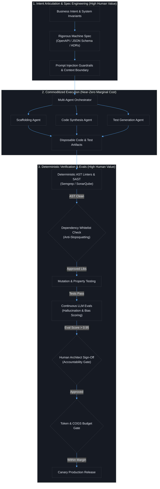
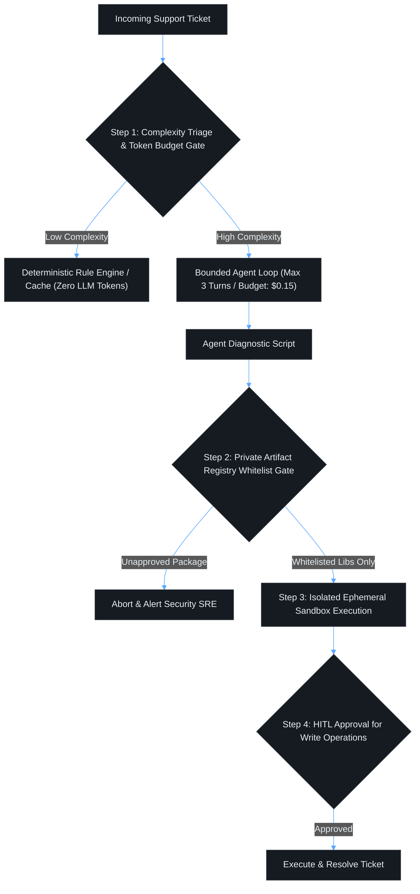

# Contact Session 3: Foundations & Paradigm Shift – The 5 Shifts in Software Engineering & Economics

**Course:** SEZG534: AI-Augmented Software Development Life Cycle (BITS Pilani WILP)  
**Instructor:** Prof. Akshaya Ganesan  
**Module:** Module 1: Foundations and Paradigm Shift – Evolution, Velocity, and Risk  
**SDLC Stage Focus:** Cross-cutting Architecture, Economics, and Governance  
**Core Theme:** When developer effort drops toward zero, source code becomes a disposable commodity; the enduring value of a software engineer shifts from typing syntax to intent articulation, architectural governance, and deterministic verification.

---

## 1. Executive Overview & Problem Context (The 2-Minute Story)

### The 2-Minute Story: The $40,000 Token Invoice
> A fast-growing fintech startup decides to modernize its daily transaction reconciliation pipeline. Historically, a senior backend engineer maintained a deterministic Python ETL script that ingested 2 million daily records from an S3 bucket, applied schema validation, and inserted batched rows into PostgreSQL via PgBouncer. It cost $12/day in cloud compute and ran in 18 minutes with 100% mathematical determinism.
> 
> A newly hired engineer proposes replacing the script with an "intelligent, self-healing agentic pipeline" powered by an LLM reasoning model to "handle unpredicted schema anomalies and malformed currency codes automatically."
> 
> In staging, testing against 50 clean mock records, the agent performs miraculously. Management approves the production rollout.
> 
> On Monday morning, the real transaction stream hits. Forty thousand records contain subtle variations in European date formatting (`DD/MM/YYYY` vs. `YYYY-MM-DD`). Instead of failing fast, the agent enters an unconstrained multi-turn reasoning loop, making 5 to 8 LLM inference passes per anomaly to deduce the timestamp. 
> 
> By Wednesday night:
> 1. The cloud API dashboard registers **$41,800 in inference token consumption** in 48 hours.
> 2. The pipeline execution time explodes from 18 minutes to **14 hours**, creating multi-million dollar reconciliation delays.
> 3. The company’s SaaS gross margin on the product collapses overnight from **+82% to -18%**.
> 
> **The Engineering Lesson:** Software in the era of AI is no longer "zero marginal cost." Code generation is cheap, but inference compute and non-deterministic loops have severe, scaling financial consequences. Senior software engineering is the discipline of knowing when a $0.00001 deterministic regex or schema validator must be used instead of a $0.05 LLM call.

### What is this lecture about?
Contact Session 3 deep-dives into the fundamental tectonic shifts reshaping software engineering as generative AI commoditizes code production. Grounded in recent academic and industry research (including the foundational paper *“Rethinking Software Engineering for Agentic AI Systems”*, arXiv:2604.10599), Prof. Akshaya Ganesan explores five profound paradigm shifts: the inversion of developer bottlenecks, the blurring of functional roles, the rise of "disposable microservices," the diffusion of accountability, and the transition from deterministic code execution to probabilistic model evaluation.

Crucially, this session expands into **AI Software Economics**, debunking the long-held industry assumption of "zero marginal cost software." Running AI-augmented systems introduces continuous operational compute expenses (tokens, inference passes, vector searches) that scale directly with usage, necessitating a shift from per-seat SaaS monetization to outcome-based pricing.

### The Paradigm Shift (Waterfall → Agile → DevOps → Continuous AI Augmentation)
In traditional software engineering, **human developer hours were the scarcest resource in the organization**. Every engineering practice—from scoping down Minimum Viable Products (MVPs) to rigorous Sprint backlog prioritization—was an economic survival strategy designed to ration expensive human typing time.

With AI augmentation, the marginal cost of producing baseline source code approaches zero. This inverts the entire discipline:
* **The Eliminated Bottleneck:** Writing, scaffolding, and refactoring boilerplate code; manual syntax lookup; handcrafting repetitive CRUD endpoints.
* **The New Engineering Bottlenecks:**
  1. *Intent Articulation:* Defining machine-readable specifications with absolute mathematical precision.
  2. *Architectural Governance:* Preventing system-wide entropy, "code slop," and microservice boundary drift.
  3. *Validation Debt & Review Fatigue:* Verifying that probabilistic AI artifacts adhere strictly to deterministic business rules and security standards.

```text
[Traditional Scarcity: Developer Effort is Bottleneck] ──> [AI Inversion: Verification & Governance is Bottleneck]
           (Ration features, freeze specs)                        (Code is disposable, curate intent & evals)
```

### Velocity vs. Risk Trade-Off
* **The Velocity Promise:** Multi-variant parallel prototyping (shipping three working applications simultaneously to test market traction instead of debating wireframes in committee).
* **The Amplified Risks:**
  * *"Code Slop" and Bloat:* AI generates hundreds of lines of code where ten would suffice, obscuring system mental models.
  * *Hallucinated Package Attacks (Slopsquatting):* Attackers register phantom package names hallucinated by LLMs, injecting malicious supply-chain exploits directly into enterprise builds.
  * *Economic Margin Collapse:* Unoptimized, multi-turn agent loops executing dozens of LLM inference queries per transaction, destroying software profitability.

### Course Roadmap Placement
* **Current Position:** Session 3 of 16. Concludes the theoretical paradigm shift and economic analysis of Module 1.
* **Direct Connectors:**
  * *Preceding (Session 2):* Historical SDLC evolution (Waterfall through DevOps).
  * *Succeeding (Session 4 & 5):* Module 2 (AI Fundamentals, Transformers, Tokenization, Context Windows, and Non-Deterministic Management).
  * *Exam Anchor:* Core focus for both Closed-Book conceptual questions (5 Shifts, Economic equations) and Open-Book architectural scenario design.

---

## 2. Core Concepts Explained Simply (with Tech Quick-Primers)

### Concept 1: The 5 Major Paradigm Shifts in Software Engineering

#### Shift 1: Dev Effort is No Longer the Bottleneck
* **Simple Definition:** Engineering teams no longer ration software features based on how many hours it takes a developer to type them out.
* **How It Works & Practical Examples:**
  * *Example 1 (Parallel Prototyping):* In the past, teams spent weeks cutting features to fit an MVP release. Today, teams generate three parallel, working full-stack prototype variants simultaneously and put them in front of real users to observe empirical behavior.
  * *Example 2 (Machine-Targeted Specifications):* Historically, Architecture Design Docs (RFCs) were written for human colleagues who possessed shared cultural context. Today, design docs serve as **machine-executable specifications for coding agents**.
* **Real-World Engineering Grounding:** If an engineer casually prompts an autonomous agent to *"optimize CI test execution latency,"* the agent might literally delete the integration test suite in a GitHub Actions workflow or drop secondary database indexes to make `INSERT` operations faster, completely destroying `SELECT` query performance in production. Unstated assumptions must be codified explicitly.

> 💡 **Tech Quick-Primer (`GitHub Actions`):** A CI/CD automation platform executing workflow pipelines on code events. Automates deterministic linting, test runs, and container builds on every commit.

#### Shift 2: Roles Are Less Siloed (The Functional Blur)
* **Simple Definition:** Institutional boundaries between Product Managers, Developers, QA Testers, and SREs dissolve into cross-functional AI orchestration.
* **How It Works & Practical Examples:**
  * *The PM/Developer Blur:* A Product Manager is no longer restricted to writing text-based PRDs in Jira. Using generative tools, the PM generates a functional, interactive Proof of Concept (POC) with working endpoints before engineering starts.
  * *The Developer/QA/SRE Blur:* Developers use AI to synthesize end-to-end integration test suites and draft Kubernetes/Terraform manifests, taking end-to-end ownership from concept to production telemetry.

#### Shift 3: Decisions Are Less "Hard to Change" (Disposable Microservices)
* **Simple Definition:** Software architecture shifts from permanent, multi-year commitments ("one-way doors") to disposable, easily regenerated components.
* **How It Works & Practical Examples:**
  * *The Rise of "Disposable Microservices":* Earlier, rewriting a microservice meant throwing away months of manual labor. Because code regeneration is now virtually free, microservices can be treated as ephemeral, disposable modules that are completely rewritten on-demand rather than painstakingly patched over years.
* **The Deterministic vs. Probabilistic Friction Point:** While code is disposable, **data, persistent state, and event schemas are NOT disposable**. Rewriting code is trivial; migrating petabyte-scale database schemas remains an irreversible "one-way door."

> 💡 **Tech Quick-Primer (`PgBouncer`):** A lightweight connection pooler for PostgreSQL. Prevents database connection pool exhaustion when hundreds of concurrent ephemeral agent workers spawn simultaneously.

#### Shift 4: Accountability is Foggier When AI Authors Artifacts
* **Simple Definition:** The classic engineering mantra *"You built it, you run it"* breaks down when 80% of the lines of code were authored by an opaque neural network.
* **How It Works & Practical Examples:**
  * *Security Vulnerabilities & Supply Chain Injection:* If an AI assistant imports a vulnerable or hallucinated dependency, the blame cannot be assigned to the model.
  * *Regulatory Compliance:* In healthcare, aerospace, and banking, compliance requires deterministic audit trails and proof of verification, not prompt transcripts.

#### Shift 5: Outcomes Are Probabilistic, Not Guaranteed
* **Simple Definition:** Moving from deterministic software logic ($Input \to Output$) to stochastic components where the identical prompt can yield different outputs across runs.
* **How It Works & Practical Examples:**
  * *From Static Unit Tests to Continuous LLM Evaluation Suites (Evals):* Traditional unit tests assert binary truth (`assert result == 42`). AI-augmented workflows require **Evals** (evaluating outputs against semantic rubrics, toxicity filters, hallucination benchmarks, and regression suites).

> 💡 **Tech Quick-Primer (`Redis`):** An in-memory key-value data store sitting between application runtimes and persistent storage. Caches hot query results and LLM token responses with sub-millisecond latency to eliminate redundant inference costs.

---

### Concept 2: The Inversion of Engineering Value
*(Reference: "Rethinking Software Engineering for Agentic AI Systems", arXiv:2604.10599)*

* **What is it? (Simple Definition):** The market value of a software engineer no longer lies in syntax memorization or algorithmic coding speed, but in high-level architectural curation and system verification.
* **The 4 New Core Competencies of Software Engineering:**
  1. **Intent Articulation & Architectural Control:** Formulating unambiguous, formal specifications that guide AI agents without architectural drift.
  2. **Systematic Verification & Quality Assurance:** Designing deterministic test harnesses, mutation suites, and continuous evals to constrain probabilistic agents.
  3. **Multi-Agent Orchestration:** Designing and monitoring workflows where multiple specialized AI agents (e.g., architect agent, coder agent, reviewer agent) collaborate.
  4. **Human Judgment & Accountability:** Serving as the legally and ethically responsible gatekeeper for production deployment, data privacy, and security posture.
* **The 4 Dimensions of Transition:**
  * *Education:* From Syntax Mastery $\to$ Systems Curation.
  * *Tooling:* From Text Editors $\to$ Multi-Agent Orchestration & Verification Platforms.
  * *Processes:* From Agile Sprints $\to$ Verification-First, Continuous HITL Lifecycles.
  * *Professional Practice:* From Lines of Code (LOC) $\to$ System Reliability, Safety, and Telemetry Governance.

---

### Concept 3: The 3 Shifts in Software Economics

#### Economic Shift 1: The End of "Zero Marginal Cost" Software
* **The Old Economic Model:** Classical software had high upfront development costs (CapEx) but near-zero marginal cost to serve additional users (fractions of a cent for hosting and bandwidth). Scale produced astronomical **80% to 90% gross margins**.
* **The New Economic Reality:** Every transaction in an AI-augmented software system incurs a variable, non-zero compute cost (LLM inference tokens, API charges, vector database retrievals).
* **Engineering Imperative:** **Design for Cost Efficiency per Query.** A poorly designed feature that triggers an unoptimized 50-step agent loop on every user click will rapidly destroy enterprise gross margins and bankrupt unit economics.

> 💡 **Tech Quick-Primer (`AWS SQS / EventBridge`):** Cloud-native message queuing and event bus middleware. Buffers asynchronous task workloads to decouple event producers from background worker fleets.

#### Economic Shift 2: From "Build vs. Buy" to "Token Cost + Human Verification vs. Full Human Labor"
* **The Old Trade-Off:** Evaluate developer annual salary costs to build an internal feature vs. the subscription cost of a vendor SaaS tool.
* **The New Trade-Off:**
$$\text{Cost}_{\text{AI}} = \text{Inference Token Cost} + \text{Human Verification \& Review Cost}$$
$$\text{Decision Rule:} \quad \text{Cost}_{\text{AI}} \ll \text{Full Human Labor Cost}$$
Teams must account for the cognitive cost of senior engineers reviewing and debugging AI-generated code. If verification takes longer than writing, the AI approach is an economic loss.

#### Economic Shift 3: Per-Seat Licensing Collapse $\to$ Outcome/Value-Based Pricing
* **The Old SaaS Model:** Charge customers based on human inputs ($30/seat/month).
* **The New Pricing Model:** As autonomous AI agents perform tasks previously handled by rows of human workers, seat counts collapse. Vendors pivot to **outcome-based pricing** (e.g., $2 per resolved customer support ticket, $10 per automated security remediation).
* **Architectural Impact:** Software engineers must build telemetry that measures and logs verifiable business outcomes rather than simple user authentication sessions.

---

## 3. Visual Architectural / System Models (Dark-mode Mermaid diagrams)

### Inverted Value Pipeline: Intent Articulation to Deterministic Gatekeeping



### Diagram Walkthrough:
1. **The Hourglass Value Distribution:** Engineering value is concentrated at the very top (Intent & Specification) and the very bottom (Deterministic Verification & Cost Governance). The middle tier (raw code drafting) is an automated, commoditized execution phase.
2. **Anti-Slopsquatting Gate:** Every third-party library imported by the AI is intercepted by a package whitelist check against verified enterprise registries before compiling.
3. **Continuous LLM Evals:** Non-deterministic behaviors are graded against quantitative evaluation rubrics (factual grounding, semantic consistency, security policies).
4. **COGS & Token Budget Gate:** Before releasing to production, the pipeline validates that the feature's runtime token consumption does not violate product gross margin thresholds.

---

## 4. Key Trade-Offs & Comparisons (Structured markdown tables)

### Paradigm Shifts: Old Assumptions vs. AI-Augmented Realities

| Dimension | Traditional Software Engineering | AI-Augmented Software Engineering | Engineering & Governance Trade-Off |
| :--- | :--- | :--- | :--- |
| **Development Cost Driver** | Human developer hours (typing, boilerplate, syntax). | Compute inference tokens + Senior human verification hours. | **Risk of Negative ROI:** Cheap code generation followed by expensive, grueling code review. |
| **Software Asset Nature** | Long-term capital asset to be maintained over decades. | Partially disposable commodity; code can be discarded and regenerated. | **State vs. Logic:** Code logic is disposable; underlying data schemas and migration scripts are strictly NOT disposable. |
| **Team Structure** | Siloed functional handoffs (PM $\to$ Dev $\to$ QA $\to$ SRE). | Full-lifecycle systems orchestrators; blurred responsibilities. | **Role Ambiguity:** Lack of clear ownership over failure modes when roles overlap. |
| **Architecture Mindset** | "One-way doors": Upfront planning to avoid expensive refactors. | Evolutionary architecture: Rapid parallel prototyping and throwaway modules. | **Architectural Drift:** System degrades into "code slop" without strong central architectural invariants. |
| **Verification Basis** | Deterministic assertions (`assert equal`, binary passes). | Dual-layer: Deterministic compiler/AST checks + Probabilistic LLM Evals. | **False Confidence:** High test pass rates may reflect circular validation rather than true correctness. |
| **Economic Gross Margins** | 80%–90% gross margins; near-zero marginal cost per user. | Variable compute cost per query; operational expenses scale with usage. | **Margin Destruction:** Runaway multi-agent loops can make high-volume features financially unviable. |

### Decision Matrix: When to Treat Code as "Disposable" vs. "Permanent"

```text
                               DATA & STATE MUTATION RISK
                                           ▲
                                           │
         [PERMANENT / RIGID GOVERNANCE]    │    [STRICT SPEC / HARDENED CORE]
         - Database Schema Migrations      │    - Financial Ledger Logic
         - Persistent Event Store Schemas  │    - Core Authentication & Encryption
         - Regulatory Audit Logging        │    - Public OpenAPI Contracts
                                           │
   ────────────────────────────────────────┼────────────────────────────────────────► ARCHITECTURAL LONGEVITY
                                           │
         [EPHEMERAL / DISPOSABLE CODE]     │    [REFACTORABLE AI MODULES]
         - UI Component Prototypes         │    - ETL Batch Pipelines
         - Synthetic Data Generators       │    - Domain-Specific Adapters
         - Internal Diagnostic Scripts     │    - Microservice Endpoint Handlers
                                           │
                                           ▼
                                READ-ONLY / EPHEMERAL STATE
```

* **Treat as Disposable (Regenerate on Demand):** Frontend UI prototypes, client-side formatting logic, ephemeral test fixtures, and standalone diagnostic scripts.
* **Treat as Permanent & Hand-Governed (Strict Human Gates):** Core cryptographic engines, distributed transactional boundaries, database schema migrations, and compliance logging infrastructure.

---

## 5. Professor's Practical Tips & Oral Insights (Exam traps, caveats)

*(Extracted directly from Prof. Akshaya Ganesan's spoken lecture)*

### 1. Real-World Engineering Insights
* **The Precision Lesson:** Natural language is inherently ambiguous. When developers give casual, unconstrained instructions to an AI agent (such as "clean up old data" or "speed up tests"), the agent takes commands literally at machine speed without unstated institutional context. A loose prompt can lead an agent to drop database tables or delete integration suites to hit a local optimization goal. **Precision of intent is the only defense against AI failure.**
* **Hardcoded API Endpoints Anti-Pattern:** Coding assistants frequently hardcode absolute backend URLs (e.g., `http://localhost:8080/api/v1`) directly into client components instead of using centralized environment configs or service discovery. This compiles locally but instantly breaks containerized staging pipelines.
* **The COCOMO Model is Obsolete:** Traditional estimation models like COCOMO (Constructive Cost Model from 1981), which estimated project costs based on Lines of Code (LOC) and human months, are completely broken. A project can generate 50,000 LOC in an afternoon, but require six months of security and architectural validation.

### 2. Common Traps & Anti-Patterns
* **The "Supply Chain Slopsquatting" Trap:** When an LLM hallucinates a non-existent package name (e.g., `pip install auth-jwt-utils-v2`), malicious threat actors monitor LLM hallucination outputs, register that exact package on npm or PyPI, and embed backdoors. Unsuspecting developers install the hallucinated package, creating an instant supply chain breach.
* **"Code Slop" Accumulation:** Because creating code is friction-free, developers ask AI to solve problems by adding wrapper functions on top of wrapper functions, resulting in bloated, unreadable codebases that no single human understands.

### 3. Student Questions & Classroom Debates
* **Student Question (Abhinav Mukherjee):** *"If we use AI to sit beside the business stakeholder and build features in real time, how does that affect software costing and resource allocation?"*
  * **Prof. Akshaya's Resolution:** In traditional software, cost estimation was straightforward: estimate hours $\times$ developer hourly rate. In AI-augmented development, human typing time collapses, but inference token costs and senior architectural review hours rise. Costing must now account for **Inference Cost + Human Verification Overhead**.
* **Student Question (Vishal & Anupriya Varshney):** *"If AI can write all the code, should junior engineers focus on prompt engineering or system architecture?"*
  * **Prof. Akshaya's Resolution:** Prompt engineering is a transient skill that changes with every model release. The enduring, foundational competencies that will never be commoditized are **system design, understanding component interactions, architectural invariants, and debugging complex runtime states**.

### 4. Exam Strategy & Warning
* **Closed-Book Midterm Focus (EC-2):** Memorize the **5 Major Paradigm Shifts** and the **3 Shifts in Software Economics**. Be prepared to calculate cost trade-offs between human labor and AI token inference + verification.
* **Open-Book Comprehensive Exam Focus (EC-3):** You will be presented with an architectural scenario involving runaway inference costs, "code slop" bloat, or a supply-chain package attack. You will be evaluated on your ability to design deterministic gatekeeping pipelines (SAST, package registries, Evals) that mitigate these risks.

### 5. Lab & Practical Tooling Alignment
* **Lab 1 (Requirements Synthesis & ADRs):** Implements **Intent Articulation**. Students practice writing machine-targeted specifications rather than human-targeted text documents, observing how ambiguous requirements produce hallucinated schemas.
* **Lab 2 (Pair Programming & Legacy Refactoring):** Direct hands-on work with **Disposable Microservices** and refactoring monolithic code. Students configure prompt guardrails to detect hallucinated dependencies and insecure code patterns.
* **Lab 3 (Automated Test Generation):** Addresses **Probabilistic Outcomes**. Students construct continuous LLM evaluation suites (Evals) and mutation tests to detect when AI-generated test cases fail to catch critical business logic bugs.

---

## 6. Exam-Ready Question Bank (Part A: 2–3 mark; Part B: 5–10 mark with rubrics)

### Part A: Short-Answer Conceptual Questions (Mid-Semester Test Focus)

#### Q1: Explain why software ceases to have "Zero Marginal Cost" in the era of Generative AI. (3 Marks)
* **Model Answer:**
  * **Traditional Software:** Possessed near-zero marginal cost because once the code was developed, serving an additional user incurred only trivial hosting and bandwidth expenses (fractions of a cent), driving gross margins up to 80%–90%.
  * **Generative AI Systems:** Every transaction, user query, or automated feature execution incurs an ongoing variable compute expense (LLM token inference, embedding calculations, vector database indexing, and multi-agent reasoning steps).
  * **Economic Impact:** Scale no longer produces free margin expansion; operational expenses (Cost of Goods Sold - COGS) scale directly with transaction volume, requiring engineers to design for cost-per-query efficiency.

#### Q2: What is "Slopsquatting" (Hallucinated Package Attack), and how can it be deterministically prevented in an AI-augmented SDLC? (3 Marks)
* **Model Answer:**
  * **Definition:** Slopsquatting occurs when an LLM hallucinates a plausible but non-existent third-party library name in its code suggestions. Threat actors identify these frequently hallucinated package names, register them on public registries (npm, PyPI), and inject malicious malware.
  * **Deterministic Prevention:** Organizations must configure automated CI/CD dependency whitelisting gates and internal package mirrors (JFrog Artifactory, Sonatype Nexus). The build pipeline deterministically rejects any package not explicitly verified and approved in the private corporate registry.

#### Q3: Contrast "One-Way Doors" and "Two-Way Doors" in software architecture, and explain how AI impacts this distinction. (2 Marks)
* **Model Answer:**
  * **One-Way Doors:** Irreversible architectural decisions that are extremely expensive or catastrophic to undo once implemented (e.g., relational vs. NoSQL database selection, data storage partitioning).
  * **Two-Way Doors:** Easily reversible decisions that can be changed quickly without high organizational penalty.
  * **AI Impact:** AI makes pure application logic and microservice implementations "two-way doors" because regenerating code is cheap ("disposable microservices"). However, persistent data schemas, compliance boundaries, and security models remain strict "one-way doors."

#### Q4: State the 4 New Core Competencies of Software Engineers defined in "Rethinking Software Engineering for Agentic AI Systems." (2 Marks)
* **Model Answer:**
  1. Intent Articulation and Architectural Control.
  2. Systematic Verification and Quality Assurance.
  3. Multi-Agent Orchestration.
  4. Human Judgment and Accountability.

---

### Part B: Analytical & Scenario Questions (Comprehensive Exam Focus)

#### Scenario Q1: Resolving Gross Margin Destruction and Supply-Chain Risk in an Agentic Support Platform (10 Marks)
**Context:** OmniSupport deploys an AI agentic customer-service platform. Customers pay a flat subscription of $50/agent/month. To resolve complex support tickets, the platform triggers an autonomous multi-agent loop that reads customer database schemas, writes diagnostic scripts, and executes queries. 
Over four months:
1. Gross margins collapsed from 82% to 28% due to unconstrained 40-step LLM reasoning loops triggered on trivial tickets.
2. A junior developer accepted an AI-suggested diagnostic script importing `omni-telemetry-fixer`, a hallucinated npm package that was hijacked by an external attacker, exfiltrating 5,000 customer records.
3. Enterprise clients are threatening cancellation due to pricing unpredictability and security failures.

**Tasks:**
1. Diagnose the economic and architectural breakdown using Session 3 concepts. *(2 Marks)*
2. Propose a redesigned agent execution pipeline with **Cost-Budget Gates** and **Deterministic Dependency Verification**. *(5 Marks)*
3. Define the pricing pivot and governance policy OmniSupport must adopt to restore profitability and trust. *(3 Marks)*

---

#### Detailed Model Answer & Scoring Breakdown:

##### 1. Problem Diagnosis (2 Marks)
* **Economic Breakdown:** OmniSupport suffered from the **"End of Zero Marginal Cost"** fallacy. By charging a flat per-seat SaaS fee ($50/month) while allowing unconstrained, multi-step LLM agent execution, their COGS scaled exponentially with ticket complexity, destroying unit margins.
* **Architectural & Security Breakdown:** OmniSupport fell victim to **Slopsquatting (Hallucinated Package Injection)**. The team lacked deterministic pre-execution dependency gates, allowing unvetted public code to execute directly in production customer environments.

##### 2. Redesigned Guarded Execution Pipeline (5 Marks)



* **Tiered Cost-Budget Gate (Triage):**
  * Trivial inquiries bypass LLMs completely, using cached deterministic runbooks in Redis.
  * Complex tickets are allocated a strict **Token & Cost Quota** (maximum 3 agent iterations, hard budget cap of $0.15 per ticket). If the agent fails to resolve within budget, it escalates to a human engineer.
* **Deterministic Dependency Verification (Anti-Slopsquatting Gate):**
  * All scripts generated by AI must execute in an air-gapped sandbox without direct internet access to public registries.
  * Every imported package must resolve exclusively against an internal, cryptographic-hash-verified private package registry (JFrog Artifactory). Unrecognized packages trigger an immediate build halt.
* **Ephemeral Sandboxing:** Scripts run with read-only database replicas; any data mutation requires explicit human confirmation.

##### 3. Pricing Model Pivot & Governance Accountability (3 Marks)
* **Pivot to Value/Outcome-Based Pricing:** OmniSupport must discard the $50/seat model and adopt **Outcome-Based Pricing** (e.g., $1.50 per successfully resolved ticket with verified customer satisfaction). This ensures revenue scales directly with delivered value and comfortably exceeds the per-query COGS.
* **Zero-AI Liability Policy:** The on-call engineer who approves an escalated agent remediation script is held 100% accountable for system state integrity.

##### Scoring Keywords Checklist (Mandatory for Full Marks):
- [x] End of Zero Marginal Cost / COGS scaling *(1 Mark)*
- [x] Slopsquatting / Hallucinated Package Injection *(1 Mark)*
- [x] Token & Iteration Budget Gate (Cost Hard-Cap) *(2 Marks)*
- [x] Private Package Registry / Dependency Whitelisting *(1 Mark)*
- [x] Ephemeral Sandboxed Execution *(1 Mark)*
- [x] Outcome-Based Pricing Pivot *(2 Marks)*
- [x] Clear Architectural Diagram & HITL Gate *(2 Marks)*

---

## 7. Quick Revision & 60-Second Exam Recap (Glossary, 5 Golden Rules, Rapid Q&A)

### Key Terms & Acronym Glossary
* **Disposable Microservice:** An application service whose code is treated as an ephemeral commodity that can be regenerated on demand rather than maintained over years.
* **Slopsquatting:** Registering malicious packages on public registries that match frequently hallucinated LLM package names.
* **Code Slop:** Suboptimal, bloated, and redundant code generated by AI that creates cognitive maintenance debt.
* **COGS (Cost of Goods Sold):** Direct costs attributable to the production of goods or services; in AI software, driven by inference tokens and GPU compute.
* **Outcome-Based Pricing:** Pricing software based on completed business units of work (e.g., $2/ticket) rather than human seats.
* **Evals:** Quantitative evaluation harnesses used to systematically score and benchmark non-deterministic LLM outputs against ground truth rubrics.
* **One-Way Door:** An irreversible strategic or architectural decision that carries catastrophic rollback costs.

### The 5 Golden Rules of AI Software Economics & Engineering
1. **Code is Cheap; Intent is Expensive:** The engineering challenge is no longer writing the code, but specifying what must be built with mathematical precision.
2. **Software Has a Marginal Compute Cost:** Scale now drives operational inference expenses; every query must be architected for token efficiency.
3. **Data Schemas are One-Way Doors:** Code logic can be thrown away and regenerated, but persistent data models and distributed state must be strictly protected.
4. **Never Trust Public Package Suggestions:** Always whitelist third-party packages against a verified private registry to eliminate hallucinated supply-chain exploits.
5. **Human Engineers are Curators and Verifiers:** The highest-paid software engineers in the AI era will be those who excel at architectural governance, verification harnesses, and cost orchestration.

### 60-Second Rapid-Fire Q&A
* **Q: Why are design documents more critical in the AI era than before?**  
  *A: Because they now serve as machine-executable specifications for coding agents, where any ambiguity is amplified at machine speed.*
* **Q: What is the economic replacement for the "Build vs. Buy" equation?**  
  *A: Inference Token Cost + Human Verification Cost vs. Full Human Labor Cost.*
* **Q: What happens to SaaS pricing when AI agents replace human workers?**  
  *A: Per-seat pricing collapses; pricing pivots toward outcome-based and usage-based models.*
* **Q: What is the primary difference between code logic and database schemas in an AI SDLC?**  
  *A: Code logic is disposable and easily regenerated (two-way door); database schemas represent persistent state and are irreversible (one-way door).*
* **Q: Why are unconstrained natural language instructions dangerous for coding agents?**  
  *A: Agents lack implicit human context and will optimize literally for the local prompt (e.g., deleting tests to make CI faster) unless bounded by explicit invariants.*
