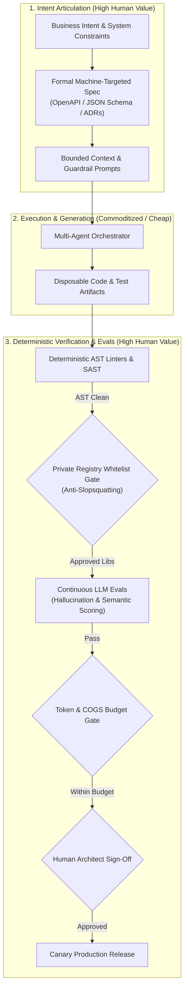

# Lecture 3: Foundations & Paradigm Shift – The 5 Shifts in Software Engineering & Economics

**Course:** SEZG534: AI-Augmented Software Development Life Cycle (BITS Pilani WILP)  
**Instructor:** Prof. Akshaya Ganesan  
**Module:** Module 1: Foundations & Paradigm Shift  
**SDLC Stage Focus:** Cross-cutting Architecture, Economics, and Governance  
**Core Theme:** When developer typing effort approaches zero, source code becomes a disposable commodity; the enduring value of a software engineer shifts from typing syntax to intent articulation, architectural governance, and deterministic verification.

---

## 1. The Big Picture (Why Should I Care?)

- **What is this lecture about?**  
  This lecture explores the fundamental disruption of software engineering as AI commoditizes code production: how developer roles change, why code has become disposable, how software economics are upended, and why software is no longer "zero marginal cost."
- **The Real-World Problem:**  
  A fintech team replaced an 18-minute, $12/day deterministic Python ETL script with an "agentic pipeline" to handle data anomalies automatically. In production, 40,000 records had date formatting variations (`DD/MM/YYYY` vs `YYYY-MM-DD`). The agent entered an unconstrained multi-turn reasoning loop, running 8 LLM passes per record. Within 48 hours, the team racked up **$41,800 in API token costs**, runtimes exploded to 14 hours, and product gross margins collapsed from **+82% to -18%**. Code is cheap, but inference compute and unverified logic have massive financial consequences.
- **Where this fits in the SDLC & Course:**  
  This concludes Module 1's foundational framework, establishing the economic and architectural guardrails needed before diving into deep technical topics (transformers, tokenization, context windows, and testing).

---

## 2. Core Concepts Explained Simply

### Concept 1: The 5 Major Paradigm Shifts in Software Engineering

1. **Shift 1: Developer Effort is No Longer the Bottleneck**  
   * *What it is:* Teams no longer ration features based on how many hours it takes to write code.  
   * *Real-World Impact:* Instead of arguing in committee over wireframes, teams build three working prototype variants in parallel and test them with real users. Design docs (RFCs) are no longer just for human teammates; they are **machine-executable specifications for coding agents**.
2. **Shift 2: Roles Are Less Siloed (The Functional Blur)**  
   * *What it is:* Boundaries between Product Managers, Developers, QA, and DevOps dissolve.  
   * *Real-World Impact:* A PM can generate a functional interactive proof-of-concept before engineering starts; developers use AI to generate end-to-end integration test suites and Kubernetes manifests.
3. **Shift 3: Decisions Are Less "Hard to Change" (Disposable Microservices)**  
   * *What it is:* Code logic is no longer an expensive asset that must be preserved for 10 years; it can be discarded and regenerated on demand.  
   * *Crucial Boundary:* **Code logic is disposable, but persistent data schemas are NOT.** You can rewrite a service in an afternoon, but migrating a multi-terabyte production database schema remains an irreversible "one-way door."
4. **Shift 4: Accountability is Foggier When AI Authors Artifacts**  
   * *What it is:* When an AI model generates 80% of a pull request, identifying who is at fault for security leaks or production crashes becomes complicated.  
   * *The Rule:* An AI model has zero accountability. The **human engineer who approves and commits the code carries 100% liability**.
5. **Shift 5: Outcomes Are Probabilistic, Not Guaranteed**  
   * *What it is:* Shifting from deterministic logic ($Input \to Output$) to stochastic models where the same prompt can yield different outputs.  
   * *Real-World Impact:* Traditional binary unit tests (`assert result == 42`) are supplemented with **continuous LLM Evals** (benchmarks evaluating semantic consistency, hallucination rates, and toxicity).

---

### Concept 2: The Inversion of Engineering Value

- **What is it?**  
  The market value of a software engineer no longer lies in syntax memorization or typing speed, but in high-level architectural curation and system verification.
- **The 4 Core Competencies of Modern Software Engineers:**
  1. **Intent Articulation & Architectural Control:** Writing crystal-clear, unambiguous specifications that guide AI without architectural drift.
  2. **Systematic Verification & Quality Assurance:** Designing deterministic test harnesses, mutation suites, and evaluation rubrics to catch probabilistic errors.
  3. **Multi-Agent Orchestration:** Designing workflows where specialized agents (architect, coder, reviewer) collaborate reliably.
  4. **Human Judgment & Accountability:** Acting as the legal, ethical, and operational gatekeeper for production deployment.
- **Key Distinction / Rule of Thumb:**  
  Typing syntax has been commoditized; system design, verification, and component integration have become more valuable than ever.

---

### Concept 3: The 3 Shifts in Software Economics

1. **Shift 1: The End of "Zero Marginal Cost" Software**  
   * *Traditional Software:* Near-zero marginal cost per user; once built, scaling to 100k users added negligible hosting costs, yielding **80%–90% gross margins**.  
   * *AI-Augmented Software:* Every transaction triggers inference tokens, vector lookups, and compute calls. Operational costs (COGS) scale directly with volume.  
   * *Rule of Thumb:* High-volume, high-frequency transactions must use deterministic code (e.g., regex, SQL indexes) rather than expensive LLM calls.
2. **Shift 2: The New Cost Equation**  
   $$\text{Cost}_{\text{AI}} = \text{Inference Token Cost} + \text{Senior Human Verification Cost}$$  
   * If junior developers generate massive volumes of AI code that senior engineers spend hours deciphering and debugging, the total cost of delivery can easily exceed manual human authoring.
3. **Shift 3: Per-Seat Licensing Collapse $\to$ Outcome-Based Pricing**  
   * *Old Model:* Charging $30/seat/month for human users.  
   * *New Model:* As AI agents replace human seats, software pricing pivots to **outcome-based pricing** (e.g., $1.50 per resolved ticket, $10 per automated security patch).

---

### Concept 4: Slopsquatting & Supply-Chain Hallucination Attacks

- **What is it?**  
  A security vulnerability where an AI coding assistant hallucinates a non-existent package name (e.g., `npm install auth-jwt-utils-v2`), and an attacker notices this, registers that exact package name on public registries (npm, PyPI), and injects malicious malware.
- **Why do we need it?**  
  Developers accepting AI suggestions blindly can pull malware straight into corporate builds.
- **Simple Real-World Example:**  
  An enterprise build pipeline that blocks all direct downloads from public npm and forces all packages through an internal, hash-verified private registry (e.g., Artifactory/Nexus).
- **Tech Quick-Primer:**
  > 💡 **Tech Quick-Primer (`Redis`):** An in-memory data store used for sub-millisecond caching of LLM responses and frequent queries, eliminating redundant token inference expenses.

---

## 3. Visual Workflow & Architecture Models

### The Inverted Engineering Value Pipeline

### Diagram Walkthrough:
* **The Hourglass Value Model:** Engineering value is concentrated at the top (defining intent and specifications) and at the bottom (deterministic verification and budget governance). The middle tier (typing code) is automated.
* **Anti-Slopsquatting Check:** Every third-party library suggested by AI is validated against an internal corporate whitelist before compilation.
* **Token Budget Gate:** The system verifies that runtime inference expenses will not destroy product gross margins before deploying to production.

---

## 4. Key Comparisons & Trade-Offs

### Traditional vs. AI-Augmented Software Engineering

| Dimension | Traditional Software Engineering | AI-Augmented Software Engineering | Key Takeaway |
| :--- | :--- | :--- | :--- |
| **Primary Cost Driver** | Developer typing hours (syntax, boilerplates) | Inference token costs + Senior verification hours | Code creation is cheap; verification is expensive |
| **Nature of Code** | Capital asset maintained over decades | Disposable commodity; easily regenerated | Code is disposable; persistent data is NOT |
| **Team Roles** | Siloed handoffs (PM $\to$ Dev $\to$ QA $\to$ SRE) | Blurred, cross-functional systems orchestrators | Everyone owns intent and end-to-end delivery |
| **Architecture Mindset** | Upfront planning to avoid costly rewrites | Rapid parallel prototyping and throwaway modules | Strong central invariants needed to stop "code slop" |
| **Verification Basis** | Deterministic assertions (`assert ==`) | Dual-layer: Deterministic tests + Probabilistic Evals | High pass rates can hide circular AI validation |
| **Gross Margins** | 80%–90% margins (near-zero marginal cost) | Variable compute costs scale with usage | Feature design must account for inference COGS |

### Disposable Code vs. Permanent State Decision Matrix

| Characteristic | Disposable Code (Two-Way Door) | Permanent State (One-Way Door) |
| :--- | :--- | :--- |
| **Examples** | Frontend UI components, batch ETL scripts, mocks | Database schemas, financial ledgers, IAM permissions |
| **Approach** | Generate with AI; rewrite rather than refactor | Hand-crafted design; strict peer reviews; formal ADRs |
| **Cost of Change** | Low (regenerate in minutes) | Catastrophic (expensive data migrations & outages) |

---

## 5. Professor's Practical Takeaways & Golden Rules

*(Key insights emphasized by Prof. Akshaya Ganesan in lecture)*

1. **Precision of Intent is Your Only Defense:**  
   Natural language is ambiguous. When you give an unconstrained instruction like *"clean up old data"* or *"speed up tests"*, an agent optimizes literally for the local prompt—it might delete your integration test suite or drop secondary database indexes to make writes faster. Always specify strict invariants and boundaries.
2. **Beware Hardcoded API Endpoints:**  
   AI assistants frequently hardcode local URLs (e.g., `http://localhost:8080`) directly into client components instead of using environment configs or service discovery. This runs locally but breaks containerized CI pipelines.
3. **The COCOMO Model is Dead:**  
   Traditional software estimation models based on Lines of Code (LOC) are obsolete. An AI can generate 50,000 LOC in an afternoon; what matters is the time needed to verify, test, and safely deploy it.
4. **Classroom Discussion Insights:**
   * *Feature Costing:* You can no longer estimate software costs based on developer hours alone. You must budget for **Inference Tokens + Verification Overhead**.
   * *Junior Engineer Career Focus:* Prompt engineering is a transient skill that changes with every model release. The timeless competencies that will never be commoditized are **system architecture, component interactions, and debugging runtime failures**.

---

## 6. Quick Recap & Terminology Cheatsheet

### Key Terms in 1 Line
* **Disposable Microservice:** An application module whose code is treated as an ephemeral commodity that can be regenerated on demand rather than manually maintained.
* **Slopsquatting:** Registering malicious public packages on npm/PyPI that match frequently hallucinated LLM package names.
* **Code Slop:** Bloated, redundant AI-generated code that compiles but obscures system mental models and increases maintenance debt.
* **COGS (Cost of Goods Sold):** Direct production expenses; in AI systems, driven by variable inference tokens and vector search compute.
* **Outcome-Based Pricing:** Monetizing software by completed business tasks (e.g., per resolved ticket) rather than per-user seats.
* **Evals:** Quantitative evaluation suites used to benchmark and score non-deterministic LLM outputs against ground-truth rubrics.
* **One-Way Door:** An irreversible architectural decision (e.g., core database schema) that carries catastrophic rollback costs.

### 4 Core Mental Rules to Remember
1. **Code is Cheap; Intent is Precious:** The engineering challenge is no longer writing code, but specifying what must be built with mathematical precision.
2. **Software Now Has a Marginal Cost:** Every query incurs an operational compute expense; architect high-volume paths to avoid unnecessary LLM calls.
3. **Code is Disposable, Data is Permanent:** Never treat database schemas or persistent state with the casualness of application code.
4. **Never Trust Public Package Suggestions:** Always whitelist libraries against a verified internal private registry.
