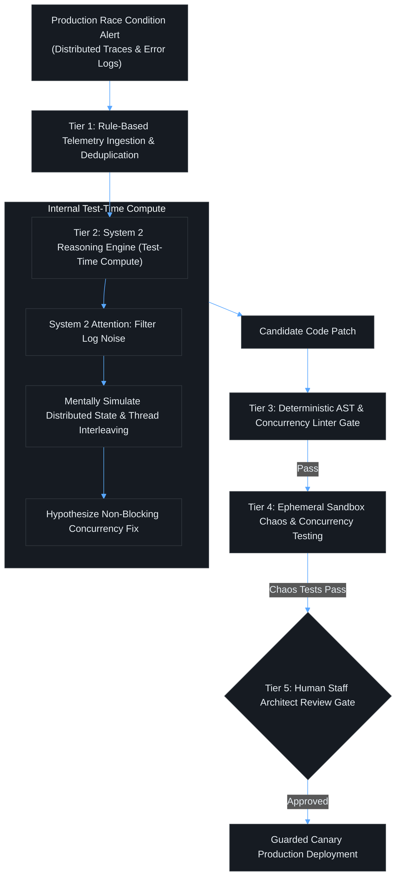

# Contact Session 4: Fundamentals of AI – Transformers, Foundation Models & Reasoning Engines

**Course:** SEZG534: AI-Augmented Software Development Life Cycle (BITS Pilani WILP)  
**Instructor:** Prof. Akshaya Ganesan  
**Module:** Module 2: Fundamentals of AI and Prompt Engineering  
**SDLC Stage Focus:** Cross-cutting / AI Core Mechanisms & Architecture  
**Core Theme:** Standard LLMs operate on fast, intuitive pattern matching (System 1), which generates plausible but flawed code; modern reasoning models scale test-time compute (System 2) to systematically trace execution, test hypotheses, and verify software correctness before output generation.

---

## 1. Executive Overview & Problem Context (The 2-Minute Story)

### The 2-Minute Story: The Silent Deadlock
> A backend engineer at a digital payments provider is tasked with adding a concurrency lock to the payment clearing worker in Go. The engineer opens their IDE, starts typing, and lets GitHub Copilot (a standard System 1 fast-pattern matching model) generate the lock implementation using Redis:
> 
> ```go
> // AI-generated lock implementation
> func acquireLock(client *redis.Client, key string) bool {
>     ok, _ := client.SetNX(ctx, key, "locked", 0).Result()
>     return ok
> }
> ```
> 
> The code looks clean, minimalist, and idiomatic. It compiles without warnings, and passing a mock client in a single-threaded unit test produces an immediate green checkmark. The engineer opens a PR, peer review skims the 15-line diff, and the change is deployed to production.
> 
> At 9:15 AM on Monday, during peak transactional volume, a worker pod crashes mid-execution due to an unhandled OS `SIGKILL` after acquiring the lock. Because the AI-generated code set the Redis expiration TTL to `0` (infinite timeout) and failed to generate an automatic lease heartbeat, the lock is never released.
> 
> Within 120 seconds:
> 1. Fifty Kubernetes worker pods queue up on the Redis key, deadlocking the clearing pipeline.
> 2. Downstream gRPC timeouts cascade into the checkout gateway, blocking $1.8M in customer transactions.
> 3. Senior engineers spend two hours diagnosing why workers are hanging, only to discover the missing TTL parameter.
> 
> **The Engineering Lesson:** System 1 autocomplete models generate what *looks* statistically probable based on trillions of lines of public code—not what is architecturally sound or resilient to distributed edge cases. A System 2 reasoning model (using test-time compute) mentally simulates the failure paths, recognizes that distributed workers crash, and implements the **Redlock pattern with lease renewals and monotonic fencing tokens**. Understanding the gap between probabilistic intuition and deterministic verification is the core responsibility of an AI software engineer.

### What is this lecture about?
Contact Session 4 shifts from the historical and organizational SDLC foundations to the core technical mechanics of modern Artificial Intelligence underpinning software development assistants. Prof. Akshaya Ganesan demystifies the progression of AI architectures—from symbolic rule-based expert systems and traditional machine learning to Transformer-based Foundation Models and the breakthrough of **Inference-Time Reasoning Models (System 1 vs. System 2 thinking)**.

Rather than approaching AI as a black box, software engineers must understand how models process information: how self-supervised learning unlocked planetary-scale pre-training without manual data labeling, how the self-attention mechanism enables holistic contextual awareness, and why scaling "test-time compute" allows reasoning models to mentally simulate code execution, hypothesize bug root causes, and disprove invalid patches before emitting syntax.

### The Paradigm Shift (Waterfall → Agile → DevOps → Continuous AI Augmentation)
In traditional automated software tooling (compilers, linters, static analyzers), software analysis was governed by **Symbolic Logic and Deterministic Rules**:
* If an AST node violated rule $X$, flag error $Y$.
* While 100% deterministic and explainable, symbolic systems could not scale to ambiguous natural language specifications, complex refactoring, or multi-file architectural synthesis.

The modern AI SDLC replaces rigid rule engines with **Probabilistic Foundation Models**:
* **The Eliminated Bottleneck:** The requirement to manually program explicit rules for every syntax edge case, code smell, and refactoring pattern.
* **The New Engineering Bottleneck:** **Managing stochastic non-determinism, preventing hallucinated logic, and debugging probabilistic inference failures** in environments where production software requires absolute mathematical certainty.

```text
[Symbolic AI: Explicit Rules, Zero Generalization] ──> [Traditional ML: Supervised Pattern Classifiers] ──> [Transformers/LLMs: System 1 Auto-Complete] ──> [Reasoning LLMs: System 2 Test-Time Verification]
```

### Velocity vs. Risk Trade-Off
* **The Velocity Gain:** Standard LLMs produce syntactic boilerplate in milliseconds. Reasoning models solve intricate algorithmic optimizations, distributed race conditions, and architectural migrations across microservices in a single prompt turn.
* **The Amplified Risk:** System 1 autocomplete models suffer from "hallucinatory confidence"—generating syntactically pristine code that secretly introduces breaking API changes, N+1 query loops, or concurrency deadlocks. Without test-time reasoning or deterministic static gates, developers spend hours debugging plausible-looking "code hallucinations."

### Course Roadmap Placement
* **Current Position:** Session 4 of 16. First session of Module 2 (AI Fundamentals & Prompt Engineering).
* **Direct Connectors:**
  * *Preceding (Session 3):* Paradigm shifts and the economics of token consumption.
  * *Succeeding (Session 5):* Tokenization mechanics (BPE, WordPiece), context window dynamics, context drift, and prompt engineering strategies.
  * *Midterm Scope:* Closed-book testing on Transformer architecture, self-supervision, and Kahneman System 1/System 2 distinctions.

---

## 2. Core Concepts Explained Simply (with Tech Quick-Primers)

### Concept 1: The AI Evolutionary Spectrum (Symbolic → ML → Foundation → Reasoning)
* **What is it? (Simple Definition):** The historical progression of machine intelligence from human-written "if-then" logic to autonomous neural reasoning.
* **The 4 Evolutionary Eras:**
  1. **Symbolic Logic & Expert Systems (1950s–1980s):** Programs built on explicit, human-coded "if-then-else" rules and knowledge graphs. Highly explainable and deterministic, but completely brittle; unable to generalize to unprogrammed scenarios.
  2. **Traditional Machine Learning (1990s–2010s):** Statistical algorithms (SVMs, Random Forests, Logistic Regression) trained via supervised learning on labeled datasets. Excelled at classification (predicting if a commit contains a bug), but could not generate new code or understand complex natural language.
  3. **Deep Learning & Foundation LLMs (2017–2023):** Giant neural networks based on the Transformer architecture, pre-trained on unlabelled internet-scale data via **self-supervised learning**. Generates text and code auto-regressively in a single forward pass.
  4. **Test-Time Compute & Reasoning Models (2024–Present):** Models optimized via reinforcement learning to generate internal, hidden chains of thought (reasoning traces), spending dynamic compute time at inference to verify hypotheses before producing output.

> 💡 **Tech Quick-Primer (`PyTorch`):** An open-source machine learning framework providing GPU-accelerated tensor computation. Powers the underlying training and inference execution pipelines of modern foundation models.

> 💡 **Tech Quick-Primer (`Tree-sitter (AST)`):** A fast, incremental parsing library that builds and updates Abstract Syntax Trees (ASTs) on-the-fly. Enables static analysis tools and IDEs to inspect syntactic and structural invariants of code in milliseconds.

* **Key Boundaries & Distinctions:** All Machine Learning is AI, but not all AI is Machine Learning. Expert systems and rule engines are AI, but possess zero learning capacity.

---

### Concept 2: Self-Supervised Learning & The "ChatGPT Moment"
* **What is it? (Simple Definition):** The training technique that enabled language models to train on billions of web pages without needing humans to manually label the data.
* **How It Works (Step-by-Step):**
  1. *The Supervised Bottleneck:* Traditional ML required human annotators to label every training sample (e.g., tagging 100,000 code snippets with bug categories), which was cost-prohibitive and unscalable.
  2. *Self-Supervision:* The training task is structured so that the raw data provides its own labels.
  3. *Next-Token Prediction (Auto-Regressive):* The model is fed a sequence of text (e.g., `def calculate_total(price, tax): return price + `) and tasked with predicting the masked next token (`tax`).
  4. Because the target token already exists in the raw training corpus, the model learns grammar, syntax, logic, and world knowledge autonomously by processing petabytes of open-source code and technical documentation.
* **The Deterministic vs. Probabilistic Friction Point:** Self-supervised pre-training teaches models statistical word/token co-occurrence, not formal logic. The model does not "know" Python syntax; it knows the probabilistic probability distribution of tokens that follow a Python function header.
* **Real-World Engineering Grounding:** A developer reads a codebase with missing comments and infers architecture; an LLM reads millions of GitHub repositories with next-token masking and infers the statistical distribution of API parameters.

---

### Concept 3: The Transformer Architecture & Self-Attention
* **What is it? (Simple Definition):** The foundational neural network architecture (introduced by Vaswani et al. in 2017) that replaced sequential recurrent networks (RNNs/LSTMs) by processing all tokens in a sequence simultaneously using **Self-Attention**.
* **How It Works (Step-by-Step):**
  1. **Parallel Ingestion:** Unlike RNNs that process text sequentially word-by-word (creating a massive processing bottleneck), Transformers ingest entire code files simultaneously in parallel.
  2. **Query, Key, and Value ($Q, K, V$) Projections:** Every token is transformed into three mathematical vectors: Query (what am I looking for?), Key (what do I contain?), and Value (what information do I represent?).
  3. **Self-Attention Calculation:** The attention score between token $i$ and token $j$ is computed via scaled dot-product attention:
     $$\text{Attention}(Q, K, V) = \text{softmax}\left(\frac{Q K^T}{\sqrt{d_k}}\right)V$$
  4. This allows a variable reference on line 450 to "pay direct mathematical attention" to a function signature declared on line 12, regardless of how many lines separate them.

> 💡 **Tech Quick-Primer (`Semgrep`):** A fast, lightweight static analysis (SAST) tool that matches patterns directly against Abstract Syntax Trees (ASTs). Enables security teams to write declarative rules enforcing cryptographic and architectural invariants without regex flakiness.

* **The Deterministic vs. Probabilistic Friction Point:** While attention captures global context, its compute complexity scales quadratically ($O(N^2)$) with context length, leading to severe computational cost when ingesting massive enterprise codebases.

---

### Concept 4: Reasoning Models vs. Standard LLMs (System 1 vs. System 2 Thinking)
*(Grounded in Daniel Kahneman's "Thinking, Fast and Slow")*

* **What is it? (Simple Definition):** 
  * **Standard LLMs operate via System 1:** Fast, instinctive, automatic, and intuitive pattern matching. They generate the next token immediately without planning.
  * **Reasoning Models operate via System 2:** Slow, deliberate, conscious, and analytical. They spend extra compute time *during inference* (test-time compute) to plan, explore alternative paths, and verify logic.

> 💡 **Tech Quick-Primer (`Redis Distributed Lock (Redlock)`):** A distributed locking algorithm implemented across Redis instances. Prevents split-brain race conditions and deadlocks across microservice worker fleets using monotonic fencing tokens and TTL heartbeats.

* **The Architectural Breakdown: Automated Bug Fixing Across Microservices:**
  * **Traditional ML Classifier:** Identifies which line or file likely contains a bug using historical commit log classification, but cannot write, explain, or evaluate the fix.
  * **Standard LLM (System 1 Auto-Complete):** Inspects the buggy function and immediately outputs a plausible patch in a single forward pass. However, it often misses subtle concurrency deadlocks, breaks downstream API contracts, or forgets edge cases.
  * **Reasoning Model (System 2 Inference Scaling):**
    1. *Scratchpad Trace:* Generates an internal, hidden chain of thought.
    2. *Stack Trace Simulation:* Mentally traces the execution path across distributed microservices.
    3. *Hypothesis Formulation:* Hypothesizes three distinct root causes (memory leak, null pointer, race condition).
    4. *Simulation & Disproof:* Simulates running edge cases through each hypothesis, systematically disproving two.
    5. *Verification Gate:* Verifies that the remaining candidate fix does not violate external API contracts.
    6. *Final Output:* Emits the clean, verified production patch.
* **System 2 Attention (S2A):** An inference scaling technique where the model executes an intermediate attention step to rewrite the user prompt, stripping away irrelevant tokens and cognitive noise before generating the final response.

---

## 3. Visual Architectural / System Models (Dark-mode Mermaid diagrams)

### Standard LLM Single-Pass vs. Reasoning Model Test-Time Compute Pipeline

```mermaid
%%{init: {'theme': 'dark', 'themeVariables': { 'darkMode': true, 'background': '#0d1117', 'mainBkg': '#161b22', 'textColor': '#e6edf3', 'lineColor': '#58a6ff', 'errorBkgColor': '#8b0000', 'nodeBorder': '#30363d', 'clusterBkg': '#161b22', 'clusterBorder': '#30363d'}}}%%
flowchart TD
    subgraph System_1_Standard["Standard LLM: System 1 (Fast / Single-Pass / Auto-Complete)"]
        P1["Buggy Microservice Code + Prompt"] --> LLM1["Transformer Forward Pass<br/>(Greedy / Top-p Token Sampling)"]
        LLM1 --> Out1["Immediate Output Code Patch<br/>(Plausible, but prone to hidden race conditions & breaking changes)"]
    end

    subgraph System_2_Reasoning["Reasoning Model: System 2 (Deliberate / Test-Time Compute / Verified)"]
        P2["Buggy Microservice Code + Prompt"] --> S2A["System 2 Attention (S2A):<br/>Prompt Denoising & Irrelevant Token Filtering"]
        
        S2A --> Scratchpad["Internal Hidden Scratchpad (Reasoning Traces)"]
        
        subgraph Test_Time_Search["Test-Time Search & Verification (MCTS / Tree-of-Thought)"]
            Scratchpad --> Hypo["Generate 3 Root Cause Hypotheses<br/>(H1: Race Cond, H2: Memory Leak, H3: Null Ref)"]
            Hypo --> Sim["Simulate Execution Against Edge Cases"]
            Sim --> Prune["Disprove & Prune Invalid Branches (H2, H3)"]
            Prune --> Verify["Verify H1 Against Downstream API Contracts"]
        end
        
        Verify -->|"Verified Valid"| Out2["Production-Grade Verified Code Patch<br/>(Robust, edge-case safe, zero contract breakage)"]
    end
```



### Diagram Walkthrough:
1. **Single-Pass Vulnerability (System 1):** The top pipeline illustrates standard LLMs. The prompt enters, executes a single forward pass through the transformer layers, and directly streams output tokens. There is zero intermediate logic check, making it vulnerable to hallucinated edge cases.
2. **System 2 Attention (S2A):** The reasoning pipeline begins by filtering prompt noise and irrelevant contextual clutter.
3. **Internal Hidden Scratchpad:** The model creates private reasoning traces that are not displayed to the user, allowing it to "talk to itself" and plan.
4. **Test-Time Compute Search:** Using Tree-of-Thought search, the model spawns multiple execution hypotheses, tests them against edge constraints, prunes failed paths, and only outputs the verified solution.

---

## 4. Key Trade-Offs & Comparisons (Structured markdown tables)

### Comparison: Rule-Based AI vs. Standard LLMs vs. Reasoning Models

| Dimension | Rule-Based Symbolic AI | Standard LLM (e.g., GPT-4o, Claude 3.5 Sonnet) | Reasoning Model (e.g., OpenAI o1/o3, Claude 3.7 Thinking) |
| :--- | :--- | :--- | :--- |
| **Cognitive Mode** | Hardcoded Deductive Logic. | **System 1:** Fast, intuitive, pattern recognition. | **System 2:** Slow, deliberate, multi-step search. |
| **Execution Latency** | Microseconds ($\mu s$). | Fast (Sub-second to 2 seconds). | Slow (10 seconds to 2 minutes of test-time compute). |
| **Inference Cost** | Near-zero compute cost. | Low to Moderate token cost. | High token cost (charges for hidden reasoning tokens). |
| **Explainability** | 100% Deterministic & Traceable. | Opaque black box (Probabilistic token co-occurrence). | High: Generates step-by-step reasoning traces. |
| **Edge-Case Performance** | Fails completely on unprogrammed input. | Poor: Hallucinates plausible but incorrect solutions. | **Superior:** Systematically simulates and validates edge cases. |
| **Primary SDLC Fit** | Static syntax linters, compiler checks. | Boilerplate generation, docstrings, simple refactors. | **Complex architectural design, tricky concurrency bugs, security threat modeling.** |

### Governance Matrix: Selecting AI Models Across SDLC Tasks

```text
                           TASK CRITICALITY & LOGICAL COMPLEXITY
                                            ▲
                                            │
        [REASONING MODEL (SYSTEM 2)]        │      [DUAL: REASONING + DETERMINISTIC SAST]
        - Concurrency & Race Condition Fixes │      - Core Financial Ledger Engine
        - Microservice Architecture Migration│      - Zero-Day Vulnerability Patching
        - Cryptographic Protocol Design     │      - Mission-Critical Safety Firmware
                                            │
  ──────────────────────────────────────────┼──────────────────────────────────────────► EXECUTION FREQUENCY / LATENCY CONSTRAINT
                                            │
        [RULE-BASED DETERMINISTIC LINTER]   │      [STANDARD LLM (SYSTEM 1)]
        - Formatting / PEP8 Enforcement     │      - Inline IDE Autocomplete
        - AST Import Sorting                │      - Docstring / Comment Generation
        - Hardcoded Secret Scanning         │      - Unit Test Boilerplate Drafting
                                            │
                                            ▼
                               LOW COMPLEXITY / ROUTINE TASKS
```

* **Deploy Standard System 1 Models:** High-frequency, low-latency tasks where immediate suggestions are required (inline IDE autocompletion, drafting unit test skeletons, generating Swagger documentation).
* **Mandate Reasoning Models (System 2):** High-complexity, high-risk tasks where correctness outweighs latency (debugging multi-threaded deadlocks, designing architectural boundaries, verifying regulatory compliance).
* **Enforce Deterministic Tools:** Static analysis (SAST), compiler type checks, and secret scanners must intercept outputs from both System 1 and System 2 models.

---

## 5. Professor's Practical Tips & Oral Insights (Exam traps, caveats)

*(Extracted directly from Prof. Akshaya Ganesan's spoken lecture)*

### 1. Real-World Engineering Insights
* **Copilot is a Tool, Not a Model:** Prof. Akshaya clarified a common misconception among engineers: GitHub Copilot is a developer environment/harness, not an underlying AI model. Modern tools allow you to toggle the underlying engine—switching between fast System 1 models for autocomplete and deep System 2 reasoning models for complex refactoring.
* **Why Self-Supervision Changed the World:** If AI research had remained dependent on supervised learning (manual data labeling), the generative AI revolution would have stalled. Self-supervision allowed models to treat the entire open-source internet as an automated training playground.
* **The "Recipe vs. Chef" Reality:** A software program is like a deterministic culinary recipe: execute steps 1 to 5 exactly, and you are guaranteed the same dish. A foundation model is an experienced chef who has read 10 million recipes; if you ask for a dish, they improvise based on statistical taste patterns. It may taste brilliant, or it might accidentally add salt instead of sugar unless you verify the ingredients.

### 2. Common Traps & Anti-Patterns
* **The "Fast-Thinking Trap" in Code Review:** Relying on standard System 1 models to perform automated security reviews. A standard LLM scans code rapidly and approves it because the syntax looks standard. Only reasoning models (or deterministic SAST tools) trace tainted data flows from input parameters to database sinks.
* **Paying for Hidden Reasoning Tokens Blindly:** In reasoning models, users are billed for "hidden thinking tokens" generated during the scratchpad phase. Running an unconstrained reasoning model on simple repetitive tasks will trigger massive cloud billing shocks with zero added benefit.

### 3. Student Questions & Classroom Debates
* **Student Question (Abhinav Mukherjee):** *"Is rule-based AI completely dead now that we have LLMs?"*
  * **Prof. Akshaya's Resolution:** Absolutely not. Rule-based systems (linters, AST parsers, regex scanners, type checkers) are more critical now than ever. They serve as the **deterministic guardrails** that constrain non-deterministic LLMs. You should never use an expensive LLM to check if a semicolon is missing or if code conforms to indentation rules; deterministic tools do that in microseconds for zero cost.
* **Student Question (Discussion on System 2 Attention):** *"How does System 2 Attention actually prevent hallucinations?"*
  * **Prof. Akshaya's Resolution:** Standard self-attention attends to every token in the prompt, including irrelevant fluff or misleading comments. System 2 Attention adds an explicit intermediate step where the model rewrites and purges misleading tokens from the prompt context, preventing distracting noise from biasing the reasoning path.

### 4. Exam Strategy & Warning
* **Closed-Book Midterm Focus (EC-2):** Memorize the definitions of **Self-Supervised Learning**, **Self-Attention**, and **System 1 vs. System 2 thinking**. Expect questions asking you to contrast how Traditional ML, Standard LLMs, and Reasoning Models handle an automated bug fix.
* **Open-Book Comprehensive Exam Focus (EC-3):** You will be asked to architect a hybrid pipeline that combines rule-based systems, System 1 autocomplete, and System 2 reasoning engines, justifying model selection based on latency, cost, and risk tolerance.

### 5. Lab & Practical Tooling Alignment
* **Transformer Explainer (poloclub.github.io/transformer-explainer):** Interactive visualization tool referenced by Prof. Akshaya to understand multi-head self-attention weights in real time.
* **OpenAI Tokenizer (platform.openai.com/tokenizer):** Utility to inspect how code keywords, indentation, and Unicode characters are split into discrete mathematical tokens.
* **Cursor / Claude Code:** Developer tools allowing engineers to select between fast models (Claude 3.5 Haiku) for inline edits and reasoning models (Claude 3.7 Thinking) for deep repository-wide refactoring.

---

## 6. Exam-Ready Question Bank (Part A: 2–3 mark; Part B: 5–10 mark with rubrics)

### Part A: Short-Answer Conceptual Questions (Mid-Semester Test Focus)

#### Q1: Define "Self-Supervised Learning" and explain why it was the catalyst for the "ChatGPT moment." (3 Marks)
* **Model Answer:**
  * **Definition:** Self-supervised learning is a machine learning paradigm where the training data provides its own supervision labels directly from the input data, eliminating the need for human annotators to manually label samples.
  * **The Catalyst:** Traditional supervised learning was bottle-necked by the massive cost and time required to manually label data. Self-supervised learning framed language modeling as **next-token prediction** over unlabelled text. This allowed models to train on petabytes of open-source code and internet data, enabling the unprecedented scaling that produced modern foundation models.

#### Q2: Contrast System 1 and System 2 cognitive processing as applied to AI coding assistants. (3 Marks)
* **Model Answer:**
  * **System 1 (Standard LLMs):** Fast, instinctive, and automatic pattern matching. Operates in a single forward pass, generating code auto-regressively without internal planning. Highly efficient for boilerplate, but prone to subtle semantic errors and hallucinations.
  * **System 2 (Reasoning Models):** Slow, deliberate, and analytical. Employs **test-time compute** to generate hidden reasoning traces on a scratchpad, evaluating multiple hypotheses, simulating execution, and verifying edge cases before generating the final output.

#### Q3: State the core mathematical mechanism of the Transformer architecture and describe its primary advantage over Recurrent Neural Networks (RNNs). (2 Marks)
* **Model Answer:**
  * **Mechanism:** **Self-Attention** ($\text{softmax}\left(\frac{QK^T}{\sqrt{d_k}}\right)V$), which calculates mathematical dependency weights between every pair of tokens in a sequence simultaneously.
  * **Advantage over RNNs:** RNNs process tokens sequentially, creating an unparallelizable bottleneck and forgetting long-range dependencies. Transformers ingest the entire sequence in parallel, capturing distant code dependencies (e.g., linking a function call to a distant import) with zero positional decay.

#### Q4: What is "System 2 Attention" (S2A)? (2 Marks)
* **Model Answer:**
  * System 2 Attention is an inference scaling technique where an AI model executes an intermediate reasoning step to rewrite and denoise the input prompt before generating a response. It purges irrelevant context, misleading biases, and extraneous tokens, significantly improving reasoning accuracy on complex tasks.

---

### Part B: Analytical & Scenario Questions (Comprehensive Exam Focus)

#### Scenario Q1: Architecting a Tiered Bug-Triage & Automated Healing Pipeline (10 Marks)
**Context:** PayFlow processes $50M in daily payments across a distributed microservices network. During peak sales, a subtle distributed race condition causes intermittent transaction double-billing. PayFlow's engineering lead wants to deploy an AI-augmented bug fixing system. They initially test a standard System 1 LLM (GPT-4o), but it hallucinates a patch that removes database mutex locks, passing unit tests locally but causing massive data corruption in staging.

**Tasks:**
1. Analyze why the System 1 LLM failed to resolve the distributed concurrency bug. *(2 Marks)*
2. Design a multi-tiered automated remediation architecture combining Rule-Based Tools, a System 2 Reasoning Model, and an Ephemeral Staging Sandbox. *(5 Marks)*
3. Establish the verification criteria and HITL release gate required before deploying the patch to production. *(3 Marks)*

---

#### Detailed Model Answer & Scoring Breakdown:

##### 1. System 1 Failure Analysis (2 Marks)
* **Greedy Single-Pass Flaw:** The standard LLM operates on System 1 pattern matching. It recognized the syntax of database locking and generated a superficially clean patch by removing the lock contention, failing to mentally trace the distributed execution state across concurrent threads.
* **Superficial Unit Test Passing:** Because the local unit tests were single-threaded, they failed to simulate multi-threaded concurrency, creating a false-positive pass that masked severe data corruption.

##### 2. Multi-Tiered Automated Remediation Architecture (5 Marks)



* **Tier 1: Deterministic Telemetry Ingestion:** Rule-based log parsers extract the exact transaction IDs, stack traces, and OpenTelemetry spans, isolating the affected microservice endpoints.
* **Tier 2: System 2 Reasoning Engine (Test-Time Compute):**
  * Uses a high-reasoning model (OpenAI o3 / Claude 3.7 Thinking mode).
  * The model executes System 2 Attention to strip noisy log timestamps, generates an internal reasoning trace, models the race condition using distributed state trees, and synthesizes a thread-safe patch (distributed Redis lock with TTL).
* **Tier 3: Deterministic AST & SAST Gate:**
  * Runs Semgrep and static thread-safety analyzers to verify syntax and ensure no security rules were violated.
* **Tier 4: Ephemeral Sandbox Concurrency & Mutation Testing:**
  * Spins up an ephemeral Kubernetes namespace. Executes high-concurrency stress testing (5,000 concurrent simulated payment requests via Locust/k6) to empirically verify that double-billing cannot occur.

##### 3. Verification Criteria & HITL Release Gate (3 Marks)
* **Zero Double-Billing Verification:** The candidate patch must run through 10,000 concurrent mock transactions in the sandbox with 0 deadlocks and 0 duplicate ledger entries.
* **Mandatory Staff Architect Sign-Off:** The lead financial systems architect must review the model's unredacted reasoning trace and sandbox telemetry before approving the merge.
* **Blast-Radius Controlled Canary:** The patch must deploy to a 1% canary pod with automatic rollback triggered if payment latency spikes by >20ms.

##### Scoring Keywords Checklist (Mandatory for Full Marks):
- [x] System 1 Single-Pass Failure Analysis *(1 Mark)*
- [x] Concurrency / Race Condition Blindness *(1 Mark)*
- [x] System 2 Test-Time Compute / Reasoning Traces *(2 Marks)*
- [x] System 2 Attention (S2A) / Prompt Denoising *(1 Mark)*
- [x] Deterministic AST & Static Analysis Gate *(1 Mark)*
- [x] Ephemeral Sandbox Concurrency Stress Testing *(2 Marks)*
- [x] Human-in-the-Loop Staff Sign-Off *(1 Mark)*
- [x] Visual Remediation Pipeline Flowchart *(1 Mark)*

---

## 7. Quick Revision & 60-Second Exam Recap (Glossary, 5 Golden Rules, Rapid Q&A)

### Key Terms & Acronym Glossary
* **Foundation Model:** A massive AI model pre-trained on vast multimodal data via self-supervised learning, adaptable to downstream tasks.
* **Transformer:** Neural network architecture relying on self-attention mechanisms to process sequence tokens in parallel.
* **Self-Supervised Learning:** Training method where data labels are derived automatically from the input text (e.g., next-token prediction).
* **System 1 Thinking:** Fast, intuitive, pattern-based cognitive processing; representative of standard LLM autocomplete.
* **System 2 Thinking:** Slow, deliberate, logical cognitive processing; representative of test-time reasoning models.
* **Test-Time Compute:** Allocating extra processing compute at inference time to explore hypotheses, simulate outcomes, and verify answers before generating text.
* **System 2 Attention (S2A):** Pre-processing step where a model rewrites and purges irrelevant tokens from a prompt to sharpen reasoning focus.
* **Reasoning Trace:** The hidden, intermediate step-by-step logic generated on an internal scratchpad by a reasoning model.

### The 5 Golden Rules of AI Fundamentals for Software Engineers
1. **Never Confuse Pattern Matching with Logic:** Standard LLMs predict probable tokens; they do not execute formal deductive logic unless guided by test-time reasoning.
2. **Deterministic Rules Must Constrain Probabilistic Models:** Linters, compilers, and type checkers are not obsolete; they are essential quality gates.
3. **Match the Model to the Task Risk:** Use fast System 1 models for boilerplate and documentation; reserve expensive System 2 reasoning models for complex logic and security bugs.
4. **Self-Attention Scales Quadratically ($O(N^2)$):** Be mindful of prompt context bloat; extraneous tokens degrade attention focus and balloon compute costs.
5. **Inspect the Reasoning Trace:** When evaluating complex AI-generated code, review the model's intermediate scratchpad reasoning to verify that its architectural assumptions are sound.

### 60-Second Rapid-Fire Q&A
* **Q: What is the primary difference between AI, Machine Learning, and Rule-Based Systems?**  
  *A: AI is the broad discipline; Rule-Based AI uses explicit human if-then rules without learning; ML algorithms autonomously learn statistical patterns from data.*
* **Q: Why was self-supervision critical to the scaling of LLMs?**  
  *A: It eliminated the human data-labeling bottleneck by using next-token prediction over unlabelled internet text.*
* **Q: How does a reasoning model fix bugs differently than a standard LLM?**  
  *A: A standard LLM generates a single-pass patch immediately; a reasoning model uses test-time compute to hypothesize root causes, simulate edge cases, and verify dependencies before outputting code.*
* **Q: What is System 2 Attention?**  
  *A: An inference scaling method that rewrites prompts to eliminate irrelevant or distracting tokens prior to reasoning.*
* **Q: Is GitHub Copilot an AI model?**  
  *A: No, Copilot is an IDE integration and harness tool that can connect to multiple underlying foundation and reasoning models.*
