# Lecture 4: Fundamentals of AI – Transformers, Foundation Models & Reasoning Engines

**Course:** SEZG534: AI-Augmented Software Development Life Cycle (BITS Pilani WILP)  
**Instructor:** Prof. Akshaya Ganesan  
**Module:** Module 2: Fundamentals of AI and Prompt Engineering  
**SDLC Stage Focus:** Cross-cutting / AI Core Mechanisms & Architecture  
**Core Theme:** Standard LLMs operate on fast, intuitive pattern matching (System 1), which generates plausible but flawed code; modern reasoning models scale test-time compute (System 2) to systematically simulate execution, evaluate hypotheses, and verify correctness before emitting code.

---

## 1. The Big Picture (Why Should I Care?)

- **What is this lecture about?**  
  This lecture demystifies the core machine learning technology powering coding assistants: how models evolved from symbolic rules to Transformers, how self-supervised learning works, and why the latest reasoning models (System 2) represent a massive leap over fast autocomplete (System 1).
- **The Real-World Problem:**  
  A developer uses GitHub Copilot to write a distributed Redis concurrency lock in Go. The generated code looks clean and passes a simple unit test: `client.SetNX(ctx, key, "locked", 0)`. But setting the TTL to `0` means zero expiration. On Monday morning, a worker pod crashes mid-execution after acquiring the lock. Fifty Kubernetes workers queue up, the clearing pipeline deadlocks, and $1.8M in customer payments stall. Fast pattern matching models output what *looks* probable, not what handles distributed edge cases safely.
- **Where this fits in the SDLC & Course:**  
  This kicks off Module 2 (AI Fundamentals & Prompt Engineering), bridging the high-level SDLC shifts from Module 1 to the actual inner workings of tokenization, attention, and reasoning engines.

---

## 2. Core Concepts Explained Simply

### Concept 1: The AI Evolutionary Spectrum (Symbolic $\to$ ML $\to$ Foundation $\to$ Reasoning)

- **What is it?**  
  The progression of machine intelligence across 4 distinct eras:
  1. **Symbolic Logic & Expert Systems (1950s–1980s):** Explicit human-coded "if-then-else" rules. Highly deterministic and explainable, but completely brittle and unable to generalize.
  2. **Traditional Machine Learning (1990s–2010s):** Statistical classifiers (SVMs, Random Forests) trained on labeled datasets. Great for classifying bugs, but unable to generate new code or understand natural language.
  3. **Deep Learning & Foundation LLMs (2017–2023):** Giant neural networks based on the Transformer architecture, pre-trained on unlabelled web data via **self-supervised learning**. Generates text and code auto-regressively in a single forward pass.
  4. **Test-Time Compute & Reasoning Models (2024–Present):** Models optimized to generate hidden chains of thought (scratchpad reasoning traces), spending dynamic compute time *during inference* to test hypotheses and verify logic before outputting text.
- **Key Distinction / Rule of Thumb:**  
  All Machine Learning is AI, but rule-based expert systems are AI with zero learning capacity.

---

### Concept 2: Self-Supervised Learning & Next-Token Prediction

- **What is it?**  
  The training breakthrough that enabled language models to train on billions of web pages and code repositories without humans needing to label the data.
- **How It Works:**  
  * **The Old Bottleneck:** Supervised learning required expensive human annotators to label every single sample.  
  * **The Self-Supervised Solution:** The data provides its own labels via **next-token prediction**. The model is given a sequence of code (e.g., `def add(a, b): return a + `) and trained to predict the masked next token (`b`).  
  * By processing petabytes of open-source code, models autonomously learn syntax, API signatures, and programming idioms.
- **Key Distinction / Rule of Thumb:**  
  Pre-training teaches statistical token co-occurrence, not formal logic. A model doesn't "understand" Python; it understands the probability distribution of tokens following a Python function header.

---

### Concept 3: The Transformer Architecture & Self-Attention

- **What is it?**  
  The neural network architecture (Vaswani et al., 2017) that replaced sequential Recurrent Neural Networks (RNNs) by processing all tokens in a sequence simultaneously using **Self-Attention**.
- **How It Works:**  
  1. **Parallel Ingestion:** Unlike RNNs that read code token-by-token (creating an unparallelizable bottleneck), Transformers ingest entire code files in parallel.
  2. **Query, Key, and Value ($Q, K, V$):** Every token generates three vectors: Query (*what am I looking for?*), Key (*what do I contain?*), and Value (*what information do I carry?*).
  3. **Self-Attention Calculation:**  
     $$\text{Attention}(Q, K, V) = \text{softmax}\left(\frac{QK^T}{\sqrt{d_k}}\right)V$$  
     This allows a variable usage on line 300 to pay direct mathematical attention to a type declaration on line 5, regardless of file distance.
- **The Catch:** Attention compute scales quadratically ($O(N^2)$) with context length, making massive prompt contexts computationally expensive.

---

### Concept 4: System 1 (Fast Pattern Matching) vs. System 2 (Reasoning Models)

- **What is it?**  
  Grounded in Daniel Kahneman's cognitive framework:
  * **System 1 (Standard LLMs - e.g., GPT-4o, Claude 3.5 Sonnet):** Fast, automatic, and intuitive. Generates code in a single forward pass without internal planning. Great for boilerplate, but prone to subtle concurrency bugs and hallucinations.
  * **System 2 (Reasoning Models - e.g., OpenAI o1/o3, Claude 3.7 Thinking):** Slow, deliberate, and analytical. Spends extra compute at inference time (**test-time compute**) to explore multiple hypotheses, simulate code execution, and verify edge cases before emitting code.
- **Simple Real-World Example:**  
  * *System 1:* Sees a concurrency issue and immediately outputs a patch removing lock contention (which accidentally allows race conditions).  
  * *System 2:* Generates a hidden scratchpad trace, simulates distributed worker crashes, recognizes the need for an expiration TTL and monotonic fencing tokens, and implements a robust Redlock pattern.
- **Tech Quick-Primer:**
  > 💡 **Tech Quick-Primer (`Tree-sitter`):** A fast incremental parsing library that builds Abstract Syntax Trees (ASTs) in real time, allowing static analysis tools and IDEs to verify code syntax deterministically.

---

### Concept 5: System 2 Attention (S2A)

- **What is it?**  
  An inference scaling technique where the model executes an intermediate reasoning step to rewrite and denoise the user prompt before answering.
- **Why do we need it?**  
  Standard self-attention attends to *every* token in the prompt, including irrelevant fluff, outdated comments, or misleading hints. S2A purges extraneous tokens, preventing noisy context from corrupting reasoning.

---

## 3. Visual Workflow & Architecture Models

### Standard LLM Single-Pass vs. Reasoning Model Test-Time Compute

```mermaid
flowchart TD
    subgraph System1["Standard LLM: System 1 (Single-Pass / Fast)"]
        P1["Code + Prompt"] --> LLM1["Forward Pass<br/>(Token Sampling)"]
        LLM1 --> Out1["Immediate Output Code<br/>(Prone to hidden race conditions & edge-case bugs)"]
    end

    subgraph System2["Reasoning Model: System 2 (Test-Time Compute / Verified)"]
        P2["Code + Prompt"] --> S2A["System 2 Attention (S2A):<br/>Denoise Prompt & Strip Irrelevant Tokens"]
        S2A --> Scratchpad["Hidden Internal Scratchpad (Reasoning Traces)"]
        
        subgraph Search["Test-Time Search & Verification"]
            Scratchpad --> Hypo["Generate 3 Root Cause Hypotheses"]
            Hypo --> Sim["Simulate Execution Against Edge Cases"]
            Sim --> Prune["Prune Invalid Branches"]
            Prune --> Verify["Verify Against API Contracts"]
        end
        
        Verify --> Out2["Verified Code Patch<br/>(Edge-case safe, robust concurrency)"]
    end
```

### Diagram Walkthrough:
* **Single-Pass Vulnerability:** Standard LLMs (System 1) take prompts and immediately stream tokens. There is zero planning or self-correction, making them vulnerable to plausible-looking bugs.
* **Prompt Denoising (S2A):** System 2 reasoning models first strip out irrelevant comments and distracting tokens.
* **Internal Scratchpad:** The model plans its steps in private reasoning tokens before generating output.
* **Hypothesis Testing:** Multiple execution paths are evaluated and invalid solutions are pruned before the final code is shown to the user.

---

## 4. Key Comparisons & Trade-Offs

### Symbolic AI vs. Standard LLMs vs. Reasoning Models

| Dimension | Rule-Based Symbolic AI | Standard LLM (System 1) | Reasoning Model (System 2) |
| :--- | :--- | :--- | :--- |
| **Cognitive Mode** | Explicit deductive rules | Fast, intuitive pattern matching | Deliberate multi-step search |
| **Latency** | Microseconds ($\mu s$) | Fast (Sub-second to 2s) | Slow (10s to 60s+ of reasoning) |
| **Inference Cost** | Near-zero | Low to Moderate | High (Charges for hidden thinking tokens) |
| **Edge-Case Safety** | Fails on unprogrammed cases | Poor (Hallucinates plausible syntax) | **Superior** (Simulates and verifies cases) |
| **SDLC Fit** | Compilers, static linters (AST) | Boilerplate, docstrings, simple CRUD | **Complex concurrency, architecture, security review** |

### AI Model Selection Across SDLC Tasks

| Task Complexity | Recommended Approach | Reason |
| :--- | :--- | :--- |
| **Code Formatting & Secrets** | **Deterministic Linters (Semgrep, ESLint)** | Microsecond latency, zero cost, 100% deterministic |
| **Autocomplete & Docstrings** | **Standard LLM (System 1)** | Sub-second latency keeps developers in the flow |
| **Concurrency, Race Conditions, Refactoring** | **Reasoning Model (System 2)** | Requires multi-step hypothesis testing and execution simulation |

---

## 5. Professor's Practical Takeaways & Golden Rules

*(Key insights emphasized by Prof. Akshaya Ganesan in lecture)*

1. **Copilot is a Harness, Not a Model:**  
   GitHub Copilot is a developer environment integration, not an underlying model. Modern AI tooling allows developers to switch engines—using fast System 1 models for inline typing and deep System 2 reasoning models for repository-wide refactoring.
2. **Rule-Based AI is More Important Than Ever:**  
   Rule-based tools (compilers, AST linters, type checkers) are not obsolete; they are the essential **deterministic guardrails** that catch non-deterministic LLM errors. Never waste expensive LLM tokens checking code indentation or semicolons.
3. **The "Recipe vs. Chef" Reality:**  
   Deterministic code is a recipe: follow steps 1 to 5 and you always get the exact same dish. A foundation model is an experienced chef who improvises based on statistical memory. It can produce something brilliant, or accidentally ruin the dish unless you inspect the ingredients.
4. **Beware Hidden Reasoning Token Costs:**  
   Reasoning models bill for private scratchpad thinking tokens. Using an expensive reasoning model for repetitive, simple string manipulation wastes cloud budgets with zero added quality.

---

## 6. Quick Recap & Terminology Cheatsheet

### Key Terms in 1 Line
* **Foundation Model:** A large deep-learning model pre-trained on massive datasets via self-supervised learning, adaptable across many tasks.
* **Transformer:** The neural architecture utilizing self-attention to process entire token sequences in parallel.
* **Self-Supervised Learning:** Training where labels are automatically generated from raw input data (e.g., next-token prediction).
* **System 1 Thinking:** Fast, intuitive, pattern-matching generation (standard LLM autocomplete).
* **System 2 Thinking:** Slow, deliberate, hypothesis-testing reasoning (models using test-time compute).
* **Test-Time Compute:** Allocating extra processing power at inference time to search, simulate, and verify solutions before emitting text.
* **System 2 Attention (S2A):** Pre-processing step that purges irrelevant tokens from user prompts to prevent reasoning distraction.
* **Reasoning Trace:** Hidden intermediate logic generated on a private scratchpad by a reasoning model.

### 4 Core Mental Rules to Remember
1. **Pattern Matching $\neq$ Logic:** Standard LLMs predict probable tokens; they do not perform formal deductive reasoning without test-time compute.
2. **Use Deterministic Tools for Deterministic Rules:** Always let AST linters and compilers handle syntax and formatting.
3. **Match Model to Task Risk:** Use fast System 1 for boilerplate; use System 2 for architecture, concurrency, and security.
4. **Attention Scales Quadratically ($O(N^2)$):** Keep prompts focused; prompt clutter degrades model attention and wastes budget.
