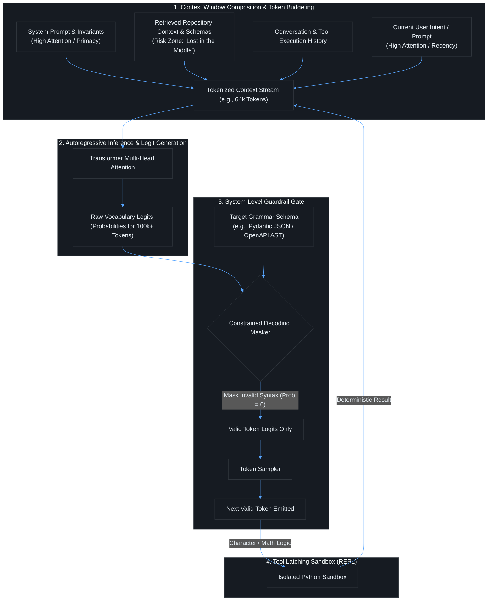
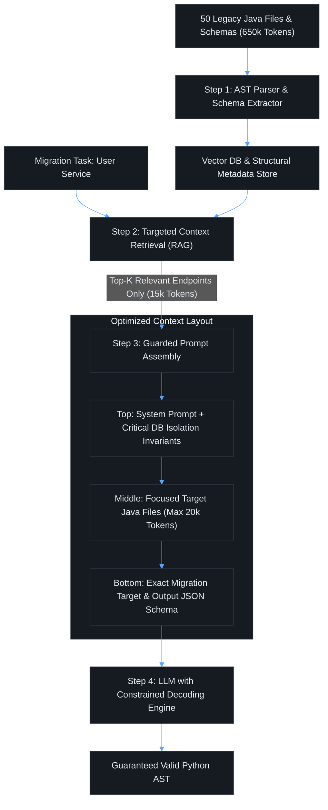

# Contact Session 5: Fundamentals of AI – Tokenization, Context Windows & System-Level Guardrails

**Course:** SEZG534: AI-Augmented Software Development Life Cycle (BITS Pilani WILP)  
**Instructor:** Prof. Akshaya Ganesan  
**Module:** Module 2: Fundamentals of AI and Prompt Engineering  
**SDLC Stage Focus:** AI Internals, Context Engineering & Runtime Guardrails  
**Core Theme:** Large Language Models do not read characters or syntax trees—they process subword token IDs; software engineers must architect around tokenization failure modes, context window degradation ("lost in the middle"), and enforce constrained decoding to guarantee deterministic code outputs.

---

## 1. Executive Overview & Problem Context (The 2-Minute Story)

### The 2-Minute Story: The Lost-in-the-Middle Breach
> A fintech engineering team builds an autonomous compliance agent designed to screen wire transfers against Anti-Money Laundering (AML) regulations before dispatching payment events to Apache Kafka.
> 
> Because modern foundation models support massive 128k-token context windows, the developers assemble a single monolithic prompt:
> 1. At the top (tokens 1 to 5,000): System instructions and role definition.
> 2. In the middle (tokens 5,000 to 115,000): A 150-page enterprise compliance manual, internal regulatory PDFs, sanction lists, and complex PostgreSQL database schema DDLs.
> 3. At the bottom (tokens 115,000 to 120,000): The user's payment transaction payload.
> 
> Deep inside page 78 of the compliance manual—around token position 65,000—lies a non-negotiable security invariant:
> > *"ANY international wire transfer exceeding $10,000 routed to an unverified offshore IBAN MUST require two-party human approval (Dual-Control 2FA) and be quarantined in staging."*
> 
> A client submits a $95,000 transfer to an unverified offshore account with an urgent message: *"Urgent invoice settlement; expedited processing requested."*
> 
> The LLM evaluates the prompt. Due to **Attention Dilution ("Lost in the Middle")**, the Transformer’s attention weights concentrate on the system prompt header (primacy effect) and the user's urgent request at the tail (recency effect). The attention weights across the middle 100,000 tokens decay to near zero. 
> 
> The model ignores the middle security invariant, determines that the transaction syntax is valid, and emits an automated approval payload: `{"status": "APPROVED", "wire_authorized": true}`. The $95,000 transfers immediately, resulting in a severe regulatory violation and financial loss.
> 
> **The Engineering Lesson:** Large context windows are not magic RAM. Attention is a scarce, decaying computational resource. As software engineers, dumping raw files and documentation into a prompt is an architectural failure. You must engineer context through targeted RAG, structural AST parsing, strategic prompt ordering, and deterministic constrained decoding gates.

### What is this lecture about?
Contact Session 5 dives beneath the conversational surface of Large Language Models to analyze their foundational currency: **Tokens** and **Context Windows**. Prof. Akshaya Ganesan explains how subword tokenization algorithms (Byte-Pair Encoding, SentencePiece) decompose human code into numerical token IDs, why this statistical chunking creates blind spots for LLMs (such as character-level string manipulation, off-by-one errors, and indentation drift), and how modern code-aware tokenizers and Abstract Syntax Tree (AST) pre-training mitigate these issues.

The session also addresses the operational reality of managing **Context Windows** in software engineering agents. As repository files, schemas, and chat histories accumulate, models suffer from severe cognitive failure modes—most notably **Attention Dilution ("Lost in the Middle")**, **Silent Degradation**, and **Cascading Agent Failures**. To build robust AI pipelines, engineers must move beyond pure prompting and implement system-level interventions: **Constrained Decoding (Grammar Masking)**, **Code Interpreters (Tool Latching)**, and active **Tokenomics Monitoring**.

### The Paradigm Shift (Waterfall → Agile → DevOps → Continuous AI Augmentation)
In traditional deterministic programming, memory management revolves around bytes, heap allocation, stack frames, and garbage collection. Developers instrument APMs (Application Performance Monitors) to track RAM and CPU utilization:
* In the AI SDLC, **Context Windows are the new RAM**, and **Tokens are the new Compute Instructions**.
* **The Eliminated Bottleneck:** Manually writing parsers, regex tokenizers, and rigid string processors for every possible data format.
* **The New Engineering Bottleneck:** **Context Budgeting, Context Window Pollution, and Attention Management.** Ingesting an entire 50-file codebase into an LLM context window causes the model's attention to dilute, leading to missed security invariants and hallucinated function calls.

```text
[Traditional Runtime: CPU Cycles + RAM Allocation] ──> [AI-Augmented Runtime: Inference FLOPs + Token Context Budget]
        (OOM Heap Errors, Memory Leaks)                         (Context Overflow, Lost-in-the-Middle Degradation)
```

### Velocity vs. Risk Trade-Off
* **The Velocity Gain:** Massive 1M+ token context windows allow developers to upload entire documentation libraries, database schemas, and microservice repositories into a single prompt session for instant querying.
* **The Amplified Risk:** Long contexts suffer from the **U-shaped attention curve ("Lost in the Middle")**. While an LLM remembers information at the very top (system instructions) and the very bottom (latest user query), critical security constraints placed in the middle of a massive context are silently ignored. Furthermore, token-heavy agent loops drive unpredictable cloud API bills ("Tokenomics shock").

### Course Roadmap Placement
* **Current Position:** Session 5 of 16. Concludes the AI Fundamentals portion of Module 2.
* **Direct Connectors:**
  * *Preceding (Session 4):* Transformer architecture, self-attention, and System 1 vs. System 2 thinking.
  * *Succeeding (Session 6 & 7):* Transition into Module 3 (Requirements & Architecture: Intent-to-Spec, ADR generation, Spec-driven development).
  * *Assessment Milestone:* Marks the syllabus boundary for **Online Quiz 1 (EC-1)**, covering Sessions 1 through 5.

---

## 2. Core Concepts Explained Simply (with Tech Quick-Primers)

### Concept 1: The Tokenization Taxonomy (Why Subwords Rule)
* **What is it? (Simple Definition):** The algorithmic process of breaking raw text or source code into discrete numerical chunks (tokens) that an LLM can mathematically process.
* **The Rule of Thumb:** In natural English, $1 \text{ token} \approx 4 \text{ characters}$ or $\approx 0.75 \text{ words}$ (100 tokens $\approx$ 75 words).
* **The 4 Tokenization Approaches:**
  1. **Character Tokenization:** Every single letter, space, and punctuation mark is a separate token.
     * *Strength:* Zero Out-of-Vocabulary (OOV) words; handles typos easily.
     * *Fatal Flaw:* Sequence lengths explode 4x–10x. Because Transformer self-attention scales quadratically ($O(N^2)$), compute and memory costs become catastrophic.
  2. **Word Tokenization:** Text is split on whitespace and punctuation, assigning an ID to each complete word.
     * *Strength:* Retains human semantic boundaries.
     * *Fatal Flaw:* Vocabulary size explodes to millions of words. Any unseen word, misspelling, or custom identifier (`getUserPaymentRecord`) triggers an unknown token (`<UNK>`), breaking code generation.
  3. **Subword Tokenization (BPE / SentencePiece / WordPiece):** Dynamically strikes the optimal balance. Common words (`def`, `class`, `return`) remain single tokens, while rare or compound words are broken into frequent subword fragments.
     * *Example:* `calculate_sum` $\to$ `["calculate", "_", "sum"]`.
  4. **Morphological Tokenization:** Splits words based on grammatical roots and affixes.

> 💡 **Tech Quick-Primer (`tiktoken`):** A fast BPE (Byte-Pair Encoding) tokenization library developed by OpenAI. Converts raw text to numerical token sequences and vice versa to calculate exact token budgets and costs before dispatching prompts.

* **Real-World Engineering Grounding:** Word tokenization is like carrying a dictionary containing every variable name ever typed in GitHub history—it exceeds memory limits. Character tokenization is like spelling every line of code letter-by-letter using individual bytes—it exhausts GPU attention bandwidth. Subword tokenization is like an optimized Huffman encoding table that encodes frequent patterns compactly while handling arbitrary new identifiers.

---

### Concept 2: How the Model "Sees" Code & Token-Induced Failure Modes
* **What is it? (Simple Definition):** LLMs do not see code text, syntax trees, or variable scopes—they only see a linear sequence of integer Token IDs.
* **How Code Tokenization Fails:**
  * **The String Manipulation & Character Counting Blind Spot:** Because models see token chunks rather than characters, asking an LLM *"How many 'e's are in strawberry?"* or *"Reverse this string"* or *"Return the character at index 14"* often fails. The token boundaries do not align with character indices.
  * **Custom Identifier Bloat:**
    * A standard keyword (`while`, `import`) = 1 token.
    * A custom camelCase or snake_case identifier (`fetchUserAccountLedgerBalance`) splits into 5–6 tokens, rapidly consuming context.
  * **Indentation & Whitespace Drift:** In older tokenizers (GPT-2/3), four spaces of indentation were encoded as four separate tokens (`[" ", " ", " ", " "]`), consuming 30%–40% of the context window purely on Python whitespace!
* **Re-Engineered Modern Code Tokenizers:** Modern frontier models (GPT-4, Claude 3.5, Llama 3) use **code-aware tokenizers**:
  * They encode multi-space indentation blocks (`\n    `) as single discrete tokens.
  * They are pre-trained with Abstract Syntax Tree (AST) metadata, teaching the model that code has hierarchical nested blocks, reducing token consumption by ~50%.

---

### Concept 3: Context Window Dynamics & The 4 Failure Modes
* **What is it? (Simple Definition):** The context window is the maximum hard ceiling of combined input prompt tokens plus output generated tokens that a model can process in a single inference call.
* **What Counts Toward the Context Window?**
  1. *System Prompt & Custom Instructions* (e.g., architectural guidelines, coding style).
  2. *Conversation History* (all prior turns, user prompts, and model responses).
  3. *Injected Retrieval Documents* (RAG context, API schemas, repository files).
  4. *The Output Being Generated* (every newly generated token counts against the total limit).

> 💡 **Tech Quick-Primer (`vLLM`):** A high-throughput, low-latency LLM serving engine featuring PagedAttention. Manages GPU KV-cache memory efficiently like virtual memory paging in operating systems, eliminating fragmentation during long-context inference.

* **The 4 Common Context Window Failure Modes:**
  1. **Attention Dilution ("Lost in the Middle"):** Research proves that LLMs attend strongly to the beginning (primacy effect) and end (recency effect) of long context windows, but their ability to retrieve and reason over facts placed in the middle drops dramatically (the U-shaped attention curve).
  2. **Silent Degradation:** As context fills up, the model does not throw an error; instead, its output quality gradually degrades—logic becomes sloppy, edge cases are skipped, and subtle syntax errors emerge.
  3. **Inconsistent Behavior:** Adding a single unrelated file or log snippet to a full context window alters the self-attention distribution, causing previously working prompts to fail.
  4. **Cascading Failures in Agentic Loops:** In autonomous coding agents, an error in an early tool output pollutes the context history. Subsequent agent turns reason over flawed intermediate data, compounding errors until the task fails completely.

---

### Concept 4: System-Level Guardrails (Moving Beyond Prompting)
* **What is it? (Simple Definition):** Engineering mechanisms built *outside* the LLM neural network to force deterministic correctness and eliminate tokenization limitations.
* **The Two Primary Interventions:**
  1. **Tool Latching & Code Interpreters (Task Delegation):**
     * Instead of forcing an LLM to guess math calculations, string slicing, or array sorting, the agent writes a short Python script, executes it inside an isolated sandbox (REPL), and captures the deterministic output.
  2. **Constrained Decoding & Structured Output Enforcers (Grammar Masking):**
     * When an LLM generates structured data (JSON, SQL, OpenAPI schemas), it produces probabilistic logits (probabilities for each token in its vocabulary).
     * **Logit Masking:** A context-free grammar (CFG) or JSON Schema validator intercepts the model *token-by-token*. Any token that would violate the syntax (an unquoted key, an illegal character, or improper indentation) has its logit set to $-\infty$ (0% probability). The model is mathematically prevented from emitting invalid syntax.

> 💡 **Tech Quick-Primer (`Pydantic`):** A data validation and settings management library using Python type hints. Guarantees runtime JSON schema compliance and type safety on structured outputs emitted by LLM agents.

> 💡 **Tech Quick-Primer (`Outlines`):** A library for neural text generation with guarantees. Guides LLM sampling using finite state machines (FSMs) or regular expressions to force deterministic JSON, SQL, or regex output from probabilistic models.

---

## 3. Visual Architectural / System Models (Dark-mode Mermaid diagrams)

### Context Window Flow & Constrained Decoding Architecture



### Diagram Walkthrough:
1. **Context Window Structure:** The input prompt is an assembled stream of system rules, retrieved RAG documents, chat history, and the user prompt. Crucial architectural constraints must be positioned at the top or bottom to evade the "Lost in the Middle" attention dip.
2. **The Logit Interception Point:** During autoregressive generation, the Transformer produces raw probability distributions over its entire vocabulary for the next token.
3. **Constrained Decoding (Grammar Masking):** Before the token is sampled, the system-level guardrail masks out any token that violates the target JSON Schema or Python AST grammar, guaranteeing 100% syntactically valid output.
4. **Tool Latching Sandbox:** Character manipulation or heavy mathematical tasks bypass LLM guessing entirely by executing in an isolated Python interpreter.

---

## 4. Key Trade-Offs & Comparisons (Structured markdown tables)

### Tokenization Strategy Comparison

| Approach | Unit of Representation | Vocabulary Size | Sequence Length | Primary Engineering Trade-Off |
| :--- | :--- | :--- | :--- | :--- |
| **Character Tokenization** | Individual ASCII/Unicode characters. | Very Small (~256 to 1,000). | Extremely Long (10x English text). | High compute cost ($O(N^2)$ attention scaling); context window exhausted instantly. |
| **Word Tokenization** | Full whitespace-delimited words. | Massive (Millions of words). | Short. | High memory footprint; fails on Out-of-Vocabulary (OOV) words and custom code identifiers. |
| **Subword Tokenization (BPE)** | Frequent subword units & characters. | Balanced (~32,000 to 128,000). | Moderate (~0.75 words/token). | **Industry Standard.** Excellent generalization; handles rare code identifiers by splitting them. |
| **Code-Aware Subword (AST)** | Subwords + Indentation blocks + AST tags. | Optimized (~100k+ with code). | Compact (~50% fewer tokens on code). | Superior context efficiency; requires modern tokenizer architectures (GPT-4/Claude 3.5). |

### Context Window Failure Modes & Mitigation Matrix

| Failure Mode | Root Cause Mechanism | Observable Symptom in SDLC | Engineering Mitigation Strategy |
| :--- | :--- | :--- | :--- |
| **Attention Dilution ("Lost in the Middle")** | Transformer attention weights decay in the center of long sequences. | Model ignores security guidelines placed in the middle of long PRDs. | **Context Ordering:** Place critical constraints in System Prompt (top) or User Turn (bottom); summarize middle context. |
| **Silent Degradation** | Context saturation increases noise-to-signal ratio. | Code quality deteriorates; model forgets edge cases without error alerts. | **Sliding Window & Context Pruning:** Evict old conversation turns; maintain rolling summary. |
| **Inconsistent Behavior** | Minor token perturbations alter probability distributions. | Re-running prompt with 1 extra line of code causes radical output changes. | **Temperature = 0 + Seed Pinning:** Enforce deterministic sampling and structured schemas. |
| **Cascading Agent Failures** | Flawed tool outputs pollute downstream context history. | Multi-step agent pursues rabbit-hole hallucinations and corrupts files. | **Context Reset & Checkpoint Rollbacks:** Isolate agent steps; validate tool outputs before adding to context. |

---

## 5. Professor's Practical Tips & Oral Insights (Exam traps, caveats)

*(Extracted directly from Prof. Akshaya Ganesan's spoken lecture)*

### 1. Real-World Engineering Insights
* **The "Monitoring Web Services" Rule:**
  > *"You wouldn't deploy a production web service without monitoring memory and CPU usage. Why would you ever build an autonomous coding agent without monitoring token consumption and context headroom?"* (Prof. Akshaya Ganesan)
* **Code Overhead in Custom Identifiers:** Be conscious of naming conventions when writing code intended for AI refactoring. Excessively cryptic abbreviations (`usr_acct_trx_dtl`) force the tokenizer to break the variable into 7 disjointed tokens, increasing inference cost and the probability of hallucinated typos. Use clear, conventional identifiers.
* **Conversational Prompts Burn Money:** Casual conversational chatter in prompts (*"Hey, could you please kindly review this code and tell me if..."*) consumes unnecessary tokens. Every word, question mark, and polite pleasantry occupies tokens that persist through every single conversation turn, accumulating massive token debt. Use direct, imperative machine specifications.

### 2. Common Traps & Anti-Patterns
* **The "Character Count" Trap:** Writing prompts that instruct an LLM: *"Ensure the output string is exactly 50 characters long"* or *"Reverse the array of characters."* LLMs see tokens, not characters! This task will fail intermittently. Instead, tell the LLM to write and run a Python script to perform the character manipulation.
* **The "Dump the Whole Repo" Anti-Pattern:** Because modern LLMs boast 1-million-token context windows, developers dump entire 200-file repositories into the prompt. This triggers severe **Attention Dilution ("Lost in the Middle")** and results in sloppy, generic code that misses fine-grained architectural constraints. Use targeted Retrieval-Augmented Generation (RAG) to inject only relevant files.

### 3. Student Questions & Classroom Debates
* **Student Question (Class Discussion on Tokenomics):** *"Why are conversational prompts more expensive than structured prompts over time?"*
  * **Prof. Akshaya's Resolution:** In a multi-turn chat, your previous prompts and the assistant's responses are re-sent to the model on *every single subsequent turn*. If you waste 50 tokens on pleasantries in Turn 1, you pay for those 50 tokens again in Turn 2, Turn 3, Turn 4... exponentially inflating the API bill.
* **Student Question (Operational Exam Guidance):** *"How many questions are in Quiz 1, and what is the question style?"*
  * **Prof. Akshaya's Resolution:** Quiz 1 contains 20 questions in 30 minutes. Across the entire course—whether closed-book or open-book—questions will be **scenario-based application and justification**, not rote recall. You will be given a software engineering scenario and asked which model, guardrail, or context strategy fits best and why.

### 4. Exam Strategy & Warning
* **Closed-Book Midterm Focus (EC-2):** Memorize the trade-offs between Character, Word, and Subword tokenization. Understand the mechanics of **Constrained Decoding (Logit Masking)** and be able to list the **4 Context Window Failure Modes**.
* **Open-Book Comprehensive Exam Focus (EC-3):** You will be presented with a scenario where an autonomous agent fails midway through a refactoring task due to context pollution or "lost in the middle" attention decay. You must design the context management pipeline (pruning, summarization, logit masking) to prevent the failure.

### 5. Lab & Practical Tooling Alignment
* **OpenAI Tokenizer (platform.openai.com/tokenizer):** Tool to inspect how indentation, spaces, and code keywords are split into tokens.
* **Outlines / Guidance / SGLang:** Open-source constrained decoding libraries that enforce JSON schemas and Context-Free Grammars at the logit level.
* **Tree-sitter:** High-speed parser generator tool used to parse source code into Abstract Syntax Trees before feeding it into LLM context windows.

---

## 6. Exam-Ready Question Bank (Part A: 2–3 mark; Part B: 5–10 mark with rubrics)

### Part A: Short-Answer Conceptual Questions (Mid-Semester Test Focus)

#### Q1: Explain why Subword Tokenization (e.g., BPE) is preferred over Word and Character Tokenization for programming code. (3 Marks)
* **Model Answer:**
  * **Word Tokenization Limitation:** Creates a massive vocabulary and fails on Out-of-Vocabulary (OOV) tokens, preventing it from handling custom code identifiers, compound function names, or typos.
  * **Character Tokenization Limitation:** Sequences become 10x longer, causing computational attention costs to scale quadratically ($O(N^2)$) and exhausting the context window prematurely.
  * **Subword Solution:** Striking an optimal balance, subword tokenization maintains a compact vocabulary (~50k–100k), encodes common syntax keywords (`def`, `return`) as single tokens, and decomposes unfamiliar custom identifiers (`getUserData`) into shared subword components without producing `<UNK>` errors.

#### Q2: What is "Attention Dilution" ("Lost in the Middle") in large language models? (2 Marks)
* **Model Answer:**
  * Attention Dilution is a phenomenon where a Transformer model's retrieval and reasoning performance follows a U-shaped curve across its context window. Models recall information located at the beginning (primacy effect) and end (recency effect) with high fidelity, but frequently miss, overlook, or misinterpret critical facts, rules, or schemas placed in the middle of long contexts.

#### Q3: Describe the mechanism of "Constrained Decoding" (Logit Masking) in structured code generation. (3 Marks)
* **Model Answer:**
  * During autoregressive code or JSON generation, the model calculates probability values (logits) for every token in its vocabulary for the next position.
  * **Logit Masking:** A system-level syntax validator (based on a Context-Free Grammar or JSON Schema) intercepts these logits before sampling. Any token that would result in invalid syntax (an unindented block, illegal character, or unclosed bracket) has its probability set to zero ($-\infty$).
  * **Outcome:** The model is mathematically guaranteed to generate 100% syntactically valid code.

#### Q4: What are "Cascading Failures" in multi-turn autonomous coding agents? (2 Marks)
* **Model Answer:**
  * In an agentic loop, the output of each tool execution is appended to the conversation history. If an agent hallucinates a file path or makes an erroneous code edit in Turn 1, that flawed artifact becomes ground truth context for Turn 2. The agent builds subsequent logic on top of the corrupted assumption, compounding errors across turns until the entire task collapses.

---

### Part B: Analytical & Scenario Questions (Comprehensive Exam Focus)

#### Scenario Q1: Resolving "Lost in the Middle" Degradation and Token Bloat in a Cloud Migration Agent (10 Marks)
**Context:** CloudMorph builds an autonomous agent to migrate legacy monolithic Java enterprise applications to Python microservices. The agent is provided with an 800k-token context window. The developer team configures the prompt by appending:
1. System Prompt (Coding Style Guidelines) at the top.
2. 50 raw legacy Java source files and database DDL schemas (totaling 650,000 tokens) in the middle.
3. The migration task request at the bottom.
During execution:
* The agent consistently forgets critical database foreign key constraints and transactional isolation rules that were embedded in the Java files in the middle of the context.
* API costs explode to $18 per migration run because the entire 650k-token context is re-transmitted on every agent turn.
* The generated Python code occasionally fails with unclosed JSON brackets and invalid indentation.

**Tasks:**
1. Diagnose the architectural failure modes responsible for the forgotten constraints, exploding costs, and syntax errors. *(2 Marks)*
2. Design a redesigned **Context Engineering & RAG Pipeline** that eliminates "Lost in the Middle" degradation and reduces token consumption by >70%. *(5 Marks)*
3. Specify the runtime guardrails (Constrained Decoding and Tool Latching) required to guarantee valid Python syntax and verified data migration. *(3 Marks)*

---

#### Detailed Model Answer & Scoring Breakdown:

##### 1. Problem Diagnosis (2 Marks)
* **Attention Dilution ("Lost in the Middle"):** Placing 650,000 tokens of raw Java files and schemas in the center of the context window submerged critical transactional constraints in the lowest-attention zone of the Transformer's U-shaped curve.
* **Context Re-Transmission Bloat:** Passing the static 650k-token history on every agent iteration creates exponential token consumption ($\text{Turns} \times \text{Context}$), destroying the economic viability of the pipeline.
* **Absence of Constrained Decoding:** Relying on unconstrained autoregressive sampling led to malformed JSON schemas and broken Python indentation.

##### 2. Redesigned Context & RAG Architecture (5 Marks)



* **Step 1: Structural AST Decomposition (Eliminating Context Bloat):**
  * Instead of dumping raw Java files, parse the code using Tree-sitter into structured summaries: class diagrams, API signatures, and SQL DDL tables.
  * Index these chunks in a local vector database with semantic metadata tags.
* **Step 2: Just-in-Time Targeted Retrieval (RAG):**
  * When migrating a specific microservice (e.g., `UserBillingService`), retrieve only the relevant Java files and foreign key schemas (reducing input tokens from 650k to <25k tokens per turn, a 95% cost reduction).
* **Step 3: Strategic Context Ordering (Beating "Lost in the Middle"):**
  * **Top (Primacy):** Place core system invariants (e.g., *"All transactions must enforce SERIALIZABLE isolation"*).
  * **Middle:** The focused, retrieved code snippet.
  * **Bottom (Recency):** The immediate migration task instruction and the expected JSON/Pydantic output schema.

##### 3. Runtime Guardrails & Verification (3 Marks)
* **Constrained Decoding Engine:** Implement grammar-guided generation (using Outlines or instructor with Pydantic) to mask invalid tokens, ensuring that emitted Python code and configuration manifests are 100% syntactically valid before writing to disk.
* **Tool Latching via Ephemeral Python Sandbox:** Instead of having the LLM estimate data conversions, have the agent generate an executable migration script, run it in an isolated container against mock database records, and verify the resulting table schemas deterministically.

##### Scoring Keywords Checklist (Mandatory for Full Marks):
- [x] Attention Dilution / "Lost in the Middle" Diagnosis *(1 Mark)*
- [x] Context Re-transmission / Token Bloat Diagnosis *(1 Mark)*
- [x] AST-based Parsing / Structural Chunking *(1 Mark)*
- [x] Targeted RAG Retrieval (Reducing Context to <30k tokens) *(2 Marks)*
- [x] Strategic Context Ordering (Top/Bottom Primacy Placement) *(1 Mark)*
- [x] Constrained Decoding / Logit Masking *(2 Marks)*
- [x] Tool Latching / Ephemeral Sandbox Verification *(1 Mark)*
- [x] Architectural Flow Diagram *(1 Mark)*

---

## 7. Quick Revision & 60-Second Exam Recap (Glossary, 5 Golden Rules, Rapid Q&A)

### Key Terms & Acronym Glossary
* **Token:** The basic numerical unit of text, code, or data processed by a Large Language Model (~4 characters of English text).
* **BPE (Byte-Pair Encoding):** A subword tokenization algorithm that iteratively merges the most frequent pairs of characters or bytes into unified tokens.
* **Context Window:** The hard ceiling on the total number of tokens (input prompt + generated output) an LLM can process in a single inference pass.
* **Lost in the Middle:** The empirical failure where LLM attention degrades in the center of long context windows, causing models to ignore middle tokens.
* **Logit Masking:** Setting the sampling probability of syntactically invalid tokens to zero ($-\infty$) to enforce strict output schemas.
* **Tool Latching:** Delegating specific deterministic tasks (string manipulation, arithmetic) to an external sandbox environment instead of relying on probabilistic LLM guessing.
* **AST (Abstract Syntax Tree):** A hierarchical tree representation of the syntactic structure of source code used by code-aware tokenizers and static analyzers.

### The 5 Golden Rules of Tokenization & Context Engineering
1. **Context Windows are the New RAM:** Monitor token consumption with the same diligence as memory allocation; unmanaged context leads to silent degradation.
2. **Never Put Critical Rules in the Middle:** Exploit the U-shaped attention curve by placing crucial architectural invariants in the System Prompt (top) or the Final User Prompt (bottom).
3. **LLMs Cannot Count Characters:** Never rely on an LLM for character-level slicing or string manipulation; delegate these tasks to an external code interpreter.
4. **Enforce Grammar at the Logit Level:** Use constrained decoding to guarantee 100% syntactically valid JSON, SQL, and code outputs.
5. **Prune and Summarize Agent History:** In multi-step agentic workflows, aggressively prune intermediate tool outputs to prevent context pollution and cascading hallucinations.

### 60-Second Rapid-Fire Q&A
* **Q: How many characters equal one token in English text?**  
  *A: Approximately 4 characters (100 tokens $\approx$ 75 words).*
* **Q: Why did older LLM tokenizers struggle with Python code?**  
  *A: They treated whitespace naively, converting 4 indentation spaces into 4 separate tokens, rapidly exhausting context limits.*
* **Q: What is the "Lost in the Middle" phenomenon?**  
  *A: The tendency of LLMs to recall information at the beginning and end of long contexts while forgetting facts in the center.*
* **Q: What is Constrained Decoding?**  
  *A: Masking invalid token logits during inference to force the model to conform strictly to a predefined JSON schema or grammar.*
* **Q: What are the 4 common context window failures?**  
  *A: Attention Dilution ("Lost in the Middle"), Silent Degradation, Inconsistent Behavior, and Cascading Agent Failures.*
