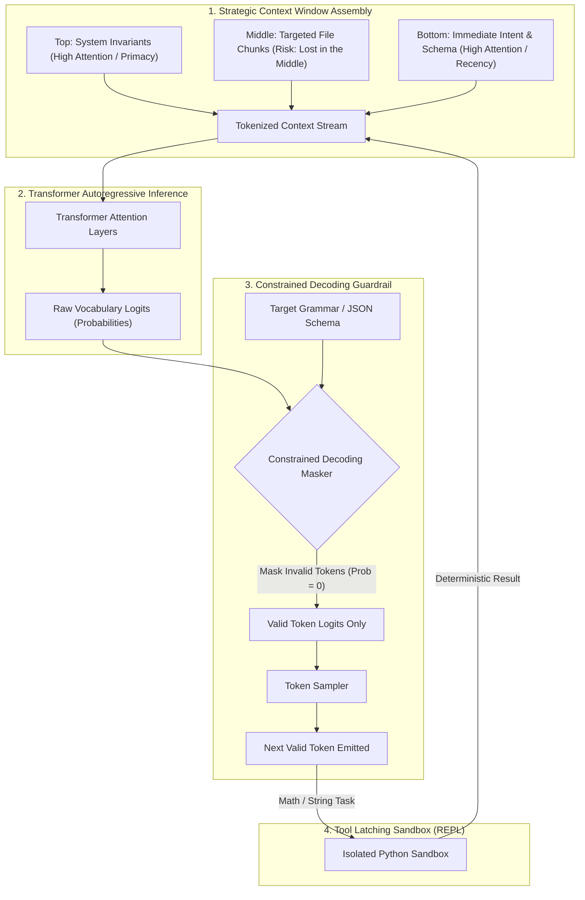

# Lecture 5: Fundamentals of AI – Tokenization, Context Windows & System-Level Guardrails

**Course:** SEZG534: AI-Augmented Software Development Life Cycle (BITS Pilani WILP)  
**Instructor:** Prof. Akshaya Ganesan  
**Module:** Module 2: Fundamentals of AI and Prompt Engineering  
**SDLC Stage Focus:** AI Internals, Context Engineering & Runtime Guardrails  
**Core Theme:** Large Language Models do not read characters or syntax trees—they process subword token IDs; software engineers must architect around tokenization blind spots, context window degradation ("lost in the middle"), and enforce constrained decoding to guarantee deterministic code outputs.

---

## 1. The Big Picture (Why Should I Care?)

- **What is this lecture about?**  
  This lecture examines the fundamental currency of Large Language Models: **Tokens** and **Context Windows**. It explains how subword tokenization breaks source code, why models fail at character-level tasks, how long context windows silently degrade ("Lost in the Middle"), and how system-level guardrails (constrained decoding and tool latching) enforce deterministic behavior.
- **The Real-World Problem:**  
  A fintech team builds an AI compliance screener using a 128k-token model. They dump a 150-page compliance manual into the middle of the prompt (tokens 5,000 to 115,000). On page 78 (token 65,000), a critical rule states: *"Any wire transfer over $10,000 to an unverified offshore account requires human 2FA approval."* A user requests an urgent $95,000 offshore wire. Because of **Attention Dilution ("Lost in the Middle")**, the model attends only to the top header and bottom user message, completely missing the middle rule. The unauthorized $95,000 wire is approved automatically. Large context windows are not magic RAM—attention is a scarce, decaying computational resource.
- **Where this fits in the SDLC & Course:**  
  This completes Module 2 (AI Fundamentals) and establishes the syllabus boundary for Online Quiz 1 (Sessions 1–5), setting the stage for Module 3 (Requirements, Architecture, and Intent-to-Spec).

---

## 2. Core Concepts Explained Simply

### Concept 1: The Tokenization Taxonomy (Why Subwords Rule)

- **What is it?**  
  The algorithm that breaks raw text or source code into numerical IDs for an LLM to process. In English text, **1 token $\approx$ 4 characters** or $\approx$ 0.75 words.
- **The 4 Approaches:**
  1. **Character Tokenization:** Every single letter/character is an individual token.  
     * *Fatal Flaw:* Sequence lengths explode 10x. Transformer self-attention scales quadratically ($O(N^2)$), exhausting compute and memory immediately.
  2. **Word Tokenization:** Text is split by whitespace and punctuation into full words.  
     * *Fatal Flaw:* Vocabulary size explodes to millions of words. Any unseen identifier or typo triggers an unknown token (`<UNK>`), breaking code generation.
  3. **Subword Tokenization (BPE / SentencePiece):** The industry standard. Common keywords (`def`, `class`, `return`) remain single tokens, while rare or compound words are broken into frequent subword fragments (e.g., `calculate_sum` $\to$ `["calculate", "_", "sum"]`).
  4. **Code-Aware Tokenizers:** Modern frontier models (GPT-4, Claude 3.5) encode multi-space indentation blocks (`\n    `) as single tokens and incorporate Abstract Syntax Tree (AST) structure, reducing code token consumption by ~50%.
- **Tech Quick-Primer:**
  > 💡 **Tech Quick-Primer (`tiktoken`):** A fast Byte-Pair Encoding (BPE) tokenizer library from OpenAI used to count exact tokens and calculate API costs before dispatching prompts.

---

### Concept 2: How the Model "Sees" Code & Token Blind Spots

- **What is it?**  
  LLMs never see code characters or syntax trees—they only see a linear sequence of integer token IDs.
- **The Resulting Blind Spots:**
  * **Character Counting & String Manipulation:** Asking an LLM *"How many 'e's are in strawberry?"* or *"Reverse this string"* frequently fails because token chunks do not align with individual characters.
  * **Custom Identifier Bloat:** A standard keyword (`import`) is 1 token. A custom identifier (`fetchUserAccountLedgerBalance`) splits into 5–6 tokens, rapidly eating into context budgets.
  * **Indentation Drift:** Older tokenizers treated each space as a separate token, burning 30%–40% of context purely on Python indentation. Modern code tokenizers fix this by chunking indentation.

---

### Concept 3: Context Window Dynamics & The 4 Failure Modes

- **What is it?**  
  The context window is the hard ceiling of combined input prompt tokens plus output generated tokens in a single inference call.
- **The 4 Failure Modes:**
  1. **Attention Dilution ("Lost in the Middle"):** LLM retrieval follows a **U-shaped curve**: it attends strongly to the beginning (primacy effect) and end (recency effect), but attention drops significantly in the middle of long contexts. Critical rules placed in the center are frequently ignored.
  2. **Silent Degradation:** As context saturates, the model does not throw an error; code quality simply deteriorates—edge cases are skipped and subtle logic bugs emerge.
  3. **Inconsistent Behavior:** Adding a single unrelated file or log snippet alters the global self-attention distribution, causing previously working prompts to fail.
  4. **Cascading Failures in Agentic Loops:** In multi-step agents, an error in an early tool output pollutes the conversation history. Subsequent agent turns reason over flawed data, compounding errors until the task fails.
- **Tech Quick-Primer:**
  > 💡 **Tech Quick-Primer (`vLLM`):** A high-throughput LLM serving engine featuring PagedAttention, managing GPU memory like OS virtual memory paging to avoid fragmentation during long-context processing.

---

### Concept 4: System-Level Guardrails (Moving Beyond Prompting)

- **What is it?**  
  Engineering mechanisms built *outside* the neural network to force deterministic correctness and eliminate tokenization limitations.
- **The Two Core Guardrails:**
  1. **Tool Latching & Code Interpreters (Task Delegation):**  
     Instead of asking an LLM to guess math, date arithmetic, or string slicing, have the agent write a short Python script, run it in an isolated container sandbox (REPL), and return the deterministic result.
  2. **Constrained Decoding & Grammar Masking (Logit Masking):**  
     When generating JSON, SQL, or code, a context-free grammar intercepts the model *token-by-token*. Any token that would violate syntax (e.g., an unquoted key or illegal character) has its sampling probability set to zero ($-\infty$). The model is mathematically prevented from emitting invalid syntax.
- **Tech Quick-Primers:**
  > 💡 **Tech Quick-Primer (`Pydantic`):** A Python data validation library that guarantees runtime type safety and schema compliance on structured JSON outputs emitted by LLMs.  
  > 💡 **Tech Quick-Primer (`Outlines`):** A library that guides LLM token sampling using finite state machines to guarantee valid JSON, SQL, or regex outputs.

---

## 3. Visual Workflow & Architecture Models

### Context Window Assembly & Constrained Decoding Architecture

### Diagram Walkthrough:
* **Strategic Context Placement:** Core rules are placed at the top (primacy) and the immediate prompt/schema at the bottom (recency), protecting them from the "Lost in the Middle" attention dip.
* **Logit Masking Gate:** Before any token is emitted, the grammar masker eliminates all tokens that violate the target schema, guaranteeing 100% syntactically valid JSON or code.
* **Tool Latching:** Complex string manipulation and arithmetic are routed directly to an isolated Python sandbox rather than guessed by the LLM.

---

## 4. Key Comparisons & Trade-Offs

### Tokenization Strategy Comparison

| Approach | Unit | Vocab Size | Sequence Length | Key Trade-Off |
| :--- | :--- | :--- | :--- | :--- |
| **Character** | Letters, symbols | Very Small (~256) | Extremely Long (10x) | Quadratic attention compute ($O(N^2)$) exhausts memory fast |
| **Word** | Full words | Massive (Millions) | Short | Fails on custom code identifiers and typos (`<UNK>` errors) |
| **Subword (BPE)** | Frequent fragments | Balanced (~50k–100k) | Moderate | **Industry standard**; balances vocabulary size with flexibility |
| **Code-Aware (AST)** | Subwords + indent blocks | Optimized (~100k+) | Compact | ~50% token reduction on code; understands indentation blocks |

### Context Window Failure Modes & Mitigations

| Failure Mode | Observable Symptom | Engineering Mitigation |
| :--- | :--- | :--- |
| **Lost in the Middle** | Model ignores rules in middle of long prompts | **Context Ordering:** Place critical rules at Top (System) or Bottom (User) |
| **Silent Degradation** | Code quality decays without explicit errors | **Context Pruning:** Truncate old conversation turns; use sliding windows |
| **Inconsistent Behavior** | Minor prompt additions cause erratic outputs | **Temperature = 0 + Seed Pinning:** Enforce deterministic sampling |
| **Cascading Agent Failures** | Early tool errors compound across turns | **Context Checkpoints:** Validate tool outputs before appending to history |

---

## 5. Professor's Practical Takeaways & Golden Rules

*(Key insights emphasized by Prof. Akshaya Ganesan in lecture)*

1. **Context Windows are the New RAM:**  
   You wouldn't deploy a web service without monitoring CPU and memory usage. Never deploy an autonomous agent without actively tracking token usage and context window headroom.
2. **Never Put Critical Rules in the Middle:**  
   Because of the U-shaped attention curve, never bury critical security constraints in the center of long PRDs or documentation dumps. Always place them at the very top (System Prompt) or the very bottom (Immediate User Turn).
3. **Conversational Chatter Burns Budget:**  
   Polite filler (*"Hey, could you please kindly review this..."*) wastes tokens that are re-transmitted on *every single subsequent turn* of a chat. Use concise, imperative machine instructions.
4. **Never Ask an LLM to Count Characters:**  
   LLMs process tokens, not characters. Asking an LLM to reverse a string, count characters, or slice text at exact character offsets is an anti-pattern. Always delegate string and math tasks to an external code interpreter.

---

## 6. Quick Recap & Terminology Cheatsheet

### Key Terms in 1 Line
* **Token:** The fundamental chunk of text or code processed by an LLM (~4 characters of English).
* **BPE (Byte-Pair Encoding):** The standard subword tokenization algorithm that iteratively merges frequent character pairs into tokens.
* **Context Window:** The hard ceiling on the total number of tokens (input prompt + output generation) processed in one inference call.
* **Lost in the Middle:** The degradation of attention in the center of long prompts, causing LLMs to overlook middle information.
* **Logit Masking:** Setting the sampling probability of syntactically invalid tokens to zero to enforce strict JSON or code schemas.
* **Tool Latching:** Delegating deterministic tasks (math, string manipulation) to an external sandbox rather than relying on LLM guesses.
* **AST (Abstract Syntax Tree):** A tree representation of code syntax used by modern tokenizers and static linters.

### 4 Core Mental Rules to Remember
1. **Context is Finite Attention, Not Storage:** Large context windows suffer from attention decay; curate context using targeted RAG rather than dumping whole repositories.
2. **Top and Bottom for High Attention:** Put architectural invariants at the top and immediate schemas at the bottom.
3. **Enforce Syntax at the Logit Level:** Use constrained decoding (Pydantic / Outlines) to eliminate malformed JSON and syntax errors.
4. **LLMs are Reasoners, Not Calculators:** Delegate arithmetic and string slicing to external code execution tools.
