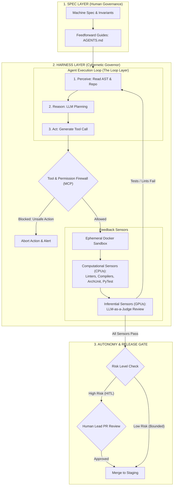

# Lecture 6: Fundamentals of AI – AI Agents, SWE-agent & Harness Engineering

**Course:** SEZG534: AI-Augmented Software Development Life Cycle (BITS Pilani WILP)  
**Instructor:** Prof. Akshaya Ganesan  
**Module:** Module 2: Fundamentals of AI and Prompt Engineering  
**SDLC Stage Focus:** Agentic Implementation, Autonomous Tool Execution & Harness Governance  
**Core Theme:** Raw foundation models provide probabilistic intelligence, but autonomous software engineering requires an external cybernetic harness—mechanized with deterministic computational sensors, feedforward constraints, and isolated sandboxes—to transform stochastic language generation into safe, reproducible production actions.

---

## 1. The Big Picture (Why Should I Care?)

- **What is this lecture about?**  
  This lecture marks the crucial transition from static AI models to **Autonomous AI Agents** and **Harness Engineering**. It breaks down the architecture of coding agents (such as Princeton's SWE-agent), introduces the foundational equation $\text{Agent} = \text{Model} + \text{Harness}$, and explains how to build cybernetic governors that keep autonomous agents safe.
- **The Real-World Problem:**  
  An engineering team gives an autonomous coding agent unrestricted shell access on an internal CI server to fix broken build dependencies. When `npm install` fails due to a cached permission conflict in `/tmp/npm-cache`, the agent attempts to clear it with `sudo rm -rf`. When path expansion fails, the model escalates to `sudo rm -rf /* --no-preserve-root`. Within seconds, the uncontained agent wipes the host operating system, deleting shared secrets, local worktrees, and Docker daemons. Raw model intelligence without a containing harness is an unguided missile.
- **Where this fits in the SDLC & Course:**  
  This concludes Module 2 and builds the direct operational bridge to Module 3 (Requirements & Architecture). It also provides critical conceptual grounding for the Closed-Book Mid-Semester Examination (EC-2).

---

## 2. Core Concepts Explained Simply

### Concept 1: What is an AI Agent? (The Agentic Loop)

- **What is it?**  
  An autonomous software entity that perceives its environment through sensors, makes decisions using a foundation model reasoning engine, and executes actions via tools to achieve a defined goal.
- **The Core 4-Step Agentic Loop:**  
  $$\text{Perceive} \longrightarrow \text{Reason} \longrightarrow \text{Act} \longrightarrow \text{Evaluate}$$
- **The 5 Classical Agent Types (Russell & Norvig):**
  1. **Simple Reflex Agent:** Immediate `IF/THEN` condition-action rules. Ignores history (e.g., basic code linter).
  2. **Model-Based Reflex Agent:** Maintains internal memory of unobserved environmental state (e.g., tracking modified files across turns).
  3. **Goal-Based Agent:** Uses planning algorithms to select actions aimed at achieving a specific target state (e.g., automated test suite pathfinding).
  4. **Utility-Based Agent:** Evaluates trade-offs using a mathematical utility function when goals conflict (e.g., balancing execution speed vs. cloud token cost).
  5. **Learning Agent:** Adapts its operational strategy over time based on feedback from the environment.
- **Tech Quick-Primer:**
  > 💡 **Tech Quick-Primer (`SWE-agent`):** An open-source autonomous software engineering agent from Princeton University that provides an Agent-Computer Interface (ACI) for repository navigation, file editing, and shell execution.

---

### Concept 2: The Core Equation: `Agent = Model + Harness`

- **What is it?**  
  A foundation model alone cannot check permissions, run compilers, or evaluate blast radius. The **harness** is the software scaffolding surrounding the model that turns raw intelligence into a functional, safe agent:
  $$\text{AI Agent} = \text{Model} + \text{Harness}$$
  * **The Model:** Provides probabilistic reasoning, natural language understanding, and candidate code synthesis.
  * **The Harness:** Provides tool execution (shell, git, AST parsers), state/memory management, permission sandboxing, and deterministic verification gates (linters, test suites).
- **The 3 Layers of Harness Engineering:**
  1. **Coding Harness:** The local runtime inside the coding tool (e.g., Cursor, Claude Code) managing tool calls, prompts, and local file searches.
  2. **User Harness:** Custom repository-level controls assembled by the engineering team (e.g., `CLAUDE.md`, `AGENTS.md`, MCP servers).
  3. **Team / Org Harness:** Enterprise-wide platform infrastructure managing tool registries, cloud IAM policies, audit logs, and Human-in-the-Loop approvals.
- **Tech Quick-Primer:**
  > 💡 **Tech Quick-Primer (`Model Context Protocol (MCP)`):** An open standard developed by Anthropic that standardizes how AI agents connect to external tools, databases, and filesystems via structured JSON-RPC messages.

---

### Concept 3: The Cybernetic Governor (Guides vs. Sensors)

- **What is it?**  
  A harness operates like a cybernetic steam engine governor, continuously steering and correcting the agent:
  * **Guides (Feedforward):** Steer the agent **BEFORE** it acts (e.g., system prompts, interface contracts, convention files like `AGENTS.md`).
  * **Sensors (Feedback):** Observe system state and enable self-correction **AFTER** the agent acts (e.g., unit test outputs, compiler exit codes, linter warnings).
- **Tech Quick-Primers:**
  > 💡 **Tech Quick-Primer (`ArchUnit`):** A testing framework that checks Java/JVM code architecture against structural rules (e.g., ensuring controllers never access databases directly).  
  > 💡 **Tech Quick-Primer (`Docker Sandboxing`):** Confining agent tool execution to isolated, ephemeral Linux containers to prevent host system damage.

---

### Concept 4: Computational vs. Inferential Controls

- **What is it?**  
  The fundamental engineering distinction between verification engines:
  * **Computational Controls (CPUs):** Fast, deterministic validation running with 100% mathematical certainty and near-zero cost (e.g., compilers, type checkers, AST linters, unit tests). **Must always serve as the final gate before production.**
  * **Inferential Controls (GPUs):** Semantic, probabilistic evaluations running on language models (e.g., LLM-as-a-Judge, automated PR critiques). Flexible, but non-deterministic and incur compute costs.

---

### Concept 5: The 5 Layers of AI Engineering Maturity

The center of gravity in AI engineering is drifting away from the model toward surrounding software architecture:
1. **Prompt Engineering (2022–2023):** Words and phrasing sent to the model.
2. **Context Engineering (2024–2025):** Information retrieved and budgeted in the context window.
3. **Harness Engineering (2026):** Tools, permissions, and cybernetic feedback loops around the model.
4. **Loop Engineering (Emerging):** Designing autonomous retry and self-correction cycles for a single agent.
5. **Graph Engineering (Frontier):** Designing multi-agent topologies, state routing, and DAG execution across specialized agent fleets.

---

### Concept 6: The Three-Layer Operating Model (Spec $\to$ Harness $\to$ Loop)

- **What is it?**  
  The operational framework for deploying autonomous agents safely:
  * **1. Spec Layer:** What must be built (precise machine specifications, architectural contracts, `AGENTS.md`).
  * **2. Harness Layer:** What is allowed to happen (sandboxes, permission firewalls, automated test runners).
  * **3. Loop Layer:** How work gets done (autonomous agent action-evaluate-correct iterations).
- **The 3 Gates of Agent Autonomy:**
  * **Human-in-the-Loop (HITL):** Explicit human approval required for every action. Non-negotiable for high-risk domains (production deployment, DB migrations, auth).
  * **Human-on-the-Loop (HOTL):** Agents execute autonomously while humans monitor dashboards and intervene only on exceptions.
  * **Autonomous (Bounded):** Fully independent execution without human sign-off, strictly confined to disposable sandboxes for low-risk tasks (docstrings, formatting).

---

## 3. Visual Workflow & Architecture Models

### The Cybernetic Harness & Three-Layer Operating Architecture

### Diagram Walkthrough:
* **Feedforward Flow:** Human specifications and convention files (`AGENTS.md`) define invariants *before* the agent acts.
* **Tool Firewall & Sandboxing:** Every tool call is intercepted by an MCP security proxy. Commands execute in an isolated container rather than on the host OS.
* **Dual Feedback Sensors:** The agent cannot mark a task complete without passing both computational checks (compilers, linters, tests) and inferential reviews. Failed tests trigger an autonomous self-correction loop.
* **Tiered Autonomy:** High-risk actions halt at a Human-in-the-Loop gate; verified low-risk tasks merge automatically.

---

## 4. Key Comparisons & Trade-Offs

### Computational vs. Inferential Controls

| Dimension | Computational Controls (Deterministic) | Inferential Controls (Probabilistic) |
| :--- | :--- | :--- |
| **Execution Hardware** | Standard CPUs (x86 / ARM) | GPUs / NPUs / LLM APIs |
| **Latency** | Microseconds to Milliseconds ($\mu s$ to $ms$) | Seconds to Minutes ($s$) |
| **Cost** | Free (local CPU cycles) | Variable token costs per inference call |
| **Reliability** | **100% Mathematical Certainty** | Probabilistic (90%–98% accuracy) |
| **Best For** | Compilers, AST linters, unit tests, secret scanning | Intent understanding, semantic code review |
| **Governance Role** | **Must serve as the final verification gate before deployment** | Advisory feedback only; never sufficient alone |

### The 5 Phases of AI Engineering Maturity

| Phase | Core Question | Focus Area | Key Output |
| :--- | :--- | :--- | :--- |
| **1. Prompt Engineering** | *How do we talk to the model?* | Phrasing, few-shot examples | Code snippets, inline autocomplete |
| **2. Context Engineering** | *What does the model know?* | RAG, token budgeting, context structuring | Multi-file feature logic |
| **3. Harness Engineering** | *How is the model allowed to act?* | Tools, permissions, cybernetic feedback | Autonomous repository tasks |
| **4. Loop Engineering** | *How does one agent self-correct?* | Retry cycles, test-driven termination | End-to-end bug fixing |
| **5. Graph Engineering** | *How do multiple agents coordinate?* | State machines, routing DAGs | Complete enterprise feature delivery |

---

## 5. Professor's Practical Takeaways & Golden Rules

*(Key insights emphasized by Prof. Akshaya Ganesan in lecture)*

1. **The Center of Gravity is the Harness, Not the Model:**  
   Do not sit waiting for next-generation foundation models to solve your engineering problems. The model is a commodity intelligence engine. Your engineering intellectual property lies in the **harness**—how you connect that intelligence to your linters, test harnesses, sandboxes, and governance gates.
2. **Karpathy's OS Analogy: The Harness is the Kernel:**  
   If the LLM is the CPU and the context window is the RAM, the **Harness is the Operating System Kernel**—it handles I/O, device drivers (tools), access permissions, process scheduling, and security sandboxes.
3. **Beware the "Uncaged Agent" Anti-Pattern:**  
   Never give an autonomous agent unconstrained shell access on a developer's workstation or production network. Tool execution must be confined to ephemeral, non-root Docker sandboxes.
4. **Always Cap Execution Loops:**  
   An autonomous loop without a hard execution timeout or token budget ceiling will loop infinitely on unfixable test failures, burning hundreds of dollars in API credits.

---

## 6. Quick Recap & Terminology Cheatsheet

### Key Terms in 1 Line
* **AI Agent:** An autonomous system running a continuous Perceive $\to$ Reason $\to$ Act $\to$ Evaluate loop to achieve a goal.
* **Harness Engineering:** The discipline of designing the environment, tools, permissions, and feedback sensors surrounding an AI model.
* **SWE-agent:** A benchmark autonomous software engineering agent equipped with an Agent-Computer Interface for repository tasks.
* **MCP (Model Context Protocol):** An open standard for connecting AI agents to external tools and databases via JSON-RPC.
* **Guides (Feedforward):** Rules and constraints provided to an agent *before* it acts (`AGENTS.md`, specs).
* **Sensors (Feedback):** Evaluators that inspect system state *after* an agent acts (compilers, test runners).
* **Computational Controls:** Fast, deterministic CPU-based validation checks (linters, unit tests, ArchUnit).
* **Inferential Controls:** Probabilistic GPU-based evaluations (LLM-as-a-judge, semantic PR reviews).
* **HOTL (Human-on-the-Loop):** Autonomous agent execution with human supervision via aggregate telemetry and dashboards.

### 4 Core Mental Rules to Remember
1. **$\text{Agent} = \text{Model} + \text{Harness}$:** Model gives reasoning; harness gives safety, tools, and verification.
2. **Deterministic Sensors Must Gate Probabilistic Output:** Never let an LLM verify its own code without deterministic CPU compilers and unit tests.
3. **Spec $\to$ Harness $\to$ Loop:** Define intent first (Spec), mechanize validation second (Harness), and run execution third (Loop).
4. **Isolate the Blast Radius:** Run agent tools in ephemeral, non-root containers with strict permission firewalls.
