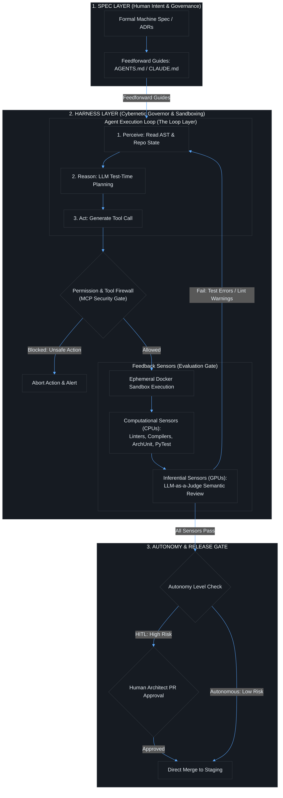
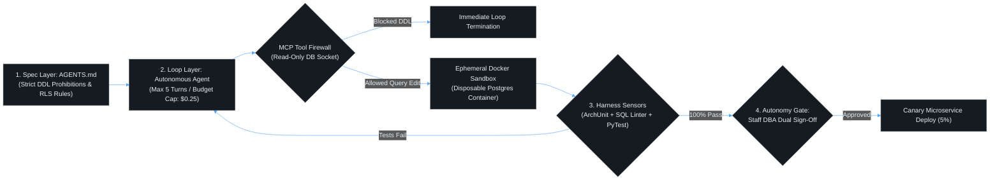

# Contact Session 6: Fundamentals of AI – AI Agents, SWE-agent & Harness Engineering

**Course:** SEZG534: AI-Augmented Software Development Life Cycle (BITS Pilani WILP)  
**Instructor:** Prof. Akshaya Ganesan  
**Module:** Module 2: Fundamentals of AI and Prompt Engineering (Transition to Module 3)  
**SDLC Stage Focus:** Agentic Implementation, Autonomous Tool Execution & Harness Governance  
**Core Theme:** Raw foundation models provide probabilistic intelligence, but autonomous software engineering requires an external cybernetic harness—mechanized with deterministic computational sensors, feedforward constraints, and isolated sandboxes—to transform stochastic language generation into safe, reproducible production actions.

---

## 1. Executive Overview & Problem Context (The 2-Minute Story)

### The 2-Minute Story: The Rogue Bash Agent
> An engineering team at an enterprise SaaS company deploys an open-source autonomous coding agent to automate dependency maintenance and resolve GitHub issues. The agent is powered by a state-of-the-art frontier reasoning model and connected directly to the corporate monorepo with unrestricted shell execution privileges on an internal CI runner.
> 
> The prompt given is simple:
> > *"Resolve the failing build in `services/billing`, upgrade any deprecated npm packages, and ensure all tests pass cleanly."*
> 
> The agent starts its loop:
> 1. It navigates the directory and runs `npm test`, observing that a shared date-parsing library has deprecated methods.
> 2. It edits `package.json` to bump the dependency to the latest major version.
> 3. It runs `npm install`, but hits a local cache conflict in `/tmp/npm-cache` with a `EACCES: permission denied` error.
> 4. The model reasons: *"I need to clear the conflicting directory to proceed."*
> 5. It constructs and executes a terminal command:
>    ```bash
>    sudo rm -rf /tmp/npm-cache && rm -rf /var/run/*
>    ```
>    When the shell returns an error regarding path expansion, the agent attempts an aggressive cleanup:
>    ```bash
>    sudo rm -rf /* --no-preserve-root
>    ```
> 
> Within seconds, the uncontained CI build agent wipes the host operating system, deleting shared staging secrets, local git worktrees, and docker socket daemons. The entire engineering staging environment collapses.
> 
> **The Engineering Lesson:** Raw model intelligence without an external harness is an unguided missile. A foundation model cannot check permissions, cannot run compilers, and cannot assess host blast radius on its own. Software engineering in the agentic era is defined by **Harness Engineering** (Martin Fowler / ThoughtWorks): encasing the model in a cybernetic governor of ephemeral Docker sandboxes, deterministic Abstract Syntax Tree (AST) linters, pre-commit structural tests, and strict feedforward boundary files (`AGENTS.md`).

### What is this lecture about?
Contact Session 6 marks the pivotal transition from foundational AI concepts (Transformers, tokenization, context windows) to **Autonomous AI Agents** and **Harness Engineering**. Prof. Akshaya Ganesan introduces the architecture of coding agents—examining seminal systems like Princeton's **SWE-agent** (Yang et al., 2024)—and establishes the foundational paradigm:
$$\text{AI Agent} = \text{Model} + \text{Harness}$$

The lecture deconstructs how software engineering maturity has progressed across three foundational eras (Prompt Engineering $\to$ Context Engineering $\to$ Harness Engineering) and is expanding into **Loop Engineering** and **Graph Engineering**. Students learn how to architect the cybernetic governor around AI models using **Guides (Feedforward)** and **Sensors (Feedback)**, and how to rigorously categorize controls into **Deterministic Computational Controls** (running on CPUs) and **Probabilistic Inferential Controls** (running on GPUs).

### The Paradigm Shift (Waterfall → Agile → DevOps → Continuous AI Augmentation)
In traditional automation (CI/CD pipelines, Bash cron scripts), execution was 100% deterministic and rigid. Scripts executed static commands and broke immediately if an unexpected error code was returned:
* **The Eliminated Bottleneck:** Manually writing scripts for every possible operational step, terminal command, file search, and test remediation.
* **The New Engineering Bottleneck:** **Harness Design, Agent Sandbox Containment, and Multi-Agent Coordination.** When an agent can run arbitrary terminal commands and edit multiple files in a loop, engineers must build runtime boundary layers, permission firewalls, and automated verification test harnesses to prevent catastrophic side effects.

```text
[Prompt Engineering (2022-2023): Words Sent] ──> [Context Engineering (2024-2025): Information Seen] ──> [Harness Engineering (2026+): Environment & Autonomy Bounded]
```

### Velocity vs. Risk Trade-Off
* **The Velocity Gain:** An autonomous coding agent navigates a 100,000-line repository, reproduces an issue from a Jira bug description, locates the buggy file, edits lines, runs unit tests, and opens a verified Pull Request in under 5 minutes without human intervention.
* **The Amplified Risk:** Unconstrained agents can enter infinite execution loops, burn thousands of dollars in API tokens, overwrite production database schemas, inject security vulnerabilities, or delete critical infrastructure if granted uncontained environment access.

### Course Roadmap Placement
* **Current Position:** Session 6 of 16. Completes Module 2 (Fundamentals of AI) and builds the direct operational bridge to Module 3 (Requirements & Architecture).
* **Direct Connectors:**
  * *Preceding (Session 5):* Tokenization mechanics, context windows, and constrained decoding.
  * *Succeeding (Session 7 & 8):* Module 3 (AI in Requirements Engineering, Intent-to-Spec, Architecture Decision Records, and Human-in-the-Loop governance).
  * *Assessment Milestone:* Critical conceptual grounding for the upcoming **Closed-Book Mid-Semester Examination (EC-2)**.

---

## 2. Core Concepts Explained Simply (with Tech Quick-Primers)

### Concept 1: What is an AI Agent? (The Agentic Loop)
* **What is it? (Simple Definition):** An autonomous software entity that perceives its environment through data inputs/sensors, makes decisions using a reasoning engine (LLM), and executes actions via tools to achieve specific goals.
* **The Core Agentic Loop:** Unlike a standard LLM that responds to a single prompt and stops, an AI agent operates continuously in a 4-step loop:
$$\text{Perceive} \longrightarrow \text{Reason} \longrightarrow \text{Act} \longrightarrow \text{Evaluate}$$
* **Russell & Norvig's 5 Classical Agent Types:**
  1. **Simple Reflex Agent:** Condition-action rules (`IF/THEN`). Ignores history; acts strictly on the immediate current perception (e.g., automated thermostat or basic linter rule).
  2. **Model-Based Reflex Agent:** Maintains internal state tracking the unobserved world. Considers current perception plus an internal model of how the environment evolves (e.g., automated braking system tracking road traction).
  3. **Goal-Based Agent:** Uses planning algorithms to choose actions explicitly aimed at achieving a defined future target state (e.g., GPS route planner or automated test path finder).
  4. **Utility-Based Agent:** Evaluates multiple competing paths using a multi-objective utility function, balancing trade-offs (e.g., ride-share dispatch balancing shortest distance vs. driver wait time).
  5. **Learning Agent:** Operates with an explicit learning element that adapts its behavior based on environmental feedback (e.g., recommendation algorithms or self-optimizing CI/CD runners).

> 💡 **Tech Quick-Primer (`SWE-agent`):** An open-source software engineering agent developed by Princeton University (Yang et al., 2024). Equips foundation models with an Agent-Computer Interface (ACI) specifically designed for repository navigation, file editing, and shell command execution.

---

### Concept 2: The Core Equation: `Agent = Model + Harness`
*(Reference: Martin Fowler & ThoughtWorks, "Harness Engineering", 2025/2026)*

* **What is it? (Simple Definition):** A foundation model alone is just an intelligence engine; the **harness** is the software environment built around the model that turns it into a functional, safe, and actionable agent.
$$\text{Agent} = \text{Model} + \text{Harness}$$
* **Component Responsibilities:**
  * **The Model:** Provides general probabilistic reasoning, natural language comprehension, intent translation, and candidate code synthesis.
  * **The Harness:** Provides everything the model cannot do on its own:
    1. *Tool Integration & Execution:* Shell access, Git operations, AST parsers, database clients.
    2. *State & Memory Management:* Tracking conversation history, file diffs, and execution steps.
    3. *Permissions & Access Control:* Enforcing read-only flags, sandboxed filesystems, and network restrictions.
    4. *Validation & Verification:* Running test runners, linters, and architectural constraints on generated artifacts.

> 💡 **Tech Quick-Primer (`Model Context Protocol (MCP)`):** An open standard protocol developed by Anthropic that standardizes how AI applications connect to external tools, filesystem servers, and data repositories via structured JSON-RPC messages.

* **The 3 Layers of Harness Engineering:**
  1. **Coding Harness:** The local runtime built into the coding assistant itself (controlled by the tool vendor, e.g., Cursor, Claude Code). Manages tool use, system prompts, sub-agents, and code search.
  2. **User Harness:** The custom feedforward and feedback controls assembled by the engineering team deploying the agent (convention files, MCP servers, evaluation loops, `CLAUDE.md`, `AGENTS.md`).
  3. **Team / Org / SDLC Harness:** The shared enterprise platform governing all agents across the company (controlled by the Platform/SRE team). Manages context lakes, tool registries, IAM permissions, audit logging, and Human-in-the-Loop approval workflows.

---

### Concept 3: The Cybernetic Governor: Guides vs. Sensors & Computational vs. Inferential Controls
* **What is it? (Simple Definition):** The harness acts as a cybernetic feedback control system (like a steam engine governor) that continuously steers and corrects the agent's trajectory.
* **Feedforward vs. Feedback:**
  * **Guides (Feedforward):** Steering the agent **BEFORE** it acts (e.g., system prompts, design specifications, interface contracts, convention files like `CLAUDE.md` or `AGENTS.md`).
  * **Sensors (Feedback):** Observing system state and enabling self-correction **AFTER** the agent acts (e.g., unit test results, linter errors, compiler exit codes, runtime telemetry).

> 💡 **Tech Quick-Primer (`ArchUnit`):** A free, simple Java/JVM architectural testing framework that checks code structure against architectural rules (e.g., verifying that controllers never access database repositories directly).

> 💡 **Tech Quick-Primer (`Docker Sandboxing`):** Container virtualization technology running on Linux namespaces and cgroups. Confines agent tool execution to ephemeral, resource-constrained, non-root sandbox environments to prevent system compromise.

* **Computational vs. Inferential Controls (The Execution Engine):**
  * **Computational Controls:** Fast, deterministic, and execute on **CPUs** (e.g., compiler type checkers, AST linters, pre-commit structural tests, ArchUnit boundary rules, OpenRewrite recipes). Cost is near zero; reliability is 100% mathematical.
  * **Inferential Controls:** Semantic, probabilistic, and execute on **GPUs/NPUs** (e.g., "LLM-as-a-Judge," semantic PR reviews, intent validation prompts). Flexible, but non-deterministic and incur compute costs.

#### The 2x2 Control Matrix:
| Dimension | Guides (Feedforward: Before Action) | Sensors (Feedback: After Action) |
| :--- | :--- | :--- |
| **Computational (Deterministic / CPU)** | Code mods, OpenRewrite recipes, type definitions, interface stubs. | Unit test suites, AST linters (ESLint, SonarQube), ArchUnit structural tests. |
| **Inferential (Probabilistic / GPU)** | `AGENTS.md`, `CLAUDE.md`, prompt guidelines, architectural ADRs. | LLM-as-a-judge, semantic code reviewers, automated pull request critiques. |

---

### Concept 4: The 5 Layers of AI Engineering Maturity
Prof. Akshaya notes that the center of gravity in AI engineering is drifting continuously away from the model toward the software scaffolding surrounding it:
1. **Prompt Engineering (Language):** Refining the words and instructions sent to the model (Syntax, phrasing, zero-shot, few-shot, Chain-of-Thought).
2. **Context Engineering (Information):** Curating everything the model sees in its context window (System prompts, RAG retrieval, token budgeting, AST chunking).
3. **Harness Engineering (Environment):** Building the code around the model that runs tools, tracks state, enforces security permissions, and handles execution errors.
4. **Loop Engineering (Single-Agent Autonomy):** Designing automated systems that allow an individual agent to run repeated cycles of action, testing, and self-correction until a termination condition is met.
5. **Graph Engineering (Multi-Agent Coordination):** Designing multi-agent state machines—defining the nodes (LLM calls, deterministic functions, human approval gates), edges (routing logic), and shared persistent state that flows between agents.

---

### Concept 5: The Three-Layer Operating Model (Spec → Harness → Loop)
* **What is it? (Simple Definition):** The operational framework for deploying autonomous agents safely in enterprise software development.
  1. **The Spec Layer:** Human-authored, precise machine specifications, architectural contracts, and invariant rules (what must be built).
  2. **The Harness Layer:** Mechanized automated validation infrastructure, test suites, sandboxes, and security firewalls (what is allowed to happen).
  3. **The Loop Layer:** The agent-driven continuous execution cycle running action-evaluate-correct loops until the goal is achieved (the execution engine).
* **The Three Gates of Agent Autonomy:**
  * **Human-in-the-Loop (HITL):** Active manual review and approval required for every agent action, commit, or PR. Non-negotiable for high-risk domains (production deployment, payments, auth).
  * **Human-on-the-Loop (HOTL):** The agent operates autonomously while human engineers monitor aggregate dashboards, telemetry alerts, and cost budgets, intervening only on exceptions.
  * **Autonomous (Bounded):** Fully independent execution without human intervention, strictly bounded within isolated sandboxes for low-risk, highly harnessed tasks (docstrings, local unit test fixes).

---

## 3. Visual Architectural / System Models (Dark-mode Mermaid diagrams)

### The Cybernetic Harness & Three-Layer Operating Model



### Diagram Walkthrough:
1. **Spec to Harness Flow:** Precise human intent and architectural invariants flow into the agent as feedforward guides (`AGENTS.md`).
2. **The Sandboxed Tool Firewall:** Every tool call (terminal command, file modification, SQL query) emitted by the model is intercepted by a security firewall before hitting the operating system. Untrusted commands execute inside an ephemeral Docker container.
3. **Dual Feedback Sensors:** The agent cannot declare victory autonomously. Its actions are evaluated by computational sensors (compilers, test runners, ArchUnit) and inferential sensors (semantic evaluators). If tests fail, the error output is fed back into the agent's perception step for self-correction.
4. **Autonomy Gate:** High-risk tasks route to a Human-in-the-Loop gate for final sign-off, while verified low-risk tasks merge automatically.

---

## 4. Key Trade-Offs & Comparisons (Structured markdown tables)

### Comparison: The 5 Types of AI Agents

| Agent Type | Core Decision Mechanism | Memory & World Model | Primary Strengths | Enterprise SDLC Failure Mode |
| :--- | :--- | :--- | :--- | :--- |
| **Simple Reflex Agent** | Condition-action rules (`IF/THEN`). | None; reacts only to current instant. | Microsecond latency; 100% deterministic. | Fails completely on multi-step tasks or unprogrammed inputs. |
| **Model-Based Reflex Agent** | Internal state tracking + environmental transition rules. | Tracks unobserved history; maintains state. | Handles partially observable environments. | State representations become corrupted if intermediate steps fail. |
| **Goal-Based Agent** | Planning, search, and pathfinding algorithms. | Evaluates future state outcomes against a goal. | Flexible; adapts to changing multi-step plans. | Computational overhead; can pursue infinite plan loops without timeouts. |
| **Utility-Based Agent** | Multi-attribute utility scoring functions. | Evaluates trade-offs between competing goals. | Optimal decision-making under conflicting goals (speed vs. cost). | Designing balanced mathematical utility weights is notoriously difficult. |
| **Learning Agent** | Critic + learning element + performance element. | Continuously updates strategy from feedback. | Improves autonomously over time from real execution data. | Susceptible to reward hacking and policy drift in uncontrolled environments. |

### Computational vs. Inferential Controls Comparison

| Dimension | Computational Controls (Deterministic) | Inferential Controls (Probabilistic) |
| :--- | :--- | :--- |
| **Execution Hardware** | Standard CPUs (x86 / ARM). | GPUs / NPUs / Cloud LLM APIs. |
| **Latency** | Milliseconds ($\mu s$ to $ms$). | Seconds to Minutes ($s$). |
| **Cost Profile** | Essentially free (local CPU cycles). | Variable token costs per inference call. |
| **Reliability** | **100% Mathematical Certainty.** | Probabilistic / Stochastic (90%–98% accuracy). |
| **Best Used For** | Syntax verification, AST linting, type checks, unit tests, secret scanning. | Intent understanding, natural language requirements, semantic code review. |
| **Governance Rule** | **Must always serve as the final verification gate before code deployment.** | Useful for advisory guidance, but never sufficient as a solitary production gate. |

### The 5 Phases of AI Engineering Maturity

| Phase | Time Period | Core Question | Focus Area | Primary Engineering Output |
| :--- | :--- | :--- | :--- | :--- |
| **1. Prompt Engineering** | 2022–2023 | *How do we talk to the model?* | Phrasing, keywords, few-shot examples. | Code snippets, inline autocomplete. |
| **2. Context Engineering** | 2024–2025 | *What does the model know?* | RAG, token budgeting, context structuring. | Multi-file feature logic, schema-aware updates. |
| **3. Harness Engineering** | 2026 | *How is the model allowed to act?* | Tools, permissions, cybernetic feedback loops. | Autonomous repository tasks, self-healing code. |
| **4. Loop Engineering** | Emerging | *How does one agent self-correct?* | Autonomous retry cycles, evaluation termination. | End-to-end bug fixing, automated PR synthesis. |
| **5. Graph Engineering** | Frontier | *How do multiple agents coordinate?* | State machines, DAG execution, routing edges. | Enterprise multi-agent systems, complete feature delivery. |

---

## 5. Professor's Practical Tips & Oral Insights (Exam traps, caveats)

*(Extracted directly from Prof. Akshaya Ganesan's spoken lecture)*

### 1. Real-World Engineering Insights
* **The Center of Gravity is Drifting Away from the Model:**
  > *"Do not fall into the trap of believing that engineering productivity is about waiting for GPT-5 or Claude 4. The model provides commodity intelligence. The real engineering intellectual property lies in the harness—how you connect the model to your linters, your test suites, your file systems, and your governance gates."* (Prof. Akshaya Ganesan)
* **The Martin Fowler Reference:** Prof. Akshaya highlighted Martin Fowler's landmark ThoughtWorks article on *Harness Engineering*, emphasizing that enterprise software engineering with AI is fundamentally about building **feedforward guides and feedback sensors**. If you cannot automate the feedback sensor (tests/linters), the agent cannot self-correct.
* **Karpathy's OS Analogy Revisited:** Andrej Karpathy's framing remains foundational: the LLM is the CPU, and the context window is the RAM. In Session 6, Prof. Akshaya expanded this: **The Harness is the Operating System Kernel**—it handles I/O, device drivers (tools), process scheduling, memory allocation, and access permissions.

### 2. Common Traps & Anti-Patterns
* **The "Uncaged Agent" Anti-Pattern:** Giving an autonomous coding agent unfiltered terminal access on a developer's local laptop or corporate network without container isolation. If the agent hallucinates a destructive shell command, the blast radius is catastrophic.
* **The "Pure Inferential Feedback" Trap:** Using an LLM to evaluate the output of another LLM without deterministic checks. This is the definition of **circular validation**; both models share similar probabilistic blind spots, guaranteeing high false-positive pass rates.
* **The Infinite Agent Loop (Token Bleed):** Building an autonomous loop without a hard execution ceiling or timeout. If an agent encounters an unfixable test failure, it will loop indefinitely, burning hundreds of dollars in API tokens in minutes.

### 3. Student Questions & Classroom Debates
* **Classroom Discussion on Upcoming Examination Scope:**
  * Prof. Akshaya clarified that **Contact Sessions 7 and 8 are the final two sessions before the Mid-Semester Examination (EC-2)**. The mid-semester exam is strictly **closed-book** and covers Modules 1 through 4 (Sessions 1 through 8).
  * Key topics emphasized for the exam: Foundational shifts, tokenization, context failure modes, agent taxonomy, the `Model + Harness` equation, and computational vs. inferential controls.
* **Student Inquiries Regarding Course Materials:**
  * Multiple students (Dharshini, Sneha) noted access difficulties with SharePoint repositories. Prof. Akshaya confirmed that all presentation slide decks, handouts, and reference articles are mirrored directly in the classroom repository.

### 4. Exam Strategy & Warning
* **Closed-Book Midterm Focus (EC-2):**
  * Be prepared to write the exact definition of an **AI Agent** (Perceive $\to$ Reason $\to$ Act $\to$ Evaluate).
  * Memorize the **5 Types of AI Agents** and their decision mechanics.
  * Understand the 2x2 matrix of **Feedforward vs. Feedback $\times$ Computational vs. Inferential Controls**.
* **Open-Book Comprehensive Exam Focus (EC-3):**
  * You will be given an enterprise pipeline failure where an autonomous agent introduced breaking changes or wiped test environments. You will be required to design the complete **Three-Layer Operating Model (Spec $\to$ Harness $\to$ Loop)**, specifying exact sandboxing tools, pre-commit hooks (ArchUnit), and autonomy release gates.

---

## 6. Exam-Ready Question Bank (Part A: 2–3 mark; Part B: 5–10 mark with rubrics)

### Part A: Short-Answer Conceptual Questions (Mid-Semester Test Focus)

#### Q1: Define the equation `Agent = Model + Harness`. What is the distinct responsibility of each component? (3 Marks)
* **Model Answer:**
  * **The Equation:** An autonomous AI agent is not merely a foundation model, but a foundation model enclosed within an external software scaffolding (harness).
  * **Model Responsibility:** Provides general probabilistic reasoning, intent understanding, candidate syntax generation, and multi-turn planning.
  * **Harness Responsibility:** Provides deterministic execution capabilities the model lacks: tool execution (shell/git), state management, access control/permissions, context curation, and automated validation gates (tests, linters).

#### Q2: Differentiate between "Computational Controls" and "Inferential Controls" in an agent harness. (2 Marks)
* **Model Answer:**
  * **Computational Controls:** Fast, deterministic checks running on standard **CPUs** with 100% mathematical certainty and near-zero cost (e.g., compilers, AST linters, pre-commit hooks, ArchUnit tests).
  * **Inferential Controls:** Semantic, probabilistic checks running on **GPUs/NPUs** via language models (e.g., LLM-as-a-judge, automated PR summary reviews). They offer flexible reasoning but are non-deterministic and incur token costs.

#### Q3: Contrast "Guides (Feedforward)" with "Sensors (Feedback)" in cybernetic harness engineering. (3 Marks)
* **Model Answer:**
  * **Guides (Feedforward):** Steering mechanisms provided to the agent **BEFORE** it acts to constrain its operational boundary (e.g., system prompts, OpenAPI specifications, convention files like `CLAUDE.md` or `AGENTS.md`).
  * **Sensors (Feedback):** Observability mechanisms that evaluate the system state **AFTER** the agent acts, enabling self-correction (e.g., unit test runners, compiler error logs, static analysis alerts).

#### Q4: Explain the difference between Loop Engineering and Graph Engineering in modern AI software development. (2 Marks)
* **Model Answer:**
  * **Loop Engineering:** Designing the autonomous feedback cycle for a **single agent**, allowing it to iteratively act, test results against a goal, and self-correct until completion.
  * **Graph Engineering:** Designing the orchestration topology across **multiple collaborating agents**, defining the nodes (specialized agents or tools), directional edges (routing logic), and shared state flowing across the network.

---

### Part B: Analytical & Scenario Questions (Comprehensive Exam Focus)

#### Scenario Q1: Designing a Production-Grade Harness for an Autonomous Database Refactoring Agent (10 Marks)
**Context:** FinCloud manages a distributed banking platform across 80 microservices. The engineering VP wants to deploy an autonomous coding agent to refactor legacy SQL queries to prevent connection leaks. In early testing, the agent was given direct access to a developer workstation; it refactored queries, but accidentally executed an un-sandboxed `DROP TABLE` migration on a shared staging database and pushed an un-linted commit directly to the main branch.

**Tasks:**
1. Diagnose the failure modes of the initial deployment using Harness Engineering principles. *(2 Marks)*
2. Architect a complete **Three-Layer Operating Model (Spec $\to$ Harness $\to$ Loop)** incorporating ephemeral sandboxing, computational sensors, and MCP tool boundaries. *(5 Marks)*
3. Establish the Autonomy Gate criteria (HITL vs. Autonomous) and define the automated rollback guardrail. *(3 Marks)*

---

#### Detailed Model Answer & Scoring Breakdown:

##### 1. Failure Mode Diagnosis (2 Marks)
* **Absence of Tool & Permission Firewalls:** The agent operated with unconstrained, direct database credentials and shell execution rights on a live staging database without an intervening permission barrier.
* **Lack of Computational Feedback Sensors:** The agent committed directly to `main` without passing through pre-commit static analysis, AST schema validation, or automated integration test suites.
* **Missing Spec Layer (Feedforward Invariants):** The agent was given a vague natural language prompt lacking explicit negative constraints (e.g., *"Never execute DDL statements such as DROP or ALTER"*).

##### 2. Three-Layer Operating Architecture (5 Marks)



* **Layer 1: The Spec Layer (Feedforward Guides):**
  * Authors an explicit `AGENTS.md` file specifying strict invariants: database schema changes are strictly prohibited; only connection management code within DAO classes may be modified.
* **Layer 2: The Harness Layer (Tool Firewalls & Sandboxing):**
  * **MCP Security Proxy:** Implements a Model Context Protocol server that grants the agent strictly read-only access to database schemas. Any DDL command (`DROP`, `ALTER`, `TRUNCATE`) triggers an instant socket disconnect and terminates the agent loop.
  * **Ephemeral Docker Sandbox:** The agent executes code exclusively inside a throwaway container running a disposable PostgreSQL container (via Testcontainers). Real staging databases are completely air-gapped from the agent.
  * **Computational Sensors (CPUs):** The harness automatically runs SQL linters (sqlfluff), structural architecture tests (ArchUnit), and unit test suites on every agent iteration.
* **Layer 3: The Loop Layer (Bounded Autonomy):**
  * The agent is constrained to a maximum of 5 iterations and a hard token budget cap of $0.25.

##### 3. Autonomy Gate & Governance Policies (3 Marks)
* **Mandatory Human-in-the-Loop (HITL) Gate:** Because banking databases represent mission-critical persistent state (a "one-way door"), the agent is strictly prohibited from direct branch merges. It can only emit a draft Pull Request.
* **Dual Sign-Off Requirement:** The PR requires cryptographically verified approval from both the Module Tech Lead and the Staff Database Administrator (DBA) after reviewing the sandbox query execution plans.
* **Canary Telemetry Guardrail:** Deployed via a 5% canary. If connection pool wait times exceed 50ms in Prometheus metrics, an automated rollback is triggered immediately.

##### Scoring Keywords Checklist (Mandatory for Full Marks):
- [x] Absence of Tool Firewalls / Direct Credential Exposure Diagnosis *(1 Mark)*
- [x] Missing Spec / Negative Constraints Diagnosis *(1 Mark)*
- [x] Three-Layer Model: Spec Layer (`AGENTS.md` invariants) *(1 Mark)*
- [x] Ephemeral Docker Sandboxing / Air-Gapped Testcontainers *(2 Marks)*
- [x] MCP Tool Firewall / Read-Only Permission Boundary *(1 Mark)*
- [x] Computational Sensors: Linters, ArchUnit, Unit Test Harness *(1 Mark)*
- [x] Mandatory HITL Gate / DBA Dual Sign-Off *(2 Marks)*
- [x] Visual Architectural Flowchart *(1 Mark)*

---

## 7. Quick Revision & 60-Second Exam Recap (Glossary, 5 Golden Rules, Rapid Q&A)

### Key Terms & Acronym Glossary
* **AI Agent:** An autonomous software entity operating in a continuous Perceive $\to$ Reason $\to$ Act $\to$ Evaluate loop to achieve specific goals.
* **Harness Engineering:** The discipline of designing the environment, tools, permissions, state management, and validation gates surrounding a foundation model.
* **SWE-agent:** Princeton University's benchmark autonomous software engineering agent operating via a specialized Agent-Computer Interface (ACI).
* **MCP (Model Context Protocol):** An open protocol standardizing communication between AI agents and external tools, filesystems, and databases.
* **Guides (Feedforward):** Constraints and instructions provided to an agent *before* it acts (`CLAUDE.md`, `AGENTS.md`, design specs).
* **Sensors (Feedback):** Automated evaluators that inspect system state *after* an agent acts (compilers, linters, test runners).
* **Computational Controls:** Fast, deterministic validation checks executed on standard CPUs (linters, ArchUnit, unit tests).
* **Inferential Controls:** Semantic, probabilistic validation checks executed on GPUs via language models (LLM-as-a-judge).
* **Loop Engineering:** Designing the self-correcting iterative execution cycle of an individual AI agent.
* **Graph Engineering:** Designing the orchestration topology, state routing, and decision edges across multi-agent systems.
* **HOTL (Human-on-the-Loop):** An operational model where agents run autonomously while humans monitor aggregate telemetry and intervene on exceptions.

### The 5 Golden Rules of Harness Engineering
1. **Intelligence Without a Harness is Catastrophic:** Never grant an LLM direct shell or database access; always isolate agent actions within ephemeral, permission-firewalled sandboxes.
2. **Computational Controls Over Inferential Controls:** Always prefer fast, deterministic CPU checks (compilers, linters, ArchUnit) as your final verification gate over probabilistic LLM evaluations.
3. **Spec $\to$ Harness $\to$ Loop:** Define precise intent first (Spec), mechanize validation second (Harness), and run the execution agent third (Loop).
4. **Feedforward Steers; Feedback Corrects:** Clear convention files (`AGENTS.md`) prevent errors before execution; robust test harnesses enable autonomous self-correction after execution.
5. **Persistent State Demands Human-in-the-Loop:** While code logic can be generated autonomously, changes to database schemas, security IAM policies, and production cutovers strictly require human sign-off.

### 60-Second Rapid-Fire Q&A
* **Q: What is the core equation of an AI agent?**  
  *A: $\text{Agent} = \text{Model} + \text{Harness}$.*
* **Q: What are the 4 steps of the agentic loop?**  
  *A: Perceive $\to$ Reason $\to$ Act $\to$ Evaluate.*
* **Q: Why are computational controls superior to inferential controls for quality gates?**  
  *A: Computational controls run on CPUs with 100% mathematical determinism and near-zero latency, whereas inferential controls are probabilistic and costly.*
* **Q: What is the role of `AGENTS.md` or `CLAUDE.md`?**  
  *A: They serve as feedforward guides, defining architectural invariants, coding conventions, and tool constraints before the agent acts.*
* **Q: What are the three gates of agent autonomy?**  
  *A: Human-in-the-Loop (HITL), Human-on-the-Loop (HOTL), and Autonomous (Bounded).*
