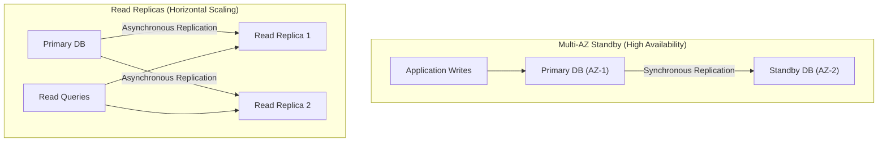

# BITS Pilani WILP — Cloud Computing (CCZG527 / CSIZG527 / SSZG527)
# EC-2 Comprehensive Master Exam Textbook & Cracker

> 🎯 **Your All-In-One Exam Textbook:** This document covers **100% of the syllabus** across all 7 lectures, presentation slides, live demo scripts, and past exam papers. Read this guide to master the concepts, understand the practical engineering context, and score top marks (28–30/30) in your EC2 examination.

---

## 📑 Master Table of Contents

* [Module 1: Cloud Computing Foundations & Service Models (Lecture 1)](#module-1-cloud-foundations--service-models-lecture-1)
  * [1. What is Cloud Computing? (The Utility Model)](#1-what-is-cloud-computing-the-utility-model)
  * [2. The NIST 5-4-3 Framework](#2-the-nist-5-4-3-framework)
  * [3. The Shared Responsibility Model](#3-the-shared-responsibility-model)
  * [4. Cloud Economics: CapEx vs. OpEx & TCO](#4-cloud-economics-capex-vs-opex--tco)
* [Module 2: Virtualization Internals — CPU, Memory & I/O (Lectures 2 & 3)](#module-2-virtualization-internals--cpu-memory--io-lectures-2--3)
  * [1. The 3 Virtualization Types: Full, Para, Hardware-Assisted](#1-the-3-virtualization-types-full-para-hardware-assisted)
  * [2. CPU Virtualization: Privilege Rings & Trap-and-Emulate](#2-cpu-virtualization-privilege-rings--trap-and-emulate)
  * [3. Memory Virtualization: Shadow Page Tables vs. EPT/NPT](#3-memory-virtualization-shadow-page-tables-vs-hardware-eptnpt)
  * [4. I/O Virtualization: Emulated vs. Virtio vs. SR-IOV](#4-io-virtualization-emulated-vs-virtio-vs-sr-iov)
* [Module 3: Hypervisors & Hyperscale Infrastructure (Lecture 4)](#module-3-hypervisors--hyperscale-infrastructure-lecture-4)
  * [1. Type-1 (Bare Metal) vs. Type-2 (Hosted) Hypervisors](#1-type-1-bare-metal-vs-type-2-hosted-hypervisors)
  * [2. Hypervisor Architectures: Monolithic vs. Microkernelized (Xen Dom0/DomU)](#2-hypervisor-architectures-monolithic-vs-microkernelized-xen-dom0domu)
  * [3. The Modern Cloud Revolution: AWS Nitro Hardware Offload](#3-the-modern-cloud-revolution-aws-nitro-hardware-offload)
* [Module 4: IaaS Deep Dive — Compute, Network, Storage & DBs (Lecture 5)](#module-4-iaas-deep-dive--compute-network-storage--dbs-lecture-5)
  * [1. Compute: Sizing Families, VM Lifecycles & Placement Groups](#1-compute-sizing-families-vm-lifecycles--placement-groups)
  * [2. The Storage Triad: Block vs. Object vs. File](#2-the-storage-triad-block-vs-object-vs-file)
  * [3. Software-Defined Networking: VPC, Subnets, NAT & Security Groups vs. NACLs](#3-software-defined-networking-vpc-subnets-nat--security-groups-vs-nacls)
  * [4. Managed Databases: Multi-AZ Standby vs. Read Replicas](#4-managed-databases-multi-az-standby-vs-read-replicas)
* [Module 5: Containers & Docker Engineering (Lectures 6 & 7 + Demo Script)](#module-5-containers--docker-engineering-lectures-6--7--demo-script)
  * [1. Kernel Primitives: Namespaces vs. Cgroups (The Apartment Analogy)](#1-kernel-primitives-namespaces-vs-cgroups-the-apartment-analogy)
  * [2. OS Containers (LXC/LXD) vs. Application Containers (Docker)](#2-os-containers-lxclxd-vs-application-containers-docker)
  * [3. VMs vs. Containers: 2 Demerits & 2 Mitigations](#3-vms-vs-containers-2-demerits--2-mitigations)
  * [4. The Bulletproof 7-Step Dockerfile Recipe & Layer Caching](#4-the-bulletproof-7-step-dockerfile-recipe--layer-caching)
  * [5. Dockerfile Bug-Hunting & Anti-Patterns](#5-dockerfile-bug-hunting--anti-patterns)
  * [6. Docker Storage: Ephemeral vs. Named Volumes vs. Bind Mounts](#6-docker-storage-ephemeral-vs-named-volumes-vs-bind-mounts)
  * [7. The PID 1 Signal Problem & Multi-Container Docker Compose](#7-the-pid-1-signal-problem--multi-container-docker-compose)
* [Module 6: The Scenario & Architecture Playbook (20 Marks)](#module-6-the-scenario--architecture-playbook-20-marks)
  * [1. The 5-Pillar Justification Formula](#1-the-5-pillar-justification-formula)
  * [2. Multi-Tenancy: The 4 Levels, 4 Risks & 4 Mitigations](#2-multi-tenancy-the-4-levels-4-risks--4-mitigations)
  * [3. Pre-Baked Exam Scenarios (Healthcare, Retail, IoT, Banking)](#3-pre-baked-exam-scenarios)
* [Module 7: Cloud Economics & Math Masterclass (5 Marks)](#module-7-cloud-economics--math-masterclass-5-marks)
  * [1. Type 1: Private Capacity Expansion vs. Public Cloud Bursting](#1-type-1-private-capacity-expansion-vs-public-cloud-bursting)
  * [2. Type 2: Distributed Quorum & Consistency Math](#2-type-2-distributed-quorum--consistency-math)
  * [3. Type 3: High Availability & SLA Calculations](#3-type-3-high-availability--sla-calculations)
* [Module 8: Deconstructed Past EC-2 Exam Paper (Model Answers)](#module-8-deconstructed-past-ec-2-exam-paper-model-answers)
* [Module 9: High-Yield Flashcard Cheat Sheet](#module-9-high-yield-flashcard-cheat-sheet)

---

# Module 1: Cloud Foundations & Service Models (Lecture 1)

### 1. What is Cloud Computing? (The Utility Model)
* **Simple Definition:** Cloud computing means renting computer power (CPU, RAM, storage, networking) over the internet from a provider's data center on a pay-as-you-go basis, instead of buying and operating physical hardware servers yourself.
* 💡 **The Electric Socket Analogy:** When you plug a lamp into a wall socket, you don't build a hydroelectric dam or string copper wires to your house. You draw electric current on demand, and at the end of the month, the electric company bills you for exact kilowatt-hours used. Cloud computing turns compute, disk, and databases into the exact same metered utility.
* **The Two Core Pillars:**
  1. **Abstraction:** Hiding complex server chassis, cables, and storage arrays behind clean web APIs.
  2. **Virtualization:** Multiplexing multiple isolated virtual systems onto a shared pool of physical hardware.

---

### 2. The NIST 5-4-3 Framework
The National Institute of Standards and Technology (NIST) defines cloud computing through **5 Essential Characteristics**, **4 Deployment Models**, and **3 Service Models**.

```text
       ┌─────────────────────────────────────────────────────────┐
       │                 NIST 5-4-3 FRAMEWORK                    │
       ├─────────────────┬───────────────────┬───────────────────┤
       │ 5 Characteristics│ 4 Deployments     │ 3 Service Models  │
       ├─────────────────┼───────────────────┼───────────────────┤
       │ 1. On-Demand    │ 1. Public Cloud   │ 1. IaaS           │
       │ 2. Broad Access │ 2. Private Cloud  │ 2. PaaS           │
       │ 3. Resource Pool│ 3. Hybrid Cloud   │ 3. SaaS           │
       │ 4. Rapid Elastic│ 4. Community Cloud│                   │
       │ 5. Measured Svc │                   │                   │
       └─────────────────┴───────────────────┴───────────────────┘
```

#### The 5 Essential Characteristics Explained Simply
1. **On-Demand Self-Service:** A developer can provision servers, disks, and networks automatically with a mouse click or API call without waiting for human IT staff. *(Analogy: Getting a snack from a vending machine vs. ordering at a sit-down restaurant).*
2. **Broad Network Access:** Services are accessible over the network using standard internet protocols from any device (laptops, phones, tablets).
3. **Resource Pooling:** The cloud provider pools physical hardware to serve multiple customers (*multi-tenancy*). Resources are dynamically assigned and reassigned based on consumer demand. The customer has no physical control over the exact server rack location.
4. **Rapid Elasticity:** Resources can be scaled out (added) or scaled in (removed) automatically and almost instantaneously to match demand spikes. To the customer, available capacity feels unlimited.
5. **Measured Service:** Resource usage (CPU hours, storage GBs, network egress bandwidth) is tracked, monitored, and metered transparently for billing.

#### The 4 Deployment Models
* **Public Cloud (AWS, Azure, GCP):** Infrastructure is owned by a cloud vendor and shared among public consumers. Best for unpredictable traffic, startups, and cost efficiency.
* **Private Cloud:** Infrastructure operated exclusively for a single organization (on-premise or third-party hosted). Best for strict compliance, data sovereignty, and steady 24/7 baseline loads.
* **Hybrid Cloud:** Combines private and public clouds connected by encrypted VPNs or dedicated fiber links (e.g., AWS Direct Connect / Azure ExpressRoute). Data and applications move between them seamlessly.
* **Community Cloud:** Infrastructure shared by several organizations with shared compliance or mission requirements (e.g., healthcare research consortiums, government defense agencies).

#### The 3 Service Models (The Restaurant Analogy)
* **IaaS (Infrastructure as a Service):** Renting raw virtualized hardware. You get a blank virtual machine. You must install the OS patches, web server, and application code. *(Analogy: Renting a kitchen; you bring the raw ingredients and cook).* Examples: **Amazon EC2, Azure VMs**.
* **PaaS (Platform as a Service):** Renting a pre-configured application runtime. You provide your source code; the cloud handles OS patching, web servers, and runtime scaling. *(Analogy: Ordering a meal-prep kit; ingredients are chopped, you just cook and eat).* Examples: **AWS Elastic Beanstalk, Azure App Service, Google App Engine**.
* **SaaS (Software as a Service):** A complete, ready-to-use software application accessed via a web browser. You manage zero infrastructure. *(Analogy: Dining at a restaurant; you sit, eat, and leave).* Examples: **Gmail, Microsoft 365, Salesforce, Workday**.

---

### 3. The Shared Responsibility Model
Cloud security is a partnership between the customer and the cloud provider:
* **Security OF the Cloud (Provider's Job):** Physical security of data centers, hardware servers, power generators, cooling, hypervisor virtualization software, and physical network cabling.
* **Security IN the Cloud (Customer's Job):** Customer data encryption, firewall configuration (Security Groups), identity management (IAM passwords/keys), application code security, and **operating system security patches (for IaaS)**.

```text
┌──────────────────────────────────────────────────────────────────┐
│              SHARED RESPONSIBILITY SPLIT BY MODEL                │
├───────────────────────┬──────────────┬──────────────┬────────────┤
│ Architectural Layer   │ IaaS         │ PaaS         │ SaaS       │
├───────────────────────┼──────────────┼──────────────┼────────────┤
│ Applications & Code   │ CUSTOMER     │ CUSTOMER     │ PROVIDER   │
│ Data & Access (IAM)   │ CUSTOMER     │ CUSTOMER     │ CUSTOMER   │
│ Runtime & Middleware  │ CUSTOMER     │ PROVIDER     │ PROVIDER   │
│ Operating System (OS) │ CUSTOMER     │ PROVIDER     │ PROVIDER   │
│ Virtualization Layer  │ PROVIDER     │ PROVIDER     │ PROVIDER   │
│ Physical Hardware     │ PROVIDER     │ PROVIDER     │ PROVIDER   │
└───────────────────────┴──────────────┴──────────────┴────────────┘
```

---

### 4. Cloud Economics: CapEx vs. OpEx & TCO
* **CapEx (Capital Expenditure):** Large, upfront cash investments in physical hardware, servers, storage arrays, switches, and data center facilities. Hard to change; depreciates over 3–5 years.
* **OpEx (Operational Expenditure):** Day-to-day ongoing business operational expenses. In cloud, compute is billed by the second or hour. You pay only for what you run and can terminate servers instantly.
* **TCO (Total Cost of Ownership):** Buying physical servers is not just hardware cost; it includes electricity, cooling, raised-floor real estate, networking hardware, and 24/7 data center operations staff. Cloud eliminates non-hardware TCO overhead.

---

# Module 2: Virtualization Internals — CPU, Memory & I/O (Lectures 2 & 3)

Virtualization decouples software from physical hardware. The software creating and managing virtual machines is called the **Hypervisor** or **Virtual Machine Monitor (VMM)**.

```text
┌────────────────────────────────────────────────────────────────────────┐
│                   THE 3 CORE VIRTUALIZATION MODES                      │
├────────────────────┬───────────────────┬───────────────────────────────┤
│ Virtualization Type│ Guest OS Modified?│ How It Works                  │
├────────────────────┼───────────────────┼───────────────────────────────┤
│ Full Virtualization│ NO (Unmodified OS)│ Binary Translation or         │
│                    │                   │ Hardware CPU extensions (VT-x)│
├────────────────────┼───────────────────┼───────────────────────────────┤
│ Paravirtualization │ YES (Modified OS) │ Guest makes "hypercalls"      │
│                    │                   │ directly to hypervisor API    │
├────────────────────┼───────────────────┼───────────────────────────────┤
│ Hardware-Assisted  │ NO (Unmodified OS)│ CPU silicon introduces root & │
│ Virtualization     │                   │ non-root execution modes      │
└────────────────────┴───────────────────┴───────────────────────────────┘
```

---

### 1. CPU Virtualization: Privilege Rings & Trap-and-Emulate

#### The x86 Privilege Rings
The x86 processor architecture provides 4 privilege levels (Rings):
* **Ring 0 (Most Privileged / Kernel Mode):** Can execute all CPU instructions (modify memory management registers, halt CPU, touch device I/O). Traditionally where the host OS kernel lives.
* **Ring 1 & Ring 2:** Reserved for device drivers (rarely used by modern operating systems).
* **Ring 3 (Least Privileged / User Mode):** Where ordinary user applications (browsers, text editors) run. If an app tries to run a privileged CPU instruction, the hardware blocks it and triggers an interrupt (exception).

```text
           [ Ring 3: User Applications ]
                 [ Ring 1 & 2: Drivers ]
              [ Ring 0: OS Kernel / VMM ]
```

#### The Fundamental Virtualization Dilemma (Popek-Goldberg Condition)
* To achieve safe virtualization, a hypervisor must run in **Ring 0**, forcing the Guest OS kernel down to **Ring 1** (known as **Ring Deprivileging**).
* **The Popek-Goldberg Theorem states:** *A system is purely virtualizable if all sensitive instructions are a strict subset of privileged instructions.*
* **The Flaw in Classical x86 Architecture:** In 32-bit x86 CPUs, **17 sensitive instructions** (instructions that read or modify hardware registers, such as `POPF`, `PUSHF`, `SMSW`) were **NOT privileged**! When a Guest OS running in Ring 1 executed them, they did **not trap** to the hypervisor; they either silently failed or returned incorrect host values!

#### How Cloud Virtualization Solved This Dilemma

1. **Solution 1: Binary Translation (Full Virtualization - Early VMware):**
   * The hypervisor inspects the guest kernel's binary machine code in real time before execution.
   * Any of the 17 dangerous sensitive instructions are dynamically intercepted and rewritten into safe instruction sequences that jump directly into hypervisor code.
   * *Trade-off:* Works on unmodified guest operating systems, but software translation introduces heavy performance overhead.

2. **Solution 2: Paravirtualization (Xen Hypervisor):**
   * Instead of tricking an unmodified OS, engineers **modified the Guest OS kernel source code**.
   * Dangerous sensitive instructions are replaced with explicit software API calls to the hypervisor, called **Hypercalls** (analogous to how apps use system calls `syscall` to talk to the kernel).
   * *Trade-off:* High performance, but requires modifying the guest OS kernel (cannot run proprietary closed-source OS like Windows out of the box).

3. **Solution 3: Hardware-Assisted Virtualization (Intel VT-x & AMD-V):**
   * In 2005–2006, Intel and AMD fixed silicon architecture by adding two new operating modes:
     * **VMX Root Mode:** Where the Hypervisor runs. Has full access to physical hardware.
     * **VMX Non-Root Mode:** Where the Guest OS and guest applications run.
   * When the Guest OS in non-root mode executes a sensitive instruction, the CPU hardware automatically triggers a **VM-Exit**, pausing the guest and handing control to the hypervisor in root mode. The hypervisor inspects the request (**VMCS - Virtual Machine Control Structure**), emulates the action, and resumes the guest with a **VM-Entry**.
   * *Trade-off:* Zero guest OS modifications required; full near-native execution speed.

---

### 2. Memory Virtualization: Shadow Page Tables vs. Hardware EPT/NPT

An operating system uses Page Tables to translate Virtual Memory into Physical RAM addresses. In virtualization, there are **three layers of memory**:
1. **Guest Virtual Address (GVA):** What a program inside the VM sees.
2. **Guest Physical Address (GPA):** What the guest OS believes is its physical RAM.
3. **Host Physical Address (HPA):** The actual physical silicon RAM stick in the server.

```text
Traditional OS:  Virtual Address (VA)  ─────────────────────► Physical Address (PA)
Virtualization:  Guest Virtual (GVA)  ──► Guest Physical (GPA) ──► Host Physical (HPA)
```

#### Method A: Shadow Page Tables (Software Approach)
* The hypervisor maintains a second, hidden set of page tables called **Shadow Page Tables (SPT)** that directly map **GVA $\to$ HPA**.
* The physical CPU’s Memory Management Unit (MMU) points directly to this Shadow Page Table.
* **The Penalty:** Every time the guest OS creates, modifies, or deletes a page table entry, the page table memory must be write-protected so the write traps into the hypervisor. This hypervisor interception causes massive CPU context switching overhead for memory-heavy database workloads.

#### Method B: Extended Page Tables (Intel EPT) / Nested Page Tables (AMD NPT)
* Modern CPUs solve this directly in hardware silicon: the MMU performs a **Two-Dimensional Page Walk**:
  * Dimension 1 translates GVA $\to$ GPA using the guest’s own page tables.
  * Dimension 2 translates GPA $\to$ HPA using hardware EPT pointer registers (`EPTP`).
* **VPID (Virtual Processor ID):** Hardware tags Translation Lookaside Buffer (TLB) cache entries with an ID per VM. This eliminates the need to flush the entire CPU memory cache whenever switching between VMs.

---

### 3. I/O Virtualization: Emulated vs. Virtio vs. SR-IOV

How does a Virtual Machine read from a network card or write to a hard drive?

```text
┌────────────────────────────────────────────────────────────────────────┐
│                        THE 3 I/O APPROACHES                            │
├────────────────┬───────────────────────────────────────────────────────┤
│ 1. Emulated    │ Hypervisor fully simulates legacy hardware chips      │
│    I/O         │ (e.g., Intel e1000 NIC). Very slow; every packet      │
│                │ causes dozens of CPU VM-Exits.                        │
├────────────────┼───────────────────────────────────────────────────────┤
│ 2. Virtio      │ Paravirtualized split-driver model:                   │
│    (Split-     │ • Frontend Driver: Lives inside Guest OS.             │
│    Driver)     │ • Backend Driver: Lives inside Hypervisor.            │
│                │ Communicates via shared memory ring buffers; avoids   │
│                │ expensive hardware trap overhead.                     │
├────────────────┼───────────────────────────────────────────────────────┤
│ 3. SR-IOV      │ Single Root I/O Virtualization:                       │
│    (Direct     │ A single physical PCIe network card exposes dozens of │
│    Passthrough)│ hardware Virtual Functions (VFs). The VM communicates │
│                │ directly with physical silicon at 100 Gbps speed!     │
└────────────────┴───────────────────────────────────────────────────────┘
```

---

# Module 3: Hypervisors & Hyperscale Infrastructure (Lecture 4)

### 1. Type-1 (Bare Metal) vs. Type-2 (Hosted) Hypervisors

```text
   TYPE-1 (BARE METAL)                   TYPE-2 (HOSTED)
┌───────────────────────┐             ┌───────────────────────┐
│ VM 1   │ VM 2  │ VM 3 │             │ VM 1   │ VM 2  │ VM 3 │
├───────────────────────┤             ├───────────────────────┤
│  Type-1 Hypervisor    │             │  Type-2 Hypervisor    │
├───────────────────────┤             ├───────────────────────┤
│   Physical Hardware   │             │   Host OS (Windows/Mac)
└───────────────────────┘             ├───────────────────────┤
                                      │   Physical Hardware   │
                                      └───────────────────────┘
```

| Dimension | Type-1 Hypervisor (Bare Metal) | Type-2 Hypervisor (Hosted) |
| :--- | :--- | :--- |
| **Where it Runs** | Directly on bare server hardware silicon | As an application inside an existing Host OS |
| **Performance** | **Near-native (95–99%):** Direct hardware access | **Slower:** Incurs host OS scheduling & I/O tax |
| **Security Surface** | Tiny, hardened codebase with minimal attack surface | Large attack surface (any host OS bug compromises VMs) |
| **Enterprise Use** | Public cloud standard (**AWS, Azure, GCP, VMware ESXi**) | Local dev laptops (**VirtualBox, VMware Workstation**) |

---

### 2. Hypervisor Architectures: Monolithic vs. Microkernelized (Xen)
* **Monolithic Hypervisor (VMware ESXi, KVM):** Hypervisor bundles device drivers, memory management, and CPU scheduling into a single kernel space. Simple and fast, but a bad device driver can crash the entire server.
* **Microkernelized Hypervisor (Xen):** The hypervisor core is extremely tiny (under 100,000 lines of code). It delegates device management to a special privileged virtual machine:
  * **Domain 0 (Dom0):** The administrative, privileged guest OS that boots first, contains physical device drivers, and controls the hypervisor control plane.
  * **Domain U (DomU):** Unprivileged customer guest virtual machines created and managed by Dom0.

---

### 3. The Modern Cloud Revolution: AWS Nitro Hardware Offload
* **The Problem with Traditional Hypervisors:**  
  On large cloud servers, the software hypervisor consumes **15% to 30% of the server's actual CPU cores and memory** just processing software-defined VPC networking, encrypting EBS storage volumes, and managing security boundaries (known as the **"Hypervisor Tax"**).
* **The AWS Nitro Solution:**  
  AWS built dedicated PCIe hardware ASIC accelerator cards:
  1. **Nitro Card for VPC:** Handles software networking and packet encapsulation in silicon.
  2. **Nitro Card for EBS:** Handles crypto and network disk I/O in silicon.
  3. **Nitro Security Chip:** Hardware Root of Trust and firmware security.
* **The Breakthrough:** By offloading networking, storage, and security to dedicated hardware cards, the remaining server hypervisor is so tiny that **almost 100% of the host server’s CPU and RAM is delivered directly to paying customer VMs**.

---

# Module 4: IaaS Deep Dive — Compute, Network, Storage & DBs (Lecture 5)

### 1. Compute: Sizing Families, VM Lifecycles & Placement Groups

#### Workload Sizing Families
* **General Purpose (`m6g`, `t4g` $\leftrightarrow$ Azure `D-series`):** Balanced CPU-to-memory ratio; web servers, microservices.
* **Compute Optimized (`c6g` $\leftrightarrow$ Azure `F-series`):** High vCPU ratio; batch compute, scientific modeling, game servers.
* **Memory Optimized (`r6g` $\leftrightarrow$ Azure `E-series`):** High RAM ratio; in-memory caching (**Redis**), real-time analytics.
* **Storage Optimized (`i3en` $\leftrightarrow$ Azure `L-series`):** Direct-attached NVMe storage delivering millions of IOPS; Cassandra, Elasticsearch.

#### The Virtual Machine Lifecycle & Operational IP Traps
```text
[ Pending ] ──► [ Running ] ──► [ Stopping ] ──► [ Stopped / Deallocated ] ──► [ Terminated ]
```
* **Reboot:** Machine stays on the exact same physical blade chassis. Both **Private IP and Public IP remain unchanged**.
* **Stop / Start (Deallocate):** Compute billing halts. When you start the VM again, the cloud scheduler moves it to an **entirely different physical host rack**. Its **Public IPv4 address changes dynamically** unless bound to a static reservation (**AWS Elastic IP $\leftrightarrow$ Azure Static Public IP**).

#### Physical Placement Groups
* **Cluster Placement Group (AWS) $\leftrightarrow$ Proximity Placement Group (Azure):** Packs VMs tightly into the same physical datacenter rack. Delivers ultra-low network latency and high throughput (100 Gbps). Used for high-performance computing (HPC) and distributed machine learning training.
* **Spread Placement Group (AWS) $\leftrightarrow$ Availability Sets / Fault Domains (Azure):** Strictly places each VM on distinct physical hardware racks with independent power and network switches. Protects against simultaneous hardware failure.
* **Partition Placement Group (AWS):** Spreads VMs across logical partitions; used for distributed databases like Kafka and HDFS.

---

### 2. The Storage Triad: Block vs. Object vs. File

```text
┌─────────────────┬───────────────────┬───────────────────┬──────────────────────────┐
│ Storage Type    │ AWS Equivalent    │ Azure Equivalent  │ Ideal Workload           │
├─────────────────┼───────────────────┼───────────────────┼──────────────────────────┤
│ Block Storage   │ Amazon EBS        │ Azure Managed     │ VM OS boot disk,         │
│                 │                   │ Disks             │ low-latency databases    │
├─────────────────┼───────────────────┼───────────────────┼──────────────────────────┤
│ Object Storage  │ Amazon S3         │ Azure Blob        │ Media files, backups,    │
│                 │                   │ Storage           │ big data lakes (HTTPS)   │
├─────────────────┼───────────────────┼───────────────────┼──────────────────────────┤
│ Shared File     │ Amazon EFS        │ Azure Files       │ Shared CMS media folders,│
│ Storage         │                   │                   │ multi-VM shared files    │
└─────────────────┴───────────────────┴───────────────────┴──────────────────────────┘
```

* **Ephemeral Instance Store vs. Persistent Block Storage (EBS):**
  * *Instance Store:* Raw NVMe SSD physically attached inside the server chassis. Ultra-fast, but **ephemeral** (data is permanently wiped if the instance is stopped or deallocated).
  * *Elastic Block Store (EBS):* Network-attached virtual disk. Data persists indefinitely across instance stops, reboots, and migrations.

---

### 3. Software-Defined Networking: VPC, Subnets, NAT & Security Groups vs. NACLs

#### VPC Architecture Fundamentals
* **VPC (Virtual Private Cloud) $\leftrightarrow$ Azure VNet:** A private, logically isolated software-defined virtual network dedicated to your cloud account.
* **Public Subnet:** A subnet configured with a route table entry pointing to an **Internet Gateway (IGW)**. Resources receive public IPs and can talk directly to the outside world (e.g., Load Balancers, Web Proxies).
* **Private Subnet:** A subnet with no route to an Internet Gateway. Fully isolated from incoming internet scans (e.g., backend databases, payment microservices).
* **NAT Gateway (Network Address Translation):** Lives in the *Public Subnet*. Allows instances in the *Private Subnet* to initiate outbound connections (to download OS patches or software updates) while strictly blocking unauthorized inbound connections from the internet.

#### Security Groups vs. Network Access Control Lists (NACLs)

| Dimension | Security Groups | Network ACLs (NACLs) |
| :--- | :--- | :--- |
| **Operating Layer** | Virtual Network Interface (Instance Level) | Subnet Boundary Level |
| **State Nature** | **Stateful:** Return traffic is automatically allowed regardless of inbound rules | **Stateless:** Return traffic must be explicitly allowed via outbound rules |
| **Rules Supported** | **Allow rules only** (Everything else implicitly denied) | **Allow AND Deny rules** |
| **Rule Evaluation** | All rules evaluated simultaneously | Evaluated in strict **numerical order** (lowest number first) |

---

### 4. Managed Databases: Multi-AZ Standby vs. Read Replicas



* **Multi-AZ Standby Deployment:**
  * Uses **Synchronous Replication** to an idle secondary standby database in another Availability Zone.
  * Primary purpose: **High Availability & Automated Disaster Failover**.
  * The standby DB cannot process read queries. In a hardware failure, DNS automatically points to the standby in ~60 seconds with zero data loss.
* **Read Replicas:**
  * Uses **Asynchronous Replication** to spin up up to 5–15 read-only database copies.
  * Primary purpose: **Read Throughput Scaling** (handling millions of read-heavy SELECT queries).
  * Subject to slight replication lag (**eventual consistency**).

---

# Module 5: Containers & Docker Engineering (Lectures 6 & 7 + Demo Script)

### 1. Kernel Primitives: Namespaces vs. Cgroups (The Apartment Analogy)

> 🏢 **The Apartment Complex Model:**  
> Think of a server host as an apartment building sharing a single foundation and plumbing grid (Linux Kernel):
> * **Namespaces = Walls & Doors (What you can SEE):** Apartment 101 cannot see into Apartment 102.
> * **Cgroups = Power Breakers & Water Meters (How much you can USE):** Prevents one apartment from consuming all building power.

```text
┌─────────────────┬──────────────────────────────────────────────────────┐
│ Primitive       │ Responsibility & Scope                               │
├─────────────────┼──────────────────────────────────────────────────────┤
│ Namespaces      │ ISOLATION (Limits what a process can see):           │
│                 │ • PID: Container gets isolated process tree (PID 1). │
│                 │ • NET: Container gets private virtual IP & ports.    │
│                 │ • MNT: Container gets isolated filesystem mount root.│
│                 │ • USER: Container root (UID 0) maps to non-root host.│
├─────────────────┼──────────────────────────────────────────────────────┤
│ Cgroups         │ RESOURCE MANAGEMENT (Limits what a process can use): │
│ (Control Groups)│ • Limits CPU execution cycles and scheduling shares. │
│                 │ • Sets RAM ceiling; invokes OOM killer if breached.  │
│                 │ • Controls disk I/O bandwidth and network priority.  │
└─────────────────┴──────────────────────────────────────────────────────┘
```

---

### 2. OS Containers (LXC/LXD) vs. Application Containers (Docker)
* **OS Containers (LXC / LXD):** Designed to behave like lightweight virtual machines. Runs a full Linux distribution user space with multiple services, `systemd`, SSH daemons, and cron jobs sharing the host kernel.
* **Application Containers (Docker):** Designed to package and run a **single application service**. No `systemd`. When the single main application process terminates, the container immediately stops.

---

### 3. VMs vs. Containers: 2 Demerits & 2 Mitigations

| Virtualization Technique | Two Primary Demerits | Mitigation Strategy |
| :--- | :--- | :--- |
| **Software Virtualization (Containers)** | **1. Shared Kernel Security Risk:** A kernel exploit in one container can compromise the host and all neighboring containers.<br>**2. OS Kernel Lock-in:** Cannot run a Windows kernel on a Linux host or vice-versa. | • Run untrusted containers inside **Sandboxed Micro-VM runtimes (Kata Containers, AWS Firecracker, Google gVisor)**.<br>• Run as **non-root users** (`USER appuser`) and drop capabilities with **Seccomp/AppArmor**.<br>• Deploy heterogeneous node pools (Linux + Windows nodes in Kubernetes). |
| **Full Virtualization (Virtual Machines)** | **1. High Resource Overhead:** Wastes gigabytes of memory and storage per VM to maintain separate guest OS kernels.<br>**2. Slow Boot Latency:** Requires full BIOS, device init, and OS boot cycles (taking 30–120 seconds). | • Use minimalist thin guest images (**Alpine Linux**).<br>• Enable memory ballooning and page sharing.<br>• Use pre-warmed VM pools or migrate stateless workloads to containers. |

---

### 4. The Bulletproof 7-Step Dockerfile Recipe & Layer Caching

#### The "Kitchen Prep" Rule of Layer Caching
Every line in a `Dockerfile` creates an immutable, cached read-only layer. Docker builds from top to bottom. If a layer changes, **all subsequent layers below it are invalidated and must re-run from scratch**.
* **The Mistake:** Copying all application code *before* running dependency installs. Every tiny code edit forces a complete re-download of all dependencies!
* **The Fix:** Copy dependency manifests first, run the install, and **only then copy your application code**.

```dockerfile
# STEP 1: Specific base image (Never use :latest)
FROM ubuntu:22.04

# STEP 2: Suppress interactive prompt halts
ENV DEBIAN_FRONTEND=noninteractive

# STEP 3: Chain updates, installs, and cache cleanup in ONE single RUN command
RUN apt-get update && apt-get install -y --no-install-recommends \
    curl \
    nodejs \
    npm \
    && rm -rf /var/lib/apt/lists/*

# STEP 4: Set the working directory
WORKDIR /app

# STEP 5: CACHE OPTIMIZATION: Dependency manifest FIRST
COPY package*.json ./
RUN npm install --production

# STEP 6: Copy application code
COPY . .

# STEP 7: Switch to non-root user, expose port, define startup command
RUN useradd -m appuser && chown -R appuser /app
USER appuser
EXPOSE 3232
CMD ["node", "server.js"]
```

---

### 5. Dockerfile Bug-Hunting & Anti-Patterns

Look for these **5 Classic Bugs** in any Dockerfile review question:
1. `FROM ubuntu:latest` $\to$ **Bug:** Non-reproducible build. **Fix:** Pin version (`FROM ubuntu:22.04`).
2. `RUN apt-get update` followed by separate `RUN apt-get install -y python3` $\to$ **Bug:** If install layer is cached, update never runs, leading to stale or failed package installs. **Fix:** Chain them (`RUN apt-get update && apt-get install -y ...`).
3. Leaving `/var/lib/apt/lists/*` $\to$ **Bug:** Bloats image size by hundreds of megabytes. **Fix:** Add `&& rm -rf /var/lib/apt/lists/*`.
4. `COPY . /app` followed by `RUN pip install -r requirements.txt` $\to$ **Bug:** Destroys build layer caching. **Fix:** Copy `requirements.txt` first.
5. Running as `root` $\to$ **Bug:** Shared host kernel privilege escalation risk. **Fix:** Add `USER appuser`.

---

### 6. Docker Storage: Ephemeral vs. Named Volumes vs. Bind Mounts

```text
┌────────────────────────────────────────────────────────────────────────┐
│                        DOCKER STORAGE COMPARISON                       │
├──────────────────┬─────────────────────────────────────────────────────┤
│ 1. Ephemeral     │ • Top writable layer (overlay2).                    │
│    Storage       │ • Lost forever when container is deleted.           │
│                  │ • Slow write performance due to Copy-on-Write (CoW).│
├──────────────────┼─────────────────────────────────────────────────────┤
│ 2. Named Volumes │ • Docker-managed host path:                         │
│    (-v pgdata:   │   /var/lib/docker/volumes/<vol_name>/_data          │
│    /var/lib/...) │ • Bypasses CoW (native host NVMe/SSD speed).        │
│                  │ • Data survives crashes, restarts, and deletions!   │
├──────────────────┼─────────────────────────────────────────────────────┤
│ 3. Bind Mounts   │ • Maps exact host folder (e.g. /home/user/code:/app)│
│    (-v /host/dir:│ • Great for local code editing; poor portability.   │
│    /container)   │                                                     │
└──────────────────┴─────────────────────────────────────────────────────┘
```

#### What role do Docker volumes play during container restarts?
1. **Zero Data Loss on Crash/Restart:** When a container crashes or is stopped (`docker stop`) and started again (`docker start`), the data in the volume remains completely intact.
2. **Re-attachability:** A volume can be detached from a dead container and attached to an entirely new container version, enabling seamless blue-green upgrades.
3. **Production Portability & Efficiency:** Because volumes write directly to the host filesystem and bypass the union storage driver (UnionFS / overlay2), they deliver maximum disk I/O throughput necessary for databases (PostgreSQL/MySQL).

---

### 7. The PID 1 Signal Problem & Multi-Container Docker Compose

* **The PID 1 Problem:** Linux `PID 1` ignores standard `SIGINT` (Ctrl+C) or `SIGTERM` signals unless a custom signal handler is written. If you launch an app with shell form (`CMD python app.py`), `sh` becomes PID 1 and swallows terminate signals. The container hangs for 10 seconds before Docker forcibly kills it.
  * **Fix:** Use **exec-form** (`CMD ["python3", "app.py"]`) and use the `--init` flag to inject **tini** as PID 1.
* **The Monolithic Container Anti-Pattern:** Never install Web Server + PostgreSQL + RabbitMQ inside a single container.
  * Violates Single Responsibility.
  * Docker only monitors PID 1; if PostgreSQL crashes while Apache runs, Docker thinks the container is healthy!
  * Cannot scale web servers independently from the database.
* **The Solution (Docker Compose):** Define services in `docker-compose.yml` connected over an isolated private bridge network (`pgnet`). Container names automatically resolve via Docker's embedded DNS.

---

# Module 6: The Scenario & Architecture Playbook (20 Marks)

BITS EC2 exam questions are heavily scenario-based. You must structure every answer using the **5 Pillars**.

---

### 1. The 5-Pillar Justification Formula

```text
┌────────────────────────────────────────────────────────────────────────┐
│                        THE 5 JUSTIFICATION PILLARS                     │
├─────────────────────────┬──────────────────────────────────────────────┤
│ 1. Operational Control  │ Root OS & kernel control vs Provider-managed │
│ 2. Customization        │ Legacy drivers & proprietary code vs Fixed   │
│ 3. Maintenance Burden   │ Who patches OS/DB? (Shared Responsibility)   │
│ 4. Scalability & Speed  │ Manual VM auto-scaling vs Instant elasticity │
│ 5. Cost Structure       │ High upfront CapEx vs Pay-as-you-go OpEx     │
└─────────────────────────┴──────────────────────────────────────────────┘
```

---

### 2. Multi-Tenancy: The 4 Levels, 4 Risks & 4 Mitigations

#### The 4 Levels of Multi-Tenancy
* **Level 1: Shared Application + Shared Database (Single Instance):** All tenants share app code and database tables. Data separated only by a `tenant_id` column. Highest cost efficiency, lowest security isolation.
* **Level 2: Shared Application + Separate Schemas / Databases:** All tenants share application processes, but each tenant gets a dedicated database or schema.
* **Level 3: Shared Infrastructure + Container / VM Isolation:** Each tenant runs on dedicated containers/VMs, sharing only host physical server hardware.
* **Level 4: Isolated Silo (Single-Tenant Private Deployment):** Fully dedicated compute, network, and storage per customer. Zero sharing.

#### The 4 Multi-Tenancy Risks & Mitigations

| Risk | What Happens in Simple Terms | Mitigation Strategy |
| :--- | :--- | :--- |
| **1. Noisy Neighbor** | Tenant A runs a heavy analytics query, consuming 98% CPU and starving Tenant B. | Implement **Cgroups / Resource Quotas**, rate limiting, and request throttling. |
| **2. Data Leakage** | A software bug or flawed SQL query returns Tenant A's private data to Tenant B. | Enforce **Row-Level Security (RLS)**, database schema isolation, and tenant-specific encryption keys. |
| **3. Cascading Failure** | An unhandled exception or crash in the shared app brings down the system for all tenants. | Implement **Cell-Based Architecture**; isolate tenants into small autonomous failure zones. |
| **4. Regulatory Violation** | Healthcare/Finance laws forbid co-locating data on shared storage drives. | Provide **Level 3 or 4 Silo Multi-Tenancy** with isolated VPCs and dedicated encrypted disks. |

---

### 3. Pre-Baked Exam Scenarios

#### Scenario A: Modernizing Hospital Information System (HIS)
* **Architecture A:** SaaS for EHR, billing, and scheduling.
* **Architecture B:** PaaS custom apps + IaaS VMs for legacy diagnostic scanners (MRI/CT).
* **Comparison & Justification:**
  * *Scalability:* Architecture A scales automatically without hospital IT intervention. Architecture B requires manual auto-scaling rules and VM sizing.
  * *Customization:* Architecture B wins. Legacy medical scanners use specialized hardware drivers and proprietary protocols (DICOM) that cannot run on standardized SaaS.
  * *Operational Control:* Architecture B gives full control over OS security, encryption, and local offline continuity. Architecture A delegates all control to the vendor.
  * *Recommendation:* Use **Architecture A** for new satellite consultation clinics. Use **Architecture B** for the main hospital operating complex running legacy diagnostic scanners.

#### Scenario B: Global Retailer ERP + Azure VMs
* **Cloud-based ERP via browser:** **SaaS (Software as a Service)** because software is vendor-hosted, accessed via browser, with zero infrastructure management.
* **Azure Virtual Machines:** **IaaS (Infrastructure as a Service)** because the IT team manages the operating system, security patches, networking, and custom pricing runtimes.
* **Overall Deployment Model:** **Hybrid Cloud** because the enterprise integrates public SaaS with enterprise-controlled IaaS and on-premise store inventory systems.

---

# Module 7: Cloud Economics & Math Masterclass (5 Marks)

Calculators are allowed. Master these three exact numerical models.

---

### 1. Type 1: Private Capacity Expansion vs. Public Cloud Bursting

#### The Mathematical Optimization Model
$$\text{Total Demand Served} = \text{Private Units Utilized} + \text{Public Units Purchased}$$

$$\text{Public Units Purchased} = \frac{\text{Remaining Budget}}{\text{Public Unit Cost}}$$

---

#### Step-by-Step Worked Walkthrough (The Past EC2 Problem)

**Given Data:**
* Budget = **Rs. 10,000**
* Current Private Capacity = **40 units**
* Private Unit Cost = **Rs. 100**
* Public Cloud Cost = **Rs. 240** per unit
* Expansion Proposition: Expand private capacity by **20 units** (new capacity = 60 units) for a fixed cost of **Rs. 1,800**.

```text
────────────────────────────────────────────────────────────────────────
EVALUATION OPTION 1: DO NOT EXPAND (Baseline)
────────────────────────────────────────────────────────────────────────
1. Private Capacity Utilized: 40 units
2. Cost of Private Units: 40 units × Rs. 100 = Rs. 4,000
3. Remaining Budget for Public Cloud:
   Rs. 10,000 - Rs. 4,000 = Rs. 6,000
4. Public Units Purchased:
   Rs. 6,000 / Rs. 240 = 25 units
5. TOTAL DEMAND SERVED:
   40 (Private) + 25 (Public) = 65 units

────────────────────────────────────────────────────────────────────────
EVALUATION OPTION 2: EXPAND PRIVATE CAPACITY
────────────────────────────────────────────────────────────────────────
1. New Private Capacity: 40 + 20 = 60 units
2. Fixed Expansion Cost: Rs. 1,800
3. Cost of Running 60 Private Units: 60 units × Rs. 100 = Rs. 6,000
4. Total Private Spend:
   Rs. 1,800 (Fixed) + Rs. 6,000 (Usage) = Rs. 7,800
5. Remaining Budget for Public Cloud:
   Rs. 10,000 - Rs. 7,800 = Rs. 2,200
6. Public Units Purchased:
   Rs. 2,200 / Rs. 240 = 9.16 units
7. TOTAL DEMAND SERVED:
   60 (Private) + 9.16 (Public) = 69.16 units

────────────────────────────────────────────────────────────────────────
EXAM CONCLUSION & JUSTIFICATION
────────────────────────────────────────────────────────────────────────
YES, the company SHOULD expand its private capacity.
Justification: Expanding capacity serves 69.16 units of demand compared to
only 65 units without expansion, yielding a net gain of 4.16 units (+6.4%)
under the identical Rs. 10,000 budget ceiling.
```

---

### 2. Type 2: Distributed Quorum & Consistency Math

#### Core Formulas
1. **Simple Majority Quorum:**
   $$Q = \left\lfloor \frac{N}{2} \right\rfloor + 1$$
   * For $N = 7$ nodes: $Q = \lfloor 7/2 \rfloor + 1 = 3 + 1 = \mathbf{4 \text{ nodes}}$.
   * For $N = 5$ nodes: $Q = \lfloor 5/2 \rfloor + 1 = 2 + 1 = \mathbf{3 \text{ nodes}}$.

2. **Read/Write Quorum Consistency Rules:**
   * **Rule 1 (Prevent Write-Write Conflicts):** $W > \frac{N}{2}$ (Write quorum must be a strict majority).
   * **Rule 2 (Prevent Stale Reads):** $R + W > N$ (Read and Write quorums must overlap by at least one node containing the latest write).

#### Network Partition Question
* *Problem:* A 7-node cluster partitions into **3 nodes** on Side A and **4 nodes** on Side B. Can the system continue processing writes?
* *Answer & Justification:*
  * Majority quorum required = $\lfloor 7/2 \rfloor + 1 = \mathbf{4 \text{ nodes}}$.
  * **Side A (3 nodes):** Must reject writes ($3 < 4$) to prevent split-brain inconsistencies.
  * **Side B (4 nodes):** **Can continue processing writes** ($4 \ge 4$).

---

### 3. Type 3: High Availability & SLA Calculations

* **Series Availability (Dependent Components):**
  $$A_{\text{total}} = A_1 \times A_2 = 0.999 \times 0.999 \approx \mathbf{99.8\%}$$
  *(Always lower than the weakest link).*
* **Parallel Availability (Redundant Components):**
  $$A_{\text{total}} = 1 - (1 - A_1)(1 - A_2) = 1 - (0.01 \times 0.01) = \mathbf{99.99\%}$$
  *(Significantly boosts uptime).*
* **The "Nines" of Downtime (Per Year):**
  * 99% ("Two Nines"): ~3.65 days downtime/year.
  * 99.9% ("Three Nines"): ~8.76 hours downtime/year.
  * 99.99% ("Four Nines"): ~52.6 minutes downtime/year.

---

# Module 8: Deconstructed Past EC-2 Exam Paper (Model Answers)

> 📝 **Official Exam Solutions Reference:** Below are the complete, point-by-point model answers for all 6 questions of the official 2025–2026 EC-2 exam paper.

## Question 1 (5 Marks [3 + 2])

> **Question:**  
> Pick any ONE Virtualization technique of your choice, among full virtualization with VMs or software virtualization using containers. State its TWO primary demerits in Cloud Computing with a very brief justification, and how can they be mitigated?

### Model Answer

**Choice of Virtualization Technique:** **Software Virtualization using Containers** *(Note: You can pick either, but Containers is the most straightforward to justify with high marks).*

#### Part (a): Two Primary Demerits with Justifications (3 Marks)

1. **Demerit 1: Weaker Security Isolation / Shared Host Kernel Vulnerability**
   * *Justification:* Unlike Virtual Machines which run isolated guest kernels on hardware-level hypervisors, all containers running on a host share the single underlying Linux kernel. If an application inside a container triggers a kernel privilege-escalation vulnerability (e.g., Dirty COW or container escape), an attacker can compromise the host OS and all other co-located containers.

2. **Demerit 2: Operating System / Kernel Lock-In (Lack of Heterogeneity)**
   * *Justification:* A container does not bundle an operating system kernel; it relies directly on the host kernel's system calls. Consequently, a Linux host cannot natively run Windows kernel containers, and a Windows host cannot natively run Linux containers without spinning up an underlying VM layer (like WSL2).

#### Part (b): Mitigation Strategies (2 Marks)

1. **Mitigation for Shared Kernel Vulnerability:**
   * **Deploy Sandboxed / Micro-VM Runtimes:** Run untrusted containers using lightweight micro-VM container runtimes such as **Kata Containers**, **AWS Firecracker**, or user-space application kernels like **Google gVisor**.
   * **Enforce Least Privilege:** Run container processes as **non-root users** (`USER appuser`), enable user namespaces (`userns-remap`), and drop unnecessary Linux kernel capabilities using **Seccomp** and **AppArmor** profiles.

2. **Mitigation for OS Lock-In:**
   * In multi-cloud or hybrid environments, deploy **heterogeneous worker node pools** in your orchestration cluster (e.g., dedicated Linux node pools for Linux containers and dedicated Windows Server node pools for Windows containers in Kubernetes/AKS/EKS).

---

## Question 2 (5 Marks)

> **Question:**  
> Write a Dockerfile to create an image for a web application that requires a specific version of Node.js (14.16.1) and a custom dependency (express 4.16.2). The image should be based on the official Ubuntu 22.04 image, have a working directory at `/app`, and copy the `package.json` file into the working directory. After installing the dependencies, copy the remaining application code into the working directory and expose port 3232. You need not write any docker commands to build the image or to run the container.  
> **Output:** A Dockerfile that generates the desired image when built.

### Model Answer

```dockerfile
# -------------------------------------------------------------
# Base Image: Official Ubuntu 22.04 as specified
# -------------------------------------------------------------
FROM ubuntu:22.04

# Prevent interactive prompts during apt installations
ENV DEBIAN_FRONTEND=noninteractive

# -------------------------------------------------------------
# Install Node.js 14.16.1 and required build dependencies
# Clean package cache in the same RUN layer to keep image small
# -------------------------------------------------------------
RUN apt-get update && apt-get install -y --no-install-recommends \
    curl \
    ca-certificates \
    && curl -fsSL https://deb.nodesource.com/setup_14.x | bash - \
    && apt-get install -y nodejs=14.16.1* \
    && rm -rf /var/lib/apt/lists/*

# -------------------------------------------------------------
# Set working directory to /app
# -------------------------------------------------------------
WORKDIR /app

# -------------------------------------------------------------
# Layer Caching Best Practice: Copy package.json FIRST
# -------------------------------------------------------------
COPY package.json ./

# -------------------------------------------------------------
# Install specific version of Express dependency (4.16.2)
# -------------------------------------------------------------
RUN npm install express@4.16.2

# -------------------------------------------------------------
# Copy remaining application code into working directory
# -------------------------------------------------------------
COPY . .

# -------------------------------------------------------------
# Expose the specified application port
# -------------------------------------------------------------
EXPOSE 3232

# Default command to start the application
CMD ["node", "index.js"]
```

#### Why Evaluators Award Full Marks for This Solution:
* **Base Image Correct:** Uses `FROM ubuntu:22.04` (not `:latest`).
* **Non-Interactive Flag:** Includes `DEBIAN_FRONTEND=noninteractive` to prevent hung builds during `apt-get`.
* **Exact Versions Pinned:** Explicitly specifies `nodejs=14.16.1` and `express@4.16.2`.
* **Build Cache Preservation:** Accurately places `COPY package.json ./` and `npm install` **before** `COPY . .`.
* **Exposed Port:** Accurately declares `EXPOSE 3232`.

---

## Question 3 (5 Marks [3 + 2])

> **Question:**  
> A multi-specialty hospital is planning to modernize its Hospital Information System (HIS). The management is evaluating two alternative cloud-based architectures:  
> • **Architecture A:** A system primarily built using SaaS solutions for electronic health records, billing, and appointment scheduling, with minimal customization.  
> • **Architecture B:** A system that combines PaaS-based custom application development with IaaS-hosted virtual machines for legacy clinical and diagnostic applications.  
> 
> a) Compare Architecture A and Architecture B in terms of scalability, customization, and operational control.  
> b) Identify scenarios in which Architecture A would be preferred over Architecture B, and vice versa, with justification.

### Model Answer

#### Part (a): Comparative Analysis (3 Marks)

| Evaluation Parameter | Architecture A (SaaS-Driven) | Architecture B (PaaS + IaaS Hybrid) |
| :--- | :--- | :--- |
| **1. Scalability** | **Elastic & Fully Provider-Managed:** Scales instantly on demand without hospital IT intervention. The SaaS provider absorbs sudden surges in patient registrations and billing. | **Configurable but Operationally Demanding:** PaaS auto-scales application layers automatically, but IaaS legacy VMs require manual capacity provisioning or custom Auto Scaling Groups. |
| **2. Customization** | **Low / Rigid:** Limited to vendor-provided workflows, configurable fields, and standardized UI. Custom medical routines or unique workflows cannot be coded into the system. | **High / Flexible:** The PaaS layer enables development of tailored patient portals, while IaaS VMs allow custom OS configurations, proprietary diagnostic drivers, and custom middleware. |
| **3. Operational Control** | **Minimal:** Hospital IT has zero control over the underlying OS, database indexes, network isolation, or patch cycles. Dependent completely on the SaaS vendor’s roadmap. | **Maximum:** Hospital retains full root access over IaaS VMs, controls database schemas, firewall rules, and determines exact maintenance windows without external dependency. |

#### Part (b): Preferred Scenarios with Justification (2 Marks)

1. **When Architecture A (SaaS) is Preferred:**
   * **Scenario:** Setting up standard outpatient consultation clinics, rapid greenfield branch expansion, or administrative billing where fast time-to-market is needed with **zero in-house IT infrastructure staff**.
   * *Justification:* SaaS eliminates the capital expenditure and ongoing operational overhead of patching operating systems, securing databases, and managing server hardware, allowing the hospital to focus 100% on healthcare delivery.

2. **When Architecture B (PaaS + IaaS) is Preferred:**
   * **Scenario:** A large tertiary care research hospital operating proprietary legacy diagnostic equipment (e.g., specialized MRI/CT image processors using legacy DICOM protocols) and custom clinical research pipelines.
   * *Justification:* Legacy diagnostic machines require direct low-level OS driver support, raw socket network access, and specialized software that cannot run on off-the-shelf SaaS. IaaS VMs provide the exact legacy OS environment needed, while PaaS allows developers to rapidly build modern integration APIs around it.

---

## Question 4 (6 Marks [2 + 2 + 2])

> **Question:**  
> A global retailer subscribes to a cloud-based ERP system accessed via a browser for inventory management. At the same time, its IT team uses Azure virtual machines to host custom applications. Identify the service models for these TWO given situations and the deployment model overall. Justify your answer. Without justification no marks.

### Model Answer

#### 1. First Service Model: Cloud-Based ERP System (2 Marks)
* **Identified Service Model:** **Software as a Service (SaaS)**
* **Justification:**
  * The ERP application is fully hosted, maintained, and operated by a third-party cloud software vendor.
  * The retailer’s end-users access it directly via a web browser without purchasing, installing, or managing any underlying hardware, operating system, database, or application code.
  * The retailer only manages user access and configuration settings.

#### 2. Second Service Model: Azure Virtual Machines (2 Marks)
* **Identified Service Model:** **Infrastructure as a Service (IaaS)**
* **Justification:**
  * Microsoft Azure provides raw, virtualized compute resources (vCPU, RAM, block storage, and virtual network adapters).
  * The retailer's IT team possesses administrative/root privileges over the virtual machines and is fully responsible for selecting, installing, and maintaining the operating system, runtime libraries, security patches, firewall configurations, and custom application code.

#### 3. Overall Deployment Model (2 Marks)
* **Identified Deployment Model:** **Hybrid Cloud** *(or Multi-Service Public Cloud Enterprise Integration)*
* **Justification:**
  * The global retailer integrates an external third-party public SaaS application (for standardized ERP inventory management) with cloud-hosted virtual infrastructure (Azure IaaS for proprietary business logic), while typically synchronizing inventory data with physical on-premise retail store point-of-sale (POS) systems.
  * Combining distinct cloud models and interconnecting them via secure APIs and dedicated VPNs constitutes a **Hybrid Cloud** deployment architecture.

---

## Question 5 (4 Marks [2 + 2])

> **Question:**  
> What role do Docker volumes play for container restarts? How do they impact the overall portability and efficiency when multiple Docker containers are deployed in a production environment?

### Model Answer

#### 1. Role of Docker Volumes in Container Restarts (2 Marks)
* **Persistence Across Container Lifecycles:**  
  By default, a container’s writable layer is ephemeral; any files written inside the container are tied to its specific lifecycle and are permanently lost if the container is removed (`docker rm`).
* **Survival During Restarts & Crashes:**  
  Docker volumes reside completely outside the container's Union File System (UnionFS) on the host filesystem (typically at `/var/lib/docker/volumes/<volume_name>/_data`). 
  * When a container stops, crashes, or is restarted (`docker restart` or `docker stop` followed by `docker start`), the data in the volume is entirely unharmed.
  * If a container is completely destroyed and replaced with an upgraded image version, the existing volume can be instantly re-attached to the new container, ensuring zero data loss for stateful applications (like PostgreSQL or MySQL).

#### 2. Impact on Portability and Efficiency in Production (2 Marks)
* **Portability:**
  * **Decoupling Data from Compute:** Volumes abstract the host storage path. A container image contains only immutable application code and libraries, making it 100% portable across developer laptops, staging servers, and production clouds.
  * **Managed Lifecycle:** Named volumes are managed natively via the Docker API (`docker volume create/inspect`), making storage configuration reproducible across different environments without depending on specific host directory path structures.
* **Production Efficiency:**
  * **Bypassing the Storage Driver (Native Disk I/O Performance):** Writing to a container’s standard writable layer requires the Copy-on-Write (CoW) storage driver (e.g., `overlay2`), which incurs CPU and I/O latency overhead. Docker volumes write directly to the host filesystem at native disk speed, maximizing throughput for database workloads.
  * **Data Sharing Between Multiple Containers:** A single named volume can be mounted concurrently by multiple containers (e.g., multiple web workers reading shared static media or an application container writing logs while a log-forwarder container streams them).

---

## Question 6 (5 Marks)

> **Question:**  
> A company may expand private cloud capacity by 20 units, but expansion costs Rs.1,800 (fixed).  
> • Private unit cost even after expansion remains Rs.100  
> • Current private capacity = 40 units  
> • Public cloud cost = Rs.240 per unit  
> • Budget = Rs.10,000 (includes expansion if chosen)  
> 
> **Question:**  
> Should the company expand private capacity to maximize total demand served? Justify by showing appropriate calculations.

### Model Answer

#### 1. Problem Formulation
The goal is to determine whether expanding private cloud capacity results in a higher **Total Demand Served** under the fixed budget constraint of **Rs. 10,000**.

$$\text{Total Demand Served} = \text{Private Units Utilized} + \text{Public Cloud Units Purchased}$$

---

#### 2. Calculation for Option A: DO NOT EXPAND Private Capacity

* **Step 1: Calculate Private Cloud Expenditure**
  * Current Private Capacity = $40 \text{ units}$
  * Private Cost per Unit = $\text{Rs. } 100$
  * Cost of Private Capacity = $40 \times 100 = \mathbf{\text{Rs. } 4,000}$

* **Step 2: Calculate Remaining Budget for Public Cloud**
  * Remaining Budget = $\text{Total Budget} - \text{Private Spend}$
  * Remaining Budget = $\text{Rs. } 10,000 - \text{Rs. } 4,000 = \mathbf{\text{Rs. } 6,000}$

* **Step 3: Calculate Public Cloud Units Purchased**
  * Public Cloud Cost per Unit = $\text{Rs. } 240$
  * Public Units Purchased = $\frac{\text{Rs. } 6,000}{\text{Rs. } 240} = \mathbf{25 \text{ units}}$

* **Step 4: Calculate Total Demand Served (Option A)**
  $$\text{Total Units}_{\text{Option A}} = 40 \text{ (Private)} + 25 \text{ (Public)} = \mathbf{65 \text{ units}}$$

---

#### 3. Calculation for Option B: EXPAND Private Capacity

* **Step 1: Calculate New Private Capacity and Fixed Cost**
  * New Private Capacity = $40 + 20 = \mathbf{60 \text{ units}}$
  * Fixed Expansion Cost = $\mathbf{\text{Rs. } 1,800}$

* **Step 2: Calculate Variable Cost of Private Capacity**
  * Private Unit Cost = $\text{Rs. } 100$
  * Cost of Running 60 Private Units = $60 \times 100 = \mathbf{\text{Rs. } 6,000}$

* **Step 3: Calculate Total Private Spend**
  * Total Private Spend = $\text{Fixed Cost} + \text{Variable Cost}$
  * Total Private Spend = $\text{Rs. } 1,800 + \text{Rs. } 6,000 = \mathbf{\text{Rs. } 7,800}$

* **Step 4: Calculate Remaining Budget for Public Cloud**
  * Remaining Budget = $\text{Rs. } 10,000 - \text{Rs. } 7,800 = \mathbf{\text{Rs. } 2,200}$

* **Step 5: Calculate Public Cloud Units Purchased**
  * Public Cloud Cost per Unit = $\text{Rs. } 240$
  * Public Units Purchased = $\frac{\text{Rs. } 2,200}{\text{Rs. } 240} = \mathbf{9.167 \text{ units}}$

* **Step 6: Calculate Total Demand Served (Option B)**
  $$\text{Total Units}_{\text{Option B}} = 60 \text{ (Private)} + 9.167 \text{ (Public)} = \mathbf{69.167 \text{ units}}$$

---

#### 4. Final Decision & Justification

| Metric | Option A: Do Not Expand | Option B: Expand Capacity | Difference / Gain |
| :--- | :--- | :--- | :--- |
| **Private Units** | 40 units | 60 units | +20 units |
| **Fixed Cost** | Rs. 0 | Rs. 1,800 | +Rs. 1,800 |
| **Private Usage Cost** | Rs. 4,000 | Rs. 6,000 | +Rs. 2,000 |
| **Public Units Purchased** | 25 units | 9.167 units | -15.833 units |
| **TOTAL DEMAND SERVED** | **65.0 units** | **69.167 units** | **+4.167 units** |

**Conclusion:**  
**YES, the company should expand its private capacity.**  
**Justification:** Expanding private cloud capacity yields a total demand served of **69.167 units** compared to **65.0 units** without expansion. Even after paying the upfront fixed expansion cost of Rs. 1,800, the company serves **4.167 additional units (+6.4% higher demand)** under the identical Rs. 10,000 budget.


---

# Module 9: High-Yield Flashcard Cheat Sheet

* **NIST 5:** On-demand self-service, Broad network access, Resource pooling, Rapid elasticity, Measured service.
* **Shared Responsibility:** Provider manages *Security OF the Cloud*; Customer manages *Security IN the Cloud*.
* **Namespaces vs. Cgroups:** Namespaces = *What you see*; Cgroups = *How much you consume*.
* **Type-1 vs. Type-2 Hypervisor:** Type-1 = Bare metal (ESXi, KVM, Xen); Type-2 = Hosted (VirtualBox).
* **Trap-and-Emulate:** Guest executes sensitive instruction in non-root mode $\to$ CPU traps to hypervisor $\to$ Hypervisor emulates and resumes guest.
* **Shadow Page Tables vs. EPT:** SPT = Software intercept of guest page tables; EPT = Hardware two-dimensional page walk.
* **Virtio vs. SR-IOV:** Virtio = Paravirtualized split driver; SR-IOV = Direct PCIe hardware passthrough.
* **AWS Nitro:** Dedicated ASIC hardware cards offloading VPC network, EBS storage, and hypervisor to free 100% of host CPU/RAM for customer VMs.
* **Security Groups vs. NACLs:** Security Groups = Stateful, instance level, allow only; NACLs = Stateless, subnet boundary, allow & deny in numerical order.
* **Multi-AZ vs. Read Replicas:** Multi-AZ = Synchronous failover/HA (no read scaling); Read Replicas = Asynchronous horizontal read scaling.
* **Docker Volumes:** Stored on host (`/var/lib/docker/volumes/.../_data`), bypasses Copy-on-Write, persists across container restarts and deletions.
* **Majority Quorum:** $Q = \lfloor N / 2 \rfloor + 1$.
* **Private Expansion Math:** Compare total demand served under identical budget ceiling ($D_{\text{priv}} + D_{\text{pub}}$).
