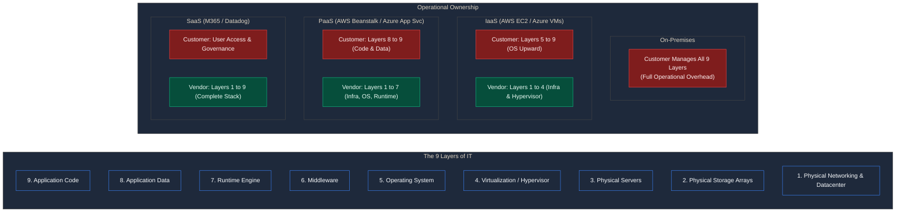
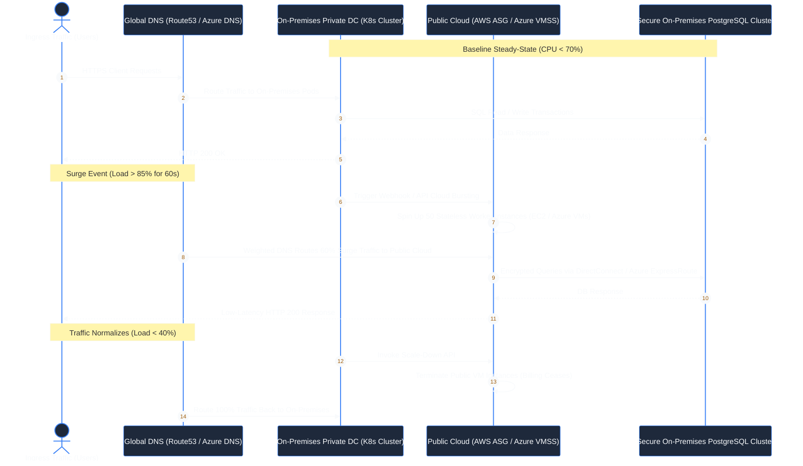

# Contact Session 1: Cloud Computing Foundations, Architecture & Service Models

**Course:** Cloud Computing (CCZG527 / CSIZG527 / SEZG527 / SSZG527 - BITS Pilani WILP)  
**Instructor:** Prof. Arun Vadekkedhil  
**Contact Session / Module:** Contact Session 1: Cloud Foundations, Architecture & Service Models  
**Core Theme:** Cloud computing is the convergence of distributed systems paradigms into an on-demand, software-defined utility—abstracting physical silicon through virtualization, governed by the NIST 3-4-5 framework, dividing operational ownership via the Shared Responsibility Model, and implemented across industry clouds (**AWS $\leftrightarrow$ Azure**).

---

## 1. Executive Overview & Problem Context (The 2-Minute Story)

### The 2-Minute Story: The $4 Million Idle Silicon Problem
Imagine it is November 2004. An enterprise e-commerce platform is prepping for the annual holiday shopping rush. To ensure the site does not collapse under peak traffic, the infrastructure team spends $4.2 million on 120 high-density dual-socket rack servers, twin enterprise SAN storage arrays, and redundant core switches. The procurement cycle—from vendor quotes and CFO approvals to shipping, rack-mounting, cabling, OS installation, and network configuration—takes 14 agonizing weeks.

On Cyber Monday, the site survives. But by January 15th, traffic plummets by 85%. For the next ten months, 90% of those multi-million-dollar processors idle at 8% CPU utilization—silently burning datacenter real estate rent, power, and HVAC cooling. To make matters worse, six months later, a junior engineer deploys an untested analytics script on a production database host; an unhandled memory leak triggers the Linux Out-Of-Memory (OOM) Killer, terminating the primary database process and causing a four-hour global site outage.

This was the brutal reality of bare-metal enterprise computing: **hardware was rigidly coupled 1:1 with software**, capacity had to be over-provisioned for worst-case peaks, provisioning took months, and physical server crashes had a devastating blast radius. 

Cloud computing was engineered not as an academic exercise, but to solve these exact existential production failures. By introducing software-defined abstraction and virtualization, compute became an on-demand utility: instantly provisionable via APIs, elastically scalable, and resilient to underlying physical failures across hyperscalers like **Amazon Web Services (AWS)** and **Microsoft Azure**.

```
[1990s - 2000s Bare-Metal Era]                  [Modern Cloud Era: AWS & Azure]
Rigid 1:1 Hardware-to-OS Coupling           Programmable, Virtualized Multi-Tenancy
14-Week Hardware Procurement Lead Time  ───► API-Driven Spin-Up in Seconds (EC2 / Azure VMs)
Sized for Peak (10-15% Avg Utilization)       Dynamic Elasticity: Scale Out / Scale In (ASG / VMSS)
Capital Expense (CapEx) Heavy                 Operational Expense (OpEx) Utility Billing
Single Host Failure = Production Outage        Disposable Compute & Decoupled Storage (EBS / Disks)
```

### The Core Problem / Pre-Cloud Bottlenecks
1. **Dismal Server Underutilization:** Bare-metal servers ran at an average CPU utilization of only **10% to 15%**. Because operating systems lacked process-level sandboxing, organizations were forced to isolate each workload onto a dedicated physical machine (one server for Apache web, one for PostgreSQL, one for payroll) to prevent dependency conflicts and kernel panics.
2. **Crushing Capital Expenditure (CapEx):** Sizing infrastructure for peak theoretical loads meant spending millions upfront on hardware that sat idle 90% of the year.
3. **Provisioning Latency:** Acquiring physical servers required weeks of enterprise ticketing, hardware delivery, cabling, and manual OS hardening before a single line of application code could execute.
4. **Hardware Failure Coupling:** When a server motherboard or local disk died, the application running on it died immediately. Recovery meant acquiring identical hardware and restoring from tape backups over days.

### The Architectural Solution
Cloud computing resolves these constraints by introducing two foundational mechanisms:
- **Abstraction:** Hides the underlying physical machines, cables, storage fabrics, and datacenter locations behind uniform REST APIs and programmable control planes (e.g., AWS CloudFormation / Azure Resource Manager).
- **Virtualization:** Decouples the operating system and application from physical silicon, multiplexing multiple isolated virtual machines (VMs) onto shared hardware clusters.
- **Shift from CapEx to OpEx:** Replaces massive upfront capital expenditures with metered, pay-as-you-go operational expenses. Infrastructure transitions into software defined by code (IaC via Terraform, Bicep, or CloudFormation).

### Course Roadmap Placement
This opening session establishes the baseline architecture for the entire BITS Pilani Cloud Computing curriculum:
- **Session 1 (This Lecture):** Cloud Foundations, NIST SP 800-145 Framework, Service Models (IaaS/PaaS/SaaS), Deployment Models, and the Shared Responsibility Model.
- **Sessions 2 & 3:** Virtualization Foundations, Hypervisors (Type-1 vs Type-2), 4 Invariant Properties, and Hands-on VirtualBox/Linux Orchestration.
- **Session 4:** Hypervisor Kernel Architectures (Monolithic vs Microkernel), Levels of Virtualization, 5-Layer IaaS Stack, and Cloud IAM.
- **Session 5 & Beyond:** Production IaaS Deep Dive (Compute: EC2 $\leftrightarrow$ Azure VMs, Networking: VPC $\leftrightarrow$ VNet, Storage: S3/EBS/EFS $\leftrightarrow$ Azure Blob/Disks/Files, and Hyperscale Case Studies).

---

## 2. Core Concepts Explained Simply (with Tech Quick-Primers)

### 2.1 What is Cloud Computing? (The Utility & Abstraction Reality) `[Slide 6, 10, 16 | Transcript ~01:00:30 - ~01:09:40]`
- **What is it? (Intuition First):** Stripped of vendor marketing buzzwords, cloud computing is simply **borrowing someone else's physical computing infrastructure over a high-speed network, provisioned programmatically via APIs, and paid for on a metered utility basis**.
- **Formal Definition (NIST SP 800-145):** A model for enabling ubiquitous, convenient, on-demand network access to a shared pool of configurable computing resources (e.g., networks, servers, storage, applications, and services) that can be rapidly provisioned and released with minimal management effort or service provider interaction.
- **How It Works (Under the Hood):**
  1. Hyperscale providers (**AWS**, **Microsoft Azure**, **GCP**) construct global datacenters packed with high-density server racks, petabyte-scale storage arrays, and redundant spine-leaf network fabrics.
  2. Software virtualization layers (bare-metal hypervisors) partition physical CPUs, memory, and storage into isolated virtual units.
  3. A distributed Control Plane exposes secure REST APIs. When you invoke `POST /instances` in AWS, deploy an ARM template in Azure, or run `terraform apply`, the cloud orchestrator validates credentials, schedules placement on an underutilized physical node, creates virtual network interfaces, attaches block storage, and boots the OS in seconds.
  4. Telemetry daemons meter resource consumption by the millisecond and gigabyte-hour, feeding the billing engine.
- **Production Systems Grounding (The Wall Socket Analogy - 10% Rule):**
  Think of public utilities. When you plug a server power supply into a standard wall electrical socket, you do not build a hydroelectric dam, string high-voltage transmission lines, or inspect substation transformers. You consume standard voltage, draw current on demand, and pay the electric utility per kilowatt-hour. Cloud computing operates on the exact same utility model for compute, memory, and storage.
- > 💡 **Tech Quick-Primer (`Terraform`):** An open-source Infrastructure as Code (IaC) tool by HashiCorp that lets engineers declare cloud infrastructure (AWS EC2, Azure VMs, VNets, IAM) in uniform `.tf` files across both AWS and Azure.
- **Key Boundaries & Distinctions (The Dilbert Anti-Pattern):**
  - *Hosting vs Cloud:* Running a server in an outsourced datacenter (co-location) is not cloud computing. If provisioning requires raising a human ticket, or billing is a flat monthly rack fee without dynamic elasticity, it is traditional hosting.
  - *Tooling vs Architecture:* Slide 6 highlights a classic Dilbert comic: a manager assumes that lifting a broken, monolithic codebase and placing it inside an AWS EC2 instance or Azure VM automatically makes it resilient and scalable. Cloud infrastructure only provides agility when the application is designed to be stateless and horizontally scalable.
- 🔍 **Visual Reference:** *See Slide 6 & 10 for the "Cloud Computing Explained" graphic. Notice how traditional IT requires managing physical floor space, power, cooling, and hardware maintenance, while cloud abstracts these into software APIs.*

---

### 2.2 The Two Founding Pillars: Abstraction & Virtualization `[Slide 17 | Transcript ~00:14:20, ~01:10:20 - ~01:17:20]`
- **What is it? (Intuition First):** Cloud computing rests upon two foundational pillars. Without them, the cloud is nothing more than expensive server leasing:
  - **Abstraction:** The architectural discipline of hiding physical implementation details, server hardware specifications, and geographical locations behind simplified, uniform interfaces.
  - **Virtualization:** The enabling technology that decouples physical hardware silicon from the operating system, allowing multiple logically isolated operating systems to share the same physical server.
- **Dual-Cloud Rosetta Stone Mapping:**
  - In **AWS**: The abstraction layer exposes endpoints like `s3.amazonaws.com` or EC2 APIs; the virtualization engine is KVM / the **AWS Nitro System**.
  - In **Azure**: The abstraction layer exposes Azure Resource Manager (ARM) endpoints like `management.azure.com`; the virtualization engine is **Microsoft Hyper-V** running custom hardened Linux/Windows root partitions.
- **How It Works (Under the Hood):**
  1. The physical hardware runs a Virtual Machine Monitor (VMM) or hypervisor.
  2. The hypervisor presents virtual hardware abstractions (vCPUs, virtual RAM, virtual NICs, virtual SCSI controllers) to guest operating systems.
  3. The Guest OS (Linux, Windows) executes without knowing that its "hardware" is a software construct multiplexed across physical cores alongside other tenants.
  4. If a physical hardware node requires maintenance, the hypervisor live-migrates the active memory and CPU state of running VMs across the network to a healthy host with zero workload downtime (**AWS Live Migration** $\leftrightarrow$ **Azure Service Healing / Live Migration**).
- **Production Systems Grounding:**
  In bare-metal infrastructure, a server failure is a critical incident requiring hardware replacement and days of recovery. In a virtualized cloud architecture, compute instances are treated as **ephemeral, disposable resources**. A crashed instance is terminated programmatically, a replacement VM is launched in 30 seconds via an Auto Scaling Group (AWS) or Virtual Machine Scale Set (Azure), and its persistent network storage (**Amazon EBS** $\leftrightarrow$ **Azure Managed Disk**) is re-attached instantly.
- > 💡 **Tech Quick-Primer (`Docker`):** An OS-level containerization runtime that packages an application and its dependencies into a lightweight image, sharing the host OS kernel via Linux namespaces and cgroups to boot in milliseconds.
- 🔍 **Visual Reference:** *See Slide 17 ("Terms to Remember"). Note the explicit definitions: Abstraction hides physical locations; Virtualization enables multi-tenant resource pooling.*

---

### 2.3 Computing Evolution: Mainframe to Cloud `[Slide 12–15 | Transcript ~01:06:20 - ~01:08:50]`
- **What is it? (Intuition First):** Cloud computing is the culmination of four decades of distributed systems evolution, driven by the need to balance computational efficiency, cost, and developer velocity.
- **The Evolution Timeline (Slide 13):**
  1. **Mainframes (1960s–1970s):** Highly centralized monolithic systems accessed via dumb terminals. Extreme hardware reliability, but rigid, astronomical in cost, and single-vendor locked (IBM).
  2. **Personal Desktop Computing (1980s):** Compute shifted to individual desktop PCs. Highly decentralized, but created fragmented data silos with zero centralized backup.
  3. **Client-Server Architecture (1990s):** Desktop clients sent RPC/SQL queries over LANs to departmental backend servers. Introduced modularity, but suffered from network bottlenecks and server sprawl.
  4. **Cluster Computing:** Interconnected independent commodity computers working together over high-speed local networks to act as a single unified parallel compute engine.
  5. **Grid Computing:** Geographically dispersed, heterogeneous computing nodes federated across WANs to solve massive batch computational tasks (e.g., SETI@home, CERN Large Hadron Collider data analysis).
  6. **Cloud Computing (2006–Present):** Homogeneous, virtualized datacenters delivering compute, storage, and networking as an on-demand, multi-tenant utility via standardized web APIs across AWS, Azure, and GCP.
- **Cloud vs Grid vs Cluster (The Production Distinction):**
  - *Cluster:* Homogeneous nodes, tightly coupled via low-latency InfiniBand networks, sharing a common filesystem, dedicated to a single organization.
  - *Grid:* Heterogeneous nodes, loosely coupled across administrative domains, running non-interactive batch workloads.
  - *Cloud:* Virtualized homogeneous infrastructure, elastic multi-tenancy, service-level agreements (SLAs), running interactive web services, real-time APIs, and databases.
- 🔍 **Visual Reference:** *See Slide 13 & 14 for the historical computing paradigms flowchart.*

---

### 2.4 NIST SP 800-145: The 5 Essential Characteristics `[Slide 18, 19, 20 | Transcript ~00:13:00 - ~00:20:00]`
The National Institute of Standards and Technology (NIST) Special Publication 800-145 defines the canonical benchmark for cloud systems. If any single characteristic is absent, the system is not true cloud computing.

```text
┌──────────────────────────────────────────────────────────────────┐
│             NIST SP 800-145: 5 ESSENTIAL CHARACTERISTICS        │
├──────────────────┬──────────────────┬────────────────────────────┤
│ 1. On-Demand     │ 2. Broad Network │ 3. Resource Pooling        │
│    Self-Service  │    Access        │    (Multi-Tenancy)         │
├──────────────────┴──────────────────┼────────────────────────────┤
│ 4. Rapid Elasticity                 │ 5. Measured Service        │
│    (Auto-Scale Out/In)              │    (Pay-per-Second/GB-hr)  │
└─────────────────────────────────────┴────────────────────────────┘
```

1. **On-Demand Self-Service `[Slide 20]`:**
   - *Mechanism:* Engineers provision compute, storage, and networking unilaterally via web consoles, CLIs, or APIs without human intervention from the cloud vendor.
   - *Dual-Cloud Equivalents:* Running `aws ec2 run-instances` in AWS or `az vm create` in Azure launches a Linux VM immediately without filing a support ticket.
2. **Broad Network Access `[Slide 20]`:**
   - *Mechanism:* Capabilities are available over standard network protocols (HTTPS/gRPC) and accessible from heterogeneous clients (workstations, mobile devices, IoT gateways).
3. **Resource Pooling `[Slide 20]`:**
   - *Mechanism:* The provider's computing resources are pooled to serve multiple consumers using a multi-tenant model. Physical and virtual resources are dynamically assigned and reassigned according to consumer demand.
   - *Location Transparency:* The customer generally has no control or knowledge over the exact physical location of hardware (rack ID, motherboard slot), but can specify location at a higher level of abstraction (**AWS Region & AZ** $\leftrightarrow$ **Azure Region & Availability Zone**).
4. **Rapid Elasticity `[Slide 20]`:**
   - *Mechanism:* Capabilities can be elastically provisioned and released—automatically in response to metrics—to scale rapidly outward and inward commensurate with demand.
   - *Production Example:* An **AWS Auto Scaling Group** or **Azure Virtual Machine Scale Set (VMSS)** spinning up 50 additional worker instances when incoming request queue depth exceeds 500 requests per node.
5. **Measured Service `[Slide 20]`:**
   - *Mechanism:* Resource usage is monitored, controlled, and reported transparently. Metering systems record CPU-seconds, RAM gigabyte-hours, and network egress bytes.
   - *Dual-Cloud Equivalents:* **AWS CloudWatch & Cost Explorer** $\leftrightarrow$ **Azure Monitor & Microsoft Cost Management** generating itemized billing based on exact execution runtime.

---

### 2.5 NIST 3 Service Models: IaaS, PaaS, SaaS `[Slide 21–28 | Transcript ~00:55:00 - ~01:38:00]`
Cloud computing delivers capabilities across three primary service models, trading off **architectural control** against **management convenience**:

```
▲ Higher Abstraction (Maximum Convenience, Lowest Control)
│   SaaS (Software as a Service)   --> Salesforce, Microsoft 365, Datadog
│   PaaS (Platform as a Service)   --> AWS Elastic Beanstalk, Azure App Service, Heroku
│   IaaS (Infrastructure as a Service) --> AWS EC2, Azure Virtual Machines, GCP Compute Engine
▼ Lower Abstraction (Maximum Control, Highest Management Overhead)
```

#### 1. Infrastructure as a Service (IaaS) `[Slide 21–23]`
- **What is it?:** Raw virtualized hardware infrastructure—compute cores, storage volumes, and network switches.
- **What You Manage:** Guest Operating System (patching, hardening), middleware, language runtimes, databases, security firewall rules, and application code.
- **Dual-Cloud Mapping:** **AWS EC2** $\leftrightarrow$ **Azure Virtual Machines (VMs)**.
- **When to Use:** Legacy workloads, specialized database engines, or systems requiring custom Linux kernel modules.

#### 2. Platform as a Service (PaaS) `[Slide 24–26]`
- **What is it?:** A fully managed development and deployment environment. The cloud provider manages the server hardware, hypervisor, OS, patching, and language runtime.
- **What You Manage:** Application source code and database configurations.
- **Dual-Cloud Mapping:** **AWS Elastic Beanstalk** $\leftrightarrow$ **Azure App Service**.
- **The PaaS Trade-off:** High developer velocity, but strict architectural guardrails. If your microservice requires a custom kernel module or unsupported network protocol, PaaS cannot support it.

#### 3. Software as a Service (SaaS) `[Slide 27–28]`
- **What is it?:** A completed, fully functional software application hosted centrally and delivered over the web on a subscription basis.
- **What You Manage:** User permissions, data access controls, and organization settings.
- **Dual-Cloud Mapping:** **Salesforce, Google Workspace** $\leftrightarrow$ **Microsoft 365, Datadog**.

> 💡 **Tech Quick-Primer (`Envoy`):** An open-source, high-performance L7 edge and service proxy designed for cloud-native architectures, commonly deployed as a sidecar proxy in Kubernetes service meshes (AWS App Mesh / Azure Service Mesh) to handle dynamic service discovery, TLS termination, and traffic routing.

---

### 2.6 NIST 4 Deployment Models `[Slide 31–36 | Transcript ~01:25:00 - ~01:36:00]`

1. **Public Cloud `[Slide 33]`:**
   - Infrastructure is owned and operated by a commercial third-party CSP (**AWS, Microsoft Azure, Google Cloud**) and shared among multiple unaffiliated tenant organizations over the public Internet.
   - *Pros:* Zero CapEx, near-infinite scale, zero facility maintenance.
   - *Cons:* Multi-tenant noisy neighbor risks, strict data egress fees.
2. **Private Cloud `[Slide 34]`:**
   - Infrastructure is provisioned for exclusive use by a single organization comprising multiple business units. It may be owned, managed, and operated by the organization, a third party, or a combination, located on-premises or off-premises.
   - *Technology Stack:* OpenStack, VMware vSphere, **Azure Stack Hub**, Red Hat OpenShift on bare-metal.
   - *When Mandatory:* Defense systems, banking core ledgers with strict data sovereignty laws.
3. **Hybrid Cloud & Cloud Bursting `[Slide 35]`:**
   - Composed of two or more distinct cloud infrastructures (private and public) that remain unique entities, bound together by standardized or proprietary technology that enables data and application portability.
   - **Dedicated Interconnects:** **AWS Direct Connect** $\leftrightarrow$ **Azure ExpressRoute** (dedicated private fiber bypassing public Internet).
   - **Cloud Bursting Architecture:** Baseline, predictable application traffic runs on cost-efficient on-premises private infrastructure. When traffic surges exceed 80% capacity (e.g., during Black Friday or tax filing deadlines), stateless web tier instances dynamically spin up in the public cloud (AWS EC2 / Azure VMs), absorb the surge, and terminate when traffic normalizes.
4. **Community Cloud `[Slide 36]`:**
   - Provisioned for exclusive use by a specific community of consumers from organizations that have shared concerns (mission, security requirements, compliance mandates).
   - *Example:* Multiple healthcare research institutions collaborating on HIPAA-compliant genomic data modeling on dedicated government/community cloud partitions (**AWS GovCloud** $\leftrightarrow$ **Azure Government**).

> 💡 **Tech Quick-Primer (`Azure ExpressRoute`):** A dedicated, private high-speed fiber-optic network connection linking an enterprise on-premises datacenter directly to Microsoft Azure, bypassing the public Internet to deliver deterministic sub-5ms latency (AWS equivalent: **AWS Direct Connect**).

---

### 2.7 The Shared Responsibility Model: The 9-Layer Stack `[Slide 30 | Transcript ~01:20:00 - ~01:25:00]`
A critical operational reality emphasized by Prof. Arun: **Security and operational governance in the cloud are always shared between the Cloud Service Provider and the Customer**.

The 9 architectural layers of IT delineate this boundary:
1. Physical Facilities & Power
2. Physical Network Infrastructure
3. Physical Server Hardware
4. Virtualization / Hypervisor Layer
5. Operating System
6. Middleware
7. Runtime Environment
8. Application Data
9. Application Code & Logic

```
┌─────────────────────────┬──────────────┬──────────────┬──────────────┬──────────────┐
│ Architectural Layer     │  On-Premise  │     IaaS     │     PaaS     │     SaaS     │
├─────────────────────────┼──────────────┼──────────────┼──────────────┼──────────────┤
│ 9. Applications         │   CUSTOMER   │   CUSTOMER   │   CUSTOMER   │    VENDOR    │
│ 8. Data                 │   CUSTOMER   │   CUSTOMER   │   CUSTOMER   │   CUSTOMER*  │
│ 7. Runtime              │   CUSTOMER   │   CUSTOMER   │    VENDOR    │    VENDOR    │
│ 6. Middleware           │   CUSTOMER   │   CUSTOMER   │    VENDOR    │    VENDOR    │
│ 5. Operating System     │   CUSTOMER   │   CUSTOMER   │    VENDOR    │    VENDOR    │
│ 4. Virtualization       │   CUSTOMER   │    VENDOR    │    VENDOR    │    VENDOR    │
│ 3. Physical Servers     │   CUSTOMER   │    VENDOR    │    VENDOR    │    VENDOR    │
│ 2. Physical Storage     │   CUSTOMER   │    VENDOR    │    VENDOR    │    VENDOR    │
│ 1. Physical Networking  │   CUSTOMER   │    VENDOR    │    VENDOR    │    VENDOR    │
└─────────────────────────┴──────────────┴──────────────┴──────────────┴──────────────┘
(* In SaaS, customer owns data governance, identity policies, and access control)
```

> 💡 **Tech Quick-Primer (`Kubernetes`):** An open-source container orchestration engine that automates deployment, scaling, and operational lifecycle management of containerized workloads across compute clusters (managed in cloud as **AWS EKS** $\leftrightarrow$ **Azure AKS**).

---

## 3. Visual Architectural / System Models

### Model 1: The NIST SP 800-145 Cloud Architectural Taxonomy
*This dark-mode visual synthesizes Slide 19 and Slide 42, illustrating the structural relationship between NIST characteristics, service models, and deployment scopes across AWS and Azure ecosystems.*

```mermaid
%%{init: {'theme': 'base', 'themeVariables': { 'darkMode': true, 'background': '#0f172a', 'primaryColor': '#1e293b', 'primaryTextColor': '#f8fafc', 'primaryBorderColor': '#3b82f6', 'lineColor': '#60a5fa', 'secondaryColor': '#334155', 'tertiaryColor': '#1e293b' }}}%%
graph TB
    subgraph Core["NIST SP 800-145 Architectural Framework"]
        subgraph TopLayer["4 Deployment Models (Where Workloads Live)"]
            Pub["Public Cloud<br/>(AWS / Azure / GCP)"]
            Priv["Private Cloud<br/>(OpenStack / Azure Stack)"]
            Hyb["Hybrid Cloud<br/>(On-Prem + AWS/Azure Burst)"]
            Comm["Community Cloud<br/>(AWS GovCloud / Azure Govt)"]
        end

        subgraph MidLayer["3 Service Models (What Capabilities are Delivered)"]
            SaaS["SaaS: Software as a Service<br/>(Microsoft 365, Salesforce, Datadog)"]
            PaaS["PaaS: Platform as a Service<br/>(AWS Elastic Beanstalk / Azure App Service)"]
            IaaS["IaaS: Infrastructure as a Service<br/>(AWS EC2 / Azure Virtual Machines)"]
        end

        subgraph BaseLayer["5 Essential Characteristics (The Non-Negotiable Foundations)"]
            C1["1. On-Demand Self-Service"]
            C2["2. Broad Network Access"]
            C3["3. Resource Pooling (Multi-Tenancy)"]
            C4["4. Rapid Elasticity (Auto-Scale)"]
            C5["5. Measured Service (Telemetry & Billing)"]
        end
    end

    BaseLayer --> MidLayer
    MidLayer --> TopLayer

    style Pub fill:#1e293b,stroke:#3b82f6,color:#f8fafc
    style Priv fill:#1e293b,stroke:#3b82f6,color:#f8fafc
    style Hyb fill:#1e293b,stroke:#10b981,color:#f8fafc
    style Comm fill:#1e293b,stroke:#3b82f6,color:#f8fafc

    style SaaS fill:#1e293b,stroke:#8b5cf6,color:#f8fafc
    style PaaS fill:#1e293b,stroke:#8b5cf6,color:#f8fafc
    style IaaS fill:#1e293b,stroke:#8b5cf6,color:#f8fafc

    style C1 fill:#0f172a,stroke:#64748b,color:#cbd5e1
    style C2 fill:#0f172a,stroke:#64748b,color:#cbd5e1
    style C3 fill:#0f172a,stroke:#64748b,color:#cbd5e1
    style C4 fill:#0f172a,stroke:#64748b,color:#cbd5e1
    style C5 fill:#0f172a,stroke:#64748b,color:#cbd5e1
```



#### Diagram Walkthrough:
1. **The Foundation (Essential Characteristics):** The five essential characteristics form the non-negotiable operational base. If a platform lacks rapid elasticity or resource pooling, it is not cloud computing.
2. **The Functional Delivery (Service Models):** The three service models stack hierarchically. IaaS provides raw virtual compute, PaaS layers managed runtimes on top of IaaS, and SaaS delivers finished software on top of PaaS/IaaS.
3. **The Deployment Perimeter:** Workloads in any service model can be provisioned across any of the four deployment boundaries depending on data privacy, compliance, and cost constraints.
- **Slide Alignment:** Synthesizes Slide 19 ("The NIST Definition") and Slide 42.

---

### Model 2: The 9-Layer Shared Responsibility Demarcation Matrix
*This schematic visualizes the customer vs provider demarcation boundary across On-Premise, IaaS, PaaS, and SaaS based on Slide 30.*



#### Diagram Walkthrough:
- **Red Nodes (Customer Responsibility):** Layers where the customer is strictly responsible for patching, hardening, vulnerability management, and data backups.
- **Green Nodes (Vendor Responsibility):** Layers managed and secured by the cloud service provider under SLA guarantees.
- **The Demarcation Shift:** As you transition from IaaS to PaaS to SaaS, operational overhead shifts from customer to vendor, but fine-grained control decreases proportionally.
- **Slide Alignment:** Reconstructs the 9-layer architectural graphic from Slide 30 ("Who Manages the AAS-es?").

---

### Model 3: Hybrid Cloud Architecture & Dual-Cloud Bursting Flow
*This sequence model details the network flow and automated scaling mechanics of a hybrid cloud bursting event based on Slide 35.*



#### Diagram Walkthrough:
1. **Steady-State:** The on-premises private datacenter processes steady daily loads, avoiding public cloud compute and egress costs.
2. **Surge Detection:** Telemetry monitors detect that on-premises CPU utilization has crossed the 85% safety threshold.
3. **API-Driven Bursting:** An automated orchestrator triggers an API call spinning up stateless worker nodes in AWS (`Auto Scaling Groups`) or Azure (`Virtual Machine Scale Sets`).
4. **Secure Data Interconnect:** Public cloud nodes communicate with the core on-premises database via dedicated low-latency fiber (**AWS Direct Connect** $\leftrightarrow$ **Azure ExpressRoute**) or encrypted IPSec VPN tunnels.
5. **Cost Teardown:** Once traffic subsides, public instances terminate immediately, ending per-second metered billing.
- **Slide Alignment:** Visualizes the hybrid scaling architecture outlined in Slide 35 ("Hybrid Cloud").

---

## 4. Key Trade-Offs & Comparisons

### 4.1 The Cloud Architect's Rosetta Stone (AWS $\leftrightarrow$ Azure Mapping)

| Domain | Architectural Concept | AWS Implementation (Slide Context) | Azure Equivalent (Practitioner Context) |
| :--- | :--- | :--- | :--- |
| **IaaS Compute** | Raw Virtual Machines | **Amazon EC2** | **Azure Virtual Machines (VMs)** |
| **PaaS Runtime** | Managed App Platform | **AWS Elastic Beanstalk** | **Azure App Service** |
| **Elastic Scaling** | Auto-scaling fleet | **Auto Scaling Groups (ASG)** | **Virtual Machine Scale Sets (VMSS)** |
| **Hybrid Private Fiber**| Dedicated connection | **AWS Direct Connect** | **Azure ExpressRoute** |
| **Hybrid VPN** | Encrypted tunnel | **AWS Site-to-Site VPN** | **Azure VPN Gateway** |
| **DNS Routing** | Global traffic manager | **Amazon Route 53** | **Azure DNS / Azure Traffic Manager** |
| **Telemetry & Alerts** | Metrics & monitoring | **Amazon CloudWatch** | **Azure Monitor & Log Analytics** |
| **Cost Governance** | Metered billing tracking | **AWS Cost Explorer & Budgets** | **Microsoft Cost Management** |

---

### 4.2 Comprehensive Comparison: Cloud Service Models

| Comparison Dimension | Infrastructure as a Service (IaaS) | Platform as a Service (PaaS) | Software as a Service (SaaS) |
| :--- | :--- | :--- | :--- |
| **Target Persona** | Systems Architects, DevOps, SREs | Software Developers, Data Engineers | End Users, Business Analysts |
| **What You Deploy** | VM Images, Disks, VPC/VNet Subnets | Application Source Code, Container Images | Ready-to-Use Web Applications |
| **OS Kernel & Network Control** | **Full Control** (Custom kernels, iptables) | **No Control** (Managed runtime sandbox) | **Zero Control** (Completely abstracted) |
| **Developer Velocity** | Low (Must configure OS, runtime, tooling) | **High** (Direct git-push to production) | Maximum (Instant feature consumption) |
| **Architectural Flexibility** | **Maximum** (Install any custom binary or DB) | Moderate (Constrained to vendor runtimes) | Lowest (Limited to exposed tenant UI) |
| **OS & Security Patching** | **Customer** patches OS and packages | **Vendor** patches OS, runtimes, and libraries | **Vendor** patches entire application stack |
| **Vendor Lock-In Risk** | Low (Standard Linux images are portable) | High (Proprietary platform APIs & runtimes) | High (Data export & migration friction) |
| **Representative Production Tech**| AWS EC2, Azure VMs, Google Compute Engine | AWS Elastic Beanstalk, Azure App Service | Microsoft 365, Salesforce, Datadog |

---

### 4.3 Comprehensive Comparison: Cloud Deployment Models

| Dimension | Public Cloud | Private Cloud | Hybrid Cloud | Community Cloud |
| :--- | :--- | :--- | :--- | :--- |
| **Multi-Tenancy** | Multi-tenant shared physical hardware | **Single-tenant** dedicated hardware | Mixed (Dedicated core + shared surge) | Multi-tenant (Restricted consortium) |
| **Financial Model** | 100% OpEx (Pay-as-you-go) | Heavy CapEx + Datacenter OpEx | Balanced (CapEx baseline + OpEx burst) | Shared CapEx & OpEx across members |
| **Elastic Scalability** | **Near-Infinite & Instantaneous** | Bound by physical installed hardware | Highly Elastic (Public cloud handles spikes) | Moderate (Bound by consortium budget) |
| **Security & Isolation** | Hypervisor logical isolation | **Physical and logical isolation** | Tiered (Physical for core data; logical web) | Logical isolation within vetted entities |
| **Regulatory Compliance** | General commercial standards | **Strict Sovereign & Defense Mandates** | Balanced (Sensitive data remains local) | Sector-Specific (HIPAA, FedRAMP) |

---

### 4.4 Production Failure Modes & Anti-Patterns

1. **The "Lift-and-Shift" Anti-Pattern (The Dilbert Lesson):**
   - *Symptom:* Taking an existing stateful, monolithic enterprise application and cloning it directly onto an AWS EC2 instance or Azure VM without refactoring.
   - *Failure Mode:* The monolith cannot scale horizontally. When a traffic surge hits, the single oversized instance crashes from thread exhaustion. Running an oversized VM 24/7 results in cloud bills that are 3x higher than on-premises hosting.
   - *Mitigation:* Decouple the application into stateless microservices behind an Application Load Balancer (ALB) or Azure Application Gateway, extract state into a managed cache (Redis), and implement automated auto-scaling.

2. **The FinOps Unmonitored Billing Shock:**
   - *Symptom:* Developers spin up unreserved, high-memory GPU instances (`p3.8xlarge` in AWS / `NCv3` in Azure) or multi-terabyte persistent disks for testing and leave them running continuously.
   - *Failure Mode:* Unchecked metered billing runs 24/7/365. Cross-region network data egress fees create massive month-end invoice shocks.
   - *Mitigation:* Enforce mandatory resource tagging, implement automated instance shutdowns outside business hours via serverless functions (AWS Lambda / Azure Functions), and set hard billing alerts in AWS Budgets or Microsoft Cost Management.

3. **The Multi-Tenancy "Noisy Neighbor" Bottleneck:**
   - *Symptom:* Multiple tenant VMs share the same physical server chassis in a public cloud.
   - *Failure Mode:* An adjacent tenant initiates a heavy batch MapReduce job, saturating the physical CPU L3 cache and memory bus. Your latency-critical microservice experiences a 400% tail-latency spike.
   - *Mitigation:* Deploy latency-critical workloads on Dedicated Hosts (AWS Dedicated Hosts $\leftrightarrow$ Azure Dedicated Hosts) or use hardware-offloaded instance families (AWS Nitro $\leftrightarrow$ Azure Accelerated Networking).

---

## 5. Professor's Practical Tips & Oral Insights

*(Extracted directly from Prof. Arun Vadekkedhil's spoken classroom transcript)*

### 5.1 Real-World Engineering Insights
- **Economics is the Primary Driver of Cloud Architecture `[Transcript ~01:35:05]`:**
  - Technical elegance is irrelevant if the financial math collapses. Organizations do not migrate to the cloud out of philosophical love for distributed systems; they migrate because of **CapEx elimination and operational velocity**. Conversely, if massive, predictable 24/7 data processing causes public cloud bandwidth egress and compute costs to exceed amortized hardware costs (the Basecamp / 37signals repatriation scenario), businesses will repatriate workloads back to bare-metal datacenters.
- **Why Datacenters are Multiplying, Not Disappearing `[Transcript ~01:12:24 - ~01:13:40]`:**
  - When asked if cloud computing eliminates physical datacenters, Prof. Arun clarifies: *"We are not getting rid of datacenters. Ulta, we are giving birth to more and larger datacenters."* The cloud centralizes compute from thousands of inefficient corporate server closets into gargantuan, hyper-dense regional hyperscale facilities operated by Amazon, Microsoft, and Google.
- **Compute is Ephemeral; Storage is Persistent `[Transcript ~01:15:38 - ~01:17:00]`:**
  - A cloud VM is merely a software configuration file running on a hypervisor. Never store critical production data on the local root drive of a virtual machine. Local VM storage must be treated as disposable. Persistent data must live in decoupled, replicated cloud storage services (**Amazon EBS / S3** $\leftrightarrow$ **Azure Managed Disks / Azure Blob**) so that if a VM experiences a kernel crash, it can be terminated and replaced instantly without data loss.

### 5.2 Common Misconceptions & Traps
- **Trap 1: "Moving to Cloud Means Zero Infrastructure Maintenance" `[Transcript ~01:02:15]`:**
  - Prof. Arun refutes this common belief: *"No, no, that is the wrong definition! In the cloud, we have separate and different headaches."* You no longer replace physical hard drives or fiber cables, but you now have distributed network latency, VPC/VNet routing tables, IAM/RBAC least-privilege security policies, API rate limits, and continuous FinOps optimization to manage.
- **Trap 2: "AI Can Blindly Design Cloud Systems" `[Transcript ~01:21:30 - ~01:23:45]`:**
  - Prof. Arun cautions students against uncritical reliance on generative AI for system design: *"You can dump legacy code into AI, but will you understand what the AI tells you? If you just blindly accept its output, AI becomes lazy and makes subtle architectural errors. You must understand the foundational principles to question and govern AI."*

### 5.3 Student Questions & Classroom Debates
- **Q: Are legacy mainframes migrating to the cloud because they are slow? `[Transcript ~01:17:38 - ~01:20:30]`**
  - **Prof. Arun's Explanation:** No. Mainframes were engineered with extreme hardware-level optimization and COBOL logic that utilized memory with ruthless efficiency; in raw transactional throughput, they remain blisteringly fast. The real reason enterprises migrate away from mainframes is **maintainability and talent scarcity**. The original engineers have retired, spare hardware parts are extinct, and systems cannot integrate with modern REST/gRPC microservices. Systems are modernized for agility and integration, not raw compute speed.
- **Q: Does a Cloud Engineer need deep programming skills in Java or Python? `[Transcript ~00:36:40 - ~00:38:10]`**
  - **Prof. Arun's Explanation:** The cloud platform is like a standard kitchen gas stove. Whether you cook Italian, Indian, or Continental cuisine (Java, Python, C++, Go) does not matter to the stove. The cloud engineer's primary job is understanding how to package the workload into a container, automate its infrastructure via code (Terraform), and ensure it scales and operates reliably under strict security boundaries.

### 5.4 Exam Guidance & BITS Pilani Cautions
- **The Closed-Book vs Open-Book Strategy `[Transcript ~00:03:00, ~00:44:00]`:**
  - *Mid-Semester Exam (Closed-Book, 30%):* Focuses on exact definitions, NIST 3-4-5 taxonomy, layer boundaries, and core theorems. Precision and correct technical keywords are mandatory.
  - *Comprehensive Final Exam (Open-Book, 40%):* Notes and textbooks are permitted. Examiners will **never** ask direct definition questions. Questions present realistic production scenarios (e.g., designing an infrastructure topology for a flash-sale spike, or evaluating why a legacy database should not be containerized as-is).
- **Exam Bridge Callout (AWS vs Azure):**
  > ⚠️ **Exam Keyword Warning:** In the Mid-Sem Exam, always use the exact **AWS terms** from the professor's slides (**Amazon EC2, Amazon S3, AWS Direct Connect**) for scoring rubrics, while applying your Azure architectural understanding for the underlying reasoning.

---

## 6. Exam-Ready Question Bank

### Part A: Conceptual & Short-Answer Questions (Mid-Sem Closed-Book: 2–3 Marks Each)

#### Q1: Enumerate the 5 Essential Characteristics of Cloud Computing according to NIST SP 800-145 and define Resource Pooling.
**Model Answer:**  
The 5 Essential Characteristics are:
1. **On-Demand Self-Service**
2. **Broad Network Access**
3. **Resource Pooling**
4. **Rapid Elasticity**
5. **Measured Service**

**Resource Pooling Definition:** The provider's computing resources are pooled to serve multiple consumers using a multi-tenant model, with physical and virtual resources dynamically assigned and reassigned according to consumer demand. It provides **Location Transparency**, meaning the customer generally has no control or knowledge over the exact physical location of resources, but can specify location at a higher abstraction level (e.g., country, AWS Region / Azure Region, or Availability Zone).  
*(Scoring: 1.5 marks for naming the 5 characteristics, 1.5 marks for Resource Pooling & Location Transparency definition - Total: 3 Marks)*

---

#### Q2: Differentiate between Abstraction and Virtualization in cloud systems architecture.
**Model Answer:**  
- **Abstraction** is an architectural design principle that hides low-level physical implementation details, server hardware specifications, storage topologies, and datacenter locations behind simplified, uniform interfaces and APIs (e.g., AWS REST APIs or Azure Resource Manager).
- **Virtualization** is the enabling technology that uses a software layer (hypervisor) to decouple physical hardware into multiple isolated, multi-tenant logical execution environments (Virtual Machines), giving each guest OS the illusion of dedicated physical hardware ownership.  
*(Scoring: 1.5 marks for Abstraction, 1.5 marks for Virtualization - Total: 3 Marks)*

---

#### Q3: In an Infrastructure as a Service (IaaS) deployment, delineate the management boundary between the Cloud Service Provider (CSP) and the Customer under the Shared Responsibility Model.
**Model Answer:**  
- **Cloud Service Provider (CSP) Responsibility:** Securing and maintaining the infrastructure *of* the cloud—physical datacenters, facilities, cooling, physical power, bare-metal server chassis, storage arrays, network switches, and the core virtualization hypervisor layer (Layers 1 to 4).
- **Customer Responsibility:** Securing and maintaining assets *in* the cloud—guest operating system installation, OS security patches, middleware, application runtimes, application code, data encryption (in transit and at rest), firewall rules (Security Groups / NSGs), and Identity & Access Management (Layers 5 to 9).  
*(Scoring: 1.5 marks for CSP scope, 1.5 marks for Customer scope - Total: 3 Marks)*

---

#### Q4: Explain the architectural mechanism of "Cloud Bursting" and identify which NIST deployment model it exemplifies.
**Model Answer:**  
Cloud Bursting is an application deployment pattern within a **Hybrid Cloud** environment. An organization executes its steady-state baseline workloads and hosts sensitive data within its private cloud or on-premises datacenter. When application traffic surges exceed predefined capacity thresholds (e.g., >80% CPU utilization), stateless front-end application instances dynamically and automatically provision in a public cloud (AWS EC2 / Azure VMs) to absorb the excess demand. Once traffic normalizes, public instances terminate to stop metered billing.  
*(Scoring: 1 mark for Hybrid Cloud identification, 2 marks for architectural mechanism - Total: 3 Marks)*

---

### Part B: Scenario-Based, Architectural & Analytical Questions (Comprehensive Open-Book: 5–10 Marks Each)

#### Scenario Question 1 (10 Marks): The E-Commerce Flash Sale Architecture
**Scenario:**  
"RetailFlash Corp." operates an on-premises web application for concert ticket releases. During standard operations, server CPU utilization hovers at 12%. However, during major concert releases, web traffic surges by 3,500% within 90 seconds. In the previous sale, the on-premises database and web servers crashed due to TCP socket exhaustion and memory starvation, causing millions in lost revenue. The executive committee is evaluating two proposals:
- *Proposal A:* Purchase 80 additional physical rack servers and SAN storage arrays for the on-premises datacenter.
- *Proposal B:* Execute a direct lift-and-shift migration of the monolithic web and database application onto a single 128-vCPU cloud virtual machine (AWS EC2 / Azure VM) without modifying the codebase.

As the Principal Cloud Architect, evaluate the fatal flaws of both proposals and design an optimal cloud-native architecture leveraging NIST characteristics, service models, and decoupled components.

**Detailed Model Answer & Scoring Breakdown:**

##### 1. Critique of Proposal A & Proposal B (3 Marks)
- **Flaws in Proposal A (Physical Hardware Expansion):**
  - *Capital Inefficiency (CapEx):* Sizing physical bare metal for a peak that lasts 2 hours per month is economically disastrous. For the remaining 98% of the year, these servers idle at <5% utilization while consuming power, cooling, and rack space.
  - *Provisioning Lead Time:* Physical hardware procurement takes weeks or months; it cannot adapt to sudden, unpredictable demand spikes.
- **Flaws in Proposal B (Monolithic Lift-and-Shift):**
  - *The Dilbert Anti-Pattern:* Simply running a monolithic application on a large cloud VM does not provide elasticity. A single large instance still possesses a single point of failure (SPOF) and will crash under socket exhaustion and thread contention during a 3,500% surge.
  - *Runaway OpEx:* Running an oversized 128-vCPU instance 24/7/365 generates massive cloud bills without providing high-availability fault tolerance.

##### 2. Proposed Cloud Architectural Solution (4 Marks)
- **Decoupled Cloud-Native Architecture:**
  1. **Stateless Web Tier (Rapid Elasticity):** Containerize the front-end web application (Docker) and deploy on an elastic container service (**AWS ECS/EKS** $\leftrightarrow$ **Azure AKS / Container Apps**) behind an Application Load Balancer (ALB / Azure App Gateway). Configure Auto Scaling Policies based on incoming HTTP request rates to scale horizontally from 5 pods to 250 pods within minutes.
  2. **Asynchronous Shock Absorber (Message Queuing):** Place an asynchronous message queue (**AWS SQS / Apache Kafka** $\leftrightarrow$ **Azure Service Bus / Event Hubs**) between the web ticket checkout service and the database transactional engine. When 100,000 users click "Purchase", requests are queued, throttling write traffic to a deterministic rate and protecting the database from locking crashes.
  3. **Managed Database with Read Replicas:** Migrate from a self-hosted database to a managed database (**Amazon Aurora Serverless / RDS PostgreSQL Multi-AZ** $\leftrightarrow$ **Azure Database for PostgreSQL Flexible Server Zone-Redundant**). Deploy auto-scaling Read Replicas to handle read queries (seat searches) while directing reservation writes to the primary writer instance.
  4. **Edge Caching:** Deploy a Content Delivery Network (**Amazon CloudFront** $\leftrightarrow$ **Azure Front Door / CDN**) to cache static assets (HTML/CSS/images) at edge locations, offloading 80%+ of incoming traffic from the compute tier.

##### 3. Trade-off Justification & Failure Mitigation (3 Marks)
- **Cost Efficiency (Pay-As-You-Go):** The organization pays for the massive 250-node compute capacity only for the 2 hours of the flash sale, scaling down to baseline immediately after.
- **High Availability (Multi-AZ):** Distributing container instances across multiple Availability Zones ensures that even if an entire physical datacenter experiences an outage, traffic is automatically rerouted with zero downtime.

##### Scoring Keywords Checklist for Examiners:
- [x] *CapEx vs OpEx trade-off*
- [x] *Stateless horizontal auto-scaling (Scale-Out/Scale-In via ASG / VMSS)*
- [x] *Asynchronous queue shock absorber (SQS/Kafka / Azure Service Bus)*
- [x] *Managed database with Multi-AZ & Read Replicas (Aurora/RDS / Azure Flexible Server)*
- [x] *Edge caching (CloudFront / Azure Front Door)*
- [x] *Single Point of Failure (SPOF) elimination*

---

#### Scenario Question 2 (5 Marks): Healthcare Research Consortium Cloud Model
**Scenario:**  
A consortium of four regional cancer research hospitals wishes to collaborate on an AI-driven oncology imaging analysis platform. The imaging dataset contains sensitive patient diagnostic records subject to strict national healthcare privacy regulations (HIPAA/GDPR). These regulations strictly prohibit patient data from co-mingling on public commercial multi-tenant infrastructure. However, no single hospital possesses the capital budget to construct and operate an independent private datacenter facility.

Evaluate the four NIST cloud deployment models, recommend the most appropriate architecture, and justify your choice across governance, security, and financial dimensions.

**Detailed Model Answer & Scoring Breakdown:**

##### 1. Evaluation of Deployment Models (2 Marks)
- *Public Cloud:* Inviable due to regulatory compliance restrictions regarding public multi-tenancy and data co-mingling risks.
- *Private Cloud:* Financially unviable because no single hospital can absorb the capital expenditure (CapEx) to build and maintain a dedicated private datacenter.
- *Hybrid Cloud:* Adds excessive networking and operational synchronization complexity without resolving the initial capital funding bottleneck for the shared dataset.

##### 2. Recommended Solution: Community Cloud (3 Marks)
- **Justification:**
  - **Shared Governance & Compliance:** A **Community Cloud** (or dedicated compliance enclave like **AWS GovCloud** or **Azure Government**) is purpose-built for organizations sharing common missions, security requirements, and regulatory mandates. The four hospitals establish a joint steering committee to govern data access, HIPAA-compliant encryption standards, and role-based access controls.
  - **Distributed Financial Cost:** The capital expenditure and operational maintenance costs of the dedicated physical infrastructure are split evenly across the four institutions, making the project financially viable.
  - **Cryptographically Isolated Perimeter:** Access is strictly restricted to vetted research personnel across the four participating hospitals via secure private interconnects (**AWS Direct Connect** $\leftrightarrow$ **Azure ExpressRoute**), eliminating public multi-tenant attack vectors while enabling high-speed collaborative model training.

##### Scoring Keywords Checklist:
- [x] *Community Cloud*
- [x] *Consortium shared governance*
- [x] *HIPAA / regulatory data isolation*
- [x] *Shared CapEx/OpEx cost distribution*
- [x] *Restricted access perimeter vs public multi-tenancy*

---

## 7. Quick Revision & 60-Second Exam Recap

### 7.1 Key Terms & Acronym Glossary
- **NIST:** National Institute of Standards and Technology. Publisher of SP 800-145 cloud standard.
- **IaaS:** Infrastructure as a Service. Virtual compute, storage, and networking (**AWS EC2** $\leftrightarrow$ **Azure VMs**).
- **PaaS:** Platform as a Service. Managed execution runtime (**AWS Beanstalk** $\leftrightarrow$ **Azure App Service**).
- **SaaS:** Software as a Service. Completed web application accessed via browser (**Microsoft 365, Datadog**).
- **Multi-Tenancy:** Architecture where multiple customers share physical hardware with logical hypervisor sandboxing.
- **Rapid Elasticity:** Automated scaling outward and inward dynamically with real-time workload fluctuations.
- **Cloud Bursting:** Hybrid pattern where an on-premises datacenter dynamically offloads peak traffic to public cloud.
- **Shared Responsibility Model:** Security division where CSP secures infrastructure *of* the cloud; customer secures data *in* the cloud.
- **CapEx vs OpEx:** Upfront capital expenditure on physical assets converted into pay-as-you-go operational expenses.
- **Location Transparency:** Cloud characteristic where physical hardware location is abstracted away from the consumer.

---

### 7.2 The 5 Golden Rules of Cloud Computing
1. **Cloud is an On-Demand Software-Defined Utility:** Cloud does not eliminate datacenters; it abstracts and pools physical silicon into a programmable, API-driven utility across AWS and Azure.
2. **The Two Foundations are Inviolable:** Cloud computing exists *solely* due to **Abstraction** (hiding physical complexity) and **Virtualization** (multiplexing physical silicon into logical sandboxes).
3. **The NIST 3-4-5 Rule is Mandatory:** A genuine cloud architecture must deliver all **5 Essential Characteristics**, map to one of **3 Service Models**, and deploy across one of **4 Deployment Models**.
4. **Security is Always Shared:** The cloud provider guarantees hypervisor and physical datacenter isolation; you are 100% responsible for guest OS patching, firewall rules, and IAM/RBAC permissions.
5. **Tooling Cannot Fix Bad Architecture:** Lifting a stateful, monolithic application into a cloud VM or Kubernetes cluster does not make it resilient. Scalability requires decoupled, stateless architectures designed for elasticity.

---

### 7.3 60-Second Rapid-Fire Q&A
- **Q: Who manages operating system kernel patching in a PaaS environment?**  
  *A:* The Cloud Service Provider.
- **Q: In which cloud deployment model is physical hardware dedicated strictly to one organization?**  
  *A:* Private Cloud.
- **Q: What is the primary operational penalty of an un-refactored "lift-and-shift" migration?**  
  *A:* Inability to scale elastically, single point of failure risks, and inflated 24/7 compute billing.
- **Q: Can an application be accessible over the web without being a cloud application?**  
  *A:* Yes. Any hosted application is a web app, but it is only a cloud application if it leverages cloud elasticity, multi-tenancy, and managed services.
- **Q: Which layer marks the customer-vendor demarcation line in IaaS?**  
  *A:* Layer 4 (Virtualization / Hypervisor). Customer manages Layer 5 (Operating System) and upward.
