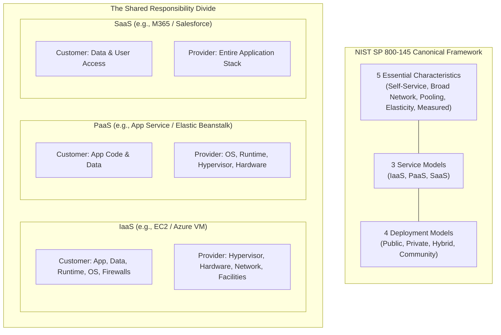

# Lecture 1: Cloud Computing Foundations, Architecture & Service Models

**Course:** Cloud Computing (CCZG527 / CSIZG527 / SEZG527 / SSZG527 - BITS Pilani WILP)  
**Instructor:** Prof. Arun Vadekkedhil  
**Contact Session / Module:** Session 1: Cloud Foundations, Architecture & Service Models  
**Core Theme:** Cloud computing transforms physical silicon into an on-demand, software-defined utility—abstracting hardware through virtualization, structured by the NIST 3-4-5 framework, dividing operational ownership via the Shared Responsibility Model, and implemented across AWS and Azure.

---

## 1. The Big Picture (Why Should I Care?)

- **What is this lecture about?**  
  This lecture introduces the architectural foundation of cloud computing: moving away from physical bare-metal hardware to on-demand, API-driven virtualized infrastructure. It covers the canonical NIST 3-4-5 framework (5 characteristics, 3 service models, 4 deployment models) and the Shared Responsibility Model.
- **The Real-World Problem:**  
  In 2004, an e-commerce platform spent $4.2 million on 120 bare-metal servers and SAN arrays to survive holiday peak shopping. Procurement, cabling, and OS installation took 14 weeks. In January, traffic dropped 85%, leaving millions of dollars of hardware idling at 8% CPU utilization while consuming power and datacenter rent. Cloud computing solves this by turning compute into an elastic, pay-as-you-go software utility.
- **Where this fits in the course:**  
  This is the foundation for the entire course. It establishes cloud service boundaries (IaaS/PaaS/SaaS) before Sessions 2–4 dive deep into virtualization internals, hypervisors (Type-1 vs Type-2), and Session 5 deep-dives into production cloud services (Compute, Storage, Networking).

---

## 2. Core Concepts Explained Simply

### Concept 1: What is Cloud Computing? (The Utility & Abstraction Model)

- **What is it?**  
  Borrowing pooled physical compute, storage, and networking over the internet, provisioned programmatically via APIs, and paid for on a metered utility basis.
- **Why do we need it?**  
  To eliminate long hardware procurement delays, replace high capital expenses (CapEx) with operational expenses (OpEx), and enable applications to scale up or down dynamically based on demand.
- **Dual-Cloud Mapping:**  
  `AWS (Console / CloudFormation / CLI)` $\leftrightarrow$ `Azure (Portal / ARM Templates / Bicep / CLI)`
- **Simple Real-World Example:**  
  Think of public electricity: When you plug a device into a wall electrical socket, you don't build a power plant or string transmission lines. You draw current on demand and pay per kilowatt-hour. Cloud computing provides compute, RAM, and storage on the exact same utility model.
- **Tech Quick-Primer:**
  > 💡 **Tech Quick-Primer (`Terraform`):** An open-source Infrastructure-as-Code (IaC) tool by HashiCorp that allows engineers to declare and provision resources across both AWS and Azure using declarative `.tf` configuration files.
- **Key Distinction / Rule of Thumb:**  
  *Colocation Hosting vs Cloud:* Running a server in a third-party datacenter is hosting, not cloud. It only becomes cloud if it is API-driven, elastic, and self-service.

---

### Concept 2: The Two Founding Pillars: Abstraction & Virtualization

- **What is it?**  
  The two foundational mechanisms enabling modern cloud computing:
  * **Abstraction:** Hiding physical server specs, rack locations, and network cables behind uniform web APIs.
  * **Virtualization:** The technology that decouples the operating system from physical silicon, multiplexing multiple isolated Virtual Machines (VMs) onto shared hardware clusters.
- **Dual-Cloud Mapping:**  
  *Virtualization Engine:* `AWS Nitro System / KVM` $\leftrightarrow$ `Microsoft Hyper-V`
- **Simple Real-World Example:**  
  In bare-metal infrastructure, a server motherboard crash is a multi-hour outage requiring hardware replacement. In a virtualized cloud, VMs are disposable: a crashed instance is terminated, and an Auto Scaling Group launches a new VM in 30 seconds while re-attaching the network storage disk.
- **Tech Quick-Primer:**
  > 💡 **Tech Quick-Primer (`Docker`):** An OS-level containerization runtime that isolates applications sharing the host Linux kernel via cgroups and namespaces, booting in milliseconds.

---

### Concept 3: Computing Evolution: Mainframe to Cloud

- **What is it?**  
  The historical progression of computing models:
  1. **Mainframes (1960s–70s):** Centralized monolithic computers accessed via dumb terminals. Reliable, but rigid and expensive.
  2. **Personal Computers (1980s):** Decentralized computing on desktops. High user autonomy, but created fragmented data silos.
  3. **Client-Server (1990s):** Desktop clients querying backend database servers over LANs. Modularity, but suffered from server sprawl.
  4. **Cluster Computing:** Homogeneous commodity servers tightly coupled via low-latency local networks working on a shared parallel task.
  5. **Grid Computing:** Geographically dispersed, heterogeneous computers federated across the internet for batch compute (e.g., SETI@home).
  6. **Cloud Computing (2006+):** Homogeneous, virtualized datacenters providing pooled compute, storage, and networking as an elastic utility via standard web APIs.
- **Key Distinction / Rule of Thumb:**  
  *Cluster* = tightly coupled, single organization; *Grid* = loosely coupled, heterogeneous batch compute; *Cloud* = virtualized, multi-tenant utility on demand.

---

### Concept 4: The Canonical NIST 3-4-5 Framework (NIST SP 800-145)

All standard cloud architectures are classified into **5 Characteristics**, **3 Service Models**, and **4 Deployment Models**:

#### 1. The 5 Essential Characteristics
1. **On-Demand Self-Service:** Provision compute, storage, and networking automatically via APIs/portal without human cloud-provider intervention.
2. **Broad Network Access:** Capabilities are available over standard networks and accessed through heterogeneous client platforms (laptops, mobile phones, API clients).
3. **Resource Pooling:** The provider's computing resources are pooled in a multi-tenant model, dynamically assigning and reassigning physical resources to multiple consumers.
4. **Rapid Elasticity:** Resources can be elastically provisioned and released—often automatically—to scale rapidly outward or inward with demand.
5. **Measured Service:** Resource usage is monitored, controlled, and reported transparently, providing metered pay-as-you-go billing.

#### 2. The 3 Service Models (SPI Tier: IaaS $\to$ PaaS $\to$ SaaS)
* **IaaS (Infrastructure as a Service):** Provider manages physical silicon, networking, and virtualization; consumer manages OS, runtime, middleware, and applications.
* **PaaS (Platform as a Service):** Provider manages hardware, OS, and runtime (e.g., Node.js, Python); consumer only deploys application code and configurations.
* **SaaS (Software as a Service):** Provider manages the entire stack end-to-end; consumer simply accesses the application through a browser or API.

#### 3. The 4 Deployment Models
* **Public Cloud:** Infrastructure is owned by a cloud provider (AWS/Azure) and shared across multi-tenant organizations over the public internet.
* **Private Cloud:** Infrastructure is provisioned for exclusive use by a single organization (on-premises datacenter or dedicated hosted hardware).
* **Hybrid Cloud:** Composition of distinct public and private cloud infrastructures bound together by standardized networking technology (e.g., AWS Direct Connect / Azure ExpressRoute).
* **Community Cloud:** Infrastructure shared exclusively by organizations with shared missions, regulatory compliance, or security policies (e.g., government agency clouds).

---

### Concept 5: The Shared Responsibility Model

- **What is it?**  
  The formal division of security and operational responsibilities between the cloud provider and the customer:
  * **Security OF the Cloud (Provider Responsibility):** Physical datacenter security, power, cooling, host hardware, hypervisors, and core networking facilities.
  * **Security IN the Cloud (Customer Responsibility):** Customer data, IAM credentials, OS patching (in IaaS), firewall configuration, and application code.
- **Why do we need it?**  
  If a customer leaves an Amazon S3 bucket public or fails to patch an OS vulnerability on an Azure VM, the resulting data breach is 100% the customer's legal fault. The cloud provider's SLA only guarantees underlying hardware availability.
- **Key Rule:** As you move from IaaS $\to$ PaaS $\to$ SaaS, operational responsibility shifts progressively from the customer to the cloud provider.

---

## 3. Visual Architecture Models

### The NIST Framework & The Shared Responsibility Divide

### Diagram Walkthrough:
* **The NIST 3-4-5 Scaffold:** Defines what makes a system a legitimate cloud: 5 non-negotiable characteristics, delivered via 3 service layers, hosted across 4 deployment models.
* **The Responsibility Shift:** In IaaS, the customer manages the operating system and middleware. In PaaS, the provider takes over the OS and runtime. In SaaS, the provider manages the entire stack, leaving only user access and data governance to the customer.

---

## 4. Key Comparisons & Trade-Offs

### NIST Service Models Comparison

| Layer / Aspect | IaaS | PaaS | SaaS |
| :--- | :--- | :--- | :--- |
| **Customer Manages** | OS, Middleware, Runtime, Data, App | Application Code, Data, Config | User Access, Tenant Data |
| **Provider Manages** | Virtualization, Hardware, Datacenter | OS, Runtime, Virtualization, Hardware | Entire Stack (Hardware to App) |
| **AWS Examples** | EC2, EBS, VPC | Elastic Beanstalk, RDS, App Runner | WorkDocs, QuickSight |
| **Azure Examples** | Azure VMs, Managed Disks, VNet | Azure App Service, Azure SQL | Microsoft 365, Dynamics 365 |
| **Level of Control** | Highest | Moderate | Lowest |
| **Operational Overhead**| High (Must patch OS & middleware) | Low (Focus purely on code) | Minimal |

### Dual-Cloud (AWS $\leftrightarrow$ Azure) Rosetta Stone Service Matrix

| Cloud Capability | Amazon Web Services (AWS) | Microsoft Azure | Key Takeaway / Equivalent |
| :--- | :--- | :--- | :--- |
| **Virtual Compute** | Amazon EC2 | Azure Virtual Machines (VMs) | Elastic virtualized server instances |
| **Virtual Network** | Amazon VPC | Azure Virtual Network (VNet) | Isolated software-defined private network |
| **Security Firewall** | Security Groups / NACLs | Network Security Groups (NSGs) | Stateful instance / stateless subnet filters |
| **Block Storage** | Amazon EBS | Azure Managed Disks | Persistent raw block storage for VMs |
| **Object Storage** | Amazon S3 | Azure Blob Storage | Serverless scalable HTTP object storage |
| **Identity & Access** | AWS IAM & STS | Microsoft Entra ID & Azure RBAC | Role-based identity and access control |

---

## 5. Professor's Practical Takeaways & Golden Rules

*(Key insights emphasized by Prof. Arun Vadekkedhil in lecture)*

1. **The Dilbert Anti-Pattern (Moving to Cloud $\neq$ Scalable Architecture):**  
   Simply taking a broken, tightly coupled monolithic application and hosting it on an AWS EC2 instance or Azure VM does not magically make it reliable. Cloud infrastructure provides agility only when applications are engineered to be stateless, decoupled, and horizontally scalable.
2. **Cloud is NOT Always Cheaper:**  
   Cloud computing replaces upfront CapEx with metered OpEx. If you run a static, steady-state workload 24/7/365 without auto-scaling or rightsizing, a public cloud can actually be more expensive than owning hardware. Cloud wins financially on **variable, unpredictable workloads and operational agility**.
3. **The Customer Owns the Data Breach:**  
   Under the Shared Responsibility Model, if an engineer leaves a storage bucket public or forgets to patch an OS security hole on a VM, the cloud provider is legally blameless. The customer owns 100% of data and application security in IaaS.
4. **Colocation is Not Private Cloud:**  
   Renting rack space in a third-party datacenter is hosting. A private cloud must deliver **self-service provisioning, resource pooling, and rapid elasticity** internally via software APIs.

---

## 6. Quick Recap & Terminology Cheatsheet

### Key Terms in 1 Line
* **NIST SP 800-145:** The gold-standard definition of cloud computing based on 5 characteristics, 3 service models, and 4 deployment models.
* **Abstraction:** Hiding physical infrastructure, datacenter locations, and hardware complexity behind software APIs.
* **Virtualization:** Multiplexing multiple isolated virtual operating systems on shared physical silicon via a hypervisor.
* **IaaS:** Infrastructure as a Service; consumer rents virtualized compute, storage, and networking, managing their own OS.
* **PaaS:** Platform as a Service; consumer deploys application code onto a provider-managed runtime and operating system.
* **SaaS:** Software as a Service; end-user consumes complete software applications over the web.
* **Shared Responsibility Model:** The boundary defining security *of* the cloud (provider) vs security *in* the cloud (customer).
* **CapEx vs OpEx:** Capital Expenditure (buying hardware upfront) vs Operational Expenditure (pay-as-you-go metered utility billing).

### 4 Core Mental Rules to Remember
1. **Utility Computing:** Cloud is borrowing pooled infrastructure via APIs and paying like an electric utility bill.
2. **IaaS = You manage OS; PaaS = Provider manages OS; SaaS = Provider manages everything.**
3. **Provider secures the hardware; You secure the data and access credentials.**
4. **Elasticity requires statelessness:** Hardware flexibility is useless if your application code is not designed to scale horizontally.
