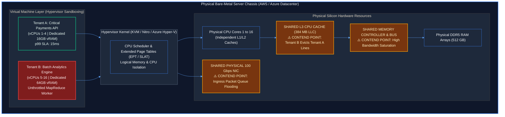
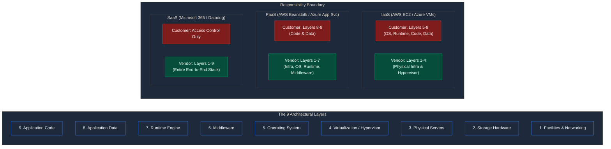
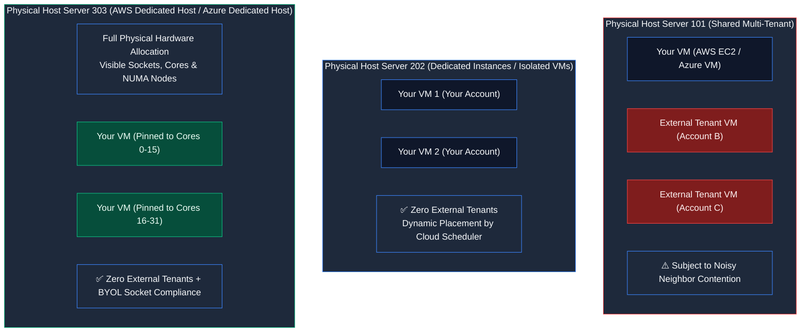

# Contact Session 2: Cloud Computing Service Architecture, Multi-Tenancy & Operational Governance

**Course:** Cloud Computing (CCZG527 / CSIZG527 / SEZG527 / SSZG527 - BITS Pilani WILP)  
**Instructor:** Prof. Arun Vadekkedhil  
**Contact Session / Module:** Contact Session 2: Cloud Service Architecture, Multi-Tenancy & Operational Governance  
**Core Theme:** Deep architectural decomposition of the NIST service and deployment models—examining the economics and physics of multi-tenancy (shared vs dedicated compute), the operational boundaries of IaaS vs PaaS vs SaaS, and the governance mechanisms of the Shared Responsibility Model across **AWS and Azure**.

---

## 1. Executive Overview & Problem Context (The 2-Minute Story)

### The 2-Minute Story: The 3:00 AM P1 Outage & The Invisible Neighbor
At 2:15 PM on a Tuesday, the primary payment gateway for a high-growth fintech startup begins dropping transactions. Automated monitoring fires a critical P1 alert: the p99 latency on the core transaction service has skyrocketed from 12 milliseconds to 480 milliseconds.

The on-call Site Reliability Engineer (SRE) jumps into the production terminal. They inspect the Linux host metrics: CPU utilization is sitting quietly at 24%, memory consumption is stable at 4 GB out of 16 GB, and database connection pools are healthy. The JVM garbage collection logs show zero stop-the-world pauses. From inside the virtual machine, the application appears perfectly healthy, yet customer checkout requests are timing out across the globe.

It takes four hours of high-severity war-room debugging and low-level Linux performance profiling with `perf` to uncover the truth: **the problem is not inside their virtual machine at all**. Their public cloud VM is running on shared physical hardware alongside another tenant—a data analytics startup that just kicked off an unthrottled Apache Spark batch indexing job. The analytics job is flooding the physical processor's shared **L3 CPU cache** with millions of cache misses and saturating the server motherboard's **memory bus bandwidth**. Even though the fintech's VM had dedicated virtual CPUs assigned, every memory access was stalling at the physical silicon layer.

In desperation, a platform engineer suggests migrating the workload to a managed Platform as a Service (PaaS) to let the cloud provider handle scaling. But the deployment instantly crashes on startup: the application relies on a proprietary Linux kernel module (`crypto_accel.ko`) for PCI-DSS hardware acceleration, which the locked-down, multi-tenant PaaS operating system strictly forbids users from inserting into the kernel.

This crisis illustrates the core themes of this lecture: **Multi-tenancy delivers unprecedented cost efficiency, but introduces physical resource contention (the Noisy Neighbor problem); and while higher abstraction models (PaaS) accelerate delivery, they enforce rigid architectural boundaries that cannot support custom low-level system modifications.**

```
[Physical Server Motherboard: AWS & Azure Datacenter Blades]
┌──────────────────────────────────────────────────────────────────────────┐
│ Physical Cores 1-4 (Fintech VM)         Physical Cores 5-16 (Analytics VM)│
│ Core Registers & L1/L2 Caches           Core Registers & L1/L2 Caches    │
├──────────────────────────────────────────────────────────────────────────┤
│ SHARED L3 CPU CACHE ◄─────── CACHE CONTENTION & LINE EVICTION ───────────┤
├──────────────────────────────────────────────────────────────────────────┤
│ SHARED MEMORY BUS (DDR4/DDR5) ◄────── BUS SATURATION & LATENCY SPIKES ───┤
├──────────────────────────────────────────────────────────────────────────┤
│ SHARED PHYSICAL NETWORK INTERFACE CARD (NIC) QUEUES                      │
└──────────────────────────────────────────────────────────────────────────┘
```

### The Core Problem / Pre-Cloud Bottlenecks
1. **The Inflexible Capacity Bottleneck:** Traditional enterprise datacenters forced organizations to provision dedicated physical servers sized for peak theoretical loads. For 10 months of the year, up to 85% of physical silicon sat completely idle, consuming floor space, electrical power, and cooling without generating revenue.
2. **The Multi-Tenancy Dilemma:** Software architectures had to balance isolation against cost. Allocating one physical server per workload provided complete performance isolation but was cost-prohibitive. Running multiple independent enterprise applications on a single shared operating system caused dependency conflicts (DLL hell) and security vulnerabilities.
3. **The Software Packaging & Deployment Chasm:** Deploying enterprise applications on bare metal required manual OS configuration, environment-specific dependency installation, and manual runtime patching, leading to severe environment drift between staging and production.

### The Architectural Solution
Cloud computing resolves these challenges through software-defined resource pooling, standardized service abstractions, and flexible tenancy models across **AWS and Azure**:
- **Dynamic Multi-Tenancy:** Virtualization hypervisors partition physical bare-metal servers into logically isolated virtual slices, allowing multiple independent tenants to run concurrently on shared silicon, driving hardware utilization from 15% to over 80%.
- **Tiered Tenancy Options:** Cloud providers offer flexible execution models: shared multi-tenant instances for standard workloads, and Dedicated Hosts (**AWS Dedicated Hosts** $\leftrightarrow$ **Azure Dedicated Hosts**) for compliance and noisy-neighbor elimination.
- **The 3 Service Tiers (IaaS, PaaS, SaaS):** Standardized abstraction boundaries allow engineering teams to choose their exact balance between operational control and management convenience.

### Course Roadmap Placement
- **Session 1:** Cloud Foundations, NIST SP 800-145 Framework, and Basic Taxonomy.
- **Session 2 (This Lecture):** Service Architecture Deep Dive (IaaS/PaaS/SaaS), Multi-Tenancy Mechanics, Dedicated vs Shared Compute, The Customization Trap, and Shared Responsibility Governance.
- **Session 3:** Virtualization Foundations, Hypervisor Types (Type-1 vs Type-2), Encapsulation, and Hands-on VirtualBox/Linux Orchestration.
- **Session 4 & Beyond:** Hypervisor Kernel Internals (Monolithic vs Microkernel), AWS Global-to-Edge Infrastructure, and Cloud IAM.

---

## 2. Core Concepts Explained Simply (with Tech Quick-Primers)

### 2.1 Multi-Tenancy Mechanics: Shared vs Dedicated Compute `[Slide 4, 19–23 | Transcript ~00:13:00 - ~00:25:00]`
- **What is it? (Intuition First):** Multi-tenancy is the architectural principle of serving multiple independent customers (tenants) from a single shared pool of physical hardware resources, with strict logical isolation enforced by software.
- **Dual-Cloud Rosetta Stone Mapping:**
  - **Shared Multi-Tenant Instances:** **AWS EC2 (Default)** $\leftrightarrow$ **Azure Virtual Machines (Default)**.
  - **Dedicated Instances:** **AWS Dedicated Instances** $\leftrightarrow$ **Azure Isolated VM Sizes** (instances running on single-tenant hardware scheduled dynamically).
  - **Dedicated Hosts:** **AWS Dedicated Hosts** $\leftrightarrow$ **Azure Dedicated Hosts** (allocates a full physical server chassis, granting socket/core mapping for BYOL software licenses).
- **How It Works (Under the Hood):**
  1. A cloud provider deploys a high-density bare-metal server (e.g., dual AMD EPYC 9654 processors with 192 physical cores and 1.5 TB of DDR5 RAM).
  2. The bare-metal hypervisor (**KVM / AWS Nitro** $\leftrightarrow$ **Microsoft Hyper-V / Azure Host OS**) divides physical resources into virtual machines.
  3. Tenant A (an e-commerce API) is allocated 8 vCPUs and 32 GB of RAM. Tenant B (a media processing pipeline) is allocated 16 vCPUs and 64 GB of RAM on the exact same physical motherboard.
  4. The hypervisor enforces CPU timeslicing via schedulers and isolates memory spaces using hardware Extended Page Tables (EPT / SLAT).
- **Hardware-Level Isolation Acceleration:**
  - **AWS:** Uses the **AWS Nitro System**, offloading hypervisor, network, and storage tasks to custom PCIe ASIC cards.
  - **Azure:** Uses **Azure Accelerated Networking** (powered by SmartNIC FPGAs / Mellanox ASICs) to bypass the host hypervisor for networking, delivering single-digit microsecond latency and eliminating CPU host contention.
- > 💡 **Tech Quick-Primer (`Azure Dedicated Host`):** A physical server dedicated entirely to your Azure subscription, providing hardware-level physical isolation, visibility into physical sockets and cores, and compliance with socket-based licenses like Windows Server or SQL Server (AWS equivalent: **AWS Dedicated Host**).
- 🔍 **Visual Reference:** *See Slide 19 ("Resource Pooling") and Slide 22 ("IaaS Tenancy Models"). Notice how hypervisor virtualization guarantees memory address separation between adjacent tenants.*

---

### 2.2 The "Noisy Neighbor" Problem: The Physics of Resource Contention `[Slide 19, 22 | Transcript ~00:20:00 - ~00:25:00]`
- **What is it? (Intuition First):** In a shared multi-tenant environment, the hypervisor guarantees that Tenant A cannot read Tenant B's memory. However, the hypervisor **cannot completely isolate shared unmetered physical hardware components**—specifically the CPU L3 cache, memory bus channels, and network interface card (NIC) queues.
- **How It Works (The Hardware Bottleneck):**
  - Modern multi-core processors dedicate L1 and L2 caches to individual CPU cores, but share a massive **L3 Cache (Last-Level Cache - LLC)** across all cores on a CPU die.
  - When Tenant B runs a memory-intensive data processing workload (e.g., Apache Spark or unindexed PostgreSQL joins), its threads constantly fetch large memory chunks, evicting Tenant A's cached code and working data from the shared L3 cache.
  - Tenant A experiences sudden memory latency degradation: fetching instructions from RAM takes ~60-80 nanoseconds compared to ~10-15 nanoseconds from L3 cache. This 4x to 6x latency penalty cascades through the application, causing thread pool exhaustion and API timeouts.
- **Production Systems Grounding:**
  This is why latency-critical microservices (e.g., real-time bidding engines, trading platforms, Redis caches) avoid standard burstable shared instances (`t4g.micro` in AWS / `B-series` in Azure) and deploy on compute-optimized instances (`c6i` in AWS / `Fsv2` in Azure) with dedicated CPU core pinning, or reserve Dedicated Hosts.
- > 💡 **Tech Quick-Primer (`Redis`):** An in-memory, key-value data structure store used as a distributed cache, message broker, and database, delivering sub-millisecond read/write latencies (managed in cloud as **Amazon ElastiCache** $\leftrightarrow$ **Azure Cache for Redis**).
- 🔍 **Visual Reference:** *See Slide 22 for instance placement. Note that while vCPUs are logically independent, they share physical memory controllers and PCIe backplanes.*

---

### 2.3 IaaS Deep Dive: The Bare-Bone Machine Abstraction `[Slide 4, 21–23 | Transcript ~00:55:00 - ~01:05:00]`
- **What is it? (Intuition First):** Infrastructure as a Service provides virtualized physical compute primitives. The cloud provider hands you a clean virtual machine with a specified number of vCPUs, RAM, and a raw block device, but zero installed application dependencies.
- **How It Works (Step-by-Step):**
  1. The engineer defines an instance type (`m5.2xlarge` in AWS $\leftrightarrow$ `Standard_D8s_v5` in Azure) and a base OS image (Ubuntu 22.04 LTS).
  2. The cloud control plane provisions the VM on an available physical hypervisor node.
  3. The engineer obtains administrative (`root` / `Administrator`) access via SSH public-key cryptography.
  4. The engineering team is fully responsible for the software lifecycle: updating system packages, configuring firewall rules (**Security Groups** in AWS $\leftrightarrow$ **Network Security Groups (NSGs)** in Azure), and installing runtime engines.
- **Production Systems Grounding:**
  IaaS is the foundation for custom infrastructure stacks. When an organization runs distributed databases like Cassandra, Kafka, or self-hosted Elasticsearch, IaaS provides the required root access to tune Linux kernel parameters (e.g., `vm.max_map_count`, `net.core.somaxconn`) and configure raw NVMe storage arrays.
- > 💡 **Tech Quick-Primer (`HashiCorp Packer`):** An open-source tool that automates building identical, hardened machine images—outputting both **AWS AMIs** and **Azure Managed Images / Azure Compute Gallery Images** from a single JSON/HCL configuration.
- 🔍 **Visual Reference:** *See Slide 21 & 22 for the IaaS layer diagram. The demarcation line sits directly above the hypervisor (Layer 4).*

---

### 2.4 PaaS Deep Dive: Developer Runtimes & The Customization Trap `[Slide 4, 24–26 | Transcript ~01:05:00 - ~01:20:15]`
- **What is it? (Intuition First):** Platform as a Service abstracts away the operating system, virtualization layer, and server maintenance, providing a managed runtime where developers simply deploy application code.
- **Dual-Cloud Mapping:** **AWS Elastic Beanstalk** $\leftrightarrow$ **Azure App Service**.
- **How It Works (Step-by-Step):**
  1. The platform provides managed environments for standard runtimes (Node.js, Python, Java, .NET, Go).
  2. The developer connects via Git, CLI, or web console and pushes code (`git push` or `az webapp deploy`).
  3. The platform builds the application artifact, provisions managed container runtimes, configures reverse proxies (Nginx/Envoy), provisions load balancers, and manages TLS certificates automatically.
  4. If traffic surges, the PaaS automatically scales application worker instances horizontally.
- **Professor Arun's Warning: "The Customization Trap" `[Transcript ~01:18:20 - ~01:20:15]`:**
  - In a standard PaaS environment (e.g., Azure App Service or AWS Elastic Beanstalk running Java Spring Boot), the economics work because the environment is **homogeneous and standardized**.
  - *The Trap:* An engineering team approaches the platform demanding: *"We need to compile a custom Linux kernel module (`crypto_accel.ko`), install a legacy C++ shared library (`libcustom.so`), and modify low-level TCP window sizing parameters in the OS kernel."*
  - *The Architectural Reality:* PaaS platforms run locked-down, multi-tenant container or runtime environments. They do **not** provide root-level kernel access. Attempting to force custom OS-level modifications onto PaaS either fails outright or requires bespoke enterprise provider support that destroys the cost and automation benefits of PaaS.
  - *Engineering Decision Rule:* If your application requires custom OS kernel modules, specialized system drivers, or unsupported network protocols, **do not deploy on PaaS**. Deploy on IaaS using custom VM images or container orchestration (Kubernetes: **AWS EKS** $\leftrightarrow$ **Azure AKS**).
- > 💡 **Tech Quick-Primer (`OpenTelemetry`):** An open-source observability framework consisting of vendor-neutral APIs, SDKs, and tooling to generate, collect, and export distributed telemetry data (traces, metrics, and logs) across microservices in AWS and Azure.
- 🔍 **Visual Reference:** *See Slide 25 & 26 for the PaaS capability matrix. Notice how collaboration, automated patching, and managed databases drive developer velocity at the cost of low-level control.*

---

### 2.5 SaaS Deep Dive: Turnkey Utility Software `[Slide 4, 27–28 | Transcript ~01:30:00 - ~01:38:00]`
- **What is it? (Intuition First):** Software as a Service delivers a complete, fully functional software application over the web on a subscription basis.
- **Dual-Cloud & Enterprise SaaS Examples:** **Microsoft 365, Datadog, Salesforce, GitHub Enterprise**.
- **How It Works:**
  - The vendor owns and manages all 9 layers of the IT stack—from physical datacenters and hypervisors up to application code and runtime databases.
  - The customer consumes the application via web browser, mobile application, or REST API endpoints.
  - The customer manages only user accounts, role-based access permissions, and organization-specific configuration settings.
- > 💡 **Tech Quick-Primer (`Datadog`):** A SaaS-based monitoring and observability platform that aggregates metrics, distributed traces, and logs from cloud infrastructure (AWS EC2, Azure VMs, AKS) into unified dashboards.
- 🔍 **Visual Reference:** *See Slide 27 & 28 for SaaS characteristics and business benefits.*

---

### 2.6 The Shared Responsibility Model: Governance & Risk `[Slide 30 | Transcript ~01:20:00 - ~01:25:00]`
- **What is it? (Intuition First):** The Shared Responsibility Model is the contractual and operational demarcation line that dictates exactly who is responsible for security, maintenance, and failure recovery across the IT stack.
- **The Golden Principle:** The Cloud Service Provider is responsible for the **Security OF the Cloud** (physical facilities, hardware, hypervisor isolation, network backbones). The Customer is responsible for the **Security IN the Cloud** (guest OS patching, firewall configurations, identity and access management, application code, and data encryption).
- **The Demarcation Across Service Models:**
  - **IaaS:** The demarcation line is at Layer 4 (Virtualization). The provider guarantees hypervisor sandboxing. You must patch Linux kernels, configure Security Groups / NSGs, rotate SSH keys, and encrypt databases.
  - **PaaS:** The demarcation line shifts to Layer 7 (Runtime). The provider manages OS security patches and runtime dependencies. You are responsible for application code security, SQL injection vulnerabilities, and API authentication.
  - **SaaS:** The demarcation line shifts to Layer 9. The provider manages the entire application and infrastructure stack. You are responsible for user access governance, MFA enforcement, and data classification.

---

## 3. Visual Architectural / System Models

### Model 1: Physical Hardware Multiplexing & The Noisy Neighbor Contention
*This dark-mode architectural schematic illustrates how multiple virtual machine tenants share physical hardware silicon, and reveals the exact hardware choke points responsible for noisy-neighbor latency spikes across AWS and Azure datacenters.*



#### Architectural Walkthrough:
1. **Logical Separation:** The hypervisor isolates virtual CPU scheduling and virtual memory address spaces, ensuring Tenant B cannot read or corrupt Tenant A's memory.
2. **The Shared L3 Choke Point:** Both tenant workloads execute across physical cores sharing a unified L3 Last-Level Cache. When Tenant B initiates massive memory-scanning queries, it causes heavy L3 cache line evictions, forcing Tenant A's instructions to fetch from physical DDR5 DRAM.
3. **The Memory Bus Bottleneck:** Memory bus saturation introduces memory access serialization, driving Tenant A's execution latency up by 400%+.
- **Slide Alignment:** Visualizes the multi-tenancy mechanics and isolation boundaries described in Slide 19 and Slide 22.

---

### Model 2: The Control vs Convenience Spectrum Across the 9-Layer Stack
*This schematic visualizes the shifting demarcation boundary of customer ownership from On-Premises to IaaS, PaaS, and SaaS across AWS and Azure.*



---

### Model 3: Compute Tenancy Architecture (Shared vs Dedicated Instances vs Dedicated Hosts)
*This topology illustrates physical server rack allocation across the three primary cloud compute tenancy models in AWS and Azure.*



---

## 4. Key Trade-Offs & Comparisons

### 4.1 The Cloud Architect's Rosetta Stone (Lecture 2 Primitives)

| Domain | Architectural Concept | AWS Implementation (Slide Context) | Azure Equivalent (Practitioner Context) |
| :--- | :--- | :--- | :--- |
| **Shared Compute** | Multi-tenant VM | **Amazon EC2 (Standard)** | **Azure Virtual Machines (Standard)** |
| **Isolated Compute** | Single-tenant dynamic hardware | **EC2 Dedicated Instances** | **Azure Isolated VM Sizes** |
| **Physical Server Lease**| Full chassis allocation | **EC2 Dedicated Hosts** | **Azure Dedicated Hosts** |
| **Hardware Offload** | Hypervisor ASIC offload | **AWS Nitro System** | **Azure Accelerated Networking / SmartNICs** |
| **PaaS Runtimes** | Managed Web Environment | **AWS Elastic Beanstalk** | **Azure App Service** |
| **Base Image Pipeline** | Golden OS Template | **Amazon Machine Image (AMI)** | **Azure Compute Gallery / Managed Image** |
| **Host-Level Firewall** | Stateful virtual firewall | **Security Groups (SGs)** | **Network Security Groups (NSGs)** |

---

### 4.2 Structured Comparison: Compute Tenancy Models

| Dimension | Shared Multi-Tenant Instances | Dedicated Instances / Isolated Sizes | Dedicated Hosts |
| :--- | :--- | :--- | :--- |
| **Physical Isolation** | Logical hypervisor isolation | **Hardware isolation** (Dedicated box) | **Hardware isolation** (Dedicated chassis) |
| **Co-located Tenants** | Multiple independent accounts | Same cloud subscription only | Same cloud subscription only |
| **Host Visibility** | Zero visibility into physical chassis | Zero visibility into socket/core IDs | **Full visibility** into sockets, cores, NUMA |
| **Software Licensing** | Per-vCPU licensing models | Per-vCPU licensing models | **Bring-Your-Own-License (BYOL)** per socket |
| **Noisy Neighbor Risk** | High (Cache & bus contention possible) | **Zero** (Isolated to your workloads) | **Zero** (Isolated + CPU affinity pinning) |
| **Cost Profile** | **Lowest** (Pay-per-second utility) | Moderate (Dedicated fee + VM cost) | **Highest** (Billed for entire physical chassis) |
| **Target Use Case** | Web APIs, microservices, dev/test | Regulated workloads, HIPAA, PCI-DSS | Oracle DB, Windows Server, deterministic HFT |

---

### 4.3 Production Failure Modes & Anti-Patterns

1. **The PaaS Kernel Module Trap:**
   - *Failure Mode:* A team chooses PaaS for speed, then attempts to deploy a legacy C++ library requiring custom kernel modules (`insmod crypto.ko`). The deployment crashes with permission denied. The team spends weeks writing hacky user-space workarounds that degrade performance.
   - *Architectural Fix:* Use IaaS (AWS EC2 / Azure VMs) or self-managed Kubernetes nodes (EKS / AKS) with custom base images built via HashiCorp Packer.

2. **The "Silent" Noisy Neighbor Outage:**
   - *Failure Mode:* Running latency-critical Redis caches or PostgreSQL primaries on shared multi-tenant instances. When an adjacent tenant saturates the memory bus, query latency spikes from 1ms to 200ms without any internal metric showing high CPU utilization.
   - *Architectural Fix:* Pin latency-critical databases to memory-optimized instances (`r6i` in AWS / `Epsv5` in Azure) with dedicated vCPU threads, or reserve Dedicated Hosts.

3. **The Unpatched Guest OS Vulnerability (The Capital One Breach Pattern):**
   - *Failure Mode:* Believing the cloud provider secures the OS, an engineering team fails to patch their Linux instances. An unpatched Server-Side Request Forgery (SSRF) vulnerability allows an attacker to query the cloud Instance Metadata Service (`169.254.169.254`) and steal temporary role credentials.
   - *Architectural Fix:* Implement automated OS patching pipelines using AWS Systems Manager (SSM) Patch Manager or Azure Update Manager, and enforce IMDSv2.

---

## 5. Professor's Practical Tips & Oral Insights

*(Extracted directly from Prof. Arun Vadekkedhil's spoken classroom transcript)*

### 5.1 Real-World Engineering Insights
- **Standardization is the Foundation of Cloud Economics `[Transcript ~01:18:20]`:**
  - Cloud computing achieves low prices through extreme standardization and economies of scale. When you consume standard Ubuntu, standard Python, and standard MySQL on a managed platform, you benefit from automated multi-tenant pooling. The moment your enterprise demands bespoke, custom operating system configurations, provider engineering overhead skyrockets, destroying your cost advantage.
- **Location Transparency vs Sovereignty `[Transcript ~00:15:30]`:**
  - Resource pooling provides **Location Transparency**—you do not know which physical rack holds your server. However, you must never confuse this with complete geographic ignorance. You retain precise control over the high-level geographic Region (e.g., AWS `ap-south-1` Mumbai / Azure `Central India` Pune) to comply with national data sovereignty laws.

### 5.2 Common Misconceptions & Traps
- **Trap 1: "Multi-Tenancy Means Other Customers Can Access My Data" `[Transcript ~00:14:15]`:**
  - Prof. Arun clarifies: *"Multi-tenancy means sharing physical hardware silicon, not sharing data or memory spaces."* The hypervisor enforces strict hardware-level memory boundary sandboxing through CPU MMUs. Unless there is a catastrophic hypervisor zero-day vulnerability, adjacent tenants cannot read your data.
- **Trap 2: "PaaS is Always Cheaper Than IaaS" `[Transcript ~01:19:40]`:**
  - PaaS reduces initial labor costs (no sysadmins required). However, at high scale, managed PaaS platforms charge a premium markup on underlying compute resources. For mature high-volume workloads, running containerized services on raw IaaS or Kubernetes clusters is significantly more cost-effective.

### 5.3 Student Questions & Classroom Debates
- **Q: If a student or company requests a custom OS patch in PaaS, will the provider support it? `[Transcript ~01:18:45 - ~01:20:15]`**
  - **Prof. Arun's Explanation:** Yes, enterprise cloud providers like AWS or Microsoft will technically support custom enterprise requirements, **but the cost will explode**. You will be pushed from standard self-service pricing into high-tier enterprise managed contracts. The proper architectural response is: if you require custom kernel modules, deploy on IaaS where you have full root control.
- **Q: Why don't all enterprises run on Dedicated Hosts? `[Transcript ~00:23:10]`**
  - **Prof. Arun's Explanation:** Cost. A Dedicated Host bills you for 100% of the physical server chassis 24/7/365, regardless of whether you launch 1 VM or 50 VMs on it. Shared multi-tenancy lets you pay only for the exact virtual cores and gigabytes of RAM you consume.

### 5.4 Exam Guidance & BITS Pilani Cautions
- **The Demarcation Boundary Question `[Transcript ~00:44:00]`:**
  - In the Mid-Semester Exam, examiners routinely present a specific operational task (e.g., "Applying security patches to the guest OS kernel", "Configuring database read replicas", "Replacing a failed physical NIC") and ask you to specify whether the Customer or CSP is responsible under IaaS vs PaaS vs SaaS. Memorize the 9-layer matrix.
- **Exam Bridge Callout (AWS vs Azure):**
  > ⚠️ **Exam Keyword Warning:** In questions evaluating Dedicated compute, always reference **AWS Dedicated Hosts** and **EC2 Dedicated Instances** as stated in the lecture slides, while applying your Azure architectural understanding for the underlying reasoning.

---

## 6. Exam-Ready Question Bank

### Part A: Conceptual & Short-Answer Questions (Mid-Sem Closed-Book: 2–3 Marks Each)

#### Q1: What is meant by "Location Transparency" in cloud computing resource pooling?
**Model Answer:**  
Location Transparency is an architectural characteristic of cloud resource pooling where the consumer has no knowledge or control over the exact physical location of the provided computing resources (e.g., which physical server chassis, rack unit, or datacenter room hosts their virtual instance). However, the consumer retains the ability to specify the resource location at a higher administrative level of abstraction, such as selecting the geographic country, cloud Region (AWS Region / Azure Region), or Availability Zone for latency and data sovereignty compliance.  
*(Scoring: 1.5 marks for physical abstraction, 1.5 marks for administrative regional control - Total: 3 Marks)*

---

#### Q2: Explain why non-standard customization of a Platform as a Service (PaaS) runtime increases operational expenditures.
**Model Answer:**  
PaaS delivers cost efficiency through economies of scale and standardized, homogeneous runtime environments. When an organization demands non-standard customizations (such as custom Linux kernel modules, proprietary system drivers, or modified TCP stacks), the cloud provider can no longer rely on automated multi-tenant image pipelines. The provider must allocate dedicated engineering resources to provision, maintain, and support that unique bespoke environment, destroying standard automation and dramatically inflating support costs.  
*(Scoring: 1 mark for standardization economics, 1 mark for manual operational overhead - Total: 2 Marks)*

---

#### Q3: Differentiate between Dedicated Instances and Dedicated Hosts in cloud IaaS compute (Amazon EC2 / Azure).
**Model Answer:**  
- **Dedicated Instances (AWS Dedicated Instances / Azure Isolated VMs):** Virtual machine instances that execute on physical hardware dedicated exclusively to a single customer account. However, instance placement across physical hosts is managed dynamically by the cloud provider's scheduler upon stop/start.
- **Dedicated Hosts (AWS Dedicated Hosts / Azure Dedicated Hosts):** A physical bare-metal server allocated entirely to a customer, granting full visibility and control over physical socket counts, core IDs, and host hardware configurations. Dedicated Hosts allow socket-based Bring-Your-Own-License (BYOL) software compliance and manual instance core affinity pinning.  
*(Scoring: 1.5 marks for Dedicated Instances, 1.5 marks for Dedicated Hosts - Total: 3 Marks)*

---

#### Q4: State the customer's security responsibilities under IaaS according to the Shared Responsibility Model.
**Model Answer:**  
Under IaaS, the customer is strictly responsible for securing everything from Layer 5 upward:
1. Guest operating system installation, configuration, and security patch management.
2. Middleware and application runtime environment configuration.
3. Host-level virtual firewall rules (AWS Security Groups / Azure NSGs and network routing).
4. Identity and Access Management (IAM / Azure RBAC) permissions, credentials, and MFA enforcement.
5. Customer data encryption (at rest and in transit).  
*(Scoring: 0.5 marks per item up to 2.5 Marks - Total: 2.5 Marks)*

---

### Part B: Scenario-Based, Architectural & Analytical Questions (Comprehensive Open-Book: 5–10 Marks Each)

#### Scenario Question 1 (10 Marks): Fintech Architectural Migration & Kernel Constraints
**Scenario:**  
"FinSecure Technologies" is architecting a low-latency cryptographic signature microservice. The service requires inserting a proprietary, third-party hardware cryptographic acceleration module (`crypto_accel.ko`) directly into the Linux operating system kernel. The engineering team is divided:
- *Team Alpha* recommends deploying on a managed PaaS platform (e.g., AWS Elastic Beanstalk or Azure App Service standard Docker runtime) to eliminate systems administration and gain automatic horizontal elasticity.
- *Team Beta* asserts that PaaS is architecturally incapable of supporting this service and insists on deploying on IaaS (Amazon EC2 virtual machines / Azure VMs) with Dedicated Hosts.

Evaluate both proposals from an operating systems and cloud governance perspective. Explain why Team Alpha's approach will fail, design an optimal cloud architecture for FinSecure Technologies, and justify whether they should utilize Shared Multi-Tenant Instances, Dedicated Instances, or Dedicated Hosts.

**Detailed Model Answer & Scoring Breakdown:**

##### 1. Evaluation & Failure Diagnosis of Team Alpha's PaaS Proposal (3 Marks)
- **Architectural Impossibility of PaaS:** Managed PaaS platforms (AWS Elastic Beanstalk / Azure App Service) provide locked-down, standardized operating system environments. They execute application code inside restricted containers or sandboxes with drop-capabilities (`CAP_SYS_MODULE` dropped), preventing users from invoking `insmod` or `modprobe` to insert custom kernel modules into the host Linux kernel.
- **Platform Failure:** Attempting to load `crypto_accel.ko` inside a standard PaaS environment will result in an immediate `Operation not permitted` kernel failure. Team Beta is correct: PaaS cannot host this service without completely breaking platform security guardrails.

##### 2. Proposed Architectural Solution (4 Marks)
- **IaaS-Based Automated Golden Image Pipeline:**
  1. **Infrastructure as a Service (IaaS):** Deploy the service on virtual compute instances (**AWS EC2** $\leftrightarrow$ **Azure Virtual Machines**) where FinSecure maintains full root-level administrative access to the guest OS.
  2. **Golden Image Automation (HashiCorp Packer):** Build a standardized, hardened machine image (**Amazon Machine Image [AMI]** $\leftrightarrow$ **Azure Compute Gallery Image**) containing the pre-compiled `crypto_accel.ko` module, tested against a specific Linux kernel version.
  3. **Auto-Scaling Infrastructure (IaC):** Use Terraform to provision an Auto Scaling Group (**AWS ASG** $\leftrightarrow$ **Azure VMSS**) behind a load balancer. When transaction volume surges, the group launches pre-baked golden images that initialize in <60 seconds without manual kernel configuration.
  4. **Security Hardening:** Enforce strict firewall rules (**AWS Security Groups** $\leftrightarrow$ **Azure Network Security Groups**) allowing ingress traffic strictly from internal API gateway subnets on port 443, and configure Identity Roles with temporary credentials (**AWS IAM Roles & STS** $\leftrightarrow$ **Azure Managed Identities**).

##### 3. Tenancy Evaluation & Recommendation (3 Marks)
- **Shared Multi-Tenant Instances:** Inappropriate due to the Noisy Neighbor risk (L3 cache and memory bus contention from adjacent tenants), which would introduce unpredictable latency spikes into cryptographic signing operations.
- **Dedicated Instances vs Dedicated Hosts:**
  - *Recommendation:* **Dedicated Hosts** (**AWS Dedicated Hosts** $\leftrightarrow$ **Azure Dedicated Hosts**).
  - *Justification:* If FinSecure uses socket-based cryptographic licensing, **Dedicated Hosts** are mandatory to pin the workload to specific physical CPU sockets. If licensing is per-vCPU, **Dedicated Instances / Azure Isolated VMs** provide the necessary hardware isolation to eliminate noisy neighbors and satisfy PCI-DSS regulatory isolation audits at lower operational cost.

##### Scoring Keywords Checklist for Examiners:
- [x] *Kernel module insertion restriction in PaaS (`CAP_SYS_MODULE` / root)*
- [x] *IaaS root-level OS administrative control*
- [x] *Golden Image pipeline (Packer / Custom AMI / Azure Managed Image)*
- [x] *Noisy Neighbor mitigation (L3 cache / bus contention)*
- [x] *PCI-DSS compliance / regulatory hardware isolation*
- [x] *Dedicated Hosts for socket licensing vs Dedicated Instances*

---

#### Scenario Question 2 (5 Marks): Multi-Tenancy Noisy Neighbor Root Cause & Remediation
**Scenario:**  
An algorithmic trading firm executes real-time market data analytics on shared public cloud virtual machines. Daily between 2:00 PM and 3:30 PM, market order execution latency spikes by 350%, despite VM CPU utilization staying under 25% and memory usage hovering at 30%. Cloud provider logs reveal that an unrelated enterprise tenant on the same physical host runs a massive Apache Cassandra database compaction routine every afternoon at that exact time.

Diagnose the root cause of this degradation from a computer hardware perspective, and formulate two distinct architectural solutions to permanently eliminate the issue across AWS and Azure, comparing their cost implications.

**Detailed Model Answer & Scoring Breakdown:**

##### 1. Hardware Root Cause Diagnosis (2 Marks)
- **Unmetered Hardware Resource Contention:** While the hypervisor successfully enforces logical CPU core scheduling and memory address virtualization, it cannot isolate shared physical hardware components on the motherboard:
  - **Shared L3 CPU Cache (LLC):** The adjacent tenant's Cassandra compaction routine streams gigabytes of data through the physical CPU die, evicting the trading firm's hot market data structures from the shared L3 cache.
  - **Memory Bus Saturation:** High-throughput sequential memory scanning saturates the physical DDR5 memory controller bus, queuing memory fetch requests and stalling CPU instruction pipelines.
  - **Result:** The trading firm's VM experiences massive CPU memory-stall cycles, driving latency up by 350% without registering high CPU utilization inside the guest OS.

##### 2. Architectural Solutions & Cost Trade-Off (3 Marks)
- **Solution 1: Migrate to Dedicated Instances / Dedicated Hosts:**
  - *Mechanism:* Reserve physical host hardware dedicated exclusively to the trading firm's cloud account (**AWS Dedicated Hosts** $\leftrightarrow$ **Azure Dedicated Hosts**).
  - *Trade-off:* Permanently eliminates all external noisy neighbor contention, but incurs higher hourly infrastructure costs.
- **Solution 2: Leverage Hardware-Offload Instance Families:**
  - *Mechanism:* Migrate from legacy instance types to hardware-offloaded compute instances (**AWS Nitro-based instances** $\leftrightarrow$ **Azure Accelerated Networking with SmartNICs**). Nitro and Azure SmartNICs offload storage, networking, and hypervisor management to dedicated hardware ASICs and enforce hardware-level memory cache bandwidth allocations.
  - *Trade-off:* Highly cost-effective; eliminates the need for dedicated hosts while providing deterministic memory and network latency.

##### Scoring Keywords Checklist:
- [x] *Shared L3 cache line eviction*
- [x] *Memory bus bandwidth saturation*
- [x] *CPU memory stall cycles*
- [x] *Dedicated Instances / Dedicated Hosts (AWS & Azure)*
- [x] *Hardware offload (AWS Nitro / Azure Accelerated Networking)*

---

## 7. Quick Revision & 60-Second Exam Recap

### 7.1 Key Terms & Acronym Glossary
- **Multi-Tenancy:** Architecture where multiple independent tenants share physical hardware with logical hypervisor isolation.
- **Noisy Neighbor:** Performance degradation caused when one tenant over-consumes unmetered shared hardware (L3 cache, memory bus).
- **Dedicated Host:** A physical server dedicated 100% to one customer (**AWS Dedicated Host** $\leftrightarrow$ **Azure Dedicated Host**).
- **Dedicated Instance:** An instance running on dedicated single-tenant hardware, scheduled dynamically by the cloud.
- **Location Transparency:** Customer has no visibility into physical server racks, but controls higher-level geographic Regions.
- **IaaS Demarcation Line:** Layer 4 (Hypervisor). Customer manages Operating System (Layer 5) through Applications (Layer 9).
- **PaaS Demarcation Line:** Layer 7 (Runtime). Customer manages Application Code (Layer 9) and Data (Layer 8).
- **AWS Nitro / Azure SmartNICs:** Hardware architecture offloading hypervisor I/O, storage, and networking to dedicated ASIC/FPGA chips.
- **BYOL:** Bring-Your-Own-License. Reusing existing on-premises enterprise software licenses on cloud Dedicated Hosts.
- **Shared Responsibility:** Model dividing security *of* the cloud (provider) from security *in* the cloud (customer).

---

### 7.2 The 5 Golden Rules of Session 2
1. **Control is Inversely Proportional to Convenience:** Moving up the stack from IaaS to PaaS to SaaS decreases operational overhead, but decreases architectural control proportionally.
2. **Standardization Powers Cloud Economics:** Cloud platforms achieve low costs through homogeneous automation. Requesting non-standard customizations destroys the financial value proposition.
3. **PaaS Strictly Prohibits Kernel Modifications:** Workloads requiring custom Linux kernel modules (`.ko`), proprietary system drivers, or specialized network protocols must execute on IaaS.
4. **Logical Isolation Does Not Prevent Physical Contention:** Hypervisors isolate memory addresses, but cannot isolate shared L3 CPU cache lines or memory bus bandwidth. Latency-critical workloads require dedicated tenancy or hardware-offloaded instances.
5. **Security IN the Cloud is 100% Your Responsibility:** The cloud provider secures physical facilities and the hypervisor; you are strictly accountable for OS patching, firewall configurations, and identity permissions.

---

### 7.3 60-Second Rapid-Fire Q&A
- **Q: Which architectural layer marks the customer-provider boundary in PaaS?**  
  *A:* Layer 7 (Runtime Environment). Customer manages Layers 8 & 9 (Data and Code).
- **Q: Can a developer install a custom Linux kernel module in a standard PaaS environment?**  
  *A:* No. PaaS platforms enforce locked-down operating systems; custom kernel modules require IaaS.
- **Q: What hardware resource causes noisy-neighbor slowdowns when CPU usage is low?**  
  *A:* The shared physical CPU L3 cache and motherboard memory bus bandwidth.
- **Q: What is the primary benefit of a Dedicated Host over a Dedicated Instance?**  
  *A:* Physical socket and core visibility, allowing Bring-Your-Own-License (BYOL) compliance and core pinning.
- **Q: Who is responsible for applying security patches to the guest operating system in IaaS?**  
  *A:* The Customer.
