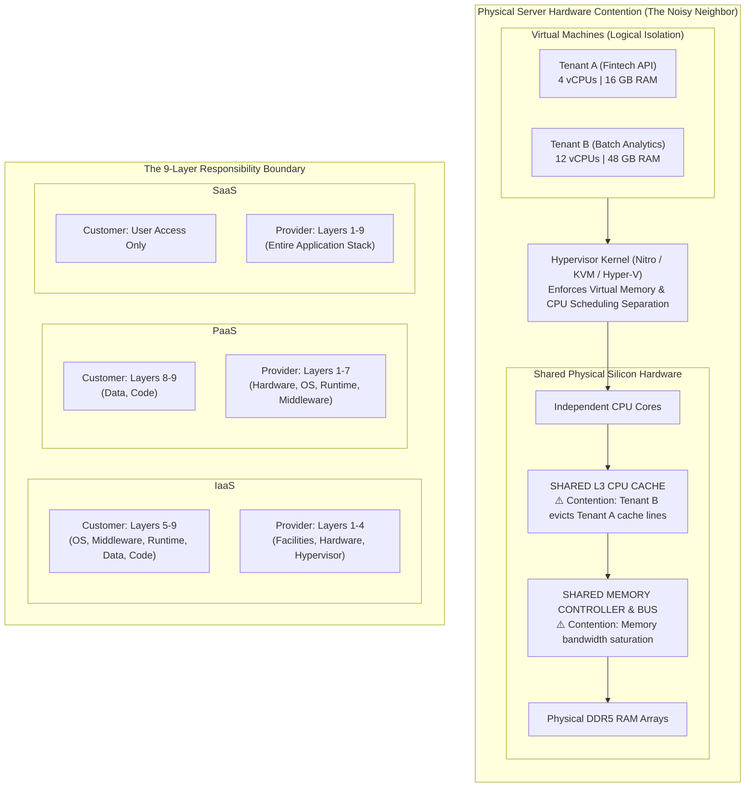

# Lecture 2: Cloud Computing Service Architecture, Multi-Tenancy & Operational Governance

**Course:** Cloud Computing (CCZG527 / CSIZG527 / SEZG527 / SSZG527 - BITS Pilani WILP)  
**Instructor:** Prof. Arun Vadekkedhil  
**Contact Session / Module:** Session 2: Service Architecture, Multi-Tenancy & Operational Governance  
**Core Theme:** Deep architectural decomposition of the NIST service and deployment models—analyzing multi-tenancy physics (shared vs. dedicated compute), the Noisy Neighbor problem, the operational boundaries of IaaS vs. PaaS vs. SaaS, and governance across AWS and Azure.

---

## 1. The Big Picture (Why Should I Care?)

- **What is this lecture about?**  
  This lecture dives beneath the surface of cloud service models (IaaS, PaaS, SaaS) and multi-tenancy. It explains the physical hardware trade-offs of sharing servers with other customers, why the "Noisy Neighbor" problem happens at the silicon level, and why higher abstractions like PaaS trade customization freedom for operational convenience.
- **The Real-World Problem:**  
  At 2:15 PM, a fintech payment service experiences a latency spike from 12ms to 480ms. The VM looks healthy: CPU is at 24%, memory is fine, and database pools are clear. The root cause: a separate company's VM on the exact same physical server started a massive batch job that flooded the CPU's shared **L3 cache** and saturated the **memory bus**, starving the fintech's VM at the physical hardware layer. Moving the app to PaaS to escape hardware management failed because PaaS forbids custom Linux kernel modules required for financial encryption.
- **Where this fits in the course:**  
  Building on Session 1's NIST framework, this lecture explores the trade-offs of cloud tenancy and sets up Sessions 3 and 4, which examine the low-level virtualization hypervisors that enforce these boundaries.

---

## 2. Core Concepts Explained Simply

### Concept 1: Multi-Tenancy Mechanics: Shared vs. Dedicated Compute

- **What is it?**  
  Serving multiple independent customer workloads (tenants) from a single shared pool of physical hardware, using software virtualization to enforce logical isolation.
- **The 3 Tenancy Levels:**
  1. **Shared Multi-Tenant Instances (Default):** Your VM shares physical CPU sockets, memory buses, and motherboard resources with VMs from other AWS/Azure accounts.
  2. **Dedicated Instances:** Your instances run on single-tenant hardware dedicated to your account, but instance placement is still dynamically managed by the cloud provider.
  3. **Dedicated Hosts:** You reserve an entire physical server chassis, giving you direct control over socket/core mapping (critical for BYOL software licenses like Windows Server or Oracle).
- **Dual-Cloud Mapping:**  
  *Default Shared:* `AWS EC2 (Default)` $\leftrightarrow$ `Azure VMs (Default)`  
  *Dedicated Instances:* `AWS Dedicated Instances` $\leftrightarrow$ `Azure Isolated VM Sizes`  
  *Dedicated Hosts:* `AWS Dedicated Hosts` $\leftrightarrow$ `Azure Dedicated Hosts`
- **Tech Quick-Primer:**
  > 💡 **Tech Quick-Primer (`Azure Dedicated Host`):** A physical server dedicated entirely to your Azure subscription, providing physical hardware isolation and core visibility for licensing compliance (AWS equivalent: **AWS Dedicated Host**).

---

### Concept 2: The "Noisy Neighbor" Problem: The Physics of Resource Contention

- **What is it?**  
  While hypervisors strictly isolate virtual memory addresses (Tenant A cannot read Tenant B's data), they **cannot completely isolate unmetered physical hardware components**: specifically the shared **CPU L3 Cache**, the **memory bus**, and physical **Network Interface Card (NIC) queues**.
- **How It Works (Under the Hood):**
  * Modern multi-core processors have dedicated L1/L2 caches per core, but share a unified **L3 Last-Level Cache (LLC)** across all cores.
  * If a neighboring tenant runs an unthrottled data-indexing job, its threads flood the L3 cache, evicting your application's hot instructions.
  * Your application is forced to fetch data from physical RAM (taking ~70ns vs. ~12ns from cache), causing sudden 4x–6x latency spikes and API timeouts.
- **Engineering Solution:**  
  For latency-critical applications (e.g., Redis caches, real-time trading engines), avoid burstable shared instances (`t4g` / `B-series`) and select compute-optimized instances with dedicated core pinning (`c6i` in AWS / `Fsv2` in Azure), or deploy on Dedicated Hosts.
- **Tech Quick-Primer:**
  > 💡 **Tech Quick-Primer (`Redis`):** An in-memory key-value data store used for sub-millisecond caching (managed as **Amazon ElastiCache** $\leftrightarrow$ **Azure Cache for Redis**).

---

### Concept 3: IaaS Deep Dive: The Bare-Machine Abstraction

- **What is it?**  
  The cloud provider rents raw virtual compute (vCPU, vRAM, and raw block storage), giving the customer full administrative (`root` / `Administrator`) control over the operating system, network firewalls, and installed runtimes.
- **Why do we need it?**  
  Required when you need low-level operating system control: tuning Linux kernel parameters, configuring raw NVMe disk arrays, or running distributed stateful engines (e.g., Kafka, Cassandra, Elasticsearch).
- **Dual-Cloud Mapping:**  
  `AWS EC2 + Amazon EBS + VPC` $\leftrightarrow$ `Azure Virtual Machines + Managed Disks + VNet`
- **Key Trade-Off:** Maximum control, but maximum operational overhead (you must patch the OS, manage dependencies, and configure security).

---

### Concept 4: PaaS Deep Dive: Developer Velocity vs. The Customization Trap

- **What is it?**  
  The cloud provider manages the physical hardware, operating system, and runtime engine (e.g., Node.js, Python, Java). The developer only provides application source code and configurations.
- **Why do we need it?**  
  Radically accelerates time-to-market by offloading OS patching, auto-scaling, and runtime management.
- **Dual-Cloud Mapping:**  
  `AWS Elastic Beanstalk / App Runner` $\leftrightarrow$ `Azure App Service`
- **The "Customization Trap":**  
  Because PaaS runs on a standardized, provider-managed OS, you **cannot install custom Linux kernel modules, custom system background daemons, or unsupported C libraries**. If an application requires custom OS extensions, it will fail on PaaS and must be re-architected for IaaS or containers.

---

### Concept 5: SaaS Deep Dive: The Complete Application Utility

- **What is it?**  
  The cloud provider owns and manages the entire stack end-to-end (hardware, OS, database, application code). The consumer accesses the service via a browser or API.
- **Customer Responsibility:** Restricted strictly to **User Access Management (IAM / SSO)** and **Data Governance**.
- **Dual-Cloud Mapping:**  
  `AWS QuickSight / WorkDocs` $\leftrightarrow$ `Microsoft 365 / Dynamics 365`
- **Key Trade-Off:** Zero maintenance overhead, but zero ability to modify backend code or architecture.

---

## 3. Visual Architecture Models

### Multi-Tenancy Silicon Contention & The 9-Layer Responsibility Stack

### Diagram Walkthrough:
* **The Noisy Neighbor Choke Point:** While the hypervisor prevents Tenant B from reading Tenant A's memory, both tenants share the physical L3 cache and memory bus. Heavy memory access by Tenant B degrades Tenant A's latency.
* **The 9-Layer Shift:** In IaaS, the boundary is at Layer 4 (hypervisor). In PaaS, it moves up to Layer 7 (runtime). In SaaS, the provider manages all 9 layers.

---

## 4. Key Comparisons & Trade-Offs

### Service Model Trade-Offs: IaaS vs. PaaS vs. SaaS

| Dimension | IaaS (e.g., EC2 / Azure VM) | PaaS (e.g., Beanstalk / App Svc) | SaaS (e.g., M365 / Datadog) |
| :--- | :--- | :--- | :--- |
| **Control Level** | **Highest** (Full OS root access) | **Moderate** (App config only) | **Lowest** (Settings & access only) |
| **Maintenance Burden** | High (OS patching, security fixes) | Low (Provider patches OS & runtime) | Zero (Turnkey solution) |
| **Custom Kernel Modules** | Supported (Full root privileges) | **Unsupported (Customization Trap)** | Unsupported |
| **Scaling Mechanism** | Managed by user via Auto Scaling Groups | Automated out-of-the-box by provider | Invisible / Handled entirely by provider |
| **Primary Failure Risk** | Misconfigured security/OS patches | Hitting rigid runtime platform limits | Vendor lock-in, service outage |

### Compute Tenancy Models Comparison

| Tenancy Model | Physical Isolation | Licensing Impact (BYOL) | Noisy Neighbor Protection | Cost Profile |
| :--- | :--- | :--- | :--- | :--- |
| **Shared Multi-Tenant** | Logical only (Hypervisor) | Per-vCPU licensing | Vulnerable to L3/bus contention | **Lowest / Pay-per-second** |
| **Dedicated Instance** | Hardware isolated to account | Standard software licensing | High protection | Moderate (+10%–20% premium) |
| **Dedicated Host** | Full physical server allocated | Sockets/cores visible for BYOL | **100% Guaranteed Protection** | **Highest / Billed per host** |

---

## 5. Professor's Practical Takeaways & Golden Rules

*(Key insights emphasized by Prof. Arun Vadekkedhil in lecture)*

1. **Beware the "Customization Trap" in PaaS:**  
   PaaS accelerates deployment, but it is an opinionated sandbox. If your application requires custom OS kernel modules, legacy DLLs, or non-standard networking sockets, do not attempt to force it into PaaS—deploy it on IaaS or container clusters.
2. **Understand the Physics of Multi-Tenancy:**  
   Logical isolation does not equal physical isolation. If your microservice has extreme p99 latency requirements (<15ms), evaluate dedicated compute options to avoid L3 cache eviction from noisy neighbors.
3. **Dedicated Instances vs. Dedicated Hosts:**  
   *Dedicated Instances* guarantee that only your VMs run on the physical server, but the cloud provider still controls placement. *Dedicated Hosts* give you physical server chassis allocation, necessary when legacy enterprise licenses (e.g., Oracle, Windows Server) require paying per physical socket.
4. **Security Responsibility Never Drops to Zero:**  
   Even in SaaS, the customer owns user authentication (MFA/SSO), role-based access control, and data loss prevention policies.

---

## 6. Quick Recap & Terminology Cheatsheet

### Key Terms in 1 Line
* **Multi-Tenancy:** Sharing physical hardware resources across multiple independent customers with software-enforced logical isolation.
* **Noisy Neighbor:** Performance degradation caused when an adjacent tenant saturates shared unmetered hardware (L3 cache, memory bus).
* **Dedicated Host:** A physical cloud server dedicated entirely to a single customer, exposing socket and core layouts for licensing.
* **IaaS:** Cloud model offering raw virtualized compute, storage, and networking; user manages OS and software.
* **PaaS:** Cloud model offering managed application runtimes; user deploys code without managing the OS.
* **SaaS:** Cloud model delivering complete turnkey software applications over the web.
* **Customization Trap:** The operational limitation of PaaS platforms where custom OS kernel modules and system daemons cannot be installed.

### 4 Core Mental Rules to Remember
1. **PaaS trades control for velocity:** Great for standard web apps; impossible for custom OS kernel modules.
2. **Hypervisors isolate memory addresses, not cache access:** Noisy neighbors can still cause latency spikes on shared hardware.
3. **Choose Dedicated Hosts for licensing and p99 latency:** Use when you need BYOL per-socket compliance or zero cache interference.
4. **Security responsibility is shared, not abdicated:** You always own access control and data security.
