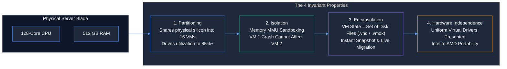
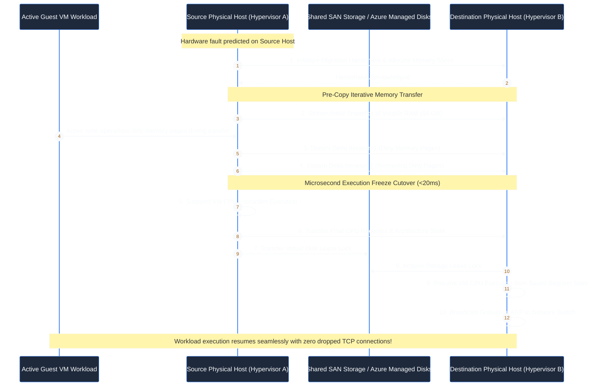

# Contact Session 3: Virtualization Foundations, Hypervisor Architecture & Hands-on Lab Implementation

**Course:** Cloud Computing (CCZG527 / CSIZG527 / SEZG527 / SSZG527 - BITS Pilani WILP)  
**Instructor:** Prof. Arun Vadekkedhil  
**Contact Session / Module:** Contact Session 3: Virtualization Foundations, Hypervisors & Lab Orchestration  
**Core Theme:** Virtualization is the foundational technological engine of cloud computing—deconstructing hypervisor classifications (Type-1 vs Type-2), the 4 invariant properties of virtualization, virtual disk image architectures (VDI/VMDK/VHD/QCOW2), cross-cloud migration bottlenecks across **AWS and Azure**, and headless Linux VM orchestration.

---

## 1. Executive Overview & Problem Context (The 2-Minute Story)

### The 2-Minute Story: The 36-Hour Motherboard Nightmare vs The 20ms Live Migration
In October 2003, a Tier-1 financial institution in New York suffered a catastrophic hardware failure. At 4:12 PM, the primary motherboard of their core Oracle database server suffered a short-circuit. The server—a custom, dual-socket physical server with hardware RAID controllers—was completely dead.

Because the operating system was compiled directly against that specific motherboard chipset and storage controller, the disaster recovery team could not simply swap the hard drives into a different spare server. Finding an identical motherboard revision from the manufacturer took 18 hours. Sourcing matching SCSI controller drivers and rebuilding the storage array took another 12 hours. From initial failure to final transaction replay, the core banking system was offline for 36 hours, resulting in millions of dollars in regulatory fines and customer churn.

Fast forward to a modern hyperscale cloud datacenter (AWS or Microsoft Azure). A server blade hosting 40 production enterprise virtual machines detects a series of correctable ECC memory errors indicating that a memory module is about to fail. 

No alarms ring. No human technician rushes to the datacenter floor with a screwdriver. Instead, the cluster orchestrator initiates an automated **Live Migration (VMware vMotion / KVM Live Migration / Azure Service Healing)**. While the enterprise VMs continue executing transactions, their active memory pages and virtual CPU registers are replicated over a dedicated 100 Gbps network to a healthy physical host. During the final cutover phase, execution transfers in less than **20 milliseconds**—so fast that active TCP socket connections never drop, database queries do not fail, and end users notice zero interruption.

This is the transformative power of **Hardware Virtualization**. By decoupling software from physical silicon and encapsulating entire operating systems into portable files, virtualization turned fragile physical computing into resilient, agile, and immortal software-defined systems.

```
[2003 Bare-Metal Server Crash]                      [Modern Hypervisor Live Migration: AWS & Azure]
Motherboard Short-Circuit = Complete Outage         Predictive Silicon Error Detected
OS Tied to Chipset Drivers (Kernel Panic on Swap) ──► Hypervisor Replicates RAM & Registers
36-Hour Recovery Lead Time via Physical Spares      20ms Execution Cutover to Healthy Host
Millions in SLA Fines & Transaction Data Loss       Zero Packet Loss, Zero Production Downtime
```

### The Core Problem / Pre-Virtualization Bottlenecks
1. **Rigid Physical Hardware Coupling:** Operating systems were compiled directly against bare-metal hardware registers and vendor-specific chipsets. If physical hardware failed, the OS could not boot on differing server hardware without fatal kernel panics.
2. **The 1:1 Application Sprawl:** To prevent conflicting runtime dependencies and unhandled memory errors from crashing adjacent services, enterprise sysadmins were forced to allocate one physical server per application, locking average datacenter CPU utilization to an abysmal **10% to 15%**.
3. **Absence of State Encapsulation:** A physical computer’s state was scattered across volatile DRAM, CMOS BIOS chips, and mechanical hard drive platters. Backing up a running bare-metal server required complex filesystem agents and tape drives that frequently failed recovery verification.
4. **Manual Provisioning Chasm:** Without virtualization, provisioning a compute environment meant ordering physical silicon, waiting weeks for shipping, physically mounting the chassis in a rack, and manually running installer CDs.

### The Architectural Solution
Virtualization resolves these bottlenecks through four architectural mechanisms:
- **The Hypervisor / Virtual Machine Monitor (VMM):** A software or firmware abstraction layer that presents standard, uniform virtual hardware (vCPU, vRAM, vNIC, virtual storage) to guest operating systems.
- **Resource Partitioning:** Carves high-density physical servers into dozens of independent, isolated virtual execution environments.
- **Encapsulation:** Packages the complete operational state of a computer—BIOS, CPU registers, volatile memory, and storage blocks—into portable, self-contained files on disk (**VHD/VHDX in Azure** $\leftrightarrow$ **EBS Snapshots in AWS** $\leftrightarrow$ **VMDK in VMware**).
- **Hardware Independence:** Decouples the guest operating system from physical silicon manufacturers, allowing a virtual machine created on an Intel processor to execute seamlessly on an AMD server.

### Course Roadmap Placement
- **Sessions 1 & 2:** Cloud Computing Foundations, NIST SP 800-145 Framework, Service Models (IaaS/PaaS/SaaS), and Multi-Tenancy Governance.
- **Session 3 (This Lecture):** Virtualization Foundations, Hypervisors (Type-1 vs Type-2), 4 Invariant Properties, Virtual Disk Image Formats, Cross-Cloud Portability, and VirtualBox Orchestration.
- **Session 4:** Hypervisor Kernel Internals (Monolithic vs Microkernel), Levels of Virtualization (ISA to OS), 5-Layer IaaS Stack, and Cloud IAM.
- **Session 5 & Beyond:** Production IaaS Deep Dive (EC2 $\leftrightarrow$ Azure VMs, VPC $\leftrightarrow$ VNet, S3/EBS/EFS $\leftrightarrow$ Azure Blob/Disks/Files, and Hyperscale Architectures).

---

## 2. Core Concepts Explained Simply (with Tech Quick-Primers)

### 2.1 The Virtualization Imperative: The Engine of Cloud `[Slide 6, 9–11 | Transcript ~00:12:00, ~01:54:00 - ~01:59:00]`
- **What is it? (Intuition First):** Virtualization is the foundational technology that creates simulated, software-based representations of physical hardware resources—including virtual CPUs, memory, storage volumes, and network interfaces.
- **Why Cloud Cannot Exist Without Virtualization (Prof. Arun's Classroom Debate) `[Transcript ~01:57:30]`:**
  - Prof. Arun challenges the class: *"If I say cloud doesn't need virtualization to run on, do you agree? Could we provide cloud services by dedicating physical bare-metal servers directly?"*
  - *The Production Reality:* If cloud providers operated without virtualization, every single on-demand API call (`POST /instances` in AWS or `az vm create` in Azure) would require a physical human technician in the datacenter to unbox a server, cable its power and network, and mount an OS image.
  - *The Result:* **Rapid elasticity, sub-minute self-service provisioning, multi-tenancy, and pay-per-second billing would be completely impossible.** Cloud computing exists as an automated utility solely because virtualization transforms physical hardware into programmable software objects.
- **Production Systems Grounding:**
  Hyperscale cloud providers (AWS, Azure, Google Cloud) run millions of virtual machines concurrently across global regions. Without hypervisors pooling physical silicon, the electrical power and physical floor space required to run equivalent dedicated physical servers would collapse global energy grids.
- > 💡 **Tech Quick-Primer (`Microsoft Hyper-V`):** Microsoft's enterprise Type-1 bare-metal hypervisor that powers the entire compute infrastructure of Microsoft Azure, running as the virtualization layer directly above physical datacenter silicon (AWS equivalent: **KVM / AWS Nitro**).
- 🔍 **Visual Reference:** *See Slide 9 ("What is Virtualization?") and Slide 11 ("Why Virtualization is the Foundation"). Notice how virtualization completely severs the physical bond between the OS and underlying server silicon.*

---

### 2.2 Hypervisor Architecture: Type-1 (Bare-Metal) vs Type-2 (Hosted) `[Slide 7, 34, 35 | Transcript ~01:11:00 - ~01:17:00]`
- **What is it? (Intuition First):** A **Hypervisor**, formally called a **Virtual Machine Monitor (VMM)**, is the software, firmware, or kernel module responsible for creating, scheduling, isolating, and managing virtual machines.
- **The Core Terminology (Slide 7):**
  - **Host Operating System:** The primary OS running directly on physical hardware in hosted setups (e.g., Windows 11 on an engineer's laptop).
  - **Hypervisor / VMM:** The virtualization engine that intercepts hardware instructions and multiplexes physical silicon.
  - **Guest Operating System:** The OS running inside the isolated virtual machine (e.g., Ubuntu Linux running inside a VM).
  - **Virtual Machine (VM):** The software construct that masquerades as a physical computer, possessing its own virtual BIOS, vCPUs, vRAM, and virtual disk controllers.

```
Type-1 Hypervisor (Bare-Metal / Enterprise Cloud)  Type-2 Hypervisor (Hosted / Developer Workstations)
┌─────────────────────────────────┐               ┌─────────────────────────────────┐
│ Guest OS 1  │ Guest OS 2        │               │ Guest OS 1  │ Guest OS 2        │
├─────────────┴───────────────────┤               ├─────────────┴───────────────────┤
│ Hypervisor (Hyper-V / KVM / ESXi│               │ Hypervisor (VirtualBox / Workst)│
├─────────────────────────────────┤               ├─────────────────────────────────┤
│ Bare-Metal Physical Hardware    │               │ Host OS (Windows / macOS / Linux│
│ (AWS / Azure Datacenter Silicon)│               ├─────────────────────────────────┤
│                                 │               │ Physical Hardware (Laptop / PC) │
└─────────────────────────────────┘               └─────────────────────────────────┘
```

#### 1. Type-1 (Bare-Metal / Native) Hypervisors `[Slide 35]`
- **Architecture:** Runs directly on physical bare-metal hardware with zero underlying general-purpose operating system.
- **Execution Path:** The hypervisor *is* the operating system. Guest OS instructions execute directly on physical CPU silicon via hardware extensions (Intel VT-x / AMD-V).
- **Representative Examples:** **Microsoft Hyper-V** (powers Azure), **Linux KVM** (powers GCP & OpenStack), **AWS Nitro System**, **VMware ESXi**.
- **Production Fit:** Enterprise datacenters, public cloud infrastructure (Azure Virtual Machines, AWS EC2). Delivers maximum I/O throughput, sub-microsecond latency, and >95% hardware efficiency.

#### 2. Type-2 (Hosted) Hypervisors `[Slide 35]`
- **Architecture:** Runs as a user-space application on top of an existing host operating system.
- **Execution Path:** Every virtual hardware call must traverse multiple abstraction layers: Guest OS $\to$ Hypervisor Application $\to$ Host OS Kernel $\to$ Physical Hardware.
- **Representative Examples:** **Oracle VM VirtualBox**, **VMware Workstation**, **Parallels Desktop**.
- **Production Fit:** Software development workstations, local testing, continuous integration testing environments, and academic labs. Unsuitable for enterprise cloud hosting due to the heavy resource tax of the host OS.

> 💡 **Tech Quick-Primer (`QEMU`):** A generic, open-source machine emulator and virtualizer that provides user-space hardware emulation (storage, networking, graphics) when paired with KVM kernel modules to achieve near-native execution speed.

---

### 2.3 The Four Invariant Properties of Virtualization `[Slide 10, 36 | Transcript ~01:54:30 - ~01:56:00]`
Every production virtualization system must satisfy four foundational engineering invariants:

```text
┌────────────────────────────────────────────────────────────────────────┐
│               THE 4 INVARIANT PROPERTIES OF VIRTUALIZATION             │
├─────────────────┬─────────────────┬──────────────────┬─────────────────┤
│ 1. Partitioning │  2. Isolation   │ 3. Encapsulation │ 4. Hardware     │
│                 │                 │                  │    Independence │
└─────────────────┴─────────────────┴──────────────────┴─────────────────┘
```

#### 1. Partitioning `[Slide 36]`
- **Definition:** The capability to execute multiple independent operating systems and workloads simultaneously on a single physical host, dynamically dividing physical compute, memory, storage, and I/O among VMs.
- **Engineering Value:** Drives server utilization from 10% up to 85%+, dramatically reducing server sprawl, datacenter rack footprint, electrical power, and cooling costs across enterprise clusters.

#### 2. Isolation `[Slide 36]`
- **Definition:** Strict fault, memory, and security sandboxing between co-located virtual machines on the same physical silicon.
- **Engineering Value:** If Guest OS A experiences a fatal kernel panic, thread deadlock, or malware infection, it **cannot corrupt, crash, or access the memory space of Guest OS B** executing on the exact same physical motherboard. The hypervisor enforces strict memory boundary sandboxing through CPU Memory Management Units (MMUs).

#### 3. Encapsulation `[Slide 36]`
- **Definition:** The complete operational state of a virtual machine—including its virtual BIOS configuration, virtual CPU registers, volatile memory contents, and virtual disk blocks—is completely captured as a small collection of discrete files on storage.
- **Engineering Value:** Because an entire computer is merely a collection of files, a VM can be snapshotted in milliseconds, cloned across clusters, backed up while running, and moved across storage arrays with standard file-copy commands.

#### 4. Hardware Independence `[Slide 36]`
- **Definition:** Virtual machines are completely decoupled from underlying physical server hardware specifications. The hypervisor exposes a standardized virtual chipset (e.g., standard virtual Intel e1000 NIC, standard SATA controllers) regardless of the host's actual physical silicon.
- **Engineering Value:** A virtual machine created on a physical Dell server with an Intel Xeon processor can be migrated to an HP server with an AMD EPYC processor without reconfiguring device drivers or reinstalling the operating system.

---

### 2.4 Virtual Disk Image Formats & Portability Bottlenecks `[Slide 7, 37 | Transcript ~01:55:20 - ~01:57:15]`
- **What is it? (Intuition First):** A virtual disk image is a single structured file stored on a physical filesystem that masquerades to the guest operating system as a raw physical block storage device (HDD or SSD).
- **The Major Industry Virtual Disk Formats:**
  1. **VHD / VHDX (Virtual Hard Disk):** Microsoft's native format for Hyper-V and **Azure IaaS Virtual Machines**. Azure Gen 1 VMs require fixed-size VHD format; Azure Gen 2 supports modern VHDX volumes up to 64 TB with dynamic resizing.
  2. **VMDK (Virtual Machine Disk):** The enterprise standard developed by VMware; supports multi-extent splitting and enterprise snapshots.
  3. **VDI (VirtualBox Disk Image):** The default open container format developed by Oracle for VirtualBox.
  4. **QCOW2 (QEMU Copy-On-Write v2):** The standard open-source disk format for KVM and OpenStack, supporting copy-on-write snapshots, compression, and AES encryption.
- **Disk Allocation Mechanisms:**
  - **Dynamically Allocated (Thin-Provisioned):** The image file initially consumes only a few megabytes on the physical host disk, expanding dynamically as data is written inside the guest OS up to the defined capacity limit. *Saves physical disk space, but introduces minor write-latency overhead during initial block allocation.*
  - **Fixed Size (Pre-Allocated / Thick-Provisioned):** Allocates the full storage capacity (e.g., 50 GB) upfront on the physical drive. *Mandatory for uploading legacy VHDs to Azure Gen 1 VMs; eliminates filesystem fragmentation and provides maximum I/O performance.*
- **Cross-Cloud Image Portability Bottlenecks (AWS vs Azure):**
  - An enterprise cannot simply upload an on-premises VMware `.vmdk` file to AWS or Azure and expect it to boot immediately.
  - *The AWS Prerequisite:* Requires AWS Nitro NVMe and Elastic Network Adapter (ENA) paravirtualized drivers injected into `initramfs`.
  - *The Azure Prerequisite:* Requires **Hyper-V Linux Integration Services (LIS)** and the **Azure Linux Agent (`walinuxagent`)** installed. Without LIS drivers, the guest kernel cannot communicate with Azure's virtual SCSI storage controller during boot, resulting in a fatal boot failure.
- > 💡 **Tech Quick-Primer (`Azure Migrate`):** A centralized Microsoft service that automates discovery, assessment, and agent-based replication of on-premises VMware/Hyper-V virtual machines directly into Azure IaaS VMs, automatically injecting Hyper-V drivers during cutover (AWS equivalent: **AWS Application Migration Service - AWS MGN**).

---

### 2.5 Practical Tooling & Lab Orchestration: Headless VirtualBox `[Slide 38–41]`
In production DevOps environments, virtual machines are rarely configured via graphical user interfaces (GUIs). They are orchestrated headlessly via command-line interfaces and automated scripts using `VBoxManage`:

```bash
# 1. Register a new headless 64-bit Ubuntu Virtual Machine
VBoxManage createvm --name "ProductionVM" --ostype "Ubuntu_64" --register

# 2. Configure 4 vCPUs and 8 GB of RAM (Restricted to <50% host RAM to prevent host OS paging)
VBoxManage modifyvm "ProductionVM" --memory 8192 --cpus 4 --vram 128 --boot1 dvd --boot2 disk

# 3. Create a 30 GB Dynamically Allocated VDI Storage Medium
VBoxManage createmedium disk --filename "/vms/ProductionVM.vdi" --size 30720 --format VDI

# 4. Attach Storage Controllers (SATA for Disk, IDE for Installation ISO)
VBoxManage storagectl "ProductionVM" --name "SATA Controller" --add sata --controller IntelAhci
VBoxManage storageattach "ProductionVM" --name "SATA Controller" --port 0 --device 0 --type hdd --medium "/vms/ProductionVM.vdi"

VBoxManage storagectl "ProductionVM" --name "IDE Controller" --add ide
VBoxManage storageattach "ProductionVM" --name "IDE Controller" --port 0 --device 0 --type dvddrive --medium "/iso/ubuntu-22.04-live-server.iso"

# 5. Launch the Virtual Machine in Headless Background Mode
VBoxManage startvm "ProductionVM" --type headless
```

#### Converting Virtual Disk Formats for Cross-Cloud Migration:
To convert a local VirtualBox `.vdi` image into an Azure-compatible `.vhd` disk or VMware `.vmdk` disk:
```bash
# Convert VDI to Azure Fixed-Size VHD via qemu-img
qemu-img convert -f vdi -O vpc -o subformat=fixed ProductionVM.vdi ProductionVM.vhd

# Convert VDI to VMware VMDK via VBoxManage
VBoxManage clonehd "ProductionVM.vdi" "ProductionVM.vmdk" --format VMDK
```

---

## 3. Visual Architectural / System Models

### Model 1: Type-1 Bare-Metal vs Type-2 Hosted Execution Stack
*This dark-mode model contrasts the physical execution paths and architectural layers of Type-1 versus Type-2 hypervisors across enterprise cloud and developer environments based on Slide 34 and 35.*

```mermaid
%%{init: {'theme': 'base', 'themeVariables': { 'darkMode': true, 'background': '#0f172a', 'primaryColor': '#1e293b', 'primaryTextColor': '#f8fafc', 'primaryBorderColor': '#3b82f6', 'lineColor': '#60a5fa', 'secondaryColor': '#334155', 'tertiaryColor': '#1e293b' }}}%%
graph TB
    subgraph T1["Type-1: Bare-Metal Architecture (Azure Hyper-V / AWS Nitro / ESXi)"]
        subgraph T1_VMs["Tenant Virtual Machines"]
            T1_G1["Guest OS 1 (Linux)<br/>Direct Hardware Slices"]
            T1_G2["Guest OS 2 (Windows)<br/>Direct Hardware Slices"]
        end
        T1_Hyp["Type-1 Hypervisor / VMM (Microsoft Hyper-V / KVM)<br/>Executes Directly on Silicon (Ring 0 / Root Mode)"]
        T1_HW["Physical Bare-Metal Datacenter Silicon<br/>(CPUs, DDR5 RAM, NVMe Arrays, 100 Gbps SmartNICs)"]
        
        T1_G1 --> T1_Hyp
        T1_G2 --> T1_Hyp
        T1_Hyp --> T1_HW
    end

    subgraph T2["Type-2: Hosted Architecture (Developer Workstations)"]
        subgraph T2_VMs["Local Virtual Machines"]
            T2_G1["Guest OS 1 (Ubuntu)<br/>Virtual Hardware Emulation"]
        end
        T2_Hyp["Type-2 Hypervisor Application (Oracle VirtualBox)<br/>User-Space Process"]
        T2_HostOS["Host Operating System (Windows 11 / macOS Kernel)<br/>Consumes 4-8 GB Host RAM & Schedules All I/O"]
        T2_HW["Physical Laptop / PC Silicon Hardware"]

        T2_G1 --> T2_Hyp
        T2_Hyp --> T2_HostOS
        T2_HostOS --> T2_HW
    end

    style T1 fill:#0f172a,stroke:#3b82f6,stroke-width:2px,color:#f8fafc
    style T2 fill:#0f172a,stroke:#f59e0b,stroke-width:2px,color:#f8fafc
    style T1_G1 fill:#1e293b,stroke:#10b981,color:#f8fafc
    style T1_G2 fill:#1e293b,stroke:#10b981,color:#f8fafc
    style T1_Hyp fill:#1e293b,stroke:#3b82f6,stroke-width:2px,color:#60a5fa
    style T1_HW fill:#1e293b,stroke:#64748b,color:#f8fafc

    style T2_G1 fill:#1e293b,stroke:#10b981,color:#f8fafc
    style T2_Hyp fill:#1e293b,stroke:#f59e0b,stroke-width:2px,color:#fbbf24
    style T2_HostOS fill:#7f1d1d,stroke:#ef4444,stroke-width:2px,color:#fef2f2
    style T2_HW fill:#1e293b,stroke:#64748b,color:#f8fafc
```



---

### Model 2: The 4 Invariant Properties of Virtualization in Production
*This schematic illustrates how the four properties work concurrently to protect and isolate cloud workloads.*



---

### Model 3: Encapsulation & The Zero-Downtime Live Migration Sequence
*This sequence diagram illustrates the pre-copy memory synchronization and CPU state cutover of an enterprise VM live migration (VMware vMotion / AWS Live Migration / Azure Service Healing) based on Slide 36.*



---

## 4. Key Trade-Offs & Comparisons

### 4.1 The Cloud Architect's Rosetta Stone (Lecture 3 Primitives)

| Domain | Architectural Concept | AWS Implementation (Slide Context) | Azure Equivalent (Practitioner Context) |
| :--- | :--- | :--- | :--- |
| **Native Hypervisor** | Type-1 Enterprise VMM | **AWS Nitro System / KVM** | **Microsoft Hyper-V** |
| **Native Disk Format** | Primary VM Disk Format | **Amazon EBS Volume / AMI** | **VHD / VHDX (Azure Managed Disk)** |
| **Automated Migration**| Live VM Replication | **AWS Application Migration Service (MGN)**| **Azure Migrate** |
| **Disk Image Conversion**| CLI Format Converter | `qemu-img` / AWS VM Import | `qemu-img` / Azure CLI |
| **Zero-Downtime Move** | Seamless VM Relocation | **AWS EC2 Live Migration** | **Azure Service Healing & Live Migration** |

---

### 4.2 Structured Comparison: Type-1 vs Type-2 Hypervisors

| Comparison Dimension | Type-1 (Bare-Metal / Native) | Type-2 (Hosted) |
| :--- | :--- | :--- |
| **Underlying Operating System** | **None** (Executes directly on silicon) | Requires a full general-purpose Host OS |
| **Execution Performance** | **Near-Native (98%+ bare-metal speed)** | Noticeable overhead (Host OS scheduling tax) |
| **Memory Consumption** | Extremely lightweight (<1–2 GB for hypervisor)| High (Host OS burns 4–8 GB RAM continuously) |
| **I/O Latency** | Sub-microsecond (Direct hardware queues) | Millisecond-level (Double kernel mediation) |
| **Hardware Compatibility** | Strict Hardware Compatibility List (HCL) | Wide (Any hardware supported by Host OS) |
| **Primary Industry Role** | Hyperscale Clouds (Azure, AWS), Datacenters | Developer Laptops, Academic Labs, Testing |
| **Key Production Examples** | Microsoft Hyper-V, Linux KVM, VMware ESXi | Oracle VirtualBox, VMware Workstation |

---

### 4.3 Structured Comparison: Virtual Disk Allocation Models

| Evaluation Metric | Dynamically Allocated (Thin Provisioning) | Fixed Size (Thick Provisioning) |
| :--- | :--- | :--- |
| **Initial Disk Consumption** | Minimal (Few megabytes on physical drive) | **Full Allocation** (Allocates all 50 GB upfront) |
| **Write Performance** | Slower initial writes (Allocation latency) | **Maximum Performance** (Zero runtime allocation) |
| **Host Storage Efficiency** | **High** (Pay only for data actually written) | Low (Wastes host disk if guest VM is empty) |
| **Overcommit Risk** | **High** (If all VMs fill disks, host crashes) | **Zero** (Capacity guaranteed upfront) |
| **Cloud Import Requirement** | Supported for local testing | **Mandatory for Azure Gen 1 VHD uploads** |

---

## 5. Professor's Practical Tips & Oral Insights

*(Extracted directly from Prof. Arun Vadekkedhil's spoken classroom transcript)*

### 5.1 Real-World Engineering Insights
- **Virtualization is the Great Silicon Equalizer `[Transcript ~01:54:30]`:**
  - Before virtualization, upgrading server hardware meant rewriting startup scripts and recompiling kernels for new chipset revisions. Virtualization completely decoupled software lifecycles from hardware procurement cycles. Because the hypervisor presents standardized virtual hardware to the guest OS, software can survive for decades across multiple physical hardware generations without modifications.
- **Why Cloud Providers Forbid Type-2 Hypervisors `[Transcript ~01:14:20]`:**
  - Running a Type-2 hypervisor in an enterprise cloud datacenter would be financially suicidal. A host operating system like Windows or desktop Linux consumes physical CPU cores and gigabytes of RAM merely to run its own graphical interface and background daemons. Cloud providers use Type-1 bare-metal hypervisors (Microsoft Hyper-V in Azure, Nitro in AWS) because every single clock cycle and byte of RAM must be monetizable and deliverable to tenant workloads.

### 5.2 Common Misconceptions & Traps
- **Trap 1: "Virtualization is Just Running VirtualBox on a Laptop" `[Transcript ~01:11:00]`:**
  - Prof. Arun clarifies: *"VirtualBox is merely an introductory desktop tool for teaching and testing."* Enterprise virtualization is powered by Type-1 bare-metal hypervisors orchestrated across thousands of networked rack servers via centralized control planes like Azure Resource Manager or VMware vCenter.
- **Trap 2: "Allocating All Host CPU Cores to a VM Makes It Faster" `[Transcript ~01:25:40]`:**
  - Allocating 8 vCPUs on an 8-core physical host machine actually **degrades** VM performance. The hypervisor must compete with the host OS for CPU timeslices. If a guest VM occupies all physical cores, the host OS scheduler stalls, introducing severe CPU scheduling latency and thread jitter.

### 5.3 Student Questions & Classroom Debates
- **Q: Can you convert a VirtualBox `.vdi` disk into an enterprise `.vhd` or `.vmdk` disk? `[Transcript ~01:55:40]`**
  - **Prof. Arun's Explanation:** Yes. Virtual disk containers are fundamentally structured data files holding raw bytes. Using command-line tools like `qemu-img` or `VBoxManage clonehd`, engineers can convert disk images across VDI, VHD, VMDK, and QCOW2 formats in minutes.
- **Q: Why does VirtualBox freeze during Ubuntu ISO installation on low-RAM laptops? `[Transcript ~00:27:55]`**
  - **Prof. Arun's Explanation:** Laptops with only 4 GB or 8 GB of RAM cannot comfortably run a host OS (which requires 3-4 GB) and a modern desktop Linux GUI (which requires 2-4 GB) simultaneously. Students with resource-constrained machines should utilize cloud free-tier VMs (Azure for Students or AWS Free Tier) via browser or SSH instead of running heavy local VMs.

### 5.4 Exam Guidance & BITS Pilani Cautions
- **The 4 Properties Question (Mid-Sem Exam):**
  - Examiners frequently ask students to state and define the **4 invariant properties of virtualization** (Partitioning, Isolation, Encapsulation, Hardware Independence). Full marks require explaining both the architectural definition and the enterprise failure-prevention benefit.
- **Exam Bridge Callout (AWS vs Azure):**
  > ⚠️ **Exam Keyword Warning:** In questions on Type-1 hypervisors, cite **VMware ESXi, Linux KVM, and Microsoft Hyper-V**. When asked about cloud disk image formats, specify **VHD/VHDX** (Azure/Hyper-V) and **VMDK** (VMware) alongside EBS snapshots.

---

## 6. Exam-Ready Question Bank

### Part A: Conceptual & Short-Answer Questions (Mid-Sem Closed-Book: 2–3 Marks Each)

#### Q1: Define the Hypervisor (Virtual Machine Monitor) and differentiate between Type-1 and Type-2 hypervisors.
**Model Answer:**  
A Hypervisor or Virtual Machine Monitor (VMM) is a software, firmware, or kernel abstraction layer that creates, executes, isolates, and manages virtual machines by multiplexing physical hardware resources.
- **Type-1 (Bare-Metal) Hypervisor:** Executes directly on physical server silicon without an underlying host operating system (e.g., **Microsoft Hyper-V** in Azure, **Linux KVM** in GCP/AWS, VMware ESXi). Delivers high performance and near-native execution speed.
- **Type-2 (Hosted) Hypervisor:** Executes as an application on top of an existing host operating system (e.g., Oracle VM VirtualBox, VMware Workstation). Incurs performance overhead due to host OS scheduling and mediation.  
*(Scoring: 1 mark for VMM definition, 1 mark for Type-1, 1 mark for Type-2 - Total: 3 Marks)*

---

#### Q2: Enumerate the 4 Invariant Properties of Virtualization and define Encapsulation.
**Model Answer:**  
The 4 Invariant Properties of Virtualization are:
1. **Partitioning**
2. **Isolation**
3. **Encapsulation**
4. **Hardware Independence**

**Encapsulation Definition:** Encapsulation means that the complete operational state of a virtual machine—including its virtual BIOS settings, virtual CPU state, volatile memory contents, and virtual disk data—is entirely captured and stored as a small collection of self-contained files on storage media (such as `.vhd/.vhdx` in Azure or `.vmdk` in VMware). This allows a running VM to be snapshotted, cloned, backed up, or live-migrated across physical hosts with zero data loss.  
*(Scoring: 1 mark for listing the 4 properties, 2 marks for Encapsulation definition - Total: 3 Marks)*

---

#### Q3: Differentiate between Dynamically Allocated and Fixed-Size virtual disk images.
**Model Answer:**  
- **Dynamically Allocated (Thin-Provisioned):** Initially consumes only a small amount of physical host storage, growing dynamically as new data is written inside the guest OS up to a pre-set maximum capacity. Saves physical disk space, but incurs a minor write-latency penalty during initial block allocation.
- **Fixed Size (Thick-Provisioned):** Allocates the full specified storage capacity upfront on the physical drive at creation time. Delivers maximum read/write performance, eliminates fragmentation, and is required for legacy Azure Gen 1 VHD uploads, but consumes physical storage immediately regardless of guest OS utilization.  
*(Scoring: 1.5 marks for Dynamically Allocated, 1.5 marks for Fixed Size - Total: 3 Marks)*

---

#### Q4: Why is it recommended to allocate no more than 50% of physical host RAM to a guest virtual machine in a Type-2 hypervisor?
**Model Answer:**  
In a Type-2 hypervisor, the host operating system (e.g., Windows or macOS) requires substantial physical RAM to maintain its kernel, system daemons, and running applications. If more than 50% of host RAM is allocated to a guest VM, memory pressure forces the host OS to aggressively page memory to disk (thrashing), resulting in severe system-wide latency spikes and potential crashing of both the host OS and the virtual machine.  
*(Scoring: 1 mark for host OS memory requirements, 1 mark for memory paging/thrashing consequence - Total: 2 Marks)*

---

### Part B: Scenario-Based, Architectural & Analytical Questions (Comprehensive Open-Book: 5–10 Marks Each)

#### Scenario Question 1 (10 Marks): Cross-Cloud Enterprise VM Migration Failure
**Scenario:**  
"HealthCore Systems" operates an on-premises datacenter running VMware vSphere ESXi. As part of a datacenter exit strategy, the infrastructure team exports a mission-critical patient records database server as a 500 GB `.vmdk` virtual disk file and transfers it to cloud object storage. They convert the image to launch a cloud virtual machine (AWS EC2 / Azure VM).

Upon startup, the virtual machine fails health checks. The system console logs display the following fatal error:
```text
Kernel Panic: VFS: Unable to mount root fs on unknown-block(0,0)
[Initramfs boot failure: No block device found matching UUID=4a21-9b88]
```

As the Principal Cloud Systems Engineer, diagnose the precise technical root cause of this failure, explain why the virtual machine booted successfully on VMware but crashes in the cloud, and formulate an end-to-end remediation architecture to successfully migrate the database across AWS and Azure without data loss.

**Detailed Model Answer & Scoring Breakdown:**

##### 1. Technical Root Cause Diagnosis (3 Marks)
- **Missing Cloud Storage Device Drivers:** The on-premises VMware guest OS was configured to boot using VMware-specific virtual SCSI storage controllers (e.g., `mptspi` or `pvscsi`). The Linux kernel's initial RAM filesystem (`initramfs`) contains only the drivers required for VMware virtual hardware.
- **Hardware Abstraction Mismatch:** 
  - *In AWS:* Modern EC2 instances (AWS Nitro System) expose storage volumes exclusively through paravirtualized NVMe interfaces.
  - *In Azure:* Azure Hyper-V virtual machines expose storage controllers via Hyper-V SCSI controllers requiring Linux Integration Services (LIS) drivers (`hv_vmbus`, `hv_storvsc`).
  - *Result:* Because the migrated guest kernel's `initramfs` lacks the target platform's paravirtualized storage drivers, the kernel cannot communicate with the underlying virtual disk controller during early boot, triggering the fatal `Unable to mount root fs` kernel panic.

##### 2. Architectural Remediation Pipeline (4 Marks)
- **End-to-End Driver Injection & Migration Pipeline:**
  1. **Offline Driver Injection:** Mount the converted virtual disk offline using Linux guest utilities (e.g., `libguestfs` / `guestfish`).
  2. **Initramfs Rebuild:** Chroot into the mounted filesystem and rebuild the initial RAM filesystem to include cloud drivers:
     - For AWS: Inject `nvme-core`, `nvme`, `ena`.
     - For Azure: Inject `hv_vmbus`, `hv_storvsc`, `hv_netvsc`.
     ```bash
     dracut --add-drivers "nvme ena hv_vmbus hv_storvsc" --force /boot/initramfs-$(uname -r).img $(uname -r)
     ```
  3. **Cloud Agent Installation:** Install `cloud-init` and the cloud agent (**Azure Linux Agent `walinuxagent`** $\leftrightarrow$ **AWS SSM Agent**).
  4. **Fstab UUID Verification:** Ensure `/etc/fstab` references storage disks via filesystem UUIDs (`UUID=...`) rather than static controller paths (`/dev/sda1`).

##### 3. Zero-Downtime Migration Architecture (3 Marks)
- Instead of manual disk exports, adopt automated continuous agent-based block-level replication:
  - **In Azure:** Use **Azure Migrate**, which installs a lightweight replication appliance, continuously syncs disk deltas over TLS, and automatically injects Hyper-V integration drivers during cutover.
  - **In AWS:** Use **AWS Application Migration Service (AWS MGN)** for equivalent block-level delta replication.

##### Scoring Keywords Checklist for Examiners:
- [x] *Missing paravirtualized storage device drivers (NVMe / Hyper-V storvsc)*
- [x] *Initramfs / early-boot driver mismatch*
- [x] *Hardware abstraction layer differences (VMware SCSI vs Cloud storage)*
- [x] *Initramfs rebuild (`dracut` / `mkinitramfs`)*
- [x] *UUID mounting in `/etc/fstab`*
- [x] *Automated replication tooling (Azure Migrate / AWS MGN)*

---

#### Scenario Question 2 (5 Marks): Lab Architecture Selection: Type-1 vs Type-2
**Scenario:**  
A university department is establishing a cloud computing lab for 50 concurrent students. The lab administrator proposes two deployment options:
- *Option A:* Purchase 50 student laptops (each running Windows 11 with 16 GB RAM) and have students install Oracle VM VirtualBox (Type-2 hosted hypervisor) to run Ubuntu VMs.
- *Option B:* Purchase two enterprise rack servers (each with 64 physical cores, 256 GB RAM) running Microsoft Hyper-V or Linux KVM (Type-1 bare-metal hypervisor) and provide students with remote browser/SSH access to provisioned VMs.

Compare both options across system performance, resource efficiency, administrative overhead, and hardware fault tolerance. Justify which option provides superior architectural efficiency for high-density academic environments.

**Detailed Model Answer & Scoring Breakdown:**

##### 1. Comparative Analysis (3 Marks)
- **Performance & Resource Efficiency:** In Option A (Type-2), each laptop burns 4–8 GB of RAM running Windows 11 background processes and host graphics, leaving less than 8 GB for student VMs. In Option B (Type-1), the bare-metal hypervisor consumes minimal memory (<2 GB), allowing 95%+ of physical RAM and CPU cores to be dedicated to student workloads with near-native execution speed.
- **Administrative Maintenance:** In Option A, IT staff must maintain, troubleshoot, and patch 50 independent Windows host machines and VirtualBox installations. In Option B, IT manages only two central rack servers with centralized golden image templates and automated student VM resets.

##### 2. Recommendation & Architectural Justification (2 Marks)
- **Recommendation: Option B (Type-1 Bare-Metal Infrastructure).**
  - *Justification:* Option B leverages the **Partitioning** and **Encapsulation** properties of Type-1 virtualization. It maximizes physical resource pooling (achieving 80%+ hardware utilization through memory deduplication and CPU overcommitment), provides centralized automated backups, and isolates hardware failures to central server blades while students access environments from lightweight client terminals.

##### Scoring Keywords Checklist:
- [x] *Host OS resource tax in Type-2*
- [x] *Bare-metal efficiency & near-native execution in Type-1*
- [x] *Centralized template management & image reset*
- [x] *Resource pooling & high hardware utilization*
- [x] *Recommendation justification*

---

## 7. Quick Revision & 60-Second Exam Recap

### 7.1 Key Terms & Acronym Glossary
- **Hypervisor / VMM:** Virtual Machine Monitor. The abstraction layer that creates and manages virtual machines.
- **Type-1 Hypervisor:** Bare-metal native hypervisor running directly on physical hardware (e.g., **Microsoft Hyper-V**, KVM, ESXi).
- **Type-2 Hypervisor:** Hosted hypervisor running as an application on an existing host OS (e.g., VirtualBox).
- **Partitioning:** The ability to execute multiple operating systems simultaneously on a single physical host.
- **Isolation:** Strict hardware-enforced memory and security sandboxing preventing one VM from affecting another.
- **Encapsulation:** Storing the complete state of a computer (CPU, RAM, BIOS, disk) as portable discrete files.
- **Hardware Independence:** Decoupling virtual machines from underlying physical silicon and chipsets.
- **VHD / VHDX:** Virtual Hard Disk. Microsoft Hyper-V and **Azure's native virtual disk format**.
- **VMDK:** Virtual Machine Disk. VMware's enterprise virtual disk container format.
- **VDI:** VirtualBox Disk Image. Oracle's native virtual disk format.
- **QCOW2:** QEMU Copy-On-Write v2. Open standard disk format for KVM and OpenStack.
- **Azure Migrate / AWS MGN:** Automated agent-based services for migrating physical/virtual machines to the cloud with automatic driver injection.

---

### 7.2 The 5 Golden Rules of Session 3
1. **Cloud is Impossible Without Virtualization:** Virtualization is the technological engine that converts physical silicon into programmable, multi-tenant software services.
2. **The 4 Properties Govern All Virtual Systems:** Any virtualized environment must deliver **Partitioning** (sharing compute), **Isolation** (sandboxing crashes), **Encapsulation** (file-based state), and **Hardware Independence** (driver decoupling).
3. **Type-1 for Cloud, Type-2 for Workstations:** Enterprise cloud providers exclusively use Type-1 bare-metal hypervisors (Hyper-V in Azure, Nitro in AWS) to eliminate host OS overhead; Type-2 hosted hypervisors are strictly for developer workstations and local testing.
4. **Virtual Disks Require Driver Alignment:** Virtual disk images cannot be moved across differing hypervisors or cloud platforms without injecting the target platform's paravirtualized storage drivers (Hyper-V LIS in Azure / NVMe in AWS) into the guest OS `initramfs`.
5. **Never Over-Allocate Host Memory in Hosted Hypervisors:** In Type-2 hypervisors, allocating over 50% of physical RAM to guest VMs triggers host OS memory paging (thrashing), resulting in system-wide freezing.

---

### 7.3 60-Second Rapid-Fire Q&A
- **Q: What architectural hypervisor type is Oracle VM VirtualBox?**  
  *A:* Type-2 (Hosted) Hypervisor.
- **Q: Which hypervisor powers Microsoft Azure's compute virtualization fabric?**  
  *A:* Microsoft Hyper-V (Type-1 Bare-Metal Hypervisor).
- **Q: Which property of virtualization ensures a kernel crash in VM 1 does not affect VM 2?**  
  *A:* Isolation.
- **Q: What is the native virtual disk format of Microsoft Azure?**  
  *A:* VHD / VHDX.
- **Q: What command-line utility converts disk images between VDI, VHD, and VMDK formats?**  
  *A:* `qemu-img` or `VBoxManage clonehd`.
