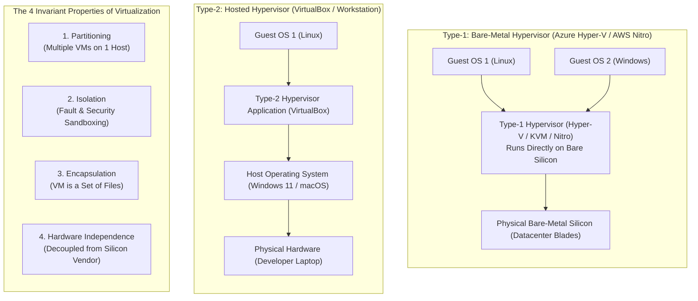

# Lecture 3: Virtualization Foundations, Hypervisor Architecture & Lab Implementation

**Course:** Cloud Computing (CCZG527 / CSIZG527 / SEZG527 / SSZG527 - BITS Pilani WILP)  
**Instructor:** Prof. Arun Vadekkedhil  
**Contact Session / Module:** Session 3: Virtualization Foundations, Hypervisors & Lab Orchestration  
**Core Theme:** Virtualization is the technological engine of cloud computing—deconstructing hypervisor classifications (Type-1 vs Type-2), the 4 invariant properties of virtualization, virtual disk image formats (VDI/VMDK/VHD/QCOW2), cross-cloud migration, and headless Linux VM orchestration.

---

## 1. The Big Picture (Why Should I Care?)

- **What is this lecture about?**  
  This lecture examines the underlying engine of cloud computing: **Hardware Virtualization**. It breaks down how hypervisors (Type-1 vs Type-2) abstract physical hardware, explains the 4 non-negotiable properties of virtualization, explores virtual disk formats (VHD, VMDK, QCOW2), and demonstrates headless VM orchestration.
- **The Real-World Problem:**  
  In 2003, when an enterprise database server's motherboard short-circuited, recovery took 36 hours because the OS was tightly coupled to physical chipset drivers. In modern cloud (AWS or Azure), when a physical server detects failing memory, an automated **Live Migration** moves the active VM across the network to a healthy host in **under 20 milliseconds** with zero downtime and zero dropped TCP connections. Virtualization turns fragile physical hardware into immortal software-defined objects.
- **Where this fits in the course:**  
  Building on Sessions 1 and 2, this lecture explains how cloud providers actually pool physical hardware. It sets up Session 4, which explores hypervisor kernel architectures (monolithic vs microkernel) and virtualization levels.

---

## 2. Core Concepts Explained Simply

### Concept 1: The Virtualization Imperative: The Engine of Cloud

- **What is it?**  
  The technology that creates software-based representations of physical hardware (vCPUs, virtual RAM, virtual NICs, virtual block disks).
- **Why Cloud Cannot Exist Without Virtualization (Prof. Arun's Debate):**  
  *Could we provide cloud services by renting dedicated physical bare-metal servers directly?*  
  No. Without virtualization, every API call (`POST /instances` in AWS or `az vm create` in Azure) would require a human technician in the datacenter to unbox, mount, cable, and install an OS. **Rapid elasticity, sub-minute self-service, multi-tenancy, and per-second billing exist solely because virtualization makes compute programmable.**
- **Dual-Cloud Mapping:**  
  *Cloud Hypervisor:* `AWS Nitro System / KVM` $\leftrightarrow$ `Microsoft Hyper-V (Azure Host OS)`
- **Tech Quick-Primer:**
  > 💡 **Tech Quick-Primer (`Microsoft Hyper-V`):** The enterprise Type-1 bare-metal hypervisor that powers the entire compute infrastructure of Microsoft Azure, running directly on physical datacenter blades (AWS equivalent: **AWS Nitro / KVM**).

---

### Concept 2: Hypervisor Architecture: Type-1 (Bare-Metal) vs. Type-2 (Hosted)

- **What is it?**  
  A **Hypervisor** (or **Virtual Machine Monitor - VMM**) is the software/firmware layer that creates, schedules, isolates, and manages virtual machines.
- **1. Type-1 Hypervisor (Bare-Metal / Native):**
  * Runs directly on physical server hardware with **no host operating system**.
  * The hypervisor *is* the operating system. Guest OS instructions execute directly on physical CPU silicon via hardware virtualization extensions (Intel VT-x / AMD-V).
  * *Examples:* **Microsoft Hyper-V** (powers Azure), **AWS Nitro / KVM**, **VMware ESXi**.
  * *Best For:* Enterprise cloud datacenters; delivers maximum I/O performance and sub-microsecond virtualization latency.
- **2. Type-2 Hypervisor (Hosted):**
  * Runs as an application inside an existing host operating system (e.g., VirtualBox running inside Windows 11).
  * Every virtual call must traverse multiple layers: Guest OS $\to$ Hypervisor App $\to$ Host OS Kernel $\to$ Hardware.
  * *Examples:* **Oracle VM VirtualBox**, **VMware Workstation**.
  * *Best For:* Local developer testing and continuous integration labs; unsuitable for production clouds due to host OS overhead.
- **Tech Quick-Primer:**
  > 💡 **Tech Quick-Primer (`QEMU`):** An open-source machine emulator and virtualizer that emulates hardware devices (disks, NICs, display) when paired with KVM kernel modules.

---

### Concept 3: The 4 Invariant Properties of Virtualization

Every legitimate virtualization system must satisfy four foundational properties:

1. **Partitioning:**  
   The ability to run multiple independent operating systems simultaneously on a single physical host, dynamically dividing CPU, RAM, and I/O. Drives server utilization from 15% to 85%+.
2. **Isolation:**  
   Strict fault and memory sandboxing. If Guest OS A experiences a fatal kernel crash or malware infection, it **cannot access, corrupt, or crash Guest OS B** on the same motherboard.
3. **Encapsulation:**  
   The complete state of a virtual machine (virtual BIOS, CPU registers, RAM, and storage blocks) is completely captured as a **collection of portable files on disk**. This allows instantaneous snapshots, backups, and live migrations.
4. **Hardware Independence:**  
   Decouples the guest operating system from physical hardware. A virtual machine created on an Intel server can run seamlessly on an AMD server without reconfiguring drivers or reinstalling the OS.

---

### Concept 4: Virtual Disk Formats & Cross-Cloud Migration Bottlenecks

- **What is it?**  
  A virtual disk is a single structured file on the host filesystem that masquerades to the guest OS as a raw physical block storage drive.
- **Major Disk Formats:**
  * **VHD / VHDX:** Microsoft's format for Hyper-V and **Azure VMs** (Gen 1 requires fixed VHD; Gen 2 supports dynamic VHDX up to 64 TB).
  * **VMDK:** The enterprise standard developed by VMware.
  * **VDI:** The default open container format for Oracle VirtualBox.
  * **QCOW2:** The standard copy-on-write format for Linux KVM and OpenStack.
- **Disk Allocation Mechanisms:**
  * *Dynamically Allocated (Thin-Provisioned):* File starts small and grows as data is written inside the VM. Saves physical disk space, but has minor initial write-latency.
  * *Fixed Size (Thick-Provisioned):* Allocates full capacity upfront. Eliminates fragmentation; mandatory for Azure Gen 1 VM uploads.
- **Cross-Cloud Migration Bottlenecks:**  
  You cannot simply upload an on-prem VMware `.vmdk` to Azure or AWS and boot it.  
  * *AWS Requirement:* Requires AWS Nitro NVMe and ENA drivers in `initramfs`.  
  * *Azure Requirement:* Requires **Hyper-V Linux Integration Services (LIS)** and the **Azure Linux Agent (`walinuxagent`)**. Without LIS drivers, the guest kernel cannot communicate with Azure's virtual SCSI storage controller.
- **Tech Quick-Primer:**
  > 💡 **Tech Quick-Primer (`Azure Migrate`):** A centralized Microsoft service that automates migrating on-prem VMware/Hyper-V VMs to Azure, automatically injecting required Hyper-V drivers (AWS equivalent: **AWS Application Migration Service - MGN**).

---

### Concept 5: Headless VM Orchestration & Disk Conversion

- **What is it?**  
  In production DevOps pipelines, VMs are not managed via desktop GUIs; they are orchestrated headlessly using command-line tools like `VBoxManage` and converted with `qemu-img`.
- **Core CLI Commands:**
  ```bash
  # 1. Create and register a headless Ubuntu VM
  VBoxManage createvm --name "ProductionVM" --ostype "Ubuntu_64" --register
  VBoxManage modifyvm "ProductionVM" --memory 4096 --cpus 2

  # 2. Convert a local VDI disk to an Azure-compatible fixed-size VHD
  qemu-img convert -f vdi -O vpc -o subformat=fixed ProductionVM.vdi ProductionVM.vhd

  # 3. Start VM headlessly in the background
  VBoxManage startvm "ProductionVM" --type headless
  ```

---

## 3. Visual Architecture Models

### Type-1 vs. Type-2 Hypervisors & The 4 Invariants



### Diagram Walkthrough:
* **Execution Path Difference:** Type-1 hypervisors execute directly on bare-metal silicon, delivering near-native performance. Type-2 hypervisors run inside a general-purpose host OS, traversing extra software layers that add latency.
* **The 4 Invariants:** Form the core architectural contract of virtualization: Partitioning boosts utilization, Isolation guarantees safety, Encapsulation makes VMs portable, and Hardware Independence decouples software from hardware vendors.

---

## 4. Key Comparisons & Trade-Offs

### Type-1 vs. Type-2 Hypervisors

| Dimension | Type-1 (Bare-Metal / Native) | Type-2 (Hosted) |
| :--- | :--- | :--- |
| **Operating Layer** | Runs directly on bare hardware silicon | Runs as an application on top of a host OS |
| **Host OS Overhead** | **None** (Hypervisor is the OS) | **High** (Consumes host OS CPU, RAM, and scheduler) |
| **I/O Performance** | Near-native (>95% bare-metal speed) | Slower (Traverses host OS I/O stack) |
| **Production Fit** | **Enterprise cloud datacenters (AWS / Azure)** | **Local developer testing & student labs** |
| **Examples** | Microsoft Hyper-V, AWS Nitro / KVM, ESXi | Oracle VirtualBox, VMware Workstation |

### Virtual Disk Image Formats Comparison

| Format | Native Platform | Cloud Compatibility | Key Characteristics |
| :--- | :--- | :--- | :--- |
| **VHD / VHDX** | Microsoft Hyper-V | **Native in Microsoft Azure** | VHD required for Azure Gen 1; VHDX up to 64 TB for Gen 2 |
| **VMDK** | VMware vSphere | AWS (via VM Import/Export) | Enterprise standard; supports multi-extent disk splitting |
| **VDI** | Oracle VirtualBox | Must convert to VHD/RAW for cloud | Desktop virtualization standard |
| **QCOW2** | Linux KVM / OpenStack | Cloud-native open standard | Copy-on-write, built-in compression and encryption |

---

## 5. Professor's Practical Takeaways & Golden Rules

*(Key insights emphasized by Prof. Arun Vadekkedhil in lecture)*

1. **Virtualization IS Cloud's Operating System:**  
   Cloud cannot exist as an elastic, self-service utility without virtualization. It is the hypervisor that allows cloud providers to provision, resize, pause, and delete compute units via software APIs.
2. **Snapshots are NOT Backups:**  
   A virtual machine snapshot records delta disk changes; it relies on the base virtual disk image. If the underlying host drive or base disk file corrupts, all child snapshots are lost. Always maintain independent backups.
3. **Beware Host RAM Allocation in Type-2 Hypervisors:**  
   When configuring local VMs in VirtualBox, never assign more than 50% of your laptop's physical RAM to guest VMs. Doing so starves the host operating system, causing heavy memory paging and locking up the machine.
4. **Cross-Cloud Migration Requires Drivers:**  
   You cannot simply upload a raw VM disk from an on-prem VMware cluster to Azure or AWS without pre-installing the hypervisor integration drivers (LIS for Azure, Nitro NVMe/ENA for AWS).

---

## 6. Quick Recap & Terminology Cheatsheet

### Key Terms in 1 Line
* **Hypervisor (VMM):** Software, firmware, or hardware layer that creates, isolates, and schedules virtual machines on physical silicon.
* **Type-1 Hypervisor:** A bare-metal hypervisor running directly on hardware without a host OS (e.g., Hyper-V, KVM, ESXi).
* **Type-2 Hypervisor:** A hosted hypervisor running as an application inside an existing host OS (e.g., VirtualBox).
* **Partitioning:** Multiplexing multiple independent operating systems on shared physical server hardware.
* **Isolation:** Strict security and fault boundaries ensuring one VM's crash cannot affect another.
* **Encapsulation:** Storing an entire VM's operational state (memory, CPU, disk) as portable files on disk.
* **Hardware Independence:** Decoupling guest operating systems from underlying CPU and motherboard vendors.
* **VHD / VHDX:** Microsoft's virtual hard disk formats used natively in Azure IaaS VMs.

### 4 Core Mental Rules to Remember
1. **Type-1 for Cloud Production; Type-2 for Developer Desktops:** Never use Type-2 hypervisors for enterprise production hosting.
2. **Virtual Machines are Portable Files:** Encapsulation means an entire computer can be cloned, snapshotted, and moved with a file copy.
3. **Partitioning Solves Underutilization:** Drives physical server utilization from 10% to over 85%.
4. **Always Install Cloud Integration Drivers:** Always inject hypervisor drivers (LIS for Azure, Nitro for AWS) before uploading virtual disks to the cloud.
