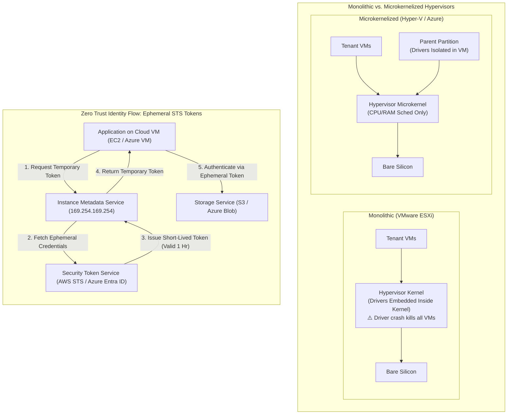

# Lecture 4: Hypervisor Architectures, IaaS Infrastructure Stack & Cloud IAM

**Course:** Cloud Computing (CCZG527 / CSIZG527 / SEZG527 / SSZG527 - BITS Pilani WILP)  
**Instructor:** Prof. Arun Vadekkedhil  
**Contact Session / Module:** Session 4: Hypervisors, IaaS Architecture, Global-to-Edge Continuum & Cloud IAM  
**Core Theme:** Architectural decomposition of the IaaS delivery model—bridging hypervisor kernel designs (Monolithic vs. Microkernel), levels of virtualization implementation (ISA to OS), the 5-layer IaaS stack (NIST SP 500-292 actors), global-to-edge continuum, and Zero Trust access governance via Cloud IAM across AWS and Azure.

---

## 1. The Big Picture (Why Should I Care?)

- **What is this lecture about?**  
  This lecture deconstructs how IaaS infrastructure is engineered from the physical kernel up to security governance: how hypervisors handle hardware drivers (monolithic vs. microkernel), the 5 levels where virtualization can be implemented (ISA, Hardware, OS, Library, Application), how cloud infrastructure extends from central datacenters to edge locations, and how Cloud IAM eliminates hardcoded passwords through temporary cryptographic tokens.
- **The Real-World Problem:**  
  *Incident 1:* In a monolithic hypervisor hosting 80 tenant VMs, a bug in a third-party storage controller driver causes a kernel panic, crashing the entire physical host and terminating all 80 VMs instantly.  
  *Incident 2:* A developer hardcodes a permanent cloud admin API key into a Python script and pushes it to a public GitHub repo. Within 3 minutes, botnets scrape the key and provision 450 GPU instances, racking up a **$68,400 bill over the weekend**. Modern IaaS prevents both: microkernel hypervisors isolate device drivers, and Cloud IAM replaces static keys with ephemeral STS tokens and Managed Identities.
- **Where this fits in the course:**  
  This concludes the virtualization and IaaS architecture modules (Sessions 1–4), paving the way for Session 5's deep-dive into hands-on cloud primitives (Compute, Storage, Networking, and Databases).

---

## 2. Core Concepts Explained Simply

### Concept 1: Hypervisor Architecture: Monolithic vs. Microkernelized

- **What is it?**  
  How a Type-1 bare-metal hypervisor manages physical hardware device drivers:
- **1. Monolithic Hypervisor (e.g., VMware ESXi):**  
  * Device drivers run directly inside the privileged hypervisor kernel address space.  
  * *Advantage:* Maximum I/O performance via direct in-memory function calls.  
  * *Fatal Flaw:* Large attack surface and zero driver fault isolation: **a crash in any third-party network or storage driver crashes the entire host and all tenant VMs**.
- **2. Microkernelized Hypervisor (e.g., Microsoft Hyper-V / Xen):**  
  * The core hypervisor kernel is minimal, handling only basic CPU scheduling and memory partitioning.  
  * Hardware device drivers are stripped out of the hypervisor and executed inside an isolated administrative partition: **Parent Partition** in Hyper-V (powers **Azure**) or **Domain 0 (Dom0)** in Xen.  
  * *Advantage:* Superior fault isolation: if a storage driver crashes, only the management partition restarts—tenant VMs continue running safely.
- **Dual-Cloud Mapping:**  
  *Azure:* **Microsoft Hyper-V (Microkernelized)**  
  *AWS:* **AWS Nitro System** (dedicated PCIe ASIC cards offloading hypervisor, network, and storage tasks).
- **Tech Quick-Primer:**
  > 💡 **Tech Quick-Primer (`AWS Nitro System`):** Custom hardware ASIC cards that offload virtualization, networking (VPC), and storage (EBS) from the host CPU, eliminating hypervisor overhead and driver crashes.

---

### Concept 2: Levels of Virtualization Implementation (From ISA to Application)

Virtualization can be implemented at 5 distinct architectural layers in the computing stack:

1. **Instruction Set Architecture (ISA) Level:**  
   Emulates an entire foreign CPU architecture in software (e.g., running x86 code on an ARM processor via QEMU/BOCHS). *Highly flexible, but has a massive 10x–100x execution slowdown.*
2. **Hardware-Level Virtualization (Hypervisors):**  
   Simulates physical hardware interfaces (vCPU, vRAM, vNIC) directly on silicon using Intel VT-x / AMD-V extensions (e.g., VMware ESXi, Hyper-V, KVM). *Delivers >95% bare-metal performance; the foundation of AWS EC2 and Azure VMs.*
3. **Operating System-Level Virtualization (Containers):**  
   The host OS kernel creates isolated user-space instances (containers) using Linux cgroups and namespaces (e.g., Docker, Kubernetes). *Near-zero overhead and sub-second startup, but all containers must share the host OS kernel.*
4. **Library-Level Virtualization:**  
   Intercepts API system calls and translates them to the host OS format (e.g., WINE translating Windows Win32 API calls to Linux POSIX calls).
5. **User-Application Level Virtualization:**  
   An application runtime environment running as a regular user process (e.g., Java Virtual Machine - JVM). Runs compiled bytecode portably across operating systems.

---

### Concept 3: The 5-Layer IaaS Stack & NIST SP 500-292 Actors

- **The 5-Layer IaaS Delivery Stack:**  
  1. *Physical Resource Layer:* Datacenter servers, storage arrays, network switches, cooling.  
  2. *Virtual Resource Layer:* vCPUs, virtual memory pools, virtual storage blocks created by hypervisors.  
  3. *Resource Abstraction & Control Layer:* Hypervisors, control planes, and schedulers (OpenStack, AWS Control Plane, ARM).  
  4. *Service Layer:* Exposed IaaS API interfaces (`POST /instances`, Azure VM provisioning).  
  5. *Access Layer:* Web portals, CLI tools, SDKs, and Terraform used by developers.
- **The 5 NIST SP 500-292 Actors:**
  * **Cloud Consumer:** The organization consuming cloud services.
  * **Cloud Provider:** The entity delivering the cloud infrastructure (AWS, Azure).
  * **Cloud Auditor:** An independent third party evaluating security, compliance, and privacy (e.g., SOC 2, HIPAA).
  * **Cloud Broker:** Manages the use, performance, and delivery of cloud services across multiple providers.
  * **Cloud Carrier:** The telecommunications provider facilitating network connectivity (e.g., AT&T, Tata Communications).

---

### Concept 4: The Global-to-Edge Infrastructure Continuum

- **What is it?**  
  Extending cloud computing from centralized hyperscale datacenters out to the physical edge where sub-10ms latency is required (e.g., automated robotics, smart factories, 5G applications).
- **The 4 Tiers of Cloud Presence:**
  1. **Regions:** Centralized geographical clusters containing 3+ isolated Availability Zones (e.g., `us-east-1` in AWS, `East US` in Azure).
  2. **Metro / Local Edge Zones:** Small cloud datacenter extensions placed in major metropolitan areas for single-digit millisecond latency (**AWS Local Zones** $\leftrightarrow$ **Azure Edge Zones**).
  3. **5G Telco Carrier Edge:** Cloud hardware embedded directly inside telecom 5G datacenters (**AWS Wavelength** $\leftrightarrow$ **Azure Public MEC**).
  4. **On-Premises Hardware Racks:** Physical cloud-managed hardware racks installed directly on-premises in a customer's private datacenter (**AWS Outposts** $\leftrightarrow$ **Azure Stack Hub & HCI**).

---

### Concept 5: Zero Trust Cloud IAM Architecture & Temporary STS Tokens

- **What is it?**  
  Identity and Access Management (IAM) is the security control plane governing *who* (Authentication) can perform *what action* on *which resource* (Authorization).
- **The Golden Rule: Never Use Permanent Static API Keys:**  
  Hardcoded access keys in code repositories lead to credential leaks. Modern cloud enforces **Zero Trust using temporary, dynamically rotated cryptographic tokens**.
- **How IAM Roles Work:**  
  Instead of embedding an API key inside an application on a VM, assign an **IAM Role (AWS)** or **Managed Identity (Azure)** to the compute resource. The instance metadata service automatically generates temporary STS security tokens, rotating them every few hours with zero credentials stored in source code.
- **Dual-Cloud Mapping:**  
  *AWS:* `AWS IAM Roles + Security Token Service (STS)`  
  *Azure:* `Azure Managed Identities + Microsoft Entra ID (Azure RBAC)`
- **Tech Quick-Primer:**
  > 💡 **Tech Quick-Primer (`Microsoft Entra ID`):** Microsoft's cloud-based identity and access management service (formerly Azure AD) that handles single sign-on, multi-factor authentication, and role-based access control across Azure resources.

---

## 3. Visual Architecture Models

### Hypervisor Architectures & Zero Trust IAM Token Flow

### Diagram Walkthrough:
* **Driver Isolation:** In the monolithic design, drivers share memory space with the hypervisor kernel; in the microkernelized design, drivers run inside an isolated management partition, preventing driver bugs from taking down the physical server.
* **Zero Static Credentials:** The application running on the VM never touches a hardcoded password. It requests short-lived credentials from the local Instance Metadata Service (`169.254.169.254`), which retrieves a cryptographic token from STS valid for 1 hour.

---

## 4. Key Comparisons & Trade-Offs

### Monolithic vs. Microkernelized Hypervisors

| Dimension | Monolithic Hypervisor (e.g., ESXi) | Microkernelized Hypervisor (e.g., Hyper-V) |
| :--- | :--- | :--- |
| **Driver Location** | Inside privileged hypervisor kernel | Inside isolated administrative Parent Partition / Dom0 |
| **Fault Isolation** | **Poor** (Driver crash takes down host & all VMs) | **Superior** (Driver crash only restarts parent domain) |
| **Hardware Compatibility** | Strict Hardware Compatibility List (HCL) | Broad (Any hardware supported by parent OS) |
| **Communication Mechanism** | Direct in-memory function calls | Secure Inter-Process Communication (IPC) |
| **Attack Surface** | Larger (hundreds of thousands of lines of driver code) | Minimal (microkernel handles only CPU and memory) |

### The 5 Levels of Virtualization Implementation

| Virtualization Level | Abstraction Point | Primary Examples | Performance Overhead | Best For |
| :--- | :--- | :--- | :--- | :--- |
| **1. ISA Level** | Machine instruction set | QEMU (emulation), BOCHS | **High (10x–100x slow)** | Emulating foreign CPU architectures |
| **2. Hardware Level** | Hardware silicon / hypervisor | Hyper-V, KVM, ESXi | **Near-zero (<5% overhead)** | Enterprise IaaS cloud infrastructure |
| **3. OS Level** | Operating system kernel | Docker, Linux LXC | **Negligible (Native speed)** | Microservices and rapid container scaling |
| **4. Library Level** | API system call interfaces | WINE | Low to Moderate | Running Windows applications on Linux |
| **5. Application Level** | User-space runtime bytecode | Java Virtual Machine (JVM) | Low to Moderate | Cross-platform language portability |

### Global-to-Edge Infrastructure Continuum (AWS $\leftrightarrow$ Azure)

| Tier | Latency Target | Amazon Web Services (AWS) | Microsoft Azure | Best Use Case |
| :--- | :--- | :--- | :--- | :--- |
| **Central Hyperscale** | >20ms | AWS Regions & AZs | Azure Regions & AZs | Core enterprise databases & web backends |
| **Metro Edge** | <10ms | AWS Local Zones | Azure Edge Zones | Real-time gaming, local media streaming |
| **5G Telco Edge** | <5ms | AWS Wavelength | Azure Public MEC | Connected autonomous vehicles, smart traffic |
| **On-Premises** | <2ms | AWS Outposts | Azure Stack Hub & HCI | Data residency compliance, smart factory robotics |

---

## 5. Professor's Practical Takeaways & Golden Rules

*(Key insights emphasized by Prof. Arun Vadekkedhil in lecture)*

1. **Driver Crashes are the #1 Cause of Host Panics:**  
   This is why Azure chose Microsoft Hyper-V's microkernelized architecture: isolating drivers into the Parent Partition ensures that hardware driver glitches never take down adjacent tenant workloads.
2. **Never Commit API Keys to Git:**  
   Automated botnets monitor GitHub commit streams in real time. Never hardcode AWS `access_key_id` or Azure client secrets in application configs. Always use **IAM Roles and Managed Identities**.
3. **Containers are Not Full Virtual Machines:**  
   OS-level virtualization (Docker) shares the underlying host Linux kernel. If your application requires a custom kernel patch or a different OS (e.g., Windows on Linux), you must use hardware-level virtualization (VMs).
4. **Choose Edge Locations Strictly for Latency:**  
   Deploying workloads to AWS Local Zones or Azure Edge Zones increases infrastructure management complexity. Only move workloads to the edge when sub-10ms network latency is an absolute business requirement.

---

## 6. Quick Recap & Terminology Cheatsheet

### Key Terms in 1 Line
* **Monolithic Hypervisor:** Hypervisor embedding hardware drivers directly inside the kernel; fast, but driver crashes crash the entire host.
* **Microkernelized Hypervisor:** Hypervisor containing only CPU/memory logic, isolating device drivers into an administrative partition (Hyper-V / Xen).
* **AWS Nitro System:** Custom PCIe hardware cards offloading virtualization, network, and storage tasks from host CPUs.
* **Hardware-Level Virtualization:** Simulating physical hardware via hypervisors directly on silicon using CPU hardware extensions (Intel VT-x / AMD-V).
* **OS-Level Virtualization:** Partitioning user spaces sharing a single host kernel using cgroups and namespaces (Containers).
* **IAM (Identity & Access Management):** Security system controlling authentication and resource authorization in the cloud.
* **STS (Security Token Service):** Cloud service issuing short-lived, dynamically rotated cryptographic credentials (AWS STS / Azure Entra ID).
* **Managed Identity:** An automatically managed identity in Microsoft Entra ID allowing Azure resources to authenticate without credentials in code.

### 4 Core Mental Rules to Remember
1. **Microkernels Protect Multi-Tenant Uptime:** Isolating drivers prevents a single device glitch from crashing adjacent customer VMs.
2. **Zero Hardcoded Credentials:** Always use IAM Roles and Managed Identities with temporary STS tokens.
3. **Containers Share the Kernel; VMs Bring Their Own:** Choose containers for speed; choose VMs for OS isolation and kernel customization.
4. **Edge is for Latency, Regions are for Scale:** Keep core data in central Regions; push to Local Zones and 5G MEC only for sub-10ms physics constraints.
