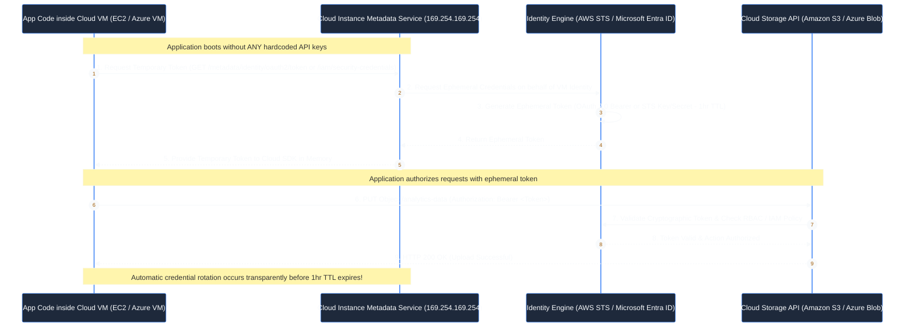

# Contact Session 4: Hypervisor Architectures, IaaS Infrastructure Stack & Cloud IAM

**Course:** Cloud Computing (CCZG527 / CSIZG527 / SEZG527 / SSZG527 - BITS Pilani WILP)  
**Instructor:** Prof. Arun Vadekkedhil  
**Contact Session / Module:** Contact Session 4: Hypervisors, IaaS Architecture, AWS & Azure Edge, and Cloud IAM  
**Core Theme:** Architectural decomposition of the IaaS delivery model—bridging hypervisor kernel designs (Monolithic vs Microkernel), levels of virtualization implementation (ISA to OS), the 5-layer IaaS stack (NIST SP 500-292 actors), global-to-edge continuum (**AWS $\leftrightarrow$ Azure**), and Zero Trust access governance via Cloud IAM (**AWS IAM & STS $\leftrightarrow$ Azure Entra ID & Managed Identities**).

---

## 1. Executive Overview & Problem Context (The 2-Minute Story)

### The 2-Minute Story: The 80-VM Host Crash & The $68,000 GitHub Leak
Consider two true production horror stories that shaped modern cloud infrastructure:

**Incident 1: The Monolithic Kernel Collapse (2012)**  
In an enterprise private cloud datacenter, a monolithic Type-1 hypervisor was running 80 production tenant virtual machines on a single dual-socket server chassis. A vendor released a firmware update for a 10 Gbps Fiber-Channel storage controller. Because monolithic hypervisors run all third-party hardware device drivers directly inside the privileged hypervisor kernel address space, a tiny null-pointer dereference inside the storage driver triggered a kernel panic. In less than a millisecond, the entire hypervisor crashed—instantly obliterating all 80 tenant workloads, corrupting active database writes, and causing an enterprise-wide cascading outage. This failure ignited the industry push toward **microkernelized hypervisors** (such as **Microsoft Hyper-V**) and hardware-offloaded architectures (**AWS Nitro System** and **Azure SmartNIC ASICs**).

**Incident 2: The $68,000 Git Commit (2019)**  
At 11:30 PM on a Friday, a developer working on a cloud backend microservice needed to test an object storage upload script. To bypass permission errors quickly, the developer created a permanent administrator access key and hardcoded it directly into their Python script. At 11:45 PM, they committed the code and pushed it to a public GitHub repository. 

Within **180 seconds**, automated botnets operated by crypto-mining cartels detected the commit via GitHub's public event stream. The botnet immediately called the cloud APIs, provisioning 450 GPU-accelerated compute instances across six global regions. By 7:00 AM Monday, the company had accumulated **$68,400 in unreserved compute charges**, and their primary cloud account was suspended.

These two catastrophic failures expose the twin imperatives of this lecture: **hypervisors must isolate device drivers to prevent single-component host crashes, and cloud platforms must enforce Zero Trust identity architectures using temporary, short-lived cryptographic tokens (AWS IAM Roles/STS $\leftrightarrow$ Azure Managed Identities) rather than permanent static API keys.**

```
[Incident 1: Monolithic Driver Crash]             [Incident 2: Hardcoded API Key Leak]
Buggy Storage Driver in Hypervisor Kernel         Permanent Admin Key Committed to GitHub
             │                                                 │
             ▼                                                 ▼
Null-Pointer Exception in Kernel Ring 0           Botnet Scrapes Key in 180 Seconds
             │                                                 │
             ▼                                                 ▼
Entire Physical Host Panics & Crashes             450 GPU Instances Launched Across 6 Regions
80 Enterprise Tenant VMs Die Instantly            $68,400 Cloud Bill Runaway Overnight
```

### The Core Problem / Pre-IaaS Bottlenecks
1. **Hypervisor Architectural Fragility:** Monolithic hypervisors contained hundreds of thousands of lines of third-party hardware driver code inside the core kernel. A single memory leak in a network driver compromised the security and availability of every VM on that host.
2. **The ISA Emulation Slowdown:** Running software compiled for one processor instruction set (e.g., x86) on different hardware required software instruction-by-instruction emulation (e.g., BOCHS), resulting in massive 10x to 100x execution slowdowns.
3. **Geographical Edge Latency:** Centralized hyperscale datacenters could not meet the sub-10ms latency requirements of real-time applications (autonomous vehicles, smart factory robotics, 5G mobile gaming).
4. **Permanent Credential Sprawl:** Traditional systems relied on long-lived static passwords and permanent API keys embedded in configuration files, creating massive attack surfaces for credential theft.

### The Architectural Solution
Modern Infrastructure as a Service resolves these challenges through clean separation of concerns across **AWS and Azure**:
- **Microkernelized Hypervisors:** Offload hardware device drivers to isolated, unprivileged management partitions (**Microsoft Hyper-V Parent Partition** $\leftrightarrow$ **Xen Dom0**), keeping the hypervisor kernel minimal, robust, and secure.
- **Hardware-Level Virtualization:** Leverages hardware extensions (Intel VT-x / AMD-V) to execute guest instructions directly on silicon, bypassing emulation overhead.
- **Global-to-Edge Infrastructure Continuum:** Extends cloud APIs seamlessly from centralized multi-datacenter Regions to metro Edge Zones, 5G carrier networks, and on-premises physical racks (**AWS Outposts** $\leftrightarrow$ **Azure Stack Hub & HCI**).
- **Zero Trust Identity & Access Management (IAM):** Replaces static credentials with ephemeral, dynamically generated cryptographic tokens issued via Identity Roles (**AWS IAM Roles & STS** $\leftrightarrow$ **Azure Managed Identities & Microsoft Entra ID**).

### Course Roadmap Placement
- **Sessions 1 & 2:** Cloud Computing Foundations, NIST SP 800-145, Service Models (IaaS/PaaS/SaaS), and Multi-Tenancy Governance.
- **Session 3:** Virtualization Foundations, Hypervisors (Type-1 vs Type-2), 4 Invariant Properties, and Virtual Disk Portability.
- **Session 4 (This Lecture):** Hypervisor Kernel Architectures, Levels of Virtualization, 5-Layer IaaS Stack, NIST SP 500-292 Actors, Global-to-Edge Infrastructure, and Cloud IAM.
- **Session 5 & Beyond:** Production IaaS Deep Dive (Compute, Networking, Storage Triad, Managed Databases, and Hyperscale Case Studies).

---

## 2. Core Concepts Explained Simply (with Tech Quick-Primers)

### 2.1 Hypervisor Architecture: Monolithic vs Microkernelized `[Slide 11, 12 | Transcript ~00:35:00 - ~00:45:00]`
- **What is it? (Intuition First):** A Type-1 bare-metal hypervisor must interact with physical motherboard chipsets, storage controllers, and network adapters. How it manages hardware device drivers divides hypervisors into two competing architectural schools: **Monolithic** and **Microkernelized**.

```
Monolithic Hypervisor (e.g., VMware ESXi)       Microkernelized Hypervisor (e.g., Microsoft Hyper-V / Xen)
┌─────────────────────────────────┐            ┌──────────────────────────────────────────────┐
│ Guest OS 1  │ Guest OS 2        │            │ Guest OS 1  │ Guest OS 2  │ Parent Partition │
├─────────────────────────────────┤            ├───────────────────────────┼──────────────────┤
│ Hypervisor Kernel               │            │ Hypervisor Microkernel    │ Device Drivers:  │
│ ┌─────────────────────────────┐ │            │ (CPU Sched & Memory Only) │ Storage, NIC, Bus│
│ │ Hardware Device Drivers:    │ │            └───────────────────────────┴──────────────────┘
│ │ Storage, NIC, Chipset       │ │                          ▲                      │
│ └─────────────────────────────┘ │                          └────── Secure IPC ────┘
├─────────────────────────────────┤            ┌──────────────────────────────────────────────┐
│ Physical Bare-Metal Silicon     │            │ Physical Bare-Metal Silicon                  │
└─────────────────────────────────┘            └──────────────────────────────────────────────┘
```

#### 1. Monolithic Hypervisors `[Slide 12]`
- **Architecture:** The hypervisor kernel directly hosts and executes all hardware device drivers inside its privileged kernel address space.
- **Mechanism:** Communication between the hypervisor kernel and device drivers occurs via high-speed, direct in-memory function calls.
- **Representative Examples:** **VMware ESXi**, classic monolithic Linux KVM.
- **Trade-Offs:**
  - *Advantage:* Maximum I/O performance and minimal communication latency.
  - *Disadvantages:* Large attack surface and code complexity. Strict Hardware Compatibility List (HCL)—unsupported physical hardware will not boot. Most critically, **a bug or crash in any third-party device driver brings down the entire hypervisor and all hosted VMs**.

#### 2. Microkernelized Hypervisors `[Slide 12]`
- **Architecture:** The core hypervisor kernel is kept extremely minimal (microkernel), containing only basic CPU scheduling and memory partitioning logic. Hardware device drivers are completely removed from the hypervisor and executed inside an isolated, privileged administrative virtual machine:
  - In **Microsoft Hyper-V** (powering **Azure**): Called the **Parent Partition** (running Windows Server / Azure host management stack).
  - In **Xen**: Called **Domain 0 (Dom0)**.
- **Mechanism:** Communication between the microkernel and drivers occurs via secure Inter-Process Communication (IPC) and message-passing across protected memory boundaries.
- **Representative Examples:** **Microsoft Hyper-V**, **Xen Project**, **seL4**.
- **Trade-Offs:**
  - *Advantages:* Minimal attack surface, superior fault isolation (if a network driver crashes, only the management domain restarts; tenant VMs survive), and broad hardware compatibility (any driver supported by the parent OS works automatically).
  - *Disadvantage:* Message-passing IPC introduces minor I/O latency compared to direct in-kernel function calls.

> 💡 **Tech Quick-Primer (`AWS Nitro System`):** A custom hardware architecture featuring dedicated PCIe ASIC chips that offloads virtualization, networking (VPC), and storage (EBS) tasks from the host CPU, eliminating hypervisor overhead (Azure counterpart: **Azure Accelerated Networking with SmartNIC FPGAs**).

---

### 2.2 Levels of Virtualization Implementation `[Slide 13, 14 | Transcript ~00:45:00 - ~00:55:00]`
Virtualization can be implemented at multiple different abstraction layers in the computer system hierarchy, trading off **Execution Performance**, **Architectural Flexibility**, and **Workload Isolation**:

```text
▲ [User App Level]       JVM, .NET CLR             --> Bytecode Portability | Low Isolation
│ [Runtime Library Level] WINE, vCUDA               --> API Hooking | Moderate Isolation
│ [OS Level]              Docker, FreeBSD Jails     --> Near-Native Speed | Shared Host Kernel
│ [Hardware/HAL Level]    Hyper-V, KVM, ESXi        --> High Performance | Hardware Sandboxing
▼ [ISA Level]             BOCHS, QEMU (Emulation)   --> Maximum Flexibility | 10x-100x Slowdown
```

1. **Instruction Set Architecture (ISA) Level (Emulation) `[Slide 13, 14]`:**
   - *Mechanism:* Translates binary machine code designed for one processor architecture (e.g., x86, ARM, RISC-V) into instructions for another physical processor instruction-by-instruction in software.
   - *Examples:* **BOCHS** (demonstrated in Slide 14), QEMU (pure emulation mode), Rosetta 2.
   - *Trade-Off:* Maximum flexibility, but **abysmal performance** (10x to 100x execution slowdown).
2. **Hardware Abstraction Layer (HAL) / Hardware-Level Virtualization `[Slide 13]`:**
   - *Mechanism:* Virtualizes physical hardware interfaces (CPU, MMU, storage controllers). Guest OS machine instructions execute directly on physical CPU silicon.
   - *Examples:* **Microsoft Hyper-V (Azure)**, **Linux KVM (GCP/AWS)**, **VMware ESXi**.
   - *Trade-Off:* High performance and complete OS isolation, but requires compatible physical CPU silicon (VT-x/AMD-V).
3. **Operating System-Level Virtualization (Containers) `[Slide 13]`:**
   - *Mechanism:* The host operating system kernel creates multiple isolated user-space execution environments (containers) sharing a single host kernel via Linux namespaces and cgroups.
   - *Examples:* **Docker, Containerd, LXC, Podman**.
   - *Trade-Off:* Near-native bare-metal speed and sub-second boot times, but **shared kernel vulnerability** (a host kernel panic crashes all containers).
4. **Runtime Library Level `[Slide 13]`:**
   - *Mechanism:* Intercepts application API calls and dynamically translates them to the host OS API without running a virtual guest OS.
   - *Examples:* **WINE** (translating Windows Win32 API calls to POSIX on Linux).
5. **User Application Level `[Slide 13]`:**
   - *Mechanism:* Applications compile to abstract intermediate bytecode executed by a virtual runtime engine.
   - *Examples:* **Java Virtual Machine (JVM), Microsoft .NET Common Language Runtime (CLR)**.

> 💡 **Tech Quick-Primer (`eBPF`):** A revolutionary Linux kernel technology that allows developers to run sandboxed programs directly inside the OS kernel without modifying kernel source code or loading kernel modules, widely used for high-performance cloud networking and observability across AWS and Azure.

---

### 2.3 The 5-Layer IaaS Architecture Stack `[Slide 16, 17 | Transcript ~01:15:00 - ~01:25:00]`
The end-to-end technical blueprint of an Infrastructure as a Service platform traces how raw datacenter silicon is transformed into programmable, self-service cloud APIs:

1. **Layer 1: Physical Infrastructure Layer:** High-density bare-metal server chassis, multi-terabyte storage arrays, top-of-rack spine-leaf switches, power distribution units, and datacenter cooling.
2. **Layer 2: Virtualization Layer:** Bare-metal hypervisors (**Microsoft Hyper-V, KVM, AWS Nitro**) that carve physical silicon into virtual CPUs, virtual memory, and virtual network interfaces.
3. **Layer 3: Resource Pool / Abstraction Layer:** Aggregates individual virtual resources across thousands of physical servers into centralized, software-defined resource pools (Compute Pools, Storage Pools, Network Pools) independent of physical host locations.
4. **Layer 4: Core Management / Orchestration Layer (The Cloud Manager):** The operational brain of the cloud. Houses the **Scheduler** (determining physical node placement), **VM Lifecycle Manager** (provisioning, migration, teardown), **Capacity Manager**, **SLA Monitor**, and **Metering Engine** (**Azure Resource Manager [ARM]** $\leftrightarrow$ **AWS Cloud Controller**).
5. **Layer 5: Service / Access Layer:** The consumer touchpoint. The only layer external users interact with via **Self-Service Web Consoles** (Azure Portal / AWS Console), **RESTful APIs**, **Command Line Interfaces (CLIs)** (`az` / `aws`), and developer **SDKs**.

**Cross-Cutting Concerns (Slide 17):** Critical enterprise operational services that span across all five layers simultaneously: **Identity & Access Management (IAM / Microsoft Entra ID)**, **Network Security (VPCs / VNets, NSGs, Firewalls)**, **Monitoring & Telemetry (Azure Monitor / CloudWatch)**, and **Billing & Cost Management**.

---

### 2.4 NIST SP 500-292: Cloud Reference Architecture Actors `[Slide 20–23 | Transcript ~01:25:00 - ~01:35:00]`
NIST Special Publication 500-292 establishes the five canonical actors that govern enterprise cloud ecosystems:

```text
┌────────────────────────────────────────────────────────────────────────┐
│             NIST SP 500-292: THE 5 CLOUD ACTORS                        │
├──────────────────┬──────────────────┬──────────────────────────────────┤
│ 1. Cloud Consumer│ 2. Cloud Provider│ 3. Cloud Broker                  │
│    (End Tenant)  │    (Azure/AWS/GCP│    (Aggregator / Arbitrage)      │
├──────────────────┴──────────────────┼──────────────────────────────────┤
│ 4. Cloud Auditor                    │ 5. Cloud Carrier                 │
│    (SOC 2 / ISO Security Audits)    │    (Telecom / ISP Fiber Links)   │
└─────────────────────────────────────┴──────────────────────────────────┘
```

1. **Cloud Consumer:** The organization or individual that maintains a business relationship with, and uses services from, a Cloud Provider.
2. **Cloud Provider:** The entity responsible for making a service available to interested parties (**Microsoft Azure, AWS, Google Cloud**).
3. **Cloud Broker:** An entity that manages the use, performance, and delivery of cloud services, negotiating relationships between Cloud Providers and Cloud Consumers.
   - *The 3 Cloud Broker Sub-Roles (Slide 23):*
     - **Service Intermediation:** Enhances a given service by improving capabilities (e.g., adding an enterprise SSO identity layer, API security wrapper, or automated billing dashboard on top of Azure/AWS).
     - **Service Aggregation:** Combines and integrates multiple distinct cloud services into one or more new composite services (e.g., combining Azure compute, Twilio SMS messaging, and Stripe payment processing into a single SaaS platform).
     - **Service Arbitrage:** Dynamically compares multiple competing cloud providers to select the best cost, latency, or performance for a specific workload (e.g., automatically routing machine learning batch jobs to whichever cloud provider currently offers the cheapest GPU Spot/Preemptible instance).
4. **Cloud Auditor:** An independent party that can conduct objective assessments of cloud services, information system operations, performance, and security compliance (e.g., verifying SOC 2 Type II, ISO 27001, HIPAA, or PCI-DSS certifications).
5. **Cloud Carrier:** The intermediary that provides connectivity and transport of cloud services from Cloud Providers to Cloud Consumers (e.g., Tata Communications, AT&T, Verizon providing physical fiber cables and Internet transit).

---

### 2.5 Global-to-Edge Infrastructure Continuum: AWS $\leftrightarrow$ Azure `[Slide 26–28 | Transcript ~01:30:00 - ~01:42:00]`
Modern cloud computing is no longer confined to massive central datacenters. Both AWS and Azure deploy a tiered geographic continuum to satisfy varying latency and data residency requirements:

```
Central Cloud ──────────────────────────────────────────────────────────► Metro Edge ──► 5G Tower ──► On-Prem
[AWS Regions] ────► [Availability Zones] ────► [Local Zones] ────► [Wavelength] ────► [Outposts]
      │                     │                       │                   │                  │
      ▼                     ▼                       ▼                   ▼                  ▼
[Azure Regions] ──► [Azure Avail Zones] ──► [Azure Edge Zones] ─► [Public MEC] ───► [Azure Stack Hub]
```

1. **Global Regions `[Slide 26]`:** Geographically isolated areas around the world (**AWS Regions** $\leftrightarrow$ **Azure Regions**, e.g., `us-east-1` $\leftrightarrow$ `East US`) containing multiple physical datacenters.
2. **Availability Zones (AZs) `[Slide 26]`:** Discrete physical datacenters with redundant power, cooling, and networking within a Region, connected via low-latency private fiber (<2ms round-trip latency) for fault isolation (**AWS AZs** $\leftrightarrow$ **Azure Availability Zones**).
3. **Metro Edge Zones `[Slide 27]`:** Extensions of cloud infrastructure into major metropolitan population centers to deliver single-digit millisecond latency for video rendering, real-time gaming, and financial trading (**AWS Local Zones** $\leftrightarrow$ **Azure Edge Zones**).
4. **5G Carrier Edge Compute `[Slide 27]`:** Embeds cloud compute and storage services directly inside telecommunications providers' 5G mobile network edge datacenters for sub-10ms mobile latency (**AWS Wavelength** $\leftrightarrow$ **Azure Public MEC [Multi-access Edge Compute]**).
5. **On-Premises Managed Hardware `[Slide 28]`:** Physical hardware racks installed directly inside a customer's on-premises private datacenter, managed remotely by the cloud provider (**AWS Outposts** $\leftrightarrow$ **Azure Stack Hub / Azure Stack HCI**). Mandatory for strict low-latency manufacturing systems and sovereign data residency laws.

> 💡 **Tech Quick-Primer (`Azure Stack Hub`):** An on-premises physical hardware appliance that brings native Azure IaaS and PaaS services, APIs, and management directly into your private enterprise datacenter (AWS equivalent: **AWS Outposts**).

---

### 2.6 Cloud IAM: Zero Trust Identity Governance `[Slide 30–35 | Transcript ~01:42:00 - ~01:58:00]`
- **What is it? (Intuition First):** Identity and Access Management (IAM) is the central security control plane of the cloud. It enforces the security principle: **Authenticate first, then Authorize under the Principle of Least Privilege**.
- **AuthN vs AuthZ (The Core Distinction):**
  - **Authentication (AuthN):** *Who are you?* Verifying identity via passwords, SSH keys, Multi-Factor Authentication (MFA), or cryptographic certificates.
  - **Authorization (AuthZ):** *What are you permitted to do?* Evaluating whether an authenticated principal has permission to perform a specific action on a specific resource.
- **Dual-Cloud Rosetta Stone: AWS IAM vs Azure RBAC & Entra ID:**
  - In **AWS**: Governed by **AWS IAM** policies (declarative JSON), IAM Users, IAM Groups, and IAM Roles.
  - In **Azure**: Identity is managed by **Microsoft Entra ID (formerly Azure Active Directory)**. Permissions are evaluated via **Azure Role-Based Access Control (Azure RBAC)**, assigning built-in or custom Role Definitions (Owner, Contributor, Reader) to Security Principals scoped to a Management Group, Subscription, Resource Group, or Resource.
- **Workload Identity: The Elimination of Static API Keys:**
  - *The Old Fragile Way:* Embedding static API access keys in application config files.
  - *The Modern Cloud-Native Way:*
    - In **AWS**: Compute instances assume an **IAM Role**. The **AWS Security Token Service (STS)** automatically generates temporary cryptographic credentials (1-hour TTL) fetched via the Instance Metadata Service (IMDS: `169.254.169.254`).
    - In **Azure**: Compute instances use **Azure Managed Identities** (System-Assigned or User-Assigned). The application code queries the local Azure IMDS endpoint (`http://169.254.169.254/metadata/identity/oauth2/token`), and Microsoft Entra ID returns an ephemeral OAuth 2.0 bearer token automatically rotated in memory.
- > 💡 **Tech Quick-Primer (`Azure Managed Identity`):** A feature of Microsoft Entra ID that provides Azure resources (VMs, App Services, AKS) with an automatically managed identity, eliminating the need for developers to manage credentials or API keys (AWS equivalent: **AWS IAM Roles for EC2 & STS**).

---

## 3. Visual Architectural / System Models

### Model 1: Monolithic vs Microkernelized Hypervisor Driver Isolation
*This dark-mode schematic contrasts kernel memory layouts, revealing why monolithic hypervisors are vulnerable to total host panics while microkernelized designs (such as Microsoft Hyper-V) isolate driver failures based on Slide 11 and 12.*

```mermaid
%%{init: {'theme': 'base', 'themeVariables': { 'darkMode': true, 'background': '#0f172a', 'primaryColor': '#1e293b', 'primaryTextColor': '#f8fafc', 'primaryBorderColor': '#3b82f6', 'lineColor': '#60a5fa', 'secondaryColor': '#334155', 'tertiaryColor': '#1e293b' }}}%%
graph TB
    subgraph Mono["Monolithic Hypervisor (e.g., VMware ESXi)"]
        subgraph Mono_VMs["Tenant VMs"]
            M_VM1["Tenant VM 1"]
            M_VM2["Tenant VM 2"]
        end
        subgraph Mono_Kernel["Privileged Hypervisor Kernel Address Space"]
            M_Core["CPU Sched & MMU"]
            M_Driver["Third-Party Storage / NIC Driver<br/>⚠️ Null Pointer / Memory Leak"]
        end
        M_HW["Physical Bare-Metal Silicon"]

        M_VM1 --> Mono_Kernel
        M_VM2 --> Mono_Kernel
        Mono_Kernel --> M_HW
        M_Driver -.->|Crash in Driver| Crash["FATAL KERNEL PANIC<br/>Entire Host Dies! All VMs Terminate!"]
    end

    subgraph Micro["Microkernelized Hypervisor (e.g., Microsoft Hyper-V / Xen)"]
        subgraph Micro_VMs["Tenant VMs"]
            U_VM1["Tenant VM 1"]
            U_VM2["Tenant VM 2"]
        end
        subgraph Micro_Dom0["Parent Partition / Dom0 (Isolated Management VM)"]
            U_Driver["Third-Party Storage / NIC Driver<br/>⚠️ Driver Crash Isolated Here"]
        end
        subgraph Micro_Core["Minimal Hypervisor Microkernel"]
            U_Sched["Minimal CPU Scheduling & Memory Partitioning Only"]
        end
        U_HW["Physical Bare-Metal Silicon"]

        U_VM1 --> Micro_Core
        U_VM2 --> Micro_Core
        Micro_Dom0 -->|Secure IPC| Micro_Core
        Micro_Core --> U_HW
        U_Driver -.->|Crash in Driver| Safe["Parent Partition Restarts Driver<br/>Tenant VMs Keep Running!"]
    end

    style Mono fill:#0f172a,stroke:#ef4444,color:#f8fafc
    style Micro fill:#0f172a,stroke:#10b981,color:#f8fafc
    style Mono_Kernel fill:#7f1d1d,stroke:#ef4444,color:#fef2f2
    style Crash fill:#991b1b,stroke:#ef4444,color:#ffffff
    style Micro_Dom0 fill:#1e293b,stroke:#f59e0b,color:#f8fafc
    style Micro_Core fill:#064e3b,stroke:#10b981,color:#ecfdf5
    style Safe fill:#065f46,stroke:#10b981,color:#ffffff
```



---

### Model 2: The 5-Layer IaaS Architecture Stack & Cross-Cutting Control Plane
*This model visualizes the end-to-end IaaS architecture from raw silicon to public APIs across AWS and Azure based on Slide 17.*

```mermaid
%%{init: {'theme': 'base', 'themeVariables': { 'darkMode': true, 'background': '#0f172a', 'primaryColor': '#1e293b', 'primaryTextColor': '#f8fafc', 'primaryBorderColor': '#3b82f6', 'lineColor': '#60a5fa', 'secondaryColor': '#334155', 'tertiaryColor': '#1e293b' }}}%%
graph TB
    subgraph IaaS["Enterprise IaaS Architecture Blueprint (AWS & Azure)"]
        L5["5. Service / Access Layer (Azure Portal, AWS Console, CLI 'az'/'aws', REST APIs, SDKs)"]
        L4["4. Core Management Layer (Azure Resource Manager [ARM] / AWS Cloud Manager, Schedulers)"]
        L3["3. Resource Pool Layer (Software-Defined Compute, Storage & Network Pools)"]
        L2["2. Virtualization Layer (Type-1 Hypervisors: Microsoft Hyper-V, KVM, AWS Nitro)"]
        L1["1. Physical Infrastructure (Bare-Metal Servers, SAN Arrays, Spine-Leaf Network)"]

        subgraph CrossCut["Cross-Cutting Governance Services (Span All 5 Layers)"]
            IAM["Identity & Access Management (Microsoft Entra ID / AWS IAM)"]
            NetSec["Network Security (Azure VNets & NSGs / AWS VPC & SGs)"]
            Telemetry["Telemetry & Logging (Azure Monitor / AWS CloudWatch)"]
            Billing["Billing & FinOps (Microsoft Cost Management / AWS Budgets)"]
        end
    end

    L5 --> L4
    L4 --> L3
    L3 --> L2
    L2 --> L1

    CrossCut -.-> L5
    CrossCut -.-> L4
    CrossCut -.-> L3
    CrossCut -.-> L2
    CrossCut -.-> L1

    style L5 fill:#1e293b,stroke:#3b82f6,color:#f8fafc
    style L4 fill:#1e293b,stroke:#3b82f6,color:#f8fafc
    style L3 fill:#1e293b,stroke:#3b82f6,color:#f8fafc
    style L2 fill:#1e293b,stroke:#3b82f6,color:#f8fafc
    style L1 fill:#1e293b,stroke:#64748b,color:#f8fafc
    style CrossCut fill:#0f172a,stroke:#f59e0b,stroke-width:2px,color:#f8fafc
    style IAM fill:#1e293b,stroke:#f59e0b,color:#f8fafc
    style NetSec fill:#1e293b,stroke:#f59e0b,color:#f8fafc
    style Telemetry fill:#1e293b,stroke:#f59e0b,color:#f8fafc
    style Billing fill:#1e293b,stroke:#f59e0b,color:#f8fafc
```



---

### Model 3: Zero Trust Workload Identity & Ephemeral Token Flow
*This sequence model traces how workloads authenticate securely using dynamic Managed Identities / IAM Roles and short-lived tokens rather than static API keys based on Slide 34 and 35.*



---

## 4. Key Trade-Offs & Comparisons

### 4.1 The Cloud Architect's Rosetta Stone (Lecture 4 Primitives)

| Domain | Architectural Concept | AWS Implementation (Slide Context) | Azure Equivalent (Practitioner Context) |
| :--- | :--- | :--- | :--- |
| **Microkernel VMM** | Isolated Parent Partition | **Xen (Dom0)** | **Microsoft Hyper-V (Parent Partition)** |
| **IaaS Management** | Orchestration control plane | **AWS Cloud Controller** | **Azure Resource Manager (ARM)** |
| **Identity Service**| Directory & AuthN | **AWS IAM** | **Microsoft Entra ID (Azure AD)** |
| **Authorization** | Permission Governance | **IAM Policies (JSON)** | **Azure RBAC (Role Definitions & Assignments)**|
| **Workload Tokens** | Ephemeral credential service| **AWS STS (Security Token Service)**| **Azure Managed Identities (MSI)** |
| **Metro Edge** | Low-latency metro cloud | **AWS Local Zones** | **Azure Edge Zones** |
| **5G Carrier Edge** | Mobile network embedded | **AWS Wavelength** | **Azure Public MEC (Multi-access Edge Compute)**|
| **On-Premises Rack**| Fully managed local hardware| **AWS Outposts** | **Azure Stack Hub / Azure Stack HCI** |

---

### 4.2 Structured Comparison: Hypervisor Kernel Architectures

| Dimension | Monolithic Hypervisor (e.g., VMware ESXi) | Microkernelized Hypervisor (e.g., Microsoft Hyper-V / Xen) |
| :--- | :--- | :--- |
| **Driver Location** | **Inside Hypervisor Kernel (Ring 0)** | **Isolated in Parent Partition / Dom0** |
| **Kernel Codebase Size**| Very Large (>200,000 lines of code) | **Extremely Minimal (<20,000 lines of code)** |
| **Fault Isolation** | Poor (Driver panic crashes entire host) | **Excellent (Driver crash isolated to Dom0/Parent)** |
| **Hardware Compatibility**| Strict Hardware Compatibility List (HCL) | Wide (Supports standard parent OS drivers) |
| **I/O Communication** | Direct in-memory function calls | Secure IPC / Message-passing across memory |
| **I/O Latency** | **Sub-microsecond (Lowest Latency)** | Slightly higher due to IPC context switching |
| **Security Attack Surface**| Large (Exploits in drivers gain kernel root)| Minimal (Hypervisor microkernel is tiny) |

---

### 4.3 Structured Comparison: Levels of Virtualization Implementation

| Implementation Level | Performance | Isolation | Architectural Flexibility | Representative Production Tech |
| :--- | :--- | :--- | :--- | :--- |
| **Instruction Set (ISA)** | Lowest (10x-100x slow)| High | **Maximum** (Run any OS on any CPU) | BOCHS, QEMU Emulation |
| **Hardware Abstraction (HAL)**| **High (Near-Native)**| **Maximum** | Moderate (Requires compatible CPU) | Microsoft Hyper-V, KVM, ESXi |
| **Operating System (OS)** | **Maximum (Bare-Metal)**| Moderate | Low (Constrained to host kernel) | Docker, Containerd, Podman |
| **Runtime Library** | High | Low | Low (Constrained to API parity) | WINE, vCUDA |
| **User Application** | Moderate | Low | High (Any system with JVM/.NET) | Java Virtual Machine, .NET CLR |

---

### 4.4 Production Failure Modes & Anti-Patterns

1. **The Static Hardcoded API Key Antipattern (The GitGuardian Alarm):**
   - *Failure Mode:* An engineer bakes permanent cloud access keys into Docker images or git repositories. Malicious actors scrape the keys and launch hundreds of unauthorized compute instances within minutes.
   - *Production Remediation:* Ban static access keys for application workloads. Use **Azure Managed Identities** or **AWS IAM Roles for EC2 / IRSA**, allowing workloads to fetch dynamic, short-lived tokens that auto-rotate hourly via the local IMDS (`169.254.169.254`).

2. **The Wildcard Permission Anti-Pattern (`Action: "*"` / `Contributor` at Subscription Root):**
   - *Failure Mode:* An administrator assigns `Contributor` at the Azure Subscription root or `"Action": "*"` in AWS to fix permission errors during development. A compromised web application allows an attacker to dump all production storage buckets, delete databases, and create back-door administrative accounts.
   - *Production Remediation:* Enforce the **Principle of Least Privilege**. Scope Azure Role Assignments down to Resource Groups or specific Resources, or scope AWS IAM actions to exact ARNs.

---

## 5. Professor's Practical Tips & Oral Insights

*(Extracted directly from Prof. Arun Vadekkedhil's spoken classroom transcript)*

### 5.1 Real-World Engineering Insights
- **Hardware Offload is the Future of Hyperscale Virtualization `[Transcript ~00:43:20]`:**
  - While academic textbooks debate monolithic versus microkernelized software hypervisors, hyperscalers solved this dilemma by moving virtualization into hardware silicon. The **AWS Nitro System** and **Azure SmartNIC FPGAs** offload network routing, block storage management, and security monitoring onto custom physical ASIC chips, allowing 100% of the host server's CPU cores and RAM to be allocated directly to tenant VMs with zero hypervisor CPU overhead.
- **Why Cloud Brokers Exist in Modern Enterprise `[Transcript ~01:28:40]`:**
  - Enterprises rarely interact with a single cloud provider in isolation. Large multinationals use Cloud Brokers for **Service Arbitrage**—running compute workloads on whichever provider offers the cheapest spot rates, while using Broker dashboards to enforce unified security compliance across Azure, AWS, and Google Cloud simultaneously.

### 5.2 Common Misconceptions & Traps
- **Trap 1: "Authentication and Authorization are the Same Thing" `[Transcript ~01:45:10]`:**
  - Prof. Arun emphasizes: *"AuthN is proving who you are; AuthZ is proving what you are allowed to touch."* A user can be 100% authenticated via Entra ID MFA, but if their Azure RBAC role does not contain an explicit assignment for `Microsoft.Storage/storageAccounts/blobServices/containers/delete`, their request is immediately rejected.
- **Trap 2: "Containers Provide the Same Security as Virtual Machines" `[Transcript ~00:52:15]`:**
  - OS-level containerization (Docker) shares the single underlying host Linux kernel. A kernel privilege-escalation vulnerability (e.g., Dirty COW) allows a containerized process to escape the container and compromise the entire host. Virtual machines provide hardware-enforced MMU memory sandboxing, making cross-VM breakout exponentially more difficult.

### 5.3 Student Questions & Classroom Debates
- **Q: Why did BOCHS and pure ISA emulation fail in enterprise datacenters? `[Transcript ~00:48:30]`**
  - **Prof. Arun's Explanation:** Speed. Software emulation decodes machine instructions instruction-by-instruction in software loops. Running an operating system on an emulator incurs a 10x to 100x performance penalty. It is useful for processor hardware developers testing new chip architectures, but completely unusable for production enterprise workloads.
- **Q: Can an IAM Role or Managed Identity be assigned to a human employee? `[Transcript ~01:52:00]`**
  - **Prof. Arun's Explanation:** Yes! In modern enterprise environments, humans do not log in with permanent accounts. They log in to corporate identity providers (Microsoft Entra ID, Okta) and **assume** an enterprise Role via SAML 2.0 or OpenID Connect federation, receiving temporary short-lived credentials.

### 5.4 Exam Guidance & BITS Pilani Cautions
- **The NIST SP 500-292 Actor Matrix (Mid-Sem Exam):**
  - Be prepared to state the 5 actors and specifically define the 3 sub-roles of the **Cloud Broker** (Intermediation, Aggregation, Arbitrage). This is a frequent 3-mark question.
- **Exam Bridge Callout (AWS vs Azure):**
  > ⚠️ **Exam Keyword Warning:** In questions on Cloud IAM, use the exact **AWS terms** from the professor's slides (**AWS IAM, IAM Roles, STS, Policy JSON**) for examiner rubrics, while understanding that this functions identically to **Azure Managed Identities and Azure RBAC**. When asked about Edge infrastructure, cite **AWS Outposts, Local Zones, and Wavelength** (with Azure Stack / MEC in mind).

---

## 6. Exam-Ready Question Bank

### Part A: Conceptual & Short-Answer Questions (Mid-Sem Closed-Book: 2–3 Marks Each)

#### Q1: Differentiate between Monolithic and Microkernelized hypervisors regarding device driver architecture and fault tolerance.
**Model Answer:**  
- **Monolithic Hypervisor (e.g., VMware ESXi):** Hosts all hardware device drivers directly inside the privileged hypervisor kernel address space. Provides high I/O performance via direct function calls, but suffers from poor fault tolerance—a crash or memory leak in a third-party driver panics the entire hypervisor and terminates all tenant VMs.
- **Microkernelized Hypervisor (e.g., Microsoft Hyper-V / Xen):** Contains only a minimal core kernel (CPU scheduling and memory partitioning). Hardware device drivers are isolated inside a dedicated administrative virtual machine (Parent Partition in Hyper-V / Dom0 in Xen). If a driver crashes, only the driver host restarts; tenant virtual machines continue executing unaffected.  
*(Scoring: 1.5 marks for driver placement, 1.5 marks for fault tolerance comparison - Total: 3 Marks)*

---

#### Q2: Enumerate the 5 canonical cloud actors defined in NIST SP 500-292 and explain the role of the Cloud Auditor.
**Model Answer:**  
The 5 actors are:
1. **Cloud Consumer**
2. **Cloud Provider**
3. **Cloud Broker**
4. **Cloud Auditor**
5. **Cloud Carrier**

**Cloud Auditor Role:** An independent entity that conducts objective assessments of cloud services, information system operations, security posture, privacy impact, and performance to verify compliance with regulatory standards (e.g., SOC 2, ISO 27001, HIPAA, FedRAMP).  
*(Scoring: 1.5 marks for 5 actors, 1.5 marks for Auditor definition - Total: 3 Marks)*

---

#### Q3: Contrast Authentication (AuthN) and Authorization (AuthZ) in cloud security architecture.
**Model Answer:**  
- **Authentication (AuthN):** The process of verifying the identity of a principal (user, service, or machine). Answers *"Who are you?"* via credentials, passwords, cryptographic certificates, or MFA tokens (e.g., via Microsoft Entra ID or AWS IAM).
- **Authorization (AuthZ):** The process of determining whether an authenticated principal is granted permission to perform a specific action on a designated resource. Answers *"What are you allowed to do?"* by evaluating declarative IAM policies and role-based access controls (Azure RBAC / AWS IAM Policies).  
*(Scoring: 1.5 marks for AuthN, 1.5 marks for AuthZ - Total: 3 Marks)*

---

#### Q4: Why are IAM Roles with temporary credentials preferred over IAM Users with permanent API Access Keys for cloud application workloads?
**Model Answer:**  
IAM Users rely on permanent static Access Keys, which are vulnerable to source code leaks, credential theft, and require manual rotation. IAM Roles (**AWS IAM Roles & STS** $\leftrightarrow$ **Azure Managed Identities**) generate ephemeral, short-lived cryptographic credentials via the Security Token Service / Entra ID with a short Time-To-Live (typically 1 hour). These credentials rotate automatically in memory via the Instance Metadata Service (`169.254.169.254`), eliminating hardcoded secrets and drastically shrinking the blast radius of potential credential compromise.  
*(Scoring: 1.5 marks for static key vulnerability, 1.5 marks for ephemeral token rotation - Total: 3 Marks)*

---

### Part B: Scenario-Based, Architectural & Analytical Questions (Comprehensive Open-Book: 5–10 Marks Each)

#### Scenario Question 1 (10 Marks): Low-Latency Edge Healthcare Analytics Architecture
**Scenario:**  
"SurgicalVision Inc." is deploying an AI-assisted robotic surgery guidance system. The architecture requires real-time computer vision inference on live 4K endoscopic video streams. The technical requirements and constraints are:
1. Video inference latency between the operating room cameras and AI inference nodes must be **under 8 milliseconds** to prevent surgical errors.
2. Patient biometric imaging data must remain within the hospital premises to comply with national health sovereignty regulations.
3. The centralized enterprise analytics team requires access to aggregated, anonymized surgical outcome metrics via centralized cloud APIs for long-term model training.
4. Application compute instances running in the operating room must authenticate securely to cloud object storage to push telemetry without storing static API keys on the edge hardware.

Design an end-to-end cloud and edge infrastructure architecture utilizing the Global-to-Edge infrastructure continuum (**AWS & Azure**) and Cloud IAM. Justify your selection of edge deployment models and detail the security token pipeline.

**Detailed Model Answer & Scoring Breakdown:**

##### 1. Edge Infrastructure Selection & Justification (4 Marks)
- **Selection: On-Premises Managed Hardware Rack (AWS Outposts / Azure Stack Hub):**
  - *Ultra-Low Latency (<8ms):* Running AI inference models on centralized public cloud regions incurs network round-trip latencies of 40–80ms over the public Internet, violating surgical safety SLAs. **AWS Outposts / Azure Stack Hub** provides native cloud compute (virtual machines with GPU acceleration) physically installed in the hospital datacenter, connected via direct local fiber to surgical equipment to deliver <2ms execution latency.
  - *Data Sovereignty Compliance:* Raw video streams and un-anonymized patient biometric data are processed and stored locally on the on-premises hardware rack, ensuring data never crosses the hospital network boundary.
- **Centralized Aggregation Pipeline:** Anonymized model metrics are asynchronously pushed over dedicated private fiber connections (**AWS Direct Connect** $\leftrightarrow$ **Azure ExpressRoute**) to centralized object storage (**Amazon S3** $\leftrightarrow$ **Azure Blob Storage**) in the primary cloud Region for long-term machine learning training.

##### 2. Zero Trust Identity & Ephemeral Credential Pipeline (3 Marks)
- **Workload Identity Architecture:**
  1. Edge compute nodes use an **IAM Role via AWS IAM Roles Anywhere** or **Azure Arc-enabled Servers with Managed Identities**, leveraging the hospital's local X.509 Public Key Infrastructure (PKI) certificates to establish cryptographic trust with the cloud.
  2. Edge inference processes exchange local certificates with the cloud token service to obtain temporary, 1-hour cryptographic credentials.
  3. The edge nodes sign object storage telemetry upload requests using dynamic tokens. Zero static API keys or passwords reside on the physical edge servers.

##### 3. Failure Mode & Disaster Mitigation (3 Marks)
- **Local Network Survivability:** If the hospital's external WAN connection to the cloud Region is severed, the on-premises hardware rack (Outposts / Azure Stack) continues running local inference pipelines autonomously without interrupting active surgeries.
- **Least-Privilege Policy:** The edge role is restricted strictly to write operations on the specific telemetry storage container with enforced TLS.

##### Scoring Keywords Checklist for Examiners:
- [x] *On-premises managed rack deployment (AWS Outposts / Azure Stack Hub)*
- [x] *Sub-8ms latency justification via local edge execution*
- [x] *Data sovereignty / local storage compliance*
- [x] *Ephemeral token rotation (AWS STS / Azure Managed Identity)*
- [x] *Elimination of static API keys*
- [x] *WAN disconnect local survivability*

---

#### Scenario Question 2 (5 Marks): Cloud Broker Service Selection for Multi-Cloud Cost Optimization
**Scenario:**  
A global media streaming platform executes massive daily video transcoding batch jobs that require thousands of CPU cores. The engineering team observes that AWS, Microsoft Azure, and Google Cloud offer varying Spot/Preemptible instance prices throughout the day depending on regional datacenter capacity fluctuations. 

Explain how the organization can implement a **Cloud Broker** architecture leveraging the three NIST broker sub-roles (Intermediation, Aggregation, Arbitrage) to minimize computational expenditure while maintaining SLA deadlines across AWS and Azure.

**Detailed Model Answer & Scoring Breakdown:**

##### 1. Application of the 3 Cloud Broker Sub-Roles (3 Marks)
- **Service Arbitrage (Dynamic Spot Bidding Engine):** The broker platform continuously queries real-time Spot pricing APIs across AWS EC2 Spot and Azure Spot VMs. When a new 10,000-video batch arrives, the arbitrage engine automatically routes transcoding jobs to whichever provider currently offers the lowest spot price per core-hour, saving up to 70% in compute costs.
- **Service Aggregation (Unified Multi-Cloud Orchestration):** The broker combines disparate cloud primitives—AWS S3 / Azure Blob Storage, Azure Spot VMs / AWS EC2 Spot, and Azure Event Hubs / AWS SQS—into a single seamless media processing pipeline, abstracting vendor-specific API differences behind a unified queue.
- **Service Intermediation (Enterprise Governance & Telemetry):** The broker injects a unified monitoring and FinOps cost-allocation dashboard across both clouds, enforcing single-sign-on (SSO via Microsoft Entra ID) and centralized security policies.

##### 2. Architectural Resilience & Failure Prevention (2 Marks)
- **Spot Interruption Handling:** Because Spot instances can be reclaimed by providers with a short notice (2 minutes in AWS / 30 seconds in Azure), the broker architecture uses checkpointing (storing intermediate video chunks on cloud object storage) so interrupted jobs resume immediately on an alternate cloud provider without data loss.

##### Scoring Keywords Checklist:
- [x] *Service Arbitrage (dynamic pricing comparison)*
- [x] *Service Aggregation (composite pipeline integration)*
- [x] *Service Intermediation (value-add security & billing)*
- [x] *Multi-cloud spot price optimization (AWS Spot & Azure Spot)*
- [x] *Spot interruption checkpointing*

---

## 7. Quick Revision & 60-Second Exam Recap

### 7.1 Key Terms & Acronym Glossary
- **Monolithic Hypervisor:** Type-1 hypervisor hosting all device drivers inside the core kernel address space (e.g., ESXi).
- **Microkernelized Hypervisor:** Type-1 hypervisor isolating device drivers inside a parent management partition (e.g., **Microsoft Hyper-V**).
- **Parent Partition / Dom0:** The privileged management VM in a microkernelized hypervisor executing hardware device drivers.
- **ISA Emulation:** Simulating an entire processor instruction set in software (e.g., BOCHS); causes 10x-100x slowdown.
- **HAL Virtualization:** Hardware-level virtualization using CPU silicon extensions (VT-x/AMD-V) for near-native performance.
- **Cloud Broker:** NIST actor that manages the use, performance, and delivery of cloud services across providers.
- **Service Arbitrage:** Cloud broker mechanism dynamically selecting providers based on real-time cost or performance metrics.
- **AWS Outposts / Azure Stack Hub:** Fully managed physical hardware racks bringing native cloud APIs to on-premises private datacenters.
- **AWS Wavelength / Azure Public MEC:** Cloud compute infrastructure embedded inside telecom 5G edge networks for sub-10ms mobile latency.
- **AuthN vs AuthZ:** Authentication verifies *identity*; Authorization verifies *permissions* via declarative policies.
- **Workload Identity:** Using dynamic, ephemeral tokens (**AWS STS** $\leftrightarrow$ **Azure Managed Identities**) instead of static API keys.

---

### 7.2 The 5 Golden Rules of Session 4
1. **Driver Isolation Prevents Total Host Collapse:** Microkernelized hypervisors (Microsoft Hyper-V) isolate device drivers inside unprivileged management domains, ensuring a driver crash cannot crash adjacent tenant VMs.
2. **Hardware Virtualization Replaced Emulation:** Hardware-level virtualization (HAL) executes instructions directly on CPU silicon; pure ISA emulation (BOCHS) is 100x too slow for enterprise cloud production.
3. **Never Hardcode Static Cloud Credentials:** Permanent access keys committed to code repositories lead to automated account takeovers; always enforce IAM Roles / Managed Identities with ephemeral tokens.
4. **Edge Follows Latency and Sovereignty Requirements:** Central regions deliver economies of scale; Local Zones, Wavelength, and Outposts (Azure Edge Zones & Azure Stack) bring cloud APIs to metro edges and on-premises racks for single-digit ms latency.
5. **Deny Always Overrides Allow:** In Cloud IAM policy evaluation, an explicit Deny statement permanently overrides all Allow statements, and unmentioned actions default to Deny.

---

### 7.3 60-Second Rapid-Fire Q&A
- **Q: What is the primary operational risk of a Monolithic Hypervisor?**  
  *A:* A bug or crash in any third-party device driver panics the entire hypervisor and terminates all hosted VMs.
- **Q: Which level of virtualization does Docker containerization utilize?**  
  *A:* Operating System-Level Virtualization (sharing the host Linux OS kernel).
- **Q: What are the three sub-roles of a Cloud Broker under NIST SP 500-292?**  
  *A:* Service Intermediation, Service Aggregation, and Service Arbitrage.
- **Q: What is the Azure equivalent of AWS Outposts for running on-premises managed cloud hardware?**  
  *A:* Azure Stack Hub / Azure Stack HCI.
- **Q: What feature in Azure eliminates static API keys for virtual machine workloads?**  
  *A:* Azure Managed Identities (querying the local IMDS for ephemeral OAuth 2.0 tokens).
