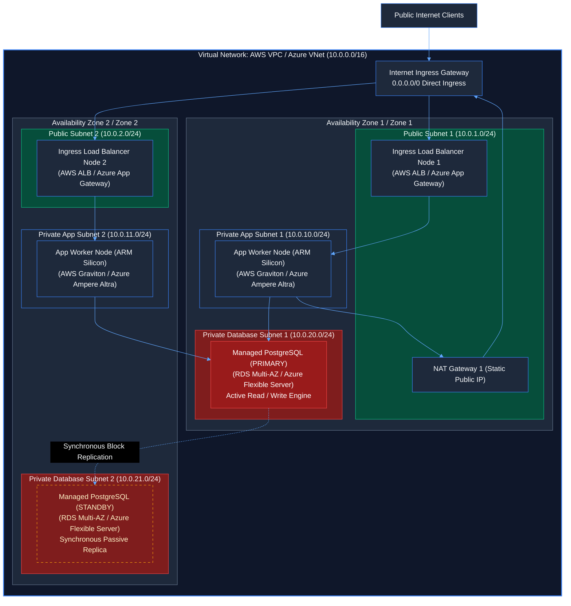
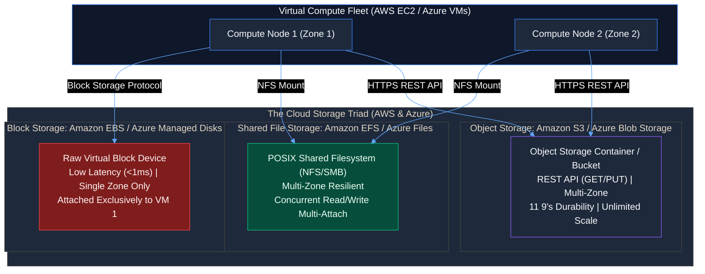
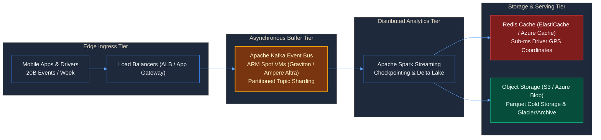

# Contact Session 5: Infrastructure as a Service (IaaS) Deep Dive — Compute, Networking, Storage & Database Architecture

**Course:** Cloud Computing (CCZG527 / CSIZG527 / SEZG527 / SSZG527 - BITS Pilani WILP)  
**Instructor:** Prof. Arun Vadekkedhil  
**Contact Session / Module:** Contact Session 5: IaaS Deep Dive — EC2, VPC, Storage (S3/EBS/EFS), Databases & Zomato Case Study  
**Core Theme:** Comprehensive architectural decomposition of the core IaaS primitives across **AWS and Azure**—virtual compute lifecycles and placement topologies, isolated software-defined networking, the storage triad, managed relational databases, and real-world hyperscale optimization (The Zomato Case Study).

---

## 1. Executive Overview & Problem Context (The 2-Minute Story)

### The 2-Minute Story: The New Year's Eve Food Delivery Meltdown & The Architectural Rebirth
It is December 31st at 8:15 PM. Across hundreds of cities, millions of people open their mobile food delivery apps simultaneously to order celebratory dinners. Order volumes surge by **1,800% within 45 minutes**.

In a legacy un-decoupled cloud architecture, catastrophe unfolds in real time. The monolithic backend web servers send millions of synchronous SQL write queries directly to a single PostgreSQL database instance. The database’s underlying network-attached storage volume runs out of IOPS; disk write latency explodes from 2ms to 450ms. As database write queries block, the upstream web server connection pools saturate completely. 

In a panic, an on-call engineer attempts to restart the primary database compute instance. But upon restarting, the instance is rescheduled onto a different physical server blade, and its **public IPv4 address changes dynamically**—instantly severing database connections across the entire fleet. To worsen the disaster, customer order logs and billing receipts are stored on the local temporary disk of ephemeral worker nodes; when an auto-scaling scale-in event terminates 50 worker VMs, thousands of un-replicated financial transaction logs are **permanently destroyed**. The platform experiences a 90-minute total blackout during the highest revenue hour of the year.

This existential failure drove the engineering revolution behind modern cloud systems. India's leading food delivery unicorn, **Zomato**, rebuilt their entire distributed architecture on AWS to withstand these exact scaling extremes. By decoupling compute from storage, buffering surge writes through **Apache Kafka**, isolating workloads inside a multi-tier virtual network (**AWS VPC $\leftrightarrow$ Azure VNet**), deploying **Multi-AZ managed databases with automated failover**, and migrating compute fleets to **64-bit ARM-based Spot Instances (AWS Graviton2 $\leftrightarrow$ Azure Ampere Altra)**, Zomato engineered a platform that processes **20 billion events per week** seamlessly while cutting infrastructure costs by **30%**.

This lecture decomposes the exact production IaaS primitives that make hyperscale resilience possible across both **AWS** and **Microsoft Azure**.

```
[Legacy Fragile IaaS Anti-Pattern]                 [Zomato Hyperscale Cloud-Native Architecture]
Sync Writes Directly to Single DB Instance        Buffered Asynchronous Ingestion via Apache Kafka
Single-AZ Disk IOPS Throttling Under Surge   ───► Multi-AZ Managed DB + Auto-Scaling Read Replicas
Stopping VM Changes Public IP Address             Private Subnet Static Routing & Multi-AZ Failover
Ephemeral Temp Disk Wipes Audit Logs              Immutable Object Storage (Amazon S3 / Azure Blob)
Expensive x86 24/7 Over-Provisioned VMs           Cost-Optimized ARM Spot Fleets (-30% Cost)
```

### The Core Problem / Pre-IaaS Bottlenecks
1. **Coupled Compute & Storage Lifecycles:** Traditional physical servers coupled hard drives directly to the motherboard. If the CPU or motherboard died, data on the disks was locked until physical repair.
2. **Static & Fragile Network Perimeters:** Physical datacenters required manual cabling, VLAN trunking, and physical appliance firewalls. Provisioning an isolated DMZ for a multi-tier enterprise application took weeks of networking tickets.
3. **Database Availability Single Points of Failure:** High availability for relational databases required expensive clustering licenses, complex heartbeat cabling, and shared SAN storage that frequently corrupted during split-brain failover.
4. **Silicon Architecture Cost Inefficiencies:** Workloads were locked to power-hungry legacy x86 server chips with no dynamic Spot pricing or energy-efficient ARM alternatives.

### The Architectural Solution
Modern IaaS resolves these constraints through API-driven, software-defined primitives across **AWS and Azure**:
- **Decoupled Compute & Storage:** Compute instances (**AWS EC2** $\leftrightarrow$ **Azure VMs**) treat storage as independent, network-attached block devices (**Amazon EBS** $\leftrightarrow$ **Azure Managed Disks**) or virtually unlimited object stores (**Amazon S3** $\leftrightarrow$ **Azure Blob Storage**) that persist independently of VM lifecycles.
- **Software-Defined Networking:** Network topologies are defined in software (**AWS VPC** $\leftrightarrow$ **Azure VNet**), partitioning subnets across physical Availability Zones with dual-layer perimeter defense (Stateful Security Groups/NSGs and Stateless Subnet Firewalls).
- **Automated Multi-AZ Database Replication:** Managed databases (**Amazon RDS Multi-AZ** $\leftrightarrow$ **Azure Database Flexible Server Zone-Redundant**) automate synchronous block-level standby replication across physical datacenters, executing failovers in under 60 seconds with zero data loss.
- **Heterogeneous Silicon & Spot Pricing:** Leveraging energy-efficient ARM silicon (**AWS Graviton** $\leftrightarrow$ **Azure Ampere Altra**) alongside ephemeral Spot instance markets to deliver maximum performance-per-dollar.

### Course Roadmap Placement
- **Sessions 1 & 2:** Cloud Foundations, NIST SP 800-145, Service Models (IaaS/PaaS/SaaS), and Multi-Tenancy Governance.
- **Session 3:** Virtualization Foundations, Hypervisors (Type-1 vs Type-2), 4 Invariant Properties, and Virtual Disk Portability.
- **Session 4:** Hypervisor Kernel Internals (Monolithic vs Microkernel), 5-Layer IaaS Stack, NIST SP 500-292 Actors, and Cloud IAM.
- **Session 5 (This Lecture):** Production IaaS Deep Dive — Compute, Networking, Storage Triad, Managed Databases, and the Zomato Hyperscale Case Study.
- **Sessions 6 & Beyond:** Cloud Storage Internals, Software-Defined Storage (Ceph/SAN), Advanced Networking, Containers, and Kubernetes Orchestration.

---

## 2. Core Concepts Explained Simply (with Tech Quick-Primers)

### 2.1 Compute Architecture: Sizing, Families & Machine Images `[Slide 8–17 | Transcript ~01:10:00 - ~01:25:00]`
- **What is it? (Intuition First):** Virtual compute delivers on-demand virtual machine instances running on top of bare-metal hypervisors (**AWS Nitro / KVM** $\leftrightarrow$ **Azure Hyper-V**).
- **Compute Nomenclature Decoded `[Slide 9, 10]`:**
  - *AWS Example:* `c6g.2xlarge` (`c` = Compute Optimized, `6` = 6th Gen, `g` = Graviton ARM, `2xlarge` = Size).
  - *Azure Equivalent:* `Standard_F8s_v2` or `Standard_D8ps_v5` (`D` = General Purpose, `p` = ARM Ampere Altra, `s` = Premium Disk support, `v5` = 5th Gen).
- **Core Instance Families (Slide 10) Across AWS and Azure:**
  1. **General Purpose:** Balanced compute, memory, and networking.
     - *AWS:* `t4g`, `m6g`, `m5` $\leftrightarrow$ *Azure:* **B-series, Dpsv5 (ARM), Dsv5**.
  2. **Compute Optimized:** High ratio of vCPUs to RAM. Tailored for batch processing and proxies.
     - *AWS:* `c6g`, `c5` $\leftrightarrow$ *Azure:* **Fsv2 series**.
  3. **Memory Optimized:** High RAM-to-vCPU ratio. Essential for in-memory caches (**Redis**) and databases.
     - *AWS:* `r6g`, `r5` $\leftrightarrow$ *Azure:* **Epsv5 (ARM), Esv5 series**.
  4. **Storage Optimized:** Massive local NVMe SSD storage delivering millions of low-latency IOPS.
     - *AWS:* `i3en`, `d2` $\leftrightarrow$ *Azure:* **Lsv3 series**.
  5. **Accelerated Computing:** Dedicated physical GPU / ASIC hardware for AI/ML deep learning.
     - *AWS:* `p4d`, `g5` $\leftrightarrow$ *Azure:* **NCv3, NDv4 series**.
- **Amazon Machine Images (AMIs) $\leftrightarrow$ Azure Compute Gallery `[Slide 12–17]`:**
  - An immutable template packaging the operating system, initial software packages, and volume configurations.
  - *The 4 Sources:* AWS/Azure Provided, Cloud Marketplace, Community Images, and Custom User "Golden Images" built via HashiCorp Packer.
- > 💡 **Tech Quick-Primer (`Azure Ampere Altra`):** Microsoft Azure's 64-bit ARM-based virtual machine series (Dpsv5 / Epsv5), engineered on Ampere Altra processors to deliver up to 50% better price-performance for cloud-native Linux workloads (AWS equivalent: **AWS Graviton2 / Graviton3**).
- 🔍 **Visual Reference:** *See Slide 10 for the instance family matrix and Slide 13 for the 4-part AMI classification.*

---

### 2.2 Compute Lifecycles, Tenancy & Placement Topologies `[Slide 21–25 | Transcript ~01:25:00 - ~01:35:00]`
- **The Virtual Machine Lifecycle `[Slide 21]`:**
  - `Pending / Starting` $\to$ `Running` $\to$ `Stopping` $\to$ `Stopped / Deallocated` $\to$ `Terminated`.
  - *Reboot vs Stop/Start (Critical Operational Difference):*
    - **Rebooting:** Keeps the instance executing on the exact same physical server host. The private IP and public IPv4 address remain completely unchanged in both AWS and Azure.
    - **Stopping / Deallocating:** Transitions the VM to a powered-off state; compute billing halts. When started again, the cloud scheduler provisions it onto an entirely new physical host. **The public IPv4 address changes** unless bound to a static IP (**AWS Elastic IP** $\leftrightarrow$ **Azure Static Public IP**).
- **Placement Topologies: Physical Datacenter Rack Distribution `[Slide 24]`:**
  1. **Cluster Placement Group (AWS) $\leftrightarrow$ Azure Proximity Placement Group (PPG):** Packs instances tightly together in the same physical datacenter rack. Delivers ultra-low latency and maximum network throughput (100 Gbps). Used for High-Performance Computing (HPC) and distributed AI model training.
  2. **Spread Placement Group (AWS) $\leftrightarrow$ Azure Availability Sets (Fault Domains):** Strictly places each instance on distinct physical server racks with independent power supplies and network switches (maximum 7 instances per AZ in AWS). Prevents simultaneous hardware crashes.
  3. **Partition Placement Group (AWS) $\leftrightarrow$ Azure Update/Fault Domains:** Divides instances into logical partitions; partitions do not share hardware racks. Used for large distributed big-data systems (**Apache Kafka, Cassandra, Hadoop**).
- **Instance Store (Ephemeral) vs Block Storage (Persistent) `[Slide 25]`:**
  - *Ephemeral Disk:* High-speed NVMe SSD physically built into the server chassis (**AWS Instance Store** $\leftrightarrow$ **Azure Temp Disk `/dev/sdb` or Ephemeral OS Disk**). Data is permanently wiped when the instance is stopped or deallocated!
  - *Persistent Block Storage:* Network-attached virtual disks (**Amazon EBS** $\leftrightarrow$ **Azure Managed Disks**). Data persists indefinitely across reboots, stops, and migrations.
- 🔍 **Visual Reference:** *See Slide 24 ("EC2 - Placement Groups") for cluster vs spread rack topology.*

---

### 2.3 Software-Defined Networking: AWS VPC $\leftrightarrow$ Azure VNet `[Slide 27–30 | Transcript ~01:30:00 - ~01:40:00]`
- **What is it? (Intuition First):** An isolated virtual network dedicated to your cloud account, mirroring a physical datacenter network (**AWS Virtual Private Cloud [VPC]** $\leftrightarrow$ **Azure Virtual Network [VNet]**).
- **Core Networking Primitives Across Both Clouds:**
  - **IPv4 Address Range:** Assigned via CIDR blocks (e.g., `10.0.0.0/16`, providing 65,536 private IP addresses).
  - **Subnets:** Segmentations of the network scoped to specific Availability Zones.
    - *Public Subnet:* Connected to the public Internet for ingress load balancers.
    - *Private Subnet:* Isolated from direct Internet ingress; routes outbound traffic through a managed **NAT Gateway** (**AWS NAT Gateway** $\leftrightarrow$ **Azure NAT Gateway**).
  - **Internet Ingress:** Handled by a redundant cloud gateway (**AWS Internet Gateway [IGW]** $\leftrightarrow$ **Azure Default Outbound / Azure Load Balancer Ingress**).

```
Public Internet
       │
       ▼
[Internet Gateway (AWS) / Azure Public LB]
       │
       ▼ (Public Subnet - AZ 1a)
[Application Load Balancer (ALB / Azure App Gateway)]
       │
       ▼ (Private Subnet - AZ 1a)
[App Compute Instances (EC2 / Azure VMs)] ──► [NAT Gateway] ──► Outbound Patches
       │
       ▼ (Database Subnet - AZ 1a & 1b)
[Managed PostgreSQL Multi-AZ (AWS RDS / Azure Flexible Server)]
```

#### Perimeter Defense: Stateful Security Groups vs Stateless Subnet Firewalls `[Slide 28, 29]`

```text
┌───────────────────────────────────────────────────────────────────────────┐
│                     DUAL-LAYER PERIMETER DEFENSE                          │
├─────────────────────────────┬─────────────────────────────────────────────┤
│ AWS Security Groups (SG)    │ Azure Network Security Groups (NSG)         │
├─────────────────────────────┼─────────────────────────────────────────────┤
│ • Operates at ENI level     │ • Operates at NIC AND Subnet level          │
│ • STATEFUL: Return traffic  │ • STATEFUL: Return traffic automatically    │
│   automatically allowed     │   allowed via connection tracking           │
│ • Supports ALLOW rules only │ • Supports both ALLOW and DENY rules        │
│ • Evaluates all rules       │ • Evaluates rules using numeric PRIORITIES  │
│                             │   (100 to 4096)                             │
├─────────────────────────────┼─────────────────────────────────────────────┤
│ AWS Network ACLs (NACLs)    │ Azure Subnet NSG / Azure Firewall           │
├─────────────────────────────┼─────────────────────────────────────────────┤
│ • Subnet boundary firewall  │ • Subnet-level packet filtering             │
│ • STATELESS: Return traffic │ • NSG is stateful; Azure Firewall provides  │
│   MUST be explicitly open   │   stateful L3-L7 centralized inspection     │
│   on Ephemeral Ports        │                                             │
└─────────────────────────────┴─────────────────────────────────────────────┘
```

> 💡 **Tech Quick-Primer (`Azure Network Security Group (NSG)`):** A stateful packet-filtering firewall that controls inbound and outbound traffic to Azure VM network interfaces and subnets using 5-tuple priority rules (AWS equivalent: **AWS Security Groups**).

---

### 2.4 The Cloud Storage Triad: Block vs Object vs File `[Slide 33–38 | Transcript ~01:40:00 - ~01:50:00]`
Modern cloud computing organizes storage into three distinct architectural primitives:

```
▲ [Object Storage]  REST API | Unlimited Scale | Multi-AZ | 11 9's Durability  (AWS S3 / Azure Blob)
│ [Shared File]     POSIX / NFSv4 | Multi-Attach Concurrent Access | Multi-AZ  (AWS EFS / Azure Files)
▼ [Block Storage]   Raw Disk (/dev/xvda) | Single AZ | Low Latency (<1ms)     (Amazon EBS / Azure Disks)
```

1. **Block Storage: Amazon EBS $\leftrightarrow$ Azure Managed Disks `[Slide 34]`:**
   - *Architecture:* Exposes raw, unformatted virtual block devices attached over a dedicated storage network to a single compute instance. Must be formatted with a filesystem (`ext4`, `xfs`, `NTFS`).
   - *Scope:* **Single-AZ only.** An EBS volume in AZ 1a or an Azure Managed Disk in Zone 1 cannot be mounted to a VM in Zone 2.
   - *Volume Types:* General Purpose SSD (**AWS `gp3`** $\leftrightarrow$ **Azure Premium SSD v2**), High-Performance Provisioned IOPS (**AWS `io2`** $\leftrightarrow$ **Azure Ultra Disk** up to 160,000–256,000 IOPS).
   - *Target Use:* OS Boot Drives, transactional database storage (PostgreSQL, SQL Server).
2. **Object Storage: Amazon S3 $\leftrightarrow$ Azure Blob Storage `[Slide 35]`:**
   - *Architecture:* Stores unstructured data as objects within flat buckets/containers. Accessed via HTTP/HTTPS REST APIs (`GET`, `PUT`).
   - *Durability & Scope:* Designed for **99.999999999% (11 9's) durability** by automatically replicating data across a minimum of three physical Availability Zones.
   - *Lifecycle Tiers Across Both Clouds:*
     - **Hot Tier:** **AWS S3 Standard** $\leftrightarrow$ **Azure Blob Hot**.
     - **Cool Tier:** **AWS S3 Standard-IA** $\leftrightarrow$ **Azure Blob Cool**.
     - **Cold Tier:** **AWS S3 Glacier Flexible** $\leftrightarrow$ **Azure Blob Cold**.
     - **Archive Tier:** **AWS S3 Glacier Deep Archive** $\leftrightarrow$ **Azure Blob Archive** (~$0.00099/GB/month).
   - *Target Use:* Static web assets, multimedia catalogs, big-data lakes, and immutable backups.
3. **Shared File Storage: Amazon EFS $\leftrightarrow$ Azure Files `[Slide 36]`:**
   - *Architecture:* Fully managed POSIX-compliant shared file systems accessible concurrently via the NFSv4 or SMB protocols.
   - *Concurrent Multi-Attach:* Can be mounted concurrently by **hundreds of compute instances** across multiple Availability Zones simultaneously.
   - *Target Use:* Shared Content Management Systems (WordPress/Drupal), shared application logs.

> 💡 **Tech Quick-Primer (`Azure Blob Storage`):** Microsoft's massively scalable, highly durable object storage service accessed via HTTP REST APIs, offering automated lifecycle management across Hot, Cool, Cold, and Archive access tiers (AWS equivalent: **Amazon S3**).

---

### 2.5 Managed Relational Databases: Multi-AZ vs Read Replicas `[Slide 40–44 | Transcript ~01:50:00 - ~01:58:00]`

```
Active-Passive Failover (Multi-AZ / Zone-Redundant) Read Scalability (Read Replicas)
┌─────────────────────────────────┐               ┌──────────────────────────────────────────────┐
│ Primary DB Instance (AZ 1a)     │               │ Primary DB Instance (AZ 1a) [READ / WRITE]   │
│ [Active READ / WRITE Engine]    │               └──────────────────────┬───────────────────────┘
└────────────────┬────────────────┘                                      │
                 │ Synchronous Block Replication                         │ Asynchronous Engine Log Repl
                 ▼                                                       ▼
┌─────────────────────────────────┐               ┌──────────────────────────────────────────────┐
│ Standby DB Instance (AZ 1b)     │               │ Read Replica 1 (AZ 1a) │ Read Replica 2 (1b) │
│ [PASSIVE - Non-Queryable]       │               │ [ACTIVE READ-ONLY QUERY TRAFFIC]             │
└─────────────────────────────────┘               └──────────────────────────────────────────────┘
```

#### 1. High Availability: RDS Multi-AZ $\leftrightarrow$ Azure Database Flexible Server Zone-Redundant `[Slide 42]`
- **Mechanism:** Synchronously replicates storage-level block writes from the primary database instance in AZ 1 to a standby replica in AZ 2.
- **Failover SLA:** If the primary instance or datacenter fails, the managed service automatically flips the DNS CNAME record to point to the standby replica, executing failover in under 60 seconds with **zero data loss (RPO = 0)**.
- **Critical Production Rule:** The standby replica is **non-queryable**. It exists strictly for automated disaster recovery (Like the cockpit co-pilot analogy - 10% Rule).

#### 2. Read Scalability: RDS Read Replicas $\leftrightarrow$ Azure Database Read Replicas `[Slide 43]`
- **Mechanism:** Asynchronously replicates transactional database engine logs from the primary writer to up to 5–15 independent read-only database instances.
- **Purpose:** Offloads read-heavy query traffic (search queries, reporting dashboards, catalog browsing) from the primary database, reserving the primary strictly for transactional writes.
- **Production Trade-Off:** **Asynchronous replication lag**. Read queries against a replica may return data that is a few milliseconds behind the primary writer (eventual consistency).

---

### 2.6 Hyperscale Case Study: The Zomato Event Architecture `[Slide 45–48 | Transcript ~01:58:00 - ~02:05:00]`
Zomato processes over **20 billion events per week** (tracking order placements, delivery partner GPS coordinates, restaurant menu updates, and user clickstreams).

```
Mobile Clients & Delivery Drivers
           │ (HTTPS Ingress)
           ▼
[Application Load Balancers (ALB / Azure App Gateway)]
           │
           ▼
[Apache Kafka Ingestion Cluster] ◄─── Deployed on ARM Graviton2 / Azure Ampere Altra Spot VMs
           │
           ├───────────────────────────────┐
           ▼                               ▼
[Apache Spark Real-Time Streaming]   [Raw Event Ingestion]
           │                               │
           ▼                               ▼
[Redis Cache Cluster]                [Object Storage Data Lake]
(AWS ElastiCache / Azure Cache)      (Amazon S3 / Azure Blob Storage)
```

**Key Architectural Takeaways from the Zomato Implementation:**
1. **Asynchronous Shock Absorption via Apache Kafka:** Instead of writing events directly to databases, all client events are published to distributed Kafka partition topics (**Self-managed / AWS MSK** $\leftrightarrow$ **Azure Event Hubs for Kafka**). Kafka absorbs massive flash spikes effortlessly, allowing downstream processing engines to consume data at a deterministic rate.
2. **Silicon Cost Optimization with ARM:** Migrating the streaming processing tier to 64-bit ARM processors (**AWS Graviton2** $\leftrightarrow$ **Azure Ampere Altra Dpsv5**) reduced compute operational costs by **30%** while delivering 40% better price-performance.
3. **Spot Instance Fault Tolerance:** By architecting the data pipeline to be stateless and checkpointed, Zomato runs massive analytics clusters on **Spot Instances** (**AWS EC2 Spot** $\leftrightarrow$ **Azure Spot VMs**), saving up to 70–90% compared to on-demand pricing.

> 💡 **Tech Quick-Primer (`Apache Kafka`):** A distributed, horizontally scalable event streaming platform that uses a partitioned append-only commit log to decouple event producers from event consumers at massive throughput (managed in cloud as **AWS MSK** $\leftrightarrow$ **Azure Event Hubs for Kafka**).

---

## 3. Visual Architectural / System Models

### Model 1: Production Multi-AZ VPC / VNet Enterprise Network Blueprint
*This dark-mode architectural model synthesizes the multi-tier network blueprint, illustrating perimeter defense, NAT translation, and Multi-AZ database isolation across AWS and Azure based on Slide 27 and 28.*



---

### Model 2: The Cloud Storage Triad Architecture
*This dark-mode schematic contrasts the storage protocols, latency profiles, and availability scopes of Block, Object, and File storage across AWS and Azure based on Slide 33 to 38.*



---

### Model 3: Zomato Hyperscale 20B Event Processing Pipeline
*This model illustrates how Zomato decouples ingest, analytics, and caching using ARM Spot instances and Kafka based on Slide 45 to 48.*



---

## 4. Key Trade-Offs & Comparisons

### 4.1 The Cloud Architect's Rosetta Stone (Lecture 5 Primitives)

| Domain | Architectural Primitive | AWS Implementation (Slide Context) | Azure Equivalent (Practitioner Context) |
| :--- | :--- | :--- | :--- |
| **Virtual Compute** | On-Demand Virtual VM | **Amazon EC2** | **Azure Virtual Machines (VMs)** |
| **ARM Silicon** | Energy-efficient ARM CPU| **AWS Graviton2 / Graviton3** | **Azure Ampere Altra (Dpsv5 / Epsv5)** |
| **Virtual Network** | Isolated software network| **Amazon VPC** | **Azure Virtual Network (VNet)** |
| **Subnet Routing** | Outbound patch egress | **NAT Gateway** | **Azure NAT Gateway** |
| **Instance Firewall**| Stateful host firewall | **Security Groups (SGs)** | **Network Security Groups (NSGs)** |
| **Subnet Firewall** | Subnet boundary filter | **Network ACLs (NACLs - Stateless)** | **Subnet NSG / Azure Firewall** |
| **Block Storage** | High-IOPS raw disk | **Amazon EBS (gp3, io2)** | **Azure Managed Disks (Premium v2, Ultra)**|
| **Object Storage** | Durable REST-based store| **Amazon S3** | **Azure Blob Storage** |
| **Shared File System**| Multi-attach POSIX NFS | **Amazon EFS** | **Azure Files** |
| **Ephemeral Disk** | On-chassis temporary disk| **EC2 Instance Store** | **Azure Temp Disk (`/dev/sdb`) / Ephemeral** |
| **Managed DB (HA)** | Active-Passive standby | **Amazon RDS Multi-AZ** | **Azure Database Flexible Server Zone-Redundant**|
| **Managed DB (Scale)**| Read-only replica | **RDS Read Replicas** | **Azure Database Read Replicas** |
| **Event Streaming** | High-throughput buffer | **Apache Kafka on EC2 / AWS MSK** | **Azure Event Hubs for Kafka** |

---

### 4.2 Structured Comparison: The Cloud Storage Triad

| Storage Metric | Block Storage (EBS / Managed Disks) | Object Storage (S3 / Azure Blob) | Shared File Storage (EFS / Azure Files) |
| :--- | :--- | :--- | :--- |
| **Access Interface** | Block device (`/dev/sdf` or LUN) | HTTP/HTTPS REST APIs | POSIX filesystem (NFSv4 / SMB) |
| **Availability Scope** | **Single-AZ only** | **Multi-AZ (>=3 AZs)** | **Multi-AZ (>=3 AZs)** |
| **Concurrent Attach** | 1 compute instance (Standard) | Virtually Unlimited | **Hundreds of compute instances**|
| **Latency Profile** | **Sub-millisecond (<1ms)** | Tens of milliseconds (10–30ms)| Low millisecond (1–5ms) |
| **Data Mutability** | In-place byte modification | Overwrite full object | In-place byte modification |
| **Durability SLA** | 99.8% – 99.999% | **99.999999999% (11 9's)** | Enterprise high durability |
| **Target Workload** | OS Boot Drives, PostgreSQL DB| Media, Data Lakes, Backups | Shared CMS, Multi-instance logs|

---

### 4.3 Structured Comparison: Security Groups vs Network ACLs (NACLs)

| Dimension | AWS Security Groups (SG) | Network ACLs (NACLs) | Azure Network Security Groups (NSG) |
| :--- | :--- | :--- | :--- |
| **Enforcement Layer** | Virtual Interface (ENI) | Subnet Boundary | NIC and Subnet Boundaries |
| **State Tracking** | **STATEFUL** | **STATELESS** | **STATEFUL** |
| **Rule Types** | **ALLOW rules only** | **ALLOW and DENY rules** | **ALLOW and DENY rules** |
| **Evaluation Order** | All rules evaluated together | Strict numerical order | Evaluated by Priority (100–4096) |
| **Ephemeral Ports** | Handled automatically | **Must open ephemeral ports**| Handled automatically |

---

### 4.4 Production Failure Modes & Anti-Patterns

1. **The Dynamic IP Severance Trap (Stop/Start Outage):**
   - *Failure Mode:* An engineer configures a web server to communicate with an internal VM backend via its public IPv4 address. When the backend instance is stopped and restarted for maintenance, the cloud scheduler assigns a new physical host and a **new public IP**, breaking client connections globally.
   - *Production Remediation:* Never bind internal microservices to public IPv4 addresses. Communicate over private subnets using private DNS hostnames or bind a static IP (**AWS Elastic IP** $\leftrightarrow$ **Azure Static Public IP**).

2. **The "Single-AZ Block Storage" Availability Trap:**
   - *Failure Mode:* Deploying a redundant application across two Availability Zones (`ap-south-1a` and `ap-south-1b`), but attaching both compute nodes to an EBS volume or Azure Managed Disk located in Zone 1. If Zone 1 experiences a datacenter power outage, the instance in Zone 2 cannot mount the block volume.
   - *Production Remediation:* Remember that **block storage volumes cannot cross AZ boundaries**. For cross-AZ shared storage, use **Azure Files / Amazon EFS** or replicate data at the database engine level via **Zone-Redundant Flexible Server / RDS Multi-AZ**.

---

## 5. Professor's Practical Tips & Oral Insights

*(Extracted directly from Prof. Arun Vadekkedhil's spoken classroom transcript)*

### 5.1 Real-World Engineering Insights
- **Silicon Architecture Impacts Cloud FinOps Directly `[Transcript ~01:15:30]`:**
  - Cloud engineers often obsess over software code optimization while ignoring silicon economics. As demonstrated by Zomato, simply migrating stateless container workloads from legacy x86 instances to ARM-based processors (**AWS Graviton** $\leftrightarrow$ **Azure Ampere Altra**) delivers an instant 30% reduction in cloud compute bills with zero code refactoring for interpreted runtimes (Python, Node.js, Java).
- **The Standby Replica is a Passive Co-Pilot `[Transcript ~01:52:10]`:**
  - Students frequently ask why they cannot send read-only reporting queries to the Multi-AZ Standby instance. Prof. Arun clarifies: *"The standby instance is like an airplane co-pilot sitting in active-passive standby. It is receiving synchronous storage block writes continuously. If you execute heavy analytical SQL queries against it, you risk degrading the standby storage engine, causing automated failover to stall during a real disaster."*

### 5.2 Common Misconceptions & Traps
- **Trap 1: "Rebooting an Instance Changes Its IP Address" `[Transcript ~01:26:15]`:**
  - Prof. Arun corrects this common exam mistake: *"Rebooting keeps the instance on the exact same physical host blade; the private and public IPs remain identical. Only Stopping and Starting changes the public IP address."*
- **Trap 2: "Subnet Firewalls and Instance Firewalls are Redundant" `[Transcript ~01:35:45]`:**
  - They serve distinct defense-in-depth purposes. Instance firewalls (Security Groups / NSGs) protect individual compute nodes against lateral movement inside the network. Subnet firewalls (NACLs / Azure Firewall) act as a subnet-wide perimeter fence—enabling network administrators to block malicious IP ranges or specific rogue ports before packets ever reach instance network interfaces.

### 5.3 Student Questions & Classroom Debates
- **Q: Why does Object Storage offer 11 9's durability while Block Storage offers only 3 to 5 9's? `[Transcript ~01:44:20]`**
  - **Prof. Arun's Explanation:** Physical architecture. A block volume (EBS / Azure Managed Disk) replicates data across redundant storage hardware within **one single Availability Zone**. If that physical datacenter suffers an extreme catastrophic event (e.g., flood or fire), the volume can be lost. Object storage (**Amazon S3** $\leftrightarrow$ **Azure Blob Storage**) automatically replicates data across a minimum of **three geographically separated Availability Zones**, guaranteeing that even if two entire datacenters are destroyed, data persists without loss.
- **Q: Can you convert an instance from x86 to ARM on the fly? `[Transcript ~01:16:40]`**
  - **Prof. Arun's Explanation:** No. You can stop an instance and change its size (e.g., from `m5.large` to `m5.2xlarge`) because they share the x86 instruction set. However, transitioning to ARM requires recompiling C/C++ binaries, building multi-architecture Docker container images (`linux/arm64`), and launching a new instance.

### 5.4 Exam Guidance & BITS Pilani Cautions
- **Security Groups vs NACL Comparison (Mid-Sem Exam):**
  - Expect a direct 3-mark question contrasting Security Groups (Stateful, ENI-level, Allow rules only) and NACLs (Stateless, Subnet-level, ordered Allow/Deny). You must state the ephemeral port requirement of NACLs to receive full marks.
- **Exam Bridge Callout (AWS vs Azure):**
  > ⚠️ **Exam Keyword Warning:** In the Mid-Sem Exam, use the exact **AWS terms** from the professor's slides (**Amazon EC2, Amazon VPC, Security Groups, NACLs, Amazon EBS, Amazon S3, RDS Multi-AZ**) for scoring rubrics, while remembering their exact Azure equivalents (**Azure VMs, VNets, NSGs, Managed Disks, Azure Blob, Zone-Redundant DB**) for architectural clarity.

---

## 6. Exam-Ready Question Bank

### Part A: Conceptual & Short-Answer Questions (Mid-Sem Closed-Book: 2–3 Marks Each)

#### Q1: Differentiate between Security Groups and Network Access Control Lists (NACLs) in cloud software-defined networking.
**Model Answer:**  
- **Security Groups (AWS SGs / Azure NSGs):** Operate at the virtual network interface (ENI/NIC) level. They are **stateful** (return traffic is automatically allowed regardless of inbound rules), support **Allow rules only** (in AWS), and evaluate all rules collectively.
- **Network ACLs (NACLs):** Operate at the subnet boundary. They are **stateless** (return traffic must be explicitly permitted on ephemeral ports 1024–65535), support both **Allow and Deny rules**, and evaluate rules in strict numerical order.  
*(Scoring: 1.5 marks for Security Groups, 1.5 marks for NACLs - Total: 3 Marks)*  
*(Azure Architect Translation: In Azure, NSGs handle both roles with stateful tracking and numerical priority rules).*

---

#### Q2: Contrast the availability and attach scope of Block Storage (Amazon EBS / Azure Managed Disks) versus Object Storage (Amazon S3 / Azure Blob Storage).
**Model Answer:**  
- **Block Storage (Amazon EBS / Azure Managed Disks):** Scoped strictly to a **single Availability Zone**. A block volume can only attach to an instance within the exact same AZ over low-latency block protocols (`/dev/sdf`).
- **Object Storage (Amazon S3 / Azure Blob Storage):** Accessible globally over HTTP/HTTPS REST APIs. Data is automatically replicated across a minimum of **three Availability Zones**, providing 99.999999999% (11 9's) durability.  
*(Scoring: 1.5 marks for Block Storage scope, 1.5 marks for Object Storage scope - Total: 3 Marks)*

---

#### Q3: What happens to the private and public IPv4 addresses of a cloud virtual machine when it is Rebooted versus when it is Stopped and Started?
**Model Answer:**  
- **Reboot:** Both the private IP address and the public IPv4 address remain completely unchanged because the instance remains on the same physical server blade.
- **Stop and Start:** The private IP address remains identical, but the **public IPv4 address changes** because the cloud scheduler migrates the instance to a new physical host upon restart (unless a static IP like an AWS Elastic IP or Azure Static Public IP is associated).  
*(Scoring: 1 mark for Reboot behavior, 2 marks for Stop/Start behavior - Total: 3 Marks)*

---

#### Q4: Differentiate between managed database High Availability (RDS Multi-AZ / Azure Zone-Redundant) and Read Replicas regarding replication mechanism and primary purpose.
**Model Answer:**  
- **High Availability (RDS Multi-AZ / Azure Flexible Server Zone-Redundant):** Uses **synchronous block-level replication** to a passive standby replica in a second AZ. Primary purpose is **High Availability and automated disaster failover** (RPO=0). Standby is non-queryable.
- **Read Replicas:** Uses **asynchronous database engine log replication** to queryable read instances. Primary purpose is **Horizontal Read Scalability** for read-heavy workloads.  
*(Scoring: 1.5 marks for Multi-AZ / HA, 1.5 marks for Read Replicas - Total: 3 Marks)*

---

### Part B: Scenario-Based, Architectural & Analytical Questions (Comprehensive Open-Book: 5–10 Marks Each)

#### Scenario Question 1 (10 Marks): Multi-Tier E-Commerce Architecture & Surge Protection
**Scenario:**  
"ShopEase Global" is migrating an on-premises e-commerce store to the cloud. During holiday promotional events, customer traffic spikes by 2,000%. The application consists of:
1. A stateless web/API application tier handling user shopping carts.
2. A transactional relational database storing customer orders and inventory balances.
3. Millions of product catalog JPEG images accessed frequently during browsing.

The architecture must satisfy:
- High availability across multiple datacenters with automated disaster failover (<60s RTO).
- Database read queries must not impact inventory update transactions.
- Zero web worker instances may be placed directly on the public Internet.
- Product images must be delivered with minimum latency without saturating web servers.

Design an end-to-end cloud infrastructure blueprint using software-defined networking (**AWS VPC / Azure VNet**), compute, managed databases, and the Storage Triad. Detail subnet allocations, load balancing, firewall chaining, and database replication.

**Detailed Model Answer & Scoring Breakdown:**

##### 1. Network Topology: VPC / VNet Configuration (3 Marks)
- **Network CIDR (`10.0.0.0/16`) partitioned across 2 Availability Zones / Zones:**
  - *Public Subnets (AZ 1 & 2):* Host the **Application Load Balancer (ALB / Azure App Gateway)** and **NAT Gateways**. Public route table routes `0.0.0.0/0` to the Internet Gateway.
  - *Private Application Subnets (AZ 1 & 2):* Host stateless compute instances (**AWS EC2 Graviton** $\leftrightarrow$ **Azure Ampere Altra VMs**) in an Auto Scaling Group / VMSS. Route table directs `0.0.0.0/0` outbound traffic to the NAT Gateway in the respective public subnet. Zero direct Internet ingress.
  - *Private Database Subnets (AZ 1 & 2):* Host the managed database cluster. Completely isolated with zero routes to the Internet or NAT Gateways.

##### 2. Database Tier Architecture (3 Marks)
- **High-Availability Managed Database Deployment:** Deploy the primary database instance in Private DB Subnet 1 and configure synchronous replication to a standby instance in Private DB Subnet 2 (**AWS RDS PostgreSQL Multi-AZ** $\leftrightarrow$ **Azure Database for PostgreSQL Flexible Server Zone-Redundant**) for sub-minute automated failover.
- **Read Replicas:** Deploy two Read Replicas across Zone 1 and Zone 2. Configure the web application to direct transactional order writes (`INSERT/UPDATE`) to the primary database endpoint, while routing catalog browse queries (`SELECT`) to the Read Replica endpoints.

##### 3. Storage Triad & Media Acceleration (2 Marks)
- **Product Catalog Images (Object Storage + CDN):** Store all product catalog JPEGs inside an **Amazon S3 Standard / Azure Blob Storage** container. Deploy a Content Delivery Network (**Amazon CloudFront** $\leftrightarrow$ **Azure Front Door / CDN**) in front of the bucket. The CDN caches static product images at edge locations globally, offloading 95%+ of bandwidth from origin infrastructure.
- **Compute Storage (Block Storage):** EC2 instances / Azure VMs utilize General Purpose SSD volumes (**AWS `gp3`** $\leftrightarrow$ **Azure Premium SSD v2**) for OS boot drives.

##### 4. Security Group / NSG Chaining Defense-in-Depth (2 Marks)
- **ALB / App Gateway Firewall:** Inbound Allow HTTPS (port 443) from `0.0.0.0/0`.
- **App Tier Firewall:** Inbound Allow HTTP (port 8080) strictly from the Load Balancer security group/NSG. Outbound Allow to Database security group on port 5432.
- **Database Firewall:** Inbound Allow PostgreSQL (port 5432) strictly from the App Tier security group/NSG. Block all other ingress.

##### Scoring Keywords Checklist for Examiners:
- [x] *Multi-AZ VPC / VNet with Public, Private, and DB subnets*
- [x] *Internet Gateway for ALB & NAT Gateway for outbound patch access*
- [x] *RDS Multi-AZ / Azure Flexible Server synchronous replication for zero data loss*
- [x] *Read Replicas for read-write query splitting*
- [x] *Amazon S3 / Azure Blob + CloudFront CDN for catalog media caching*
- [x] *Stateful firewall chaining (ALB-SG -> App-SG -> DB-SG / NSG priorities)*

---

#### Scenario Question 2 (5 Marks): Healthcare Imaging Lifecycle & Archival Cost Optimization
**Scenario:**  
A medical diagnostic imaging network generates 800 Terabytes of raw MRI scans annually, stored in cloud object storage (**Amazon S3 / Azure Blob Storage**). Operational analytics reveals:
- Scans are accessed frequently during the first 30 days of patient diagnosis.
- Between day 31 and day 180, scans are accessed less than once every 60 days for follow-ups.
- After 180 days, scans are rarely accessed, but national health regulations mandate that raw diagnostic records must be immutably preserved for 7 years.

Formulate an automated Object Storage Lifecycle Policy to minimize storage expenditures while guaranteeing compliance across AWS and Azure. Explain durability SLAs and retrieval options.

**Detailed Model Answer & Scoring Breakdown:**

##### 1. Automated Lifecycle Policy Configuration (3 Marks)
- **Day 0 to Day 30:** Store objects in **Amazon S3 Standard / Azure Blob Hot Tier** for maximum availability and instant access during active medical procedures.
- **Day 31 Transition:** Automatically transition objects to **Amazon S3 Standard-Infrequent Access (Standard-IA) / Azure Blob Cool Tier**. Reduces storage cost by ~50% while retaining millisecond retrieval access for follow-up appointments.
- **Day 180 Transition:** Automatically transition objects to **Amazon S3 Glacier Flexible Archive / Azure Blob Cold/Archive Tier**. Slashes storage costs by over 85% to 95% compared to Hot storage.
- **Day 2,555 (7 Years) Action:** Apply Object Lock (WORM compliance / Azure Immutable Blob Storage) to prevent premature deletion. At day 2,555, an automated expiration action permanently deletes the objects.

##### 2. Durability SLA & Retrieval Analysis (2 Marks)
- **Durability Guarantee:** Both Amazon S3 and Azure Blob Storage maintain **99.999999999% (11 9's) durability** by replicating data across >=3 physical Availability Zones. Moving to Glacier/Archive sacrifices zero durability.
- **Retrieval Options:** When an archived scan is requested, the application initiates an *Expedited Retrieval* (1–5 minutes in S3 / High-priority rehydration in Azure) for emergency care or a *Standard Retrieval* (3–5 hours / Standard rehydration) for routine audits.

##### Scoring Keywords Checklist:
- [x] *S3 Standard / Azure Blob Hot for first 30 days*
- [x] *S3 Standard-IA / Azure Blob Cool transition at Day 31*
- [x] *S3 Glacier / Azure Blob Archive transition at Day 180*
- [x] *11 9's durability parity across all tiers*
- [x] *Object Lock / WORM compliance for 7 years*

---

## 7. Quick Revision & 60-Second Exam Recap

### 7.1 Key Terms & Acronym Glossary
- **EC2 / Azure VM:** Virtual compute service running on bare-metal hypervisors (Nitro / Hyper-V).
- **AMI / Azure Compute Gallery:** Immutable template packaging OS, software, and root volume configurations.
- **VPC / VNet:** Logically isolated software-defined virtual network defined by CIDR blocks.
- **Security Group / NSG:** Stateful instance-level virtual firewall supporting connection-tracking rules.
- **Network ACL (NACL):** Stateless subnet-level firewall supporting ordered allow and deny rules.
- **EBS / Azure Managed Disks:** Low-latency persistent block storage volume scoped strictly to a single AZ.
- **S3 / Azure Blob Storage:** Scalable multi-AZ object store providing 11 9's durability via REST APIs.
- **EFS / Azure Files:** Shared multi-AZ POSIX filesystem accessible concurrently via NFSv4 / SMB.
- **RDS Multi-AZ / Azure Zone-Redundant:** Synchronous block-level database replication to passive standby for HA.
- **Read Replica:** Asynchronous database log replication to queryable instances for read scaling.
- **AWS Graviton / Azure Ampere Altra:** Custom 64-bit ARM-based processors providing 30–40% cost savings.
- **Instance Store / Azure Temp Disk:** Physical on-chassis NVMe storage; delivers millions of IOPS but is strictly ephemeral.

---

### 7.2 The 5 Golden Rules of Session 5
1. **Security Groups are Stateful, NACLs are Stateless:** Return traffic is automatically allowed in Security Groups / NSGs; NACLs require explicit rules in both directions including ephemeral ports.
2. **Block Storage is Single-AZ, Object/File Storage is Multi-AZ:** An EBS volume or Azure Managed Disk lives inside one specific Availability Zone; S3, Azure Blob, and EFS automatically replicate data across at least 3 AZs.
3. **Multi-AZ is for Availability, Read Replicas are for Scaling:** RDS Multi-AZ synchronously writes to a standby replica for disaster failover; Read Replicas asynchronously process read queries.
4. **Stopping an Instance Changes Its Public IP:** Stopping and starting migrates the instance to a new physical host blade; private IP stays the same, but public IP changes unless bound to a static IP (Elastic IP / Azure Static IP).
5. **Silicon Architecture Drives Cloud Cost:** As demonstrated by Zomato, migrating compute fleets to 64-bit ARM silicon (AWS Graviton / Azure Ampere Altra) cuts cloud compute bills by 30% over legacy x86 architectures.

---

### 7.3 60-Second Rapid-Fire Q&A
- **Q: What happens to the public IP of an EC2 instance or Azure VM upon Stop and Start?**  
  *A:* The public IP address changes because the instance is rescheduled onto a new physical host blade.
- **Q: Which storage type should you use for an active transactional database?**  
  *A:* Block Storage (Amazon EBS / Azure Managed Disks) for sub-millisecond random read/write I/O.
- **Q: Can you connect directly to an RDS Multi-AZ Standby instance to run read queries?**  
  *A:* No. The standby replica is non-queryable and exists strictly for automated disaster failover.
- **Q: What is the Azure equivalent of AWS Graviton processors for ARM-based cloud cost optimization?**  
  *A:* Azure Ampere Altra ARM processors (Dpsv5 / Epsv5 series).
- **Q: What is the Azure equivalent of an Amazon VPC and AWS Security Group?**  
  *A:* Azure Virtual Network (VNet) and Network Security Group (NSG).
