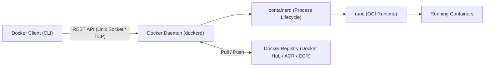
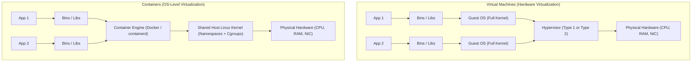

# Lecture 6: Operating System Virtualization & Container Fundamentals (LXC, LXD & Docker Architecture)

**Course:** Cloud Computing (CCZG527 / CSIZG527 / SEZG527 / SSZG527 - BITS Pilani WILP)  
**Instructor:** Prof. Arun Vadekkedhil  
**Contact Session / Module:** Session 6: OS Virtualization & Container Architecture  
**Core Theme:** Moving beyond hardware-level virtual machines to lightweight, OS-level virtualization—understanding how Linux kernel primitives (Namespaces and Cgroups) eliminate hypervisor overhead, contrasting OS containers (LXC/LXD) with Application containers (Docker), and unpacking Docker's client-daemon architecture.

---

## 1. The Big Picture (Why Should I Care?)

- **What is this lecture about?**  
  This lecture introduces **Operating System Virtualization (Containers)**. Instead of virtualizing the underlying physical hardware and running an entire guest operating system for every application (like Virtual Machines do), containers share the host operating system kernel while keeping application processes strictly isolated.
- **The Real-World Problem:**  
  The classic developer dilemma: *"It works on my machine!"* You develop a web service locally on Ubuntu. You ship the compiled binaries to the production data center or cloud server, and it immediately crashes due to mismatched library versions, missing system packages, or incompatible glibc paths. Historically, companies solved this by shipping complete Virtual Machines (VMs), but a 100 MB web app packaged in a VM requires a 20 GB guest OS, wastes gigabytes of idle RAM, and takes minutes to boot. Containers solve this by packaging code and dependencies together into an image that starts in milliseconds.
- **Where this fits in the course:**  
  Sessions 2 to 5 explored hardware virtualization, hypervisors (Type-1 vs Type-2), and IaaS virtual machines (AWS EC2 / Azure VMs). Session 6 introduces the modern cloud-native paradigm: OS-level container virtualization, laying the ground for Docker, container storage, and orchestration (Kubernetes).

---

## 2. Core Concepts Explained Simply

### Concept 1: The Anatomy of an OS (Kernel vs. Userland)

- **What is it?**  
  Every operating system has two main parts:
  1. **The Kernel:** The core system software that talks directly to physical silicon (CPU scheduling, memory allocation, disk I/O, network drivers).
  2. **The User Space (Userland):** Everything outside the kernel where applications run—system libraries, package managers (`apt`, `yum`), command-line tools (`bash`, `ls`), and user code.
- **How Applications Interact with Hardware:**  
  User programs cannot touch hardware directly. When an application wants to write a file or open a network port, it makes a **system call** (e.g., `fopen()`, `write()`, `socket()`) to the kernel, which performs the action on its behalf.
- **The Container Insight:**  
  *All containers on a host share the exact same Linux kernel.* Only their userland libraries and processes are isolated.
- **Dual-Cloud Mapping:**  
  `AWS ECS / EKS / Fargate` $\leftrightarrow$ `Azure Container Apps / AKS`

---

### Concept 2: The Two Founding Kernel Primitives: Namespaces & Cgroups

Containers are not magical virtual machines; they are regular Linux processes dressed up using two Linux kernel features:

#### 1. Namespaces = What a Process Can SEE (Isolation)
- **What is it?**  
  Namespaces create a private "bubble" for a process, making it feel like it is running on its own dedicated operating system.
- **Key Namespace Types:**
  * **PID Namespace (Processes):** The container gets its own isolated process tree. Its main process becomes `PID 1` inside the container, even though on the host it is `PID 12450`.
  * **NET Namespace (Networking):** The container gets its own virtual network interface (`eth0`), routing table, IP address, and private port range.
  * **MNT Namespace (Mount / Filesystem):** The container gets its own isolated filesystem view, unable to browse the host root directory.
  * **IPC & UTS Namespaces:** Isolate inter-process communication and system hostname.
  * **User Namespace:** Allows a process to be `root (UID 0)` inside the container while mapped to an unprivileged normal user (`UID 1000`) on the host machine.

#### 2. Cgroups (Control Groups) = How Much a Process Can CONSUME (Resource Ceilings)
- **What is it?**  
  Invented by Google engineers in 2006 and merged into the Linux kernel in 2008, Cgroups track and limit hardware resource consumption (CPU, RAM, Disk I/O, Network priority).
- **Why do we need it?**  
  Without Cgroups, one buggy or malicious container could enter an infinite loop, eat 100% of host RAM, trigger the Linux Out-Of-Memory (OOM) killer, and crash all neighboring containers on the server (the **"Noisy Neighbor"** problem).
- **Rule of Thumb:**  
  *Namespaces limit what you can see; Cgroups limit how much you can use.*

---

### Concept 3: The Apartment Building Analogy

> 🏢 **Think of a Server as an Apartment Complex:**
> * **Physical Server = The Apartment Building.**
> * **Linux Kernel = The Foundation, Plumbing & Electrical Grid:** Shared by everyone in the building.
> * **Namespaces = The Walls & Locked Front Doors:** Residents in Apt 201 cannot see into Apt 202. They have their own private rooms and bathroom.
> * **Cgroups = The Circuit Breakers & Water Meters:** If Apt 201 runs 10 air conditioners, the breaker trips before blowing out the power grid for the whole building.
> * **Virtual Machines = Buying Separate Free-Standing Houses:** In a VM, each house must build its own independent foundation, power generator, and water tank (guest OS kernel). Much higher isolation, but massive construction overhead and wasted land!

---

### Concept 4: OS Containers (LXC / LXD) vs. Application Containers (Docker)

Not all containers serve the same purpose:

```text
┌────────────────────────────────────────────────────────────────────────┐
│                   OS CONTAINERS vs APPLICATION CONTAINERS              │
├──────────────────┬─────────────────────────────────────────────────────┤
│ OS Containers    │ • Purpose: Behaves like a lightweight VM.           │
│ (LXC / LXD)      │ • Runs multiple background services, systemd, SSH,  │
│                  │   cron daemons, and package managers inside.        │
│                  │ • Example: Running a full Ubuntu or Rocky Linux     │
│                  │   environment sharing the host kernel.              │
├──────────────────┼─────────────────────────────────────────────────────┤
│ Application      │ • Purpose: Packages and runs ONE single service.    │
│ Containers       │ • No systemd, no full OS daemons.                   │
│ (Docker / Podman)│ • When the main application process terminates,     │
│                  │   the container immediately exits.                  │
└──────────────────┴─────────────────────────────────────────────────────┘
```

- **LXC (Linux Containers):** The early userspace CLI tools directly exposing kernel cgroups and namespaces.
- **LXD:** A management daemon and REST API built on top of LXC to manage fleets of OS containers across servers (snapshots, live migration, network profiles).

---

### Concept 5: Docker Architecture & Core Components

Docker turned container technology from an obscure Linux kernel feature into an enterprise standard by introducing a clean client-server architecture and portable image distribution.



1. **Docker Client (`docker`):** The command-line tool developers interact with. Sends commands (`docker build`, `docker run`, `docker pull`) to the daemon via REST API over a UNIX socket (`/var/run/docker.sock`).
2. **Docker Daemon (`dockerd`):** The background service on the host that listens for API requests and manages Docker objects (images, containers, networks, volumes).
3. **`containerd` & `runc`:** The OCI (Open Container Initiative) compliant lower-level runtimes. `dockerd` delegates actual process creation to `containerd`, which invokes `runc` to interact with Linux kernel namespaces and cgroups.
4. **Docker Registry:** A repository holding versioned container images (Docker Hub, AWS ECR, Azure ACR).

---

## 3. Visual Architecture Models



---

## 4. Key Comparisons & Trade-Offs

| Feature / Aspect | Virtual Machines (VMs) | Application Containers (Docker) |
| :--- | :--- | :--- |
| **Virtualization Layer** | Hardware level (abstracts physical hardware) | Operating System level (abstracts user space) |
| **Kernel Architecture** | Each VM runs its own dedicated Guest OS kernel | All containers share the single Host OS kernel |
| **Startup / Boot Time** | Minutes (30 to 120 seconds for full OS boot) | Milliseconds to seconds (instant process fork) |
| **Image Size** | Large (Gigabytes: 5 GB to 40 GB) | Lightweight (Megabytes: 10 MB to 500 MB) |
| **Memory / CPU Overhead** | High (must reserve RAM for each guest OS) | Minimal (only consumes memory needed by the app) |
| **Security Isolation** | **Strong:** Hardware-enforced hypervisor boundary | **Moderate:** Shared kernel; exploit can breach host |
| **Heterogeneous OS** | Can run Windows on Linux or Linux on Windows | Linux host can only run Linux container userland |

---

## 5. Professor's Practical Takeaways & Golden Rules

- **Why LXD before Docker in class?**  
  Prof. Arun demonstrated LXD to prove a fundamental concept: running an Ubuntu host with a Rocky Linux container. Both containers showed identical `uname -r` (same kernel), but different `/etc/os-release`. This proved visually that containers share the kernel and only change the userland distribution!
- **Never Run Containers as Root in Production:**  
  By default, PID 1 inside a Docker container runs as `root (UID 0)`. Because the container shares the host kernel, a container breakout gives the attacker full root access over your physical server. Always define an unprivileged user (`USER appuser`).
- **Containers are Disposable (Cattle, Not Pets):**  
  Never SSH into a running container to update code or fix bugs manually. Rebuild the immutable image and deploy a new container instance.

---

## 6. Quick Recap & Terminology Cheatsheet

- **Kernel:** Core OS software managing CPU, memory, and devices.
- **Namespaces:** Linux feature isolating *what a process can see* (PID, NET, MNT, IPC, UTS, USER).
- **Cgroups:** Linux feature controlling *how many resources a process can consume* (CPU, RAM, disk I/O).
- **LXC/LXD:** System/OS container tools for running full multi-service environments sharing a kernel.
- **Docker:** Developer-friendly platform for building, shipping, and running single-service application containers.
- **dockerd:** The Docker daemon managing images, networks, volumes, and running containers.
