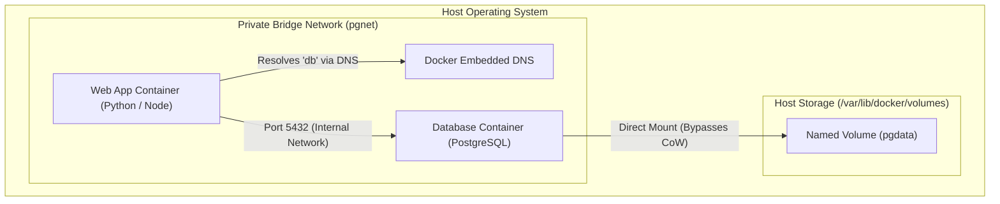

# Lecture 7: Hands-On Docker Engineering — Dockerfiles, Build Layer Caching, Storage Volumes & Orchestration

**Course:** Cloud Computing (CCZG527 / CSIZG527 / SEZG527 / SSZG527 - BITS Pilani WILP)  
**Instructor:** Prof. Arun Vadekkedhil  
**Contact Session / Module:** Session 7: Docker Hands-On, Dockerfiles, Volumes & Orchestration  
**Core Theme:** Deep-dive into practical Docker engineering—how the layered Union File System and Copy-on-Write (CoW) enable lightning-fast caching, writing production-grade Dockerfiles, persistent storage via Docker Volumes, solving the PID 1 signal dilemma, and multi-service orchestration using Docker Compose.

---

## 1. The Big Picture (Why Should I Care?)

- **What is this lecture about?**  
  While Lecture 6 covered what containers are in theory (namespaces and cgroups), Lecture 7 is all about **how to build, run, and persist state in containers**. It covers the anatomy of a `Dockerfile`, how layer caching works, why container storage is ephemeral by default, and how Docker Volumes provide persistent, high-performance database storage.
- **The Real-World Problem:**  
  A developer writes an application Dockerfile that copies all code before running `pip install` or `npm install`. Every single time a developer changes a single line of text or a comment, the CI/CD pipeline takes 8 minutes to re-download 300 packages from scratch! Worse, a team runs PostgreSQL inside a container without an attached volume; when the container crashes and restarts, every single customer record is permanently wiped because the container’s writable layer was reset. Understanding layer caching and volume mechanics prevents these costly operational catastrophes.
- **Where this fits in the course:**  
  This is the hands-on capstone for the Virtualization & Container module. It connects directly to real-world cloud deployments on AWS ECS/EKS and Azure AKS.

---

## 2. Core Concepts Explained Simply

### Concept 1: Docker Images, Layers & Copy-on-Write (CoW)

- **What is a Docker Image?**  
  An immutable, read-only blueprint containing the files, libraries, and binaries required to run an application. An image is built as a **stack of read-only layers**.
- **How Image Layers Work:**  
  Every instruction in a `Dockerfile` (`FROM`, `RUN`, `COPY`) creates a brand-new, read-only filesystem layer stacked on top of the previous one.
- **The Container Writable Layer (Copy-on-Write):**  
  When you launch a container using `docker run`, Docker places a thin, transparent **read-write layer** on top of the stacked read-only image layers.
  * *Reading files:* Reads pass down through the stack to find the file in the image layer.
  * *Modifying files:* Docker copies the file up from the read-only layer into the top writable layer before editing it (this is **Copy-on-Write**).
  * *The Trap:* When the container is deleted (`docker rm`), **this writable layer is destroyed immediately**. Any files saved inside the container disappear forever.

---

### Concept 2: The Anatomy of a Production Dockerfile

A `Dockerfile` is a text recipe that automates image construction. Every line follows a strict instruction keyword:

```dockerfile
# 1. FROM: Specifies the base OS or language runtime image
FROM python:3.12-slim

# 2. WORKDIR: Sets the working directory inside the container (creates it if missing)
WORKDIR /app

# 3. CACHE OPTIMIZATION: Copy dependency manifests FIRST
COPY requirements.txt .

# 4. RUN: Executes commands during the build stage to create new layers
RUN pip install --no-cache-dir -r requirements.txt

# 5. COPY: Copies your actual application source code into the image
COPY . .

# 6. USER: Runs container processes as an unprivileged user (security best practice)
RUN useradd -m appuser
USER appuser

# 7. EXPOSE: Documents the network port the container listens on
EXPOSE 8000

# 8. CMD: The default command executed when the container starts up
CMD ["python3", "app.py"]
```

---

### Concept 3: Layer Caching & The "Kitchen Prep" Rule

> 🍳 **The Kitchen Prep Analogy:**  
> Imagine baking chocolate chip cookies:
> * You buy flour, sugar, and baking powder and store them in the pantry once.
> * You don't drive to the supermarket to buy a new sack of flour every time you want to bake a fresh batch.
> * In Docker, downloading and compiling packages (`npm install` or `pip install`) is the grocery run.
> * If you put `COPY . /app` before your install command, any tiny code edit invalidates Docker’s cache, forcing a complete re-download of all packages every single build!

#### The Golden Build-Order Rule:
1. Copy only dependency files (`package.json` or `requirements.txt`).
2. Run the package installer (`npm install` or `pip install`).
3. Only then copy the rest of your application code (`COPY . .`).
*Result:* Your dependency layer stays 100% cached. Rebuilding after a code change takes **1 second instead of 5 minutes**.

---

### Concept 4: Docker Storage — Ephemeral Writable Layer vs. Named Volumes

Where does application data go?

```text
┌────────────────────────────────────────────────────────────────────────┐
│                        DOCKER STORAGE MECHANISMS                       │
├──────────────────┬─────────────────────────────────────────────────────┤
│ 1. Ephemeral     │ • Resides in container's writable overlay layer.    │
│    Storage       │ • Lost when container is deleted. Slower disk I/O   │
│                  │   due to Copy-on-Write storage driver overhead.     │
├──────────────────┼─────────────────────────────────────────────────────┤
│ 2. Named Volumes │ • Managed completely by Docker on the host disk:    │
│    (-v pgdata:   │   /var/lib/docker/volumes/<vol_name>/_data          │
│    /var/lib/...) │ • Bypasses Copy-on-Write (native NVMe/SSD speed).   │
│                  │ • Survives container crashes, restarts & upgrades.  │
├──────────────────┼─────────────────────────────────────────────────────┤
│ 3. Bind Mounts   │ • Maps an exact host folder into the container:     │
│    (-v /host/dir:│   /Users/shreyash/app:/app                          │
│    /container)   │ • Great for local live-reload coding; dangerous for │
│                  │   production portability due to hardcoded paths.    │
└──────────────────┴─────────────────────────────────────────────────────┘
```

#### What Happens on Container Restarts?
* When a container stops or crashes and is brought back up via `docker start`, **both the writable layer and attached volumes are preserved**.
* However, if a container is removed (`docker rm`) to deploy an updated software image, the writable layer is destroyed. **Only Named Volumes survive**, allowing the new container version to immediately re-attach to existing database data.

---

### Concept 5: The PID 1 Signal Dilemma & Container Lifecycles

In Linux, `PID 1` (the very first process, like `systemd`) has special kernel privileges: it does **not** terminate when receiving standard stop signals like `SIGINT` (Ctrl+C) or `SIGTERM` unless it has explicitly registered a custom signal handler.
* **The Problem:** When running a script using shell form (`CMD sh -c "python app.py"`), `sh` becomes `PID 1`. When you press `Ctrl+C` or Docker sends a stop signal, `sh` ignores it! The container hangs for 10 seconds before Docker gives up and forcibly kills it with `SIGKILL`.
* **The Fix:**
  1. Use **exec-form** in your Dockerfile: `CMD ["python3", "app.py"]` so your application runs directly as PID 1.
  2. Use the `--init` flag during `docker run` (`docker run --init ...`) which injects a tiny, dedicated init daemon (**tini**) as PID 1 to gracefully reap zombie processes and route signals.

---

### Concept 6: Multi-Container Architecture & Docker Compose

> ⚠️ **The Monolithic Container Trap:**  
> Never install Web Server + Database + Message Queue inside a single container!

```text
❌ WRONG: 1 Container Running Web + PostgreSQL + RabbitMQ
  • Violates Single Responsibility.
  • If PostgreSQL crashes, Docker cannot detect it (PID 1 is still running).
  • Cannot scale Web Server independently from Database.

✅ RIGHT: Multi-Container Architecture via Docker Compose
  • Service 1: Web App Container (Python / Node)
  • Service 2: Database Container (PostgreSQL with attached Named Volume)
  • Service 3: Queue Container (RabbitMQ)
  • Connected via an isolated private Docker bridge network (e.g., "pgnet").
  • Container names automatically resolve to internal IPs via Docker's embedded DNS.
```

---

## 3. Visual Architecture Models



---

## 4. Key Comparisons & Trade-Offs

| Docker Command / Concept | `docker run` | `docker start` |
| :--- | :--- | :--- |
| **Target** | Takes an **Image** | Takes an **Existing Container** |
| **Outcome** | Creates a brand-new container with a new ID | Resumes a previously created or stopped container |
| **Flags Accepted** | Accepts configuration flags (`-p`, `-v`, `-e`, `--name`) | Configuration is fixed; cannot modify ports or volumes |
| **Common Error** | Fails with *"Name conflict"* if container already exists | Fails if the named container does not exist |

---

## 5. Professor's Practical Takeaways & Golden Rules

- **Never Hardcode Secrets in Dockerfiles:**  
  Running `ENV DB_PASSWORD=mySecret123` bakes the password permanently into the read-only image layers. Anyone who pulls the image can run `docker history --no-trunc` and read your credentials in plaintext! Inject secrets at runtime using `--env-file .env` or AWS Secrets Manager.
- **Always Clean Package Lists in the Same RUN Layer:**  
  Doing `RUN apt-get update` followed by `RUN apt-get install -y curl` creates two separate layers. The cache created in layer 1 is permanently saved in the image history. Always chain them:
  ```bash
  RUN apt-get update && apt-get install -y --no-install-recommends curl \
      && rm -rf /var/lib/apt/lists/*
  ```
- **Declarative vs. Imperative Orchestration:**  
  *Imperative* is like a TV remote control: you press button by button to change settings. *Declarative* is like a thermostat: you declare *"maintain 22°C"* (desired state in YAML), and the orchestrator (Kubernetes/ECS) continuously reconciles reality to match your declared state.

---

## 6. Quick Recap & Terminology Cheatsheet

- **Image:** Read-only, layered template built from a Dockerfile.
- **Container:** A runnable instance of an image with a thin, writable Copy-on-Write layer on top.
- **Dockerfile:** A reproducible, text-based script to build an image.
- **Named Volume:** Host directory managed by Docker used for persisting stateful data (databases).
- **Embedded DNS:** Built-in Docker mechanism that translates container names into internal IP addresses on custom bridge networks.
- **Docker Compose:** A tool for defining and running multi-container Docker applications using a declarative YAML file.
