# Lecture 1: Introduction to Software Architecture
**Course:** SEZG651 / SSZG653: Software Architectures (BITS Pilani WILP)  
**Instructor:** Prof. Harvinder S. Jabbal  
**Core Theme:** Foundational Definition of Software Architecture, the 3 Core Families of Structures (Module, Component-and-Connector, Allocation), Structures vs. Views, and the Architecture Influence Cycle (AIC).

---

## 1. Executive Overview & Problem Context

### What is this Lecture About? (The 2-Minute Story)
When junior software engineers start their careers, they focus on code: *"How do I write this loop? How do I query this PostgreSQL table? How do I get this pull request merged?"* 

However, senior software architects think about a completely different problem: **How do we structure a system so it does not collapse under its own weight over a 5-year lifecycle?**
* Architecture is about the **macro level (the big picture)**: How major subsystems are partitioned, how they communicate across network boundaries, how they fail independently, and how the system guarantees non-negotiable qualities like sub-second latency, 99.99% availability, and data security.
* Architecture is **not** about internal class design, variable naming, or writing SQL queries (which belong to low-level detailed design / micro level).

```
┌──────────────────────────────────────────────────────────────────────────────────┐
│                               The Central Reality                                │
│                                                                                  │
│   Detailed Design = Micro level (Classes, algorithms, local DB schemas)         │
│   Software Architecture = Macro level (Subsystems, network connectors,           │
│                           failure boundaries, resource allocations, and SLAs)     │
└──────────────────────────────────────────────────────────────────────────────────┘
```

---

### Why Does Architecture Matter to a Software Engineer?

#### 1. The 80% Cost Reality (Maintenance & Evolution)
In commercial software engineering, **80% of total engineering spend occurs AFTER the software is deployed to production**. 
* Junior developers believe shipping `v1.0` is the finish line. In reality, it is the starting line.
* Over the next 5 to 10 years, the system must survive OS upgrades, cloud migrations, third-party API deprecations, security patches, and 10x traffic spikes.
* A poor architecture turns routine business changes into multi-month refactoring nightmares, accumulating crippling technical debt.

#### 2. Avoiding Architectural Collapse
If an engineering team neglects architecture and starts "coding right away":
1. **The Distributed Spaghetti Anti-Pattern:** A change in the payment service breaks the user profile service because services directly query each other's databases or share unversioned memory states.
2. **The Scaling Wall:** The system runs fine for 1,000 users, but at 100,000 users, connection pools saturate, thread deadlocks occur, and the database melts down because synchronous blocking calls were used everywhere.
3. **Security Blindspots:** Authentication checks are duplicated inconsistently across microservices instead of being enforced at an API Gateway boundary.

---

### Where Does this Fit in the Course?
* **Lecture 1 (This Lecture):** Definitions, the 3 Structure Families (Module, C&C, Allocation), Structures vs. Views, and the Architecture Influence Cycle.
* **Lectures 2–3:** Quality Attributes (Availability, Performance, Security, Modifiability, Usability, Interoperability, Testability) and their primitive **Architectural Tactics**.
* **Lectures 4–8:** Architectural Requirements (ASRs), Utility Trees, Attribute-Driven Design (ADD), and Agile Architecting.
* **Lectures 9–14 (Post-Midterm):** Architectural Patterns (Microservices, Event-Driven, Layered, Broker, Cloud-Native, Big Data).

---

## 2. Core Concepts Explained Simply

---

### Concept 1: The SEI Definition of Software Architecture

#### The Formal Definition (Bass, Clements, Kazman)
> *"The software architecture of a system is the set of structures needed to reason about the system, which comprise software elements, relations among them, and properties of both."*

Let’s unpack this dense definition into 4 concrete engineering realities:

1. **"Set of structures" (No Single Diagram Tells the Whole Story):**
   * A software system cannot be represented by a single architecture drawing. A complete architecture requires multiple complementary structures: how code is organized on disk (*Module*), how processes communicate in RAM (*C&C*), and how containers sit on cloud hardware (*Allocation*).
2. **"Software elements and relations":**
   * Architecture consists of **software elements** (packages, services, databases, threads) connected by strictly defined **relations** (calls, sends-message-to, inherits-from, runs-on).
3. **"Properties of both":**
   * Architects care about **externally visible properties** (latency SLAs, throughput bounds, interface contracts, error semantics, thread-safety). We intentionally **hide private implementation details** (internal variable names, local helper algorithms).
4. **"Needed to reason about the system":**
   * A detail is only "architectural" if it helps you evaluate critical system qualities. Knowing that Service A calls Service B over HTTPS with a 500ms timeout is architectural; knowing whether Service A uses a `for` loop or a `while` loop inside a private method is not.

#### Two Engineering Truths:
* **Every system has an architecture:** Even a chaotic 50,000-line PHP script written in a weekend has an architecture—it’s just an undocumented, brittle, and terrible architecture!
* **Whiteboard Box-and-Line sketches are NOT architecture:** Drawing boxes labeled "Backend" and "Database" with an arrow between them means nothing. Unless the arrow specifies the protocol (e.g., gRPC over HTTP/2, JDBC connection pool), timeout policies, serialization formats (Protobuf, JSON), and failure behavior, it is just an ambiguous doodle.

---

### Concept 2: Structures vs. Views (The Doctor & Database Analogies)

A foundational concept in software architecture is the distinction between what exists in reality vs. how we document it:

* **Structure:** The actual, physical reality of the system as it exists (code files on disk, processes executing in RAM, server instances in AWS).
* **View:** A documented representation of a specific structure created for a specific stakeholder.

> **The Golden Rule:** *Architects design structures, but they document views.*

```mermaid
flowchart TD
    subgraph REALITY ["Physical Reality (The System)"]
        SYS["Software System<br/>(Contains all Code, Processes, Networks, and Hardware)"]
    end

    subgraph VIEWS ["Documented Views (Tailored Slices)"]
        V1["<b>Module View</b><br/>(For Developers: Packages, Git Repos, Dependencies)"]
        V2["<b>C&C View</b><br/>(For SREs & Perf Engineers: Latency, Ports, Microservices)"]
        V3["<b>Allocation View</b><br/>(For DevOps & Security: EC2 Nodes, VPCs, Firewalls)"]
    end

    SYS -->|Documented as| V1
    SYS -->|Documented as| V2
    SYS -->|Documented as| V3

    style REALITY fill:#0f172a,stroke:#38bdf8,stroke-width:1.5px
    style VIEWS fill:#0f172a,stroke:#c084fc,stroke-width:1.5px
```



#### Everyday Engineering Analogies:
1. **The Database Analogy:**
   * **Database Tables (DDL):** The real underlying storage structure on disk.
   * **SQL Views (`CREATE VIEW`):** Tailored virtual projections created for specific applications or user roles.
2. **The Medical Specialist Analogy:**
   * The human body has bones, nerves, and blood vessels intertwined.
   * An **Orthopedic Surgeon** needs an X-ray (a view of the *skeletal structure*).
   * A **Cardiologist** needs an Angiogram (a view of the *blood vessel structure*).
   * Neither doctor can work with a standard color photograph of a person wearing clothes! Different engineering stakeholders require different architectural views.

---

### Concept 3: The 3 Families of Architectural Structures

Every architectural structure belongs to one of three universal families:

```
                  ┌──────────────────────────────────────────────┐
                  │        Three Categories of Structures        │
                  └──────────────────────┬───────────────────────┘
                                         │
         ┌───────────────────────────────┼───────────────────────────────┐
         ▼                               ▼                               ▼
┌──────────────────┐           ┌──────────────────┐           ┌──────────────────┐
│ 1. Module        │           │ 2. Component &   │           │ 3. Allocation    │
│    Structures    │           │    Connector     │           │    Structures    │
│ (Static Code)    │           │ (Runtime)        │           │ (Real World Map) │
│ • Packages       │           │ • Linux Procs    │           │ • K8s to EC2     │
│ • Dependencies   │           │ • gRPC / Kafka   │           │ • Team to Repo   │
└──────────────────┘           └──────────────────┘           └──────────────────┘
```

#### 1. Module Structures (Static / Design-Time Code Units)
* **What are they?** How source code is partitioned into files, packages, classes, and libraries in your Git repositories at compile time.
* **Core Question:** What are the boundaries of responsibility, and what code depends on what other code?
* **Key Sub-structures:**
  * **Decomposition Structure:** Breaking large domains into sub-packages (`is-a-submodule-of`). Dictates team ownership and modularity.
  * **Uses Structure:** Module $A$ *uses* Module $B$ if $A$ requires a correct, working version of $B$ to function. Essential for extracting minimal viable subsets (MVPs) and testing.
  * **Layered Structure:** Strict hierarchy (`allowed-to-use`). High-level business logic can only call the layer immediately below it (e.g., Controller $
ightarrow$ Service $
ightarrow$ Repository). Guarantees platform portability.
  * **Class / Generalization Structure:** OOP inheritance hierarchies (`inherits-from`).

#### 2. Component-and-Connector (C&C) Structures (Dynamic / Runtime Elements)
* **What are they?** How the software runs in active computer memory (RAM, CPU, network sockets).
* **Components:** Active runtime execution units (Linux processes, Kubernetes Pods, background daemons, thread pools, database engines).
* **Connectors:** Communication pathways between components (REST over HTTPS, gRPC over HTTP/2, Kafka message topics, shared memory ring buffers).

> 💡 **Tech Quick-Primer (`Kubernetes & Pods`):** *Kubernetes (K8s) is an open-source container orchestration engine that automates deploying, scaling, and managing containerized services. A **Pod** is the smallest deployable compute unit in Kubernetes, wrapping one or more Docker containers that share the same network IP, port space, and storage volumes.*

> 💡 **Tech Quick-Primer (`gRPC & Protocol Buffers`):** *A high-performance remote procedure call (RPC) framework developed by Google. Instead of transmitting bulky, human-readable text JSON over HTTP/1.1, gRPC serializes structured data into compact, pre-compiled binary messages (**Protobuf**) over multiplexed HTTP/2 streams, slashing latency and network bandwidth by up to 70%.*

> 💡 **Tech Quick-Primer (`Apache Kafka`):** *A distributed, horizontally scalable event streaming log. Unlike traditional message queues (like RabbitMQ) that delete messages once read, Kafka persists an ordered, immutable stream of events to disk across partitioned topics, allowing multiple independent consumer services to process data at their own speed.*

* **Core Question:** Where do bottlenecks occur? How does data flow? Can distributed deadlocks happen? What is the failover path?
* **Sub-structures:**
  * **Service Structure:** Microservices communicating via RPC or asynchronous message brokers.
  * **Concurrency Structure:** Multi-threaded worker pools executing parallel tasks without data races.

#### 3. Allocation Structures (Mapping Software to the Real World)
* **What are they?** Mapping software abstractions onto physical cloud hardware, file directories, and human engineering teams.
* **Key Sub-structures:**
  * **Deployment Structure:** Which Docker container runs on which AWS EC2 instance or Kubernetes node (`allocated-to`). Dictates latency, fault domains, and data sovereignty compliance.
  * **Implementation Structure:** How code modules are mapped to Git repositories, build artifacts (`.jar`, `.whl`, Docker images), and CI/CD pipelines (`stored-in`).
  * **Work Assignment Structure:** Which engineering squad builds, owns, and maintains which microservice (`assigned-to`). Directly connects to **Conway's Law**.

---

### Concept 4: Modules vs. Components (The Crucial Distinction)

One of the most frequent exam mistakes and industry confusions is mixing up **Modules** and **Components**:

| Feature | Module (Static / Design-Time) | Component (Dynamic / Runtime) |
| :--- | :--- | :--- |
| **When does it exist?** | **Design time / Compile time** | **Runtime (Execution in RAM)** |
| **What is it?** | A code unit (package, `.go` file, Java class, library) | An executing process, thread pool, container, or VM |
| **Where does it live?** | In your Git repository or local filesystem | In computer RAM, CPU registers, or Kubernetes Pod |
| **Primary Concern** | Modifiability, reusability, build times, clean code | Throughput, latency, memory usage, concurrency |
| **Relation Examples** | `depends-on`, `uses`, `is-a-submodule-of` | `calls`, `sends-message-to`, `replicates-state-to` |

#### The Many-to-Many Mapping Reality:
* **One Module $
ightarrow$ Many Components:** You write a single Go microservice module (`order_service.go`). In production, Kubernetes spins up **50 replica Pods (components)** behind an AWS Application Load Balancer.
* **Many Modules $
ightarrow$ One Component:** You write 40 different modules (logging utilities, database connectors, JWT validators, domain logic). At build time, they all get compiled into a single executable binary process (e.g., an monolithic Spring Boot `.jar` component).

---

### Concept 5: Conway's Law & The Reverse Conway Maneuver

> **Conway's Law:** *"Organizations which design systems are constrained to produce designs which are copies of the communication structures of these organizations."* — Melvin Conway (1967)

* **The Reality:** If a software company has 3 separate engineering teams (Frontend Team, Backend Team, Database DBA Team), the software will inevitably end up with 3 distinct architectural layers (UI layer, API layer, Database layer), with heavy communication overhead and ticket handoffs between them.
* **The Reverse Conway Maneuver (Modern Cloud Practice):**
  * Modern tech giants (Netflix, Amazon) design the **target software architecture first** (e.g., loosely coupled, independently deployable microservices).
  * Then, they restructure their human teams to mirror that architecture (**Cross-Functional "Two-Pizza" Squads** owning one microservice end-to-end: frontend, backend, infra, and database).

---

### Concept 6: The Walking Skeleton (Architectural Spike)

* **What is it?** An ultra-minimal, end-to-end implementation of the system with **zero business logic**, but with all core architectural connectors and infrastructure wired up.
* **How it Works in Modern DevOps:**
  * Build a basic "Hello World" service that connects to a real PostgreSQL database, publishes an event to a real Kafka topic, and exposes a `/health` endpoint.
  * Deploy this walking skeleton through your production CI/CD pipeline onto a staging Kubernetes cluster on Day 1.

> 💡 **Tech Quick-Primer (`CI/CD Pipelines`):** *Continuous Integration / Continuous Deployment (e.g., GitHub Actions, GitLab CI) is an automated server script triggered on every Git push. It checks out code, runs linters and unit tests (CI), builds a Docker container image, and deploys it to cloud infrastructure (CD) without manual developer intervention.*
* **Why do this early?**
  * Proves that network firewalls, TLS certificates, database drivers, and deployment scripts actually work.
  * Exposes architectural integration bottlenecks weeks before developers write thousands of lines of business code.

---

### Concept 7: The Architecture Influence Cycle (AIC)

Architecture does not exist in an academic bubble. It is continuously shaped by, and in turn shapes, its surrounding environment:

```mermaid
flowchart TD
    subgraph INFLUENCE ["The 4 Environmental Contexts"]
        TC["<b>Technical Context:</b> Cloud, Kubernetes, Kafka, AI tools"]
        BC["<b>Business Context:</b> Time-to-market, budget, revenue model"]
        PC["<b>Project Context:</b> Agile sprints, team size, offshore vendors"]
        PR["<b>Professional Context:</b> Architect's past experience & habits"]
    end

    ARCHITECT["Software Architect"]
    ARCHITECTURE["Software Architecture"]
    SYSTEM["Production System"]

    TC & BC & PC & PR --> ARCHITECT
    ARCHITECT -->|Designs| ARCHITECTURE
    ARCHITECTURE -->|Guides Implementation| SYSTEM

    SYSTEM -.->|Enables new revenue & scale| BC
    SYSTEM -.->|Advances team skills & tech stack| TC
    SYSTEM -.->|Builds real-world expertise| ARCHITECT

    style INFLUENCE fill:#0f172a,stroke:#38bdf8,stroke-width:1.5px
```



* **The Two-Way Feedback Loop:**
  1. *Forward Flow:* Business goals and technical constraints force the architect to make design choices, resulting in the deployed system.
  2. *Feedback Loop:* Once deployed, a wildly successful system (like Google's MapReduce or Netflix's Chaos Monkey) opens new business markets, changes user expectations, and advances the industry's entire technical ecosystem.

---

## 3. Visual Architectural Models

### Diagram 1: The Three Families of Architectural Structures

```mermaid
graph TD
    ARCH["<b style='color:#ffffff; font-size:15px;'>Software Architecture Structures</b>"]

    ARCH --> M["<b style='color:#ffffff;'>1. Module Structures</b><br/><span style='color:#cbd5e1;'>(Design / Compile-Time Code)</span>"]
    ARCH --> CC["<b style='color:#ffffff;'>2. Component & Connector</b><br/><span style='color:#cbd5e1;'>(Active Runtime in RAM)</span>"]
    ARCH --> A["<b style='color:#ffffff;'>3. Allocation Structures</b><br/><span style='color:#cbd5e1;'>(Physical Mappings)</span>"]

    M --> M1["Decomposition (is-a-submodule-of)"]
    M --> M2["Uses (A uses B)"]
    M --> M3["Layer (allowed-to-use)"]
    M --> M4["Class / Interface Inheritance"]

    CC --> CC1["Service Structure (REST / gRPC)"]
    CC --> CC2["Concurrency Structure (Thread Pools)"]
    CC --> CC3["Event Streaming (Kafka Topics)"]

    A --> A1["Deployment (Pod -> AWS EC2 Node)"]
    A --> A2["Implementation (Module -> Git Repo)"]
    A --> A3["Work Assignment (Microservice -> Squad)"]

    style ARCH fill:#1e293b,stroke:#38bdf8,stroke-width:2.5px,color:#ffffff
    style M fill:#0f172a,stroke:#38bdf8,stroke-width:1.5px,color:#ffffff
    style CC fill:#0f172a,stroke:#c084fc,stroke-width:1.5px,color:#ffffff
    style A fill:#0f172a,stroke:#4ade80,stroke-width:1.5px,color:#ffffff

    style M1 fill:#1e293b,stroke:#475569,stroke-width:1px,color:#ffffff
    style M2 fill:#1e293b,stroke:#475569,stroke-width:1px,color:#ffffff
    style M3 fill:#1e293b,stroke:#475569,stroke-width:1px,color:#ffffff
    style M4 fill:#1e293b,stroke:#475569,stroke-width:1px,color:#ffffff

    style CC1 fill:#1e293b,stroke:#475569,stroke-width:1px,color:#ffffff
    style CC2 fill:#1e293b,stroke:#475569,stroke-width:1px,color:#ffffff
    style CC3 fill:#1e293b,stroke:#475569,stroke-width:1px,color:#ffffff

    style A1 fill:#1e293b,stroke:#475569,stroke-width:1px,color:#ffffff
    style A2 fill:#1e293b,stroke:#475569,stroke-width:1px,color:#ffffff
    style A3 fill:#1e293b,stroke:#475569,stroke-width:1px,color:#ffffff
```



*Walkthrough:* Static code in Git (*Module*) gets compiled and deployed as active processes in RAM (*C&C*), which are scheduled onto physical cloud servers and built by human engineering squads (*Allocation*).

---

### Diagram 2: Module View vs. Component View (Compilation & Deployment Flow)

```mermaid
flowchart LR
    subgraph MOD ["Module View (Static Source Code)"]
        direction TB
        M_CORE["Core Billing Module<br/>(billing.go)"]
        M_AUTH["Auth Middleware<br/>(auth.go)"]
        M_DB["DB Connector<br/>(postgres.go)"]
    end

    subgraph BUILD ["Build & CI/CD Pipeline"]
        CI["Compile & Package<br/>(Docker Image: billing:v2.1)"]
    end

    subgraph CC ["Component & Connector View (Production Runtime)"]
        direction TB
        POD1["K8s Pod Instance 1<br/>(Active Linux Process)"]
        POD2["K8s Pod Instance 2<br/>(Active Linux Process)"]
        ALB["AWS Application Load Balancer"]
        DB[(PostgreSQL Primary)]

        ALB -->|HTTPS / Round-Robin| POD1 & POD2
        POD1 & POD2 -->|TCP Connection Pool| DB
    end

    M_CORE & M_AUTH & M_DB --> CI
    CI -.->|Deploys as 2 Replicas| POD1 & POD2

    style MOD fill:#0f172a,stroke:#38bdf8,stroke-width:1.5px
    style BUILD fill:#0f172a,stroke:#fbbf24,stroke-width:1.5px
    style CC fill:#0f172a,stroke:#4ade80,stroke-width:1.5px
```



*Walkthrough:* Multiple static modules (`billing.go`, `auth.go`, `postgres.go`) are packaged into a single Docker image, which is instantiated as multiple active runtime Pod components connected via load balancers and connection pools.

---

## 4. Key Trade-Offs & Comparisons

### Table 1: Macro Architecture vs. Micro Detailed Design
| Dimension | Software Architecture (Macro Level) | Detailed Design (Micro Level) |
| :--- | :--- | :--- |
| **Scope** | System-wide subsystem boundaries, network connectors, protocols. | Local class design, function signatures, algorithms. |
| **Change Cost** | Extremely high (months of refactoring, API breaks). | Low to Moderate (localized to a single class or file). |
| **Focus** | Quality Attributes (Latency, Uptime, Security, Modifiability). | Unit functionality, algorithmic correctness, clean code. |
| **Who Owns It?** | Software Architects, Principal Engineers, Tech Leads. | Software Engineers, Senior Developers. |

---

### Table 2: Module vs. Component vs. Allocation Structures
| Dimension | Module Structures | Component-and-Connector (C&C) | Allocation Structures |
| :--- | :--- | :--- | :--- |
| **Lifecycle Phase** | Compile-time / Build-time. | Runtime / Execution in RAM. | Deployment / Organizational. |
| **Primary Elements** | Packages, classes, source files. | Running processes, threads, Pods. | EC2 nodes, data centers, squads. |
| **Primary Relations** | `depends-on`, `uses`, `inherits`. | `sends-message-to`, `calls`, `syncs`. | `allocated-to`, `assigned-to`. |
| **Key Engineering Value** | Modifiability, modularity, team PR flow. | Throughput, latency, deadlocks. | Cloud costs, disaster recovery, laws. |

---

### Table 3: Strict Layering vs. Relaxed Layering
| Dimension | Strict Layering | Relaxed Layering |
| :--- | :--- | :--- |
| **Rule** | Layer $N$ can ONLY call Layer $N-1$. | Layer $N$ can call ANY layer below it ($N-1, N-2$). |
| **Advantage** | High decoupling; can swap lower layers cleanly. | Lower latency; avoids useless "pass-through" boilerplates. |
| **Disadvantage** | Minor performance overhead (layer hops). | Leaky abstractions; changing Layer 1 breaks Layer 3. |
| **When to Use** | Operating systems (POSIX), network protocol stacks. | High-throughput web services, gaming backends. |

---

## 5. Professor's Practical Tips & Classroom Advice

*(Synthesized directly from Prof. Harvinder S. Jabbal's lecture discussions)*

### 1. The Golden Rule for Architects: "Delay Decision-Making!"
* Junior engineers often assume a Chief Architect must make all technology choices on Day 1.
* Prof. Jabbal strongly cautioned against this: **Freeze architectural decisions only when you have sufficient information to commit safely.**
* If you pick a specific NoSQL vendor (e.g., MongoDB) before your data access patterns are understood, you trap your team. Encapsulate your persistence layer behind a generic repository interface, and delay picking the concrete database engine until prototype workloads provide real metrics.

### 2. Legal Constraints Dictate Architecture (Data Sovereignty)
* Architecture is not just about elegant code; it is governed by international law and corporate compliance.
* Under Indian financial and data protection regulations (RBI directives), financial transactions and health records of Indian citizens must have their primary persistent copy stored **physically within Indian borders**.
* This non-functional constraint dictates an immediate **Deployment Allocation Structure**: database clusters must reside in AWS Mumbai (`ap-south-1`) or Azure Central India, regardless of where the development team lives.

### 3. The Exam Reality (Scenario-Based Scoring)
* Midterm is closed-book; Comprehensive final is open-book.
* **Warning:** In open-book exams, students who copy slide bullets word-for-word receive **zero marks**. University examiners construct concrete production scenarios. You are tested on your ability to select and justify the *exact architectural structure or tactic* that solves the scenario.

---

## 6. Exam-Ready Question Bank

### Part A: Short-Answer Questions (2–3 Marks Each)

#### Q1: State the formal SEI definition of Software Architecture and identify its 3 key components.
* **Answer:** Software architecture is the set of structures needed to reason about the system, comprising software elements, relations among them, and properties of both. The 3 key components are: (1) Software elements, (2) Relations among them, and (3) Externally visible properties of both.

#### Q2: Differentiate between a Structure and a View with a clear software engineering example.
* **Answer:**
  * A **Structure** is the real-world set of elements and relations as they physically exist in code, RAM, or servers.
  * A **View** is a written or drawn projection of a structure tailored for a specific stakeholder.
  * *Example:* The running Docker containers and network bridges on a server are the structure; a Kubernetes deployment YAML diagram drawn for DevOps engineers is a view.

#### Q3: What is the "Uses" relation, and how does it enable incremental release cycles?
* **Answer:**
  * Module $A$ **uses** Module $B$ if the correct execution of $A$ depends on the existence of a working, non-stubbed version of $B$.
  * If the uses relation is strictly acyclic and modular, architects can strip away non-essential modules and release a minimal viable product (MVP) to customers early without waiting for the full system to be built.

#### Q4: Differentiate between a Module and a Component.
* **Answer:**
  * A **Module** is a static, design-time code unit residing in a filesystem or Git repository (e.g., a `.java` class or Go package).
  * A **Component** is an active, runtime execution unit residing in RAM/CPU (e.g., a running Linux process, thread pool, or Docker container).
  * They share a many-to-many relationship.

#### Q5: What is a "Walking Skeleton," and why should engineering teams deploy it on Day 1?
* **Answer:** A walking skeleton is a minimal end-to-end implementation that connects all architectural layers and infrastructure (UI $
ightarrow$ API $
ightarrow$ Database) with dummy business logic. Deploying it on Day 1 through real CI/CD pipelines validates network connectivity, environment configurations, and build automation before heavy business logic is written.

#### Q6: Explain Conway's Law in the context of modern cloud-native engineering.
* **Answer:** Conway's Law states that system architectures naturally mirror the communication structure of the organization that builds them. In cloud-native engineering, companies apply the *Reverse Conway Maneuver*: organizing cross-functional squads (owning UI, API, DB, and deployment) to produce independently deployable microservices.

---

### Part B: Analytical & Scenario Questions (5–10 Marks Each)

#### Q1 (Scenario Analysis - Enterprise Architecture Mapping):
**Scenario:** A fintech enterprise is building a real-time fraud detection engine for payment card transactions. The system must process transactions within 100 milliseconds, guarantee zero data loss, ensure that transaction records physically reside in domestic data centers, and allow the analytics model to be updated weekly without taking down the payment gateway.  
**Task:** Identify and describe:
1. One **Module Structure** to ensure weekly analytics updates without downtime. [3 Marks]
2. One **Component-and-Connector (C&C) Structure** to achieve the 100ms latency budget. [3 Marks]
3. One **Allocation Structure** to satisfy data residency regulations. [3 Marks]

* **Answer Guidelines & Scoring Points:**
  1. **Module Structure (Layered / Separation of Concerns) [3 Marks]:**
     * Separate the Fraud Scoring Engine from the Transaction Gateway using abstract interfaces (Dependency Inversion).
     * The fraud detection logic is packaged as an independent module or dynamic plugin behind an interface, allowing model updates without modifying or recompiling the core payment gateway.
  2. **Component-and-Connector Structure (Asynchronous Event-Driven / Concurrency) [3 Marks]:**
     * Deploy an in-memory stream processing pipeline using an asynchronous message broker (e.g., Apache Kafka) and an in-memory cache (Redis) for real-time feature lookups.
     * The payment processor dispatches transactions to the stream worker pool asynchronously, keeping processing latency well within the 100ms threshold.
  3. **Allocation Structure (Deployment Structure) [3 Marks]:**
     * Use a deployment mapping (`allocated-to`) that pins primary relational database clusters and persistent Kafka broker disks to servers located within national borders (e.g., AWS Mumbai `ap-south-1`).
     * Ensure database read replicas and compute nodes comply with statutory physical boundary constraints.

---

#### Q2 (Core Mechanics - The Architecture Influence Cycle):
**Explain the Architecture Influence Cycle (AIC). Detail the four contexts that influence the architect, and explain how the deployed system alters those contexts in return.**

* **Answer Guidelines & Scoring Points:**
  * **The 4 Contexts [3 Marks]:**
    1. *Technical Context:* Current cloud platforms, available databases, open-source frameworks, and non-functional requirements.
    2. *Project Context:* Sprint cycles, delivery deadlines, team staffing, and budget allocations.
    3. *Business Context:* Profitability models, time-to-market targets, and customer retention goals.
    4. *Professional Context:* The architect's technical background, architectural biases, and past design experience.
  * **The Forward Flow [2 Marks]:** The architect synthesizes stakeholder requirements and environmental contexts to produce the architecture, which directs the development of the running system.
  * **The Feedback Loops [3 Marks]:**
    * *Feedback to Business:* High system performance allows the enterprise to capture new market segments and offer lower SLA prices.
    * *Feedback to Technical:* The successful implementation establishes company-wide reusable libraries, custom microservice blueprints, and CI/CD pipelines.
    * *Feedback to the Architect:* The architect learns from production incidents and operational metrics, refining their technical instincts for future system designs.
  * **Diagram [2 Marks]:** Neat sketch showing the forward design flow and the 3 circular feedback paths.

---

## 7. Quick Revision & 60-Second Exam Recap

### Key Terms Glossary
* **Software Architecture:** Set of structures needed to reason about the system (Elements + Relations + Properties).
* **Structure:** The physical reality of software/hardware elements and connections.
* **View:** A documented representation of a structure created for a specific stakeholder.
* **Module:** Static code unit at compile time (package, class, source file).
* **Component:** Active runtime execution unit in RAM (process, thread, Pod, container).
* **Connector:** Runtime communication mechanism between components (REST, gRPC, Kafka).
* **Conway's Law:** Architectural structures mirror organizational communication channels.
* **Reverse Conway Maneuver:** Organizing engineering squads to match the target microservice architecture.
* **Walking Skeleton:** Minimal runnable end-to-end system deployed via CI/CD with dummy business logic.
* **AIC (Architecture Influence Cycle):** Two-way evolutionary feedback loop between context, architect, architecture, and system.

---

### The 5 Golden Rules to Remember
1. **Architecture = Multiple Structures:** No single whiteboard drawing or C4 diagram can represent a full architecture.
2. **Quality Attributes Drive Structure:** Architecture exists to achieve non-functional qualities (speed, uptime, security, ease of change); functionality does not dictate structure.
3. **Delay Decisions:** Freeze architectural boundaries early; delay picking volatile vendor tools and database engines as long as safely possible.
4. **Keep Changes Local:** A well-architected system ensures that 90% of routine business edits require changes to only a single module.
5. **Views are for Humans, Structures are for Reality:** Architects design real physical structures, but document specialized views for developers, SREs, and management.

---

### 60-Second Rapid Fire Q&A
* *Q: What is a module?*  
  $\rightarrow$ Static source code in your Git repository (classes, packages, files).
* *Q: What is a component?*  
  $\rightarrow$ An active runtime process executing in memory (e.g., a Kubernetes Pod or Docker container).
* *Q: Can one module map to multiple runtime components?*  
  $\rightarrow$ Yes. One compiled microservice binary can run as 50 horizontal Pod replicas.
* *Q: What are the three primary structure families?*  
  $\rightarrow$ Module Structures (static code), Component-and-Connector (runtime execution), and Allocation Structures (hardware/team mappings).
* *Q: What is the 80% rule in software engineering?*  
  $\rightarrow$ 80% of total software lifecycle cost occurs post-deployment in maintenance and evolution.
* *Q: What does Conway's Law predict?*  
  $\rightarrow$ System architecture will replicate the team communication hierarchy of the company.
