# Lecture 1: Introduction to Software Architecture
**Course:** SEZG651 / SSZG653: Software Architectures (BITS Pilani WILP)  
**Instructor:** Prof. Harvinder S. Jabbal  
**Core Theme:** What Software Architecture is, the 3 Structural Families (Module, Component-and-Connector, Allocation), Structures vs. Views, and the Architecture Influence Cycle (AIC).

---

## 1. The Big Picture (Why Should I Care?)

- **What is this lecture about?**  
  As a software engineer, you spend most of your day writing functions, fixing bugs, and calling APIs. Software Architecture steps back to look at the whole system: how major building blocks are split, how they communicate across the network, and how the system survives under load, changes, and hardware failures over 5–10 years.
- **The Real-World Problem:**  
  Writing code that "just works" on your laptop is easy. Building a system that doesn't collapse when traffic grows 10x, or that doesn't take 3 months of refactoring just to add a new payment method, is hard. Over **80% of software costs happen after deployment** (maintenance and updates). A bad architecture creates "spaghetti systems" that are painful and expensive to maintain.
- **Where this fits in the course:**  
  This lecture sets the foundation: defining what architecture actually is, the different structures that make it up, and the environment that influences it. Future lectures dive into specific **Quality Attributes** (like performance and security) and the architectural tactics to achieve them.

---

## 2. Core Concepts Explained Simply

### Concept 1: What is Software Architecture? (The SEI Definition)

#### Plain English Definition
Software Architecture is the high-level blueprint of a system. It defines the major building blocks, how they interact, and the rules and constraints they must follow.

#### The Formal Definition (Bass, Clements, Kazman)
> *"The software architecture of a system is the set of structures needed to reason about the system, which comprise software elements, relations among them, and properties of both."*

Let’s break down the 4 key phrases:
1. **"Set of structures":** No single diagram can explain an entire system. You need multiple views (how code is organized in Git, how processes run in RAM, and where servers live in the cloud).
2. **"Software elements":** The building blocks (e.g., packages, microservices, databases, threads).
3. **"Relations among them":** How the elements connect (e.g., *calls*, *sends-message-to*, *inherits-from*, *runs-on*).
4. **"Properties of both":** Focuses on **externally visible behaviors** (e.g., response time, error codes, throughput). It intentionally **hides internal implementation details** (like private variables or helper loops inside a method).

#### Two Important Rules of Thumb:
* **Every system has an architecture:** Even a messy script hacked together in a weekend has an architecture—it’s just undocumented, rigid, and fragile.
* **A box-and-line drawing is NOT an architecture:** Drawing two boxes labeled "Backend" and "Database" with an arrow between them is just a doodle. It becomes architecture only when you specify the protocol (e.g., REST over HTTPS, connection pools), timeouts, security tokens, and error handling.

---

### Concept 2: Architecture (Macro) vs. Detailed Design (Micro)

* **Architecture (Macro Level):** System-wide decisions that are expensive and difficult to change later (e.g., choosing microservices vs. monolith, selecting asynchronous messaging vs. direct REST calls, defining database boundaries).
* **Detailed Design (Micro Level):** Localized implementation choices that are easy to refactor without affecting other teams (e.g., choosing a `for` loop vs. `map()`, selecting an algorithm, naming internal class variables).

---

### Concept 3: Why Does Architecture Matter? (The 4 Core Reasons)

1. **Enables or Inhibits Quality Attributes:**  
   Quality attributes (performance, availability, security, modifiability) are baked in at the architectural level. If your architecture relies on slow synchronous calls across 10 services, no amount of code cleanup or faster algorithms will fix the latency.
2. **Manages and Reasons About Change:**  
   The earliest decisions made on a project are the hardest to change and the most expensive to fix later. A clean architecture ensures that 90% of business changes are isolated to a single service or module.
3. **Improves Communication Among Stakeholders:**  
   Stakeholders (product managers, developers, DevOps, security, executives) all have different concerns. Architecture provides a common, high-level language everyone can understand without getting lost in the code.
4. **Shapes Project Constraints & Team Organization:**  
   How you divide the architecture dictates how you divide your engineering teams (frontend team, payment team, data team) and allows teams to build, test, and release features independently.

---

### Concept 4: Structures vs. Views (The Doctor Analogy)

* **Structure:** The actual reality of the system as it exists (code files stored on disk, processes running in RAM, virtual machines in the cloud).
* **View:** A diagram or document that highlights one specific perspective for a specific audience.

> **The Golden Rule:** *Architects design structures, but they document views.*

#### The Medical Specialist Analogy:
A patient’s body contains bones, blood vessels, and nerves all intertwined (the *structure*).
* An **Orthopedic Surgeon** needs an **X-ray** (a view of the *skeletal structure*).
* A **Cardiologist** needs an **Angiogram** (a view of the *circulatory structure*).
* A regular photograph of the patient is useless to both! Similarly, developers need code views, DevOps engineers need deployment views, and SREs need runtime traffic views.

---

### Concept 5: The 3 Core Families of Structures

Every architectural structure falls into one of three universal categories:

```
                      ┌──────────────────────────────────────────────┐
                      │        Three Categories of Structures        │
                      └──────────────────────┬───────────────────────┘
                                             │
             ┌───────────────────────────────┼───────────────────────────────┐
             ▼                               ▼                               ▼
    ┌──────────────────┐           ┌──────────────────┐           ┌──────────────────┐
    │ 1. Module        │           │ 2. Component &   │           │ 3. Allocation    │
    │    Structures    │           │    Connector     │           │    Structures    │
    │ (Static Code)    │           │ (Runtime)        │           │ (Real-World Map) │
    │ • Packages/Files │           │ • Running procs  │           │ • Code to Servers│
    │ • Design Time    │           │ • RAM & Network  │           │ • Code to Teams  │
    └──────────────────┘           └──────────────────┘           └──────────────────┘
```

#### 1. Module Structures (Static Code / Design-Time Units)
* **What are they?** How source code is organized into files, classes, packages, and folders in your repository *before* it runs.
* **Core Question:** What are the boundaries of responsibility, and what code depends on what other code?
* **Key Sub-structures:**
  * **Decomposition Structure:** Breaking a big system into smaller sub-packages (`submodule-of`). Dictates code ownership and encapsulation.
  * **Uses Structure:** Module A *uses* Module B if A requires a working version of B to function correctly. This is crucial for extracting a Minimal Viable Product (MVP) or writing independent unit tests.
  * **Layered Structure:** Modules organized into strict tiers where a higher layer is only `allowed-to-use` the layer directly beneath it (e.g., Controller $\rightarrow$ Service $\rightarrow$ Repository). Keeps layers portable and interchangeable.
  * **Class / Generalization Structure:** Object-oriented inheritance trees (`inherits-from`).
  * **Data Model:** How data entities and schemas relate to each other (e.g., User `has-many` Orders).

#### 2. Component-and-Connector (C&C) Structures (Dynamic / Runtime Elements)
* **What are they?** How the software behaves when executing actively in computer memory (RAM, CPU, network).
* **Components:** Running execution units (e.g., web server processes, background workers, database engines).
* **Connectors:** Communication paths between components (e.g., REST API calls, message queues, database connections).
* **Common C&C Styles:**
  * **Service-Oriented / Microservices:** Independent services communicating via APIs.
  * **Client-Server:** Frontends making requests to a central backend.
  * **Pipe-and-Filter:** Data flows sequentially through discrete processing steps (e.g., an audio/video processing pipeline).
  * **Publish-Subscribe (Pub/Sub):** Publishers send events to a topic without knowing who the subscribers are.

> 💡 **Tech Quick-Primer (`Message Queue / Pub-Sub`):** *A messaging tool (like RabbitMQ or Kafka) that sits between services. Instead of Service A waiting synchronously for Service B to respond, Service A drops a message onto a queue and moves on immediately, improving system responsiveness and decoupling services.*

#### 3. Allocation Structures (Mapping Software to Non-Software)
* **What are they?** How software elements map to the physical world—servers, filesystems, and human teams.
* **Key Sub-structures:**
  * **Deployment Structure:** Which running service or container runs on which cloud server or virtual machine (`runs-on`).
  * **Implementation Structure:** How code modules map to Git repositories, directories, and build packages (`stored-in`).
  * **Work Assignment Structure:** Which engineering squad or developer owns which module or service (`assigned-to`).

---

### Concept 6: Modules vs. Components (The #1 Confusion)

This is one of the most common points of confusion for engineers:

| Feature | Module (Static / Design-Time) | Component (Dynamic / Runtime) |
| :--- | :--- | :--- |
| **When does it exist?** | **Compile time / Design time** | **Runtime (Execution in RAM)** |
| **What is it?** | A code unit (file, class, package, library) | A running process, container, or thread pool |
| **Where does it live?** | In your Git repo or filesystem | In computer memory (RAM / CPU) |
| **Primary Goal** | Clean code, modifiability, reusability | Throughput, low latency, fault tolerance |
| **Relationships** | `depends-on`, `uses`, `is-a-submodule-of` | `calls`, `sends-message-to`, `pipes-data-to` |

> 💡 **Tech Quick-Primer (`Docker & Containers`):** *Docker packages your code and all its dependencies into an immutable image. A **Docker Image** on disk is like a **Module** (static code). A running **Docker Container** in memory is a **Component** (runtime process).*

#### The Many-to-Many Relationship:
* **One Module $\rightarrow$ Many Components:** You write a single codebase for an API service (`order_service`). In production, your cloud platform runs **10 identical container instances (components)** behind a load balancer.
* **Many Modules $\rightarrow$ One Component:** You write 15 separate code packages (auth, billing, email, reports). At build time, they all get compiled into **one single runnable monolith binary (component)**.

---

### Concept 7: The Architecture Influence Cycle (AIC)

Architecture does not exist in an academic bubble. It is continuously shaped by its environment, and once built, the system changes that environment in return:

```mermaid
flowchart TD
    subgraph CONTEXTS ["The 4 Environmental Contexts"]
        TC["<b>Technical Context:</b> Programming languages, cloud tools, databases"]
        BC["<b>Business Context:</b> Budget, time-to-market, company goals"]
        PC["<b>Project Context:</b> Team size, deadlines, developer skill levels"]
        PR["<b>Professional Context:</b> Architect's past experience and habits"]
    end

    ARCHITECT["Software Architect"]
    ARCHITECTURE["Software Architecture"]
    SYSTEM["Production System"]

    TC & BC & PC & PR --> ARCHITECT
    ARCHITECT -->|Designs| ARCHITECTURE
    ARCHITECTURE -->|Guides Implementation| SYSTEM

    SYSTEM -.->|Generates revenue & unlocks new features| BC
    SYSTEM -.->|Advances company tech stack & libraries| TC
    SYSTEM -.->|Gives real-world experience & lessons| ARCHITECT

    style CONTEXTS fill:#0f172a,stroke:#38bdf8,stroke-width:1.5px
    style ARCHITECT fill:#1e293b,stroke:#94a3b8,stroke-width:1px
    style ARCHITECTURE fill:#1e293b,stroke:#a855f7,stroke-width:1.5px
    style SYSTEM fill:#1e293b,stroke:#22c55e,stroke-width:1.5px
```



* **The Forward Flow:** Business needs, project deadlines, technical tools, and the architect's experience influence the architectural design, which leads to the running production system.
* **The Feedback Loop (Cycle):**
  1. *Feedback to Business:* A scalable system allows the business to launch new features faster and expand into new markets.
  2. *Feedback to Technical:* Building the system creates reusable internal libraries and infrastructure templates.
  3. *Feedback to Architect:* Operational experience and production bugs teach the architect what works and what doesn't for the next project.

---

### Concept 8: What Makes an Architecture "Good"?

* **No Architecture is Inherently Good or Bad:**  
  There is no such thing as a "perfect" architecture in the abstract. An architecture is only good if it satisfies the specific **Quality Attributes** required by *your* system. (For example, an ultra-fast in-memory architecture might be fantastic for high-frequency trading, but terrible for a banking app that requires absolute data durability).
* **Process Rules for Success:**
  * The architecture should be led by a single architect or a small, tightly-knit team with a clear leader.
  * Base decisions strictly on well-understood requirements and quality attributes, not on hype or the latest buzzwords.
  * Build and validate the core architecture incrementally before scaling the engineering team.
* **Structural Rules for Success:**
  * Well-defined interfaces between modules that hide private details.
  * Separation of concerns: each module should do one job well.
  * Avoid unnecessary dependencies so teams don't step on each other's toes.

---

## 3. Visual Architecture Models

### 1. Structures vs. Views (The Multi-Perspective Model)

```mermaid
flowchart TD
    subgraph REALITY ["The Physical System (Structures)"]
        S1["<b>Code on Disk</b><br/>(Folders, Packages, Repos)"]
        S2["<b>Processes in RAM</b><br/>(Containers, Sockets, Queues)"]
        S3["<b>Physical/Cloud Hardware</b><br/>(VMs, Clusters, Regions)"]
    end

    subgraph VIEWS ["Documented Projections (Views)"]
        V1["<b>Module View</b><br/>(For Developers: Code Dependencies & Layers)"]
        V2["<b>C&C View</b><br/>(For SREs & Perf: Network Latency & Message Flow)"]
        V3["<b>Allocation View</b><br/>(For DevOps: Cloud Hosting & Team Ownership)"]
    end

    S1 -->|Documented as| V1
    S2 -->|Documented as| V2
    S3 -->|Documented as| V3

    style REALITY fill:#0f172a,stroke:#38bdf8,stroke-width:1.5px
    style VIEWS fill:#0f172a,stroke:#a855f7,stroke-width:1.5px
```



* **Walkthrough:**
  * **Reality (Structures):** The software exists simultaneously as code on disk, running processes in memory, and servers in data centers.
  * **Views:** No single diagram can capture all three. Each stakeholder gets a tailored view that shows only the details they need to do their job.

---

## 4. Key Comparisons & Trade-Offs

### Comparison 1: Architecture vs. Detailed Design
| Aspect | Software Architecture (Macro) | Detailed Design (Micro) |
| :--- | :--- | :--- |
| **Focus** | System-wide structure, communication protocols, SLAs | Local classes, methods, data structures, algorithms |
| **Cost of Change** | **Very High** (may require months of redesign) | **Low** (localized refactoring in a sprint) |
| **Hides** | Internal class/method implementation | System-wide communication policies |
| **Simple Example** | Deciding to split Payment and Order into separate services | Writing the validation logic inside `validateCardNumber()` |

### Comparison 2: The 3 Structural Families
| Structure Family | What it Represents | When it Exists | Key Relations | Everyday Example |
| :--- | :--- | :--- | :--- | :--- |
| **1. Module** | Code organization on disk | **Compile / Design time** | `depends-on`, `uses`, `is-a` | Java packages, Git repositories |
| **2. C&C** | Active processes & network links | **Runtime (RAM/CPU)** | `calls`, `publishes-to`, `pipes` | Web API calling a Redis cache |
| **3. Allocation** | Mapping code to the real world | **Deployment / Management** | `runs-on`, `stored-in`, `assigned-to` | Container deployed on AWS EC2 node |

---

## 5. Professor's Practical Takeaways & Golden Rules

*(Key insights emphasized by Prof. Harvinder S. Jabbal in lecture)*

1. **Understand Where Things Fit In First:**  
   Don't get bogged down in the tiny details right away. First, grasp the big picture: *What are the major components? How do they talk? What are the boundaries?* If you understand where pieces fit, the low-level details become much easier to master.
2. **Early Decisions are the Hardest to Reverse:**  
   Be thoughtful during early architectural planning. Changing a database engine, a communication pattern, or a service boundary two years into production is painful and expensive.
3. **Architecture is Driven by Business Goals:**  
   Systems are not built for technical novelty. Every architectural choice must trace back to a business objective (e.g., faster checkout, 99.99% uptime, or faster feature delivery).
4. **Know Your Stakeholders:**  
   Different people care about different things. Tailor your documentation: developers need module interfaces, ops teams need server deployment maps, and executives need cost and delivery timelines.

---

## 6. Quick Recap & Terminology Cheatsheet

### Key Terms in 1 Line
* **Software Architecture:** The set of structures (elements + relations + properties) needed to reason about a system.
* **Structure:** The actual reality of software/hardware elements and how they connect.
* **View:** A representation or diagram of a specific structure created for a specific stakeholder.
* **Module:** A static code unit at compile time (file, class, package).
* **Component:** An active execution unit at runtime in RAM (process, container, thread).
* **Connector:** A runtime communication mechanism between components (REST call, message queue).
* **Allocation Structure:** The mapping of software elements onto physical servers, files, or teams.
* **Architecture Influence Cycle (AIC):** The two-way feedback loop between business/technical context and the architecture.

### 4 Core Mental Rules to Remember
1. **Module = Code in Git; Component = Process in RAM.** (They have a many-to-many relationship).
2. **Architects design structures, but document views.** (No single view tells the whole story).
3. **Quality Attributes drive architecture.** (Functionality tells you what the code does; architecture determines how well it performs, scales, and survives).
4. **No architecture is universally "good."** (It is only good if it meets your specific system's goals).
