# Lecture 2: Quality Attributes & Architectural Tactics
**Course:** SEZG651 / SSZG653: Software Architectures (BITS Pilani WILP)  
**Instructor:** Prof. Harvinder S. Jabbal  
**Core Theme:** What drives architecture (Quality Attributes vs. Functionality), the 6-Part Scenario Framework, the 7 Categories of Design Decisions, Tactics vs. Patterns, and Core Tactics for Availability, Performance, Usability, Security, and Modifiability.

---

## 1. The Big Picture (Why Should I Care?)

- **What is this lecture about?**  
  Any developer can write code to charge a credit card, calculate a total, or save a user profile. That is basic **Functionality** ("what the code does"). But systems rarely get scrapped because functionality was missing—they get scrapped because they crash under load (*Performance*), go down during peak sales (*Availability*), get hacked (*Security*), or become impossible to update without breaking everything (*Modifiability*). This lecture is about **Quality Attributes** (how well the system works) and the atomic building blocks to achieve them: **Architectural Tactics**.
- **The Real-World Problem:**  
  You cannot "sprinkle" speed, uptime, or security onto code right before launch. If you write slow synchronous API chains or tightly couple all your database tables, no amount of clean coding or server upgrades will fix the architecture later. Quality attributes must be designed into the foundation from Day 1.
- **Where this fits in the course:**  
  In Lecture 1, we learned about the 3 structure families (Module, C&C, Allocation). Lecture 2 explains **why** an architect chooses one structure over another: to satisfy specific Quality Attributes using targeted Tactics.

---

## 2. Core Concepts Explained Simply

### Concept 1: Requirements Classification (Functional vs. Quality vs. Constraints)

All software requirements fall into 3 distinct buckets:

```
                               ┌───────────────────────────────┐
                               │      System Requirements      │
                               └──────────────┬────────────────┘
                                              │
           ┌───────────────────────────────────┼───────────────────────────────────┐
           ▼                                   ▼                                   ▼
┌───────────────────┐               ┌───────────────────┐               ┌───────────────────┐
│ 1. Functional     │               │ 2. Quality        │               │ 3. Constraints    │
│    Requirements   │               │    Attributes     │               │                   │
│ (What it does)    │               │ (How well it does)│               │ (Zero freedom)    │
│ E.g., Process order│              │ E.g., Under 300ms │               │ E.g., Run on AWS  │
└───────────────────┘               └───────────────────┘               └───────────────────┘
```

1. **Functional Requirements:** The business tasks the software performs (e.g., "Allow users to add items to a shopping cart"). This is satisfied by writing code logic.
2. **Quality Attribute Requirements (NFRs):** How well the software performs those tasks (e.g., "The checkout must respond within 300ms and stay available 99.99% of the time"). This is satisfied by architectural design.
3. **Constraints:** Non-negotiable decisions made for you by management, law, or legacy systems with **zero degrees of freedom** (e.g., "Must run on existing Linux servers", "Customer financial data must be stored physically within India").

#### Why Functionality is "Orthogonal" (Independent) to Architecture
* Functionality tells you *what* logic to write, but gives you **zero guidance** on how to structure the architecture.
* For example, the requirement *"Calculate tax on an invoice"* could be written as a simple function in a monolith, a microservice, or an asynchronous worker. Both do the exact same math (`Tax = Amount * Rate`). 
* **Which one you choose depends entirely on your Quality Attributes** (volume of data, required speed, frequency of tax rate changes).

---

### Concept 2: Why Traditional "NFR" Descriptions Fail (The Need for Scenarios)

In the software industry, vague requirements cause massive disputes and failed projects:
* Statements like *"The system shall be fast"* or *"The portal must be secure"* are meaningless because they are untestable.
* **Prof. Jabbal's Golden Rule:** *"If you cannot measure it, you cannot test it, and you cannot collect your final project payment!"*
* To solve this, the Software Engineering Institute (SEI) created the **6-Part Quality Attribute Scenario Framework**.

---

### Concept 3: The 6-Part Quality Attribute Scenario Framework

Every quality attribute requirement must be written using 6 measurable parts:

```mermaid
flowchart LR
    SRC["<b>1. Source</b><br/>(Who initiates it?)"] -->|stimulates| STM["<b>2. Stimulus</b><br/>(What arrives?)"]
    STM --> ART["<b>3. Artifact</b><br/>(Which component?)"]
    ENV["<b>4. Environment</b><br/>(In what state?)"] -.-> ART
    ART --> RSP["<b>5. Response</b><br/>(What action is taken?)"]
    RSP --> RSM["<b>6. Response Measure</b><br/>(How is it measured?)"]

    style SRC fill:#1e293b,stroke:#38bdf8,stroke-width:1.5px
    style STM fill:#1e293b,stroke:#38bdf8,stroke-width:1.5px
    style ART fill:#1e293b,stroke:#a855f7,stroke-width:1.5px
    style ENV fill:#1e293b,stroke:#94a3b8,stroke-width:1px
    style RSP fill:#1e293b,stroke:#22c55e,stroke-width:1.5px
    style RSM fill:#1e293b,stroke:#22c55e,stroke-width:1.5px
```



| # | Part | Plain-English Meaning | Real E-Commerce Example |
| :--- | :--- | :--- | :--- |
| **1** | **Source of Stimulus** | Who or what generated the event? | An external customer |
| **2** | **Stimulus** | What event or condition arrived? | 10,000 checkout requests per second |
| **3** | **Artifact** | What specific piece of the system receives it? | Payment Gateway Service |
| **4** | **Environment** | What state is the system in? | Peak holiday sale (Heavy Load) |
| **5** | **Response** | What does the system do to handle it? | Processes payments and queues backlog |
| **6** | **Response Measure** | What is the exact, measurable success criteria? | 99% of requests complete within <= 500 ms; 0 dropped transactions |

* **General Scenario:** A reusable template applicable across many projects (e.g., *"A user initiates a transaction during peak load; system responds within X ms"*).
* **Concrete Scenario:** A project-specific scenario with actual numbers, components, and real values.

---

### Concept 4: The 7 Categories of Architectural Design Decisions

Whenever you design an architecture, every single decision you make belongs to one of 7 categories:

1. **Allocation of Responsibilities:** Deciding what each component does (e.g., separating user authentication from order processing).
2. **Coordination Model:** How components talk to each other (e.g., synchronous REST calls vs. asynchronous message queues).
3. **Data Model:** How data is structured, stored, and replicated (e.g., SQL relational tables vs. NoSQL document store).
4. **Management of Resources:** How compute, memory, and connections are allocated and protected (e.g., connection pools, thread limits, CPU scaling).
5. **Mapping Among Architectural Elements:** How software pieces map to each other and to hardware (e.g., which microservice runs in which Docker container on which cloud server).
6. **Binding Time Decisions:** When decisions and values are locked in (e.g., compile-time vs. deploy-time config files vs. runtime feature flags).
7. **Choice of Technology:** Which specific tools, frameworks, and cloud providers to use (e.g., Node.js vs. Go, PostgreSQL vs. MongoDB).

---

### Concept 5: Tactics vs. Architectural Patterns

* **Architectural Tactic:** A **primitive, atomic design technique** that targets a **single** quality attribute response.
  * *Analogy:* A single tool in a toolbox (e.g., a hammer, a wrench).
  * *Software Example:* Caching data in memory (improves *Performance*), or a Heartbeat check (improves *Availability*).
* **Architectural Pattern:** A **composite, high-level blueprint** that packages multiple design decisions together to balance **multiple** quality attributes.
  * *Analogy:* A pre-assembled machine (e.g., a car engine).
  * *Software Example:* Microservices Architecture, Layered Architecture, Event-Driven Architecture.

> **Key Rule:** *Patterns are built out of tactics. Architects use tactics to fine-tune and customize patterns for their specific needs.*

---

### Concept 6: Deep-Dive into the Core Quality Attributes & Their Tactics

---

#### 1. Availability (Uptime & Fault Tolerance)
* **What is it?** The probability that the system is operational and ready to deliver correct service when needed.
  $$	ext{Availability} = rac{	ext{MTBF}}{	ext{MTBF} + 	ext{MTTR}} \quad (	ext{MTBF} = 	ext{Mean Time Between Failures}, 	ext{MTTR} = 	ext{Mean Time To Repair})$$

* **Fault vs. Error vs. Failure (Crucial Chain):**
  $$	ext{Fault (Bug/Flaw)} \longrightarrow 	ext{Error (Bad Internal State)} \longrightarrow 	ext{Failure (Observable System Crash)}$$
  * **Fault:** An underlying defect (e.g., a memory leak or a severed network cable).
  * **Error:** The internal incorrect state caused by the fault (e.g., free RAM drops to 0 MB).
  * **Failure:** When the system fails to deliver service to the user (e.g., website returns `500 Server Error`).

* **Core Availability Tactics:**
  * **Detect Faults:**
    * *Ping / Echo:* Component A periodically sends a ping to Component B; B echoes back to prove it is alive.
    * *Heartbeat:* Component A autonomously sends periodic "I am alive" pulses to a monitor.
    * *Voting:* Run 3 identical nodes; if one returns a different result, its output is discarded.
  * **Recover from Faults:**
    * *Active Redundancy (Hot Spare):* Multiple nodes process the exact same request in parallel. If the primary crashes, the backup takes over in **milliseconds**.
    * *Passive Redundancy (Warm Spare):* The backup receives periodic data updates, but only handles traffic when the primary fails. Failover takes **seconds**.
    * *Cold Spare:* The backup server is powered off or not running the app. Failover takes **minutes** because it must boot and initialize.
    * *Retry:* When a transient network hiccup occurs, retry the request after a short delay.
    * *Rollback:* Revert the system to the last known good database checkpoint or state.
  * **Prevent Faults:**
    * *Removal from Service:* Temporarily take a server out of the load balancer pool before it crashes (e.g., to clear memory or reboot).
    * *Transactions (ACID):* Wrap database updates in a transaction so partial updates never leave the system in an inconsistent state.

> 💡 **Tech Quick-Primer (`Active vs. Warm Spares`):** *A Hot Spare is like a co-pilot actively watching every flight control with their hands on the yoke. A Warm Spare is like a replacement pilot sitting in first class, who needs a few seconds to walk into the cockpit and take over.*

---

#### 2. Performance (Speed & Latency)
* **What is it?** How fast the system responds to events within specified timing constraints (latency, throughput, deadlines).
* **Two Fundamental Tactic Strategies:**
  1. **Control Resource Demand:**
     * *Manage Sampling Rate:* Reduce how often sensors or clients poll the server.
     * *Reduce Overhead:* Strip away unnecessary network hops or replace verbose JSON over HTTP/1.1 with pre-compiled Protobuf binaries over gRPC to eliminate CPU serialization overhead.
     * *Bound Execution Times:* Set hard timeouts on database queries or external API calls so slow requests don't hang threads forever.
     * *Prioritize Events:* Process critical payments ahead of non-urgent background report generation.
  2. **Manage System Resources:**
     * *Increase Resources:* Scale up (bigger CPU/RAM) or scale out (add more servers).
     * *Maintain Multiple Copies of Data (Caching):* Keep frequently accessed data in fast in-memory storage (e.g., Redis) so you don't hit the disk database on every request.
     * *Introduce Concurrency:* Process independent tasks in parallel using worker threads.
     * *Bound Queue Sizes:* Cap the maximum number of waiting requests so servers don't run out of memory during a sudden traffic spike.

> 💡 **Tech Quick-Primer (`Redis / In-Memory Cache`):** *A super-fast, in-memory data store. Reading data from server RAM takes microseconds, compared to milliseconds from a disk-based SQL database, drastically cutting response times.*

---

#### 3. Security (Protecting System & Data)
* **What is it?** The system’s ability to resist unauthorized access, protect data integrity, and remain available to legitimate users.
* **The CIA Triad + Core Security Goals:**
  * **Confidentiality:** Only authorized users can read the data.
  * **Integrity:** Data cannot be modified or corrupted by unauthorized parties.
  * **Availability:** Legitimate users are not denied access.
  * **Authentication:** Verifying *who* you are (passwords, JWT tokens, MFA).
  * **Authorization:** Verifying *what* you are allowed to do (user vs. admin permissions).
  * **Non-Repudiation:** Guaranteeing that an actor cannot deny having performed an action (audit logs, digital signatures).
* **Core Security Tactics:**
  * **Detect Attacks:** Intrusion Detection Systems (IDS), verifying message checksums/hashes.
  * **Resist Attacks:** Authenticate actors, authorize requests, encrypt data at rest and in transit, limit attack exposure (firewalls, API gateways).
  * **React & Recover:** Revoke compromised tokens immediately, maintain tamper-proof audit trails to trace breaches.

---

#### 4. Modifiability (Cost & Ease of Change)
* **What is it?** How easily and cheaply the software can change over time (adding features, fixing bugs, swapping third-party vendors).
* **Core Modifiability Tactics:**
  * **Split Module:** If a class or service is doing too much (a 5,000-line "god object"), split it into smaller, single-purpose modules.
  * **Increase Semantic Coherence:** Group responsibilities that change together into the same module.
  * **Encapsulate:** Hide internal data structures behind clean, stable public interfaces.
  * **Use an Intermediary:** Place a broker, facade, or API gateway between two components so they don't depend on each other directly.
  * **Restrict Dependencies:** Ensure modules only import what they strictly need.
  * **Defer Binding Time:** Instead of hardcoding values at compile time, read settings from environment variables or configuration files at startup or runtime.

---

#### 5. Usability (User Experience Support)
* **What is it?** How easily human users can accomplish their tasks and recover from errors.
* **Architectural Support for Usability:**
  * *Support User Initiative:* Allowing the user to take action (e.g., **Cancel** a long running download, **Undo** an accidental delete, **Pause/Resume** an upload).
  * *Support System Initiative:* The system helps the user (e.g., **Task Model** to remember where the user left off in a multi-step form, **Auto-save** draft state).

---

## 3. Visual Architecture Models

### 1. The Fault $\longrightarrow$ Error $\longrightarrow$ Failure Chain & Tactic Interventions

```mermaid
flowchart LR
    FAULT["<b>1. FAULT</b><br/>(Underlying Bug / Cable Cut)"]
    ERROR["<b>2. ERROR</b><br/>(Invalid Internal State)"]
    FAILURE["<b>3. FAILURE</b><br/>(System Crashes / Users Blocked)"]

    PREVENT["<i>Prevention Tactics</i><br/>(Transactions, Health Reboots)"] -.->|Prevents| FAULT
    DETECT["<i>Detection Tactics</i><br/>(Heartbeat, Ping/Echo)"] -.->|Catches| ERROR
    RECOVER["<i>Recovery Tactics</i><br/>(Hot/Warm Spare, Rollback)"] -.->|Stops before| FAILURE

    FAULT -->|produces| ERROR
    ERROR -->|leads to| FAILURE

    style FAULT fill:#1e293b,stroke:#f87171,stroke-width:1.5px
    style ERROR fill:#1e293b,stroke:#fbbf24,stroke-width:1.5px
    style FAILURE fill:#1e293b,stroke:#ef4444,stroke-width:2px
    style PREVENT fill:#0f172a,stroke:#38bdf8,stroke-width:1px
    style DETECT fill:#0f172a,stroke:#a855f7,stroke-width:1px
    style RECOVER fill:#0f172a,stroke:#22c55e,stroke-width:1px
```



* **Walkthrough:**
  * A **fault** (e.g., memory leak) leads to an **error** (out of memory in RAM).
  * If left untreated, it becomes a **failure** (server crashes and returns HTTP 500).
  * Detection tactics catch the error early; recovery tactics (like warm spares) take over before the failure reaches the end user.

---

## 4. Key Comparisons & Trade-Offs

### Comparison 1: Tactics vs. Architectural Patterns
| Aspect | Architectural Tactic | Architectural Pattern |
| :--- | :--- | :--- |
| **Scope** | Atomic, primitive building block | High-level, composite system blueprint |
| **Focus** | Targets a **single** quality attribute (e.g., speed) | Balances **multiple** quality attributes (speed, scale, modifiability) |
| **Analogy** | A single tool (wrench, hammer) | An assembled machine (car, bicycle) |
| **Example** | Heartbeat check, Redis caching | Microservices, Layered pattern, Event-Driven |

---

### Comparison 2: The Redundancy Spares (Availability)
| Feature | Active Redundancy (Hot Spare) | Passive Redundancy (Warm Spare) | Cold Spare |
| :--- | :--- | :--- | :--- |
| **State** | Actively processing live traffic | Powered on; receiving periodic syncs | Powered off or inactive |
| **Failover Time** | **Milliseconds (Near-zero)** | **Seconds** | **Minutes to Hours** |
| **Resource Cost** | **Highest** (2x compute & power) | **Moderate** | **Lowest** |
| **When to Use** | Critical payment & airline systems | Typical enterprise databases | Non-urgent batch reporting systems |

---

### Comparison 3: Performance vs. Modifiability Trade-Off
* **The Natural Conflict:**
  * Modifiability wants **more layers and intermediaries** (e.g., API Gateways, adapters, abstract interfaces) so code stays decoupled.
  * Performance wants **fewer layers and direct execution** to minimize network hops and serialization overhead.
* **The Rule of Thumb:** Use intermediaries for general business logic; bypass them for time-critical "hot paths" where microsecond latency matters.

---

## 5. Professor's Practical Takeaways & Golden Rules

1. **"If You Cannot Measure It, You Cannot Test It":**  
   Never accept vague requirements like "system must be fast." Demand exact numbers (e.g., "99th percentile response time <= 300 ms under 5,000 concurrent users").
2. **You Cannot Retrofit Quality Attributes:**  
   You cannot build a monolithic, insecure app and add high availability or rock-solid security at the end. Foundational architectural choices must be made upfront.
3. **Never Use All Tactics at Once:**  
   Every tactic has a cost (in compute, complexity, or developer time). An architect's job is not to list every tactic, but to select the **exact 1 or 2 tactics** that solve the specific problem.

---

## 6. Quick Recap & Terminology Cheatsheet

### Key Terms in 1 Line
* **Quality Attribute:** A measurable property qualifying how well the software performs its tasks (NFR).
* **Quality Attribute Scenario:** A 6-part standardized specification (Source, Stimulus, Artifact, Environment, Response, Response Measure).
* **Architectural Tactic:** A primitive design technique targeting a single quality attribute response.
* **Fault:** An underlying bug, flaw, or physical defect.
* **Error:** The resulting incorrect internal state caused by a fault.
* **Failure:** An observable crash or deviation from expected behavior seen by the user.
* **Hot Spare:** A fully active, parallel backup node offering millisecond failover.
* **Warm Spare:** A standby node kept in sync periodically, offering failover in seconds.
* **CIA Triad:** The foundational pillars of security: Confidentiality, Integrity, and Availability.

### 4 Core Mental Rules to Remember
1. **Functionality = What it does; Quality Attributes = How well it survives.**
2. **Patterns are strategies; Tactics are tools.** (Tactics build patterns).
3. **Fault --> Error --> Failure:** Catch faults before they become errors; catch errors before they become visible failures.
4. **Modifiability and Performance are natural rivals:** More abstraction layers improve modifiability, but add latency. Balance them intentionally.
