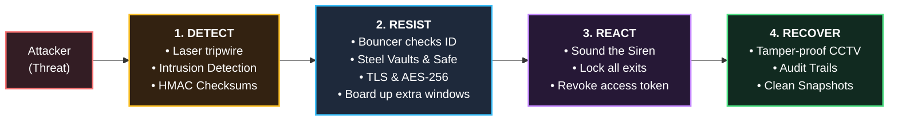
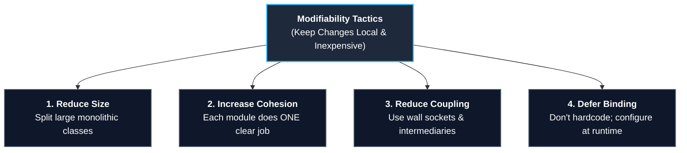
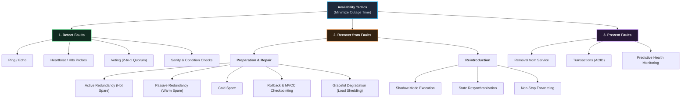
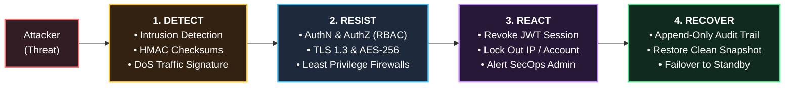
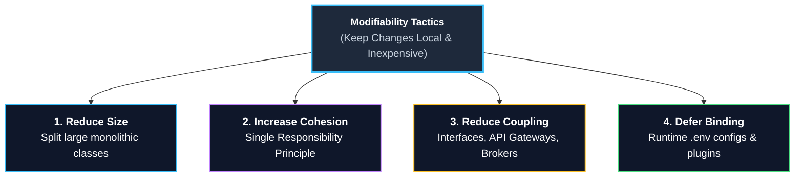

# Lecture 2: Quality Attributes & Architectural Tactics
**Course:** SEZG651 / SSZG653: Software Architectures (BITS Pilani WILP)  
**Instructor:** Prof. Harvinder S. Jabbal  
**Core Theme:** Requirements Classification, the 6-Part Quality Attribute Scenario Framework, the 7 Categories of Architectural Design Decisions, Tactics vs. Patterns, and Deep-Dive Tactics Catalogs for Availability, Performance, Usability, Security, and Modifiability.

---

## 1. Executive Overview & Problem Context

### What is this Lecture About? (The 2-Minute Story)
Any junior programmer can write code to calculate an invoice discount, book a train ticket, or move money between accounts. That is basic **Functionality**—the "what it does." 

However, in the software industry, systems are almost **never scrapped or rewritten because basic functionality was missing**. They collapse, lose millions of dollars, and get rewritten because:
* They crash when 500,000 users log in at once (**Performance failure**).
* A server room power outage takes the business offline for 12 hours (**Availability failure**).
* Hackers intercept user session tokens and steal credit card data (**Security failure**).
* The marketing team asks for a small pricing change, and developers say it will take 4 months and break half the codebase (**Modifiability failure**).

Lecture 2 focuses on what actually **drives the architecture of software systems**: **Quality Attributes** (traditionally known as Non-Functional Requirements or NFRs) and the atomic, battle-tested engineering techniques used to satisfy them: **Architectural Tactics**.

```
┌──────────────────────────────────────────────────────────────────────────────────┐
│                               The Central Reality                                │
│                                                                                  │
│   Functionality = "What the system does" (Business Logic)                        │
│   Quality Attributes = "How well, how fast, how reliably, and how securely it    │
│                         does it" (The ONLY reason architecture exists!)          │
└──────────────────────────────────────────────────────────────────────────────────┘
```

---

### Why Does Architecture Matter Here?

#### 1. The Bicycle vs. Formula 1 Racecar (Orthogonality of Functionality)
* A **Bicycle** and a **Formula 1 Racecar** perform the exact same core function: *"Transport one human from Point A to Point B."*
* Functionality is identical. Why then is an F1 car engineered with a carbon-fiber monocoque chassis, hybrid turbocharged V6, aerodynamic wings, and telemetry sensors?
* Purely to satisfy extreme **Quality Attributes**: top speed of 350 km/h (*Performance*), survivability during a 200 km/h wall impact (*Safety/Availability*), and pit-stop wheel replacement in 2.2 seconds (*Modifiability*).
* In software, you can write an e-commerce checkout as a single 300-line Python script or as a distributed cluster of microservices. Both do the exact same functional math (`Total = Price + Tax`). We choose complex architectures **only** to satisfy speed, uptime, scale, and security.

#### 2. "If You Cannot Measure It, You Cannot Collect Your Final Cheque!"
* As Prof. Jabbal emphasized, vague statements like *"the system shall be fast"* or *"the portal must be user-friendly"* are commercially dangerous.
* In commercial enterprise contracts, clients will withhold final payment if a requirement is untestable. You cannot take a client to court over "it doesn't feel fast." 
* A quality attribute is only legitimate when framed as an objective, mathematically verifiable **Quality Attribute Scenario** with a measurable number.

#### 3. Retrofitting is Impossible
* You cannot build an entire house out of dry mud and then decide to add a 10-story concrete foundation later. 
* Similarly, you cannot build a monolithic, insecure, single-threaded system and "sprinkle" high availability or rock-solid security on top right before launch. It must be baked into the foundational structural decisions from Day 1.

---

### Where Does this Fit in the Course?
* **Lecture 1:** The big picture—Definitions, Structures (Module, Component-and-Connector, Allocation), Views, and the Architecture Influence Cycle.
* **Lecture 2 (This Lecture):** What drives those structures—Requirements Classification, the 6-Part Scenario Framework, the 7 Categories of Design Decisions, and primitive Tactics for the Big 5 Quality Attributes.
* **Lectures 3–8:** Deep-dive trade-off analysis and operationalizing these tactics.
* **Lectures 9–14 (Post-Midterm):** Architectural Patterns (Microservices, Layered, Broker, Event-Driven, Cloud)—which are pre-packaged strategic bundles built out of these primitive tactics.

---

## 2. Core Concepts Explained Simply

---

### Concept 1: Requirements Classification & The "Orthogonality" of Functionality

#### What is it?
All software requirements fall into exactly three distinct buckets:

```
                               ┌───────────────────────────────┐
                               │      System Requirements      │
                               └──────────────┬────────────────┘
                                              │
          ┌───────────────────────────────────┼───────────────────────────────────┐
          ▼                                   ▼                                   ▼
┌───────────────────┐               ┌───────────────────┐               ┌───────────────────┐
│ 1. Functional     │               │ 2. Quality        │               │ 3. Constraints    │
│    Requirements   │               │    Attributes     │               │                   │
│ (What it does)    │               │ (How well it does)│               │ (Zero freedom)    │
│ E.g., Process payment│             │ E.g., Under 200ms │               │ E.g., Host in India│
└───────────────────┘               └───────────────────┘               └───────────────────┘
```

1. **Functional Requirements:** The business tasks the software must perform (e.g., "Transfer ₹5,000 from Account A to Account B"). Satisfied by writing business logic inside modules.
2. **Quality Attribute Requirements (NFRs):** Annotations that qualify *how well* the function must be executed (e.g., "Complete the transfer in $< 500\text{ ms}$, with 99.999% availability, encrypted end-to-end"). Satisfied by the structures, patterns, and tactics of the architecture.
3. **Constraints:** Non-negotiable decisions with **zero degrees of freedom** already decided for you by corporate policy, laws, or existing infrastructure (e.g., "Must run on existing RHEL Linux servers", "Citizen health data must physically stay within India").

#### Why is Functionality "Orthogonal" ($90^\circ$)?
* "Orthogonal" is the mathematician's way of saying **independent**.
* Functionality tells you *what* logic to write, but it gives you **zero guidance** on how to structure the architecture.
* Given the functional requirement *"Calculate taxes on an invoice,"* you could implement it as:
  * A single C script running on a Raspberry Pi.
  * A serverless AWS Lambda function.
  * A distributed Hadoop batch job across 50 nodes.
* Which one do you pick? **Only the Quality Attributes (speed, cost, volume of data, availability) tell you which architecture to choose.**

---

### Concept 2: Why Traditional "NFR" Discussions Fail in Industry

Prof. Jabbal highlighted three fatal flaws in how traditional engineering teams talk about Quality Attributes:

1. **Untestable, Vague Buzzwords:** Saying *"The system shall be robust"* or *"The app shall be modifiable"* is meaningless. How do you write a test for "robust"?
2. **Overlapping Concerns & Pointless Debates:** When a Denial of Service (DoS) attack knocks a banking website offline:
   * The security team screams: *"It's a Security issue! We're under attack!"*
   * The infrastructure team yells: *"It's an Availability issue! The server crashed!"*
   * The frontend team complains: *"It's a Usability issue! Users can't check out!"*
   * The performance team argues: *"It's a Performance issue! Latency spiked to infinity!"*
   * **The Architect's stance:** Stop wasting hours arguing over the label. Write down the concrete event and the concrete expected response.
3. **Incompatible Community Jargons:** The security community speaks of *ciphers, nonces, and attack surfaces*; the performance community talks about *jitter, percentiles, and queues*; the availability community talks about *MTBF, heartbeats, and failover*. They live in isolated silos.

---

### Concept 3: Quality Attribute Scenarios (The 6-Part SEI Framework)

#### What is it?
To kill ambiguity, the Software Engineering Institute (SEI) created a standardized 6-part specification. Think of it as a **rigorous bug ticket or user story for system stress**.

```mermaid
flowchart LR
    subgraph EXT ["1. Stimulus Source & Event"]
        SRC["<b>Source of Stimulus</b><br/>(Who did it?)"]
        STIM["<b>Stimulus</b><br/>(What happened?)"]
        SRC --> STIM
    end

    subgraph SYS ["2. System Under Stress"]
        ENV["<b>Environment</b><br/>(What mode was system in?)"]
        ART["<b>Artifact</b><br/>(What part took the hit?)"]
        RESP["<b>Architectural Response</b><br/>(What engineered action ran?)"]
        
        STIM --> ART
        ENV -.-> ART
        ART --> RESP
    end

    subgraph VER ["3. Proof"]
        RM["<b>Response Measure</b><br/>(The exact testable number!)"]
        RESP --> RM
    end

    style EXT fill:#0f172a,stroke:#38bdf8,stroke-width:1.5px
    style SYS fill:#0f172a,stroke:#c084fc,stroke-width:1.5px
    style VER fill:#0f172a,stroke:#4ade80,stroke-width:1.5px
```



#### The 6 Elements Explained with Real-World Examples:

| Scenario Element | Plain English Question | Real Example: **Swiggy / Zomato Crash** | Real Example: **UPI Payment Spike** |
| :--- | :--- | :--- | :--- |
| **1. Source of Stimulus** | *Who or what caused this?* | 500,000 active mobile users during an e-commerce flash sale. | Millions of banking apps triggering UPI transfers during Diwali evening. |
| **2. Stimulus** | *What event arrived?* | 30,000 checkout requests per second. | A sudden 10x surge in fund transfers. |
| **3. Artifact** | *Which specific component was hit?* | The Core Checkout & Payment Service. | The Bank Account Reconciliation Engine. |
| **4. Environment** | *What operational state was it in?* | Peak Friday night operational load. | Normal operating hours under heavy traffic. |
| **5. Response** | *What deliberate action did the system take?* | Queued checkout requests, shed non-essential features (recommendations), processed payments sequentially. | Throttled third-party bank APIs, logged transactions to durable queue. |
| **6. Response Measure** | *How do we mathematically prove success?* | 99% of checkouts complete in $< 3\text{ seconds}$; zero lost transactions. | Latency $\le 1.5\text{ s}$ for 95% of users; 0 duplicate debits. |

#### Crucial Distinction: Reaction vs. Response
* A **Reaction** is passive and chaotic (e.g., dropping a glass when someone startles you, or an unhandled crash returning `HTTP 500`).
* An **Architectural Response** is **deliberately engineered and measured** (e.g., a pre-planned fire drill where sprinklers activate, fire doors seal, and emergency services are notified automatically).

---

### Concept 4: Architectural Tactics vs. Patterns (Atoms vs. Molecules)

#### What is it?
* **Architectural Tactic:** A **primitive, atomic design decision** that targets a **single** quality attribute response. (The "Atoms").
* **Architectural Pattern:** A **strategic, composite package** that organizes components, connectors, and relations, balancing **multiple** quality attributes simultaneously. (The "Molecules").

```
┌────────────────────────────────────────────────────────┐
│             Architectural Pattern (Strategy)           │
│   e.g., Microservices, Layered, Broker, Event-Driven   │
│   - High-level package of structural choices           │
│   - Balances multiple quality attributes at once       │
└───────────────────────────┬────────────────────────────┘
                            │ Built from / Tuned by
                            ▼
┌────────────────────────────────────────────────────────┐
│              Architectural Tactics (Atoms)             │
│   e.g., Heartbeat, Caching, Hot Spare, Rate Limiting   │
│   - Primitive design decisions                         │
│   - Targets ONE specific Quality Attribute response    │
└────────────────────────────────────────────────────────┘
```

#### Everyday Analogies:
* ⚽ **The Professor's FIFA World Cup Analogy:**
  * **Pattern (Match Strategy):** The overall game-plan decided by the coach before kick-off (e.g., Spain’s tiki-taka possession vs. Argentina’s defensive counter-attack).
  * **Tactic (In-Game Move):** Specific maneuvers executed on the pitch to handle immediate situations (e.g., setting an offside trap, pressing a tired defender, tactical time-wasting passing).
  * **Operations (Code):** The players physically running and kicking the ball.
* 🍳 **The Master Chef Analogy:**
  * A **Pattern** is an entire 3-course Italian dinner recipe.
  * A **Tactic** is adding salt, lowering the flame, or marinating the chicken.
  * *Why does this matter?* If you adopt a pattern (like Microservices) to improve scalability, you might find your system becomes horribly slow due to network hops. To fix it, you don't throw away the whole pattern; you apply specific **performance tactics** (like caching or connection pooling) to tune it.

---

### Concept 5: The 7 Categories of Architectural Design Decisions

Architecture design is not artistic guesswork. Every architecture is shaped by decisions across seven universal buckets:

1. **Allocation of Responsibilities:**
   * Who does what? 
   * Dividing system duties into modules, microservices, and databases (e.g., "Service A handles auth; Service B handles billing; Service C handles search").
2. **Coordination Model:**
   * How do pieces talk? 
   * Synchronous REST HTTP calls vs. Asynchronous Kafka message streams; stateful WebSocket sessions vs. stateless JSON APIs; guaranteed at-least-once delivery vs. fire-and-forget.
3. **Data Model:**
   * Where and how is information structured?
   * Relational SQL (PostgreSQL) for transactional money vs. NoSQL Document (MongoDB) for flexible product catalogs vs. In-Memory Key-Value (Redis) for sessions. 
   * Designing metadata (schemas, data dictionaries) so distributed services agree on data formats.
4. **Management of Resources:**
   * How do we prevent greed and starvation?
   * Managing CPU cores, RAM limits, thread pools, and network sockets. Setting hard queue bounds so a sudden surge doesn't run the server out of memory.
5. **Mapping Among Architectural Elements:**
   * Where does compile-time code run at runtime?
   * Which Java classes get bundled into which Docker container; which containers run on which AWS EC2 virtual machines; which database shards live in which availability zone.
6. **Binding Time Decisions:**
   * When do we lock decisions in?
   * *Compile/Build Time:* Hardcoding a tax rate or API key into source code. Simple and fast, but if it changes, you must recompile and redeploy.
   * *Runtime (Late Binding):* Reading configurations from environment variables (`.env`) or loading dynamic plugins at runtime. Highly flexible, but adds complexity.
7. **Choice of Technology:**
   * Which specific vendor tools and frameworks do we pick?
   * Java Spring Boot vs. Node.js; AWS DynamoDB vs. self-hosted Cassandra. Balancing licensing costs, community maturity, and hiring availability.

---

--- 

### The 5 Core Quality Attributes & Tactics Deep-Dives

---

### Pillar 1: Availability ("Don't Die; If You Die, Wake Up Fast")

#### What is Availability?
Availability is the percentage of time a system is up, operational, and delivering correct results when users need it:
$$\text{Availability} = \frac{\text{MTBF}}{\text{MTBF} + \text{MTTR}} = \frac{\text{Uptime}}{\text{Uptime} + \text{Downtime}}$$
* **Reliability (MTBF - Mean Time Between Failures):** How long the system runs before breaking.
* **Maintainability (MTTR - Mean Time To Repair):** How fast you recover after it breaks.
* 👉 You can achieve 99.999% ("five nines") availability either by having hardware that never fails, OR by having automated recovery that fixes failures in under 2 seconds!

#### The Domino Effect: Fault $\rightarrow$ Error $\rightarrow$ Failure
* **Fault (The Latent Bug / Spark):** A hidden defect in hardware or code (e.g., a memory leak or a loose network cable).
* **Error (The Invisible Bad State / Smoke):** The internal invalid state produced by the fault (e.g., available server RAM drops to 0 MB, or an internal pointer is `null`). The system is sick, but external users haven't noticed yet.
* **Failure (The Observable Outage / Fire):** The system fails to deliver service (e.g., customer clicks "Buy" and gets `HTTP 500 Server Error`).
* 👉 **The Goal of Availability Tactics:** Intervene early so that a *Fault* never evolves into an observable *Failure*.

```
┌──────────────┐         Produces          ┌──────────────┐         Manifests as        ┌──────────────┐
│    FAULT     │ ────────────────────────> │    ERROR     │ ──────────────────────────> │   FAILURE    │
│ (Memory leak,│                           │ (Free RAM    │                             │ (Website     │
│  loose wire) │                           │  hits 0 MB)  │                             │  crashes)    │
└──────────────┘                           └──────────────┘                             └──────────────┘
       ▲                                          │                                            │
       └──────────────────────────────────────────┴────────────────────────────────────────────┘
                    Availability Tactics intervene here to prevent, detect, or mask!
```

---

#### The Availability Tactics Catalog Explained Intuitively

```
                                  ┌─────────────────────────────────┐
                                  │      Availability Tactics       │
                                  └────────────────┬────────────────┘
                                                   │
          ┌────────────────────────────────────────┼────────────────────────────────────────┐
          ▼                                        ▼                                        ▼
┌───────────────────┐                    ┌───────────────────┐                    ┌───────────────────┐
│ 1. Detect Faults  │                    │ 2. Recover Faults │                    │ 3. Prevent Faults │
└─────────┬─────────┘                    └─────────┬─────────┘                    └─────────┬─────────┘
          ├─ Ping / Echo                           ├─ Active Redundancy (Hot Spare)         ├─ Removal From Service
          ├─ Heartbeat                             ├─ Passive Redundancy (Warm Spare)       ├─ Transactions (ACID)
          ├─ System Monitor                        ├─ Cold Spare                            ├─ Predictive Model
          ├─ Voting                                ├─ Rollback & Checkpoint                 ├─ Exception Prevention
          ├─ Sanity Checking                       ├─ Graceful Degradation                  └─ Increase Competence Set
          └─ Self-Test (BITE)                      ├─ Shadow Mode
                                                   └─ Non-stop Forwarding
```

##### 1. Fault Detection Tactics (How do you know something is wrong?)
* 🔊 **Ping / Echo:** Two-way handshake. Node A shouts: *"Are you alive?"* and waits for Node B to answer: *"Yes, I am alive."* If no reply arrives within 2 seconds, assume Node B is dead.
* 💓 **Heartbeat:** One-way automated health pulse. Node B emits an automated signal periodically (e.g., *"Alive... Alive..."*). In modern cloud architecture, this is implemented as a **Kubernetes `livenessProbe` / `readinessProbe`** or consul agent health check. If the cluster orchestrator receives 3 consecutive probe timeouts, it immediately declares the Pod unhealthy, pulls it from load-balancer routing, and spins up a replacement.

> 💡 **Tech Quick-Primer (`Kubernetes Liveness vs. Readiness Probes`):** *Automated health checks executed by the K8s node agent (`kubelet`). A **Liveness Probe** tests if the container is deadlocked or frozen (restarts the Pod if it fails); a **Readiness Probe** tests if the container is fully warmed up and ready to serve requests (stops routing network traffic to it if it fails).*
* 🗳️ **Voting (Airplanes & Space Missions):**
  * When a commercial jet calculates its altitude or landing flaps, a single hardware glitch could be fatal.
  * Three independent computers calculate the flaps angle. If Computer 1 says 15°, Computer 2 says 15°, and Computer 3 says 78° (due to cosmic ray bit flip), the system **votes 2-to-1**, ignores Computer 3, and uses 15°.
* 🩺 **Sanity Checking:** Validating that internal calculations make common sense before acting on them (e.g., checking if a car's calculated speed suddenly jumped from 60 km/h to 900 km/h in 1 millisecond).
* 🔬 **Self-Test (BITE - Built-In Test Equipment):** The unit tests itself periodically (e.g., military radar systems that run internal diagnostic loops every 50ms while scanning the sky).

##### 2. Fault Recovery Tactics (How do you bounce back?)
* 👥 **Redundancy Protection Groups (The Backup Crew Analogy):**
  * **Active Redundancy (Hot Spare):** *The Co-Pilot.* Sits in the cockpit right next to the captain, holding duplicate controls, reading the same dials in real time. If the captain faints, the co-pilot takes control in **0 milliseconds**. *(Zero downtime, but costs 2x hardware and electricity).*
  * **Passive Redundancy (Warm Spare):** *The resting crew member.* Alive and resting in the airplane bunk, receiving periodic updates over the intercom. If called, needs **2 minutes** to put on shoes, run into the cockpit, and sit down. *(Failover takes seconds).*
  * **Cold Spare:** *The off-duty pilot at home.* Asleep in bed. If the captain faints, someone must call them, wait for them to drive to the airport, and board the plane. *(Takes hours to boot up; cheap, but huge downtime).*
* ⏪ **Rollback & Checkpoint:** Like saving your progress in a video game before a boss fight. If your payment transaction crashes halfway through, rollback the database to the last clean checkpoint so money isn't lost.
* 📉 **Graceful Degradation (The Netflix / World Cup Tactic):**
  * If 50 million concurrent video streams hit a live-streaming platform (such as Hotstar, JioCinema, or Netflix) and backend infrastructure begins saturating CPU and network limits:
  * **Shed non-critical microservices (Load Shedding):** Disable real-time recommendation engines, disable live interactive chat/emojis, and adaptively drop video encoding profiles from 4K to 1080p/720p.
  * The primary revenue and SLA service (delivering the uninterrupted live video feed) survives, preventing an application-wide outage!
* 👥 **Shadow Mode:** A newly repaired or updated server runs in parallel with active servers. It processes real live user requests, but its answers are thrown away—used only to compare against the live server to prove it's fully healed before promoting it.
* 🚦 **Non-Stop Forwarding:** Separating the brain (Control Plane) from the muscle (Data Plane). In a high-end network router, if the routing protocol daemon crashes and reboots, the hardware packet-forwarding chip continues routing network traffic based on the last known table without dropping a single packet.

##### 3. Fault Prevention Tactics (Stopping bugs before they happen)
* 🛑 **Removal From Service:** Proactively taking a server offline for maintenance during off-peak hours before its memory leak causes an unexpected mid-day crash.
* 💳 **Transactions (ACID):** Wrapping operations in atomic boundaries: either the money leaves Account A AND arrives in Account B, or nothing happens at all.

---

### Pillar 2: Performance ("Be Fast, and Don't Choke")

#### What is Performance?
Performance is about **timing**. When an event arrives (a user clicking "Buy", a sensor emitting temperature), can the software respond before its deadline?

* **Latency:** How long it takes to process a single request (e.g., 150 milliseconds).
* **Throughput:** How many total requests the system handles per second (e.g., 20,000 TPS).
* **Jitter:** Variation in response time (e.g., request 1 takes 10ms, request 2 takes 3000ms $\rightarrow$ high jitter = terrible user experience).

#### The Performance Tactics Catalog Explained for Software Engineers
Performance engineering in distributed systems boils down to two strategic levers: **Controlling Resource Demand** (managing the ingress load) and **Managing System Resources** (optimizing the execution pipeline).

```mermaid
flowchart TD
    subgraph INFLUX ["Ingress Traffic Spike"]
        EV["Incoming Requests / Event Stream<br/>(100,000 RPS)"]
    end

    subgraph DEMAND ["1. Control Demand (Ingress Shaping)"]
        D1["<b>Rate Limiting:</b> Envoy / Kong Token Bucket"]
        D2["<b>Prioritize:</b> High-priority vs. Batch Queues"]
        D3["<b>Sampling Rate:</b> 1% APM Tracing in OpenTelemetry"]
        D4["<b>Reduce Overhead:</b> Binary gRPC over HTTP/2"]
    end

    subgraph RESOURCE ["2. Manage Resources (Compute & Data Pipeline)"]
        R1["<b>Scale Out:</b> Kubernetes HPA Pod Replicas"]
        R2["<b>Caching:</b> Redis Cluster / Cache-Aside TTL"]
        R3["<b>Bound Queues:</b> Bounded Ring Buffer (No OOM Killer)"]
        R4["<b>Concurrency:</b> Netty Epoll / Go Goroutine Pools"]
    end

    subgraph RESULT ["Architectural Outcome"]
        OUT["Sub-50ms Latency & High Throughput SLA"]
    end

    EV --> DEMAND --> RESOURCE --> RESULT

    style DEMAND fill:#0f172a,stroke:#38bdf8,stroke-width:1.5px
    style RESOURCE fill:#0f172a,stroke:#c084fc,stroke-width:1.5px
    style RESULT fill:#0f172a,stroke:#4ade80,stroke-width:1.5px
```



##### 1. Control Resource Demand (Ingress Traffic Shaping)
* 🚪 **Limit Event Response (Rate Limiting / Throttling):** Deploy token bucket or leaky bucket algorithms at the API Gateway (e.g., Envoy, Kong, AWS API Gateway). Allow a maximum rate (e.g., 500 req/min per API client token); any surplus is immediately rejected with `HTTP 429 Too Many Requests` before touching internal databases.

> 💡 **Tech Quick-Primer (`Envoy & Token Bucket Rate Limiting`):** *Envoy is a high-performance open-source reverse-proxy designed for cloud-native microservices. The **Token Bucket algorithm** gives each client IP/API token a virtual bucket refilled at a set rate. Each request costs 1 token. When the bucket empties, Envoy rejects requests at the edge with `HTTP 429` before internal microservices are burdened.*
* ⏱️ **Manage Sampling Rate:** In high-throughput distributed systems, capturing 100% of telemetry traces consumes massive network bandwidth and storage. OpenTelemetry architectures use *head-based or tail-based sampling* (e.g., recording 1% of successful traces, but 100% of error traces).

> 💡 **Tech Quick-Primer (`OpenTelemetry & Trace Sampling`):** *OpenTelemetry (OTel) is the vendor-neutral industry standard for capturing distributed traces across microservices. At 100,000 RPS, recording every single trace would saturate disks and networks. **Sampling** records a representative fraction (e.g., 1% of healthy `200 OK` traces, but 100% of `500 Server Error` traces) to preserve full visibility with minimal overhead.*
* 🌟 **Prioritize Events:** Segregate incoming traffic into prioritized queues. Mission-critical database writes (e.g., user debit transactions) enter a high-priority worker pool, while non-critical async background tasks (e.g., marketing email notifications) are queued in lower-priority Kafka partitions.
* ✂️ **Reduce Overhead:** Remove extraneous serialization and network hops along the critical hot path. Replace verbose JSON-over-HTTP/1.1 REST calls with compact, binary Protobuf over gRPC (HTTP/2 multiplexing), or use shared-memory IPC for co-located processes.

##### 2. Manage System Resources (Compute & Data Pipeline)
* ⚡ **Maintain Multiple Copies of Data (Caching):**
  * Eliminate disk I/O bottlenecks by deploying distributed in-memory caches (**Redis Cluster / Memcached**) using the **Cache-Aside** or **Write-Through** pattern.
  * Serving 95% of reads directly from RAM reduces PostgreSQL database load by an order of magnitude and drops p99 latency from 45ms to 1.5ms.

> 💡 **Tech Quick-Primer (`Redis & Cache-Aside Pattern`):** *Redis is an ultra-fast in-memory key-value data store that keeps hot data in RAM. In the **Cache-Aside pattern**, your backend service queries Redis first (~1ms); on a cache miss, it reads from PostgreSQL (~45ms), populates Redis with an expiration Time-To-Live (TTL), and returns the payload.*
* 🔄 **Increase Concurrency:** Leverage non-blocking event loops (Netty, Node.js epoll) or lightweight green threads (Go goroutines, Java virtual threads) to serve tens of thousands of concurrent client connections without exhausting OS kernel thread stacks.
* 🚧 **Bound Queue Sizes (Preventing the Linux OOM Killer):** 
  * Never use unbounded in-memory queues (such as an unchecked `LinkedBlockingQueue` in Java). Under a sudden network partition or traffic spike, an unbounded queue grows until the JVM heap exhausts system RAM.
  * The Linux kernel's Out-Of-Memory (OOM) Killer will immediately invoke `SIGKILL` on the application process. Bounding queue sizes forces backpressure (`HTTP 503` or drop-tail) before memory is exhausted.

> 💡 **Tech Quick-Primer (`Linux OOM Killer & SIGKILL`):** *The Linux Out-Of-Memory (OOM) Killer is a protective kernel subroutine. When physical RAM is completely exhausted, the OS cannot allocate memory for new heap objects. To prevent the entire physical machine from freezing, the Linux kernel selects the process using the highest memory and forcibly terminates it with `kill -9` (`SIGKILL`).*
* 📈 **Scale Up vs. Scale Out:**
  * *Scale Up (Vertical):* Upgrading an AWS EC2 instance from `m5.large` (2 vCPU, 8GB RAM) to `m5.24xlarge` (96 vCPU, 384GB RAM). Simple with zero code changes, but hits hard physical hardware limits and exponential pricing curves.
  * *Scale Out (Horizontal):* Running 30 stateless container replicas across a Kubernetes cluster behind an Application Load Balancer. Provides near-infinite scalability and fault tolerance.

---

### Pillar 3: Usability ("Respect the Human Behind the Screen")

#### What is Usability?
In software architecture, usability is **NOT about CSS button colors or typography**. It is about **architecting the underlying system so users can accomplish goals efficiently and recover gracefully from mistakes**.

```
┌────────────────────────────────────────────────────────┐
│                   Usability Tactics                    │
└───────────────────────────┬────────────────────────────┘
                            │
         ┌──────────────────┴──────────────────┐
         ▼                                     ▼
┌──────────────────────────────┐      ┌──────────────────────────────┐
│  1. Support User Initiative  │      │ 2. Support System Initiative │
│ (When the user wants action) │      │ (When the system assists)    │
├──────────────────────────────┤      ├──────────────────────────────┤
│ • Cancel                     │      │ • Maintain Task Model        │
│ • Undo                       │      │ • Maintain User Model        │
│ • Pause / Resume             │      │ • Maintain System Model      │
│ • Aggregate                  │      │   (Accurate Progress Bars)   │
└──────────────────────────────┘      └──────────────────────────────┘
```

#### 1. Support User Initiative (The User Takes Action)
* 🛑 **The "Cancel" Tactic:**
  * *Bad Architecture:* You accidentally tap "Download 10GB Video" on mobile data. You tap "Cancel". The UI box closes, but in the background, the network thread keeps silently downloading the file, draining your battery and data!
  * *Good Usability Architecture:* The system is built with cancellation tokens. When the user hits Cancel, the running thread is aborted, open network sockets close immediately, and allocated temporary memory is reclaimed.
* ↩️ **The "Undo" Tactic:**
  * Gmail’s famous "Undo Send" button.
  * Google doesn't magically reach into the recipient's inbox to pull back the email. The architecture **deliberately buffers the email in an outbound queue for 10 seconds** before actually dispatching it over SMTP, giving you a safe window to click Undo.
* 📦 **The "Aggregate" Tactic:**
  * Giving users the power to "Select All" and "Bulk Delete" or "Bulk Download" rather than forcing them to click 500 individual checkboxes one by one.

#### 2. Support System Initiative (The System Takes Action)
* ⏳ **Maintain System Model (The Honest Progress Bar):**
  * Have you ever seen a progress bar jump from 1% to 99% in two seconds, and then freeze at 99% for four minutes? That happens because the software has no architectural model of its own progress.
  * A usable architecture calculates real progress metrics (bytes processed, tasks completed) to give humans trustworthy feedback.
* 🧠 **Maintain Task & User Model:** Google Docs automatically autosaving every keystroke and warning you when your network goes offline; Spotify remembering your volume and playback state across devices.

---

### Pillar 4: Security ("Defend the Fortress")

#### What is Security?
Security is the measure of a system’s ability to **protect data from unauthorized actors while still providing seamless access to legitimate users**.

#### The Core Security Triad (CIA) & Key Principles
* **Confidentiality:** Secrets stay secret (unauthorized eyes cannot read sensitive data).
* **Integrity:** Data cannot be tampered with in transit or at rest.
* **Availability:** Legitimate users are not locked out by attacks.
* **Authentication (AuthN):** Proving *who you are* (e.g., username + password + SMS OTP).
* **Authorization (AuthZ):** Proving *what you are allowed to do* (e.g., an intern cannot approve payroll).
* **Non-repudiation:** Proving that an action occurred so neither party can deny it later (e.g., digitally signed banking audit logs).

---

#### The Security Tactics Catalog (The Bank Vault Analogy)



##### 1. Detect Attacks (Tripwires & Sensors)
* 🚨 **Detect Intrusion:** Pattern-matching network traffic against databases of known attack signatures (like an airport luggage scanner).
* 🔏 **Verify Message Integrity:** Using cryptographic hashes (SHA-256, HMAC). If a hacker intercepts a payment message and changes the amount from ₹100 to ₹100,000, the hash mismatches and the system immediately rejects it.

##### 2. Resist Attacks (Fortress Walls & Locks)
* 🛡️ **Identify, Authenticate, and Authorize Actors:** Enforcing multi-factor authentication (MFA) and Role-Based Access Control (RBAC).
* 🏰 **Limit Exposure (Reduce Attack Surface):** If your house has 20 windows and 5 doors, it is easy to burgle. Board up and lock all unused windows! In software: close all unused network ports, disable unnecessary background daemons, and remove unused API endpoints.
* 🔐 **Encrypt Data:** 
  * *Data in Transit (TLS 1.3):* Cash transported in an armored van.
  * *Data at Rest (AES-256):* Cash stored in an underground titanium safe.
* 🧱 **Separate Entities:** Isolating production databases from public web servers using Virtual Private Clouds (VPCs), firewalls, and air gaps.

##### 3. React to Attacks (Sounding the Alarm)
* 🚫 **Revoke Access & Lock Computer:** If an account fails a password attempt 5 consecutive times, freeze the account immediately and invalidate all active session tokens.

##### 4. Recover from Attacks (Cleaning Up the Crime Scene)
* 📼 **Audit Trail:** Append-only, write-once, tamper-proof logs that record every single database query, user login, and file modification. If an attacker breaches the system, the audit trail reveals exactly who, what, when, and how.

---

### Pillar 5: Modifiability ("Build with Legos, Not Superglue")

#### What is Modifiability?
Modifiability is about **change: how easy, cheap, and safe it is to make changes to the system over time**.
* If a system has poor modifiability, changing the sales tax calculation on invoices breaks the login screen!
* **Goal of Modifiability Tactics:** Keep changes local. A change to Component A should have **zero ripple effects** on Components B, C, and D.



#### The Modifiability Tactics Catalog Explained Intuitively
* ✂️ **Split Module & Increase Cohesion (Single Responsibility):**
  * A knife cuts; a fork pokes.
  * If you invent a crazy Frankenstein tool that is a knife, fork, hair dryer, and FM radio all welded together, repairing the radio antenna might break the knife blade.
  * Keep modules focused on one single semantic responsibility.
* 🔌 **Use an Intermediary / Encapsulation (The Wall Socket Analogy):**
  * Imagine if your laptop charger had to be hard-soldered directly into the copper electrical wires inside your wall. Every time you moved rooms or bought a new laptop, you would have to break the drywall and hire an electrician!
  * Instead, the building provides a **standardized wall socket (an Intermediary / Interface)**.
  * The house doesn't know what device is plugged in; the device doesn't care who generates the electricity. In software, using an API Gateway, Message Broker, or abstract Interface decouples services completely.
* ⏳ **Defer Binding Time (Don't Hardcode!):**
  * *Compile-Time Binding:* Writing `String dbPassword = "password123";` directly into your Java source code. To change the password, you must edit code, recompile, run tests, and redeploy.
  * *Runtime Binding (Late Binding):* Reading the password from an environment variable or AWS Secrets Manager when the container starts. You can change it anytime without touching a single line of code!

---

---

## 3. Visual Architectural Models

### Diagram 1: The 6-Part Quality Attribute Scenario Framework

```mermaid
flowchart LR
    subgraph EXT ["1. Stimulus Source & Event"]
        SRC["<b>Source of Stimulus</b><br/>(User, Hacker, Sensor)"]
        STIM["<b>Stimulus</b><br/>(Traffic Surge, Hardware Fault)"]
        SRC --> STIM
    end

    subgraph SYS ["2. System Under Stress"]
        ENV["<b>Environment</b><br/>(Normal, Peak Load, Degraded)"]
        ART["<b>Artifact Under Stress</b><br/>(API Gateway, DB Primary)"]
        RESP["<b>Architectural Response</b><br/>(Throttle, Failover, Mask)"]
        
        STIM --> ART
        ENV -.-> ART
        ART --> RESP
    end

    subgraph VER ["3. Verification"]
        RM["<b>Response Measure</b><br/>(Latency < 50ms, 99.999% Uptime)"]
        RESP --> RM
    end

    style EXT fill:#0f172a,stroke:#38bdf8,stroke-width:1.5px
    style SYS fill:#0f172a,stroke:#c084fc,stroke-width:1.5px
    style VER fill:#0f172a,stroke:#4ade80,stroke-width:1.5px
```



*Walkthrough:* An external **Source** emits a **Stimulus** arriving at an **Artifact** operating under an **Environment**. The architecture executes an engineered **Response**, mathematically verified against a quantifiable **Response Measure**.

---

### Diagram 2: Availability Tactics Hierarchy



*Walkthrough:* Availability tactics divide into detecting anomalies before cascading failure, recovering through redundant standby groups or rollback lines, and preventing faults through proactive component retirement.

---

### Diagram 3: Performance Pipeline (Demand Control vs. Resource Management)

```mermaid
flowchart TD
    subgraph INFLUX ["Ingress Traffic Spike"]
        EV["Incoming Events / HTTP Requests<br/>(100,000 RPS)"]
    end

    subgraph DEMAND ["1. Control Demand (Ingress Shaping)"]
        D1["<b>Rate Limiting:</b> Envoy Token Bucket"]
        D2["<b>Sampling Rate:</b> 1% APM Traces in OTel"]
        D3["<b>Prioritize:</b> High vs. Low Priority Queues"]
        D4["<b>Reduce Overhead:</b> Binary gRPC over HTTP/2"]
    end

    subgraph RESOURCE ["2. Manage Resources (Compute & Pipeline)"]
        R1["<b>Scale Out:</b> Kubernetes HPA Pods"]
        R2["<b>Caching:</b> Redis Cluster Cache-Aside"]
        R3["<b>Bound Queues:</b> Bounded Ring Buffer (No OOM)"]
        R4["<b>Concurrency:</b> Netty Epoll / Goroutines"]
    end

    subgraph RESULT ["Architectural Outcome"]
        OUT["Sub-50ms p99 Latency & High Throughput SLA"]
    end

    EV --> DEMAND --> RESOURCE --> RESULT

    style DEMAND fill:#0f172a,stroke:#38bdf8,stroke-width:1.5px
    style RESOURCE fill:#0f172a,stroke:#c084fc,stroke-width:1.5px
    style RESULT fill:#0f172a,stroke:#4ade80,stroke-width:1.5px
```



---

### Diagram 4: Security Defense-in-Depth Rings



---

### Diagram 5: Modifiability Tactics Tree



---

## 4. Key Trade-Offs & Comparisons

### Table 1: System Requirements Categories
| Attribute | Functional Requirements | Quality Attribute Requirements (NFRs) | Constraints |
| :--- | :--- | :--- | :--- |
| **Core Question** | What must the system do? | How well must the system do it? | What has already been decided for us? |
| **Primary Driver** | Business domain logic & user stories. | Architectural structures & tactics. | Legal, organizational, or vendor rules. |
| **Design Freedom** | High (infinite designs can satisfy). | Negotiable through trade-off analysis. | **Zero degrees of freedom**. |
| **Real Example** | Transfer ₹5,000 between bank accounts. | Complete transfer in $< 300\text{ ms}$ with 99.999% uptime. | Must run on AWS Mumbai region servers. |

---

### Table 2: Architectural Tactics vs. Design Patterns
| Comparison Point | Architectural Tactics | Architectural Patterns |
| :--- | :--- | :--- |
| **Granularity** | **Primitive, atomic building blocks** (Atoms). | **Strategic, composite packages** (Molecules). |
| **Scope of Impact** | Focuses on a **single** quality attribute. | Balances **multiple** quality attributes simultaneously. |
| **Sports Analogy** | Tactical moves on pitch (offside trap, high press). | Overall match strategy (4-3-3 tiki-taka, counter-attack). |
| **Cooking Analogy** | Adding salt, turning down the gas flame. | A complete 3-course Italian dinner recipe. |
| **When to Use** | When tuning, adapting, or designing custom solutions. | When establishing the macro skeleton of the system. |

---

### Table 3: Fault vs. Error vs. Failure
| Entity | Nature | Visibility | Everyday Analogy | Software Example |
| :--- | :--- | :--- | :--- | :--- |
| **Fault** | Latent root cause / defect. | Hidden inside code or silicon. | A small rust spot inside a car brake line. | Unhandled null pointer bug in code. |
| **Error** | Resulting invalid internal state. | Internal to RAM / CPU. | Brake fluid pressure drops to zero. | Free memory reaches 0 MB in RAM. |
| **Failure** | Observable deviation from spec. | Visible to external world. | Car fails to stop; hits the wall. | Website crashes; user sees `HTTP 500`. |

---

### Table 4: Redundancy Tactics in Availability (Protection Groups)
| Redundancy Type | Processing Behavior | State Synchronization | Failover Time | Hardware Cost | Everyday Analogy |
| :--- | :--- | :--- | :--- | :--- | :--- |
| **Active (Hot Spare)** | All nodes process all inputs concurrently. | **Continuous lock-step synchronous**. | **Near-zero milliseconds** (instant). | Very high ($2\times$ active servers). | Co-pilot sitting in cockpit with hands on dual controls. |
| **Passive (Warm Spare)** | Primary processes; spare gets state updates. | **Periodic checkpoints / async deltas**. | **A few seconds** (load last checkpoint). | Moderate (spare runs idle). | Off-duty pilot resting in bunk; needs 2 mins to take over. |
| **Cold Spare** | Spare is powered off or uninitialized. | **None** until boot time. | **Minutes to hours** (power on & boot). | Lowest (server can sit on shelf). | Off-duty pilot asleep at home; takes 2 hours to arrive. |

---

### Table 5: Conflicting Tactics (The Architect's Dilemma)
In software architecture, **there are no free lunches**. Every tactic that helps one quality attribute usually hurts another:

| Conflict Pair | What Tactic A Does | What Tactic B Does | The Inevitable Trade-Off & How to Resolve |
| :--- | :--- | :--- | :--- |
| **Intermediary vs. Overhead** | *Use an Intermediary* (Modifiability): Decouples components using API Gateways or Message Queues. | *Reduce Overhead* (Performance): Eliminates network hops and intermediaries to run faster. | **Trade-off:** Adding an API Gateway makes code easier to change, but adds 15ms latency per hop. <br/>👉 *Resolution:* Use intermediaries for 90% of business logic; bypass for the 10% ultra-low latency paths. |
| **Redundancy vs. Cost** | *Active Redundancy* (Availability): Runs 3 identical hot servers in parallel for instant failover. | *Manage Resources* (Cost / Efficiency): Minimizes idle infrastructure to save cloud budget. | **Trade-off:** Triple the AWS monthly bill for near-zero downtime. <br/>👉 *Resolution:* Use Hot Spares only for mission-critical payment services; use Warm or Cold Spares for reporting. |
| **Late Binding vs. Performance** | *Defer Binding Time* (Modifiability): Uses dynamic reflection, plugins, and config files at runtime. | *Increase Efficiency* (Performance): Ahead-of-time (AOT) compiled native code runs directly on CPU. | **Trade-off:** Interpreted configs are flexible but slower than pre-compiled binaries. <br/>👉 *Resolution:* Load configs once during startup and cache resolved memory references. |

---

## 5. Professor's Practical Tips & Classroom Advice

*(Synthesized directly from Prof. Harvinder S. Jabbal's lecture discussions)*

### 1. The Heart Patient & Pharmacy Warning (Why Listing Tactics Gets ZERO)
* **The Exam Trap:** Prof. Jabbal issued a stern warning for scenario-based exam questions:
  > *"Every year, students memorize the slide bullets and vomit the names of all 15 availability tactics onto their answer sheet. And when they get a zero, they are shocked. Why do you get a zero? If a heart patient goes to a doctor, and the doctor goes to the pharmacy, collects every single heart medicine on the shelf, and forces the patient to swallow them all, the patient will DIE! You are being tested on whether you know which specific medicine, in what dosage, fits this specific patient."*
* **The Rule:** In exam scenario questions, the professor has **one or two specific tactics** in mind. If you list all tactics blindly without justifying why they fit the scenario, you will receive zero credit.

### 2. The Pythagoras Principle & The 5-Year Half-Life of Knowledge
* **Why Learn Technical Jargon?** 
  * When someone says *"Pythagoras"*, engineers instantly picture $a^2 + b^2 = c^2$, right-angled triangles, and 3:4:5 ratios without needing a 20-minute explanation.
  * Standard technical vocabulary (*Active Redundancy, Semantic Coherence, Intermediary*) gives senior software leaders a shared shorthand to evaluate million-dollar trade-offs in seconds.
* **The 5-Year Half-Life of Knowledge:**
  * In tech, **50% of the tools, frameworks, and syntax you learn today will be obsolete in 5 years**.
  * Specific JavaScript libraries and cloud buttons will change, but fundamental architectural tactics (caching, redundancy, rate-limiting, decoupling) have remained unchanged since the 1970s.

### 3. Real-World Case Studies Discussed in Class
* **Ankur's Military Radar System:**
  * *Scenario:* Radar tracking enemy fighter jets experiences communication glitches between the antenna and processor.
  * *Architecture:* Deploys **BITE (Built-In Test Equipment / Self-Test)** to diagnose faults autonomously within milliseconds and trigger automated failover without waiting for human reboot.
* **Bhanu's SAP vs. Fleet Management (Indian Oil on AWS):**
  * *Scenario:* Managing thousands of oil tanker trucks across India. Purchasing SAP ERP user licenses for every single truck driver and terminal clerk would cost millions of dollars.
  * *Architecture:* Built a dedicated, lightweight web application for drivers, integrated with core SAP through **REST API Intermediaries and reconciliation queues**. Kept SAP secure and saved millions in licensing.
* **Saurav's Mainframe SLAs:**
  * Support tiers (L1, L2, L3) are a direct mapping of the **Allocation of Responsibilities** decision category to human engineering teams, governed strictly by contractual MTTR response measures.

### 4. Exam Strategy & Time Traps
* **Quiz Warning:** 15 multiple-choice questions in 5 minutes!
  * That is only **20 seconds per question**. You will not have time to browse slides or Google during the quiz. You must understand the concepts beforehand.
* **Open-Book vs. Closed-Book Exams:**
  * Midterm is closed-book; Comprehensive final is open-book.
  * Open-book exam questions are **100% scenario-based**. Simply copying bullet points from slides will earn zero marks. You must apply the right tactic to the given scenario.

---

## 6. Exam-Ready Question Bank

### Part A: Short-Answer Questions (2–3 Marks Each)

#### Q1: Differentiate between a Fault, an Error, and a Failure with a clear software example.
* **Answer:**
  * **Fault:** An underlying bug or physical flaw (e.g., developer forgets to free allocated memory).
  * **Error:** The resulting invalid internal state (e.g., free system RAM drops to 0 MB).
  * **Failure:** An observable deviation from specified behavior visible to users (e.g., website crashes and returns `HTTP 500`).

#### Q2: What are the 6 parts of a Quality Attribute Scenario? List each with a 1-line definition.
* **Answer:**
  1. **Source of Stimulus:** The entity (user, hacker, sensor) generating the event.
  2. **Stimulus:** The event or condition arriving at the system.
  3. **Artifact:** The specific component or subsystem acted upon.
  4. **Environment:** The operating mode when the event arrives (normal, peak load, degraded).
  5. **Response:** The deliberate, engineered activity executed to handle the event.
  6. **Response Measure:** The measurable, testable metric determining success.

#### Q3: Why is Functionality said to be "orthogonal" to Software Architecture?
* **Answer:** Functionality states *what* the system does, while architecture determines *how well* it achieves quality attributes (speed, availability, security). Infinite different architectures can execute the exact same business logic; therefore, functional requirements do not dictate architecture—quality attributes do.

#### Q4: Compare Active Redundancy (Hot Spare) and Passive Redundancy (Warm Spare) on failover time and cost.
* **Answer:**
  * **Active Redundancy (Hot Spare):** Redundant nodes process inputs in lock-step parallel. Failover time is **near-zero milliseconds**, but hardware/operating costs are very high ($2\times$ active infrastructure).
  * **Passive Redundancy (Warm Spare):** Only primary processes live traffic; spare receives periodic state updates. Failover takes **a few seconds** (time to load state), but operating costs are significantly lower.

#### Q5: State the difference between an Architectural Tactic and an Architectural Pattern.
* **Answer:** A **Tactic** is a primitive, atomic design decision that targets a **single** quality attribute response (e.g., Heartbeat or Caching). A **Pattern** is a strategic, composite architectural package that bundles multiple design choices to balance **multiple** quality attributes simultaneously (e.g., Microservices or Layered Pattern).

#### Q6: Name the 7 universal categories of architectural design decisions.
* **Answer:** (1) Allocation of responsibilities, (2) Coordination model, (3) Data model, (4) Management of resources, (5) Mapping among architectural elements, (6) Binding time decisions, (7) Choice of technology.

---

### Part B: Analytical & Scenario Questions (5–10 Marks Each)

#### Q1 (Scenario Analysis - High Availability Architecture):
**Scenario:** A national railway ticketing portal experiences massive booking surges every morning at 10:00 AM. During this peak window, primary payment gateway nodes frequently experience process crashes. System requirements mandate zero transaction loss and total system downtime of less than 15 seconds during a crash.  
**Task:** 
1. Formulate a complete 6-part Concrete Availability Scenario for this requirement. [3 Marks]
2. Recommend and justify two specific Availability Tactics (one Detection tactic and one Recovery tactic) to meet this SLA. Explain why Cold Spares are completely unacceptable here. [4 Marks]
3. Explain which Coordination Model decision must be made to prevent lost booking payments. [3 Marks]

* **Answer Guidelines & Scoring Points:**
  1. **Concrete Availability Scenario [3 Marks]:**
     * *Source:* Payment gateway server operating system process.
     * *Stimulus:* Process crash / memory fault.
     * *Artifact:* Primary Payment Processing Subsystem.
     * *Environment:* Morning 10:00 AM peak booking surge (Overloaded operation).
     * *Response:* Detect crash, alert load balancer, switch traffic to redundant standby node, maintain transaction state.
     * *Response Measure:* Total failover completed in $\le 15$ seconds; 0 transaction records lost ($100\%$ consistency).
  2. **Tactic Recommendations & Justification [4 Marks]:**
     * *Fault Detection Tactic:* **Heartbeat Monitor** (or Ping/Echo). The cluster supervisor exchanges heartbeats every 1 second. If 3 consecutive beats are missed, crash is declared within 3 seconds.
     * *Fault Recovery Tactic:* **Passive Redundancy (Warm Spare)** or **Active Redundancy (Hot Spare)**. With a Warm Spare, state checkpoints are mirrored periodically; upon primary crash, the warm spare loads state and activates in under 10 seconds, easily satisfying the $< 15\text{ s}$ SLA.
     * *Why Cold Spare Fails:* A cold spare requires cold hardware power-on, OS boot, application initialization, and database connection pooling, which takes 3–10 minutes—violating the 15-second SLA.
  3. **Coordination Model Decision [3 Marks]:**
     * Deploy **ACID Transactions** and **Asynchronous Message Queuing with Guaranteed Delivery (At-Least-Once / Exactly-Once processing)**.
     * If a node crashes mid-flight, uncommitted transactions rollback cleanly, and in-flight payment messages remain safe in the durable message queue until the standby node assumes control.

---

#### Q2 (Trade-Off Analysis - Performance vs. Modifiability):
**"Architectural tactics to improve modifiability frequently harm performance, and vice versa."  
Critically analyze this statement. Provide two concrete pairs of conflicting tactics and explain how an architect resolves the conflict.**

* **Answer Guidelines & Scoring Points:**
  1. **Core Architectural Principle [2 Marks]:**
     * Modifiability relies on **indirection, abstraction, and decoupling** (adding intermediaries, abstract interfaces, and late binding).
     * Performance relies on **minimizing execution paths, cutting overhead, and raw direct execution**. Every layer of indirection adds CPU context-switching and latency.
  2. **Conflict Pair 1: "Use an Intermediary" (Modifiability) vs. "Reduce Overhead" (Performance) [3 Marks]:**
     * *The Conflict:* The tactic *Use an Intermediary* (e.g., API Gateway, Message Bus) decouples communicating services so they can change independently. However, every intermediary requires network serialization, socket transit, and deserialization, directly violating the performance tactic *Reduce Overhead*.
     * *Resolution:* Use the intermediary for general business workflows where latency is non-critical. For time-critical hot paths, bypass the intermediary and permit direct RPC or in-memory calls.
  3. **Conflict Pair 2: "Defer Binding Time" (Modifiability) vs. "Increase Resource Efficiency" (Performance) [3 Marks]:**
     * *The Conflict:* The tactic *Defer Binding Time* uses runtime reflection and dynamic configuration files so behavior can change without code redeployment. However, dynamic reflection and runtime symbol lookups consume significant CPU cycles compared to pre-compiled native binary code.
     * *Resolution:* Restrict dynamic late-binding to application startup, caching resolved memory pointers or lookup tables in RAM for all subsequent runtime transactions.
  4. **Conclusion [2 Marks]:**
     * Prioritize quality attributes based on business drivers. When attributes clash, design for the critical attribute on the hot path and optimize for modifiability everywhere else.

---

## 7. Quick Revision & 60-Second Exam Recap

### Key Terms Glossary
* **Quality Attribute:** A measurable system property indicating how well it satisfies stakeholder needs (NFR).
* **Quality Attribute Scenario:** A standardized 6-part specification (Source, Stimulus, Artifact, Environment, Response, Response Measure).
* **Architectural Tactic:** A primitive, atomic design technique targeting a single quality attribute response.
* **Architectural Pattern:** A strategic, composite package of design decisions balancing multiple quality attributes.
* **Availability:** The measure of readiness to deliver correct service ($\text{MTBF} / [\text{MTBF} + \text{MTTR}]$).
* **Fault:** An underlying bug or physical flaw in a component.
* **Error:** An invalid internal system state produced by a fault.
* **Failure:** An observable deviation from specified behavior visible to external users.
* **Active Redundancy (Hot Spare):** Redundant nodes running in lock-step parallel processing; near-zero failover time.
* **Passive Redundancy (Warm Spare):** Redundant node receives periodic state updates; failover takes seconds.
* **Cold Spare:** Redundant node remains unpowered until failover; failover takes minutes.
* **Graceful Degradation:** Sacrificing non-essential features (recommendations) to keep core services (payments) alive under overload.
* **Non-Stop Forwarding:** Keeping data forwarding hardware alive while control/routing plane software reboots.
* **Late Binding:** Deferring decisions to runtime (config files, reflection) to maximize modifiability.
* **CIA Triad:** Confidentiality, Integrity, and Availability.

---

### The 5 Golden Rules to Remember
1. **Functionality is Orthogonal to Architecture:** Functionality does *not* dictate architecture; quality attributes do.
2. **If You Cannot Measure It, You Cannot Collect Your Cheque:** Every quality requirement must have a quantifiable Response Measure.
3. **Never List All Tactics in an Exam:** An architect selects the *exact* 1–2 tactics tailored to the specific failure scenario.
4. **Patterns are Strategies, Tactics are Tools:** Tactics are the building blocks used to construct and fine-tune architectural patterns.
5. **Keep Changes Local:** Good architecture ensures that routine business changes touch only a single, isolated module.

---

### 60-Second Rapid Fire Q&A
* *Q: What are the 3 categories of system requirements?*  
  $\rightarrow$ Functional, Quality Attributes, and Constraints.
* *Q: What is a constraint?*  
  $\rightarrow$ A design decision with zero degrees of freedom (already decided for you).
* *Q: What are the 6 parts of a quality attribute scenario?*  
  $\rightarrow$ Source, Stimulus, Artifact, Environment, Response, Response Measure.
* *Q: What is an Architectural Tactic?*  
  $\rightarrow$ A primitive design technique that affects a single quality attribute response.
* *Q: What is the difference between a fault and a failure?*  
  $\rightarrow$ A fault is the internal bug; a failure is the observable crash or specification violation.
* *Q: Which redundancy tactic provides near-zero millisecond failover?*  
  $\rightarrow$ Active Redundancy (Hot Spare).
* *Q: What is Graceful Degradation?*  
  $\rightarrow$ Disabling non-critical features to preserve core business functionality during overload.
* *Q: What does Non-Stop Forwarding do?*  
  $\rightarrow$ Keeps the data forwarding plane running while the control/routing supervisor restarts.
* *Q: What are the two main categories of performance tactics?*  
  $\rightarrow$ Control Resource Demand and Manage System Resources.
* *Q: What does CIA stand for in security?*  
  $\rightarrow$ Confidentiality, Integrity, and Availability.
