# Lecture 3: Quality Attributes (Part 2) — Interoperability & Testability
**Course:** SEZG651 / SSZG653: Software Architectures (BITS Pilani WILP)  
**Instructor:** Prof. Harvinder S. Jabbal  
**Core Theme:** Integrating with external systems (**Interoperability**) and verifying correctness (**Testability**), plus the crucial distinctions of **Binding Time** and **Modifiability vs. Modify**.

---

## 1. The Big Picture (Why Should I Care?)

- **What is this lecture about?**  
  In modern software development, no application lives on an island. Your backend must talk to payment gateways, SMS providers, third-party databases, and internal microservices (**Interoperability**). At the same time, testing and debugging consume **over 50% of software engineering time and budget**. If your code hides its bugs or is tightly coupled to external systems, testing becomes slow, painful, and flaky (**Testability**).
- **The Real-World Problem:**  
  * *Without Interoperability:* Every time an external partner changes an API field or payload format, your app breaks and requires weeks of manual fixes.
  * *Without Testability:* Developers cannot reproduce production bugs, cannot test edge cases (like a database disconnect or full disk), and end up relying on slow, manual QA cycles.
- **Where this fits in the course:**  
  Lecture 2 covered runtime qualities (Availability, Performance, Security). Lecture 3 completes the Quality Attributes module by looking at system boundaries (talking to others) and developer verification (finding bugs early).

---

## 2. Core Concepts Explained Simply

### Concept 1: What is Interoperability?

#### Plain-English Definition
Interoperability is the degree to which two or more independent systems can **usefully exchange meaningful information** and actually understand what to do with it.

#### The Two Levels of Interoperability:
1. **Syntactic Interoperability (Format & Protocol):**  
   * Can System A and System B parse each other's data format?
   * *Example:* Both systems agree to communicate using JSON over HTTPS. The parser successfully reads the keys and values without crashing.
2. **Semantic Interoperability (Shared Meaning):**  
   * Do both systems agree on **what the data actually means**?
   * *Example:* System A sends `"expiryDate": "04/05/2026"`. System A means **May 4th** (European format `DD/MM/YYYY`), but System B interprets it as **April 5th** (US format `MM/DD/YYYY`). Syntactically it worked; semantically it caused a critical business failure!

> **Key Rule:** *Syntactic interoperability is easy (agreeing on JSON or XML). Semantic interoperability is hard (agreeing on business definitions, time zones, currencies, and units).*

---

### Concept 2: Interoperability Tactics

To make independent systems talk smoothly, architects use two categories of tactics:

```mermaid
flowchart TD
    subgraph INTEROP ["Interoperability Tactics"]
        LOC["<b>1. Locate Tactics</b><br/>• Discover Service (Registry / DNS)"]
        MAN["<b>2. Manage Interfaces Tactics</b><br/>• Orchestration (Workflow Coordination)<br/>• Tailor Interface (Adapters & Translators)"]
    end
    style INTEROP fill:#0f172a,stroke:#38bdf8,stroke-width:1.5px
    style LOC fill:#1e293b,stroke:#a855f7,stroke-width:1.5px
    style MAN fill:#1e293b,stroke:#22c55e,stroke-width:1.5px
```

1. **Locate Tactics (Discover Service):**
   * Before calling a service, you need to find its network address (IP and port).
   * *Static Discovery:* Hardcoded IP address or static DNS entry.
   * *Dynamic Discovery:* Query a live Service Registry (e.g., Consul, Kubernetes DNS) to get the IP of a healthy, active instance.
2. **Manage Interfaces Tactics:**
   * **Orchestration:** A central controller or workflow engine coordinates the sequence of calls across multiple systems (e.g., first charge card, then reserve inventory, then send confirmation email).
   * **Tailor Interface (Adapters & Translators):** Place an adapter or API gateway between two systems to translate incompatible formats (e.g., converting legacy XML responses into clean JSON for modern mobile apps).

> 💡 **Tech Quick-Primer (`Service Discovery / Registry`):** *In cloud environments, server instances spin up and die constantly with changing IP addresses. A Service Registry is like an automated phonebook where instances register their current IP/port upon startup so other services can find them.*

---

### Concept 3: Binding Time (When Decisions are Frozen)

**Binding Time** is the exact moment in the software lifecycle when two components are connected together:

$$	ext{Compile Time} \longrightarrow 	ext{Build / Package Time} \longrightarrow 	ext{Deployment Time} \longrightarrow 	ext{Runtime}$$

* **Early Binding (Compile / Build Time):**  
  * Hardcoded in source code or built into the binary.
  * *Advantage:* Super fast, direct execution, verified at compile time.
  * *Disadvantage:* Inflexible. To change a target endpoint, you must recompile and redeploy the entire application.
* **Late Binding (Deploy / Runtime):**  
  * The connection is resolved dynamically when the app boots up (via environment variables/config files) or at runtime (via Service Discovery).
  * *Advantage:* Highly flexible. Switch database URLs or payment providers without touching the codebase.
  * *Disadvantage:* Minor lookup latency and potential runtime connection failures if the config is wrong.

---

### Concept 4: Modifiability (Proactive) vs. Modify (Reactive)

Prof. Harvinder S. Jabbal emphasized a crucial distinction that trips up many engineers and clients:

* **Modifiability (The Quality Attribute):**  
  * A **proactive, planned architectural quality** designed upfront.
  * You deliberately add abstractions, configuration parameters, and interfaces so that future changes cost almost nothing.
* **Modify (The Maintenance Action):**  
  * A **reactive, post-delivery repair** performed on a system where modifiability was *never* designed upfront.
  * Changing a hardcoded rule requires weeks of stressful code surgery and refactoring.

> **Prof. Jabbal's Golden Rule:** *"Modifiability does not come cheap. If a client asks for a system that can change anything easily, charge them upfront! It requires extra architectural design, interfaces, and testing."*

---

### Concept 5: What is Testability?

#### Plain-English Definition
Testability is how easily and quickly software can be made to **reveal its hidden bugs and flaws** when executed under tests.

#### The Two Pillars of Testability:
1. **Controllability:**  
   * Can you easily feed the system specific inputs and force it into any desired state (even rare edge cases like a full disk or an expired card)?
   * If you cannot control the state, you cannot test the edge case.
2. **Observability:**  
   * Can you easily see what the system did internally (outputs, error codes, logs, database state)?
   * If a service processes data in total silence with no logs or return values, you cannot verify if it worked correctly.

---

### Concept 6: Testability Tactics

To make a system testable, architects implement design choices that maximize controllability and observability, while reducing structural complexity:

```mermaid
flowchart TD
    subgraph TEST ["Testability Tactics"]
        CO["<b>1. Add Controllability & Observability</b><br/>• Abstract Data Sources (Dependency Injection)<br/>• Specialized Interfaces (Test / Health Hooks)<br/>• Record / Playback<br/>• Sandbox (Isolated Containers)"]
        SIMP["<b>2. Limit Structural Complexity</b><br/>• Eliminate Cyclic Dependencies<br/>• Encapsulate Logic<br/>• High Cohesion & Small Modules"]
    end
    style TEST fill:#0f172a,stroke:#38bdf8,stroke-width:1.5px
    style CO fill:#1e293b,stroke:#38bdf8,stroke-width:1.5px
    style SIMP fill:#1e293b,stroke:#22c55e,stroke-width:1.5px
```

#### 1. Add Controllability & Observability
* **Abstract Data Sources (Dependency Injection / Mocking):**  
  Never hardcode direct database or external API calls inside your business logic. Put them behind an interface. During unit tests, inject a "Mock" (fake in-memory implementation) so tests run in milliseconds without hitting real external servers.
* **Specialized Interfaces:**  
  Expose dedicated endpoints for test harnesses (e.g., a `/health` endpoint, an admin endpoint to reset test state, or metrics reporting).
* **Record / Playback:**  
  Capture real-world user traffic or API payloads and replay them in a test environment to verify fixes against actual production data.
* **Sandbox:**  
  Run tests in disposable, isolated environments (e.g., temporary Docker containers) so test data never corrupts real databases or interferes with other developers' tests.

#### 2. Limit Structural Complexity
* **Eliminate Cyclic Dependencies (The #1 Testability Killer):**  
  If Module A depends on Module B, and Module B depends on Module A ($A \leftrightarrow B$), you cannot test or compile either module in isolation! Always break circular references using interfaces or events.
* **Encapsulate & Keep Modules Focused:**  
  A 50-line class with a single responsibility is trivial to test with 100% test coverage. A 3,000-line "god object" doing 10 different jobs is almost impossible to test completely.

> 💡 **Tech Quick-Primer (`Mocks & Dependency Injection`):** *Dependency Injection means passing a service what it needs instead of letting it create it internally. In production, you pass a real PostgreSQL connection. In a test, you pass a fake "Mock" that returns pre-set data, allowing tests to run in milliseconds without internet or databases.*

---

## 3. Visual Architecture Models

### 1. Syntactic vs. Semantic Interoperability

```mermaid
flowchart LR
    SYS_A["<b>System A</b><br/>(Warehouse API)"] -->|Sends JSON Payload| ADAPT["<b>Syntax Check:</b><br/>Valid JSON? Yes!"]
    ADAPT -->|Field Mapping| SEM["<b>Semantic Check:</b><br/>Does '04/05/2026' mean<br/>May 4th or April 5th?"]
    SEM -->|Unified Schema| SYS_B["<b>System B</b><br/>(Storefront API)"]

    style SYS_A fill:#1e293b,stroke:#38bdf8,stroke-width:1.5px
    style ADAPT fill:#0f172a,stroke:#fbbf24,stroke-width:1.5px
    style SEM fill:#0f172a,stroke:#f87171,stroke-width:1.5px
    style SYS_B fill:#1e293b,stroke:#22c55e,stroke-width:1.5px
```

* **Walkthrough:** Syntactic compatibility gets data through the door; semantic alignment ensures both systems understand the business meaning of the values.

---

### 2. The Two Pillars of Testability

```mermaid
flowchart TD
    subgraph TESTABILITY ["High Testability"]
        direction LR
        CTRL["<b>Controllability</b><br/>(Can I force the system into state X?)<br/>• Mocks & Dependency Injection<br/>• Isolated Test Data<br/>• Configurable Timers"]
        PLUS["<b>+</b>"]
        OBS["<b>Observability</b><br/>(Can I see what happened inside?)<br/>• Structured Logs<br/>• Explicit Return Values<br/>• State Health Endpoints"]
    end

    style TESTABILITY fill:#0f172a,stroke:#38bdf8,stroke-width:1.5px
    style CTRL fill:#1e293b,stroke:#a855f7,stroke-width:1.5px
    style OBS fill:#1e293b,stroke:#22c55e,stroke-width:1.5px
```

---

## 4. Key Comparisons & Trade-Offs

### Comparison 1: Syntactic vs. Semantic Interoperability
| Dimension | Syntactic Interoperability | Semantic Interoperability |
| :--- | :--- | :--- |
| **Focus** | Data format and communication protocol | The actual business meaning of the data |
| **Common Standards** | JSON, XML, REST, gRPC, Protobuf | Standardized data dictionaries, ontologies |
| **Failure Mode** | Parsing error (HTTP 400, syntax exception) | Silent data corruption, incorrect billing |
| **Difficulty** | **Low** (standardized libraries solve this) | **High** (requires human business alignment) |

---

### Comparison 2: Modifiability (Proactive) vs. Modify (Reactive)
| Aspect | Modifiability (Quality Attribute) | Modify (Maintenance Activity) |
| :--- | :--- | :--- |
| **When it Happens** | Planned and built **upfront** | Done **reactively** months after delivery |
| **Upfront Cost** | Higher (extra interfaces, configs, design) | Low (quick hardcoded code) |
| **Long-Term Cost** | **Near zero** (update a config or env var) | **Huge** (weeks of refactoring & bug fixing) |
| **Commercial Reality** | High-value, maintainable enterprise software | Fragile MVP built under a tight budget |

---

### Comparison 3: Controllability vs. Observability in Testing
| Aspect | Controllability | Observability |
| :--- | :--- | :--- |
| **Question** | Can I set the inputs and internal state? | Can I inspect the outputs and inner workings? |
| **Tactics** | Dependency Injection, Mocking, Sandboxing | Structured logging, Return values, Health APIs |
| **If Missing** | Cannot test edge cases or error branches | Cannot tell why a test passed or failed |

---

## 5. Professor's Practical Takeaways & Golden Rules

1. **Modifiability Must Be Funded Upfront:**  
   Never promise a client that an application will be "infinitely flexible" without pricing it in. Modifiability requires designing abstractions and interfaces before writing code.
2. **Cyclic Dependencies Kill Testability:**  
   If Module A imports Module B, and Module B imports Module A, you can never test them separately. Keep dependencies strictly one-way (directed acyclic graphs).
3. **Assertions in Production (The Safety Rule):**  
   * In **standard enterprise web systems**: When an assertion or invariant fails, log the error silently and return a clean failure response to the user. Never crash the whole server process.
   * In **life-critical systems (medical, automotive)**: When an assertion fails, halt execution immediately to prevent dangerous, corrupted physical actions.

---

## 6. Quick Recap & Terminology Cheatsheet

### Key Terms in 1 Line
* **Interoperability:** The ability of two or more systems to usefully exchange and understand data.
* **Syntactic Interoperability:** Agreement on data formats and transport protocols (e.g., valid JSON).
* **Semantic Interoperability:** Agreement on the business meaning of the data values.
* **Testability:** How easily a system reveals its bugs during execution testing.
* **Controllability:** The ability to manipulate system inputs and internal state during a test.
* **Observability:** The ability to inspect outputs, internal state changes, and logs.
* **Binding Time:** The milestone when an architectural connection is locked (compile, deploy, runtime).
* **Service Discovery:** A dynamic registry allowing services to find each other's network addresses at runtime.
* **Cyclic Dependency:** When two or more modules depend on each other, preventing isolated testing.

### 4 Core Mental Rules to Remember
1. **Syntax is the language; Semantics is the meaning.** (Both systems must agree on both).
2. **Modifiability is planned upfront; Modify is reactive rework.**
3. **If you can't control it and can't observe it, you can't test it.**
4. **Early binding is fast; Late binding is flexible.** Choose based on how often the target changes.
