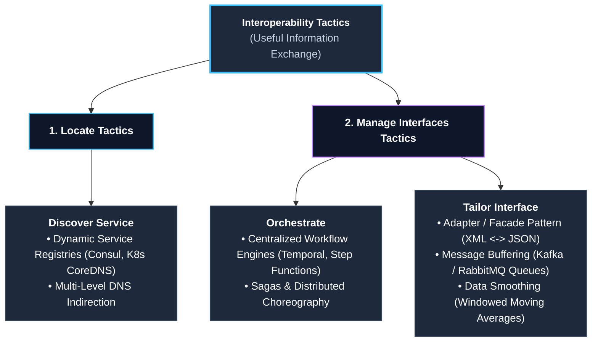

# Lecture 3: Quality Attributes (Part 2) — Interoperability & Testability
**Course:** SEZG651 / SSZG653: Software Architectures (BITS Pilani WILP)  
**Instructor:** Prof. Harvinder S. Jabbal  
**Core Theme:** System Boundary Integration and Verification: In-depth exploration of **Interoperability** (locating services, managing interfaces, vehicular LANs, and data sovereignty) and **Testability** (controllability, observability, limiting complexity, sandboxing, and executable assertions), supported by foundational recaps of **Binding Time** and **Modifiability vs. Modify**.

---

## 1. Executive Overview & Problem Context

### What is this Lecture About? (The 2-Minute Story)
In Lecture 2, we established the 6-part Quality Attribute Scenario framework and explored internal runtime qualities like Availability, Performance, Security, and Usability. **Lecture 3** tackles the two critical qualities that govern how systems **talk to external third parties** and **how software engineers verify system correctness**:

1. **Interoperability:** How two or more independent, heterogeneous systems discover each other, exchange semantically meaningful data, and coordinate workflows without misinterpreting payloads or crashing.
2. **Testability:** How easily a system demonstrates its hidden faults through execution—enabling developers to inject arbitrary state (**Controllability**), inspect internal executions (**Observability**), and run lightning-fast automated CI/CD regression suites.
3. **Foundational Architecture Refinements:** Resolving the core business and architectural distinctions between **Modifiability** (planned upfront evolution) vs. **Modify** (reactive post-delivery rework), and **Binding Time** (compile-time vs. runtime service discovery).

```
┌──────────────────────────────────────────────────────────────────────────────────┐
│                               The Central Reality                                │
│                                                                                  │
│   Interoperability = "How well our system talks to the outside world"            │
│   Testability = "How quickly our system reveals bugs before reaching production" │
│   Testing & Maintenance consume 60%–80% of total engineering budgets!            │
└──────────────────────────────────────────────────────────────────────────────────┘
```

---

### Why Does Architecture Matter to a Software Engineer?

#### 1. The High Cost of System Isolation (The Modern API Web)
No production application exists in isolation. A modern fintech or e-commerce application connects to dozens of external microservices: Stripe / Razorpay for payments, Twilio for SMS, Google Maps for geocoding, and tax calculation engines. 
* If an architecture lacks clear interoperability tactics, every external integration becomes an expensive, fragile custom hack.
* A single breaking schema change from a partner API brings down the entire checkout funnel.

#### 2. Testing Consumes 40%–50% of Engineering Payroll
* In real-world engineering, writing code is fast; testing, verifying, reproducing flaky bugs, and debugging distributed traces consume half of all engineering hours.
* A system with poor testability makes it impossible to isolate dependencies, forces 4-hour manual QA cycles, and produces flaky integration tests that developers learn to ignore.
* Great architects design systems for **high testability from Day 1** using Dependency Injection, containerized sandboxes (Testcontainers), and OpenTelemetry observability.

#### 3. "If You Cannot Measure It, You Cannot Collect Your Cheque!"
* As Prof. Jabbal constantly reminds students: clients and corporate sponsors will not pay for vague promises like *"the system connects easily"* or *"the code is well-tested."*
* Payment depends on passing objective **Response Measures**—such as achieving 85% path coverage in an automated 20-minute CI pipeline, or processing 99.99% of third-party API payloads without data corruption.

---

### Where Does this Fit in the Course Roadmap?
* **Lecture 1:** Macro structures (Module, Component-and-Connector, Allocation) and Views.
* **Lecture 2:** Quality Attributes (Part 1: Availability, Performance, Usability, Security, Modifiability).
* **Lecture 3 (This Lecture):** Quality Attributes (Part 2: Interoperability and Testability), the 7 Architectural Decision Categories, and Verification Strategies.
* **Lectures 4–8:** Architectural Requirements (ASRs), Utility Trees, and Attribute-Driven Design (ADD).
* **Lectures 9–14 (Post-Midterm):** Architectural Patterns (Microservices, Event-Driven, Cloud-Native, Pipe-and-Filter).

---

## 2. Core Concepts Explained Simply

---

### Concept 1: The 7 Architectural Design Decisions (Recap & Coordination Model Deep Dive)

To achieve any quality attribute, architects make decisions across seven universal categories:
1. **Allocation of Responsibilities:** Assigning duties to modules and microservices.
2. **Coordination Model:** Deciding how components communicate.
3. **Data Model:** Syntax, semantics, schemas, and persistence models.
4. **Management of Resources:** CPU, memory buffers, thread pools, and network connection pools.
5. **Mapping Among Architectural Elements:** Code to containers, containers to cloud nodes.
6. **Binding Time:** When connections and parameters are locked.
7. **Choice of Technology:** Selecting languages, databases, message brokers, and cloud providers.

#### Production Coordination Model Trade-Off: Connecting Server A to Server B
When a student (Prasanjith) asked how an architect selects between message queues, shared folders, or databases to coordinate two microservices:
* **Option A (Shared Server File System):** Service A writes a CSV/JSON file to a shared disk or AWS S3 bucket; Service B polls the folder every 5 seconds, processes the file, and archives it. 
  * *Verdict:* Simple, near-zero infrastructure cost, but high disk I/O latency, polling overhead, and limited throughput.
* **Option B (Shared Database Table):** Service A inserts a row into an `outbox` table; Service B queries for pending rows, marks them `IN_PROGRESS`, executes, and updates status.
  * *Verdict:* Provides ACID transaction safety (Transactional Outbox Pattern), but pollutes the relational database with transient high-churn data, increasing lock contention.
* **Option C (Dedicated Message Broker / Event Stream):** Service A publishes a Protobuf message to Apache Kafka or RabbitMQ; Service B consumes messages asynchronously in parallel worker groups.
  * *Verdict:* Highest throughput, decoupled scaling, sub-10ms delivery, but introduces operational cluster complexity and eventual consistency challenges.
* **The Architect’s Rule:** There is no single "best" choice. The architect balances **cost vs. latency SLA vs. delivery guarantee requirements**.

---

### Concept 2: Binding Time Demystified — "Compile-Time vs. Runtime Discovery"

**Binding Time** refers to the exact milestone in the software lifecycle when two architectural elements are connected and their dependency is frozen:

```
[Design Time] ───> [Compile Time] ───> [Build/Link Time] ───> [Deploy Time] ───> [Runtime]
  (Early Binding)                                                            (Late Binding)
```

* **Early Binding (Compile / Build Time):**
  * The developer locks it in source code: `import com.bank.payment.StripeGateway;`
  * Hardcoded, native execution speed, predictable, zero discovery overhead.
  * *Disadvantage:* If Stripe updates their SDK or you switch to Adyen, you must edit source code, recompile, rerun tests, and redeploy containers.
* **Late Binding (Runtime Discovery):**
  * Components do not know who will fulfill their request until runtime execution.
  * The microservice queries a dynamic **Service Registry** (e.g., Kubernetes CoreDNS, HashiCorp Consul, AWS Cloud Map) asking: *"Where is the active payment provider?"* It resolves the live IP/port, establishes a TLS connection, executes, and releases the socket.

> 💡 **Tech Quick-Primer (`Consul & Dynamic Service Discovery`):** *HashiCorp Consul is a distributed service registry and health-checking engine. Instead of hardcoding IP addresses into `.env` files, ephemeral cloud containers register themselves with Consul on startup. When Service A needs to call Service B, it asks Consul for the IP and port of an active, healthy instance.*

  * Highly flexible, auto-scaling friendly, and supports zero-downtime rolling updates.
  * *Disadvantage:* Network lookup latency, health-check overhead, and handling runtime provider failures if the registry is inconsistent.

#### Prof. Jabbal's Intuitive Analogy:
> *"Is the marriage arranged in heaven before birth, or arranged on Shaadi.com at runtime?*  
> *In early binding, the parents (designers) fixed the marriage at compile time. In late binding, your service has a requirement, queries a matrimonial registry (Consul / Kubernetes DNS), matches an available provider that satisfies the API contract, executes the transaction, and disconnects!"*

---

### Concept 3: The Critical Distinction — "Modifiability" vs. "Modify"

During class, Prof. Jabbal clarified a vital industry confusion regarding modifiability:

| Dimension | Modifiability (Proactive Architectural Quality) | Modify (Reactive Post-Delivery Activity) |
| :--- | :--- | :--- |
| **When is it addressed?** | **Upfront during architectural design** | **After software delivery / in production** |
| **Mindset** | Planned, anticipated evolution | "Crossing the river when you reach it" |
| **Initial Construction Cost** | **Higher** (requires abstraction layers, parameters, interfaces) | **Lower** (hardcoded code written quickly for immediate sprint) |
| **Cost of Future Changes** | **Near Zero** (often just a configuration or `.env` parameter change) | **Astronomical** (demands major refactoring, regressions, outages) |
| **Real-World Examples** | Enterprise platforms like **Stripe API**, **Salesforce**, or **Kubernetes** | Bespoke internal scripts hardcoded to specific table schemas |

#### The Database Example (Shielding Applications with Views & Repositories):
* In an RDBMS, altering a table schema (renaming or splitting columns) immediately breaks existing application SQL queries.
* **Architectural Solution:** Never permit external consumers or microservices to query physical database tables directly!
* Introduce an abstraction layer: **SQL Views** or a **Domain-Driven Repository Interface**. When the underlying storage changes, the database engineer updates the view definition or repository implementation. The consuming services remain 100% untouched.

---

### Concept 4: Quality Attribute — Interoperability

#### 1. What is Interoperability?
> **Formal Definition:** Interoperability is the degree to which two or more systems can usefully exchange meaningful information across network boundaries.

* **Two Fundamental Capabilities Required:**
  1. **Locate:** Participating systems must be able to discover each other dynamically or via static configuration.
  2. **Manage Interfaces:** Participating systems must agree on data syntax (JSON, Protobuf, XML), data semantics (what the fields mean), and protocol coordination.

#### 2. The 6-Part Interoperability Scenario Framework

| Scenario Element | SEI Definition | Production Software Example: **Vehicle Telematics Integration** |
| :--- | :--- | :--- |
| **Source** | The initiator requesting communication | An onboard Connected Vehicle Telematics Control Unit (TCU). |
| **Stimulus** | The triggering event | TCU emits real-time GPS coordinates, vehicle speed, and diagnostic codes. |
| **Artifact** | Software piece acted upon | Municipal Smart Traffic Gateway & Fleet Analytics Service. |
| **Environment** | Operational lifecycle stage | Live production streaming over 4G/5G cellular network with spotty handoffs. |
| **Response** | The engineered activity | Gateway ingests telemetry, validates payload against JSON schema, and translates coordinates. |
| **Response Measure** | Measurable test metric | Telemetry processed with **99.9% success rate**; payload parsing latency $< 15	ext{ ms}$. |

---

### Concept 5: Real-World Interoperability Engineering Vignettes

#### Vignette 1: Apple's Walled Garden vs. Open Standards
* Historically, Apple maintained closed proprietary protocols (Lightning cable, proprietary AirPlay).
* As tech ecosystems matured, global economic and regulatory forces mandated open interoperability: adopting USB-C standards, supporting Matter for smart home IoT, and opening Apple Music to Android.
* **Architectural Lesson:** Focus engineering resources on your **core differentiator**; use open, standardized interoperability protocols for boundaries.

#### Vignette 2: Connected Vehicular LANs (V2X Highway Platooning)
* **The Problem:** Connected vehicles moving at 120 km/h on expressways cannot rely on public cellular networks (latency is too high, cell towers drop connections).
* **The Architecture:**
  * Highways deploy **Roadside Dedicated Short-Range Communication (DSRC) / C-V2X pillars**.
  * Vehicles establish ad-hoc, low-latency wireless LANs with local roadside pillars without public cellular data plans.
  * Roadside Edge AI nodes group cars into **platooning clusters** (20 to 30 vehicles), synchronizing radar cruise control and braking across the cluster. When the lead truck brakes, all 30 vehicles decelerate simultaneously via peer-to-peer V2X messaging, preventing pileups.

#### Vignette 3: Data Sovereignty & National Map APIs (Google Maps vs. Mapples / NavIC)
* Routing location queries to overseas cloud providers incurs foreign exchange costs and exposes national citizen location telemetry to foreign jurisdictions.
* Indian regulations encouraged homegrown navigation infrastructure (**MapmyIndia / Mapples** integrated with ISRO's **NavIC** satellites).
* **Architectural Tactic (Bandwidth Optimization):** Instead of streaming heavy vector map tiles on every query, mobile apps cache regional vector maps locally on device storage. Live API calls exchange only lightweight coordinate diffs and traffic status payloads.

---

### Concept 6: Interoperability Architectural Tactics Catalog

Interoperability tactics partition into two clear categories: **Locate** and **Manage Interfaces**.



#### Category 1: Locate Tactics
* **Discover Service:**
  * When a microservice needs to invoke an external service whose IP address and port are dynamic (ephemeral cloud containers), it queries a **Service Registry** (e.g., Kubernetes CoreDNS, HashiCorp Consul).
  * Involves **Multi-Level Indirection**: Client queries an API Gateway $
ightarrow$ API Gateway queries Service Discovery $
ightarrow$ resolves virtual IP to healthy backend container.

#### Category 2: Manage Interfaces Tactics
* **Orchestrate:**
  * Coordinates and sequences invocations across multiple external services to execute a multi-step distributed transaction.
  * *Production Systems:* **Temporal**, **AWS Step Functions**, or **Camunda** managing the **Saga Pattern** (e.g., 1. Authorize Stripe Payment $
ightarrow$ 2. Reserve Warehouse Stock $
ightarrow$ 3. Generate UPS Shipping Label; if Step 3 fails, trigger compensating rollback transactions on Steps 2 and 1).
* **Tailor Interface:**
  * Resolves impedance mismatches between communicating services:
    * **Translation / Adaptation:** An API Gateway translating legacy SOAP/XML responses from a core banking mainframe into modern JSON REST responses.
    * **Buffering:** Placing a durable queue (Apache Kafka or AWS SQS) between a high-speed producer emitting 10,000 events/sec and a slow downstream database that can only absorb 500 writes/sec.
    * **Data Smoothing:** Applying windowed moving averages or low-pass filtering on noisy IoT sensor streams before dispatching data to analytics engines.

---

### Concept 7: Quality Attribute — Testability

#### 1. What is Testability?
> **Formal Definition:** Software testability is the degree of ease with which software can be made to demonstrate its hidden faults through execution-based testing.

* **The Ultimate Goal:** If a bug exists in the system, we want it to fail **immediately, loudly, and deterministically in our automated CI/CD pipeline**, rather than silently propagating and corrupting production data.
* **The Two Fundamental Pillars of Testability:**
  1. **Controllability:** The ability to control each component's inputs, inject arbitrary internal states, and mock external dependencies.
  2. **Observability:** The ability to inspect each component's outputs, intermediate memory states, and execution traces.

> 💡 **Tech Quick-Primer (`OpenTelemetry & Distributed Tracing`):** *OpenTelemetry (OTel) assigns every incoming user request a globally unique `traceId`. As that request bounces across 15 different microservices and databases, each service propagates the `traceId` with its local `spanId`, letting SREs view the entire end-to-end execution timeline and pinpoint the exact microservice causing a latency spike.*

```
                          ┌──────────────────────────────────────┐
                          │   The Two Pillars of Testability     │
                          └──────────────────┬───────────────────┘
                                             │
             ┌───────────────────────────────┴───────────────────────────────┐
             ▼                                                               ▼
┌───────────────────────────┐                                   ┌───────────────────────────┐
│     CONTROLLABILITY       │                                   │       OBSERVABILITY       │
│  "Can I inject arbitrary  │                                   │  "Can I inspect internal  │
│   inputs, clock times,    │                                   │   execution states, logs, │
│   and error responses?"   │                                   │   and distributed traces?"│
└───────────────────────────┘                                   └───────────────────────────┘
```

#### 2. The 6-Part Testability Scenario Framework

| Scenario Element | SEI Definition | Production Software Example: **Payment Service Unit Test** |
| :--- | :--- | :--- |
| **Source** | The entity executing tests | Automated CI/CD pipeline runner (GitHub Actions / GitLab CI). |
| **Stimulus** | The triggering event | A pull request triggers the automated test suite upon code merge. |
| **Artifact** | Software unit under test | The Core Billing & Subscription Microservice. |
| **Environment** | Operational lifecycle stage | Staging test environment running containerized mocks. |
| **Response** | The engineered activity | Suite executes unit, integration, and contract tests; captures code coverage and traces. |
| **Response Measure** | Measurable test metric | **85% branch coverage achieved**; total test suite execution finishes in $< 8	ext{ minutes}$. |

---

### Concept 8: Testability Architectural Tactics Catalog

Testability tactics divide into: **Control & Observe System State** and **Limit Complexity**.

```mermaid
graph TD
    TT["<b style='color:#ffffff; font-size:15px;'>Testability Tactics</b><br/><span style='color:#cbd5e1;'>(Fast, Deterministic Fault Discovery)</span>"]

    TT --> CO["<b style='color:#ffffff;'>1. Control & Observe State</b>"]
    TT --> LC["<b style='color:#ffffff;'>2. Limit Complexity</b>"]

    CO --> SI["<b>Specialized Interfaces:</b> Test harnesses, health probes, debug ports"]
    CO --> RP["<b>Record / Playback:</b> WireMock / VCR traffic capture & replay"]
    CO --> LSS["<b>Localize State Storage:</b> Centralized state stores (Redux, Redis)"]
    CO --> ADS["<b>Abstract Data Sources:</b> Dependency Injection, Mocking"]
    CO --> SB["<b>Sandbox:</b> Ephemeral Docker containers (Testcontainers)"]
    CO --> EA["<b>Executable Assertions:</b> Contract tests, pre/post invariants"]

    LC --> LSC["<b>Limit Structural Complexity:</b> Break cyclic deps, enforce acyclic DAG"]
    LC --> LND["<b>Limit Non-Determinism:</b> Seeded clocks, deterministic thread scheduling"]

    style TT fill:#1e293b,stroke:#38bdf8,stroke-width:2.5px,color:#ffffff
    style CO fill:#0f172a,stroke:#38bdf8,stroke-width:1.5px,color:#ffffff
    style LC fill:#0f172a,stroke:#c084fc,stroke-width:1.5px,color:#ffffff
    style SI fill:#1e293b,stroke:#475569,stroke-width:1px,color:#ffffff
    style RP fill:#1e293b,stroke:#475569,stroke-width:1px,color:#ffffff
    style LSS fill:#1e293b,stroke:#475569,stroke-width:1px,color:#ffffff
    style ADS fill:#1e293b,stroke:#475569,stroke-width:1px,color:#ffffff
    style SB fill:#1e293b,stroke:#475569,stroke-width:1px,color:#ffffff
    style EA fill:#1e293b,stroke:#475569,stroke-width:1px,color:#ffffff
    style LSC fill:#1e293b,stroke:#475569,stroke-width:1px,color:#ffffff
    style LND fill:#1e293b,stroke:#475569,stroke-width:1px,color:#ffffff
```



#### Category 1: Tactics to Control and Observe System State
1. **Specialized Interfaces:** Exposing dedicated management endpoints (`/actuator/health`, `/metrics`, debug ports) allowing test harnesses to query private state or simulate low-memory conditions without polluting production routes.
2. **Record / Playback:** Capturing real production network traffic and replaying it through staging services (e.g., using **WireMock** or **GoReplay**) to test performance under realistic production payloads.

> 💡 **Tech Quick-Primer (`WireMock`):** *A lightweight HTTP mock server. It records real external API responses and replays stubbed responses locally during tests, enabling test suites to run deterministically without internet access, flakiness, or third-party API costs.*

3. **Localize State Storage:** Storing state in centralized, accessible structures rather than distributing it across hundreds of hidden object fields, making state injection and reset instantaneous.
4. **Abstract Data Sources:** Programming to interfaces rather than concrete implementations (**Dependency Injection**). Enables swapping a real AWS S3 client with an in-memory mock during unit tests.
5. **Sandbox:** Running tests inside ephemeral, isolated Docker containers (**Testcontainers**). Spins up a fresh PostgreSQL or Kafka instance in 3 seconds, runs the test suite against real databases, and destroys the container, eliminating test data pollution.

> 💡 **Tech Quick-Primer (`Testcontainers`):** *A modern testing library (Java, Go, Python, Node) that boots real, throwaway Docker containers (PostgreSQL, Redis, Kafka) directly from test suites. It executes tests against real production database engines rather than in-memory approximations, destroying the container on test exit to guarantee zero state pollution.*
6. **Executable Assertions:** Runtime contract checks embedded in code:
   * *Pre-conditions:* Validating input ranges before execution.
   * *Post-conditions:* Verifying calculation results before returning.
   * *Class Invariants:* State conditions that must remain true across all operations (e.g., `accountBalance >= 0`).

#### Category 2: Tactics to Limit Complexity
1. **Limit Structural Complexity (Eliminate Cyclic Dependencies):**
   * If Package A imports Package B, and Package B imports Package A, neither can be compiled or tested independently.
   * Enforce a strict **Directed Acyclic Graph (DAG)** of dependencies. Breaking cycles via Dependency Inversion makes every module independently unit-testable.
2. **Limit Non-Determinism (Eliminating Flaky Tests):**
   * Non-deterministic tests (passing in local IDE, failing randomly in CI) ruin developer confidence.
   * Caused by: unseeded random generators, wall-clock time dependencies (`System.currentTimeMillis()`), and race conditions in concurrent threads.
   * *Architectural Fix:* Inject clock abstractions (`Clock` interface) and use deterministic, single-threaded executor test harnesses.

---

## 3. Visual Architectural Models

### Diagram 1: Interoperability via API Gateway & Buffer Matching

```mermaid
flowchart LR
    subgraph EXT ["External Partner Services"]
        P1["Partner Bank A<br/>(Legacy SOAP/XML)"]
        P2["Fintech Partner B<br/>(Modern REST/JSON)"]
    end

    subgraph GW ["Edge Interoperability Layer"]
        APIGW["API Gateway / Envoy<br/>(Authentication & Translation)"]
        TRANS["Payload Adapter<br/>(XML <-> JSON)"]
    end

    subgraph BUF ["Buffer Matching"]
        KAFKA[("Apache Kafka<br/>(Durable Buffer Queue)")]
    end

    subgraph INT ["Internal Microservices"]
        CORE["Core Ledger Service<br/>(High-Throughput Consumer)"]
        DB[(Primary DB)]
    end

    P1 -->|SOAP over HTTPS| APIGW
    P2 -->|REST over HTTPS| APIGW
    APIGW --> TRANS
    TRANS -->|Standard Protobuf Event| KAFKA
    KAFKA -->|Rate-Controlled Batch Fetch| CORE
    CORE --> DB

    style EXT fill:#0f172a,stroke:#38bdf8,stroke-width:1.5px
    style GW fill:#0f172a,stroke:#fbbf24,stroke-width:1.5px
    style BUF fill:#0f172a,stroke:#c084fc,stroke-width:1.5px
    style INT fill:#0f172a,stroke:#4ade80,stroke-width:1.5px
```



*Walkthrough:* Disparate external protocols (SOAP/XML and REST/JSON) are normalized by the API Gateway adapter into standard internal Protobuf events and buffered in Kafka, shielding internal databases from external traffic spikes.

---

### Diagram 2: Testability Architecture with Sandboxing & Dependency Injection

```mermaid
flowchart TD
    subgraph PROD ["Production Execution"]
        SVC1["Payment Service"] --> REAL_DB[(AWS Aurora PostgreSQL)]
        SVC1 --> REAL_API["Stripe Live API"]
    end

    subgraph CI ["Automated CI/CD Test Pipeline"]
        SVC2["Payment Service<br/>(Under Test)"]
        TC_DB[("Ephemeral Docker DB<br/>(Testcontainers)")]
        MOCK_API["Mock HTTP Server<br/>(WireMock)"]

        SVC2 -->|Injected Test Connection| TC_DB
        SVC2 -->|Injected Mock URL| MOCK_API
    end

    style PROD fill:#0f172a,stroke:#38bdf8,stroke-width:1.5px
    style CI fill:#0f172a,stroke:#4ade80,stroke-width:1.5px
```



*Walkthrough:* By abstracting data sources through interfaces (Dependency Injection), the CI pipeline tests identical business logic against ephemeral Docker databases and mock servers without touching production networks or incurring third-party API costs.

---

## 4. Key Trade-Offs & Comparisons

### Table 1: Early Binding vs. Late Binding Trade-Offs
| Dimension | Early Binding (Compile / Build Time) | Late Binding (Runtime / Deployment Time) |
| :--- | :--- | :--- |
| **Mechanisms** | Static linking, compiler imports, hardcoded URLs. | Service discovery (Consul, CoreDNS), dynamic plugins. |
| **Performance** | **Maximum speed**; zero runtime lookup latency. | Minor network overhead for service resolution. |
| **Modifiability** | Low; requires code edit, recompile, and redeploy. | **Extreme flexibility**; swap providers without redeploy. |
| **Testability** | Deterministic and easy to mock at build time. | Requires mocking service registries and fallback states. |
| **Recommendation** | Lock down stable internal domain utilities early. | Defer binding of external vendor APIs and microservice endpoints. |

---

### Table 2: Modifiability (Proactive) vs. Modify (Reactive)
| Comparison Point | Modifiability (Quality Attribute) | Modify (Maintenance Action) |
| :--- | :--- | :--- |
| **Timing** | Designed upfront before writing business code. | Carried out months or years after system delivery. |
| **Initial Upfront Cost** | Higher (demands interface abstractions, configs). | Low (quick hardcoded code for immediate delivery). |
| **Post-Delivery Cost** | Near zero (parameter change in `.env` or database). | Massive (requires weeks of architectural refactoring). |
| **Commercial Strategy** | Premium enterprise platform (SAP, Salesforce). | Low-bid MVP contract with high change-order billing. |

---

### Table 3: Controllability vs. Observability in Testability
| Dimension | Controllability | Observability |
| :--- | :--- | :--- |
| **Core Question** | Can I force the system into the exact state I need? | Can I see exactly what the system did internally? |
| **Primary Tactics** | Abstract Data Sources, Dependency Injection, Sandboxing. | Specialized Interfaces, Distributed Tracing, Assertions. |
| **Failure Manifestation** | Inability to test rare edge cases (e.g., leap year, disk full). | Bugs reproduce in production, but root cause is invisible. |
| **Engineering Tooling** | Mockito, Testcontainers, WireMock. | OpenTelemetry, Prometheus, Jaeger, Log4j. |

---

## 5. Professor's Practical Tips & Classroom Advice

*(Synthesized directly from Prof. Harvinder S. Jabbal's lecture discussions)*

### 1. "Modifiability Does Not Come Cheap: Charge Them the Earth!"
* When clients request "a completely modifiable system," junior consultants nod happily.
* Prof. Jabbal cautioned: **Modifiability requires deep architectural investment**—building dynamic plugins, abstracting schemas, writing configuration engines.
* If the client is willing to pay the premium upfront, architect for high modifiability. If they demand a low-cost MVP, build it simple and warn them that post-delivery modifications will be billed through formal engineering change orders.

### 2. Assertions in Production: Silent Logging vs. Immediate Halting
* A student (Ashutosh Apte) asked: *"Should executable assertions remain active in production code?"*
* **The Rule:**
  * In **standard enterprise web systems**: When an assertion fails, log the stack trace silently using structured logging (Log4j / SLF4J), alert SREs via metrics, and return a user-friendly error (`HTTP 500: Please retry`). Never crash the entire server process!
  * In **safety-critical embedded systems (avionics, nuclear, medical)**: When an assertion fails, halt the running component immediately and failover to a cold or warm standby, because running with corrupted memory state can result in physical destruction or loss of life.

### 3. Open-Book Exam Warning (Applying Principles to Scenarios)
* Open-book exam questions will never ask you to define "Testability" or "Interoperability."
* They will give you a concrete scenario (e.g., a hospital telemetry service integrating with national health registries) and ask: *"Select 2 Interoperability tactics and 2 Testability tactics to meet an SLA of 99.9% data delivery and $< 10	ext{ min}$ CI test cycles. Justify why alternative tactics fail."*

---

## 6. Exam-Ready Question Bank

### Part A: Short-Answer Questions (2–3 Marks Each)

#### Q1: Define Software Testability from a probability perspective.
* **Answer:** Software testability is the probability, assuming that the software has at least one fault, that it will fail on its next execution-based test.

#### Q2: What are the two foundational pillars of Testability? Define each.
* **Answer:**
  1. **Controllability:** The ability to provide a component with specified inputs and manipulate its internal state to trigger targeted execution paths.
  2. **Observability:** The ability to observe and capture a component's output responses and intermediate internal states.

#### Q3: What is the difference between Modifiability and Modify?
* **Answer:** **Modifiability** is a planned architectural quality attribute designed upfront using abstractions to make future changes inexpensive. **Modify** is a reactive maintenance activity executed after delivery on systems that lacked upfront modifiability, often incurring massive refactoring costs.

#### Q4: Explain the difference between Orchestration and Tailor Interface in Interoperability.
* **Answer:** **Orchestration** coordinates, sequences, and manages multi-step workflows across disparate services (e.g., Saga workflow engines). **Tailor Interface** translates or bridges incompatible payloads and speeds between two communicating interfaces (e.g., adapters, buffering queues).

#### Q5: How does eliminating cyclic dependencies improve Testability?
* **Answer:** Cyclic dependencies (Module A depends on B, and B depends on A) prevent modules from being compiled, executed, or tested in isolation. Breaking cycles via dependency inversion creates an acyclic directed graph (DAG), allowing each module to be unit-tested independently with isolated mocks.

#### Q6: What role does a Sandbox tactic play in automated verification?
* **Answer:** A sandbox provides an isolated, disposable execution environment (such as an ephemeral Docker container) where destructive tests, schema migrations, and failure injections can run without corrupting production databases or persistent test infrastructure.

---

### Part B: Analytical & Scenario Questions (5–10 Marks Each)

#### Q1 (Scenario Analysis - Interoperability & Testability in Fintech):
**Scenario:** A digital bank is launching an instant loan approval microservice. The service must integrate with three external credit score rating agencies (Experian, Equifax, CRIF), coordinate their responses, evaluate loan eligibility within 3 seconds, and guarantee that automated CI/CD builds verify the complete loan approval logic within 5 minutes without calling real credit agency APIs.  
**Task:**
1. Formulate a 6-part Concrete Interoperability Scenario for the credit agency integration. [3 Marks]
2. Recommend and justify two Interoperability Tactics (one Locate tactic and one Manage Interfaces tactic). [4 Marks]
3. Recommend two Testability Tactics to ensure fast, deterministic CI builds without calling live credit agencies. [3 Marks]

* **Answer Guidelines & Scoring Points:**
  1. **Concrete Interoperability Scenario [3 Marks]:**
     * *Source:* Internal Loan Application Microservice.
     * *Stimulus:* Request credit history score for an applicant.
     * *Artifact:* Credit Scoring Gateway and external credit agency REST APIs.
     * *Environment:* Normal live operational mode over secure public internet.
     * *Response:* Gateway queries all 3 agencies in parallel, normalizes disparate JSON/XML schemas into internal score models, and logs all audit transactions.
     * *Response Measure:* 99.99% of queries successfully processed; total credit evaluation returned in $< 3.0	ext{ seconds}$.
  2. **Interoperability Tactics [4 Marks]:**
     * *Locate Tactic:* **Discover Service** via dynamic Service Registry (e.g., HashiCorp Consul or AWS Cloud Map) to resolve agency gateway endpoints, load-balancing across available proxy egress nodes.
     * *Manage Interfaces Tactic:* **Orchestration** (using an asynchronous workflow engine like Temporal to coordinate parallel calls to all 3 agencies with a 2-second timeout barrier) and **Tailor Interface / Adaptation** (translating XML payloads into unified internal domain models).
  3. **Testability Tactics [3 Marks]:**
     * *Tactic 1:* **Abstract Data Sources (Dependency Injection / Mocking):** Wrap external credit agency clients behind clean interfaces (`CreditRatingProvider`). In the CI/CD pipeline, inject mock clients that return pre-configured synthetic scores instantly without making outbound HTTP calls.
     * *Tactic 2:* **Sandbox (Ephemeral Containers via Testcontainers):** Run integration tests against a lightweight local container simulating credit API responses, ensuring tests run deterministically in $< 5	ext{ minutes}$ with zero flakiness.

---

#### Q2 (Trade-Off Analysis - Interoperability vs. Security):
**"Designing an architecture for seamless external interoperability directly increases the system's security vulnerability attack surface."  
Critically analyze this statement. Explain two concrete security risks introduced by external interoperability and detail how an architect mitigates them.**

* **Answer Guidelines & Scoring Points:**
  1. **Core Architectural Tension [2 Marks]:**
     * Interoperability aims to make services **open, discoverable, and accessible** across network boundaries.
     * Security aims to make services **isolated, protected, and restrictive** (principle of least privilege).
  2. **Risk 1: Boundary Intrusion & Parameter Tampering (3 Marks):**
     * *Risk:* Opening external REST/gRPC endpoints to third-party partners exposes internal components to injection attacks, malicious payloads, and deserialization exploits.
     * *Mitigation:* Deploy an **API Gateway** acting as an impenetrable boundary reverse-proxy. Enforce mutual TLS (mTLS) for identity verification, validate all incoming payloads against strict JSON/Protobuf schemas before forwarding internally, and sanitize all input strings.
  3. **Risk 2: Cascading Denial of Service (DoS) & Resource Starvation (3 Marks):**
     * *Risk:* If an external partner system malfunctions and bombards your interoperable endpoint with millions of requests per second, internal thread pools, CPU cores, and database connection pools become saturated, crashing internal services.
     * *Mitigation:* Apply the **Limit Event Response (Rate Limiting)** tactic at the gateway (token bucket per client API key) combined with the **Circuit Breaker** tactic to fast-fail external calls when partner latencies spike, preventing resource exhaustion.
  4. **Conclusion [2 Marks]:**
     * An architect never exposes raw internal domain services directly. Every interoperable boundary must be mediated by hardened gateway facades with authentication, rate-limiting, and schema validation.

---

## 7. Quick Revision & 60-Second Exam Recap

### Key Terms Glossary
* **Interoperability:** Degree to which two or more systems usefully exchange meaningful information.
* **Testability:** Ease with which software can demonstrate hidden faults during execution.
* **Controllability:** Ability to inject inputs and set internal system states during testing.
* **Observability:** Ability to inspect outputs, intermediate states, and logs during execution.
* **Binding Time:** Milestone where software connections and parameters are locked (compile, build, deploy, runtime).
* **Modifiability vs. Modify:** Proactive upfront engineering vs. reactive post-delivery rework.
* **Orchestration:** Centralized coordination and sequencing of multi-step service interactions.
* **Tailor Interface:** Adapting, translating, or buffering incompatible communication interfaces.
* **Sandbox:** Disposable, isolated virtual test environment (e.g., Docker Testcontainers).
* **Cyclic Dependency:** Anti-pattern where components depend on each other, destroying testability.

---

### The 5 Golden Rules to Remember
1. **Modifiability is Planned, Modify is Pain:** If you don't invest in modifiability upfront, future modifications will cost 10x more in emergency rework.
2. **Testability Requires Controllability & Observability:** If you can't inject state and observe outputs, you cannot test effectively.
3. **Break Cycles for Testability:** Acyclic dependency graphs (DAG) make independent unit testing possible.
4. **Buffer for Rate Matching:** Always place durable queues between high-speed producers and slow consumers.
5. **Freeze Decisions Only When Necessary:** Early binding is fast; late binding is flexible. Balance based on business volatility.

---

### 60-Second Rapid Fire Q&A
* *Q: What are the two main categories of interoperability tactics?*  
  $\rightarrow$ Locate Tactics (Discover Service) and Manage Interfaces Tactics (Orchestrate, Tailor Interface).
* *Q: What are the two pillars of testability?*  
  $\rightarrow$ Controllability (injecting state/inputs) and Observability (inspecting outputs/traces).
* *Q: How does Dependency Injection improve testability?*  
  $\rightarrow$ It allows swapping real databases and external APIs with fast in-memory mocks during tests.
* *Q: What is the main drawback of runtime late binding?*  
  $\rightarrow$ Lookup latency overhead and potential runtime connection failures.
* *Q: Why are cyclic dependencies dangerous for testability?*  
  $\rightarrow$ They make it impossible to compile, run, or unit-test modules in isolation.
* *Q: What is the difference between an Assertion and a Unit Test?*  
  $\rightarrow$ An assertion is executable code running in the real application verifying invariants; a unit test is an external test harness.
