# Lecture 4: Architecture Requirements, Design, and Agile Architecting
**Course:** SEZG651 / SSZG653: Software Architectures (BITS Pilani WILP)  
**Instructor:** Prof. Harvinder S. Jabbal  
**Core Theme:** Extracting Architecturally Significant Requirements (ASRs), prioritizing them via the Utility Tree, systematic design with Attribute-Driven Design (ADD), and finding the "Sweet Spot" between Agile velocity and upfront architecture.

---

## 1. The Big Picture (Why Should I Care?)

- **What is this lecture about?**  
  In a normal software sprint, your product backlog is filled with dozens of user stories: *"Allow users to filter by date,"* *"Add profile avatar,"* *"Send password reset email."* **95% of those stories have zero impact on software architecture.** A developer can write them in a few hours. But buried in that backlog are a handful of explosive requirements: *"System must handle 50,000 requests/sec,"* or *"Zero transaction loss if a data center burns down."* These are **Architecturally Significant Requirements (ASRs)**.
- **The Real-World Problem:**  
  If an engineering team treats all user stories equally and starts coding without architectural planning, the project hits the **Cost of Rework Wall**: adding new features becomes painfully slow because services, database schemas, and networks were never structured to scale or evolve.
- **Where this fits in the course:**  
  Lectures 1–3 taught what architecture is and defined the Quality Attributes. Lecture 4 teaches **how to systematically design an architecture** from real business requirements without getting trapped in endless paperwork or cowboy coding.

---

## 2. Core Concepts Explained Simply

### Concept 1: Architecturally Significant Requirements (ASRs)

#### Plain-English Definition
An **Architecturally Significant Requirement (ASR)** is any requirement that has a profound, shaping impact on the high-level architecture of the system.

```
┌────────────────────────────────────────────────────────┐
│                   All Requirements                     │
│  ┌──────────────────────────────────────────────────┐  │
│  │ Routine Requirements (95%)                       │  │
│  │ (CRUD logic, form validation, email templates)   │  │
│  │                                                  │  │
│  │ ┌──────────────────────────────────────────────┐ │  │
│  │ │ Architecturally Significant (5% - ASRs)      │ │  │
│  │ │ (50k RPS, multi-region failover, 99.99% SLA, │ │  │
│  │ │  sub-200ms latency, data privacy laws)       │ │  │
│  │ └──────────────────────────────────────────────┘ │  │
│  └──────────────────────────────────────────────────┘  │
└────────────────────────────────────────────────────────┘
```

* **Routine Requirement:** *"Export order list to Excel."* Handled locally inside a controller method. It doesn't change your servers, databases, or protocols.
* **ASR:** *"Process payments within 200ms with zero data loss during regional outages."* Forces decisions about distributed databases, caching clusters, asynchronous message brokers, and multi-region failover.

#### How to Find ASRs in Real Life:
1. Look beyond the functional System Requirements Specification (SRS) document.
2. Interview key business stakeholders to find real pain points.
3. Look at non-functional requirements, business growth projections, and legal constraints.

---

### Concept 2: The Utility Tree (Prioritizing ASRs)

You cannot design for 50 quality attribute scenarios all at once. The **Utility Tree** is an SEI tool to prioritize them top-down:

```
Utility (Root)
 ├── Performance
 │    ├── Latency ────► Scenario 1: Process checkout in < 300ms under 5k RPS  (High, High)
 │    └── Throughput ─► Scenario 2: Ingest 10k logs/sec                       (High, Medium)
 └── Security
      ├── Authentication ► Scenario 3: MFA verification in < 1s               (High, Low)
      └── Data Privacy ──► Scenario 4: Encrypt card records at rest (AES-256) (High, Low)
```

#### The 4 Levels of a Utility Tree:
1. **Utility (The Root):** The overall goodness and quality of the system.
2. **Quality Attribute:** Broad categories (Performance, Availability, Security, Modifiability).
3. **Refinement (Sub-Factor):** More specific aspect (e.g., Latency, Throughput, Data Confidentiality).
4. **Concrete Scenario (The Leaves):** Specific 6-part scenarios with exact numbers and metrics.

#### The Prioritization Tuple: `(Business Importance, Technical Difficulty)`
Every scenario leaf is evaluated on two scales:
* **Importance to the Business:** (High / Medium / Low)
* **Technical Difficulty for the Architect:** (High / Medium / Low)

> **The Golden Rule:** **`(High, High)` scenarios are your primary architectural drivers.** Design your architecture around the `(H, H)` scenarios first! Scenarios with Low/Low can be tackled later by junior engineers.

---

### Concept 3: Attribute-Driven Design (ADD)

#### Plain-English Definition
**Attribute-Driven Design (ADD)** is a systematic, step-by-step method developed by the SEI where an architect designs system structures **driven directly by the prioritized quality attribute scenarios (ASRs)**, rather than relying on guesswork.

#### The 7 Steps of ADD:
1. **Choose an element to decompose:** Start with the whole system, then zoom into subsystems.
2. **Identify the highest priority ASRs:** Pick the `(High, High)` scenarios from the Utility Tree.
3. **Choose a design concept (patterns & tactics):** Select architectural patterns (e.g., Microservices, Event-Driven) and tactics (e.g., Caching, Heartbeat) that satisfy those ASRs.
4. **Instantiate elements & allocate responsibilities:** Break the system into concrete modules/components and decide who does what.
5. **Define interfaces & interactions:** Document how the new components talk to each other (APIs, parameters, data models).
6. **Verify against requirements:** Check if the design actually satisfies the target quality scenarios.
7. **Repeat recursively:** Repeat the process for each newly created subsystem until the design is complete.

---

### Concept 4: Architecture in Agile (Finding the "Sweet Spot")

#### The Apparent Conflict:
* **Agile Philosophy:** Value *"working software over comprehensive documentation"* and *"respond to change over following a plan."*
* **Architecture Philosophy:** Plan macro structures upfront, establish clear boundaries, and protect long-term quality attributes.

#### The Real Question:
The question is never *"Agile OR Architecture?"*  
The real question is: **"How much architecture upfront vs. how much during sprints?"**

#### Barry Boehm's Cost of Rework Model (The "Sweet Spot"):
Two activities add cost and time to a project:
1. **Upfront Architecture Time:** Spending months in design meetings before writing any code (Big Design Up Front - BDUF). Too much leads to analysis paralysis.
2. **Rework Time:** Fixing architectural flaws and rebuilding code because no one planned the foundation. Too little architecture leads to technical debt.

```
Total Project Effort
      ▲
      │       /   Total Cost Curve
      │      /       │     /   \       Sweet Spot
      │    /     \_________▼_________
      │   /                                │  / Upfront Effort             \ Rework Cost
      └────────────────────────────────────────►
         0%                       100%
                Upfront Architectural Effort
```

* **Small Projects (~10k lines of code):** The sweet spot is **~5% upfront architecture**. Start coding quickly; rework is cheap.
* **Large Enterprise Platforms (~1M lines of code):** The sweet spot is **~30%–40% upfront architecture**. If you don't design the data boundaries and communication models early, the rework costs will bankrupt the project.

---

### Concept 5: Architectural Spikes & The Walking Skeleton

In Agile environments, architects don't write 300-page theoretical documents. They use two practical engineering tools:

#### 1. The Architectural Spike (Time-Boxed Experiment)
* **What is it?** A short, 1-to-2 week time-boxed research task where an engineer writes disposable prototype code to test a risky architectural question.
* *Example:* "Can Apache Kafka handle 40,000 events/sec on a 3-node cluster with less than 20ms latency?" The team runs a 1-week spike, proves it with real benchmarks, and commits to the architecture with confidence.

#### 2. The Walking Skeleton
* **What is it?** An ultra-thin, end-to-end implementation of the system with **zero business logic**, but with all core layers and network pipes wired up (Frontend $
ightarrow$ API Gateway $
ightarrow$ Service $
ightarrow$ Database).
* **Why do it on Day 1?** It proves that deployment pipelines, network firewalls, and database connections actually work in production before developers write thousands of lines of business code.

---

### Concept 6: Pragmatic Architecture Documentation (Write for the Reader!)

* **No Shelf-ware:** Avoid 200-page PDF documents that sit unread on corporate wikis.
* **Write for the Audience:**
  * Developers need the **Module / Component View** (APIs, data models, error codes).
  * DevOps / SREs need the **Deployment / Allocation View** (ports, servers, memory limits, failover paths).
  * Executives need the **Context View** (business capabilities, costs, timelines).
* **Architecture Decision Records (ADRs):**  
  Store short, lightweight markdown files directly in your Git repository under `/docs/adr/`.
  > 💡 **Tech Quick-Primer (`ADR - Architecture Decision Record`):** *A 1-page markdown document stored in Git (e.g., `docs/adr/0002-use-postgres-for-orders.md`). It records the **Context** (the problem), the **Decision** (what was chosen), and the **Consequences** (trade-offs), so future developers understand why a decision was made.*

---

## 3. Visual Architecture Models

### 1. The Utility Tree Structure

```mermaid
flowchart TD
    ROOT["<b>Utility (System Quality)</b>"]

    P["<b>Performance</b>"]
    S["<b>Security</b>"]
    M["<b>Modifiability</b>"]

    ROOT --> P & S & M

    P1["Latency"]
    P2["Throughput"]
    P --> P1 & P2

    S1["Data Protection"]
    S --> S1

    M1["Third-party Integration"]
    M --> M1

    SC1["<b>Scenario 1:</b> Checkout < 300ms<br/><b>(High, High)</b>"]
    SC2["<b>Scenario 2:</b> Ingest 10k logs/sec<br/><b>(High, Med)</b>"]
    SC3["<b>Scenario 3:</b> Encrypt records (AES-256)<br/><b>(High, Low)</b>"]
    SC4["<b>Scenario 4:</b> Add new payment partner<br/><b>(Med, Med)</b>"]

    P1 --> SC1
    P2 --> SC2
    S1 --> SC3
    M1 --> SC4

    style ROOT fill:#0f172a,stroke:#38bdf8,stroke-width:1.5px
    style SC1 fill:#1e293b,stroke:#ef4444,stroke-width:2px
    style SC2 fill:#1e293b,stroke:#fbbf24,stroke-width:1.5px
    style SC3 fill:#1e293b,stroke:#22c55e,stroke-width:1.5px
    style SC4 fill:#1e293b,stroke:#94a3b8,stroke-width:1px
```



* **Walkthrough:** The tree breaks high-level quality goals into prioritized concrete scenarios. Scenarios marked **(High, High)** are tackled first.

---

## 4. Key Comparisons & Trade-Offs

### Comparison 1: Routine Requirements vs. ASRs
| Aspect | Routine Functional Requirements (95%) | Architecturally Significant Requirements (5%) |
| :--- | :--- | :--- |
| **Examples** | User profile update, form validation, date filter | 50k requests/sec, 99.99% uptime, zero data loss |
| **System Impact** | Localized to a single class or method | Dictates database choices, caching, clustering, and protocols |
| **Handling** | Implemented directly in sprints by developers | Designed upfront by architects using ADD and tactics |
| **Cost of Bug** | Low (a few hours of sprint bug fixing) | Catastrophic (requires redesigning distributed systems) |

---

### Comparison 2: Big Design Up Front (BDUF) vs. Agile Architecture
| Feature | Big Design Up Front (BDUF) | Agile Architecture (Pragmatic) |
| :--- | :--- | :--- |
| **Upfront Effort** | 6–12 months of theoretical design | Just enough architecture upfront to build a Walking Skeleton |
| **Documentation** | 300-page Word documents | Lightweight Architecture Decision Records (ADRs) in Git |
| **Feedback Loop** | Late (only during final integration) | Continuous (Spikes and sprint releases) |
| **Risk** | Analysis paralysis, building the wrong thing | Balanced risk, low rework, fast customer feedback |

---

## 5. Professor's Practical Takeaways & Golden Rules

1. **Beware the "SRS Blame Game":**  
   Clients often sign functional specs without mentioning scalability, and then refuse to pay when the system crashes under load. Always define a **Utility Tree with concrete (H, H) scenarios** as an explicit attachment to commercial contracts.
2. **Scale Dictates Upfront Effort:**  
   Don't waste 3 months designing architecture for a 5,000-line startup MVP. But never jump into coding a 500,000-line enterprise system without upfront architectural design.
3. **Use Spikes to De-Risk Decisions:**  
   Never guess whether a new database or library can meet your SLAs. Run a time-boxed 1-week Spike with real prototype code to measure performance before committing.

---

## 6. Quick Recap & Terminology Cheatsheet

### Key Terms in 1 Line
* **ASR (Architecturally Significant Requirement):** A requirement that fundamentally shapes system architecture (typically ~5% of all requirements).
* **Utility Tree:** A top-down tree translating business quality goals into prioritized concrete scenarios.
* **(High, High) Tuple:** Scenarios with High Business Value and High Architectural Difficulty—the primary drivers of design.
* **Attribute-Driven Design (ADD):** An SEI 7-step recursive process to design architecture driven by quality scenarios.
* **Architectural Spike:** A short, time-boxed exploratory task in a sprint to test technical feasibility.
* **Walking Skeleton:** A minimal end-to-end runnable system proving infrastructure works on Day 1.
* **ADR (Architecture Decision Record):** A short markdown file in Git documenting a technical decision and its consequences.

### 4 Core Mental Rules to Remember
1. **Focus on the 5% ASRs:** Don't design architecture for routine CRUD stories; design for the high-impact quality drivers.
2. **(High, High) drives the architecture:** Always solve the hardest, highest-value scenarios first.
3. **Agile and Architecture need each other:** Architecture prevents rework; Agile ensures you build what customers actually need.
4. **Write for the reader:** Keep documentation lightweight, visual, and stored in Git alongside the code.
