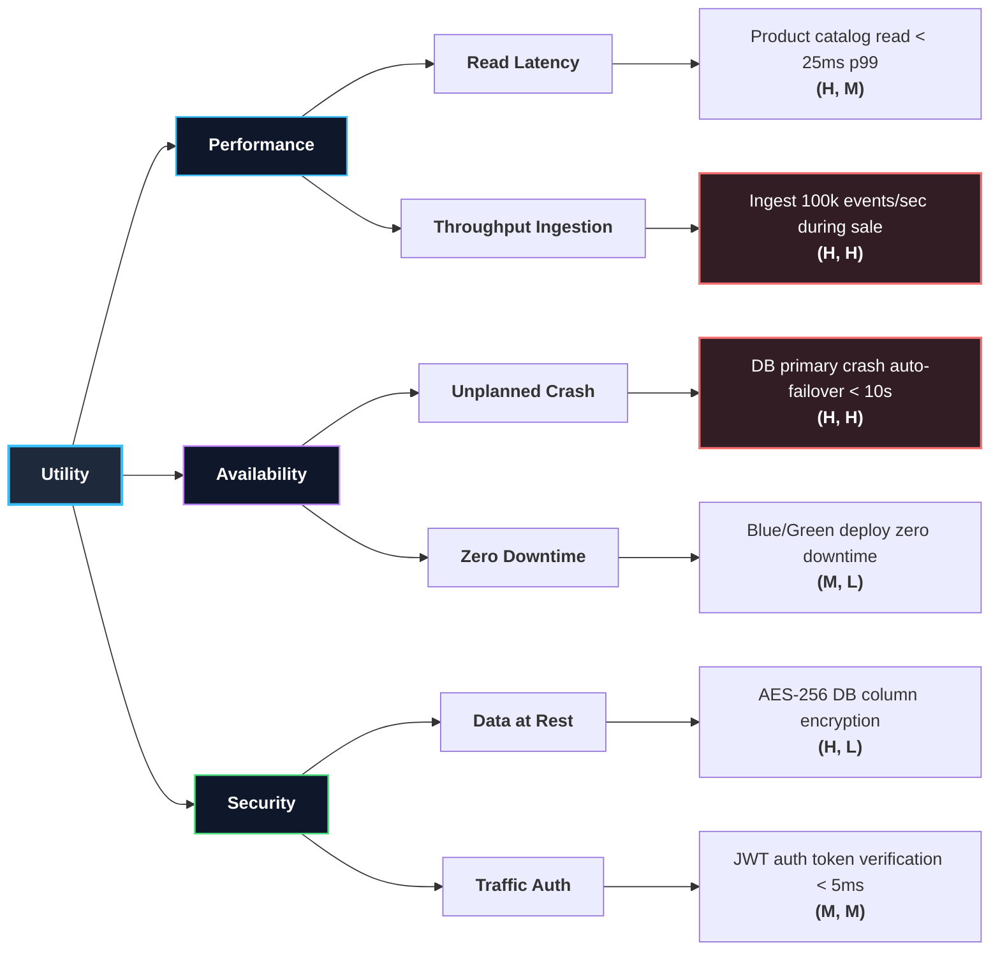

# Lecture 4: Architecture Requirements, Design, and Agile Architecting
**Course:** SEZG651 / SSZG653: Software Architectures (BITS Pilani WILP)  
**Instructor:** Prof. Harvinder S. Jabbal  
**Core Theme:** Bridging Requirements to Production Systems: Eliciting Architecturally Significant Requirements (ASRs) via Utility Trees, applying the 7-Step Attribute-Driven Design (ADD) method, pragmatic documentation (Kruchten 4+1 & C4), and finding the "Sweet Spot" between Agile velocity and architectural discipline via time-boxed Spikes.

---

## 1. Executive Overview & Problem Context

### What is this Lecture About? (The 2-Minute Story)
Open any corporate Jira backlog or Product Requirements Document (PRD), and you will find hundreds of user stories: *"User can filter orders by date,"* *"User can upload profile avatar,"* *"User receives password reset email."*

Here is the secret of senior software engineering: **95% of those user stories have ZERO impact on software architecture.** 
* A developer can build the profile avatar uploader or order date filter in an afternoon using standard web frameworks.
* However, buried inside that backlog are 2 or 3 explosive requirements: *"System must ingest 80,000 sensor telemetry events per second with $< 50 ext{ ms}$ processing latency,"* or *"System must guarantee zero transaction loss during a regional AWS data center blackout."*

These critical requirements are **Architecturally Significant Requirements (ASRs)**. If you fail to identify and design for them upfront, your system will crash on launch day—no matter how clean your UI code is. 

Lecture 4 details the exact engineering framework to:
1. Sift through backlogs to extract and prioritize **ASRs** using **Utility Trees**.
2. Systematically design software structures using the SEI **Attribute-Driven Design (ADD)** method.
3. Document architectures pragmatically for developers, SREs, and executives (**Kruchten 4+1 & C4 Model**).
4. Balance Agile sprint velocity with upfront architectural discipline using **Boehm & Turner's Sweet Spot Model** and time-boxed **Architectural Spikes**.

```
┌──────────────────────────────────────────────────────────────────────────────────┐
│                               The Central Reality                                │
│                                                                                  │
│   Routine User Stories (95%) = Handled by developers inside existing components. │
│   ASRs (5%) = Shape database topology, caching layers, network connectors, and   │
│               cloud infrastructure. ASRs dictate the entire system design!       │
└──────────────────────────────────────────────────────────────────────────────────┘
```

---

### Why Does Architecture Matter to a Software Engineer?

#### 1. The SRS Failure Trap & The "Blame Game"
In enterprise software delivery, projects frequently fail not because developers wrote defective code, but because they faithfully built exactly what was written in the functional System Requirements Specification (SRS), only for the client to reject the system upon production deployment. 
* Standard functional specs state: *"System shall record payments."* They omit: *"System must handle 10,000 payments/sec during flash sales without database deadlock."*
* When the system crashes under production load, the client laments: *"You didn't understand our business,"* while engineering counters: *"We built strictly to the signed contract."* Proactive ASR elicitation eliminates this destructive cycle.

#### 2. The Rework Exponential
* Fixing a localized bug in a sprint costs a few hours of developer time.
* Reworking an architectural flaw distributed across 30 microservices (e.g., synchronous REST deadlocks or unpartitioned relational databases) can bankrupt a project or demand an entire multi-year rewrite.

#### 3. Agile Without Architecture is Chaos at Scale
* While extreme agility (*"start coding immediately, refactor as we go"*) works well for small 10,000-line scripts, it collapses catastrophically on enterprise systems exceeding 100,000 to 1,000,000 lines of code.
* Enterprise agility requires an architectural skeleton to prevent technical debt from choking sprint velocity.

---

### Where Does this Fit in the Course Roadmap?
```
[Lectures 1–3: Architectural Foundations & Qualities]
       │  • Structural Views: Module, C&C, Allocation
       │  • Core Qualities & Tactics: Availability, Performance, Security, Modifiability
       ▼
[Lecture 4: Requirements, Design, & Agile Architecting] (THIS LECTURE)
       │  • Eliciting ASRs (SRS, Interviews, Business Goals) & The Utility Tree
       │  • Attribute-Driven Design (ADD) 7-Step Method
       │  • Pragmatic Documentation: Kruchten's 4+1 Views & Modern C4
       │  • Agile Architecting: Boehm & Turner Sweet Spot Curves & Time-boxed Spikes
       ▼
[Lectures 5–8: ASR Elicitation (QAW/PALM), Layering & Verification] ──► [Midterm EC2: Closed Book]
       ▼
[Lectures 9–16: Patterns, Microservices, Cloud & ATAM] ───────────────► [Comprehensive EC3: Open Book]
```

---

## 2. Core Concepts Explained Simply

---

### Concept 1: Architecturally Significant Requirements (ASRs)

#### 1. What is an ASR?
> **Definition:** An **Architecturally Significant Requirement (ASR)** is any requirement (functional, quality attribute, business goal, or platform constraint) that exerts a profound, shaping influence on the software architecture.

```
┌────────────────────────────────────────────────────────┐
│                   All Requirements                     │
│  ┌──────────────────────────────────────────────────┐  │
│  │ Routine Requirements (95%)                       │  │
│  │ (CRUD logic, form validation, email templates)   │  │
│  │                                                  │  │
│  │ ┌──────────────────────────────────────────────┐ │  │
│  │ │ Architecturally Significant (5% - ASRs)      │ │  │
│  │ │ (100k RPS, multi-region failover, 99.999% SLA│ │  │
│  │ │  data residency, sub-50ms p99 latency)       │ │  │
│  │ └──────────────────────────────────────────────┘ │  │
│  └──────────────────────────────────────────────────┘  │
└────────────────────────────────────────────────────────┘
```

* *Routine Functional Requirement:* *"Allow users to download invoice as PDF."* (Handled locally inside a worker controller; zero impact on global system topology).
* *Architecturally Significant Requirement (ASR):* *"System must ingest 50,000 concurrent streaming metrics per second and guarantee zero data loss during cloud node crashes."* (Forces Kafka event streaming, distributed time-series storage, and replication topology).

#### 2. The Three Primary Sources of ASRs:
1. **Requirements Documents (SRS / PRDs):** Reading between the lines of functional requirements to discover hidden operational constraints.
2. **Stakeholder Interviews:** Uncovering unspoken fears from non-technical stakeholders (e.g., Chief Risk Officer: *"If our customer database leaks, we will face millions in regulatory fines"* $
ightarrow$ forces database column encryption and HSM key management).
3. **Business Goals & ROI:** Strategic drivers (e.g., *"Reduce monthly cloud hosting bill by 40% while cutting time-to-market for new payment partners"* $
ightarrow$ forces multi-tenant serverless or containerized microservices).

---

### Concept 2: The Utility Tree — Prioritizing Architectural Drivers

#### 1. What is a Utility Tree?
> **Definition:** A **Utility Tree** is a structured, hierarchical mechanism used to translate broad, vague business goals and quality expectations into concrete, measurable, and prioritized Quality Attribute Scenarios.

* The tree is drawn **horizontally** (left to right):
  * **Level 1 (Root):** System Utility (overall architectural health and fitness-for-purpose).
  * **Level 2 (Quality Attributes):** Performance, Availability, Security, Modifiability, etc.
  * **Level 3 (Subfactors / Refinements):** Latency, Throughput, Fault Detection, Data Confidentiality.
  * **Level 4 (Leaves / Concrete Scenarios):** Precise 6-part scenarios with quantitative metrics and priority tuples.

```
Utility ──┬── Performance ──┬── Latency ────────────► Scenario 1: Normal API read < 50ms p99 (H, M)
          │                 │
          │                 └── Peak Influx ────────► Scenario 2: Flash sale 100k RPS ingest (H, H)
          │
          ├── Availability ──┬── Node Crash ────────► Scenario 3: K8s Pod auto-heal < 5 sec (H, H)
          │                  │
          │                  └── Scheduled Maint. ──► Scenario 4: Zero-downtime rolling update (M, L)
          │
          └── Security ──────┬── Data at Rest ──────► Scenario 5: AES-256 encrypted RDS volumes (H, L)
                             │
                             └── Rate Limiting ─────► Scenario 6: 429 Throttle after 500 req/min (M, M)
```

#### 2. The Prioritization Matrix: `(Business Importance, Architectural Difficulty)`
Every leaf scenario is assigned a two-dimensional priority tuple:
* **Dimension 1: Importance to Business / Stakeholders** `(High / Medium / Low)`
* **Dimension 2: Difficulty of Implementation / Impact on Architecture** `(High / Medium / Low)`

| Priority Tuple | Meaning | Architectural Action |
| :--- | :--- | :--- |
| **(H, H)** | **High Business Value, High Architectural Impact** | **Top Priority!** These scenarios are the primary architectural drivers. Design patterns and tactics MUST be selected for these first. |
| **(H, M)** | High Business Value, Medium Architectural Impact | Second priority; accommodated within the primary architecture baseline. |
| **(M, H)** | Medium Business Value, High Architectural Impact | **Danger Zone!** High cost for moderate return. Architect must negotiate with stakeholders to simplify requirements. |
| **(L, L)** | Low Business Value, Low Architectural Impact | Deprioritized; handled during routine sprint development or deferred. |

---

### Concept 3: Attribute-Driven Design (ADD) — The SEI 7-Step Method

#### What is it?
Attribute-Driven Design (ADD) is an iterative, recursive decomposition method developed by the SEI. Rather than guessing an architecture on a whiteboard, ADD derives structures systematically by addressing the high-priority (H, H) scenarios from the Utility Tree.

```mermaid
flowchart TD
    S1["<b>Step 1: Review Inputs</b><br/>ASRs, Constraints, Utility Tree Scenarios"] --> S2["<b>Step 2: Choose System Element to Decompose</b><br/>Start with overall system, then drill into subsystems"]
    S2 --> S3["<b>Step 3: Identify Candidate Architectural Drivers</b><br/>Filter high-priority (H, H) scenarios for this element"]
    S3 --> S4["<b>Step 4: Choose Design Concepts (Patterns & Tactics)</b><br/>Select tactics (e.g., Redis Caching, Hot Spares, Microservices)"]
    S4 --> S5["<b>Step 5: Instantiate Elements & Allocate Responsibilities</b><br/>Create concrete modules, services, databases, connectors"]
    S5 --> S6["<b>Step 6: Define Interfaces & Schemas</b><br/>Specify gRPC/REST contracts, data models, error codes"]
    S6 --> S7["<b>Step 7: Verify & Refine Against Drivers</b><br/>Validate design against scenarios; record design decisions"]
    S7 --> DEC{More elements to decompose?}
    DEC -- Yes --> S2
    DEC -- No --> DONE["Architecture Baseline Finalized!"]

    style S1 fill:#0f172a,stroke:#38bdf8,stroke-width:1.5px
    style S2 fill:#0f172a,stroke:#38bdf8,stroke-width:1.5px
    style S3 fill:#0f172a,stroke:#fbbf24,stroke-width:1.5px
    style S4 fill:#0f172a,stroke:#c084fc,stroke-width:1.5px
    style S5 fill:#0f172a,stroke:#4ade80,stroke-width:1.5px
    style S6 fill:#0f172a,stroke:#4ade80,stroke-width:1.5px
    style S7 fill:#0f172a,stroke:#38bdf8,stroke-width:1.5px
    style DONE fill:#112a20,stroke:#4ade80,stroke-width:2px
```



#### Step-by-Step Walkthrough in Real Production Systems:
* **Step 1 (Inputs):** You are building a payment gateway. The top ASR is: *10,000 transactions/sec with 99.999% availability and zero lost records.*
* **Step 2 (Decompose):** System is currently a single black-box container.
* **Step 3 (Drivers):** Focus on the (H, H) high-throughput payment scenario.
* **Step 4 (Patterns & Tactics):** Deploy **Asynchronous Event-Driven Pattern** with **Active Redundancy** and **Persistent Buffering (Kafka)**.
* **Step 5 (Instantiate):** Create 3 elements: `Ingestion API Gateway`, `Kafka In-Memory Partition Cluster`, and `Ledger Persistence Worker`.
* **Step 6 (Interfaces):** Define gRPC Protobuf contracts between Gateway and Kafka producers.
* **Step 7 (Verify):** Trace the payment scenario through the design: Gateway returns `HTTP 202 Accepted` in 12ms once message reaches Kafka quorum; worker handles persistence asynchronously. Requirement met!
* *Repeat* for sub-elements (e.g., decomposing the Ledger Worker).

---

### Concept 4: Pragmatic Architecture Documentation (Kruchten 4+1 & Modern C4)

#### 1. The Two Distinct Audiences:
1. **Developers & SREs:** Need detailed API schemas, thread synchronization boundaries, database isolation levels, and environment configurations.
2. **Business Executives & Clients:** Need high-level assurance that compliance, budget, recovery time (MTTR), and revenue scalability are guaranteed.

#### 2. Kruchten’s 4+1 Views Mapped to Modern Software Engineering:

```mermaid
flowchart TD
    subgraph K41 ["Kruchten's 4+1 Architectural Views"]
        UC["<b>+1 Use Case / Scenarios View</b><br/>Core End-to-End Workflows & ASRs"]

        LV["<b>Logical View</b><br/>(Domain Models, Packages, Hexagonal Ports)"]
        PV["<b>Process View</b><br/>(Threads, Concurrency, gRPC Connectors, IPC)"]
        DV["<b>Development View</b><br/>(Git Monorepo, Maven/Go Modules, CI/CD)"]
        PHY["<b>Physical View</b><br/>(Kubernetes Pods, AWS VPCs, DB Clusters)"]

        UC --> LV & PV & DV & PHY
    end

    style K41 fill:#0f172a,stroke:#38bdf8,stroke-width:1.5px
    style UC fill:#1e293b,stroke:#fbbf24,stroke-width:2px
    style LV fill:#1e293b,stroke:#38bdf8,stroke-width:1.5px
    style PV fill:#1e293b,stroke:#c084fc,stroke-width:1.5px
    style DV fill:#1e293b,stroke:#4ade80,stroke-width:1.5px
    style PHY fill:#1e293b,stroke:#f87171,stroke-width:1.5px
```



* **Logical View:** Object classes, domain entities, interfaces. (Modern: Hexagonal / Clean Architecture domain models).
* **Process View:** Runtime processes, threads, event loops, latency budgets. (Modern: Microservice component graphs, Kafka pipelines).
* **Development View:** Source code organization, package managers, build tooling. (Modern: Git directory structure, Go modules).
* **Physical View:** Hardware servers, cloud virtual networks, container hosts. (Modern: Terraform infrastructure-as-code, Kubernetes YAMLs).
* **+1 Use Case View:** The critical scenarios that tie the four views together.

#### 3. Modern Alternative: The C4 Model (Simon Brown)
In modern agile software teams, Kruchten's 4+1 model is frequently implemented as the **C4 Model** (hierarchical zoom levels):

> 💡 **Tech Quick-Primer (`The C4 Model`):** *Created by engineer Simon Brown, C4 provides a pragmatic way to visualize software architecture using 4 hierarchical zoom levels (like Google Maps): **Context** (system in relation to human users and external partner systems), **Containers** (independently deployable applications, microservices, databases), **Components** (internal modules/controllers inside a container), and **Code** (individual classes/interfaces).*

1. **Context:** System in relation to external users and partner APIs.
2. **Containers:** Deployable applications, databases, and microservices (Docker containers, SPA frontends, SQL databases).
3. **Components:** Group of related classes or modules inside a single container.
4. **Code:** Individual class diagrams or interface implementations (rarely documented; code itself is documentation).

---

### Concept 5: Architecture in an Agile World — Resolving the False Dilemma

#### 1. The Myth vs. The Reality
* **The Agile Myth:** *"We are agile, so we don't need architecture. We just build user stories and refactor as we go."*
* **The Production Reality:** You cannot "refactor" a single-threaded blocking synchronous monolith into an event-driven distributed system in a 2-week sprint without rewriting the entire application.
* Architecture and Agile are **symbiotic**: Architecture provides the stable modular boundaries that allow multiple autonomous agile squads to develop and release software concurrently without blocking each other.

#### 2. The Boehm & Turner "Sweet Spot" Model
How much upfront architectural design should you do? Barry Boehm and Richard Turner proved mathematically that it depends strictly on **project scale (KSLOC - Thousand Lines of Code)**:

```
Total Engineering Cost / Schedule ──►
│
│       \                              /
│        \      Total Project Cost     /
│         \       (Upfront +          /
│          \       Rework)           /
│           \                       /
│   Rework   \     SWEET SPOT      /   Upfront Cost
│   Costs     \   (Optimal Point) /    (BDUF)
│              \       ▼         /
│               \____--*--_____/
│
└────────────────────────────────────────────────────────►
0%               Upfront Architectural Effort            100%
(Pure Hacking)                                        (Pure BDUF)
```

* **For Small Systems (10 KSLOC / MVP):** The sweet spot is far to the left (**~5% upfront effort**). Rework cost is low; rapid prototyping is king.
* **For Medium Systems (100 KSLOC / Standard Enterprise):** The sweet spot sits in the middle (**~15% to 20% upfront effort**).
* **For Large-Scale Systems (1,000 KSLOC / Core Banking, Telecom):** The sweet spot shifts far to the right (**~30% to 40% upfront effort**). Reworking structural mistakes in a million-line system is catastrophic, justifying rigorous upfront architecture.

#### 3. Architectural Spikes (The WebArrow Case Study)
* **What is an Architectural Spike?** A time-boxed prototype (typically 1 to 2 weeks) created within an agile sprint to investigate an architectural risk, evaluate competing frameworks, or prove that an ASR is feasible before committing full sprint capacity.
* **The WebArrow Case Study:**
  * WebArrow needed to stream high-resolution workstation screens across low-bandwidth dial-up connections with strict frame-rate latency.
  * Rather than spending 6 months building the application or writing endless documentation, the team executed a **2-week time-boxed spike**.
  * They built a disposable prototype evaluating proprietary image-compression algorithms and network protocols under simulated packet-drop conditions.
  * The spike proved technical feasibility, validated the latency SLA, and established the core compression tactic before production development began.

---

## 3. Visual Architectural Models

### Diagram 1: The Utility Tree Structure



*Walkthrough:* Top-level Utility decomposes into quality attributes, attribute refinements, and concrete leaf scenarios prioritized by `(Business Value, Architectural Difficulty)`. Red-highlighted `(H, H)` scenarios represent primary architectural drivers.

---

### Diagram 2: C4 Container View for Modern Web Architectures

```mermaid
flowchart TD
    subgraph USER ["Client Layer"]
        SPA["Single Page App<br/>(React / Web Browser)"]
        MOB["Mobile App<br/>(iOS / Android)"]
    end

    subgraph CLOUD ["AWS Cloud Platform Boundary"]
        ALB["AWS Application Load Balancer"]
        API["API Gateway Container<br/>(Envoy Reverse Proxy)"]
        
        SVC_A["Order Microservice<br/>(Go / Docker)"]
        SVC_B["Payment Microservice<br/>(Java Spring / Docker)"]

        REDIS[("Redis Cluster<br/>(Session & Read Cache)")]
        PG[(PostgreSQL Primary)]
        KAFKA[("Apache Kafka<br/>(Event Stream)")]
    end

    SPA & MOB -->|HTTPS / WSS| ALB
    ALB --> API
    API -->|gRPC| SVC_A
    API -->|gRPC| SVC_B

    SVC_A <--> REDIS
    SVC_A --> PG
    SVC_A -->|Publish Event| KAFKA
    KAFKA -->|Consume Event| SVC_B

    style USER fill:#0f172a,stroke:#38bdf8,stroke-width:1.5px
    style CLOUD fill:#0f172a,stroke:#c084fc,stroke-width:1.5px
```



*Walkthrough:* C4 Container diagram showing how client applications interact with cloud-native containers, API gateways, in-memory caches, message streams, and relational persistence.

---

## 4. Key Trade-Offs & Comparisons

### Table 1: Big Design Up Front (BDUF) vs. Agile Emergent Architecture
| Dimension | Big Design Up Front (BDUF) | Agile Emergent Architecture | The Pragmatic Sweet Spot |
| :--- | :--- | :--- | :--- |
| **Mindset** | Design 100% of architecture before writing code. | Write code immediately; design emerges from refactoring. | Design core architectural skeleton (ASRs); iterate features in sprints. |
| **Primary Failure Mode** | Analysis paralysis; building solutions for imaginary requirements. | Technical debt explosion; brittle spaghetti code at scale. | None; balances early proof with rapid delivery. |
| **Documentation** | 500-page static Word documents that become obsolete. | Zero documentation; "the code is the documentation." | Lightweight C4 diagrams, ADRs (Architecture Decision Records) in Git. |
| **When to Use** | Safety-critical systems (space shuttle, pacemaker). | Small MVPs, prototypes, internal scripts ($< 10 ext{ KSLOC}$). | Modern enterprise cloud applications ($> 50 ext{ KSLOC}$). |

---

### Table 2: Local Change vs. Distributed Change (Architectural Blast Radius)
| Attribute | Local Change | Distributed Change |
| :--- | :--- | :--- |
| **Blast Radius** | Confined inside one class or private package. | Ripples across multiple microservices, schemas, or deployment nodes. |
| **Architectural Impact** | **Zero.** Handled during routine sprint development. | **High.** Demands an architectural redesign or migration plan. |
| **Example** | Optimizing an internal tax calculation function. | Switching from synchronous REST to asynchronous Kafka event streams. |
| **Cost** | Low (hours to days; 1 developer). | Extreme (weeks to months; cross-team coordination). |

---

## 5. Professor's Practical Tips & Classroom Advice

*(Synthesized directly from Prof. Harvinder S. Jabbal's lecture discussions)*

### 1. The SRS "Blame Game" Warning
* In enterprise consulting, Prof. Jabbal warned that software vendors frequently lose legal arbitration because they relied on a purely functional SRS.
* A client will happily sign a functional spec, but when the delivered system cannot survive Black Friday traffic, they will refuse payment, claiming: *"Any competent engineer knows an e-commerce store must handle peak traffic."*
* **The Solution:** Always build and get client sign-off on a **Utility Tree with concrete (H, H) scenarios** as an explicit annexure to the commercial contract.

### 2. Architecture Decision Records (ADRs) in Git
* The best architecture documentation is **version-controlled right alongside the source code**.
* Modern engineering teams write lightweight markdown documents called **Architecture Decision Records (ADRs)** stored in `/docs/adr/`.

> 💡 **Tech Quick-Primer (`Architecture Decision Records / ADRs`):** *Short, standardized markdown documents committed directly to your Git repository (e.g., `docs/adr/0003-use-kafka-for-events.md`). Each ADR records the **Context** (problem), **Decision** (what was chosen), and **Consequences** (trade-offs), ensuring future engineers understand why an architecture was built this way without second-guessing decisions.*

* Whenever an architect makes an architectural choice (e.g., *"Why we picked PostgreSQL over MongoDB"*), they record: Context, Considered Options, Decision, and Consequences. This prevents future engineers from reverting critical design choices.

### 3. Open-Book Exam Advice: How to Score on ADD and Utility Trees
* In comprehensive exams, students are frequently given a 1-page business case study and asked to construct a Utility Tree and execute the first 3 steps of Attribute-Driven Design (ADD).
* **Scoring Trap:** If your Utility Tree scenarios do not have concrete numerical Response Measures (e.g., stating *"system must be fast"* instead of *"latency $\le 200 ext{ ms}$ under 5,000 RPS"*), you will lose 50% of your marks immediately.

---

## 6. Exam-Ready Question Bank

### Part A: Short-Answer Questions (2–3 Marks Each)

#### Q1: What is an Architecturally Significant Requirement (ASR)? Give a concrete example.
* **Answer:** An ASR is any requirement (functional, quality attribute, business goal, or constraint) that exerts a profound, shaping influence on software architecture. *Example:* An e-commerce requirement to handle 50,000 checkout transactions per second with zero data loss during regional cloud failures.

#### Q2: What is a Utility Tree, and what are its 4 hierarchical levels?
* **Answer:** A Utility Tree is a hierarchical mechanism to translate business goals into prioritized quality scenarios. Its 4 levels are: (1) Utility (root), (2) Quality Attributes, (3) Quality Attribute Refinements / Subfactors, and (4) Concrete Scenarios (leaves) with `(Importance, Difficulty)` priority tuples.

#### Q3: What is the significance of the `(High, High)` priority tuple in a Utility Tree?
* **Answer:** The `(High, High)` tuple denotes scenarios with High Business Importance and High Architectural Difficulty. These scenarios represent the primary architectural drivers; the architect must select patterns and allocate structures to satisfy these first.

#### Q4: Name Kruchten’s 4+1 Views and identify the target audience for each.
* **Answer:**
  1. *Logical View:* Object classes and domain abstractions (Designers / End Users).
  2. *Process View:* Threads, concurrency, and runtime communications (Integrators / Performance Engineers).
  3. *Development View:* Source code packages, libraries, and build tools (Programmers / Maintainers).
  4. *Physical View:* Hardware nodes, networks, and cloud deployments (DevOps / System Engineers).
  5. *+1 Use Case View:* Validation scenarios unifying the other 4 views (All Stakeholders).

#### Q5: What is an Architectural Spike, and when is it executed?
* **Answer:** An architectural spike is a short, time-boxed exploratory prototype (1–2 weeks) executed during an agile sprint to evaluate a high-risk technical decision, validate an ASR, or test a new technology before committing production development resources.

#### Q6: Explain the Boehm & Turner Sweet Spot model.
* **Answer:** The Boehm & Turner model plots upfront architectural effort against total project cost. For small projects ($10 ext{ KSLOC}$), minimal upfront design (~5%) is optimal; for large enterprise systems ($1,000 ext{ KSLOC}$), substantial upfront architectural design (~30%–40%) is economically necessary to prevent catastrophic rework.

---

### Part B: Analytical & Scenario Questions (5–10 Marks Each)

#### Q1 (Scenario Analysis - Utility Tree & ADD Execution):
**Scenario:** A telemedicine platform allows patients to conduct real-time encrypted video consultations with doctors and access lab reports. The platform must support 10,000 concurrent video sessions with $< 150 ext{ ms}$ packet latency, guarantee HIPAA/data privacy compliance by encrypting patient records at rest and in transit, and allow new diagnostic lab partner integrations without taking the system offline.  
**Task:**
1. Construct a partial Utility Tree with at least 3 concrete scenarios across Performance, Security, and Modifiability, assigning a priority tuple to each. [3 Marks]
2. Execute the first 4 steps of Attribute-Driven Design (ADD) for the top `(H, H)` scenario. [4 Marks]
3. Explain which Kruchten view must be documented to prove HIPAA data compliance to security auditors. [3 Marks]

* **Answer Guidelines & Scoring Points:**
  1. **Utility Tree Scenarios [3 Marks]:**
     * *Performance:* Ingest and stream 10,000 concurrent WebRTC video streams with end-to-end latency $< 150 ext{ ms}$ under normal network load $
ightarrow$ **(H, H)**.
     * *Security:* All patient consultation records and lab reports encrypted using AES-256 at rest and TLS 1.3 in transit with zero key leaks $
ightarrow$ **(H, L)**.
     * *Modifiability:* New external lab API adapter integrated and deployed via configuration with zero gateway downtime $
ightarrow$ **(M, M)**.
  2. **ADD Steps Execution [4 Marks]:**
     * *Step 1 (Inputs):* Top driver is the WebRTC video streaming latency scenario (H, H).
     * *Step 2 (Decompose):* Select the overall Telemedicine System container for decomposition.
     * *Step 3 (Drivers):* Bound latency $\le 150 ext{ ms}$ for 10,000 concurrent sessions.
     * *Step 4 (Design Concepts):* Choose **Peer-to-Peer WebRTC mesh** with centralized **Selective Forwarding Units (SFUs)**, combined with the **Concurrency / Worker Pool tactic** and **UDP-based media transport** to eliminate TCP head-of-line blocking.
       > 💡 **Tech Quick-Primer (`WebRTC & SFU Media Servers`):** *WebRTC is a browser-native standard for real-time audio/video streaming. When group calls exceed 3 people, direct peer-to-peer connections overwhelm device upload bandwidth. A **Selective Forwarding Unit (SFU)** acts as an intelligent media router in the cloud: each participant sends their video once to the SFU, which duplicates and forwards it to everyone else without CPU-heavy video transcoding.*
  3. **Kruchten View for Compliance [3 Marks]:**
     * Document the **Physical / Deployment View** showing isolated Virtual Private Clouds (VPCs), Hardware Security Modules (HSMs) for key storage, and network firewalls, combined with the **Development View** showing encryption wrapper modules.

---

#### Q2 (Methodology Comparison - Agile vs. Architecture):
**"Agile methods and Software Architecture represent contradictory philosophies that cannot coexist in enterprise software engineering."  
Critically analyze this statement. Explain how modern software teams reconcile this tension using Architectural Spikes, the Walking Skeleton, and Architecture Decision Records (ADRs).**

* **Answer Guidelines & Scoring Points:**
  1. **Deconstruct the Myth [2 Marks]:**
     * Agile emphasizes rapid customer feedback and working software over comprehensive documentation.
     * Architecture emphasizes structural integrity, quality attributes, and long-term maintainability.
     * They are complementary: without architecture, agile teams quickly drown in technical debt; without agile, architects produce obsolete ivory-tower designs.
  2. **Reconciliation Mechanism 1: Architectural Spikes [3 Marks]:**
     * Time-boxed research investigations within sprints allow teams to test risky architectural hypotheses (e.g., evaluating Kafka vs. RabbitMQ) with disposable code before committing to a 6-month feature backlog.
  3. **Reconciliation Mechanism 2: The Walking Skeleton [3 Marks]:**
     * Deploying an end-to-end skeleton (UI $
ightarrow$ API Gateway $
ightarrow$ Database) in Sprint 1 connects architectural infrastructure immediately, allowing subsequent sprints to deliver incremental business features on a proven, working foundation.
  4. **Reconciliation Mechanism 3: Architecture Decision Records (ADRs) [2 Marks]:**
     * Lightweight markdown files stored in the Git repository capture design choices, rationale, and consequences asynchronously, providing transparent documentation without heavy bureaucratic overhead.

---

## 7. Quick Revision & 60-Second Exam Recap

### Key Terms Glossary
* **ASR (Architecturally Significant Requirement):** Requirement exerting profound influence on system architecture.
* **Utility Tree:** Hierarchical tree prioritizing quality attribute scenarios by `(Importance, Difficulty)`.
* **Attribute-Driven Design (ADD):** SEI 7-step recursive design method driven by quality scenarios.
* **Kruchten 4+1:** Architectural documentation framework (Logical, Process, Development, Physical, Scenarios).
* **C4 Model:** Modern hierarchical architecture visualization (Context, Containers, Components, Code).
* **Boehm & Turner Sweet Spot:** Model identifying optimal upfront architectural effort based on project scale (KSLOC).
* **Architectural Spike:** Time-boxed sprint investigation to validate high-risk architectural assumptions.
* **Walking Skeleton:** Minimal runnable end-to-end system deployed via CI/CD to prove infrastructure early.
* **ADR (Architecture Decision Record):** Version-controlled markdown file documenting architectural decisions.

---

### The 5 Golden Rules to Remember
1. **Focus on the 5% ASRs:** Don't design architecture for routine CRUD stories; design for the 5% high-impact quality drivers.
2. **(H, H) Scenarios Drive Design:** Always tackle High Business Value, High Architectural Difficulty scenarios first.
3. **No Magic Wands:** Every architectural strategy handles a subset of scenarios; make trade-offs explicit to stakeholders.
4. **Scale Dictates Upfront Effort:** 5% upfront design for a 10k LOC MVP; 30%–40% upfront design for a 1M LOC banking platform.
5. **Write for the Reader:** Document views tailored for specific stakeholders with clear notations and legends.

---

### 60-Second Rapid Fire Q&A
* *Q: What does ADD stand for?*  
  $\rightarrow$ Attribute-Driven Design.
* *Q: What are the two dimensions of a Utility Tree priority tuple?*  
  $\rightarrow$ Business Importance and Architectural Difficulty.
* *Q: Which priority tuple represents the primary architectural drivers?*  
  $\rightarrow$ `(High, High)`.
* *Q: What view in Kruchten's 4+1 model maps processes to hardware?*  
  $\rightarrow$ The Physical View (Deployment View).
* *Q: What is the optimal upfront effort for a 10 KSLOC project?*  
  $\rightarrow$ ~5% upfront effort.
* *Q: What does C4 stand for in Simon Brown's model?*  
  $\rightarrow$ Context, Containers, Components, Code.
