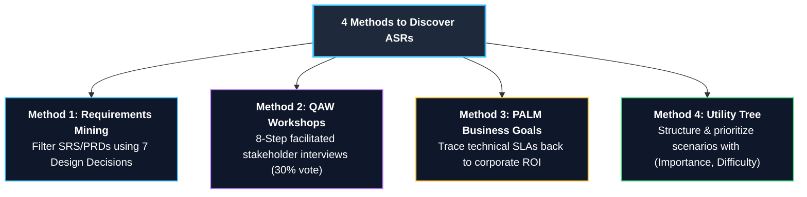

# Lecture 5: Architecturally Significant Requirements (ASRs) – Elicitation, Prioritization, and Agile Architecting
**Course:** SEZG651 / SSZG653: Software Architectures (BITS Pilani WILP)  
**Instructor:** Prof. Harvinder S. Jabbal  
**Core Theme / Focus Area:** Systematic Elicitation, Analysis, and Prioritization of Architecturally Significant Requirements (ASRs) using four core industry methods: Requirements Document Mining, Quality Attribute Workshops (QAW), Business Goals & PALM (Pedigreed Attribute eLicitation Method), and Utility Trees; balancing upfront architectural discipline with Agile development via the Boehm & Turner "Sweet Spot" model.

---

## 1. Executive Overview & Problem Context

### What is this Lecture About? (The 2-Minute Story)
Every software engineer has seen a sprint backlog packed with 400 user stories: form validation, profile editing, dropdown filters, and export-to-CSV buttons.

Here is the central dilemma of software engineering: **If an architect treats all 400 requirements equally, the project will fail.**
* Why? Because in typical enterprise software, **only 40% of implemented features are ever routinely used** by customers.
* More importantly, 95% of those user stories are standard CRUD logic that has zero impact on how your system is partitioned, scaled, or deployed.
* The success or failure of your system is determined entirely by the remaining **5% critical requirements**: the **Architecturally Significant Requirements (ASRs)**.

Lecture 5 (Module 3 - CS05) provides the battle-tested playbook used by enterprise software architects to:
1. Identify and probe the requirements that truly dictate architectural topology.
2. Mine unstated technical constraints using the **7 Architectural Design Decision Categories**.
3. Run collaborative **Quality Attribute Workshops (QAW)** to align Product Managers, Security Engineers, SREs, and business leadership.
4. Trace arbitrary technical numbers (*"Why 40ms latency and not 100ms?"*) back to hard corporate revenue goals using **PALM (Pedigreed Attribute eLicitation Method)**.
5. Structure and prioritize architectural drivers into a formal **Utility Tree**.
6. Master the semester **Assignment 1 & 2** case study requirements.

```
┌──────────────────────────────────────────────────────────────────────────────────┐
│                               The Central Reality                                │
│                                                                                  │
│   Routine Stories (95%) = Standard CRUD, business logic, and UI screens.        │
│   ASRs (5%) = Shape database partitioning, caching tiers, network protocols,     │
│               failure domains, and cloud deployment. ASRs dictate the system!     │
└──────────────────────────────────────────────────────────────────────────────────┘
```

---

### Why Does Architecture Matter to a Software Engineer?

#### 1. The SRS "Blame Game" in Commercial Software
Software projects routinely fail not because engineers wrote buggy code, but because they built exactly what was written in the functional specification, only for the client to reject the system in production.
* Functional specs state: *"System shall approve loans."* They omit: *"System must complete risk scoring in $< 200 ext{ ms}$ under 5,000 concurrent requests without database deadlocks."*
* When the system freezes on launch day, the client laments: *"You didn't understand our scale,"* while engineering replies: *"We delivered strictly to the contract."* Proactive ASR elicitation breaks this deadlock.

#### 2. Technical Debt as "High-Interest Credit Card Debt"
Prof. Jabbal reminds engineers that taking architectural shortcuts to meet artificial sprint deadlines creates technical debt.
* Much like taking a high-interest payday loan, cutting architectural corners (e.g., hardcoding database queries directly into UI controllers) mortgages your project's future.
* Industry studies show that **80% to 90% of technical debt is never repaid**. Over time, technical debt triggers catastrophic outages, security vulnerabilities, and eventual architectural bankruptcy.

> 💡 **Tech Quick-Primer (`SonarQube & Technical Debt Metrics`):** *SonarQube is an automated code quality and security scanning tool integrated into CI/CD pipelines. It scans source code for "code smells," cyclomatic complexity, security vulnerabilities, and circular dependencies, computing an objective "Technical Debt Ratio" (estimated hours required to fix architectural shortcuts).*

#### 3. Real-World Enterprise Audits & Banking Compliance
In enterprise systems (connecting to banking APIs like HDFC, HSBC, or Visa/Mastercard), regulatory bodies mandate strict data isolation, PCI-DSS compliance, and immutable audit logging. Architecture must bake in security and compliance from Day 1.

---

### Course Roadmap & Context
```
[Lectures 1–3: Architectural Foundations & Qualities]
       │  • Structural Views: Module, C&C, Allocation
       │  • Core Qualities & Tactics: Availability, Performance, Security, Modifiability
       ▼
[Lecture 4: Architecture Requirements, ADD & Documentation]
       │  • Attribute-Driven Design (ADD) 7-Step Method
       │  • Pragmatic Documentation Packages (Kruchten 4+1 & C4)
       ▼
[Lecture 5: CS05 – Architecturally Significant Requirements (ASRs)] (THIS LECTURE)
       │  • Anatomy & Indicators of ASRs; The 40% Feature Usage Rule
       │  • Method 1: Requirements Documents & 7 Design Decision Categories
       │  • Method 2: Stakeholder Interviews via QAW (8 Steps & 30% Voting Rule)
       │  • Method 3: Business Goals via PALM (7 Steps & Pedigree Concept)
       │  • Method 4: Utility Tree Construction & Nightingale Hospital Case Study
       │  • Agile Architecting: Boehm & Turner Sweet Spot Curves (10k, 100k, 1M LOC)
       │  • Practical Briefing: Semester Assignment 1 & 2 Execution
       ▼
[Lectures 6–8: Layering, Conformance & Verification] ──► [Midterm EC2: Closed Book]
       ▼
[Lectures 9–16: Advanced Patterns, Microservices & Cloud] ─► [Comprehensive EC3: Open Book]
```

---

## 2. Core Concepts Explained Simply

---

### Concept 1: What is an Architecturally Significant Requirement (ASR)?

#### 1. Simple & Formal Definitions
> **Simple Definition:** An ASR is any requirement that forces you to make a fundamental structural decision about how your software is partitioned, connected, scaled, or secured. If removing this requirement would let you delete major subsystems or change your database engine, it is an ASR.

> **Formal Definition (SEI):** An **Architecturally Significant Requirement (ASR)** is a requirement (functional, quality attribute, business goal, or technical constraint) that has a measurable, profound effect on the architecture of a computer system. In the absence of such a requirement, the architecture would be fundamentally different.

```
┌────────────────────────────────────────────────────────────┐
│                   ALL SYSTEM REQUIREMENTS                  │
│                                                            │
│   Routine Functional Requirements (CRUD, UI Labels, etc.)  │
│   ┌────────────────────────────────────────────────────┐   │
│   │   Architecturally Significant Requirements (ASRs)   │   │
│   │   • High business value & high technical risk      │   │
│   │   • Stringent SLAs / Quality Scenarios             │   │
│   │   • Strict legal / regulatory compliance           │   │
│   │   • Cross-cutting architectural drivers            │   │
│   └────────────────────────────────────────────────────┘   │
└────────────────────────────────────────────────────────────┘
```

#### 2. Key Indicators of Architectural Significance:
1. **High Business Value and/or Technical Risk:** Requirements tied directly to revenue generation or high operational failure risk.
2. **Key Stakeholder with Influence:** Mandates from Executive Leadership, Chief Risk Officers, or statutory regulators.
3. **Structurally Unique:** No existing framework or component in the company handles this requirement; custom architectural design is required.
4. **Deviating Quality of Service (QoS):** Transactions requiring performance far beyond baseline (e.g., standard API calls take 1s, but this fraud check must execute in $< 40 ext{ ms}$).
5. **Historical Precedent of Failure:** Areas where past company projects failed, suffered budget overruns, or experienced production outages (e.g., distributed caching, legacy data migration).

---

### Concept 2: Routine Functional Requirements vs. ASRs

#### 1. The Fallacy of Functional Equivalence
Software teams often treat all user stories as equal. In reality, functional simplicity frequently masks deep architectural complexity:

* **Simple Functional Requirements:**
  * *"Allow users to create an order."*
  * *"Allow users to update their profile picture."*
  * *Architectural Impact:* Negligible. Standard CRUD operations handled by a local controller and an ORM.
* **Challenging Architecturally Significant Requirements (ASRs):**
  * *"Detect payment fraud in real-time and block transactions within 100ms."* (Forces in-memory stream processing, Redis feature stores, and asynchronous audit trails).
  * *"Maintain 99.999% availability during cloud data center outages."* (Forces multi-region active-active clusters, distributed consensus protocols, and automated DNS failover).
  * *"Support 20 million concurrent video streams during a global live event without buffering."* (Forces edge CDN caching, adaptive bitrate video slicing, and non-blocking I/O architectures).

#### 2. The 40% Feature Usage Reality:
* Empirical research (Standish Group) demonstrates that in enterprise software, **only 40% of implemented features are regularly used**.
* An architect must categorize requirements into:
  * **Critical:** Must be engineered into the architectural foundation immediately (ASRs).
  * **Important:** Accommodated through clean, modular interfaces.
  * **Useful:** Can be deferred, simplified, or built via third-party SaaS libraries.

---

### Concept 3: Probing ASRs — The Art of Architectural Interrogation

Architects never accept client requirements at face value. When a stakeholder specifies a requirement, the architect must probe deeply to reveal hidden trade-offs:

```
                      ┌───────────────────────────┐
                      │ Stated Requirement:       │
                      │ "Maintain an Audit Trail" │
                      └─────────────┬─────────────┘
                                     │
                        (Architectural Interrogation)
                                     ▼
        ┌────────────────────────────┴────────────────────────────┐
        ▼                                                         ▼
Option A: Append-Only Object Store (S3)                 Option B: Indexed Search Store (ES)
• High write throughput, minimal cost                   • Real-time interactive querying
• Cannot execute ad-hoc SQL queries                     • High RAM & cluster indexing cost
• Ideal for: Passive legal compliance                   • Ideal for: Live fraud analysis
```

#### Real-World Probing Scenarios:
1. **Audit Trail:**
   * *Probe:* Is this log stored purely for annual regulatory compliance, or will data analysts query it in real time?
   * *Architectural Decision:* Passive compliance uses append-only AWS S3 object storage with Glacier lifecycle rules (cheap, scalable). Real-time analysis requires an indexed ClickHouse or Elasticsearch cluster (expensive, fast).

> 💡 **Tech Quick-Primer (`ClickHouse vs. AWS S3 Glacier`):** *ClickHouse is an ultra-fast columnar analytical (OLAP) database optimized for running SQL queries across billions of rows in milliseconds (ideal for live fraud detection and analytics). AWS S3 Glacier is an ultra-low-cost, cold cloud archive where retrieval takes minutes to hours (ideal for multi-year regulatory tax compliance logs that are rarely read).*
2. **Alerts & Notifications:**
   * *Probe:* Is this a fire-and-forget push notification, or is guaranteed end-to-end receipt acknowledgment required?
   * *Architectural Decision:* Fire-and-forget uses lightweight Firebase/APNs messaging. Guaranteed delivery requires Kafka transactional messaging with dead-letter queues (DLQs) and retry workers.
3. **Third-Party Partner APIs:**
   * *Probe:* What happens if the third-party payment partner experiences a 5-second latency spike or complete outage?
   * *Architectural Decision:* Direct synchronous HTTP calls will saturate thread pools and crash internal services. Deploy an **API Gateway with Circuit Breakers (Envoy / Resilience4j)** and asynchronous webhook queues.

> 💡 **Tech Quick-Primer (`Resilience4j & Circuit Breaker Pattern`):** *Resilience4j is a lightweight fault-tolerance library. When a downstream microservice or partner API begins timing out or returning errors, the **Circuit Breaker trips open**, immediately failing subsequent requests or returning fallback responses without waiting for network timeouts. This prevents server thread starvation and cascading system crashes.*

---

### Concept 4: Method 1 — Discovering ASRs from Requirements Documents & Design Decisions

Requirements documents (PRDs, user stories) are the starting point, but they over-index on functional workflows. The architect uses the **7 Architectural Design Decision Categories** as a diagnostic lens to extract unstated ASRs:

| # | Design Decision Category | What the Architect Looks For | Architectural Implication |
| :--- | :--- | :--- | :--- |
| **1** | **Allocation of Responsibilities** | Planned evolution of services, user roles, major workflows. | Defines microservice boundaries, separation of concerns. |
| **2** | **Coordination Model** | Synchronous vs. asynchronous, stateful sessions vs. stateless tokens. | RPC vs. Event-driven streams (Kafka), REST vs. gRPC. |
| **3** | **Data Model** | Entity relationships, access frequency, consistency needs. | Relational SQL vs. NoSQL document vs. Redis cache. |
| **4** | **Management of Resources** | Concurrency, memory footprints, queue bounds, thread limits. | Thread pool sizing, backpressure, rate-limiting rules. |
| **5** | **Mapping among Elements** | Process-to-hardware mapping, cloud topology, deployment models. | Docker containers, Kubernetes Pods, AWS Multi-AZ mapping. |
| **6** | **Binding Time Decisions** | Configuration flexibility, dynamic pricing rules, white-labeling. | Compile-time constants vs. runtime `.env` / database flags. |
| **7** | **Choice of Technology** | Enterprise standards, existing cloud stack, team skill sets. | Framework choices, database versions, open-source licenses. |

---

### Concept 5: Method 2 — Interviewing Stakeholders via Quality Attribute Workshops (QAW)

#### 1. What is a QAW?
> **Definition:** A **Quality Attribute Workshop (QAW)** is an 8-step structured, facilitated method developed by the SEI to elicit, discover, and prioritize a system's quality attribute scenarios before architecture design begins.

#### 2. Why Bring Stakeholders Together?
In tech companies, stakeholders operate in departmental silos:
* *Product Managers* want rapid feature delivery.
* *Security Officers (SecOps)* want strict MFA, encryption, and zero-trust policies.
* *DevOps/SREs* want automated deployments and minimal cloud resource footprints.
* *End Users* want instant responsiveness.

When stakeholders meet in a facilitated QAW, **public dialogue dispels private agendas**. A Product Manager who hears the SecOps officer explain regulatory compliance fines immediately understands why certain architectural compromises cannot be made.

```mermaid
flowchart TD
    S1["<b>Step 1: Presentation & Introductions</b><br/>Facilitators outline process; stakeholders introduce roles"] --> S2["<b>Step 2: Business Mission Presentation</b><br/>VP/PM presents vision, revenue targets, constraints"]
    S2 --> S3["<b>Step 3: Architectural Plan Presentation</b><br/>Lead Architect presents current technical baseline"]
    S3 --> S4["<b>Step 4: Identification of Architectural Drivers</b><br/>Consolidate key drivers into consensus list"]
    S4 --> S5["<b>Step 5: Scenario Brainstorming</b><br/>Stakeholders draft 6-part quality scenarios"]
    S5 --> S6["<b>Step 6: Scenario Consolidation</b><br/>Merge overlapping scenarios with author approval"]
    S6 --> S7["<b>Step 7: Scenario Prioritization (30% Voting Rule)</b><br/>Each stakeholder gets votes = 30% of scenario count"]
    S7 --> S8["<b>Step 8: Scenario Refinement</b><br/>Detail top-voted scenarios with quantitative metrics"]

    style S1 fill:#0f172a,stroke:#38bdf8,stroke-width:1.5px
    style S2 fill:#0f172a,stroke:#38bdf8,stroke-width:1.5px
    style S3 fill:#0f172a,stroke:#38bdf8,stroke-width:1.5px
    style S4 fill:#0f172a,stroke:#fbbf24,stroke-width:1.5px
    style S5 fill:#0f172a,stroke:#c084fc,stroke-width:1.5px
    style S6 fill:#0f172a,stroke:#c084fc,stroke-width:1.5px
    style S7 fill:#331d24,stroke:#f87171,stroke-width:2px
    style S8 fill:#112a20,stroke:#4ade80,stroke-width:2px
```



#### 3. The 30% Voting Rule (Preventing Endless Arguing):
* In Step 7, each stakeholder receives a number of votes equal to **30% of the total number of consolidated scenarios**.
* *Example:* If 20 consolidated scenarios exist, each participant gets `20 * 0.30 = 6` votes.
* Participants allocate votes across the scenarios they value most. Scenarios with the highest vote tallies automatically become the primary architectural drivers.

---

### Concept 6: Method 3 — Capturing Business Goals via PALM

#### 1. What is PALM?
> **Definition:** The **Pedigreed Attribute eLicitation Method (PALM)** is a 7-step interview process that bridges executive business missions directly to architectural quality attributes, establishing a clear **"pedigree"** (traceable justification) for every technical requirement.

#### 2. The Pedigree Concept: Answering the "Why?"
Junior engineers often pull arbitrary numbers out of thin air: *"Our API must respond in 35ms."* 
* A senior architect asks: *"Why 35ms and not 50ms?"*
* If you cannot trace that 35ms SLA to a business goal (e.g., *"Amazon discovered that every 100ms of latency costs 1% in sales"*), that requirement lacks **pedigree**.
* PALM guarantees that every architectural SLA has a clear commercial justification.

```mermaid
flowchart LR
    BM["<b>Business Mission:</b><br/>Capture 25% of instant checkout market"] --> BG["<b>Business Goal:</b><br/>Zero cart abandonment during checkout"]
    BG --> ASR["<b>Architectural ASR:</b><br/>Payment validation < 150ms p99 SLA"]
    ASR --> TACTIC["<b>Architectural Tactic:</b><br/>In-memory Redis Cache + Async Kafka"]

    style BM fill:#0f172a,stroke:#38bdf8,stroke-width:1.5px
    style BG fill:#0f172a,stroke:#fbbf24,stroke-width:1.5px
    style ASR fill:#0f172a,stroke:#c084fc,stroke-width:1.5px
    style TACTIC fill:#112a20,stroke:#4ade80,stroke-width:1.5px
```



---

### Concept 7: Method 4 — Structuring & Prioritizing via Utility Trees

#### The Nightingale Hospital Case Study (Slide 30):
A regional hospital management system must manage Electronic Medical Records (EMR), emergency triage, and prescription telemetry.

```
Utility ──┬── Performance ──┬── Triage Latency ─────► Emergency patient vitals ingested < 50ms (H, H)
          │                 │
          │                 └── Report Search ──────► Radiologist scans search rendered < 1.5s (H, M)
          │
          ├── Availability ──┬── Power Loss ────────► Local edge backup operational < 2 sec (H, H)
          │                  │
          │                  └── Routine Update ────► Zero clinical downtime rolling updates (M, L)
          │
          └── Security ──────┬── HIPAA Privacy ─────► Patient records encrypted with AES-256 (H, L)
                             │
                             └── Tamper Audit ──────► Append-only immutable prescription audit log (H, M)
```

* **Prioritizing the Architecture:** The architect immediately focuses on the **(H, H)** scenarios:
  1. *Emergency Vitals Ingestion:* Demands an in-memory edge streaming pipeline.
  2. *Power Loss Failover:* Demands local edge server redundancy with automated failover.

---

### Concept 8: Semester Assignment 1 & 2 Blueprint

Prof. Jabbal provided a detailed briefing on the semester case study assignments:

1. **Assignment 1 Scope:**
   * Select a real-world system from your workplace (e.g., banking gateway, e-commerce dispatch, hospital EMR).
   * Construct a complete **Utility Tree** covering at least 4 quality attributes with concrete 6-part leaf scenarios.
   * Identify the top 5 architectural tactics required to satisfy the (H, H) drivers.
2. **Assignment 2 Scope:**
   * Create 4 architectural diagrams for your system:
     * 1 Module View (Decomposition or Layered).
     * 1 Component-and-Connector View (Service or Concurrency).
     * 1 Allocation View (Cloud Deployment / Kubernetes mapping).
     * 1 Quality Attribute Scenario sequence/collaboration diagram.
   * Include a comprehensive **notation legend and glossary** defining all symbols.

---

## 3. Visual Architectural Models

### Diagram 1: The 4 Methods for Discovering ASRs



---

### Diagram 2: PALM 7-Step Workflow


---

## 4. Key Trade-Offs & Comparisons

### Table 1: QAW vs. PALM vs. Utility Tree
| Dimension | Quality Attribute Workshop (QAW) | PALM Method | Utility Tree |
| :--- | :--- | :--- | :--- |
| **Primary Focus** | Broad stakeholder consensus on quality drivers. | Tracing technical SLAs back to business ROI. | Structuring and prioritizing scenarios for design. |
| **Participants** | Cross-functional (PM, SRE, SecOps, Users, Devs). | Executive leaders, Product VPs, Lead Architects. | Software Architects and Technical Leads. |
| **Output** | Prioritized list of consolidated scenarios. | Pedigreed business goals mapped to quality targets. | Hierarchical tree with `(Importance, Difficulty)` leaves. |
| **When to Use** | Project inception when stakeholder views conflict. | When justifying high architectural investment to execs. | Prior to executing Attribute-Driven Design (ADD). |

---

### Table 2: The 40% Feature Rule vs. ASR Focus
| Dimension | Feature-Driven Development | Architecture-Centric Engineering |
| :--- | :--- | :--- |
| **Scope** | Build all 100% of user stories with equal priority. | Focus upfront on the 5% ASRs that dictate architecture. |
| **Outcome** | Gold-plated trivial features; system collapses under load. | Robust, scalable core foundation; features iterated rapidly. |
| **Technical Debt** | High; structural flaws discovered in production. | Controlled; modular boundaries protect sprint velocity. |

---

## 5. Professor's Practical Tips & Classroom Advice

*(Synthesized directly from Prof. Harvinder S. Jabbal's lecture discussions)*

### 1. The 30% Voting Rule: Stopping Endless Meetings
* In stakeholder workshops, attendees will argue for hours over whose requirement is more important.
* **The Rule:** Apply the **30% Voting Rule**. Calculate `0.30 * N` where $N$ is the number of scenarios. Give each participant that exact number of voting stickers. Once voting concludes, count the stickers. The numbers decide the architectural drivers objectively.

### 2. Pedigree: Never Defend an SLA Without a Business Reason
* If you tell executive sponsors *"We need $500,000 for a multi-region Kafka cluster to get 20ms latency,"* they will reject the budget.
* If you present the **PALM pedigree**: *"Our competitors deliver checkout in 200ms; reducing our latency to 20ms increases customer conversion by 3.2%, generating $4.5M in additional annual revenue,"* your architectural budget is approved immediately.

### 3. Exam Advice: Concrete Numbers in Utility Trees
* When constructing Utility Trees in exams, **never write vague leaves** like *"system should be fast"* or *"database should be secure."*
* Every leaf scenario must include an explicit quantitative metric (e.g., `p99 latency < 150ms under 10k RPS` or `auto-failover in < 10s`) and a clear priority tuple like `(H, H)`.

---

## 6. Exam-Ready Question Bank

### Part A: Short-Answer Questions (2–3 Marks Each)

#### Q1: What is an Architecturally Significant Requirement (ASR)?
* **Answer:** An ASR is any requirement (functional, quality attribute, business goal, or constraint) that has a measurable, profound effect on the architecture of a software system.

#### Q2: List four indicators that a requirement is architecturally significant.
* **Answer:** (1) High business value and high technical risk, (2) Demand by key executive/regulatory stakeholders, (3) Structurally unique requirement requiring custom design, (4) Stringent or deviating Quality of Service (QoS) SLAs.

#### Q3: What is the 30% Voting Rule in a Quality Attribute Workshop (QAW)?
* **Answer:** In Step 7 of a QAW, each stakeholder is allocated a number of votes equal to 30% of the total number of consolidated scenarios. Stakeholders distribute these votes across scenarios, and the highest-voted scenarios become the primary architectural drivers.

#### Q4: Explain the concept of "Pedigree" in the PALM method.
* **Answer:** Pedigree refers to the explicit, traceable business justification linking an architectural quality SLA (e.g., 50ms latency) back to a corporate business goal, revenue target, or compliance mandate.

#### Q5: What is the significance of the 40% feature usage rule for software architects?
* **Answer:** Research shows only 40% of software features are regularly used. Architects must not waste resources over-engineering all features equally, but focus upfront on the 5% ASRs that govern system scalability, availability, and security.

#### Q6: Name the four hierarchical levels of a Utility Tree.
* **Answer:** (1) Utility (root), (2) Quality Attributes, (3) Quality Attribute Refinements / Subfactors, and (4) Concrete Scenarios (leaves) with `(Importance, Difficulty)` tuples.

---

### Part B: Analytical & Scenario Questions (5–10 Marks Each)

#### Q1 (Scenario Analysis - QAW & Utility Tree Execution):
**Scenario:** A digital payments startup is preparing for a nationwide launch. The platform must process 20,000 transactions per second during peak hours, guarantee 99.999% availability with zero data loss during cloud zone blackouts, comply with national data localization laws, and support continuous feature releases every 2 weeks.  
**Task:**
1. Formulate two `(High, High)` ASR scenarios for this platform. [3 Marks]
2. Construct a partial Utility Tree containing these scenarios. [3 Marks]
3. Explain how the architect applies the QAW 8-step process to achieve consensus among Marketing, SRE, and Security teams. [4 Marks]

* **Answer Guidelines & Scoring Points:**
  1. **Two (H, H) ASR Scenarios [3 Marks]:**
     * *Performance:* Ingest and authorize 20,000 transactions/sec during peak evening traffic with p99 latency $\le 100 ext{ ms}$ $
ightarrow$ **(H, H)**.
     * *Availability:* Primary cloud availability zone suffers unannounced total power loss; secondary zone takes over active processing with zero lost transaction data in $< 15 ext{ seconds}$ $
ightarrow$ **(H, H)**.
  2. **Utility Tree Structure [3 Marks]:**
     * Root: Utility $
ightarrow$ Performance (Throughput) and Availability (Disaster Recovery) $
ightarrow$ Leaf Scenarios with quantitative metrics and `(H, H)` tuples.
  3. **QAW Consensus Execution [4 Marks]:**
     * The architect conducts an 8-step QAW. In Step 2, business sponsors present transaction growth projections. In Step 3, the architect presents current single-region limits.
     * In Step 5, Marketing submits feature velocity scenarios, SRE submits zone failover scenarios, and Security submits data localization scenarios.
     * In Step 7, applying the 30% voting rule forces stakeholders to pool votes on the existential risks (zone failover and 20k TPS throughput), aligning all parties around the true architectural drivers.

---

#### Q2 (Methodology Comparison - Business Goals to Architecture):
**"A software architect who cannot defend technical decisions in commercial business terms will fail to secure executive sponsorship."  
Explain how the PALM method bridges executive business goals to architectural tactics. Detail the 7 steps of PALM and explain how PALM prevents arbitrary SLA engineering.**

* **Answer Guidelines & Scoring Points:**
  1. **The Business-Architecture Gap [2 Marks]:**
     * Executives speak in revenue, market share, and compliance; developers speak in thread pools, caches, and latency.
     * When architectural proposals lack commercial justification, executives view them as unnecessary engineering gold-plating.
  2. **The 7 Steps of PALM [4 Marks]:**
     * *Step 1:* Review business drivers.
     * *Step 2:* PALM overview presentation to leadership.
     * *Step 3:* Elicit explicit business goals (e.g., grow market share by 20%).
     * *Step 4:* Prioritize business goals with executive sponsors.
     * *Step 5:* Generate architectural quality attributes supporting top goals.
     * *Step 6:* Formalize into 6-part concrete scenarios.
     * *Step 7:* Document pedigree linking each SLA to its business goal.
  3. **Preventing Arbitrary SLA Engineering [4 Marks]:**
     * Without PALM, engineers guess SLAs (e.g., claiming 10ms is needed when 200ms suffices), inflating cloud infrastructure costs by millions.
     * PALM forces engineers to ask: *"What business disaster occurs if latency is 100ms instead of 10ms?"* If no business impact exists, the requirement is relaxed, saving significant development and operational capital.

---

## 7. Quick Revision & 60-Second Exam Recap

### Key Terms Glossary
* **ASR (Architecturally Significant Requirement):** Requirement exerting profound influence on software architecture.
* **40% Feature Rule:** Only 40% of software features are routinely used; architects must prioritize the 5% ASRs.
* **QAW (Quality Attribute Workshop):** 8-step facilitated stakeholder method to discover and prioritize quality drivers.
* **30% Voting Rule:** Allocating votes equal to 30% of scenario count to prioritize scenarios objectively.
* **PALM (Pedigreed Attribute eLicitation Method):** 7-step method connecting business missions to architectural SLAs.
* **Pedigree:** Traceable commercial justification linking an architectural SLA to a business goal.
* **Utility Tree:** Hierarchical tree mapping utility to prioritized scenarios via `(Importance, Difficulty)`.
* **Technical Debt:** Cost of future emergency rework caused by taking architectural shortcuts today.

---

### The 5 Golden Rules to Remember
1. **Focus on the 5% ASRs:** Don't design architecture for routine CRUD; design for the high-impact quality drivers.
2. **Every SLA Needs a Pedigree:** Never specify a latency or availability target without a traceable business justification.
3. **Use the 30% Rule in Workshops:** Stop endless stakeholder debates by capping votes at 30% of total scenarios.
4. **Probe Beyond the SRS:** What isn't written in the functional spec (concurrency, failover, compliance) is what destroys systems.
5. **Technical Debt Must Be Paid:** 80% to 90% of architectural debt is never repaid; pay it down early with architectural discipline.

---

### 60-Second Rapid Fire Q&A
* *Q: What does QAW stand for?*  
  $\rightarrow$ Quality Attribute Workshop.
* *Q: What does PALM stand for?*  
  $\rightarrow$ Pedigreed Attribute eLicitation Method.
* *Q: How many steps are in a QAW?*  
  $\rightarrow$ 8 steps.
* *Q: What is the 30% voting rule?*  
  $\rightarrow$ Each stakeholder receives votes equal to 30% of the total scenario count.
* *Q: What are the two dimensions in a Utility Tree priority tuple?*  
  $\rightarrow$ Business Importance and Architectural Difficulty.
* *Q: What percentage of software features are regularly used?*  
  $\rightarrow$ Only 40%.
