# Lecture 5: Architecturally Significant Requirements (ASRs)
**Course:** SEZG651 / SSZG653: Software Architectures (BITS Pilani WILP)  
**Instructor:** Prof. Harvinder S. Jabbal  
**Core Theme:** Eliciting, prioritizing, and validating Architecturally Significant Requirements (ASRs) using Requirements Mining, Quality Attribute Workshops (QAW), Business Goals (PALM), and Utility Trees.

---

## 1. The Big Picture (Why Should I Care?)

- **What is this lecture about?**  
  Every software team has a backlog filled with hundreds of user stories. But industry studies show that **only 40% of implemented features are regularly used**, and **95% of user stories have zero impact on architecture**. A developer can build a form filter or profile screen in a few hours. The success or failure of your system depends entirely on identifying the **5% of requirements that truly shape architecture: the Architecturally Significant Requirements (ASRs)**.
- **The Real-World Problem:**  
  Clients and product managers rarely write down architectural requirements. They write: *"System shall book tickets."* They don't write: *"System must handle 20,000 ticket requests per second at 10:00 AM without crashing."* If you only build what is written in the functional specification, your system will collapse on Day 1.
- **Where this fits in the course:**  
  In Lecture 4, we learned how Attribute-Driven Design (ADD) uses ASRs to design architectures. Lecture 5 teaches **how to actually discover and elicit those ASRs** from stakeholders and business goals using proven industry frameworks (QAW and PALM).

---

## 2. Core Concepts Explained Simply

### Concept 1: What is an ASR & How to Spot One?

#### Plain-English Definition
An **Architecturally Significant Requirement (ASR)** is any requirement that forces you to make a fundamental structural decision (such as picking a database engine, introducing message queues, or setting up multi-region replication).

#### The 4 Core Indicators of an ASR:
1. **High Business Value & High Technical Risk:** If getting this wrong causes millions in lost revenue or brand damage.
2. **Non-Standard Quality of Service (QoS):** Demands extreme speed, 99.999% uptime, or massive concurrency (e.g., 50,000 requests/sec).
3. **Strict Compliance & Legal Mandates:** Data privacy laws (GDPR, RBI data residency) that dictate where servers and databases physically live.
4. **Affects Multiple Subsystems:** A requirement that touches authentication, billing, and database layers simultaneously (e.g., end-to-end audit logging).

> **Everyday Example (Audit Trail):**  
> *"The system must log every financial transaction."*  
> If it's just for compliance checks once a year, you can append lines to a cheap text file on disk. But if it requires real-time fraud analysis across 10,000 transactions/second, you need an event stream (Kafka) and a distributed database. **How the requirement will be used determines whether it is an ASR!**

---

### Concept 2: The 4 Methods to Discover ASRs

Where do architects find ASRs when they aren't explicitly written in Jira? There are 4 primary sources:

```mermaid
flowchart TD
    subgraph SOURCES ["4 Methods to Elicit ASRs"]
        M1["<b>1. Requirements Mining</b><br/>Filter SRS against the 7 Design Decisions"]
        M2["<b>2. Stakeholder Interviews (QAW)</b><br/>8-step workshop to uncover hidden needs"]
        M3["<b>3. Business Goals (PALM)</b><br/>Link technical SLAs to corporate revenue"]
        M4["<b>4. Utility Tree</b><br/>Prioritize scenarios by (Importance, Difficulty)"]
    end
    style SOURCES fill:#0f172a,stroke:#38bdf8,stroke-width:1.5px
    style M1 fill:#1e293b,stroke:#a855f7,stroke-width:1.5px
    style M2 fill:#1e293b,stroke:#22c55e,stroke-width:1.5px
    style M3 fill:#1e293b,stroke:#fbbf24,stroke-width:1.5px
    style M4 fill:#1e293b,stroke:#f87171,stroke-width:1.5px
```

---

### Concept 3: Method 1 — Mining Requirements Documents

* Start with existing user stories, Product Requirement Documents (PRDs), or System Requirements Specifications (SRS).
* Read between the lines by checking requirements against the **7 Architectural Design Decision Categories** (from Lecture 2):
  * Does this requirement impact the **Coordination Model**? (e.g., requires real-time sync vs. background batching).
  * Does it impact the **Data Model**? (e.g., requires ACID transactions vs. eventual consistency).
  * Does it impact **Resource Management**? (e.g., peak memory or connection pool limits).

---

### Concept 4: Method 2 — Quality Attribute Workshops (QAW)

#### What is it?
A structured, collaborative workshop (developed by the SEI) that brings together software architects, product managers, developers, security engineers, and DevOps before coding begins to discover and agree on quality attribute requirements.

#### The 8 Steps of a QAW:
1. **QAW Presentation & Introductions:** The facilitator explains the agenda and everyone introduces their organizational role.
2. **Business / Mission Presentation:** Business leaders explain the commercial vision, market drivers, and project deadlines.
3. **Architectural Plan Presentation:** The architect presents the current architectural ideas, diagrams, and technology constraints.
4. **Identify Architectural Drivers:** The group lists the key quality attributes (e.g., speed, security, scalability) that will determine success.
5. **Scenario Generation:** Stakeholders brainstorm concrete scenarios (e.g., *"What happens if our primary payment gateway goes down during Diwali?"*).
6. **Scenario Consolidation:** Merge duplicate scenarios and group similar ideas together.
7. **Scenario Prioritization (The 30% Voting Rule):**  
   * Stakeholders vote on which scenarios matter most.
   * **The 30% Rule:** Each person gets a number of votes equal to **30% of the total scenarios** (e.g., if there are 20 scenarios, each person gets 6 votes). This forces people to vote only on what truly matters rather than voting for everything!
8. **Scenario Refinement:** The top-voted scenarios are formally detailed into the **6-part Quality Attribute Scenario framework** (Source, Stimulus, Artifact, Environment, Response, Response Measure).

---

### Concept 5: Method 3 — Business Goals & PALM

#### Why Do We Need PALM?
* Developers often invent arbitrary performance targets: *"Our API must respond in 20 milliseconds!"*
* An architect must ask: *"Why 20ms? Why not 200ms? What business disaster happens if it takes 150ms?"*
* If you design for 20ms without a business reason, you waste months of engineering effort and balloon cloud infrastructure costs.
* **PALM (Pedigreed Attribute eLicitation Method):** A systematic SEI method to trace every technical SLA directly back to an executive business goal.

#### The Concept of "Pedigree":
* **Pedigree** means having a clear, documented lineage.
* A quality requirement has a "pedigree" if you can point directly to the corporate business objective that justifies its cost.

#### The Standard Business Goal Format: "X to Y by When"
Every legitimate business goal must follow this simple formula:
$$	ext{"Increase [Metric] from X to Y by [Date]"}$$
* *Example:* "Grow concurrent active users from 100,000 (X) to 1,000,000 (Y) by Q4 2026 (When)."
* This business goal directly justifies the architectural decision to invest in horizontal autoscaling and distributed caching.

---

### Concept 6: Technical Debt (The Credit Card Analogy)

Prof. Jabbal emphasized how architectural shortcuts turn into **Technical Debt**:
* Taking an architectural shortcut (e.g., hardcoding database queries into frontend controllers or skipping automated tests to hit a sprint deadline) is like taking out a cash advance on a high-interest credit card.
* You get quick delivery today, but you incur compounding interest tomorrow.
* **The Industry Reality:** **80% to 90% of technical debt is never paid back.** Over time, the interest consumes all sprint velocity, and developers spend 100% of their time fixing bugs rather than shipping new features.

---

## 3. Visual Architecture Models

### 1. The QAW 8-Step Workshop Flow

```mermaid
flowchart TD
    S1["<b>1. Introductions</b><br/>Set rules & roles"] --> S2["<b>2. Business Presentation</b><br/>Commercial vision & goals"]
    S2 --> S3["<b>3. Architecture Plan</b><br/>Current technical thinking"]
    S3 --> S4["<b>4. Key Drivers</b><br/>Highlight critical qualities"]
    S4 --> S5["<b>5. Brainstorm Scenarios</b><br/>Stakeholders submit ideas"]
    S5 --> S6["<b>6. Consolidate</b><br/>Merge duplicates"]
    S6 --> S7["<b>7. Prioritize (30% Voting)</b><br/>Rank the vital few"]
    S7 --> S8["<b>8. Refine Top Scenarios</b><br/>Detail into 6-part templates"]

    style S1 fill:#1e293b,stroke:#94a3b8,stroke-width:1px
    style S2 fill:#1e293b,stroke:#38bdf8,stroke-width:1.5px
    style S3 fill:#1e293b,stroke:#38bdf8,stroke-width:1.5px
    style S5 fill:#1e293b,stroke:#fbbf24,stroke-width:1.5px
    style S7 fill:#1e293b,stroke:#ef4444,stroke-width:2px
    style S8 fill:#1e293b,stroke:#22c55e,stroke-width:2px
```

* **Walkthrough:** The QAW guides diverse stakeholders from a broad business vision down to prioritized, measurable 6-part quality scenarios.

---

## 4. Key Comparisons & Trade-Offs

### Comparison 1: The 4 ASR Elicitation Methods
| Method | Best Used For | Primary Output | Who is Involved? |
| :--- | :--- | :--- | :--- |
| **Requirements Mining** | Early project phase with existing PRDs/SRS | Initial list of technical constraints | Architect alone |
| **QAW (Workshop)** | Multi-team alignment before building | Prioritized 6-part quality scenarios | All stakeholders (Dev, PM, Ops, Sec) |
| **PALM** | Validating expensive SLAs against business | Business goal pedigree for technical choices | Executives, Business Sponsors, Architect |
| **Utility Tree** | Structuring and prioritizing design drivers | Hierarchical tree with `(H, H)` tuples | Architect & Tech Leads |

---

### Comparison 2: Business Goals vs. Quality Attributes
| Dimension | Business Goal | Quality Attribute Requirement |
| :--- | :--- | :--- |
| **Language** | Revenue, market share, customer retention, cost | Latency, throughput, MTBF, uptime, modularity |
| **Audience** | CEO, CFO, Product Leadership, Investors | Software Architects, Developers, SREs |
| **Example** | "Grow transaction volume from 1M to 5M by December" | "Authorize transactions in $\le 200	ext{ ms}$ under 5k RPS" |
| **Relationship** | **Drives** the Quality Attribute | **Satisfies** the Business Goal |

---

## 5. Professor's Practical Takeaways & Golden Rules

1. **Beware the 40% Rule:**  
   Only 40% of software features are routinely used by end-users. Don't waste time over-architecting every CRUD screen; focus your architectural energy on the 5% ASRs that govern system survival.
2. **Never Accept an SLA Without a Business Reason:**  
   If a stakeholder asks for 99.999% uptime or 10ms latency, always ask: *"What is the business impact if it is 99.9% or 100ms?"* Designing for unneeded five-nines availability doubles infrastructure costs.
3. **Use the 30% Rule to Stop Endless Debates:**  
   In stakeholder meetings, everyone claims their feature is critical. Limiting each stakeholder's votes to 30% of total scenarios forces them to prioritize the true business existential risks.
4. **Technical Debt is Real Debt:**  
   Cutting architectural corners allows you to meet an artificial deadline today, but the interest will cripple your team tomorrow.

---

## 6. Quick Recap & Terminology Cheatsheet

### Key Terms in 1 Line
* **ASR (Architecturally Significant Requirement):** A requirement that fundamentally dictates system architecture.
* **QAW (Quality Attribute Workshop):** An 8-step stakeholder workshop to elicit and prioritize quality attribute scenarios.
* **The 30% Voting Rule:** Allocating each stakeholder votes equal to 30% of total scenarios to prioritize objectively.
* **PALM:** A method connecting high-level business goals to concrete architectural quality targets.
* **Pedigree:** The documented business justification behind a technical SLA.
* **Business Goal Formula:** "Change [Metric] from X to Y by [Date]."
* **Technical Debt:** The compounding future engineering cost caused by choosing quick shortcuts over sound architecture.

### 4 Core Mental Rules to Remember
1. **95% of user stories don't shape architecture; the 5% ASRs do.**
2. **Business Goals $\longrightarrow$ Quality Attributes $\longrightarrow$ Architecture.** (Every technical choice must serve a business purpose).
3. **Use the 30% rule to cut through stakeholder noise.**
4. **Technical debt is never free:** Pay for architecture upfront or pay 10x in emergency rework later.
