# Lecture 6: Software Structures and Views & Kruchten's 4+1 Model
**Course:** SEZG651 / SSZG653: Software Architectures (BITS Pilani WILP)  
**Instructor:** Prof. Harvinder S. Jabbal  
**Core Theme:** Deep dive into the 3 SEI Structure Families (Module, C&C, Allocation) and mastering **Kruchten's 4+1 View Model** for pragmatic, stakeholder-tailored software documentation.

---

## 1. The Big Picture (Why Should I Care?)

- **What is this lecture about?**  
  If you try to draw an entire software system in a single architecture diagram, you will end up with an unreadable mess of boxes and lines. A frontend developer cares about API endpoints and packages; an SRE cares about server ports and network latency; an executive cares about system features. **Lecture 6** teaches how to separate an architecture into clean, specialized **Views** using the **SEI 3-Structure Family** and **Philippe Kruchten's 4+1 View Model**.
- **The Real-World Problem:**  
  Showing a cloud server deployment diagram to a frontend programmer is useless, and showing a class inheritance diagram to a DevOps engineer is equally useless. Miscommunication between teams leads to **Architectural Drift and Erosion**—where the actual code in production drifts away from the intended design, accumulating crippling technical debt.
- **Where this fits in the course:**  
  Lecture 1 introduced the basics of Structures vs. Views. Lecture 6 provides the complete deep-dive on how to document and communicate software architecture professionally for every stakeholder in an engineering organization.

---

## 2. Core Concepts Explained Simply

### Concept 1: Structures vs. Views (The Fundamental Law)

* **Structure:** The actual reality of the system as it physically exists (code files stored in Git, active processes running in RAM, virtual machines running in the cloud).
* **View:** A documented representation or diagram of a specific slice of reality created for a specific stakeholder.

> **The Golden Rule:** *Architects design structures, but they document views. You change the structure by writing code; you change the view by updating documentation.*

---

### Concept 2: The 3 SEI Structure Families Deep Dive

Every architectural structure in software engineering belongs to one of three universal families:

```
                      ┌──────────────────────────────────────────────┐
                      │        Three Categories of Structures        │
                      └──────────────────────┬───────────────────────┘
                                             │
             ┌───────────────────────────────┼───────────────────────────────┐
             ▼                               ▼                               ▼
    ┌──────────────────┐           ┌──────────────────┐           ┌──────────────────┐
    │ 1. Module        │           │ 2. Component &   │           │ 3. Allocation    │
    │    Structures    │           │    Connector     │           │    Structures    │
    │ (Static Code)    │           │ (Runtime)        │           │ (Real-World Map) │
    │ • Packages/Files │           │ • Running procs  │           │ • Code to Servers│
    │ • Design Time    │           │ • RAM & Network  │           │ • Code to Teams  │
    └──────────────────┘           └──────────────────┘           └──────────────────┘
```

#### 1. Module Structures (Static Code / Design Time)
* **What are they?** How source code is divided into classes, files, packages, and folders in your Git repository before running.
* **Key Sub-structures:**
  * **Decomposition Structure:** Breaking large systems into smaller sub-modules (`is-a-submodule-of`). Dictates encapsulation and code ownership.
  * **Uses Structure:** Module A *uses* Module B if A requires a correct working version of B to do its job. Essential for extracting a Minimal Viable Product (MVP) or building independent unit tests.
  * **Layered Structure:** Strict hierarchy where a layer is only `allowed-to-use` the layer directly beneath it (e.g., Controller $
ightarrow$ Service $
ightarrow$ Database). Guarantees platform portability.
  * **Class / Generalization Structure:** Object-oriented inheritance trees (`inherits-from`).
  * **Data Model:** How database entities and schemas relate to each other (e.g., Customer `has-many` Orders).

#### 2. Component-and-Connector (C&C) Structures (Dynamic / Runtime)
* **What are they?** How the software runs in active computer memory (RAM, CPU, and network sockets).
* **Components:** Active runtime execution units (processes, threads, containers, database instances).
* **Connectors:** Communication paths between components (REST API calls, message queues, sockets).
* **Key Sub-structures:**
  * **Service Structure:** Microservices communicating over HTTP or gRPC.
  * **Concurrency Structure:** Threads, worker pools, and parallel background jobs.
  * **Shared Data / Repository Structure:** Multiple services reading and writing to a central database or cache.
  * **Client-Server Structure:** Frontends requesting data from central backend servers.

#### 3. Allocation Structures (Mapping Software to the Real World)
* **What are they?** How software maps to non-software entities like hardware, files, and teams.
* **Key Sub-structures:**
  * **Deployment Structure:** Which running container or service runs on which physical cloud server (`runs-on`).
  * **Implementation Structure:** How code modules are stored in Git repositories, directories, and build packages (`stored-in`).
  * **Work Assignment Structure:** Which engineering team or developer owns which module (`assigned-to`).

---

### Concept 3: Kruchten's 4+1 View Model

In 1995, software architect Philippe Kruchten recognized that a single diagram cannot satisfy everyone. He developed the **4+1 View Model**, organizing architectural documentation around the specific concerns of different stakeholders:

```mermaid
flowchart TD
    SCENARIO["<b>+1 Scenarios (Use Cases)</b><br/>(Drives & Unifies All 4 Views)"]

    LV["<b>1. Logical View</b><br/>(Classes, Objects, Domain Models)<br/><i>Audience: End Users & Designers</i>"]
    PV["<b>2. Process View</b><br/>(Concurrency, Threads, Latency)<br/><i>Audience: Integrators & SREs</i>"]
    DV["<b>3. Development View</b><br/>(Packages, Layers, Build Systems)<br/><i>Audience: Programmers & Tech Leads</i>"]
    PHY["<b>4. Physical View</b><br/>(Servers, Cloud VMs, Networks)<br/><i>Audience: DevOps & Cloud Engineers</i>"]

    SCENARIO -.-> LV
    SCENARIO -.-> PV
    SCENARIO -.-> DV
    SCENARIO -.-> PHY

    style SCENARIO fill:#0f172a,stroke:#38bdf8,stroke-width:2px
    style LV fill:#1e293b,stroke:#a855f7,stroke-width:1.5px
    style PV fill:#1e293b,stroke:#fbbf24,stroke-width:1.5px
    style DV fill:#1e293b,stroke:#22c55e,stroke-width:1.5px
    style PHY fill:#1e293b,stroke:#f87171,stroke-width:1.5px
```



#### The 4 Views Explained:
1. **Logical View (The Functional Model):**
   * *What it shows:* The business domain abstractions, classes, services, and relationships.
   * *Target Audience:* End users, business analysts, system designers.
   * *Typical Diagram:* Class diagram, component diagram, domain entity model.
2. **Process View (The Runtime Model):**
   * *What it shows:* Concurrency, execution threads, processes, synchronization, and latency.
   * *Target Audience:* System integrators, performance engineers, SREs.
   * *Typical Diagram:* Sequence diagram showing asynchronous message flow, state machines.
3. **Development View (The Build Model):**
   * *What it shows:* How source code is organized into packages, libraries, folders, and build pipelines in Git.
   * *Target Audience:* Software developers, QA engineers, build/release engineers.
   * *Typical Diagram:* Package hierarchy diagram, layered architecture diagram, CI/CD pipeline steps.
4. **Physical View (The Deployment Model):**
   * *What it shows:* The mapping of software processes onto hardware servers, cloud virtual machines, networks, and firewalls.
   * *Target Audience:* DevOps, cloud infrastructure engineers, system administrators.
   * *Typical Diagram:* Cloud infrastructure deployment diagram (AWS/GCP topology).

#### Why is it Called "+1"?
* The **+1 Scenarios (Use Cases)** are structurally redundant with the other 4 views.
* They act as the **unifying glue**: you pick 2 or 3 critical end-to-end user workflows (e.g., *"Customer places an order"*), trace them across all 4 views, and prove that the logical, process, development, and physical views work together seamlessly.

---

### Concept 4: Mapping SEI Structures to Kruchten 4+1 Views

A common exam and industry question is how the SEI 3-Structure model compares to Kruchten's 4+1:

| SEI Structure Category | Kruchten 4+1 View Equivalent | Why They Map Together |
| :--- | :--- | :--- |
| **Module Structures** | **Logical View** & **Development View** | Logical models business classes; Development models source code packages on disk. |
| **C&C Structures** | **Process View** | Both focus strictly on executing processes, threads, sockets, and runtime latency. |
| **Allocation Structures** | **Physical View** & **Development View** | Physical view maps software to hardware; Development view maps code to files/teams. |

> **Mental Rule:** *SEI provides the precise ontological definitions of WHAT to document; Kruchten 4+1 tells you WHO you are documenting for.*

---

### Concept 5: Architectural Drift vs. Architectural Erosion

Over the lifecycle of a software project, the actual code in production tends to deviate from the documented architecture. This happens in two ways:

1. **Architectural Drift (Accidental):**  
   * The implementation gradually diverges from the architecture **unintentionally**, usually because documentation is outdated or new developers don't know the architectural rules.
   * *Example:* A new junior developer creates an extra helper package instead of using the existing shared utility library.
2. **Architectural Erosion (Deliberate Violation):**  
   * Developers **consciously violate** architectural layering rules and boundaries, usually to hit tight sprint deadlines or push quick emergency hotfixes.
   * *Example:* Bypassing the service layer to write SQL queries directly inside a frontend UI controller. Over time, this turns the architecture into an unmaintainable "Big Ball of Mud."

---

### Concept 6: Choosing the Right Views (Not Every Project Needs All 4+1)

* **Rule of Thumb:** Never create documentation for the sake of paperwork. Only draw the views that your stakeholders actually need!
* A small CLI script only needs a **Logical/Development View**.
* A complex, distributed multi-region fintech platform needs **all 4+1 views** to align developers, SREs, DevOps, and business leaders.

---

## 3. Visual Architecture Models

### 1. SEI Structures vs. Kruchten 4+1 Synthesis

```mermaid
flowchart LR
    subgraph SEI ["SEI 3 Structure Families (What it is)"]
        M["<b>Module Structures</b><br/>(Static Code Units)"]
        CC["<b>C&C Structures</b><br/>(Runtime Elements)"]
        AL["<b>Allocation Structures</b><br/>(Hardware & Teams)"]
    end

    subgraph K41 ["Kruchten 4+1 Views (Who it is for)"]
        LV["<b>Logical View</b><br/>(End Users)"]
        DV["<b>Development View</b><br/>(Programmers)"]
        PV["<b>Process View</b><br/>(Integrators)"]
        PHY["<b>Physical View</b><br/>(DevOps)"]
    end

    M --> LV
    M --> DV
    CC --> PV
    AL --> PHY
    AL --> DV

    style SEI fill:#0f172a,stroke:#38bdf8,stroke-width:1.5px
    style K41 fill:#0f172a,stroke:#c084fc,stroke-width:1.5px
```



* **Walkthrough:** SEI structures represent the underlying technical realities. Kruchten organizes those realities into dedicated views tailored for specific human stakeholders.

---

## 4. Key Comparisons & Trade-Offs

### Comparison 1: Kruchten's 4+1 Views at a Glance
| View | Primary Concern | Main Elements | Target Audience |
| :--- | :--- | :--- | :--- |
| **1. Logical** | Functional business capabilities | Classes, objects, domain entities | End users, Product managers |
| **2. Process** | Concurrency, performance, latency | Threads, processes, message queues | SREs, System integrators |
| **3. Development** | Code organization, package structure | Packages, layers, Git repos, libraries | Software developers, Tech leads |
| **4. Physical** | Deployment, hardware, networks | Cloud VMs, containers, load balancers | DevOps, Cloud architects |
| **+1 Scenarios** | Validating end-to-end consistency | Use cases, end-to-end user workflows | All stakeholders |

---

### Comparison 2: Architectural Drift vs. Architectural Erosion
| Dimension | Architectural Drift | Architectural Erosion |
| :--- | :--- | :--- |
| **Nature** | **Accidental / Unconscious** | **Deliberate / Conscious** |
| **Root Cause** | Outdated docs, lack of developer awareness | Sprint deadline pressure, emergency shortcuts |
| **Example** | Duplicating a utility function in two modules | Querying the database directly from UI controller |
| **Fix** | Improve documentation and developer onboarding | Enforce automated architectural linters in CI/CD |

---

## 5. Professor's Practical Takeaways & Golden Rules

1. **Learn Your "Do-Re-Mi" Before Playing Jazz:**  
   * *Prof's Advice:* Don't attempt to build complex, buzzword-heavy microservice meshes before mastering simple, clean structural foundations. Understand modules, processes, and deployments first.
2. **Write for the Reader (Avoid Notation Battles):**  
   * Prof. Jabbal emphasized: *"I am not going to deduct marks if your arrow is a diamond instead of a triangle. What matters is architectural intent, clear element-relation definitions, and sound reasoning."* Always provide a clear legend so readers understand what your boxes and arrows mean.
3. **Layering Provides Stability:**  
   In enterprise systems (like Airline ERPs), strict layering allows core booking and flight management logic to remain unchanged for decades, while top layers adapt cleanly to new mobile apps or regulatory rules.

---

## 6. Quick Recap & Terminology Cheatsheet

### Key Terms in 1 Line
* **Structure:** The actual physical reality of software/hardware elements in code, memory, or servers.
* **View:** A documented representation of a structure tailored for a specific stakeholder.
* **Kruchten 4+1:** An architectural documentation model comprising Logical, Process, Development, and Physical views, bound by +1 Scenarios.
* **Logical View:** Captures the functional object/domain model for designers and end users.
* **Process View:** Captures runtime concurrency, threads, and latency for integrators and SREs.
* **Development View:** Captures packages, layers, and build organization for developers.
* **Physical View:** Captures the mapping of software onto cloud hardware and networks for DevOps.
* **+1 Scenarios:** Key use cases that validate that the 4 views work together cohesively.
* **Architectural Drift:** Accidental divergence of code from documented architecture.
* **Architectural Erosion:** Deliberate violation of architectural design rules under time pressure.

### 4 Core Mental Rules to Remember
1. **Structure is the reality; View is the representation.** (You edit code to change structure; you edit docs to change views).
2. **No single diagram tells the whole story:** Each stakeholder gets their own dedicated view.
3. **SEI is for WHAT to document; 4+1 is for WHO you document for.**
4. **Not every system needs all views:** Keep documentation lean and draw only what solves a real communication problem.
