# Lecture 6: Documenting Software Architecture – Structures, Views, and Kruchten's 4+1 Model
**Course:** SEZG651 / SSZG653: Software Architectures (BITS Pilani WILP)  
**Instructor:** Prof. Harvinder S. Jabbal  
**Core Theme / Focus Area:** Architectural Structures vs. Architectural Views; The SEI Tripartite Classification (Module, Component-and-Connector, Allocation); Philippe Kruchten's "4+1" View Model; Synthesis & Cross-Mapping Matrix; Modern Cloud-Native Evolution (UML 2.5, Microservices, Containers, CI/CD, Infrastructure-as-Code); Architectural Drift vs. Erosion & Automated Fitness Functions; and View Selection Strategies.

---

## 1. Executive Overview & Problem Context

### What is this Lecture About? (The 2-Minute Story)
Every software engineer has walked into an engineering team meeting where an architect pointed proudly to a single, monolithic whiteboard diagram containing 40 boxes with tangled lines connecting databases, web apps, cache clusters, and user icons, claiming: *"This is our system architecture."*

Here is the fundamental reality of software engineering: **A single diagram can never describe a software architecture.**
* To a **Product Manager or End-User**, that diagram is useless because it fails to show what business features and services the system delivers.
* To a **Developer**, it is useless because it doesn't show package boundaries, class inheritance, build dependencies, or code libraries.
* To an **SRE or Infrastructure Engineer**, it is useless because it doesn't show network subnets, container clusters, CPU limits, or failover paths.
* To an **Integration Specialist**, it is useless because it hides threads, concurrent processes, race conditions, and message queues.

Lecture 6 (Module 4 - CS06) resolves this dilemma by presenting the industry-standard frameworks for documenting software architecture established by the **Software Engineering Institute (SEI)** and **Philippe Kruchten (Rational Software Corp)**:
1. Drawing a rigorous line between **Architectural Structure** (the actual software/hardware elements) and **Architectural View** (the stakeholder-specific representation).
2. Decomposing any software system into the **SEI Tripartite Classification**: **Module Structures**, **Component-and-Connector (C&C) Structures**, and **Allocation Structures**.
3. Mastering the classic **Kruchten "4+1" View Model** (Logical, Process, Development, Physical, and Scenarios).
4. Modernizing classical architecture documentation for the **2020s Cloud-Native World** (Microservices, Docker, Kubernetes, CI/CD pipelines, and Infrastructure-as-Code).
5. Preventing **Architectural Drift** and **Architectural Erosion** using automated **Fitness Functions** in CI/CD pipelines.

```
┌───────────────────────────────────────────────────────────────────────────────────────┐
│                                 The Fundamental Axiom                                 │
│                                                                                       │
│   "Documenting an architecture is a matter of documenting the relevant views          │
│    and then adding documentation that applies to more than one view."                 │
│                                           — Paul Clements, Felix Bachmann, et al.     │
└───────────────────────────────────────────────────────────────────────────────────────┘
```

---

### Why Does Architecture Documentation Matter to a Production Engineer?

#### 1. Breaking Conway's Law & Cross-Functional Silos
Conway's Law dictates that systems mirror the communication structures of the organizations that design them. When teams lack dedicated architectural views, misunderstandings compound:
* Developers build features assuming synchronous in-memory function calls.
* Infrastructure engineers deploy services across distributed cloud regions separated by 100ms WAN latency.
* The result is catastrophic latency spikes, thread exhaustion, and production outages. Distinct architectural views align diverse stakeholders around a unified mental model.

#### 2. The Silent Threat of Architectural Drift & Erosion
Systems rarely fail due to dramatic syntax errors; they fail because the running code quietly drifts away from the intended design over 2 to 3 years of feature sprints.
* Developers take shortcuts under deadline pressure (e.g., UI controllers making direct SQL queries to the database, bypassing the business domain layer).
* Without explicit Module and Allocation documentation backed by automated linters and fitness functions, architectural integrity collapses into a "Big Ball of Mud."

#### 3. Concurrency, Race Conditions, and Deadlocks
Functional specifications specify *what* happens when a user clicks a button; they never reveal *how* the runtime handles 10,000 concurrent threads accessing shared memory.
* An engineer who only inspects code modules cannot identify deadlocks or thread starvation.
* Dedicated **Component-and-Connector (Process) views** illuminate asynchronous message passing, thread pools, and shared data access.

---

### Course Roadmap & Context
```
[Lectures 1–3: Architectural Foundations & Quality Attributes]
       │  • Architectural Qualities: Availability, Performance, Security, Modifiability
       │  • Tactics & Quality Scenarios
       ▼
[Lecture 4: Architecture Requirements, ADD & Documentation Principles]
       │  • Attribute-Driven Design (ADD) 7-Step Method
       │  • Pragmatic Documentation Packages (Kruchten 4+1 & C4)
       ▼
[Lecture 5: CS05 – Architecturally Significant Requirements (ASRs)]
       │  • The 40% Feature Usage Rule & ASR Indicators
       │  • QAW, PALM, and Utility Trees; Sweet Spot Curves
       ▼
[Lecture 6: CS06 – Structures, Views & Kruchten's 4+1 Model] (THIS LECTURE)
       │  • Structure vs. View (The Reality vs. The Lens)
       │  • SEI 3 Categories: Module, Component-and-Connector, Allocation
       │  • Kruchten 4+1 Views: Logical, Process, Development, Physical + Scenarios
       │  • Modern Cloud-Native Synthesis (UML 2.5, K8s, Microservices, IaC)
       │  • Architectural Drift vs. Erosion & Fitness Functions (ArchUnit)
       ▼
[Lectures 7–8: Architectural Evaluation, ATAM & Patterns] ──► [Midterm EC2: Closed Book]
       ▼
[Lectures 9–16: Advanced Patterns, Microservices & Cloud] ──► [Comprehensive EC3: Open Book]
```

---

## 2. Core Concepts Explained Simply

---

### Concept 1: Architectural Structure vs. Architectural View

#### 1. Simple & Formal Definitions
> **Simple Definition:** A **Structure** is the actual physical or software reality (the code files on disk, the running processes in RAM, or the servers in the data center). A **View** is a specific blueprint or drawing of that reality tailored for a specific audience.

> **Formal Definition (SEI):**
> * A **Structure** is the set of elements itself, as they exist in software or hardware.
> * A **View** is a representation of a coherent set of architectural elements and relations among them, as written by and read by system stakeholders.

#### 2. The "Soul" / Everyday Intuition: The Medical Specialist & Human Body Analogy
Prof. Jabbal explains this fundamental concept using a vivid medical metaphor:
* Consider the **Human Body**. There is only **one** physical body (the underlying **Structure**).
* However, when multiple medical specialists examine that same body, each requires a completely different **View**:
  * The **Cardiologist** looks at the circulatory view (heart, arteries, blood flow, blood pressure).
  * The **Orthopedic Surgeon** looks at the skeletal view (bones, joints, fractures, ligaments).
  * The **Neurologist** looks at the nervous view (brain, spinal cord, synapses, electrical signals).
  * The **Endocrinologist** looks at the hormonal view (thyroid, pancreas, insulin, glands).
* If an orthopedic surgeon was handed an angiogram, or a cardiologist was handed an X-ray of a broken femur, they could not do their jobs.
* **The Takeaway:** The underlying human body hasn't changed. The *structure* is identical, but each specialist requires a specialized *view* that highlights what matters to them while suppressing irrelevant details.

```
                      ┌────────────────────────────┐
                      │    HUMAN BODY STRUCTURE    │
                      │ (The Single Shared Reality)│
                      └──────────────┬─────────────┘
          ┌──────────────────────────┼──────────────────────────┐
          ▼                          ▼                          ▼
┌───────────────────┐      ┌───────────────────┐      ┌───────────────────┐
│ CARDIOLOGIST VIEW │      │  ORTHOPEDIC VIEW  │      │  NEUROLOGIST VIEW │
│ Circulatory Flow, │      │ Bone Density,     │      │ Synaptic Signals, │
│ Pressure, Vessels │      │ Joints, Fractures │      │ Reflexes, Nerves  │
└───────────────────┘      └───────────────────┘      └───────────────────┘
```

#### 3. The Civil Engineering Metaphor
A building architect never draws a single master diagram for a skyscraper:
* The **Electrician** gets the electrical wiring schematic.
* The **Plumber** gets the piping and drainage schematic.
* The **Structural Engineer** gets the reinforced concrete and load-bearing steel blueprint.
* The **Interior Designer** gets the floor layout and furniture plan.
* Showing plumbing pipes to an electrician only causes confusion. In software, views provide the exact same cognitive filtering.

---

### Concept 2: The SEI Tripartite Classification (Bass, Clements, Kazman)

The Software Engineering Institute (SEI) categorizes all architectural structures into three orthogonal categories based on the nature of their elements:

```
┌────────────────────────────────────────────────────────────────────────────────┐
│                       THE SEI TRIPARTITE CLASSIFICATION                        │
├──────────────────────────┬──────────────────────────┬──────────────────────────┤
│    MODULE STRUCTURES     │      C&C STRUCTURES      │   ALLOCATION STRUCTURES  │
│  (Static / Design-Time)  │  (Dynamic / Runtime)     │  (Software-to-Environment│
├──────────────────────────┼──────────────────────────┼──────────────────────────┤
│ • What units of code do  │ • What units execute     │ • Which CPU runs the     │
│   we write?              │   in memory?             │   code?                  │
│ • Functional allocations │ • How do processes       │ • What Git repo stores   │
│ • "Code-based" lens      │   communicate?           │   the files?             │
│ • Classes, packages      │ • Components, connectors │ • Which team builds it?  │
└──────────────────────────┴──────────────────────────┴──────────────────────────┘
```

---

### Deep-Dive: 1. Module Structures (Static / Design-Time)

Module structures consider the system as a collection of implementation units. There is minimal emphasis on how the software behaves during execution.

#### 1. Decomposition Structure
* **Elements:** Modules (units of implementation).
* **Relations:** `is-a-submodule-of`, `shares-secret-with`.
* **Engineering Purpose:**
  * Recursively breaks a massive problem down into manageable subsystems until each unit can be easily understood and implemented by a single engineer.
  * Encapsulation and information hiding: ensures that future requirements changes are localized to a single module.
  * Forms the basis for project estimation, work breakdown structures (WBS), and configuration management.
  * *Historical Note:* Defined in U.S. Department of Defense standards as Computer Software Configuration Items (CSCIs) and Computer Software Components (CSCs).

#### 2. Uses Structure
* **Elements:** Modules, procedures, or interface resources.
* **Relations:** `uses` / `requires-the-correct-presence-of`.
* **The Strict Definition:** Unit A *uses* Unit B if the correctness of Unit A depends on the presence of a correct, working implementation (as opposed to a mock/stub) of Unit B.
* **Engineering Purpose:**
  * **Engineering Useful Subsets (MVPs):** Allows engineers to extract a stripped-down, working version of a product for an early customer release.
  * **Incremental Development:** If Module A does not use Module C, Module A can be tested and shipped before Module C is even coded.
  * **Breaking Circular Dependencies:** Identifies and eliminates catastrophic cyclic calls (`A uses B uses C uses A`).

#### 3. Layered Structure
* **Elements:** Layers (coherent groupings of modules providing cohesive services).
* **Relations:** `uses-the-services-of`, `provides-abstraction-to`.
* **Strict Layering vs. Relaxed Layering:**
  * **Strict Layering:** Layer $N$ may *only* use the services of Layer $N-1$. No skipping layers allowed.
  * **Relaxed (Open) Layering:** Layer $N$ may use Layer $N-1$, but is also allowed to bypass it and directly invoke Layer $N-2$ or Layer $N-3$ for performance optimization.
* **Engineering Purpose:**
  * Creates clean virtual machine abstractions (e.g., an operating system layer hides raw hardware registers from application developers).
  * Portability: To run on a different operating system or cloud provider, only the lowest abstraction layer needs to be rewritten.

#### 4. Class / Generalization Structure
* **Elements:** Classes and interfaces.
* **Relations:** `inherits-from`, `is-an-instance-of`.
* **Engineering Purpose:**
  * Object-Oriented polymorphism and code reuse.
  * Captures family variations and parameterized behaviors through subclassing without duplicating business logic.

---

### Deep-Dive: 2. Component-and-Connector (C&C) Structures (Dynamic / Runtime)

C&C structures deal strictly with runtime behavior. They are completely orthogonal to module structures: a single module may instantiate 50 runtime components, or 10 different modules may compile into a single runtime executable.

* **Components:** The principal units of runtime computation and data storage (e.g., processes, thread pools, database engines, filter pipelines).
* **Connectors:** The communication mechanisms linking components together (e.g., gRPC channels, POSIX pipes, message queues, HTTP/REST, shared memory).

#### 1. Communicating Processes (Process) Structure
* **Elements:** Processes or threads.
* **Relations:** `attachment`, `runs-concurrently-with`, `excludes`, `precedes`, `synchronizes-with`.
* **Engineering Purpose:**
  * Maps runtime execution units to prevent race conditions and deadlocks.
  * Essential for scheduling analysis, throughput calculation, and sizing thread pools.

#### 2. Concurrency Structure
* **Elements:** Components and "Logical Threads".
* **Connectors:** Thread synchronization barriers, semaphores, mutex locks.
* **Definition of Logical Thread:** A sequence of computation that can be mapped to an independent physical operating system thread later in the design process.
* **Engineering Purpose:**
  * Pinpoints opportunities for parallel execution across multi-core CPUs.
  * Identifies resource contention points where threads must block, join, or fork.

#### 3. Shared Data / Repository Structure
* **Elements:** Central data stores (repositories) and data accessors/processors.
* **Connectors:** Query protocols, SQL/NoSQL drivers, cache lookup APIs.
* **Engineering Purpose:**
  * Illuminates how data is produced and consumed across the enterprise.
  * Essential for guaranteeing ACID transaction integrity, replication consistency, and caching throughput.

> 💡 **Tech Quick-Primer (`Redis Shared-Memory Store`):** *Redis is an in-memory, key-value data structure store used as a distributed cache, message broker, and shared session repository. It lives between application servers and persistent SQL databases to absorb high-frequency read/write traffic at microsecond latencies.*

#### 4. Client-Server Structure
* **Elements:** Clients (service requesters) and Servers (service providers).
* **Connectors:** Network protocols, message payloads (JSON over HTTP/2, Protobuf over gRPC).
* **Engineering Purpose:**
  * Separation of concerns: Client handles user interaction; Server enforces business validation.
  * Physical distribution and elastic horizontal load balancing.
  * **Prof. Jabbal's Read/Write Architecture Insight:** In enterprise systems, architects often split servers into **Multiple Read Replicas** behind a load balancer to scale queries, while preserving a **Single Master Database** for writes to prevent consistency divergence.

---

### Deep-Dive: 3. Allocation Structures (Software-to-Environment)

Allocation structures map software elements (modules or runtime components) onto external, non-software structures in the surrounding physical and organizational environment.

#### 1. Deployment Structure
* **Elements:** Software execution units (processes/containers), hardware processing units (servers, CPU cores), and network communication channels.
* **Relations:** `allocated-to` (static placement), `migrates-to` (dynamic autoscaling / container orchestration).
* **Engineering Purpose:**
  * Allows architects to reason about network latency, hardware capacity, cloud spend, fault domains, and disaster recovery.
  * High-availability analysis: Ensuring active and standby pods are allocated to distinct physical availability zones.

#### 2. Implementation Structure
* **Elements:** Software modules and file directory structures/repositories.
* **Relations:** `stored-in`.
* **Engineering Purpose:**
  * Governs code organization in source code control (Git), build automation (Maven/Gradle/npm), and release package bundling.
  * Manages the structure of Monorepos vs. Polyrepos.

#### 3. Work Assignment Structure
* **Elements:** Modules and development teams / engineering squads.
* **Relations:** `assigned-to`.
* **Engineering Purpose:**
  * Demonstrates that dividing work among teams has profound architectural implications (Conway's Law).
  * Assigns high-risk or specialized modules (e.g., cryptographic hashing, PCI-DSS payment gateways) to specialized teams.
  * Identifies functional commonality across the enterprise: assigns shared utilities to a core platform team rather than having 10 teams redundantly build custom logging frameworks.

---

### Concept 3: Philippe Kruchten's "4+1" View Model

In 1995, Philippe Kruchten (Rational Software Corp) published his landmark paper, *"Architectural Blueprints—The '4+1' View Model of Software Architecture."* Kruchten addressed the core industry problem: **Software architecture documents contained overly complex, monolithic diagrams that failed to satisfy different stakeholder concerns.**

Kruchten organized architecture into **four core views**, driven and unified by a central fifth element: **The Scenarios (+1)**.

```
                  ┌───────────────────────────────┐
                  │          END-USER             │
                  │        Logical View           │
                  │   • Functional Requirements   │
                  │   • Key Domain Abstractions   │
                  │   • Classes & Services        │
                  └───────────────┬───────────────┘
                                  │
     ┌────────────────────────────┼────────────────────────────┐
     ▼                            ▼                            ▼
┌─────────────────────────┐ ┌───────────┐ ┌─────────────────────────┐
│       PROGRAMMERS       │ │   + 1     │ │       INTEGRATORS       │
│    Development View     │ │ SCENARIOS │ │       Process View      │
│ • Software Management   │ │ Use Cases │ │ • Concurrency & Scale   │
│ • Module Organization   │ │ System    │ │ • Performance & Threads │
│ • Packages & Layers     │ │ Validity  │ │ • Non-Functional Req    │
└────────────┬────────────┘ └─────┬─────┘ └────────────┬────────────┘
             │                    │                    │
             └────────────────────┼────────────────────┘
                                  ▼
                  ┌───────────────────────────────┐
                  │       SYSTEM ENGINEERS        │
                  │         Physical View         │
                  │   • Hardware Mapping / Nodes  │
                  │   • Network Distribution      │
                  │   • Availability & Redundancy │
                  └───────────────────────────────┘
```

---

### Unpacking the 4+1 Views

#### 1. The Logical View
* **Target Audience:** End-Users, Product Owners, Business Analysts.
* **Primary Concerns:** Functional requirements—*What services must the system provide to its users?*
* **Core Elements:** Key domain abstractions, classes, entities, and service interfaces.
* **Classical vs. Modern Notation:**
  * *Classical:* Booch Notation (cloud-shaped class icons, parameterized classes).
  * *Modern:* UML 2.5 Class Diagrams, Package Diagrams, and Domain-Driven Design (DDD) Bounded Context models.

#### 2. The Process View
* **Target Audience:** System Integrators, Performance Engineers, SREs.
* **Primary Concerns:** Non-functional runtime qualities—concurrency, thread synchronization, scalability, latency, deadlocks, and throughput.
* **Core Elements:** Executable tasks, threads, processes, and inter-process communication (IPC) channels.
* **Levels of Task Abstraction:**
  * **Major Tasks:** Architecture-critical computational engines (e.g., order matching engine, payment execution worker).
  * **Minor / Helper Tasks:** Utility threads (e.g., log flushing, input buffering, metric scraping).
* **Classical vs. Modern Notation:**
  * *Classical:* Garlan & Shaw architectural styles; task communication diagrams.
  * *Modern:* UML Sequence Diagrams, Activity/Swimlane Diagrams, and state machine transitions.

#### 3. The Development View
* **Target Audience:** Software Developers, Tech Leads, Software Project Managers.
* **Primary Concerns:** The static organization of the software in its development environment—package hierarchies, build management, software reuse, third-party libraries, and tool constraints.
* **Core Elements:** Code modules, packages, JAR/npm/NuGet libraries, subsystems, and compilation units.
* **Architectural Style:** Typically organized in a **Layered Style** where higher-level application logic depends on lower-level common utilities and framework services.

#### 4. The Physical View
* **Target Audience:** System Engineers, Infrastructure Architects, Cloud Engineers, Network Operations.
* **Primary Concerns:** Non-functional runtime placement—hardware mapping, server distribution, network bandwidth, fault tolerance, reliability, and high availability.
* **Core Elements:** Physical server racks, CPUs, cloud Virtual Machines (VMs), Kubernetes worker nodes, network switches, and firewalls.
* **The Dual-Topology Reality:**
  * Systems typically require two distinct physical view mappings:
    1. **Development & Test Environment:** Minified topology (single-node instances, mock endpoints).
    2. **Production Deployment Environment:** Multi-region, clustered, auto-scaled infrastructure with redundant power and networking.

#### 5. The "+1" Scenarios (Use Cases)
* **Target Audience:** All Stakeholders, Software Evaluators, Architects.
* **Primary Concerns:** System consistency, integrity, and end-to-end operational validity.
* **Why is it called "+1" instead of the "5th View"?**
  * The scenarios are **redundant with the other four views** (they do not introduce new structural elements).
  * Instead, scenarios serve as the **essential catalyst** that ties the other four views together.
  * An architect traces a critical user scenario (e.g., *"Customer places an order during Black Friday peak"*) through the Logical view (domain classes invoked), Development view (code modules executing), Process view (threads spawned and queues queried), and Physical view (network packets routed across server nodes).
  * Scenarios prove that the four independent views work cohesively without deadlocks or structural gaps.

---

### Concept 4: Classic Case Studies

#### 1. Kruchten's PABX (Private Automatic Branch Exchange)
To illustrate 4+1, Philippe Kruchten used a **PABX**—an enterprise telephone switchboard system connecting office desk phones to each other and to the public telephone network.

Prof. Jabbal walks students through the intuitive physical evolution of the PABX:
* **The Early Physical Switchboard:** An operator sat in a front office with hundreds of telephone jacks. When a call arrived, the operator spoke to the caller, physically plugged a patch cable into the recipient's extension jack, and rang their bell.
* **The Electromechanical Step:** Replaced human operators with **Uniselectors**—rotary electromechanical stepper switches that physically stepped along copper contacts as rotary telephone pulses were received.
* **The Software-Controlled PABX:**
  * **Logical View:** Abstractions representing `Terminal`, `Line`, `Call`, `Conversation`, and `Numbering Plan`.
  * **Process View:** `Controller Process` divided into sub-processes: `DAS (Data Acquisition Subsystem)`, `Low-Rate Tasks` (polling line status), and `High-Rate Tasks` (detecting dial pulses and audio routing).
  * **Development View:** Subsystems grouped by layering: Base operating services, telephony drivers, switching logic, and user billing.
  * **Physical View:** Central processing CPU card, Line Cards (mapping logical phone extensions to physical twisted-pair copper wire circuits), and T1/E1 digital trunk carriers.
  * **Scenario Example:** Tracing a *Local Call Selection Phase*—User lifts handset (off-hook detected by DAS) $\to$ controller emits dial tone $\to$ user dials digits $\to$ uniselector logic checks recipient line status $\to$ connects ringing tone or busy signal.

```
┌───────────────────────────────────────────────────────────────────────────────────┐
│                         PABX Local Call Selection Phase                           │
├───────────────────┬───────────────────┬─────────────────────┬─────────────────────┤
│   LOGICAL VIEW    │   PROCESS VIEW    │  DEVELOPMENT VIEW   │    PHYSICAL VIEW    │
├───────────────────┼───────────────────┼─────────────────────┼─────────────────────┤
│ Line, Call,       │ DAS polling task  │ Telephony Layer     │ Handset connected   │
│ Terminal, Dialing │ detects off-hook; │ invokes LineCard    │ via copper pair to  │
│ abstractions      │ routes to Call    │ Driver module       │ Physical Line Card  │
│ validate digits   │ Controller task   │                     │ on rack slot 4      │
└───────────────────┴───────────────────┴─────────────────────┴─────────────────────┘
```

#### 2. Air Traffic Control (ATC) Case Study
In class, Prof. Jabbal discusses the large-scale industrial application of 4+1 in **Air Traffic Control (ATC)** systems:
* ATC systems demand five-nines (99.999%) availability and hard real-time guarantees.
* **Layering in ATC:**
  * **Domain-Independent Lower Layers:** Distributed Virtual Machine (DVM) and basic OS primitives. Irrespective of whether the software runs an airport in London, Frankfurt, or Singapore, these bottom two layers remain identical.
  * **Domain-Specific Upper Layers:** Radar tracking, flight collision detection algorithms, flight plan management, and air traffic controller display rendering.
* **Classroom Discussion with Bhanu (Enterprise Airline ERP):**
  * Student Bhanu shared his real-world industry experience implementing global enterprise airline software (SAP greenfield implementations for Lufthansa and Singapore Airlines).
  * Prof. Jabbal and Bhanu highlighted that while core logistics modules remain standardized, upper application layers must adapt to strict national and military mandates:
    * In the United States: Compliance with FAA and **NATO** defense regulations.
    * In France / Europe: Compliance with DGAC and European aviation safety standards.
  * *Architectural Lesson:* Clean architectural layering isolates sovereign regulatory compliance to top-level modules without destabilizing foundational flight communication systems.

---

### Concept 5: Modernizing Kruchten's 4+1 for the Cloud-Native Era (The 2020s)

Kruchten's original paper relied on 1990s technologies (Booch notation, monolithic executables, bare-metal server chassis). Today's production systems run on containerized cloud platforms. Here is how modern software engineers map 4+1 into modern production stacks:

```
┌────────────────────────────────────────────────────────────────────────────────────────┐
│                        MODERNIZING KRUCHTEN 4+1 FOR THE 2020s                          │
├──────────────────┬─────────────────────────────────┬───────────────────────────────────┤
│ KRUCHTEN VIEW    │ CLASSICAL (1995)                │ CLOUD-NATIVE (2020s)              │
├──────────────────┼─────────────────────────────────┼───────────────────────────────────┤
│ 1. Logical       │ Booch class clouds, C++ classes │ UML 2.5, DDD Bounded Contexts,    │
│                  │                                 │ OpenAPI / gRPC Protobuf Contracts │
├──────────────────┼─────────────────────────────────┼───────────────────────────────────┤
│ 2. Process       │ OS processes, POSIX threads,    │ Docker containers, K8s Pods,      │
│                  │ shared memory, semaphores       │ Kafka topics, Serverless Lambdas  │
├──────────────────┼─────────────────────────────────┼───────────────────────────────────┤
│ 3. Development   │ File directory paths, Makefiles,│ Git Monorepo vs. Polyrepo,        │
│                  │ C++ header files (.h / .cpp)    │ npm/Maven packages, CI/CD Actions │
├──────────────────┼─────────────────────────────────┼───────────────────────────────────┤
│ 4. Physical      │ Bare-metal server racks, T1/E1  │ AWS EC2, Kubernetes Clusters,     │
│                  │ telecommunication line cards    │ Cloud VPCs, Envoy, Terraform IaC  │
└──────────────────┴─────────────────────────────────┴───────────────────────────────────┘
```

#### 1. Modern Logical View: Beyond Booch to UML 2.5 & Domain-Driven Design
* **The Shift:** Booch notation has been replaced by UML 2.5 (Class and Package diagrams).
* **Microservices Context:** In distributed microservices, the Logical View rarely specifies internal class hierarchies. Instead, it defines:
  * **Service API Contracts:** OpenAPI (REST) specs and Protocol Buffers (gRPC).
  * **Domain Boundaries:** Domain-Driven Design (DDD) **Bounded Contexts** (e.g., separating `Order Context` from `Billing Context`).

#### 2. Modern Process View: Concurrency in the Distributed Era
* **The Shift:** From local OS processes to autonomous **Docker Containers** and **Serverless Functions (AWS Lambda)**.
* **Dynamic Tracing:** Sequence diagrams visualize distributed HTTP/gRPC requests, while Activity/Swimlane diagrams model asynchronous business workflows across event streams (e.g., Kafka).
* **Core Concerns:** Instead of local thread race conditions, modern process views address:
  * Network latency and distributed deadlocks.
  * **The CAP Theorem & Eventual Consistency:** Choosing between strict ACID consistency and high availability across distributed partitions.

> 💡 **Tech Quick-Primer (`Apache Kafka`):** *Apache Kafka is a distributed event-streaming platform used for high-throughput, fault-tolerant data pipelines. It decouples producers and consumers via append-only, partitioned commit logs, enabling asynchronous process communication across microservices.*

#### 3. Modern Development View: Monorepos & CI/CD Pipelines
* **The Shift:** Development views now incorporate DevOps practices.
* **Key Concerns:**
  * **Repository Strategy:** Deciding between **Monorepo** (all services in one Git repository with shared tooling) vs. **Polyrepo** (separate repository per microservice).
  * **Package Management:** Managing third-party dependencies via npm, Maven, or NuGet.
  * **Automated CI/CD:** Defining the pipeline stages (linting, compilation, unit tests, integration tests, container image build) required to produce a deployable release artifact.

#### 4. Modern Physical View: Infrastructure as Code (IaC) & Cloud Clusters
* **The Shift:** Bare metal is dead in most enterprise apps; physical nodes are now virtualized clusters.
* **Key Concepts:**
  * **Elasticity & Autoscaling:** How Kubernetes Horizontal Pod Autoscalers (HPA) dynamically instantiate pods based on CPU/memory pressure.
  * **Cloud Networking:** Ingress controllers, API Gateways (Envoy/Kong), firewalls, and Virtual Private Clouds (VPCs).
  * **Infrastructure as Code (IaC):** Specifying hardware topology programmatically using tools like Terraform or AWS CloudFormation.

---

### Concept 6: Architectural Drift vs. Architectural Erosion

One of the most dangerous lifecycle hazards warned about by Prof. Jabbal is the divergence between architecture documentation and code implementation.

```
┌─────────────────────────────────────────────────────────────────────────────────┐
│                           THE DIVERGENCE OF CODE                                │
├───────────────────────────────┬─────────────────────────────────────────────────┤
│      ARCHITECTURAL DRIFT      │              ARCHITECTURAL EROSION              │
├───────────────────────────────┼─────────────────────────────────────────────────┤
│ • Accidental, unconscious     │ • Conscious, deliberate violation of design     │
│   divergence.                 │   rules under deadline pressure.                │
│ • Occurs when documentation   │ • E.g., UI controller directly runs SQL queries │
│   is neglected and developers │   against the DB to bypass a slow business API. │
│   are unaware of constraints. │ • Introduces massive structural technical debt. │
│ • Results in "stale docs".    │ • Results in architectural breakdown.           │
└───────────────────────────────┴─────────────────────────────────────────────────┘
```

#### The Modern Solution: Architecture as Code & Fitness Functions
To ensure architecture documentation remains a "living system" rather than dead PDFs, modern engineering teams adopt two automated practices:

1. **Architecture as Code:**
   * Diagrams are written in declarative text formats (e.g., PlantUML, Mermaid.js) and checked into the same Git repository as the source code.
   * When code changes, the diagram source text is updated in the same Pull Request.

2. **Automated Architectural Fitness Functions (ArchUnit / NetArchTest):**
   * Teams write automated unit tests that enforce architectural layering rules during the CI build.
   * If a developer attempts to import a persistence class inside a UI presentation controller, the build immediately fails!

> 💡 **Tech Quick-Primer (`ArchUnit`):** *ArchUnit is an open-source Java testing library that allows developers to write automated unit tests checking code architecture (e.g., asserting that classes in package `..controller..` must never access classes in `..repository..` directly).*

```java
// Example ArchUnit Fitness Function in CI/CD Pipeline
@Test
public void presentationLayerShouldNotAccessRepositoryDirectly() {
    noClasses()
        .that().resideInAPackage("..controller..")
        .should().dependOnClassesThat().resideInAPackage("..repository..")
        .check(importedClasses);
}
```

---

### Concept 7: View Selection Framework & Interconnection Strategies

#### 1. The Anti-Pattern: Over-Documenting Every View
Prof. Jabbal explicitly warns against the academic trap of trying to document every single view for every project. **"Document only what is necessary to communicate the design and mitigate architectural risk."**

* **Complex UI / Rich Domain Logic:** Prioritize the **Logical View**.
* **High-Throughput / Real-Time Data Streaming:** Prioritize the **Process View**.
* **Large Distributed Engineering Team (500+ Devs):** Prioritize the **Development View**.
* **Multi-Cloud / Stringent Disaster Recovery SLAs:** Prioritize the **Physical View**.

#### 2. Establishing Correspondence: Inside-Out vs. Outside-In
Because all views represent the same underlying system, they must be interconnected. Architects use two strategies:
* **Inside-Out Strategy (Domain-First):**
  * Start with key domain abstractions in the **Logical View**.
  * Map abstractions into subsystems in the **Development View**.
  * Determine runtime concurrency and threads in the **Process View**.
  * Allocate processes to cloud server nodes in the **Physical View**.
* **Outside-In Strategy (Environment-First):**
  * Start with strict physical hardware, regulatory, and network bandwidth constraints in the **Physical View** (common in embedded IoT or defense avionics).
  * Design the **Process View** to match hardware processor communication limits.
  * Structure the **Development** and **Logical** views inward.

---

## 3. Visual Architectural Models

---

### Model 1: Structure vs. View Concept Model
This diagram illustrates how a single underlying software and hardware structure is projected into specialized stakeholder views.

```mermaid
graph TD
    subgraph Reality ["<b style='color:#f8fafc; font-size:14px;'>The Underlying Reality: Software & Hardware Structure</b>"]
        CodeFiles["<b style='color:#ffffff;'>Source Code Files & Packages</b><br/><span style='color:#cbd5e1;'>(Disk / Git Repositories)</span>"]
        RAMProcesses["<b style='color:#ffffff;'>Active Threads & Memory</b><br/><span style='color:#cbd5e1;'>(RAM / Sockets / Concurrency)</span>"]
        HardwareNodes["<b style='color:#ffffff;'>Physical & Cloud Servers</b><br/><span style='color:#cbd5e1;'>(CPUs / Data Center Networks)</span>"]
    end

    subgraph StakeholderLenses ["<b style='color:#f8fafc; font-size:14px;'>Architectural Views (Stakeholder Projections)</b>"]
        V_EndUser["<b style='color:#ffffff;'>Logical View</b><br/><span style='color:#7dd3fc;'>(End-User / Product)</span>"]
        V_Integrator["<b style='color:#ffffff;'>Process View</b><br/><span style='color:#86efac;'>(Integrator / SRE)</span>"]
        V_Dev["<b style='color:#ffffff;'>Development View</b><br/><span style='color:#fde047;'>(Programmer / Manager)</span>"]
        V_SysEng["<b style='color:#ffffff;'>Physical View</b><br/><span style='color:#f472b6;'>(System Engineer)</span>"]
    end

    CodeFiles -.->|Projected onto| V_EndUser
    CodeFiles -.->|Projected onto| V_Dev
    RAMProcesses -.->|Projected onto| V_Integrator
    HardwareNodes -.->|Projected onto| V_SysEng

    style Reality fill:#020617,stroke:#475569,stroke-width:1.5px
    style StakeholderLenses fill:#020617,stroke:#475569,stroke-width:1.5px

    classDef reality fill:#1e1b4b,stroke:#818cf8,stroke-width:2px,color:#ffffff;
    classDef view fill:#0f172a,stroke:#38bdf8,stroke-width:2px,color:#ffffff;
    class CodeFiles,RAMProcesses,HardwareNodes reality;
    class V_EndUser,V_Integrator,V_Dev,V_SysEng view;
```



* **Walkthrough:**
  * The green boundary represents physical and digital reality: code on disk, running RAM processes, and physical compute nodes.
  * Architectural views act as polarized optical lenses, isolating specific aspects (e.g., threads to Integrators, hardware to System Engineers) while filtering out background noise.

---

### Model 2: The SEI Tripartite Classification Taxonomy
This tree visualizes the three primary SEI structure categories and their formal sub-structures.

```mermaid
graph TD
    SEI["<b style='color:#ffffff; font-size:16px;'>SEI Architectural Structures</b>"]
    
    SEI --> Mod["<b style='color:#ffffff;'>1. Module Structures</b><br/><span style='color:#93c5fd;'>(Static / Design-Time)</span>"]
    SEI --> CC["<b style='color:#ffffff;'>2. Component & Connector Structures</b><br/><span style='color:#86efac;'>(Dynamic / Runtime)</span>"]
    SEI --> Alloc["<b style='color:#ffffff;'>3. Allocation Structures</b><br/><span style='color:#fde047;'>(Software-to-Environment)</span>"]

    Mod --> M_Dec["<b style='color:#ffffff;'>Decomposition Structure</b><br/><span style='color:#cbd5e1;'>• is-a-submodule-of</span>"]
    Mod --> M_Uses["<b style='color:#ffffff;'>Uses Structure</b><br/><span style='color:#cbd5e1;'>• requires-correct-presence-of</span>"]
    Mod --> M_Lay["<b style='color:#ffffff;'>Layered Structure</b><br/><span style='color:#cbd5e1;'>• uses-services-of / virtual machines</span>"]
    Mod --> M_Class["<b style='color:#ffffff;'>Class / Generalization</b><br/><span style='color:#cbd5e1;'>• inherits-from / is-an-instance-of</span>"]

    CC --> CC_Proc["<b style='color:#ffffff;'>Communicating Processes</b><br/><span style='color:#cbd5e1;'>• attachments / IPC / sync</span>"]
    CC --> CC_Conc["<b style='color:#ffffff;'>Concurrency Structure</b><br/><span style='color:#cbd5e1;'>• logical threads / contention</span>"]
    CC --> CC_Data["<b style='color:#ffffff;'>Shared Data / Repository</b><br/><span style='color:#cbd5e1;'>• produces / consumes persistent data</span>"]
    CC --> CC_CS["<b style='color:#ffffff;'>Client-Server Structure</b><br/><span style='color:#cbd5e1;'>• request / reply / load balancing</span>"]

    Alloc --> A_Dep["<b style='color:#ffffff;'>Deployment Structure</b><br/><span style='color:#cbd5e1;'>• allocated-to / migrates-to hardware</span>"]
    Alloc --> A_Imp["<b style='color:#ffffff;'>Implementation Structure</b><br/><span style='color:#cbd5e1;'>• stored-in file directories / Git</span>"]
    Alloc --> A_Work["<b style='color:#ffffff;'>Work Assignment Structure</b><br/><span style='color:#cbd5e1;'>• assigned-to development squads</span>"]

    classDef root fill:#1e293b,stroke:#38bdf8,stroke-width:2.5px,color:#ffffff;
    classDef cat fill:#172554,stroke:#60a5fa,stroke-width:2px,color:#ffffff;
    classDef sub fill:#0f172a,stroke:#64748b,stroke-width:1.5px,color:#f8fafc;
    class SEI root;
    class Mod,CC,Alloc cat;
    class M_Dec,M_Uses,M_Lay,M_Class,CC_Proc,CC_Conc,CC_Data,CC_CS,A_Dep,A_Imp,A_Work sub;
```



* **Walkthrough:**
  * **Module Structures:** Partition code for developers and project managers; key relation is `uses` and `submodule-of`.
  * **C&C Structures:** Model execution in memory for integrators and performance testers; key relation is `attachment`.
  * **Allocation Structures:** Bridge software elements to CPUs, file directories, and organizational team rosters.

---

### Model 3: Kruchten's "4+1" View Model Hub
Visualizing the four stakeholder views and how the "+1" Scenarios bind them together into a consistent whole.

```mermaid
graph TD
    subgraph FourViews ["<b style='color:#f8fafc; font-size:14px;'>The 4 Core Architectural Views</b>"]
        LV["<b style='color:#ffffff;'>Logical View</b><br/><span style='color:#c4b5fd;'><b>Viewer:</b> End-User / Analyst</span><br/><span style='color:#e2e8f0;'><b>Concerns:</b> Functional Services, Domain Entities</span>"]
        PV["<b style='color:#ffffff;'>Process View</b><br/><span style='color:#86efac;'><b>Viewer:</b> Integrators / SRE</span><br/><span style='color:#e2e8f0;'><b>Concerns:</b> Concurrency, Scalability, Throughput</span>"]
        DV["<b style='color:#ffffff;'>Development View</b><br/><span style='color:#fde047;'><b>Viewer:</b> Programmers / Tech Leads</span><br/><span style='color:#e2e8f0;'><b>Concerns:</b> Packages, Layers, Build Systems</span>"]
        PhV["<b style='color:#ffffff;'>Physical View</b><br/><span style='color:#7dd3fc;'><b>Viewer:</b> System Engineers / Cloud Ops</span><br/><span style='color:#e2e8f0;'><b>Concerns:</b> Nodes, Networks, Latency, VMs</span>"]
    end

    Scen(("<b><span style='color:#ffffff; font-size:14px;'>+ 1 SCENARIOS</span></b><br/><span style='color:#fca5a5;'>Use Cases</span><br/><i><span style='color:#ffffff;'>Viewer: All Stakeholders</span></i><br/><span style='color:#fecaca;'>System Validity & Consistency</span>"))

    Scen <==>|Validates Functionality| LV
    Scen <==>|Validates Runtime Integrity| PV
    Scen <==>|Validates Build Dependencies| DV
    Scen <==>|Validates Deployment Capacity| PhV

    LV -.->|Maps Domain Classes to Modules| DV
    LV -.->|Maps Tasks to Processes| PV
    DV -.->|Compiles Artifacts for Nodes| PhV
    PV -.->|Deploys Containers onto Nodes| PhV

    style FourViews fill:#020617,stroke:#475569,stroke-width:1.5px

    classDef lvCard fill:#1e1b4b,stroke:#a78bfa,stroke-width:2px,color:#ffffff;
    classDef pvCard fill:#064e3b,stroke:#34d399,stroke-width:2px,color:#ffffff;
    classDef dvCard fill:#451a03,stroke:#fbbf24,stroke-width:2px,color:#ffffff;
    classDef phvCard fill:#0c4a6e,stroke:#38bdf8,stroke-width:2px,color:#ffffff;
    classDef scenarioHub fill:#450a0a,stroke:#f87171,stroke-width:3px,color:#ffffff;
    
    class LV lvCard;
    class PV pvCard;
    class DV dvCard;
    class PhV phvCard;
    class Scen scenarioHub;
```



* **Walkthrough:**
  * The four outer boxes encapsulate the dedicated concerns of distinct stakeholder personas.
  * The central red circle (`+1 Scenarios`) represents critical end-to-end user transactions that cross-cut and validate all four views simultaneously.
  * Dotted arrows demonstrate how design abstractions flow across views (Logical classes become Development modules, which execute as Process tasks, which deploy onto Physical nodes).

---

### Model 4: Modern Cloud-Native Synthesis (4+1 in the Kubernetes Era)
Demonstrating how Kruchten's 4+1 views map into contemporary cloud engineering.

```mermaid
graph LR
    subgraph Logical ["<b style='color:#ffffff;'>1. Logical View</b>"]
        OpenAPI["<b style='color:#ffffff;'>OpenAPI / gRPC Contracts</b>"]
        DDD["<b style='color:#ffffff;'>Bounded Contexts (Order, Pay)</b>"]
    end

    subgraph Development ["<b style='color:#ffffff;'>2. Development View</b>"]
        GitRepo["<b style='color:#ffffff;'>Git Monorepo / Polyrepo</b>"]
        CICD["<b style='color:#ffffff;'>GitHub Actions / Docker Build</b>"]
    end

    subgraph Process ["<b style='color:#ffffff;'>3. Process View</b>"]
        Pods["<b style='color:#ffffff;'>Docker Containers & K8s Pods</b>"]
        KafkaQ["<b style='color:#ffffff;'>Kafka Event Streams</b>"]
    end

    subgraph Physical ["<b style='color:#ffffff;'>4. Physical View</b>"]
        K8sCluster["<b style='color:#ffffff;'>AWS EKS Multi-AZ Cluster</b>"]
        EnvoyGW["<b style='color:#ffffff;'>Envoy Ingress Gateway</b>"]
        CloudDB["<b style='color:#ffffff;'>Aurora Multi-Region DB</b>"]
    end

    DDD --> GitRepo
    OpenAPI --> CICD
    CICD --> Pods
    Pods --> KafkaQ
    Pods --> K8sCluster
    EnvoyGW --> Pods
    Pods --> CloudDB

    style Logical fill:#020617,stroke:#6366f1,stroke-width:1.5px
    style Development fill:#020617,stroke:#f59e0b,stroke-width:1.5px
    style Process fill:#020617,stroke:#10b981,stroke-width:1.5px
    style Physical fill:#020617,stroke:#0284c7,stroke-width:1.5px

    classDef c1 fill:#1e1b4b,stroke:#818cf8,stroke-width:2px,color:#ffffff;
    classDef c2 fill:#451a03,stroke:#fbbf24,stroke-width:2px,color:#ffffff;
    classDef c3 fill:#064e3b,stroke:#34d399,stroke-width:2px,color:#ffffff;
    classDef c4 fill:#0c4a6e,stroke:#38bdf8,stroke-width:2px,color:#ffffff;
    
    class OpenAPI,DDD c1;
    class GitRepo,CICD c2;
    class Pods,KafkaQ c3;
    class K8sCluster,EnvoyGW,CloudDB c4;
```



* **Walkthrough:**
  * Logical API contracts and domain models compile via CI/CD into container images (Development View).
  * Containers execute as asynchronous Kubernetes pods communicating over Kafka event queues (Process View).
  * Pods are scheduled dynamically across multi-Availability Zone AWS EKS clusters and Envoy gateways (Physical View).

---

## 4. Key Trade-Offs & Comparisons

### Table 1: Architectural Structure vs. Architectural View
| Comparison Factor | Architectural Structure | Architectural View | Production Engineering Impact |
| :--- | :--- | :--- | :--- |
| **Fundamental Nature** | The **Reality** (what exists). | The **Representation** (what is documented). | Modifying the code alters the structure; updating a diagram alters the view. |
| **Medium of Existence** | Code in files, memory in RAM, servers in data center racks. | Markdown, PlantUML diagrams, PDF design specs, architectural blueprints. | Code runs in production; views explain the design to humans. |
| **Multiplicity** | Three fundamental categories (Module, C&C, Allocation). | Infinite possible views tailored for diverse stakeholder concerns. | An architect selects a small subset of views to avoid documentation bloat. |
| **Audience** | The compiler, OS kernel, and physical cloud hardware. | Engineers, executives, auditors, product managers, and SREs. | Views bridge human communication; structures execute business logic. |

---

### Table 2: The SEI Tripartite Classification (Master Summary)
| SEI Structure Category | Primary Elements | Key Architectural Relations | Primary Stakeholder | Fundamental Question Answered |
| :--- | :--- | :--- | :--- | :--- |
| **Module Structures** | Modules, classes, packages, layers, interfaces. | `is-a-submodule-of`, `uses`, `shares-secret-with`, `inherits-from`. | Software Developers, Code Reviewers, Tech Leads. | *"How is the software partitioned into manageable units of code?"* |
| **Component-and-Connector (C&C)** | Runtime components (processes, filters), connectors (pipes, queues, RPC). | `attachment`, `communicates-with`, `runs-concurrently-with`, `excludes`. | System Integrators, Performance Testers, SREs. | *"How do executing units interact, scale, and avoid deadlocks at runtime?"* |
| **Allocation Structures** | Software units mapped to hardware, file systems, or teams. | `allocated-to`, `migrates-to`, `stored-in`, `assigned-to`. | DevOps, Cloud Ops, Project Managers, Scrums. | *"Where does the software live on hardware, disks, and among teams?"* |

---

### Table 3: Kruchten's 4+1 View Model Breakdown
| View Name | Primary Audience | Key Concerns & Qualities | Primary Architectural Elements | Contemporary Artifacts (2020s) |
| :--- | :--- | :--- | :--- | :--- |
| **Logical View** | End-Users, Product Owners, Business Analysts. | Functional requirements, system services, business domain entities. | Classes, objects, domain entities, service interfaces. | UML 2.5 Class Diagrams, DDD Bounded Contexts, OpenAPI / Swagger specs. |
| **Process View** | System Integrators, Performance Engineers, SREs. | Concurrency, synchronization, scalability, latency, deadlocks, throughput. | Tasks, threads, processes, message queues, sockets. | UML Sequence Diagrams, Activity / Swimlane Diagrams, Kafka topology graphs. |
| **Development View**| Developers, Software Architects, Build Engineers. | Code organization, package dependencies, reuse, build systems, linting. | Modules, packages, libraries, subsystems, layers. | Package Diagrams, Git Monorepo directory trees, Dockerfiles, CI/CD pipeline YAML. |
| **Physical View** | System Engineers, Cloud Ops, Infrastructure Architects. | Non-functional deployment: availability, reliability, network bandwidth. | Physical server nodes, VMs, Kubernetes pods, firewalls, gateways. | Deployment Diagrams, AWS Architecture diagrams, Terraform / CloudFormation HCL. |
| **+1 Scenarios** | All Stakeholders, Evaluators, Customers. | System consistency, end-to-end validity, architectural walkthroughs. | End-to-end use cases, critical transactions, failure injection scenarios. | User Story Maps, End-to-End Sequence Diagrams, Gherkin/Cucumber feature files. |

---

### Table 4: Synthesis Matrix — Mapping SEI Structures to Kruchten 4+1 Views
*(As synthesized on Slide 68 of Prof. Jabbal's lecture)*

| SEI Structure Category | Kruchten 4+1 View | Primary Architectural Focus | Key Takeaway / Synthesis Rule |
| :--- | :--- | :--- | :--- |
| **Module Structure** | **Logical View** | Functional decomposition, domain abstractions, classes, and architectural layers. | **Use SEI definitions for *what* to document; use Kruchten 4+1 for *who* (which stakeholder) you are documenting for.** |
| **Component-and-Connector** | **Process View** | Dynamic runtime behavior, thread concurrency, throughput, and distributed scalability. | C&C captures runtime communication paths; Process view ensures system integrators prevent deadlocks. |
| **Allocation Structure** | **Development View** | Mapping code units to the file system, source control repositories, and build tools. | Both represent non-runtime environmental mapping: Development maps to source code & build environments. |
| **Allocation Structure** | **Physical View** | Mapping software execution units to physical hardware, virtual machines, and cloud nodes. | Physical view maps running processes to cloud hardware, network topologies, and Availability Zones. |

---

### Table 5: Development View Trade-Off — Monorepo vs. Polyrepo
| Factor | Monorepo (Single Unified Repository) | Polyrepo (Multi-Repository per Service) | Architectural Recommendation |
| :--- | :--- | :--- | :--- |
| **Atomic Changes** | High. Refactor a shared interface and all consumers in a single Git commit. | Low. Requires coordinated cross-repo releases and complex semantic versioning. | Monorepo is superior for tightly coupled services and unified platform teams. |
| **Build Tooling** | Requires specialized build tooling (e.g., Bazel, Nx, Turborepo) to cache builds. | Standard CI tools (GitHub Actions, Jenkins) work out-of-the-box per repo. | Polyrepo is simpler for early-stage startups without dedicated DevOps teams. |
| **Access Control** | Coarse-grained. Harder to restrict team access to sensitive proprietary algorithms. | Fine-grained. Clean Git repository permissions per squad. | Polyrepo is preferred for regulated industries with strict multi-vendor contractor boundaries. |
| **Code Sharing** | Immediate. Direct imports from shared utility packages. | Requires publishing versioned artifacts to package registries (npm/Maven/NuGet). | Monorepo prevents library version skew across microservices. |

---

### Table 6: Architectural Drift vs. Architectural Erosion
| Factor | Architectural Drift | Architectural Erosion | Mitigation Strategy |
| :--- | :--- | :--- | :--- |
| **Underlying Cause** | Ignorance, outdated documentation, lack of onboarding. | Extreme deadline pressure, deliberate shortcuts, "emergency hotfixes". | Drift: Living docs in Git.<br/>Erosion: Automated CI build failure. |
| **Intentionality** | Unintentional and accidental. | Conscious and intentional corner-cutting. | Enforce peer architectural reviews on PRs. |
| **Symptom** | Documentation no longer reflects actual code modules. | Code directly violates fundamental layering and encapsulation constraints. | Run **ArchUnit** or **NetArchTest** fitness functions in CI pipelines. |
| **Long-Term Impact** | Confusion during incident root cause analysis; slow onboarding. | Architectural bankruptcy, untestable monolith, spaghetti dependencies. | Refactor technical debt sprints before building new features. |

---

## 5. Professor's Practical Tips & Classroom Advice

*(Synthesized directly from Prof. Harvinder S. Jabbal's classroom transcript)*

### 1. The "Sa-Re-Ga-Ma / Do-Re-Mi" Metaphor: Master Basics Before Modern Jazz
During the lecture, Prof. Jabbal addresses students who wonder why they are studying classic 1990s concepts like Booch notation, PABX switchboards, and SEI structures when their daily jobs involve Kubernetes, GraphQL, and AWS Lambda:
* *"Irrespective of how modern modern music is and what form it takes, it is always a good idea to learn your basics starting with your 'Do-Re-Mi' or your 'Sa-Re-Ga-Ma-Pa'. Then you learn your Raagas, and only then do you get into modern fusion and jazz."*
* Technologies change every 3 years (CORBA $\to$ SOAP $\to$ REST $\to$ gRPC), but the fundamental architectural principles of **Module Decomposition**, **Uses relations**, and **Allocation structures** have remained completely unchanged for 40 years.
* Master the underlying fundamentals, and any new cloud framework becomes trivial to comprehend.

### 2. The Make vs. Buy vs. USE Revolution ($100k vs. $75k vs. $1k/Year)
Prof. Jabbal shares a crucial commercial insight regarding how architectural design decisions have evolved:
* **The Traditional Model (Make vs. Buy):**
  * Cost to build in-house (*Make*): $\$100,000$.
  * Cost to purchase commercial software off-the-shelf (*Buy*): $\$75,000$.
  * The business calculation was a static capital expenditure decision.
* **The Modern Cloud Model (Make vs. USE):**
  * Today, architects face a third option: **USE (SaaS / API-as-a-Service)**.
  * Cost to use a cloud API: **$\$1,000$ per annum** on pay-per-use consumption (e.g., Twilio for SMS, Stripe for billing, Google Maps for location).
  * **The Hidden Architectural Traps of "USE":**
    1. *API Reputational & Survival Risk:* Will that third-party startup survive for 5 years, or will they sunset their API and leave your system stranded?
    2. *Maintenance & Breaking Changes:* If the vendor forces a v2 API migration, your engineering velocity halts.
    3. *Data Sovereignty & Security:* Are you shipping sensitive customer PII across external vendor boundaries?

### 3. Defer Irreversible Decisions ("Keep Decisions Pending")
* In modern evolutionary architecture, do not freeze every decision on Day 1.
* *"Decide what architectural decisions need to be taken early in the lifecycle. Take those critical decisions, and keep all other non-critical decisions pending."*
* Defer binding choices (e.g., choosing between PostgreSQL and DynamoDB, or selecting a specific caching vendor) until concrete load metrics emerge.

### 4. Common Architectural Anti-Patterns & Mistakes to Avoid
* **The "One Diagram to Rule Them All" Fallacy:** Never present a single box-and-arrow diagram to an executive and an SRE team simultaneously. Always identify your audience first, then select the appropriate view.
* **Confusing "Uses" with "Decomposition":** A submodule in a decomposition tree is part of a hierarchy; the `uses` relation means Unit A requires a functional, working version of Unit B to run its own logic.
* **Ignoring Asynchronous Consequences:** Assuming synchronous in-memory response times when distributing components across network boundaries.

### 5. Classroom Discussions & Student Interactions
* **The Airline ERP Discussion with Bhanu:**
  * Student Bhanu discussed implementing enterprise SAP systems for premier global airlines (Lufthansa, Singapore Airlines).
  * Prof. Jabbal emphasized how architectural layering allows core commercial flight engines to remain stable while top layers flex to accommodate NATO defense standards (US) or European Union civil aviation regulations.
* **The `uml-diagrams.org` and Ad-Blocker Incident:**
  * Prof. Jabbal shared `uml-diagrams.org` as a convenient reference site that students can use without buying expensive textbooks.
  * A student noted the site had become cluttered with intrusive ad-ware. Prof. Jabbal cautioned students on cybersecurity hygiene: use trusted ad-blockers, avoid clicking untrusted links, and rely on foundational textbooks (Bass, Clements, Kazman) for primary exam preparation.
* **Assignment 1 & 2 Extensions & Expectations:**
  * Prof. Jabbal reminded students that Assignment 1 is carried forward directly into Assignment 2.
  * *"I am not very particular about rigid UML syntax. I am not going to deduct marks if your arrow is a diamond instead of a triangle. What I grade is architectural intent, clear element-relation definitions, and sound reasoning."*

### 6. University Exam Strategy (BITS Pilani WILP)
* **Midterm (EC2 - Closed Book):**
  * Focus heavily on definitions, the SEI Tripartite classification, distinguishing Structure vs. View, and identifying relations in Module/C&C/Allocation structures.
  * Expect direct questions on the Kruchten 4+1 views and their target stakeholders.
* **Comprehensive Exam (EC3 - Open Book):**
  * Focuses on analytical scenario questions. You will be given a complex enterprise system (e.g., autonomous vehicle telemetry, healthcare records, live video streaming) and asked to derive the 4+1 views, draw the mapping matrix, and propose automated CI/CD fitness functions.

---

## 6. Exam-Ready Question Bank

---

### Part A: Short-Answer Questions (2–3 Marks Each)

#### Q1: Differentiate between an Architectural Structure and an Architectural View.
* **Model Answer:**
  * An **Architectural Structure** is the actual set of software or hardware elements themselves and the relations among them as they physically exist in the system (e.g., code files on disk, executing processes in RAM, server nodes in a data center).
  * An **Architectural View** is a written or drawn representation of a coherent subset of those elements and relations, designed to address the specific concerns of a particular stakeholder (e.g., a developer, end-user, or SRE).
  * *Scoring Keyword:* **Structure is the reality; View is the representation.**

#### Q2: What is the fundamental difference between the "Decomposition" structure and the "Uses" structure in the Module view?
* **Model Answer:**
  * The **Decomposition Structure** is based on the `is-a-submodule-of` relation. It recursively partitions large software units into smaller sub-units to support encapsulation, information hiding, and project work breakdown.
  * The **Uses Structure** is based on the `uses` relation (`requires-the-correct-presence-of`). Unit A uses Unit B if the functional correctness of A depends on the presence of a correct implementation of B.
  * The Uses structure allows architects to extract viable functional subsets (MVPs) and plan incremental releases.

#### Q3: In Kruchten's 4+1 model, why is the Scenarios component termed "+1" rather than the "Fifth View"?
* **Model Answer:**
  * Scenarios are termed "+1" because they are structurally redundant with the other four views—they do not introduce new software or hardware elements.
  * Instead, the "+1" Scenarios act as the unifying driver that validates and binds the four core views (Logical, Process, Development, Physical) together, demonstrating that the disparate stakeholder models function cohesively to execute end-to-end user workflows.

#### Q4: How does an Allocation structure differ from a Component-and-Connector (C&C) structure?
* **Model Answer:**
  * **C&C structures** deal strictly with runtime software computation and communication (processes, threads, message queues, sockets) executing in memory, independent of where they physically reside.
  * **Allocation structures** explicitly map software elements (modules or runtime components) onto non-software external environments, such as physical server hardware (Deployment), file directory trees (Implementation), or engineering teams (Work Assignment).

#### Q5: Define Architectural Drift and explain how it differs from Architectural Erosion.
* **Model Answer:**
  * **Architectural Drift** is the unintentional, accidental divergence between the implementation code and documented architecture, typically caused by developer lack of awareness or outdated documentation.
  * **Architectural Erosion** is the conscious, deliberate violation of architectural design rules and layering constraints, often driven by extreme sprint deadline pressure or emergency hotfixes.

#### Q6: Explain the difference between "Inside-Out" and "Outside-In" strategies for establishing view correspondence.
* **Model Answer:**
  * **Inside-Out Strategy:** Starts from core domain abstractions in the **Logical View**, groups them into modules in the **Development View**, designs concurrency in the **Process View**, and finally allocates them to servers in the **Physical View** (typical for domain-rich business applications).
  * **Outside-In Strategy:** Starts from strict physical hardware, networking, and processor constraints in the **Physical View**, derives concurrent tasks in the **Process View**, and structures the Development and Logical views inward (typical for embedded IoT, avionics, and defense systems).

---

### Part B: Analytical, Scenario & Essay-Type Questions (5–10 Marks Each)

#### Q1: Scenario Question — Architecting an E-Commerce Platform using Kruchten's 4+1 Model (10 Marks)
> **Scenario:** You are the Lead Architect for a high-traffic e-commerce platform migrating from a legacy monolith to a cloud-native microservices architecture on AWS. The system handles 50,000 orders/minute during flash sales and must satisfy product managers, frontend developers, DevOps engineers, and third-party payment auditors.
> 
> Construct a complete documentation strategy using Kruchten's 4+1 View Model. For each view:
> 1. Identify the primary stakeholder and their critical concerns.
> 2. Specify the key architectural elements and relations.
> 3. Detail the contemporary cloud-native diagram/artifact used.

* **Answer Guidelines & Scoring Rubric:**
  * **1. Logical View (2.5 Marks):**
    * *Stakeholder:* Product Managers, Business Analysts.
    * *Concerns:* Product catalog browsing, cart checkout, discount validation, and payment authorization.
    * *Elements & Relations:* Bounded Contexts (`CatalogService`, `OrderService`, `PaymentService`, `InventoryService`) connected via explicit domain service contracts.
    * *Artifact:* UML 2.5 Component Diagram and OpenAPI / Swagger REST specifications.
  * **2. Process View (2.5 Marks):**
    * *Stakeholder:* System Integrators, Performance Engineers, SREs.
    * *Concerns:* Handling flash-sale traffic spikes, preventing thread pool exhaustion, latency $< 150\text{ ms}$, ensuring eventual consistency across order and payment events.
    * *Elements & Relations:* Docker containers, Kubernetes Pods, asynchronous Kafka event queues (`order-created-topic`), Redis distributed locks, and gRPC streaming connectors.
    * *Artifact:* UML Sequence Diagram modeling asynchronous checkout and distributed saga state transitions.
  * **3. Development View (2.5 Marks):**
    * *Stakeholder:* Software Developers, QA Engineers, Build Engineers.
    * *Concerns:* Monorepo vs. Polyrepo organization, dependency vulnerability scanning, shared internal libraries, automated CI test execution.
    * *Elements & Relations:* Git repository structure, shared npm/Maven common utility modules, Dockerfile compilation definitions, GitHub Actions workflow YAML.
    * *Artifact:* Package Hierarchy Diagram and CI/CD Pipeline Build Matrix.
  * **4. Physical View (2.5 Marks):**
    * *Stakeholder:* DevOps, Cloud Infrastructure Architects, Security Auditors.
    * *Concerns:* Multi-AZ redundancy, 99.99% availability, PCI-DSS payment isolation, network security zones.
    * *Elements & Relations:* AWS EKS worker nodes across 3 Availability Zones, AWS Application Load Balancers, CloudFront CDN edge caches, AWS Aurora Multi-Master DB clusters, and NAT Gateways.
    * *Artifact:* Cloud Infrastructure Deployment Diagram and Terraform HCL IaC scripts.

---

#### Q2: Comparative Synthesis Question — SEI Tripartite Structures vs. Kruchten 4+1 Views (10 Marks)
> **Question:** Compare the Software Engineering Institute (SEI) Tripartite Classification (Bass, Clements, Kazman) with Philippe Kruchten's 4+1 View Model.
> 1. Detail how the SEI structures map onto the 4+1 views using a synthesis matrix.
> 2. Explain why an architect needs both frameworks.
> 3. Analyze the statement: *"Use SEI definitions for what to document, and 4+1 for who you are documenting for."*

* **Answer Guidelines & Scoring Rubric:**
  * **1. Mapping Synthesis Matrix (4 Marks):**
    * Draw and explain the master synthesis matrix (Module $\leftrightarrow$ Logical, C&C $\leftrightarrow$ Process, Allocation $\leftrightarrow$ Development, Allocation $\leftrightarrow$ Physical).
    * Highlight that Allocation splits into two distinct Kruchten views: one for software mapped to the development/build environment (Development View), and one for software mapped to runtime hardware (Physical View).
  * **2. Why Both Frameworks are Necessary (3 Marks):**
    * SEI provides the **ontological rigor**: precise definitions of what elements, connectors, and properties constitute a structural category. It prevents hand-waving boxes-and-lines by enforcing strict relation semantics (`uses`, `attachment`, `allocated-to`).
    * Kruchten provides the **stakeholder pragmatism**: organizing architectural artifacts around human organizational roles (End-User, Integrator, Programmer, System Engineer).
  * **3. Analysis of the Core Statement (3 Marks):**
    * Explain that documentation without SEI rigor becomes ambiguous (engineers mix compile-time code with runtime threads).
    * Documentation without Kruchten 4+1 becomes an unreadable academic dump that fails to communicate with executive and operations stakeholders.
    * Conclude that combining both ensures documentation is structurally unambiguous and human-readable.

---

#### Q3: Case Study & Architectural Integrity — Preventing Architectural Erosion with Fitness Functions (10 Marks)
> **Scenario:** A fast-growing fintech startup built a multi-tiered lending application with three intended layers: `Presentation (Controllers)`, `Business Logic (Services)`, and `Data Access (Repositories)`. Over 18 months of aggressive feature releases, developers began writing database queries directly inside UI controllers to meet sprint deadlines, and several repository classes now reference frontend view models.
> 
> As the new Principal Architect:
> 1. Classify this phenomenon (Drift vs. Erosion) and analyze its root causes.
> 2. Explain the consequences on system modifiability, testability, and security.
> 3. Design an automated architectural governance strategy using **Architecture as Code** and **ArchUnit Fitness Functions** in the CI/CD pipeline to permanently eradicate this anti-pattern.

* **Answer Guidelines & Scoring Rubric:**
  * **1. Classification & Root Cause Analysis (3 Marks):**
    * Identify the phenomenon as **Architectural Erosion** (conscious violation of strict layering rules under sprint deadline pressure).
    * Root causes: Lack of automated architectural linting in CI/CD, absent code review enforcement, high technical debt accumulation, and failure to educate junior engineers on the uses structure.
  * **2. Impact Analysis (3 Marks):**
    * *Modifiability:* Tight coupling means any database schema modification breaks UI controllers directly.
    * *Testability:* Business logic cannot be unit-tested in isolation without mocking the entire database layer.
    * *Security:* Bypassing the service layer exposes the database to SQL injection and evades authorization checks.
  * **3. Automated Governance Strategy & ArchUnit Implementation (4 Marks):**
    * Introduce **Architecture as Code**: Commit C4/PlantUML diagrams to Git as living artifacts.
    * Integrate **ArchUnit / NetArchTest** into the automated Maven/Gradle build to fail pull requests on violation.
    * Provide explicit code example:
      ```java
      @ArchTest
      public static final ArchRule strictLayeringRule = layeredArchitecture()
          .consideringAllDependencies()
          .layer("Presentation").definedBy("..controller..")
          .layer("Business").definedBy("..service..")
          .layer("Persistence").definedBy("..repository..")
          .whereLayer("Presentation").mayNotBeAccessedByAnyLayer()
          .whereLayer("Business").mayOnlyBeAccessedByLayers("Presentation")
          .whereLayer("Persistence").mayOnlyBeAccessedByLayers("Business");
      ```
    * Mandate that breaking an architectural fitness test blocks merging with zero exceptions.

---

## 7. Quick Revision & 60-Second Exam Recap

### Key Terms Glossary
* **Architectural Structure:** The reality of software/hardware elements and their relations as they exist in implementation, RAM, or physical deployment.
* **Architectural View:** A stakeholder-specific representation of a coherent set of architectural elements and relations.
* **Module Structure:** Static, design-time code elements (packages, classes, layers) focused on functional responsibility.
* **Component-and-Connector (C&C) Structure:** Dynamic, runtime execution elements (processes, threads, queues) focused on concurrency and throughput.
* **Allocation Structure:** The mapping of software elements to non-software environmental entities (hardware CPUs, file directories, engineering teams).
* **Uses Relation:** Unit A requires the presence of a functionally correct version of Unit B to execute its own job.
* **Strict Layering:** An architectural constraint where Layer $N$ may only invoke services provided directly by Layer $N-1$.
* **Kruchten 4+1:** The architectural blueprint framework comprising Logical, Process, Development, and Physical views, unified by +1 Scenarios.
* **+1 Scenarios:** Representative use cases that validate and demonstrate consistency across all four core architectural views.
* **Architectural Drift:** Unintentional, unconscious divergence of implementation code from documented architecture.
* **Architectural Erosion:** Conscious, deliberate violation of architectural design constraints under deadline pressure.
* **Architectural Fitness Function:** An automated test (e.g., via ArchUnit) executing in CI/CD pipelines to programmatically assert that code conforms to structural architecture rules.

---

### The Golden Rules & Big Takeaways
1. **Structure is the Reality; View is the Representation:** Never treat them as synonyms. You modify the structure by writing code; you modify the view by updating documentation.
2. **No Single Diagram Describes an Architecture:** One diagram cannot simultaneously satisfy an end-user, a software developer, an SRE, and an integrator.
3. **Use SEI for *What* to Document; 4+1 for *Who* You Document For:** SEI provides the structural rigor; Kruchten provides the stakeholder lens.
4. **Learn Your "Do-Re-Mi" Before Playing Jazz:** Master foundational structures and views before attempting complex microservice and cloud-native topologies.
5. **If Architecture Isn't Automated, It Decays:** Prevent architectural drift and erosion by committing Architecture-as-Code and enforcing Fitness Functions in CI/CD.

---

### 60-Second Rapid Fire Q&A
* **Q: Which Kruchten view is of primary interest to system integrators?**  
  *A: The Process View (focuses on concurrency, scalability, and deadlocks).*
* **Q: Which SEI structure category answers: "What processor does each software element execute on?"**  
  *A: The Allocation Category (specifically the Deployment Structure).*
* **Q: Can a single module compile into multiple runtime components?**  
  *A: Yes. Module structures and C&C structures are completely orthogonal.*
* **Q: What is the primary connector in a client-server structure?**  
  *A: Network protocols, RPC, and message request/reply channels.*
* **Q: In an Air Traffic Control system, which layers are domain-independent?**  
  *A: The bottom two layers: the Distributed Virtual Machine (DVM) and basic OS element primitives.*
* **Q: What modern tool enforces architectural layering rules as automated unit tests?**  
  *A: ArchUnit (Java) or NetArchTest (.NET).*
* **Q: What is the danger of the "USE" cloud API model ($1k/yr)?**  
  *A: Vendor lock-in, third-party API deprecation, and loss of data privacy control.*
* **Q: How does a Monorepo differ from a Polyrepo in the Development View?**  
  *A: Monorepo houses all services in one repo allowing atomic refactoring; Polyrepo isolates each service into a separate repo with fine-grained access control.*
