# Lecture 8: Architectural Conformance & Software Architecture Reconstruction (SAR)
**Course:** SEZG651 / SSZG653: Software Architectures (BITS Pilani WILP)  
**Instructor:** Prof. Harvinder S. Jabbal  
**Core Theme:** Enforcing architectural conformance, preventing architectural drift and technical debt, leveraging architecture to drive testing and testability, executing Software Architecture Reconstruction (SAR) to reverse-engineer legacy systems, and utilizing automated analysis tools (SonarQube, Structure101, ARMIN).

---

## 1. The Big Picture (Why Should I Care?)

- **What is this lecture about?**  
  An architect can design a pristine software architecture on paper, but if developers deviate from it during coding, the running software becomes an unmaintainable tangle. **Lecture 8** covers two foundational disciplines:
  1. **Architectural Conformance:** Ensuring that the implemented codebase strictly complies with the architect's documented rules, boundaries, and quality drivers.
  2. **Software Architecture Reconstruction (SAR):** Reverse-engineering and extracting architectural views from raw source code, binaries, and runtime execution traces when documentation is missing, obsolete, or untrustworthy.
- **The Real-World Problem:**  
  Under deadline pressure, developers take quick shortcuts—such as querying a database directly from a frontend UI controller to bypass writing a service layer. This creates **Architectural Drift** and accumulating **Technical Debt**. Over 10 to 20 years, original developers leave, documentation is lost, and the system becomes a high-risk "black box." SAR provides the structured engineering techniques to recover the true *as-built* architecture so teams can safely modernize, refactor, or migrate without breaking the system.
- **Where this fits in the course:**  
  Lecture 8 is the final lecture before the Mid-Term (EC-2) Examination and concludes **Module 5**. It bridges theoretical design (Lectures 1–5), documentation via views (Lecture 6), and evaluation/layering (Lecture 7) with the real-world operational reality of managing code over its multi-decade lifecycle.

---

## 2. Core Concepts Explained Simply

### Concept 1: Architectural Conformance vs. Architectural Drift
- **What is it?**  
  - **Architectural Conformance:** The state where the implementation code faithfully follows the architectural rules, constraints, styles, and patterns specified by the architect.
  - **Architectural Drift:** The unintended, undocumented divergence of the implemented software from its intended architecture caused by ad-hoc, everyday modifications.
- **Why do we need it?**  
  Without conformance, the quality attributes guaranteed by the architecture (security, performance, modifiability, availability) silently collapse.
- **Everyday Slide Examples of Architectural Drift:**
  1. **Violating Layer Discipline:** An object in Layer 1 calling an object located in Layer 3 directly, bypassing Layer 2 to save time.
  2. **Bypassing Data Access Layers:** Writing direct inline SQL queries inside business logic or UI controllers instead of going through designated data access objects (DAOs) or ORM entity beans.
  3. **Point-to-Point Messaging Bypass:** Notifying different modules one-by-one with direct point-to-point HTTP/method calls instead of using the company's designated **Publish-Subscribe** message bus.
  4. **Ad-Hoc Logging:** Developers writing custom database log tables inside exception catch blocks rather than routing logs through the standardized enterprise logging framework (e.g., Log4j).
- **Key Rule of Thumb:**  
  *Drift* is usually accidental or rushed. If neglected, drift compounds into **Architectural Erosion**—where the architectural structure breaks down entirely and the codebase degrades into a "Big Ball of Mud."

---

### Concept 2: The 4 Core Techniques to Ensure Conformance
To keep code and architecture strictly synchronized, architects employ four concrete techniques:

#### 1. Follow an "Architecturally Evident Coding Style"
- **What is it?** Writing code such that the underlying architectural concepts are self-evident from the code structure, file names, folder paths, and interfaces.
- **Slide Examples:**
  - *Layered Architecture:* Clearly indicate which layer each class belongs to (e.g., packages named `com.app.presentation`, `com.app.business`, `com.app.dataaccess`).
  - *Publish-Subscribe:* Explicitly indicate in class names or interfaces whether a component is a `Publisher` or a `Subscriber`.
  - *Message Queues (MQ):* Explicitly indicate what the component does—whether it is a *Producer* (inserting messages into MQ) or a *Consumer* (retrieving messages from MQ).

#### 2. Use Standardized Enterprise Frameworks
- **What is it?** Using established frameworks that enforce structural patterns and guardrails out of the box so developers cannot easily take rogue paths.
- > 💡 **Tech Quick-Primer (`Spring MVC`):**  
  > *A web framework enforcing the Model-View-Controller pattern. **Model** encapsulates data and business state; **View** renders output on the client screen; **Controller** receives HTTP requests, coordinates with Model components, and passes data to Views.*
- > 💡 **Tech Quick-Primer (`Hibernate`):**  
  > *An Object-Relational Mapping (ORM) framework that maps Java objects to relational database tables, preventing developers from writing raw, unescaped SQL.*
- > 💡 **Tech Quick-Primer (`AUTOSAR`):**  
  > *AUTomotive Open System Architecture—an open industry standard for automotive electronics software architecture, strictly defining interfaces between vehicle hardware and software components.*
- > 💡 **Tech Quick-Primer (`JMS / DROOLS / Log4j`):**  
  > *Enterprise middleware frameworks: **JMS** (Java Message Service) standardizes Pub-Sub; **DROOLS** centralizes business rules execution; **Log4j** standardizes asynchronous system auditing and debugging.*

#### 3. Use Code Templates
- **What is it?** Providing standardized code skeletons that developers must fill out, ensuring critical quality mechanisms (such as fault tolerance, error recovery, or state sync) are never omitted.
- **Slide Example (Fault-Tolerant Primary-Backup Template):**
  ```text
  Get event;
  Case (Event type)
      Normal: 
          // Received by Primary Process
          Process X; Send state to backup process;
          Process Y; Send state to backup process;
      Update State data: 
          // Received by Backup Process
          Update state data;
      Switch over: 
          // Received by Backup Process when Primary fails
          Notify clients about change in Primary process;
  End case;
  ```

#### 4. Update Architecture Documentation & Organizational Discipline
- **Synchronize at Release Time:** Architecture documentation must be updated alongside production code releases.
- **The "No Longer Applicable" Rule:** If there is no time to rewrite full documentation, at least mark outdated sections as *"No Longer Applicable"*. This preserves developer trust in the remaining document.
- **Educate New Team Members:** Onboard new hires on architectural intent so they do not inadvertently introduce drift.
- **Architectural Folder Discipline:** Create distinct repository directory structures for each architectural aspect (layer, service, UI, external interfaces) and enforce code placement during code reviews.

---

### Concept 3: Architecture & Testing Activities
Architecture does not just guide development; it acts as the primary blueprint for quality assurance:

1. **Prioritizing Test Cases via the Utility Tree:**  
   - *Which architectural work product prioritizes test cases?* The **Utility Tree**!
   - Scenarios ranked as **(High Business Value, High Architectural Impact)** in the Utility Tree directly translate into the highest-priority automated test suites.
2. **Creating the Integration Test Plan:**  
   - The architecture specifies which modules interact with each other and which modules depend on other modules (`uses` relationships).
   - This directly identifies which module interfaces require integration testing, boundary-value verification, and contract testing.
3. **Designing the Architecture for Testability Requirements:**  
   - **Switching Data Sources:** Architects must provide mechanisms to seamlessly hot-swap between test datasets and live production databases without changing business code.
   - **State Rollback:** Architecture must support rolling back test-induced mutations to restore the system to a clean state for subsequent test runs.
   - **Component Replaceability (Test Doubles / Simulators):** Providing pluggable adapter interfaces so external dependencies (payment gateways, IoT hardware sensors, government portals like Aadhaar) can be swapped with test simulators.

---

### Concept 4: Architecture Governance in Agile (Scrum)
- **Agile Reality:** In Scrum, every iteration/sprint delivers a potentially shippable product increment from a prioritized backlog.
- **The Product Owner (PO) Paradox:**
  - Scrum prescribes that the PO represents all stakeholders, deeply understands the architecture, and remains continuously available to answer technical questions.
  - In practice, Prof. Jabbal highlighted the industry maxim: *"If you want to get a job done, go to a busy man."* Organizations assign the most senior, busy managers as POs. Because they are overwhelmed with meetings, they become unavailable to developers.
  - Unanswered developers make isolated assumptions to hit sprint deadlines, accelerating architectural drift.
- **The Solution:** The software architect or an architectural representative must attend sprint planning, backlog grooming, and Scrum reviews to advocate for architectural integrity alongside user stories.

---

### Concept 5: Software Architecture Reconstruction (SAR)
- **What is it?**  
  The reverse-engineering process of analyzing an existing software system's implementation artifacts (source code, binaries, runtime traces, build files) to extract, reconstruct, and document its true high-level architectural views.
- **Purposes of Architecture Reconstruction:**
  1. **Documenting Undocumented Systems:** Understanding systems running for 10–25 years where documentation is lost and original authors are gone.
  2. **Legacy Migration & Modernization:** Safely planning migrations from legacy platforms (e.g., Mainframe to Web, or Monolith to Cloud Microservices).
  3. **Identifying Reusable Components:** Isolating enterprise services (logging, security, session management) for shared reuse across products.
  4. **Conformance Checking:** Comparing the *as-built* extracted architecture against the *as-designed* specifications to identify violations.
- > ⚠️ **The Professor's Golden Rule:**  
  > *Reconstruction is NOT designing a new architecture, and it is NOT modifying an architecture. Reconstruction is reverse engineering to discover what currently exists. You must reconstruct BEFORE you modify, so you don't put your hand into the pan without knowing what is cooking inside.*

---

### Concept 6: Information Sources for SAR
Reconstruction leverages three distinct categories of system artifacts:
1. **Static Information:**
   - Source code files, abstract syntax trees (ASTs), `#include` / `import` statements, class hierarchies, functions, global variables.
   - Build scripts (Makefiles, Maven `pom.xml`, Gradle, CI/CD pipelines) which reveal compilation dependencies and packaging boundaries.
   - Database schemas, DDL scripts, table definitions, and Foreign Key constraints.
2. **Dynamic Information:**
   - Debug executables (which contain rich symbol tables, function addresses, and metadata).
   - Production binaries traced during execution.
   - Execution traces, caller-callee call graphs, dynamic method dispatch logs, and network traffic traces.
3. **Physical & Organizational Information:**
   - Server configurations, network topology, cloud infrastructure definitions.
   - Human expertise: Interviews with system operators, database administrators, and veteran maintainers.

---

### Concept 7: The 4 Canonical Phases of Architecture Reconstruction
SAR follows an iterative 4-stage pipeline:

```
┌─────────────────────────┐      ┌─────────────────────────┐
│ 1. Raw View             │ ───► │ 2. Database             │
│    Extraction           │      │    Construction         │
└─────────────────────────┘      └─────────────────────────┘
                                              │
                                              ▼
┌─────────────────────────┐      ┌─────────────────────────┐
│ 4. Architecture         │ ◄─── │ 3. View Fusion &        │
│    Analysis / Conformance│     │    Component Aggregation│
└─────────────────────────┘      └─────────────────────────┘
```

1. **Raw View Extraction:**  
   Extracting low-level facts (classes, files used, caller-callee relationships, global data accesses) from source code, execution traces, and build scripts using static parsers, profilers, and lexical queries.
2. **Database Construction:**  
   Populating the extracted low-level entities and relations into a standardized common format (relational schema or graph database) for querying and analysis.
3. **View Fusion & Component Aggregation:**  
   Combining disparate extracted views to form a consolidated, high-level view:
   - *View 1 (Static):* Source code structure and class dependencies.
   - *View 2 (Dynamic):* Runtime execution traces capturing dynamically bound objects.
   - *View 3 (Expert Guidance):* Technical experts grouping low-level elements into high-level layers and subsystems.
4. **Architecture Analysis & Conformance Checking:**  
   Validating the correctness of reconstructed architectural elements against specified constraints. Rules are evaluated (e.g., checking that layers call only adjacent layers, or ensuring all DB access goes through entity beans). **Iterate** as needed.

---

### Concept 8: Case Study — The 'Vanish' System (SEI Case Study)
- **Context:** An SEI technical study reconstructing the architecture of a complex real-world software system named 'Vanish'.
- **Tool Used:** **ARMIN** (ARchitecture Reconstruction and MINing).
- **The "White-Noise" View:**  
  When ARMIN first extracted all raw elements and relations from the codebase, the resulting diagram was a completely unreadable, dense web of lines termed the *"White-Noise View"*.
- **The Aggregation Step:**  
  The reconstruction team collaborated with the technical team to understand the system domain and establish grouping rules. Low-level components were aggregated into abstract functional subsystems.
- **The Architectural Finding:**  
  Upon analyzing the aggregated view, the team discovered that **the architecture of 'Vanish' was NOT strictly layered**—uncovering significant architectural drift where higher-level components bypassed intermediate abstractions.

---

### Concept 9: Conformance Dimensions — Vertical vs. Horizontal Conformance
Architectural conformance must be verified across two dimensions:

1. **Vertical Conformance (Across Tiers / Top-to-Bottom):**  
   - Evaluates communication flows between different layers of the system.
   - Verifies that execution flows strictly through adjacent layers (Presentation $\rightarrow$ Business $\rightarrow$ Data Access).
   - Flags layer-skipping shortcuts (e.g., UI directly executing queries on the Database).
2. **Horizontal Conformance (Within a Single Tier / Layer):**  
   - Evaluates compliance within the boundary of a single specific layer or subsystem.
   - Ensures all modules in that tier adhere to the same structural patterns and shared utilities (e.g., every module in the Data Access Layer routes through the designated connection pool, uses uniform error handling, and accesses data via entity beans only).

---

### Concept 10: Automated Tools & Real-World Violations
- **Primary SAR Tools Highlighted:**
  - **SonarQube ("Sonar" / Community Edition):** Popular static analysis tool that explores execution paths, allows architects to define layers and vertical slices, populates them with code elements, and flags violations.
  - **Structure101 & Sonargraph (SonarJ):** Specialized tools for visualizing code structures, enforcing dependency boundaries, and detecting circular package dependencies.
  - **ARMIN & Dali:** SEI workbenches for workbench extraction, relation querying, and architectural view fusion.
  - **Lattix:** Uses Dependency Structure Matrices (DSM) to detect architectural drift.
  - **DiscoTect:** Dynamic monitoring tool used to discover runtime component interactions.
- **Specific Architectural Violations Detected in Practice (from Slides):**
  1. *"No portion of the application should depend upon JUnit":* Detected by Sonar when test dependencies accidentally leak into production deployment packages.
  2. *"All database access is supposed to be managed by entity beans":* Discovered by tools when developers write rogue, direct JDBC connections bypassing enterprise entity beans.
- **Modern AI in SAR:**  
  Student Sundram Sharan shared how using modern AI tools (Claude / Cloud Code) accelerated architectural comprehension of a complex production system—automatically uncovering active/passive message queues, broker topologies, and service discovery mechanisms designed for bulk data processing.

---

## 3. Visual Architecture Models

### Visual 1: Architectural Drift via Layer Violation & Direct DB Access

```mermaid
flowchart TD
    subgraph INTENDED ["Intended Architecture (Strict Layering)"]
        UI1["Presentation Layer (Layer 1)"]
        BL1["Business Logic Layer (Layer 2)"]
        DAL1["Data Access Layer (Layer 3)"]
        DB1[("Database")]

        UI1 -->|"Allowed Call"| BL1
        BL1 -->|"Allowed Call"| DAL1
        DAL1 -->|"Allowed Call"| DB1
    end

    subgraph DRIFTED ["As-Built Architecture (Architectural Drift Detected)"]
        UI2["Presentation Layer (Layer 1)"]
        BL2["Business Logic Layer (Layer 2)"]
        DAL2["Data Access Layer (Layer 3)"]
        DB2[("Database")]

        UI2 -->|"Allowed Call"| BL2
        BL2 -->|"Allowed Call"| DAL2
        DAL2 -->|"Allowed Call"| DB2
        UI2 == "DRIFT: Layer Skip (Illegal Call)" ==> DAL2
        UI2 -. "CRITICAL DRIFT: Direct DB Query" .-> DB2
    end

    style UI1 fill:#1e293b,stroke:#38bdf8,stroke-width:1.5px
    style BL1 fill:#1e293b,stroke:#a855f7,stroke-width:1.5px
    style DAL1 fill:#1e293b,stroke:#22c55e,stroke-width:1.5px
    style DB1 fill:#0f172a,stroke:#fbbf24,stroke-width:1.5px

    style UI2 fill:#1e293b,stroke:#38bdf8,stroke-width:1.5px
    style BL2 fill:#1e293b,stroke:#a855f7,stroke-width:1.5px
    style DAL2 fill:#1e293b,stroke:#22c55e,stroke-width:1.5px
    style DB2 fill:#0f172a,stroke:#fbbf24,stroke-width:1.5px
```



**Diagram Walkthrough:**
- In the intended design, dependencies strictly cascade across adjacent boundaries (`1 -> 2 -> 3 -> DB`).
- Under sprint deadlines, developers introduce layer-skipping calls (Layer 1 calling Layer 3) or completely bypass the Data Access Layer to execute raw SQL from the UI.
- Conformance checking flags these unauthorized dependencies before they reach production.

---

### Visual 2: The 4-Phase SAR Pipeline & View Fusion

```mermaid
flowchart LR
    subgraph S1 ["Phase 1: Raw Extraction"]
        direction TB
        SRC["Source Code (AST, Imports)"]
        BIN["Executables (Debug Symbols)"]
        TRC["Execution Traces (Call Graphs)"]
        BLD["Build Scripts (Maven, Gradle)"]
    end

    subgraph S2 ["Phase 2: DB Construction"]
        REPO[("Standardized<br/>Reconstruction<br/>Repository")]
    end

    subgraph S3 ["Phase 3: View Fusion"]
        direction TB
        V1["Static View (Code)"]
        V2["Dynamic View (Traces)"]
        V3["Domain Grouping (Experts)"]
        FUSE["Aggregated Architectural Views"]
    end

    subgraph S4 ["Phase 4: Conformance Analysis"]
        CHK{"Rule Engine /<br/>Analysis Tool"}
        OK["Conforming Baseline"]
        VIOL["Violations Flagged<br/>(JUnit in Prod, Direct DB)"]
    end

    SRC --> REPO
    BIN --> REPO
    TRC --> REPO
    BLD --> REPO

    REPO --> V1
    REPO --> V2
    REPO --> V3
    V1 --> FUSE
    V2 --> FUSE
    V3 --> FUSE

    FUSE --> CHK
    CHK -->|"Conforms"| OK
    CHK -->|"Drift Detected"| VIOL

    style S1 fill:#0f172a,stroke:#64748b,stroke-width:1.5px
    style S2 fill:#1e293b,stroke:#38bdf8,stroke-width:2px
    style S3 fill:#0f172a,stroke:#a855f7,stroke-width:1.5px
    style S4 fill:#0f172a,stroke:#22c55e,stroke-width:1.5px
    style VIOL fill:#450a0a,stroke:#ef4444,stroke-width:2px
```



**Diagram Walkthrough:**
- **Phase 1:** Extracts low-level raw facts across static source files, build scripts, and dynamic runtime execution traces.
- **Phase 2:** Normalizes all extracted relations into a central database.
- **Phase 3 (View Fusion):** Blends static code structure with dynamic runtime call paths and expert domain grouping to transform the chaotic "white-noise" into clean architectural subsystems.
- **Phase 4:** Checks the fused architecture against structural constraints, flagging violations and technical debt.

---

### Visual 3: Horizontal vs. Vertical Conformance Model

```mermaid
flowchart TB
    subgraph VERTICAL ["Vertical Conformance (Top-to-Bottom Across Layers)"]
        direction TB
        PL["Presentation Layer"]
        BL["Business Layer"]
        DL["Data Access Layer"]
        PL -->|"Valid Call"| BL
        BL -->|"Valid Call"| DL
        PL -. "ILLEGAL LAYER SKIP" .-> DL
    end

    subgraph HORIZONTAL ["Horizontal Conformance (Within Data Access Layer)"]
        direction LR
        M1["DAO Module 1<br/>(Uses Log4j, Entity Bean)"]
        M2["DAO Module 2<br/>(Uses Log4j, Entity Bean)"]
        M3["DAO Module 3<br/>(ROGUE: Uses Custom SQL Table)"]
    end

    style PL fill:#1e293b,stroke:#38bdf8,stroke-width:1.5px
    style BL fill:#1e293b,stroke:#a855f7,stroke-width:1.5px
    style DL fill:#1e293b,stroke:#22c55e,stroke-width:1.5px
    style M1 fill:#0f172a,stroke:#10b981,stroke-width:1.5px
    style M2 fill:#0f172a,stroke:#10b981,stroke-width:1.5px
    style M3 fill:#450a0a,stroke:#ef4444,stroke-width:1.5px
```



---

## 4. Key Comparisons & Trade-Offs

### Comparison 1: Conformance vs. Drift vs. Erosion
| Feature / Dimension | Architectural Conformance | Architectural Drift | Architectural Erosion |
| :--- | :--- | :--- | :--- |
| **Definition** | Code strictly honors all documented architectural decisions. | Unplanned divergence between code and architecture due to shortcuts. | Severe, cumulative degradation where architectural coherence is lost. |
| **Origin** | Intentional governance and automated quality gates. | Rushed sprint deadlines, lack of context, or undocumented workarounds. | Long-term neglect, high developer turnover, and unpaid technical debt. |
| **System Health** | High maintainability, predictable quality attributes. | Emerging fragility, hidden coupling, subtle regression bugs. | Brittle "spaghetti" codebase; bug fixes cause unexpected cascades. |
| **Remedy** | Continuous linters, frameworks, and code reviews. | Software Architecture Reconstruction (SAR) and targeted refactoring. | Massive re-engineering or total system rewrite. |

---

### Comparison 2: Architecture Reconstruction vs. Architecture Modification / Redesign
| Feature / Dimension | Architecture Reconstruction (SAR) | Architecture Modification / Redesign |
| :--- | :--- | :--- |
| **Core Goal** | Discover and document what the system **actually is** (*as-built*). | Change, optimize, or replace what the system **should be** (*to-be*). |
| **Input Data** | Legacy source code, executables, execution traces, build scripts. | New business drivers, updated ASRs, performance benchmarks. |
| **Sequence** | **Step 1 (Mandatory Prerequisite).** | **Step 2 (Execution Phase).** |
| **The Danger** | Omitting SAR leads to blind modifications that break legacy dependencies. | Modifying without SAR is "putting your hand into the pan blindly." |

---

### Comparison 3: Vertical Conformance vs. Horizontal Conformance
| Dimension | Vertical Conformance | Horizontal Conformance |
| :--- | :--- | :--- |
| **Structural Scope** | Cross-tier (Top-to-bottom across hierarchy). | Intra-tier (Within a single layer or subsystem). |
| **Primary Concern** | Layer boundary enforcement and authorized call paths. | Uniformity of implementation standards and shared utilities. |
| **Typical Violation** | Presentation controller making direct SQL queries to the database. | One module using Log4j while an adjacent module creates custom log tables. |
| **Automated Tool** | Package dependency checkers (Structure101, Sonargraph). | Static code linters and style analyzers (SonarQube). |

---

### Comparison 4: Static Code Analysis vs. Dynamic Execution Tracing in SAR
| Feature | Static Analysis (Source Code & Build Scripts) | Dynamic Tracing (Executables & Profilers) |
| :--- | :--- | :--- |
| **How it Works** | Scans ASTs, import statements, and compile-time dependencies. | Monitors running processes and captures active method call graphs. |
| **Key Advantage** | 100% code coverage; analyzes paths that run infrequently. | Captures polymorphic calls, dependency injection, and dynamic runtime bindings. |
| **Blind Spot** | Cannot resolve dynamic dispatch, reflection, or runtime configs. | Only captures paths triggered by specific test execution suites. |
| **Role in SAR** | Forms **View 1 (Static View)**. | Forms **View 2 (Dynamic View)** for View Fusion. |

---

## 5. Professor's Practical Takeaways & Golden Rules

### 1. Mid-Term (EC-2) Exam Strategy & Blueprint
- **Paper Pattern:** Expect **3 to 4 major questions**, each broken into sub-parts (A, B, C). Sub-parts may test disjointed topics across the syllabus.
- **The "3 Minutes per Mark" Rule:**  
  $$\text{Time per mark} = \frac{90\text{ minutes}}{30\text{ marks}} = 3\text{ minutes/mark}$$  
  Strictly budget your time. Spend exactly 6 minutes on a 2-mark question and 15 minutes on a 5-mark question. Never write 3 pages for a low-mark question.
- **Typing vs. Diagrams:** Type text answers directly into the exam portal. Diagrams can be sketched quickly on paper, scanned, and uploaded. Focus on structural correctness rather than artistic beauty.
- **The Core Scoring Differentiator:** Prof. Jabbal explicitly stated:  
  > *"Understand all the tactics that have been mentioned in the slides. Other things you will remember, but tactics are something you need to look up and master."*

### 2. The Danger of "I Will Set It Right Later"
- Every junior engineer who takes an architectural shortcut promises to fix it tomorrow.
- In reality, that tomorrow never comes. The shortcut hardens into production code, becomes technical debt, and misleads future developers into copying the bad pattern.

### 3. The Product Owner Paradox in Agile
- Agile methodology assumes a saintly, omniscient Product Owner who is constantly available to clarify architectural requirements.
- In corporate practice, organizations assign their busiest senior managers as POs. Because they cannot attend every standup, developers make uncoordinated technical decisions, leading directly to architectural drift.

### 4. Reverse Engineering: The Hacker's Microprocessor Analogy
- Prof. Jabbal recounted early assembly engineering (Intel 8085/8086 processors):  
  To bypass password protection in compiled executables, engineers disassembled machine code and modified conditional branch opcodes—flipping `JNZ` (Jump if Not Zero) to `JZ` (Jump if Zero).
- *Takeaway:* When documentation is missing or incorrect, binary and runtime inspection is the ultimate source of architectural ground truth.

---

## 6. Quick Recap & Terminology Cheatsheet

### Key Terms in 1 Line:
- **Architectural Conformance:** Measuring whether production code strictly honors architectural design decisions.
- **Architectural Drift:** The unintended divergence of implementation from architecture due to undocumented shortcuts.
- **Architecturally Evident Coding Style:** Coding conventions and package layouts that make architectural boundaries visible in the source code.
- **Software Architecture Reconstruction (SAR):** Reverse-engineering high-level architectural views from implementation artifacts.
- **Raw View Extraction:** Mining low-level static and dynamic entities and relations from code, traces, and build scripts.
- **View Fusion:** Synthesizing static code views, dynamic runtime traces, and expert domain knowledge into unified architectural views.
- **The 'Vanish' System:** Canonical SEI case study where ARMIN transformed a chaotic "White-Noise View" into an aggregated view, proving the system was not strictly layered.
- **Vertical Conformance:** Verifying adherence to layer communication rules from top to bottom.
- **Horizontal Conformance:** Verifying that all modules within a single layer adhere to designated conventions and shared frameworks.
- **ARMIN / Dali / DiscoTect / SonarQube:** Primary tools for dependency structure analysis, view fusion, and architectural violation detection.

### Core Mental Rules to Remember:
1. **Reconstruction is Discovery, Not Invention:** You reconstruct to uncover what is; you do not reconstruct to invent what should be.
2. **Reconstruct Before Modifying:** Never refactor or modernize a legacy system without first reconstructing its actual architecture.
3. **ASRs Drive Test Priorities:** High business value and high architectural impact scenarios in the Utility Tree must become highest-priority test cases.
4. **Enforce Conformance via Frameworks & Tooling:** Don't rely on developer memory; enforce architectural boundaries using enterprise frameworks and automated CI/CD linters.
